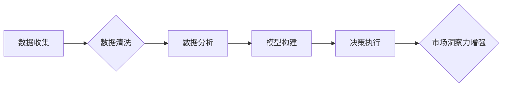

                 

## 1. 背景介绍

在当今信息爆炸的时代，人们面临着前所未有的信息过载。注意力已成为稀缺的资源，而如何有效地获取和利用注意力，成为了企业和个人都面临的重大挑战。数据驱动的决策制定，则为在注意力经济中获取竞争优势提供了新的思路。

传统决策制定往往依赖于经验和直觉，而数据驱动的决策制定则通过收集、分析和挖掘数据，为决策提供更客观、更精准的依据。随着数据采集和分析技术的不断发展，数据驱动的决策制定已成为各行各业的趋势。

## 2. 核心概念与联系

### 2.1 注意力经济

注意力经济是指在信息过载的时代，注意力成为一种稀缺资源，而企业和个人为了获取和利用注意力而展开的竞争。

在注意力经济中，用户注意力是宝贵的资产，而企业需要通过各种方式吸引和留住用户注意力。例如，社交媒体平台通过推送个性化内容、算法推荐等方式，吸引用户持续使用平台；电商平台通过精细化运营、促销活动等方式，吸引用户关注商品和服务。

### 2.2 数据驱动的决策制定

数据驱动的决策制定是指利用数据分析和挖掘技术，为决策提供客观、精准的依据。

数据驱动的决策制定流程通常包括以下几个步骤：

1. 数据收集：收集相关数据，包括内部数据和外部数据。
2. 数据清洗：对收集到的数据进行清洗和处理，去除无效数据和噪声数据。
3. 数据分析：对清洗后的数据进行分析，挖掘数据中的潜在规律和趋势。
4. 模型构建：根据分析结果，构建预测模型或决策模型。
5. 决策执行：根据模型预测结果，进行决策执行。

### 2.3 数据增强市场洞察力

数据驱动的决策制定可以帮助企业增强市场洞察力，更好地理解用户需求、市场趋势和竞争环境。

例如，通过分析用户行为数据，企业可以了解用户的喜好、购买习惯和消费偏好；通过分析市场趋势数据，企业可以预测未来的市场变化和发展方向；通过分析竞争对手数据，企业可以了解竞争对手的优势和劣势，制定相应的应对策略。

**Mermaid 流程图**



## 3. 核心算法原理 & 具体操作步骤

### 3.1 算法原理概述

数据驱动的决策制定中，常用的算法包括机器学习、深度学习、数据挖掘等。这些算法通过学习数据中的模式和规律，预测未来事件或做出决策。

例如，在用户画像分析中，可以使用机器学习算法对用户的行为数据进行分类，构建用户画像模型，从而更好地理解用户的需求和喜好。

### 3.2 算法步骤详解

以机器学习算法为例，其步骤如下：

1. 数据准备：收集、清洗和预处理数据。
2. 模型选择：根据具体问题选择合适的机器学习算法。
3. 模型训练：使用训练数据训练模型，调整模型参数。
4. 模型评估：使用测试数据评估模型性能，选择最佳模型。
5. 模型部署：将训练好的模型部署到生产环境中，用于预测或决策。

### 3.3 算法优缺点

不同的算法具有不同的优缺点，需要根据具体问题选择合适的算法。

例如，线性回归算法简单易用，但对非线性关系的拟合能力较弱；决策树算法可以处理非线性关系，但容易过拟合；神经网络算法可以处理复杂关系，但训练时间长，参数较多。

### 3.4 算法应用领域

数据驱动的决策制定算法广泛应用于各个领域，例如：

* **电商**: 商品推荐、用户画像、价格优化
* **金融**: 风险评估、欺诈检测、信用评分
* **医疗**: 疾病诊断、药物研发、患者画像
* **制造**: 预测性维护、质量控制、生产优化

## 4. 数学模型和公式 & 详细讲解 & 举例说明

### 4.1 数学模型构建

数据驱动的决策制定中，常用的数学模型包括线性回归模型、逻辑回归模型、支持向量机模型等。这些模型通过数学公式来描述数据之间的关系，并进行预测或分类。

例如，线性回归模型假设数据之间存在线性关系，可以用以下公式表示：

$$y = mx + c$$

其中，$y$ 是预测值，$x$ 是输入特征，$m$ 是斜率，$c$ 是截距。

### 4.2 公式推导过程

数学模型的公式推导过程通常基于概率论和统计学原理。例如，线性回归模型的系数$m$和$c$可以通过最小二乘法求解，其目标是使预测值与实际值之间的误差最小。

### 4.3 案例分析与讲解

以用户购买行为预测为例，可以使用线性回归模型预测用户是否会购买某个商品。

假设我们收集了用户年龄、收入、购买历史等数据，并标记了用户是否购买了该商品。我们可以使用线性回归模型将这些数据进行拟合，得到一个预测模型。

然后，对于一个新的用户，我们可以输入其年龄、收入等数据，通过模型预测其是否会购买该商品。

## 5. 项目实践：代码实例和详细解释说明

### 5.1 开发环境搭建

数据驱动的决策制定项目通常需要使用Python语言和相关库，例如Scikit-learn、TensorFlow等。

开发环境搭建包括安装Python、相关库和IDE等。

### 5.2 源代码详细实现

以下是一个使用Scikit-learn库进行用户购买行为预测的代码示例：

```python
from sklearn.linear_model import LogisticRegression
from sklearn.model_selection import train_test_split
from sklearn.metrics import accuracy_score

# 加载数据
data = ...

# 将数据分为特征和标签
X = data[['年龄', '收入', '购买历史']]
y = data['购买商品']

# 将数据分为训练集和测试集
X_train, X_test, y_train, y_test = train_test_split(X, y, test_size=0.2)

# 创建LogisticRegression模型
model = LogisticRegression()

# 训练模型
model.fit(X_train, y_train)

# 预测测试集结果
y_pred = model.predict(X_test)

# 计算模型准确率
accuracy = accuracy_score(y_test, y_pred)
print('模型准确率:', accuracy)
```

### 5.3 代码解读与分析

代码首先加载数据，然后将数据分为特征和标签。接着，将数据分为训练集和测试集，用于训练和评估模型。

然后，创建LogisticRegression模型，并使用训练集训练模型。最后，使用测试集预测结果，并计算模型准确率。

### 5.4 运行结果展示

运行结果会显示模型的准确率，例如：

```
模型准确率: 0.85
```

这表示模型在测试集上的预测准确率为85%。

## 6. 实际应用场景

### 6.1 电商平台

电商平台可以利用数据驱动的决策制定，进行以下应用：

* **商品推荐**: 根据用户的购买历史、浏览记录等数据，推荐用户可能感兴趣的商品。
* **用户画像**: 分析用户的行为数据，构建用户画像，了解用户的喜好、需求和消费偏好。
* **价格优化**: 根据市场需求、竞争对手价格等数据，优化商品价格，提高销售额。

### 6.2 金融机构

金融机构可以利用数据驱动的决策制定，进行以下应用：

* **风险评估**: 分析客户的信用记录、财务状况等数据，评估客户的贷款风险。
* **欺诈检测**: 分析交易数据，识别异常交易，防止欺诈行为。
* **信用评分**: 根据客户的信用记录、行为数据等，构建信用评分模型，评估客户的信用等级。

### 6.3 医疗机构

医疗机构可以利用数据驱动的决策制定，进行以下应用：

* **疾病诊断**: 分析患者的症状、检查结果等数据，辅助医生进行疾病诊断。
* **药物研发**: 分析药物临床试验数据，加速药物研发进程。
* **患者画像**: 分析患者的病史、生活习惯等数据，构建患者画像，提供个性化医疗服务。

### 6.4 未来应用展望

随着数据采集和分析技术的不断发展，数据驱动的决策制定将在更多领域得到应用，例如：

* **教育**: 个性化学习推荐、学生行为分析
* **交通**: 交通流量预测、智能交通管理
* **环境**: 环境污染监测、气候变化预测

## 7. 工具和资源推荐

### 7.1 学习资源推荐

* **书籍**:
    * 《Python机器学习实战》
    * 《数据挖掘：概念与技术》
    * 《深度学习》
* **在线课程**:
    * Coursera
    * edX
    * Udacity

### 7.2 开发工具推荐

* **Python**: 
    * Scikit-learn
    * TensorFlow
    * PyTorch
* **数据可视化工具**:
    * Matplotlib
    * Seaborn
    * Tableau

### 7.3 相关论文推荐

* **Attention Is All You Need**: https://arxiv.org/abs/1706.03762
* **BERT: Pre-training of Deep Bidirectional Transformers for Language Understanding**: https://arxiv.org/abs/1810.04805

## 8. 总结：未来发展趋势与挑战

### 8.1 研究成果总结

数据驱动的决策制定已取得了显著成果，在各个领域得到了广泛应用。

### 8.2 未来发展趋势

未来，数据驱动的决策制定将朝着以下方向发展：

* **更智能化**: 利用人工智能技术，构建更智能的决策模型，提高决策效率和准确性。
* **更个性化**: 根据用户的个性化需求，提供更精准的决策建议。
* **更可解释性**: 提高决策模型的可解释性，帮助用户理解决策背后的逻辑。

### 8.3 面临的挑战

数据驱动的决策制定也面临着一些挑战：

* **数据质量**: 数据质量问题会影响决策模型的准确性。
* **数据隐私**: 如何保护用户数据隐私，是需要认真考虑的问题。
* **算法偏见**: 算法本身可能存在偏见，需要进行公平性评估和修正。

### 8.4 研究展望

未来，需要进一步研究以下问题：

* 如何提高数据质量和数据安全？
* 如何构建更公平、更可解释的决策模型？
* 如何将数据驱动的决策制定与人类决策相结合，发挥协同效应？


## 9. 附录：常见问题与解答

### 9.1 数据清洗

数据清洗是指对收集到的数据进行处理，去除无效数据和噪声数据，使其符合模型的输入要求。

常见的数据清洗方法包括：

* 缺失值处理：删除缺失值、填充缺失值、使用其他方法进行预测。
* 异常值处理：删除异常值、替换异常值、使用其他方法进行处理。
* 数据类型转换：将数据转换为模型所需的类型。

### 9.2 模型评估

模型评估是指使用测试数据评估模型的性能，选择最佳模型。

常用的模型评估指标包括：

* 准确率：正确预测的样本数占总样本数的比例。
* 精度：预测为正样本的样本中，真正为正样本的比例。
* 召回率：所有正样本中，被正确预测为正样本的比例。
* F1-score：精度和召回率的调和平均值。

### 9.3 模型部署

模型部署是指将训练好的模型部署到生产环境中，用于预测或决策。

常用的模型部署方式包括：

* 将模型部署到服务器上，通过API接口提供预测服务。
* 将模型部署到移动设备上，提供离线预测服务。
* 将模型部署到云平台上，利用云平台的计算资源进行预测。


作者：禅与计算机程序设计艺术 / Zen and the Art of Computer Programming 
<end_of_turn>

