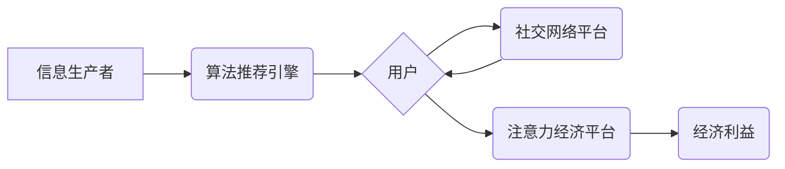
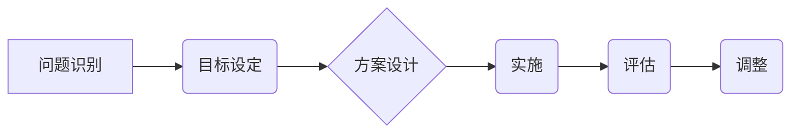

                 

## 1. 背景介绍

在当今信息爆炸的时代，人们面临着前所未有的信息过载。从新闻推送到社交媒体，从广告轰炸到个性化推荐，无处不在的信息流冲击着我们的认知边界，争夺着我们的注意力。这种“注意力经济”的兴起，深刻地改变了人们获取信息、消费内容、进行社交和决策的方式，也对公共政策制定提出了新的挑战和机遇。

传统公共政策制定往往基于对社会整体趋势的宏观分析，侧重于制定针对特定问题的法律法规和社会保障体系。然而，注意力经济的到来，使得信息传播和消费更加碎片化、个性化，人们对信息的获取和处理方式也发生了根本性变化。这使得传统的公共政策制定模式面临着以下挑战：

* **信息获取偏差:**  注意力经济中，信息传播不再是单向的，而是通过算法推荐、社交网络传播等方式进行，容易形成信息茧房，导致人们只接触到符合自身偏好的信息，从而形成认知偏差，难以全面了解社会问题。
* **决策效率低下:**  信息过载和注意力分散，使得人们难以集中精力进行深度思考和理性决策。公共政策的制定需要广泛收集信息、进行深入分析和充分讨论，而注意力经济的负面影响可能会阻碍这一过程。
* **政策效果评估困难:**  注意力经济使得信息传播更加快速、动态，政策效果的评估也变得更加复杂。传统的评估方法难以捕捉到注意力经济带来的变化，需要开发新的指标和方法来衡量政策效果。

## 2. 核心概念与联系

### 2.1 注意力经济

注意力经济是指在信息爆炸的时代，人们的注意力成为一种稀缺资源，而能够有效获取和利用注意力的人或组织能够获得更大的经济利益。

**注意力经济的核心要素:**

* **信息过载:**  信息量爆炸式增长，人们面临着难以处理的信息洪流。
* **注意力稀缺:**  人们的注意力有限，难以集中在所有信息上。
* **注意力竞争:**  各种信息来源争夺人们的注意力，形成竞争关系。
* **注意力价值:**  能够有效获取和利用注意力的人或组织能够获得更大的经济利益。

**注意力经济的运作机制:**

* **算法推荐:**  通过分析用户行为数据，算法推荐引擎将用户感兴趣的信息推送至用户面前，从而吸引用户的注意力。
* **个性化内容:**  根据用户的兴趣爱好和行为特征，提供个性化的内容，提高用户粘性和参与度。
* **社交网络传播:**  通过社交网络平台，信息快速传播，形成病毒式传播效应，吸引更多用户的注意力。

**注意力经济的架构:**



### 2.2 公共政策制定

公共政策制定是指政府根据社会发展需要，制定并实施一系列旨在解决社会问题、促进社会进步的决策和行动。

**公共政策制定的核心要素:**

* **社会问题识别:**  准确识别社会存在的问题，并进行深入分析。
* **政策目标设定:**  明确政策的目标和预期效果。
* **政策方案设计:**  制定可行的政策方案，并进行评估和比较。
* **政策实施:**  将政策方案付诸实施，并建立相应的监督机制。
* **政策效果评估:**  评估政策的效果，并根据评估结果进行调整和改进。

**公共政策制定的流程:**



## 3. 核心算法原理 & 具体操作步骤

### 3.1 算法原理概述

注意力机制是一种模仿人类注意力机制的算法，它能够学习到哪些信息对任务更重要，并对这些信息给予更多的关注。

**注意力机制的核心思想:**

* **权重分配:**  注意力机制通过学习一个权重向量，对输入信息进行加权，将重要信息赋予更高的权重，将不重要信息赋予较低的权重。
* **上下文依赖:**  注意力机制能够学习到输入信息之间的上下文关系，从而更好地理解信息的含义。
* **可解释性:**  注意力机制能够提供可解释性，即可以直观地看到模型对哪些信息给予了更多的关注。

### 3.2 算法步骤详解

**注意力机制的具体操作步骤:**

1. **计算注意力权重:**  根据输入信息和查询向量，计算每个输入信息的注意力权重。
2. **加权求和:**  将每个输入信息与其注意力权重相乘，并求和，得到上下文向量。
3. **输出预测:**  使用上下文向量作为输入，进行预测或分类。

### 3.3 算法优缺点

**注意力机制的优点:**

* **能够学习到重要信息:**  注意力机制能够学习到输入信息中哪些信息对任务更重要，并对这些信息给予更多的关注。
* **能够处理长序列数据:**  注意力机制能够有效地处理长序列数据，例如文本和语音。
* **能够提高模型的性能:**  注意力机制能够提高模型的性能，例如机器翻译、文本摘要和问答系统。

**注意力机制的缺点:**

* **计算复杂度高:**  注意力机制的计算复杂度较高，尤其是在处理长序列数据时。
* **参数量大:**  注意力机制的参数量较大，需要大量的训练数据才能有效训练。
* **可解释性有限:**  虽然注意力机制能够提供可解释性，但其注意力权重的含义仍然难以完全理解。

### 3.4 算法应用领域

注意力机制在许多领域都有广泛的应用，例如:

* **自然语言处理:**  机器翻译、文本摘要、问答系统、情感分析等。
* **计算机视觉:**  图像识别、目标检测、图像 Captioning 等。
* **语音识别:**  语音转文本、语音合成等。
* **推荐系统:**  个性化推荐、内容过滤等。

## 4. 数学模型和公式 & 详细讲解 & 举例说明

### 4.1 数学模型构建

注意力机制的数学模型可以概括为以下公式:

$$
\text{Attention}(Q, K, V) = \text{softmax}\left(\frac{Q K^T}{\sqrt{d_k}}\right) V
$$

其中:

* $Q$：查询向量
* $K$：键向量
* $V$：值向量
* $d_k$：键向量的维度
* $\text{softmax}$：softmax 函数，用于将注意力权重归一化到 [0, 1] 之间。

### 4.2 公式推导过程

注意力机制的公式推导过程如下:

1. 计算查询向量 $Q$ 和键向量 $K$ 的点积，即 $QK^T$。
2. 将点积结果除以 $\sqrt{d_k}$，以规范化向量长度。
3. 应用 softmax 函数对点积结果进行归一化，得到注意力权重向量。
4. 将注意力权重向量与值向量 $V$ 进行加权求和，得到上下文向量。

### 4.3 案例分析与讲解

**举例说明:**

假设我们有一个句子 "The cat sat on the mat"，我们想使用注意力机制来理解这句话中每个词语对句子的整体含义。

1. 将句子中的每个词语转换为词向量，作为 $V$。
2. 选择一个查询向量 $Q$，例如 "sat" 的词向量。
3. 计算 $Q$ 和每个词语的词向量 $V$ 的点积，得到注意力权重向量。
4. 将注意力权重向量与每个词语的词向量 $V$ 进行加权求和，得到上下文向量。

通过上下文向量，我们可以更好地理解 "sat" 这个词语在句子中的含义，以及它与其他词语之间的关系。

## 5. 项目实践：代码实例和详细解释说明

### 5.1 开发环境搭建

* Python 3.6+
* TensorFlow 或 PyTorch

### 5.2 源代码详细实现

```python
import tensorflow as tf

# 定义注意力机制层
class Attention(tf.keras.layers.Layer):
    def __init__(self, units):
        super(Attention, self).__init__()
        self.W1 = tf.keras.layers.Dense(units)
        self.W2 = tf.keras.layers.Dense(units)
        self.V = tf.keras.layers.Dense(1)

    def call(self, query, key, value, mask=None):
        # 计算注意力权重
        scores = self.V(tf.nn.tanh(self.W1(query) + self.W2(key)))
        if mask is not None:
            scores = scores * mask - 1e9 * (1 - mask)
        attention_weights = tf.nn.softmax(scores, axis=-1)
        # 加权求和
        context = attention_weights * value
        return tf.reduce_sum(context, axis=-2)

# 使用注意力机制
query = tf.random.normal([1, 5, 128])
key = tf.random.normal([1, 5, 128])
value = tf.random.normal([1, 5, 64])
attention = Attention(units=64)
context = attention(query, key, value)
print(context.shape)
```

### 5.3 代码解读与分析

* `Attention` 类定义了一个注意力机制层，包含三个稠密层 `W1`、`W2` 和 `V`。
* `call` 方法计算注意力权重并进行加权求和，得到上下文向量。
* `tf.nn.tanh` 函数用于激活函数。
* `tf.nn.softmax` 函数用于归一化注意力权重。
* `mask` 参数用于屏蔽不需要关注的信息。

### 5.4 运行结果展示

运行代码后，会输出一个形状为 `(1, 64)` 的上下文向量。

## 6. 实际应用场景

### 6.1  新闻推荐系统

注意力机制可以帮助新闻推荐系统更好地理解用户的兴趣偏好，并推荐更相关的新闻内容。

### 6.2  个性化教育

注意力机制可以帮助个性化教育系统根据学生的学习进度和理解能力，提供个性化的学习内容和辅导。

### 6.3  医疗诊断

注意力机制可以帮助医疗诊断系统识别病人的关键症状和体征，提高诊断的准确性。

### 6.4  未来应用展望

注意力机制在公共政策制定领域还有许多潜在的应用场景，例如:

* **政策目标识别:**  注意力机制可以帮助识别社会问题和政策目标的关键信息。
* **政策方案设计:**  注意力机制可以帮助评估不同政策方案的优缺点，并选择最有效的方案。
* **政策效果评估:**  注意力机制可以帮助分析政策效果的关键因素，并改进政策制定和实施。

## 7. 工具和资源推荐

### 7.1 学习资源推荐

* **书籍:**  "深度学习" by Ian Goodfellow, Yoshua Bengio, and Aaron Courville
* **在线课程:**  Coursera, edX, Udacity

### 7.2 开发工具推荐

* **TensorFlow:**  https://www.tensorflow.org/
* **PyTorch:**  https://pytorch.org/

### 7.3 相关论文推荐

* "Attention Is All You Need" by Vaswani et al. (2017)
* "BERT: Pre-training of Deep Bidirectional Transformers for Language Understanding" by Devlin et al. (2018)

## 8. 总结：未来发展趋势与挑战

### 8.1 研究成果总结

注意力机制在自然语言处理、计算机视觉等领域取得了显著的成果，并逐渐应用于公共政策制定领域。

### 8.2 未来发展趋势

* **更强大的注意力机制:**  研究人员将继续探索更强大的注意力机制，例如自注意力机制、多头注意力机制等。
* **注意力机制的解释性:**  研究人员将致力于提高注意力机制的可解释性，以便更好地理解模型的决策过程。
* **注意力机制的应用扩展:**  注意力机制将应用于更多领域，例如医疗诊断、金融预测等。

### 8.3 面临的挑战

* **计算复杂度:**  注意力机制的计算复杂度较高，需要更高效的算法和硬件支持。
* **数据需求:**  注意力机制需要大量的训练数据才能有效训练。
* **伦理问题:**  注意力机制可能被用于操纵用户行为，需要关注其伦理问题。

### 8.4 研究展望

未来，注意力机制将在公共政策制定领域发挥越来越重要的作用，帮助政府制定更有效的政策，更好地服务于人民。


## 9. 附录：常见问题与解答

**Q1: 注意力机制与传统机器学习模型有什么区别？**

**A1:**  传统机器学习模型通常假设输入信息是独立同分布的，而注意力机制能够学习到输入信息之间的上下文关系，并对重要信息给予更多的关注。

**Q2: 注意力机制的计算复杂度如何降低？**

**A2:**  研究人员正在探索更有效的注意力机制算法，例如局部注意力机制、稀疏注意力机制等，以降低计算复杂度。

**Q3: 注意力机制的伦理问题有哪些？**

**A3:**  注意力机制可能被用于操纵用户行为，例如推送虚假信息、制造网络舆论等。因此，需要关注其伦理问题，并制定相应的规范和制度。


作者：禅与计算机程序设计艺术 / Zen and the Art of Computer Programming 
<end_of_turn>

