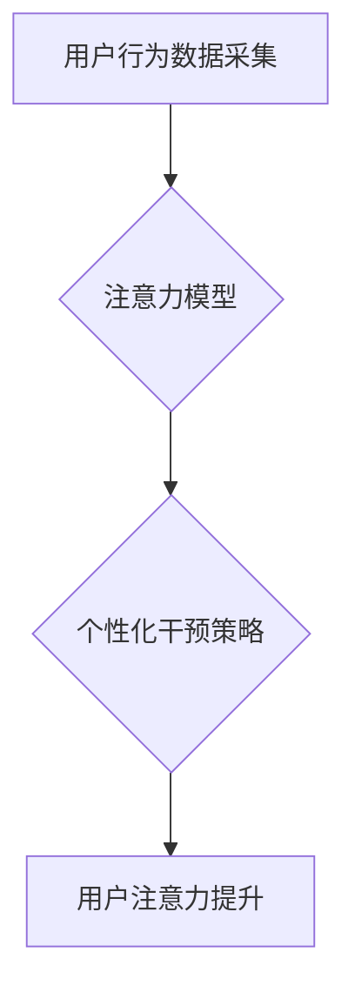

                 

## 注意力训练：AI辅助的专注力提升

> 关键词：注意力、AI、专注力、深度学习、神经网络、认知增强、脑机接口

### 1. 背景介绍

在当今信息爆炸的时代，人类面临着前所未有的注意力挑战。来自社交媒体、电子邮件、新闻推送等各种信息源的不断干扰，使得专注力成为稀缺资源。注意力训练，即通过刻意练习和训练来增强注意力能力，已成为提升个人效率和应对信息过载的重要手段。

传统的注意力训练方法主要依赖于冥想、正念练习等自我调节方式，虽然有一定效果，但效果往往有限且需要长时间的坚持。近年来，随着人工智能技术的飞速发展，AI辅助的注意力训练方法逐渐崭露头角，为提升注意力能力提供了新的可能性。

### 2. 核心概念与联系

AI辅助的注意力训练的核心概念是利用人工智能算法分析用户的行为模式，识别注意力流失的征兆，并提供个性化的干预措施，帮助用户集中注意力。

**核心概念：**

* **注意力：** 指对特定信息或任务的集中和选择性关注。
* **深度学习：** 一种机器学习方法，利用多层神经网络模拟人类大脑的学习过程。
* **神经网络：** 由多个相互连接的神经元组成的网络结构，能够学习复杂的数据模式。
* **行为分析：** 通过分析用户的行为数据，例如鼠标移动、键盘输入、眼球追踪等，识别注意力流失的迹象。
* **个性化干预：** 根据用户的注意力模式，提供个性化的干预措施，例如提示、提醒、环境调整等。

**核心架构：**



### 3. 核心算法原理 & 具体操作步骤

#### 3.1 算法原理概述

AI辅助注意力训练的核心算法通常基于深度学习模型，例如循环神经网络（RNN）和卷积神经网络（CNN）。这些模型能够学习用户行为数据中的复杂模式，并预测用户的注意力状态。

#### 3.2 算法步骤详解

1. **数据采集：** 收集用户的行为数据，例如鼠标移动、键盘输入、眼球追踪、脑电波等。
2. **数据预处理：** 对收集到的数据进行清洗、转换和特征提取，以便于模型训练。
3. **模型训练：** 利用深度学习算法训练注意力模型，使模型能够准确预测用户的注意力状态。
4. **注意力状态识别：** 将用户的实时行为数据输入到训练好的注意力模型中，识别用户的注意力状态，例如集中、分散、疲劳等。
5. **个性化干预：** 根据用户的注意力状态，提供个性化的干预措施，例如提示、提醒、环境调整等。
6. **效果评估：** 通过评估用户的注意力提升效果，不断优化模型和干预策略。

#### 3.3 算法优缺点

**优点：**

* **个性化：** 可以根据用户的注意力模式提供个性化的干预措施。
* **实时性：** 可以实时识别用户的注意力状态，并及时提供干预。
* **可扩展性：** 可以集成多种数据源，例如眼球追踪、脑电波等，提高注意力识别精度。

**缺点：**

* **数据依赖：** 需要大量的用户行为数据进行模型训练。
* **隐私问题：** 收集和使用用户行为数据可能涉及隐私问题。
* **技术复杂性：** 需要专业的技术人员进行模型开发和维护。

#### 3.4 算法应用领域

AI辅助注意力训练算法在以下领域具有广泛的应用前景：

* **教育：** 帮助学生集中注意力，提高学习效率。
* **工作：** 帮助员工提高工作效率，减少分心。
* **医疗：** 帮助患者集中注意力，进行康复训练。
* **游戏：** 提升玩家的游戏体验，增强沉浸感。

### 4. 数学模型和公式 & 详细讲解 & 举例说明

#### 4.1 数学模型构建

注意力机制通常使用一个加权机制来分配不同输入的权重，从而突出重要的信息。一个常见的数学模型是基于softmax函数的注意力机制：

$$
\text{Attention}(Q, K, V) = \text{softmax}\left(\frac{Q K^T}{\sqrt{d_k}}\right) V
$$

其中：

* $Q$：查询向量
* $K$：键向量
* $V$：值向量
* $d_k$：键向量的维度
* $\text{softmax}$：softmax函数，将向量元素映射到0到1之间，并保证元素和为1。

#### 4.2 公式推导过程

该公式的推导过程基于以下原理：

1. 计算查询向量 $Q$ 与键向量 $K$ 的点积，得到一个得分矩阵。
2. 对得分矩阵进行归一化，使用softmax函数将得分映射到概率分布。
3. 将概率分布与值向量 $V$ 进行加权求和，得到最终的注意力输出。

#### 4.3 案例分析与讲解

例如，在机器翻译任务中，可以使用注意力机制来分配源语言句子中每个词的权重，从而更好地理解目标语言的含义。

### 5. 项目实践：代码实例和详细解释说明

#### 5.1 开发环境搭建

* Python 3.x
* TensorFlow 或 PyTorch 深度学习框架
* Jupyter Notebook 或 VS Code 代码编辑器

#### 5.2 源代码详细实现

```python
import tensorflow as tf

# 定义注意力机制模型
class Attention(tf.keras.layers.Layer):
    def __init__(self, units):
        super(Attention, self).__init__()
        self.Wq = tf.keras.layers.Dense(units)
        self.Wk = tf.keras.layers.Dense(units)
        self.Wv = tf.keras.layers.Dense(units)
        self.fc = tf.keras.layers.Dense(1)

    def call(self, query, key, value):
        # 计算注意力权重
        scores = tf.matmul(self.Wq(query), self.Wk(key), transpose_b=True)
        scores = scores / tf.math.sqrt(tf.cast(self.Wq.output_shape[-1], tf.float32))
        attention_weights = tf.nn.softmax(scores, axis=-1)

        # 计算加权求和
        context_vector = tf.matmul(attention_weights, value)
        return context_vector

# 实例化注意力机制模型
attention_layer = Attention(units=128)

# 输入数据
query = tf.random.normal(shape=(1, 10, 128))
key = tf.random.normal(shape=(1, 10, 128))
value = tf.random.normal(shape=(1, 10, 128))

# 计算注意力输出
output = attention_layer(query, key, value)
```

#### 5.3 代码解读与分析

* 该代码定义了一个注意力机制模型，包含三个稠密层和一个softmax层。
* 首先，三个稠密层分别将查询向量、键向量和值向量映射到相同的维度。
* 然后，计算查询向量与键向量的点积，并进行归一化，得到注意力权重。
* 最后，将注意力权重与值向量进行加权求和，得到最终的注意力输出。

#### 5.4 运行结果展示

运行该代码，会输出注意力机制模型的输出结果，是一个形状为 (1, 10, 128) 的张量。

### 6. 实际应用场景

#### 6.1 教育领域

* **智能辅导系统：** 根据学生的学习状态，提供个性化的学习建议和干预措施，帮助学生集中注意力，提高学习效率。
* **在线课程平台：** 利用注意力机制分析学生的学习行为，识别学生的注意力流失点，并提供相应的提示和提醒，帮助学生更好地理解课程内容。

#### 6.2 工作领域

* **办公软件：** 集成注意力训练功能，帮助用户集中注意力，提高工作效率，减少分心。
* **远程协作工具：** 利用注意力机制分析用户的参与度，识别潜在的注意力问题，并提供相应的提醒和干预措施，促进团队协作效率。

#### 6.3 医疗领域

* **康复训练：** 利用注意力训练帮助患者集中注意力，进行康复训练，提高治疗效果。
* **心理健康治疗：** 利用注意力训练帮助患者缓解焦虑、抑郁等心理问题，提高心理健康水平。

#### 6.4 未来应用展望

随着人工智能技术的不断发展，AI辅助注意力训练方法将有更广泛的应用前景，例如：

* **脑机接口：** 利用脑电波数据进行注意力训练，实现人机交互的新模式。
* **虚拟现实/增强现实：** 利用注意力机制增强虚拟现实和增强现实体验，提高沉浸感。
* **个性化教育：** 根据学生的注意力模式，提供个性化的学习方案，实现精准教育。

### 7. 工具和资源推荐

#### 7.1 学习资源推荐

* **书籍：**
    * 《深度学习》 by Ian Goodfellow, Yoshua Bengio, and Aaron Courville
    * 《Attention Is All You Need》 by Vaswani et al.
* **在线课程：**
    * Coursera: Deep Learning Specialization
    * Udacity: Deep Learning Nanodegree

#### 7.2 开发工具推荐

* **TensorFlow:** https://www.tensorflow.org/
* **PyTorch:** https://pytorch.org/
* **Jupyter Notebook:** https://jupyter.org/

#### 7.3 相关论文推荐

* **Attention Is All You Need:** https://arxiv.org/abs/1706.03762
* **BERT: Pre-training of Deep Bidirectional Transformers for Language Understanding:** https://arxiv.org/abs/1810.04805

### 8. 总结：未来发展趋势与挑战

#### 8.1 研究成果总结

AI辅助注意力训练方法取得了显著的成果，能够有效提升用户的注意力能力，并应用于多个领域。

#### 8.2 未来发展趋势

* **更精准的注意力识别：** 利用多模态数据，例如眼球追踪、脑电波等，提高注意力识别的精准度。
* **更个性化的干预措施：** 根据用户的注意力模式，提供更个性化的干预措施，例如声音提示、视觉提示、环境调整等。
* **更有效的注意力训练方法：** 开发更有效的注意力训练方法，例如基于游戏化的注意力训练、基于脑机接口的注意力训练等。

#### 8.3 面临的挑战

* **数据隐私问题：** 收集和使用用户行为数据可能涉及隐私问题，需要采取相应的措施保护用户隐私。
* **算法解释性问题：** 深度学习模型的决策过程往往难以解释，需要开发更可解释的注意力模型。
* **技术可普及性问题：** AI辅助注意力训练技术目前仍处于发展阶段，需要进一步降低技术门槛，使其更易于普及。

#### 8.4 研究展望

未来，AI辅助注意力训练方法将继续发展，并应用于更多领域，为人类提供更有效的注意力提升解决方案。


### 9. 附录：常见问题与解答

**Q1：AI辅助注意力训练是否安全？**

A1：AI辅助注意力训练方法的安全性和隐私性是需要认真考虑的问题。选择信誉良好的开发商，并仔细阅读隐私政策，了解数据的收集、使用和存储方式。

**Q2：AI辅助注意力训练是否适合所有人？**

A2：AI辅助注意力训练方法可能对不同的人群效果有所差异。对于注意力问题较为严重的人群，建议咨询专业医生。

**Q3：AI辅助注意力训练需要花费多少时间才能看到效果？**

A3：AI辅助注意力训练的效果因人而异，一般需要持续练习一段时间才能看到明显的效果。

**Q4：AI辅助注意力训练有哪些潜在的副作用？**

A4：目前还没有明确的证据表明AI辅助注意力训练存在明显的副作用。但过度使用注意力训练方法可能会导致注意力过度集中，影响其他方面的活动。

**Q5：AI辅助注意力训练的未来发展趋势是什么？**

A5：AI辅助注意力训练的未来发展趋势包括更精准的注意力识别、更个性化的干预措施、更有效的注意力训练方法等。


作者：禅与计算机程序设计艺术 / Zen and the Art of Computer Programming 
<end_of_turn>

