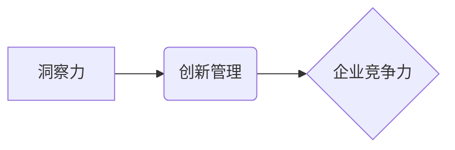

                 

## 洞察力与创新管理：企业竞争力的源泉

> 关键词：洞察力、创新管理、企业竞争力、数据分析、人工智能、机器学习、敏捷开发、流程优化

## 1. 背景介绍

在当今瞬息万变的商业环境中，企业竞争力已不再仅仅取决于产品质量、价格优势或市场份额，而是更依赖于对市场趋势、客户需求和技术变革的敏锐洞察力和高效的创新管理。 

传统企业管理模式往往注重流程标准化、效率优化和成本控制，而忽视了对新兴技术的探索和对市场变化的快速响应。随着人工智能、大数据、云计算等技术的快速发展，企业面临着前所未有的机遇和挑战。如何利用这些新兴技术，洞察市场趋势，激发创新，提升企业竞争力，已成为企业家和管理者共同关注的焦点。

## 2. 核心概念与联系

**2.1 洞察力**

洞察力是指通过分析数据、识别模式和理解趋势，获得对复杂问题的深刻理解和前瞻性见解的能力。它不仅是基于数据分析，更需要具备批判性思维、创造力和联想能力，才能将数据转化为有价值的行动指导。

**2.2 创新管理**

创新管理是指企业在组织结构、流程机制、文化氛围等方面进行优化，以促进创新活动的产生、发展和转化为实际成果的管理体系。它强调以人为本、鼓励尝试、激发创造力和持续改进。

**2.3 企业竞争力**

企业竞争力是指企业在市场竞争中获得优势和成功的综合能力，包括产品创新能力、市场营销能力、运营效率、品牌影响力、人才优势等多方面因素。

**2.4 核心概念关系图**



## 3. 核心算法原理 & 具体操作步骤

**3.1 算法原理概述**

洞察力与创新管理的核心算法原理是基于数据分析和机器学习。通过收集、清洗、分析和挖掘海量数据，可以识别出市场趋势、客户需求和潜在机会，为企业创新提供决策依据。

**3.2 算法步骤详解**

1. **数据收集:** 从各种渠道收集相关数据，例如市场调研数据、销售数据、客户反馈数据、社交媒体数据等。
2. **数据清洗:** 对收集到的数据进行清洗和预处理，去除噪声、缺失值和重复数据，确保数据质量。
3. **数据分析:** 使用统计分析、数据挖掘和机器学习算法对数据进行分析，识别出潜在的模式、趋势和关系。
4. **洞察力生成:** 将分析结果转化为可理解的洞察力，例如市场趋势预测、客户需求分析、产品改进建议等。
5. **创新决策:** 基于洞察力，制定创新策略、开发新产品、优化服务、提升运营效率等。

**3.3 算法优缺点**

**优点:**

* **数据驱动:** 基于数据分析，能够提供更客观、更准确的洞察力。
* **效率提升:** 自动化数据分析流程，提高效率，节省人力成本。
* **预测能力:** 通过机器学习算法，可以预测未来市场趋势和客户需求。

**缺点:**

* **数据依赖:** 算法效果依赖于数据质量，数据不足或不准确会导致分析结果偏差。
* **算法复杂:** 需要专业的技术人员进行算法设计和模型训练。
* **解释性:** 一些机器学习算法的决策过程难以解释，难以获得对洞察力的深入理解。

**3.4 算法应用领域**

* **市场营销:** 预测市场趋势、分析客户行为、精准营销。
* **产品开发:** 识别客户需求、开发新产品、优化产品设计。
* **运营管理:** 优化供应链、提高生产效率、降低运营成本。
* **风险管理:** 识别潜在风险、预测风险发生概率、制定风险应对策略。

## 4. 数学模型和公式 & 详细讲解 & 举例说明

**4.1 数学模型构建**

在洞察力与创新管理中，可以使用多种数学模型来描述和分析复杂系统。例如，可以使用**贝叶斯网络**来建模市场趋势和客户需求之间的关系，可以使用**聚类算法**来识别客户群体，可以使用**回归分析**来预测销售额。

**4.2 公式推导过程**

例如，可以使用**线性回归模型**来预测销售额。线性回归模型的公式如下：

$$
y = mx + b
$$

其中：

* $y$ 是销售额
* $x$ 是广告投入
* $m$ 是广告投入对销售额的影响系数
* $b$ 是截距

通过对历史数据进行线性回归分析，可以得到 $m$ 和 $b$ 的值，从而预测未来销售额。

**4.3 案例分析与讲解**

例如，一家电商公司想要预测未来三个月的销售额。他们收集了过去一年的销售数据和广告投入数据，并使用线性回归模型进行分析。分析结果显示，广告投入对销售额的影响系数为 0.5，截距为 1000。

因此，如果该公司在未来三个月投入 10000 元的广告，预计销售额为：

$$
y = 0.5 * 10000 + 1000 = 6000
$$

## 5. 项目实践：代码实例和详细解释说明

**5.1 开发环境搭建**

* 操作系统: Ubuntu 20.04
* Python 版本: 3.8
* 必要的库: pandas, numpy, scikit-learn

**5.2 源代码详细实现**

```python
import pandas as pd
from sklearn.linear_model import LinearRegression

# 加载数据
data = pd.read_csv('sales_data.csv')

# 准备数据
X = data[['广告投入']]
y = data['销售额']

# 创建线性回归模型
model = LinearRegression()

# 训练模型
model.fit(X, y)

# 获取模型参数
m = model.coef_[0]
b = model.intercept_

# 预测未来销售额
future_investment = 10000
predicted_sales = m * future_investment + b

# 打印结果
print(f'预测的销售额: {predicted_sales}')
```

**5.3 代码解读与分析**

* 代码首先加载销售数据，并将其转换为 pandas 数据框。
* 然后，代码将广告投入作为特征变量 (X)，销售额作为目标变量 (y)。
* 使用 scikit-learn 库中的 LinearRegression 类创建线性回归模型。
* 使用 `fit()` 方法训练模型，将训练数据 (X, y) 作为输入。
* 使用 `coef_` 和 `intercept_` 属性获取模型参数 m 和 b。
* 最后，使用模型预测未来销售额，并打印结果。

**5.4 运行结果展示**

运行上述代码后，将输出预测的销售额值。

## 6. 实际应用场景

**6.1 市场趋势预测**

利用数据分析和机器学习算法，可以预测未来市场趋势，例如产品需求、消费行为、竞争格局等。

**6.2 客户需求分析**

通过分析客户数据，可以识别客户群体、了解客户需求和偏好，为产品开发和营销策略提供指导。

**6.3 产品改进建议**

收集用户反馈数据，分析产品使用情况，可以识别产品缺陷和改进方向，提升产品质量和用户体验。

**6.4 未来应用展望**

随着人工智能、大数据和云计算技术的不断发展，洞察力与创新管理将发挥更加重要的作用。未来，企业将更加注重数据驱动决策、敏捷开发和持续创新，利用技术手段提升企业竞争力。

## 7. 工具和资源推荐

**7.1 学习资源推荐**

* **书籍:**
    * 《数据科学实战》
    * 《机器学习实战》
    * 《创新管理》
* **在线课程:**
    * Coursera: 数据科学、机器学习
    * edX: 创新管理、商业分析

**7.2 开发工具推荐**

* **数据分析工具:**
    * Python (pandas, numpy, scikit-learn)
    * R
    * Tableau
* **机器学习平台:**
    * TensorFlow
    * PyTorch
    * Azure Machine Learning

**7.3 相关论文推荐**

* **数据分析与洞察力:**
    * "Data Mining: Concepts and Techniques" by Jiawei Han, Micheline Kamber, and Jian Pei
* **机器学习与创新管理:**
    * "Machine Learning for Innovation Management" by David G. Stork

## 8. 总结：未来发展趋势与挑战

**8.1 研究成果总结**

洞察力与创新管理是企业竞争力的关键驱动力。通过数据分析和机器学习，企业可以获得对市场趋势、客户需求和技术变革的深刻洞察，激发创新，提升企业竞争力。

**8.2 未来发展趋势**

* **人工智能技术的进一步发展:** 人工智能将更加深入地融入到洞察力与创新管理中，例如自动生成洞察力、预测未来趋势、辅助决策等。
* **数据分析技术的不断创新:** 新兴的数据分析技术，例如深度学习、自然语言处理等，将为洞察力与创新管理提供更强大的工具。
* **敏捷开发和持续创新的理念:** 企业将更加注重敏捷开发和持续创新的理念，利用技术手段快速响应市场变化，不断迭代产品和服务。

**8.3 面临的挑战**

* **数据质量问题:** 数据分析结果的准确性依赖于数据质量，如何保证数据准确、完整和可靠是关键挑战。
* **算法解释性问题:** 一些机器学习算法的决策过程难以解释，难以获得对洞察力的深入理解，需要进一步研究算法可解释性。
* **人才短缺问题:** 数据分析和机器学习领域人才短缺，需要加强人才培养和引进。

**8.4 研究展望**

未来，洞察力与创新管理的研究将更加注重以下方面:

* **开发更有效的算法和模型:** 研究更准确、更高效、更可解释的算法和模型，提高洞察力与创新管理的效率和准确性。
* **探索人工智能与人类合作的新模式:** 研究人工智能与人类如何协同工作，发挥各自优势，共同完成洞察力与创新管理任务。
* **构建更完善的洞察力与创新管理体系:** 研究如何将洞察力与创新管理融入到企业的战略规划、组织结构、流程机制和文化氛围中，形成一个完整的体系。

## 9. 附录：常见问题与解答

**9.1 如何保证数据质量？**

数据质量是数据分析的基础，需要从数据收集、清洗、存储和使用各个环节进行保障。

* **数据收集:** 选择可靠的数据来源，确保数据完整性和准确性。
* **数据清洗:** 对数据进行清洗和预处理，去除噪声、缺失值和重复数据。
* **数据存储:** 使用安全的数据库系统存储数据，防止数据丢失和篡改。
* **数据使用:** 在使用数据时，需要进行严格的验证和校验，确保数据准确性。

**9.2 如何解释机器学习算法的决策结果？**

一些机器学习算法的决策过程难以解释，可以使用以下方法进行解释：

* **特征重要性分析:** 分析哪些特征对模型决策的影响最大，可以帮助理解模型的决策逻辑。
* **局部解释:** 对单个预测结果进行解释，分析模型是如何得出该预测结果的。
* **可解释模型:** 使用可解释的机器学习模型，例如决策树、线性回归等，可以更容易地理解模型的决策过程。


作者：禅与计算机程序设计艺术 / Zen and the Art of Computer Programming<end_of_turn>

