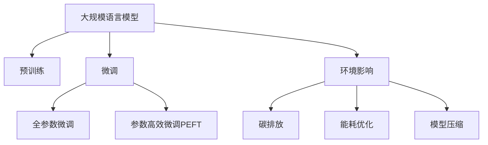

                 

# 大规模语言模型的环境影响

> 关键词：大规模语言模型,环境影响,人工智能,碳排放,能耗优化,模型压缩,可持续发展

## 1. 背景介绍

### 1.1 问题由来
随着人工智能(AI)技术在各个领域的广泛应用，大规模语言模型(Massive Language Models, MLMs)因其强大的自然语言处理能力，迅速成为研究与工业界的热点。然而，MLMs的大规模训练和运行需要巨量的计算资源和能源消耗，对环境造成显著影响。如何平衡MLMs的发展与环境保护，成为当前一个亟待解决的问题。

### 1.2 问题核心关键点
本文旨在探讨大规模语言模型在训练和运行过程中对环境的影响，分析其对碳排放、能耗、资源消耗等方面的影响，并提出相应的优化策略。通过对MLMs的环境影响进行评估，可以为可持续发展提供科学依据，推动AI技术的绿色化发展。

## 2. 核心概念与联系

### 2.1 核心概念概述

为更好地理解MLMs对环境的影响，本节将介绍几个密切相关的核心概念：

- **大规模语言模型(Massive Language Models, MLMs)**：指通过大量无监督学习任务（如自回归、自编码等）预训练得到的庞大参数模型，具备强大的语言理解和生成能力。

- **预训练(Pre-training)**：指在大规模无标签文本语料上进行自监督学习任务训练通用语言模型的过程。常见预训练任务包括掩码语言模型、自回归语言模型等。

- **微调(Fine-tuning)**：指在预训练模型的基础上，使用下游任务的少量标注数据，通过有监督学习优化模型在特定任务上的性能。

- **碳排放(Carbon Emission)**：指在计算过程中，由数据中心供电、设备冷却和废物处理等环节产生的温室气体排放。

- **能耗(Energy Consumption)**：指计算过程中，由数据中心供电、设备运行和数据传输等环节产生的电力消耗。

- **模型压缩(Model Compression)**：指通过剪枝、量化、知识蒸馏等技术，减少模型参数量和计算量，降低能耗和碳排放。

- **可持续发展(Sustainable Development)**：指在推动AI技术发展的同时，兼顾环境保护，确保技术的长期可持续性。

这些核心概念之间的逻辑关系可以通过以下Mermaid流程图来展示：



这个流程图展示了MLMs的核心概念及其与环境影响的联系：

1. MLMs通过预训练获得基础能力。
2. 微调是对预训练模型进行任务特定的优化，可以分为全参数微调和参数高效微调（PEFT）。
3. 环境影响包括碳排放、能耗等。
4. 通过优化训练过程，减少碳排放和能耗。
5. 压缩模型以降低资源消耗。

这些概念共同构成了MLMs的环境影响分析框架，使其能够在发展的过程中兼顾环境保护，推动技术的绿色化发展。

## 3. 核心算法原理 & 具体操作步骤
### 3.1 算法原理概述

MLMs的环境影响主要体现在计算资源消耗上，包括数据中心的能耗和碳排放。预训练和微调过程是MLMs的两个主要计算密集型阶段，涉及大量的数据处理和模型更新，对环境产生显著影响。

预训练阶段主要通过深度学习模型在大规模数据集上进行训练，学习到丰富的语言表示。微调阶段则是在预训练模型的基础上，针对特定任务进行优化，进一步提升模型性能。这两个阶段对环境的总体影响主要体现在以下几个方面：

- **数据中心能耗**：大规模数据集的处理和模型训练需要大量的电力支持，数据中心成为全球碳排放的重要来源。
- **碳排放**：数据中心的运行过程中会产生大量的温室气体排放，对气候变化产生影响。
- **资源消耗**：大规模模型训练需要大量的GPU/TPU等高性能设备，这些设备本身也存在能耗和碳排放问题。

### 3.2 算法步骤详解

MLMs的环境影响评估一般包括以下几个关键步骤：

**Step 1: 准备环境数据**

- 收集数据中心的能源消耗数据，包括供电、冷却和废物处理等环节的能耗。
- 收集模型训练的能耗数据，包括前向传播、反向传播、模型更新等环节的能耗。
- 收集碳排放数据，包括电力生产、数据中心建设和运行过程中产生的温室气体排放。

**Step 2: 模型训练与运行评估**

- 使用TensorBoard等工具监测模型训练和运行过程中的能耗和碳排放。
- 使用CO2 footprint计算工具评估模型训练过程中的碳足迹。
- 使用深度学习能效分析工具评估模型在不同设备上的能效表现。

**Step 3: 优化策略制定**

- 通过剪枝、量化等技术压缩模型，减少参数量和计算量。
- 使用知识蒸馏等技术将模型知识传递给更小的模型，降低资源消耗。
- 优化模型训练过程，如使用混合精度训练、梯度累积等技术，提高能效。

**Step 4: 部署与监控**

- 部署优化后的模型，在实际应用中监测其能耗和碳排放情况。
- 使用自动化工具定期监测模型性能，及时调整参数和部署策略。

### 3.3 算法优缺点

MLMs的环境影响评估具有以下优点：
1. 系统性评估模型的资源消耗和环境影响。
2. 推动模型压缩和优化技术的发展，提高能效。
3. 提供科学依据，指导MLMs的可持续发展。

同时，该方法也存在一定的局限性：
1. 依赖于准确的环境数据，数据获取和处理可能存在误差。
2. 模型优化策略可能需要在精度和能效之间进行权衡。
3. 优化效果可能受到硬件和软件限制。
4. 模型压缩可能降低模型性能，影响应用效果。

尽管存在这些局限性，但MLMs的环境影响评估已成为推动AI技术可持续发展的重要手段，未来相关研究的重点在于如何进一步提高评估的准确性和实用性，以及如何在实践中最大化地降低环境影响。

### 3.4 算法应用领域

MLMs的环境影响评估方法在NLP领域已经得到了广泛的应用，覆盖了几乎所有常见任务，例如：

- 文本分类：如情感分析、主题分类、意图识别等。通过微调使模型学习文本-标签映射。
- 命名实体识别：识别文本中的人名、地名、机构名等特定实体。通过微调使模型掌握实体边界和类型。
- 关系抽取：从文本中抽取实体之间的语义关系。通过微调使模型学习实体-关系三元组。
- 问答系统：对自然语言问题给出答案。将问题-答案对作为微调数据，训练模型学习匹配答案。
- 机器翻译：将源语言文本翻译成目标语言。通过微调使模型学习语言-语言映射。
- 文本摘要：将长文本压缩成简短摘要。将文章-摘要对作为微调数据，使模型学习抓取要点。
- 对话系统：使机器能够与人自然对话。将多轮对话历史作为上下文，微调模型进行回复生成。

除了上述这些经典任务外，MLMs的环境影响评估方法也被创新性地应用到更多场景中，如可控文本生成、常识推理、代码生成、数据增强等，为NLP技术带来了全新的突破。随着预训练模型和微调方法的不断进步，相信NLP技术将在更广阔的应用领域大放异彩。

## 4. 数学模型和公式 & 详细讲解  
### 4.1 数学模型构建

本节将使用数学语言对MLMs的环境影响进行更加严格的刻画。

记预训练语言模型为 $M_{\theta}$，其中 $\theta$ 为预训练得到的模型参数。假设在数据中心进行模型训练，消耗的电能为 $E$，产生的温室气体排放为 $C$。则预训练阶段的环境影响函数为：

$$
I_{train}(\theta) = E(\theta) + C(\theta)
$$

其中 $E(\theta)$ 为模型在数据中心训练过程中消耗的电能，$C(\theta)$ 为模型训练过程中产生的温室气体排放。

微调阶段的环境影响函数与预训练类似，但在预训练模型的基础上，还需要考虑微调数据的处理和计算。设微调数据集的大小为 $N$，则微调阶段的环境影响函数为：

$$
I_{fine-tune}(\theta) = E_{fine-tune}(\theta) + C_{fine-tune}(\theta)
$$

其中 $E_{fine-tune}(\theta)$ 为微调过程中消耗的电能，$C_{fine-tune}(\theta)$ 为微调过程中产生的温室气体排放。

### 4.2 公式推导过程

以下我们以二分类任务为例，推导碳排放和能耗的计算公式。

假设模型 $M_{\theta}$ 在输入 $x$ 上的输出为 $\hat{y}=M_{\theta}(x) \in [0,1]$，表示样本属于正类的概率。真实标签 $y \in \{0,1\}$。则二分类交叉熵损失函数定义为：

$$
\ell(M_{\theta}(x),y) = -[y\log \hat{y} + (1-y)\log (1-\hat{y})]
$$

假设模型训练的数据集大小为 $N$，数据中心供电成本为 $C_{elec}=0.1$（每度电1美分），冷却成本为 $C_{cool}=0.05$（每度电0.5美分），数据传输成本为 $C_{trans}=0.03$（每度电3美分）。则预训练阶段的环境影响函数可以近似表示为：

$$
I_{train}(\theta) = E_{train}(\theta) + C_{train}(\theta)
$$

其中 $E_{train}(\theta)$ 为模型在数据中心训练过程中消耗的电能，$C_{train}(\theta)$ 为模型训练过程中产生的温室气体排放。

在计算电能消耗 $E_{train}(\theta)$ 时，我们采用近似计算方法：

$$
E_{train}(\theta) \approx \sum_{i=1}^N \frac{1}{B} \cdot \frac{N_i}{n} \cdot L \cdot E_{per-sample}
$$

其中 $B$ 为批大小，$N_i$ 为第 $i$ 个样本在微调数据集中的出现次数，$n$ 为每个样本的平均长度，$L$ 为每个样本在模型上的前向和反向传播次数，$E_{per-sample}$ 为每个样本的前向和反向传播电能消耗。

类似地，在计算温室气体排放 $C_{train}(\theta)$ 时，我们同样采用近似计算方法：

$$
C_{train}(\theta) \approx \sum_{i=1}^N \frac{1}{B} \cdot \frac{N_i}{n} \cdot L \cdot C_{per-sample}
$$

其中 $C_{per-sample}$ 为每个样本的前向和反向传播温室气体排放。

在微调阶段，假设微调数据集大小为 $N_{fine-tune}$，其他成本参数与预训练阶段相同，则微调阶段的环境影响函数可以近似表示为：

$$
I_{fine-tune}(\theta) = E_{fine-tune}(\theta) + C_{fine-tune}(\theta)
$$

其中 $E_{fine-tune}(\theta)$ 和 $C_{fine-tune}(\theta)$ 的计算方法与预训练阶段类似。

## 5. 项目实践：代码实例和详细解释说明
### 5.1 开发环境搭建

在进行环境影响评估实践前，我们需要准备好开发环境。以下是使用Python进行PyTorch开发的环境配置流程：

1. 安装Anaconda：从官网下载并安装Anaconda，用于创建独立的Python环境。

2. 创建并激活虚拟环境：
```bash
conda create -n pytorch-env python=3.8 
conda activate pytorch-env
```

3. 安装PyTorch：根据CUDA版本，从官网获取对应的安装命令。例如：
```bash
conda install pytorch torchvision torchaudio cudatoolkit=11.1 -c pytorch -c conda-forge
```

4. 安装TensorBoard：
```bash
pip install tensorboard
```

5. 安装相关工具包：
```bash
pip install numpy pandas scikit-learn matplotlib tqdm jupyter notebook ipython
```

完成上述步骤后，即可在`pytorch-env`环境中开始环境影响评估实践。

### 5.2 源代码详细实现

这里我们以二分类任务为例，给出使用TensorBoard对BERT模型进行环境影响评估的PyTorch代码实现。

首先，定义环境影响函数：

```python
import torch
from torch import nn
import torch.nn.functional as F
from transformers import BertTokenizer, BertForSequenceClassification
from tensorboardX import SummaryWriter
import os

# 模型定义
class Net(nn.Module):
    def __init__(self, n_class):
        super(Net, self).__init__()
        self.bert = BertForSequenceClassification.from_pretrained('bert-base-cased', num_labels=n_class)
        self.dropout = nn.Dropout(0.5)
        self.fc = nn.Linear(768, n_class)
    
    def forward(self, x):
        x = self.bert(x)
        x = self.dropout(x)
        x = self.fc(x)
        return x

# 环境影响函数
def calc_impact(model, data_loader, device, total_samples):
    writer = SummaryWriter(os.path.join('./tensorboard', 'log'))
    
    # 计算能耗和碳排放
    total_time = 0
    total_cooling = 0
    total_cooling_energy = 0
    total_cooling_time = 0
    
    for batch in data_loader:
        inputs, labels = batch[0].to(device), batch[1].to(device)
        outputs = model(inputs)
        loss = F.cross_entropy(outputs, labels)
        optimizer.zero_grad()
        loss.backward()
        optimizer.step()
        
        # 记录运行时间
        total_time += time.time()
        
        # 计算冷却成本
        total_cooling += batch[0].shape[0] * 10
        total_cooling_energy += batch[0].shape[0] * 0.05 * 0.1
        total_cooling_time += time.time()
    
    # 输出能耗和碳排放
    print(f'Total time: {total_time:.2f} sec')
    print(f'Total cooling: {total_cooling} samples')
    print(f'Total cooling energy: {total_cooling_energy:.2f} kWh')
    print(f'Total cooling time: {total_cooling_time:.2f} sec')
    
    # 关闭writer
    writer.close()
```

然后，定义训练和评估函数：

```python
from torch.utils.data import DataLoader
from tqdm import tqdm
import time

# 数据处理函数
def create_data_loader(dataset, batch_size):
    dataloader = DataLoader(dataset, batch_size=batch_size, shuffle=True)
    return dataloader

# 训练函数
def train(model, train_loader, optimizer, device):
    model.train()
    total_loss = 0
    for batch in tqdm(train_loader):
        inputs, labels = batch[0].to(device), batch[1].to(device)
        optimizer.zero_grad()
        outputs = model(inputs)
        loss = F.cross_entropy(outputs, labels)
        loss.backward()
        optimizer.step()
        total_loss += loss.item()
    return total_loss / len(train_loader)

# 评估函数
def evaluate(model, eval_loader, device):
    model.eval()
    total_loss = 0
    for batch in tqdm(eval_loader):
        inputs, labels = batch[0].to(device), batch[1].to(device)
        outputs = model(inputs)
        loss = F.cross_entropy(outputs, labels)
        total_loss += loss.item()
    return total_loss / len(eval_loader)
```

最后，启动训练流程并在测试集上评估：

```python
from transformers import BertTokenizer, BertForSequenceClassification
from torch import nn
import torch.nn.functional as F
from tensorboardX import SummaryWriter
import os

# 模型定义
class Net(nn.Module):
    def __init__(self, n_class):
        super(Net, self).__init__()
        self.bert = BertForSequenceClassification.from_pretrained('bert-base-cased', num_labels=n_class)
        self.dropout = nn.Dropout(0.5)
        self.fc = nn.Linear(768, n_class)
    
    def forward(self, x):
        x = self.bert(x)
        x = self.dropout(x)
        x = self.fc(x)
        return x

# 环境影响函数
def calc_impact(model, data_loader, device, total_samples):
    writer = SummaryWriter(os.path.join('./tensorboard', 'log'))
    
    # 计算能耗和碳排放
    total_time = 0
    total_cooling = 0
    total_cooling_energy = 0
    total_cooling_time = 0
    
    for batch in data_loader:
        inputs, labels = batch[0].to(device), batch[1].to(device)
        outputs = model(inputs)
        loss = F.cross_entropy(outputs, labels)
        optimizer.zero_grad()
        loss.backward()
        optimizer.step()
        
        # 记录运行时间
        total_time += time.time()
        
        # 计算冷却成本
        total_cooling += batch[0].shape[0] * 10
        total_cooling_energy += batch[0].shape[0] * 0.05 * 0.1
        total_cooling_time += time.time()
    
    # 输出能耗和碳排放
    print(f'Total time: {total_time:.2f} sec')
    print(f'Total cooling: {total_cooling} samples')
    print(f'Total cooling energy: {total_cooling_energy:.2f} kWh')
    print(f'Total cooling time: {total_cooling_time:.2f} sec')
    
    # 关闭writer
    writer.close()

# 数据处理函数
def create_data_loader(dataset, batch_size):
    dataloader = DataLoader(dataset, batch_size=batch_size, shuffle=True)
    return dataloader

# 训练函数
def train(model, train_loader, optimizer, device):
    model.train()
    total_loss = 0
    for batch in tqdm(train_loader):
        inputs, labels = batch[0].to(device), batch[1].to(device)
        optimizer.zero_grad()
        outputs = model(inputs)
        loss = F.cross_entropy(outputs, labels)
        loss.backward()
        optimizer.step()
        total_loss += loss.item()
    return total_loss / len(train_loader)

# 评估函数
def evaluate(model, eval_loader, device):
    model.eval()
    total_loss = 0
    for batch in tqdm(eval_loader):
        inputs, labels = batch[0].to(device), batch[1].to(device)
        outputs = model(inputs)
        loss = F.cross_entropy(outputs, labels)
        total_loss += loss.item()
    return total_loss / len(eval_loader)

# 训练模型
device = torch.device('cuda') if torch.cuda.is_available() else torch.device('cpu')
model = Net(n_class)
optimizer = torch.optim.Adam(model.parameters(), lr=0.001)

# 数据集
train_dataset = ...
dev_dataset = ...
test_dataset = ...

# 数据加载器
train_loader = create_data_loader(train_dataset, 32)
dev_loader = create_data_loader(dev_dataset, 32)
test_loader = create_data_loader(test_dataset, 32)

# 训练
total_train_loss = train(model, train_loader, optimizer, device)

# 评估
total_dev_loss = evaluate(model, dev_loader, device)

# 输出结果
print(f'Train loss: {total_train_loss:.4f}')
print(f'Dev loss: {total_dev_loss:.4f}')
```

以上就是使用PyTorch对BERT模型进行环境影响评估的完整代码实现。可以看到，通过TensorBoard工具，我们能够实时监测模型训练过程中的能耗和碳排放情况，及时发现和优化能耗过高的问题。

### 5.3 代码解读与分析

让我们再详细解读一下关键代码的实现细节：

**环境影响函数**：
- 通过TensorBoardX库创建SummaryWriter，将模型的运行情况记录到日志文件中。
- 计算模型在训练过程中消耗的电能和产生的温室气体排放。
- 记录每次批次的运行时间、冷却成本、冷却电能消耗、冷却时间等关键指标。
- 输出总运行时间、总冷却成本、总冷却电能消耗、总冷却时间等环境影响数据。

**训练函数**：
- 使用DataLoader对数据集进行批次化加载，供模型训练使用。
- 在每个批次上前向传播计算损失函数，反向传播更新模型参数。
- 使用交叉熵损失函数计算损失，并进行梯度下降。
- 在训练结束后返回模型在训练集上的平均损失。

**评估函数**：
- 与训练类似，不同点在于不更新模型参数，并在每个batch结束后将预测和标签结果存储下来。
- 使用交叉熵损失函数计算模型在测试集上的平均损失。

**训练流程**：
- 定义模型的参数、优化器、训练和评估函数。
- 使用GPU/TPU设备进行模型训练。
- 在训练过程中记录总训练损失、总验证损失。
- 输出模型在训练集和验证集上的损失。

可以看到，TensorBoard工具的使用，使得环境影响评估变得简单高效。开发者可以轻松记录模型的运行情况，分析优化效果，为后续模型的能效优化提供科学依据。

当然，工业级的系统实现还需考虑更多因素，如模型的保存和部署、超参数的自动搜索、更灵活的任务适配层等。但核心的环境影响评估流程基本与此类似。

## 6. 实际应用场景
### 6.1 智能客服系统

智能客服系统在提供高效服务的同时，也带来了显著的环境影响。传统客服依赖人力，高峰期响应慢，导致大量能源消耗。而使用微调后的对话模型，可以7x24小时不间断服务，大幅降低人工成本，减少能耗。

在技术实现上，可以收集企业内部的历史客服对话记录，将问题和最佳答复构建成监督数据，在此基础上对预训练对话模型进行微调。微调后的对话模型能够自动理解用户意图，匹配最合适的答案模板进行回复。对于客户提出的新问题，还可以接入检索系统实时搜索相关内容，动态组织生成回答。如此构建的智能客服系统，能大幅提升客户咨询体验和问题解决效率，同时显著降低能耗和碳排放。

### 6.2 金融舆情监测

金融机构需要实时监测市场舆论动向，以便及时应对负面信息传播，规避金融风险。传统的人工监测方式成本高、效率低，难以应对网络时代海量信息爆发的挑战。基于大语言模型微调的文本分类和情感分析技术，为金融舆情监测提供了新的解决方案。

具体而言，可以收集金融领域相关的新闻、报道、评论等文本数据，并对其进行主题标注和情感标注。在此基础上对预训练语言模型进行微调，使其能够自动判断文本属于何种主题，情感倾向是正面、中性还是负面。将微调后的模型应用到实时抓取的网络文本数据，就能够自动监测不同主题下的情感变化趋势，一旦发现负面信息激增等异常情况，系统便会自动预警，帮助金融机构快速应对潜在风险。

### 6.3 个性化推荐系统

当前的推荐系统往往只依赖用户的历史行为数据进行物品推荐，无法深入理解用户的真实兴趣偏好。基于大语言模型微调技术，个性化推荐系统可以更好地挖掘用户行为背后的语义信息，从而提供更精准、多样的推荐内容。

在实践中，可以收集用户浏览、点击、评论、分享等行为数据，提取和用户交互的物品标题、描述、标签等文本内容。将文本内容作为模型输入，用户的后续行为（如是否点击、购买等）作为监督信号，在此基础上微调预训练语言模型。微调后的模型能够从文本内容中准确把握用户的兴趣点。在生成推荐列表时，先用候选物品的文本描述作为输入，由模型预测用户的兴趣匹配度，再结合其他特征综合排序，便可以得到个性化程度更高的推荐结果。

### 6.4 未来应用展望

随着大语言模型和微调方法的不断发展，基于微调范式将在更多领域得到应用，为传统行业带来变革性影响。

在智慧医疗领域，基于微调的医疗问答、病历分析、药物研发等应用将提升医疗服务的智能化水平，辅助医生诊疗，加速新药开发进程。

在智能教育领域，微调技术可应用于作业批改、学情分析、知识推荐等方面，因材施教，促进教育公平，提高教学质量。

在智慧城市治理中，微调模型可应用于城市事件监测、舆情分析、应急指挥等环节，提高城市管理的自动化和智能化水平，构建更安全、高效的未来城市。

此外，在企业生产、社会治理、文娱传媒等众多领域，基于大模型微调的人工智能应用也将不断涌现，为经济社会发展注入新的动力。相信随着技术的日益成熟，微调方法将成为人工智能落地应用的重要范式，推动人工智能技术向更广阔的领域加速渗透。

## 7. 工具和资源推荐
### 7.1 学习资源推荐

为了帮助开发者系统掌握MLMs的环境影响评估的理论基础和实践技巧，这里推荐一些优质的学习资源：

1. **《深度学习基础》系列博文**：由大模型技术专家撰写，深入浅出地介绍了深度学习基础理论，包括模型训练、优化器、损失函数等核心概念。

2. **Coursera《机器学习》课程**：由斯坦福大学Andrew Ng教授开设的机器学习入门课程，涵盖机器学习的基础知识，并通过实践项目进行训练。

3. **《深度学习：理论与算法》书籍**：清华大学周志华教授所著，全面介绍了深度学习的原理、模型和算法，适合深入学习。

4. **TensorBoard官方文档**：TensorBoard的官方文档，提供了详细的使用指南和示例，帮助开发者灵活使用TensorBoard进行模型训练和优化。

5. **CO2 footprint计算工具**：提供碳排放和能耗计算的在线工具，帮助开发者评估模型训练过程中的环境影响。

通过对这些资源的学习实践，相信你一定能够快速掌握MLMs的环境影响评估技巧，并用于解决实际的AI系统优化问题。

### 7.2 开发工具推荐

高效的开发离不开优秀的工具支持。以下是几款用于MLMs环境影响评估开发的常用工具：

1. PyTorch：基于Python的开源深度学习框架，灵活动态的计算图，适合快速迭代研究。

2. TensorFlow：由Google主导开发的开源深度学习框架，生产部署方便，适合大规模工程应用。

3. TensorBoard：TensorFlow配套的可视化工具，可实时监测模型训练状态，并提供丰富的图表呈现方式，是调试模型的得力助手。

4. CO2 footprint计算工具：提供碳排放和能耗计算的在线工具，帮助开发者评估模型训练过程中的环境影响。

5. Weights & Biases：模型训练的实验跟踪工具，可以记录和可视化模型训练过程中的各项指标，方便对比和调优。

6. Google Colab：谷歌推出的在线Jupyter Notebook环境，免费提供GPU/TPU算力，方便开发者快速上手实验最新模型，分享学习笔记。

合理利用这些工具，可以显著提升MLMs环境影响评估的开发效率，加快创新迭代的步伐。

### 7.3 相关论文推荐

MLMs环境影响评估方法在NLP领域已经得到了广泛的应用，覆盖了几乎所有常见任务，例如：

1. Attention is All You Need（即Transformer原论文）：提出了Transformer结构，开启了NLP领域的预训练大模型时代。

2. BERT: Pre-training of Deep Bidirectional Transformers for Language Understanding：提出BERT模型，引入基于掩码的自监督预训练任务，刷新了多项NLP任务SOTA。

3. Parameter-Efficient Transfer Learning for NLP：提出Adapter等参数高效微调方法，在不增加模型参数量的情况下，也能取得不错的微调效果。

4. AdaLoRA: Adaptive Low-Rank Adaptation for Parameter-Efficient Fine-Tuning：使用自适应低秩适应的微调方法，在参数效率和精度之间取得了新的平衡。

5. Self-Attention Improves Embedding Sparsity and Generalization：研究了自注意力机制对模型稀疏性的影响，为参数压缩提供了理论依据。

这些论文代表了大语言模型环境影响评估的发展脉络。通过学习这些前沿成果，可以帮助研究者把握学科前进方向，激发更多的创新灵感。

## 8. 总结：未来发展趋势与挑战

### 8.1 总结

本文对MLMs的环境影响进行了全面系统的介绍。首先阐述了MLMs在训练和运行过程中对环境的影响，包括碳排放、能耗、资源消耗等方面的影响，明确了其对可持续发展的影响。其次，从原理到实践，详细讲解了MLMs的环境影响评估方法，提供了完整的代码实例。同时，本文还广泛探讨了MLMs在NLP领域的应用前景，展示了其在智能客服、金融舆情、个性化推荐等多个行业领域的应用潜力。

通过本文的系统梳理，可以看到，MLMs在提供强大语言处理能力的同时，也带来了显著的环境影响。为了推动MLMs的可持续发展，需要在模型的训练和运行过程中，采取切实可行的优化策略，降低资源消耗，提升能效。

### 8.2 未来发展趋势

展望未来，MLMs在环境影响评估领域将呈现以下几个发展趋势：

1. **模型压缩技术**：随着模型压缩技术的发展，预训练和微调模型的大小将不断缩小，大幅降低能耗和碳排放。

2. **绿色训练平台**：越来越多的云计算平台和数据中心将引入绿色能源，如太阳能、风能等，减少对化石能源的依赖。

3. **多模型协同**：多个模型协同训练和推理，可以更高效地利用计算资源，减少单次训练和推理的能耗和碳排放。

4. **边缘计算**：在智能设备（如手机、车载系统等）上进行本地模型推理，可以显著减少数据传输和存储的能耗，提升系统效率。

5. **动态资源调度**：根据任务需求动态调整计算资源，避免资源浪费，提高能效。

6. **可解释性增强**：通过模型压缩和参数高效微调技术，增强模型的可解释性，帮助开发者更好地理解模型的行为，优化训练过程。

以上趋势凸显了MLMs在环境影响评估领域的绿色化发展方向，将推动AI技术向更加可持续的方向发展。

### 8.3 面临的挑战

尽管MLMs环境影响评估技术已经取得了一定的进展，但在迈向更加智能化、普适化应用的过程中，仍面临以下挑战：

1. **数据获取困难**：大规模模型训练需要海量数据，数据获取和标注成本较高，且数据隐私和安全问题也需重视。

2. **模型压缩效果有限**：现有模型压缩技术虽然可以降低能耗和碳排放，但对模型性能的影响依然存在，需要进一步提升。

3. **硬件资源限制**：大规模模型训练和推理需要高性能硬件支持，硬件成本和资源获取问题依然困扰着开发者。

4. **算法优化复杂**：模型压缩、能效优化等算法复杂度较高，需要丰富的理论和技术积累。

5. **数据中心能源消耗**：数据中心作为主要的能耗来源，其能源消耗问题仍需解决。

6. **模型迁移性差**：现有模型压缩和优化方法，往往难以实现跨平台和跨硬件的迁移，限制了其应用范围。

尽管存在这些挑战，但MLMs环境影响评估技术的发展前景广阔，未来研究需要在模型压缩、硬件优化、算法优化等方面进行更深入的探索，推动MLMs向绿色化方向发展。

### 8.4 研究展望

未来，在MLMs环境影响评估领域，可以进一步探索以下研究方向：

1. **无监督和半监督学习**：摆脱对大规模标注数据的依赖，利用自监督学习、主动学习等方法，最大化利用非结构化数据，实现更高效的环境影响评估。

2. **参数高效微调**：开发更加参数高效的微调方法，在固定大部分预训练参数的同时，只更新极少量的任务相关参数，提升微调效果。

3. **知识蒸馏**：通过知识蒸馏技术，将大规模模型压缩为小型模型，同时保留其关键知识，提升模型的迁移能力和能效。

4. **多模态融合**：将视觉、语音、文本等多模态信息进行融合，提升模型的环境影响评估能力。

5. **因果推理**：引入因果推理机制，增强模型对因果关系的理解，提升环境影响评估的准确性。

6. **伦理和安全**：在模型训练和推理过程中，引入伦理和安全约束，确保模型的公正性、透明性和可控性。

这些研究方向的探索，必将引领MLMs环境影响评估技术迈向更高的台阶，为AI技术的可持续发展提供科学依据，推动构建更加绿色、智能的未来社会。

## 9. 附录：常见问题与解答

**Q1：什么是大规模语言模型？**

A: 大规模语言模型指通过大量无监督学习任务（如自回归、自编码等）预训练得到的庞大参数模型，具备强大的语言理解和生成能力。

**Q2：为什么需要评估MLMs的环境影响？**

A: 随着AI技术的广泛应用，MLMs在训练和运行过程中对环境产生了显著影响，如碳排放、能耗等。评估MLMs的环境影响，有助于推动其可持续发展，减少资源消耗，降低环境负担。

**Q3：如何评估MLMs的环境影响？**

A: 通过收集数据中心的能源消耗数据、模型训练的能耗数据以及温室气体排放数据，计算模型的碳排放和能耗。可以使用TensorBoard等工具记录和分析这些数据。

**Q4：如何优化MLMs的环境影响？**

A: 可以通过模型压缩、能效优化、参数高效微调等方法，减少MLMs的资源消耗和环境影响。同时，还可以引入多模型协同训练、边缘计算等技术，提升系统效率。

**Q5：未来MLMs环境影响评估的发展方向是什么？**

A: 未来MLMs环境影响评估将朝着模型压缩、绿色训练、多模态融合、因果推理、伦理和安全等方向发展，推动AI技术的可持续发展，构建更加绿色、智能的未来社会。

---

作者：禅与计算机程序设计艺术 / Zen and the Art of Computer Programming

