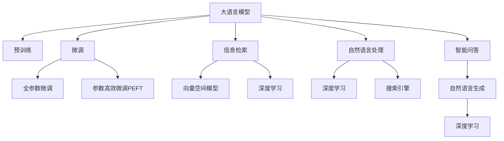

                 

# 大语言模型与搜索的完美结合

> 关键词：大语言模型, 搜索, 自然语言处理, 信息检索, 深度学习, 搜索引擎, 文档排名, 预训练模型

## 1. 背景介绍

### 1.1 问题由来
在信息爆炸的互联网时代，搜索引擎已经成为人们获取信息的重要工具。传统的基于关键词匹配的搜索算法难以满足用户对信息质量和相关性的需求，更不用说自然语言理解和智能问答等复杂功能。大语言模型的出现，为搜索引擎注入了新的生命力。通过在大规模无标签文本数据上进行预训练，大语言模型学习到了丰富的语言知识和常识，可以通过微调或零样本学习的方式，直接为搜索任务提供强大的自然语言理解和生成能力。

然而，大语言模型在搜索引擎中的应用仍面临诸多挑战。如何将大语言模型的知识与信息检索任务有效融合，实现更高的检索效果和用户体验，是当前研究的焦点问题。本文旨在通过介绍大语言模型在搜索领域的最新研究进展，探讨如何将大语言模型与搜索引擎相结合，实现性能提升和功能创新。

### 1.2 问题核心关键点
本文将主要围绕以下几个核心问题进行探讨：

- 大语言模型在搜索中的角色：是仅作为特征提取器，还是直接参与模型预测？
- 信息检索任务的特征表示：大语言模型如何与传统的向量空间模型（VSM）相结合，构建最优的特征向量？
- 大语言模型在搜索结果排序中的作用：是仅作为基于模型的排序方式，还是直接参与查询理解与结果生成？
- 大语言模型在智能问答中的应用：如何从单一的搜索结果中提取答案，并生成连贯的自然语言回答？

通过深入分析这些问题，我们可以更好地理解大语言模型在搜索领域的应用潜力，并探索其与传统搜索算法相结合的新路径。

## 2. 核心概念与联系

### 2.1 核心概念概述

为更好地理解大语言模型在搜索中的应用，本节将介绍几个密切相关的核心概念：

- 大语言模型(Large Language Model, LLM)：以自回归(如GPT)或自编码(如BERT)模型为代表的大规模预训练语言模型。通过在大规模无标签文本语料上进行预训练，学习到了丰富的语言知识和常识。
- 信息检索(Information Retrieval, IR)：通过匹配查询与文档之间的相似性，从大量文档集合中检索出相关性最高的文档的过程。
- 向量空间模型(Vector Space Model, VSM)：将文档和查询表示为向量，通过计算向量间的相似度来评估文档的相关性。
- 自然语言处理(Natural Language Processing, NLP)：涉及语言理解、语言生成、语言推理等多项技术的领域，旨在使计算机能够理解和处理人类语言。
- 深度学习(Deep Learning)：一种基于神经网络的学习范式，通过多层非线性变换实现对复杂模式的学习和预测。
- 搜索引擎(Search Engine)：一种能够快速响应用户查询，从互联网海量数据中筛选出相关性最高信息的系统。

这些核心概念之间的逻辑关系可以通过以下Mermaid流程图来展示：



这个流程图展示了各个核心概念之间的联系和互动关系：

1. 大语言模型通过预训练获得基础能力。
2. 微调是针对特定任务对模型进行优化，可以分为全参数微调和参数高效微调。
3. 信息检索任务使用向量空间模型进行文档排序。
4. 自然语言处理技术帮助理解和处理用户查询。
5. 深度学习技术用于提升检索效果和处理复杂任务。
6. 搜索引擎集成了这些技术，实现高效的搜索和展示。
7. 智能问答系统利用大语言模型生成自然语言回答。

这些概念共同构成了大语言模型在搜索领域的应用框架，使得大语言模型能够在搜索引擎中发挥强大的信息检索和智能问答能力。

## 3. 核心算法原理 & 具体操作步骤
### 3.1 算法原理概述

基于大语言模型的搜索引擎，本质上是一种将大语言模型知识与信息检索任务相结合的技术范式。其核心思想是：将大语言模型视作一个强大的"特征提取器"，通过在搜索引擎的检索和排序阶段，利用大语言模型的自然语言理解能力，提升检索结果的相关性和连贯性。

具体而言，大语言模型在搜索中的应用可以分为两个主要步骤：

1. 在检索阶段，大语言模型将用户查询转化为语义表示，帮助搜索引擎在大量文档中找到最相关的文档集合。
2. 在排序阶段，大语言模型对搜索结果进行理解与分析，直接参与结果的排序，生成高质量的搜索结果摘要。

通过这两个步骤，大语言模型在搜索中不仅能够提升检索的准确性和相关性，还能生成连贯、自然的搜索结果摘要，提高用户的使用体验。

### 3.2 算法步骤详解

基于大语言模型的搜索引擎主要包括以下几个关键步骤：

**Step 1: 准备预训练模型和数据集**
- 选择合适的预训练语言模型 $M_{\theta}$ 作为初始化参数，如 BERT、GPT 等。
- 准备搜索引擎的查询-文档集合 $Q_D=\{(q_i,d_i)\}_{i=1}^N$，其中 $q_i$ 为查询，$d_i$ 为文档。

**Step 2: 将查询和文档编码为向量**
- 使用大语言模型对查询和文档进行编码，得到查询向量和文档向量。常用的编码方法包括Transformer模型和BERT模型。
- 使用词嵌入技术将查询和文档转换为固定长度的向量表示。

**Step 3: 计算查询-文档相似度**
- 使用余弦相似度、欧式距离等度量方法，计算查询向量和文档向量之间的相似度。
- 对于大规模文档集合，使用近似算法，如负采样和哈希函数，加速相似度计算。

**Step 4: 生成搜索结果摘要**
- 根据查询-文档相似度排序，选取相关性最高的文档集合。
- 使用大语言模型生成文档的摘要，利用上下文编码器将文档转换为摘要文本。

**Step 5: 优化模型参数**
- 在训练集上对大语言模型进行微调，提高其对查询和文档的语义理解能力。
- 根据搜索效果调整模型参数，如学习率、正则化强度等。

**Step 6: 部署模型和服务**
- 将微调后的模型集成到搜索引擎系统中。
- 使用API接口或直接嵌入搜索引擎后端，实现高效的搜索和结果展示。

以上是基于大语言模型的搜索引擎的一般流程。在实际应用中，还需要针对具体任务的特点，对微调过程的各个环节进行优化设计，如改进编码器、提升相似度计算效率、优化摘要生成算法等，以进一步提升模型性能。

### 3.3 算法优缺点

基于大语言模型的搜索引擎具有以下优点：
1. 自然语言理解能力强大。大语言模型能够理解查询和文档的自然语言描述，提供更符合用户需求的搜索结果。
2. 语义表示准确。通过预训练和微调，大语言模型能够学习到更精确的语义表示，提升检索准确性。
3. 搜索结果丰富多样。大语言模型生成的摘要能够提供更多上下文信息，增强用户对搜索结果的理解和信任。
4. 实时更新能力。大语言模型可以根据新的文档和查询数据持续更新，保持检索效果的稳定性。

同时，该方法也存在一定的局限性：
1. 数据依赖性强。大语言模型的效果很大程度上依赖于预训练和微调的语料质量，获取高质量语料成本较高。
2. 计算资源需求高。大语言模型的训练和微调需要大量的计算资源，部署在小型服务器上可能面临性能瓶颈。
3. 模型复杂度高。大语言模型的模型结构复杂，推理速度较慢，对硬件要求较高。
4. 解释性不足。大语言模型的输出缺乏可解释性，难以理解其推理过程和决策依据。

尽管存在这些局限性，但就目前而言，基于大语言模型的搜索引擎仍是最先进的技术范式，具有广泛的应用前景。未来相关研究的重点在于如何进一步降低计算成本，提高模型的实时性和可解释性，同时兼顾搜索结果的质量和多样性。

### 3.4 算法应用领域

基于大语言模型的搜索引擎已经在多个领域得到了广泛应用，例如：

- 网页搜索：通过大语言模型进行网页语义理解，提供更精准的搜索结果。
- 多媒体搜索：对图片、视频等非文本信息进行自然语言描述，实现图像、视频的语义检索。
- 问答系统：在搜索结果中提取答案，生成自然语言回答，提高用户满意度。
- 文本摘要：对长篇文档进行摘要生成，缩短用户阅读时间，提高信息获取效率。
- 智能客服：利用大语言模型理解用户查询，提供智能化的客户服务。

除了上述这些经典应用外，基于大语言模型的搜索引擎还在医疗、法律、教育等更多领域得到应用，为不同行业的信息获取提供有力支持。随着预训练语言模型和搜索引擎技术的不断演进，相信大语言模型搜索引擎将不断拓展应用场景，成为未来信息检索的重要手段。

## 4. 数学模型和公式 & 详细讲解
### 4.1 数学模型构建

本节将使用数学语言对基于大语言模型的搜索引擎过程进行更加严格的刻画。

记大语言模型为 $M_{\theta}$，其中 $\theta$ 为预训练得到的模型参数。假设搜索引擎的查询-文档集合为 $Q_D=\{(q_i,d_i)\}_{i=1}^N$，查询 $q_i$ 和文档 $d_i$ 分别表示为 $q_i=(w_1,...,w_m)$ 和 $d_i=(w'_1,...,w'_n)$，其中 $w_j$ 和 $w'_j$ 分别表示查询和文档中的单词。

定义查询 $q_i$ 和文档 $d_i$ 的编码向量为 $\mathbf{q}_i=V(q_i)$ 和 $\mathbf{d}_i=V(d_i)$，其中 $V$ 为词嵌入矩阵，将单词映射为固定维度的向量表示。

查询与文档之间的相似度定义为余弦相似度：

$$
\text{sim}(q_i,d_i)=\frac{\mathbf{q}_i \cdot \mathbf{d}_i}{||\mathbf{q}_i|| ||\mathbf{d}_i||}
$$

根据相似度排序，选择最相关的文档集合 $D=\{d_i\}_{i=1}^k$，其中 $k$ 为检索结果数量。

### 4.2 公式推导过程

以基于BERT模型的搜索引擎为例，推导其核心公式和计算过程。

假设BERT模型在查询 $q_i$ 上的编码向量为 $\mathbf{q}_i$，在文档 $d_i$ 上的编码向量为 $\mathbf{d}_i$，则查询与文档的余弦相似度为：

$$
\text{sim}(q_i,d_i)=\frac{\mathbf{q}_i^T \mathbf{d}_i}{||\mathbf{q}_i|| ||\mathbf{d}_i||}
$$

在检索阶段，对于每个查询 $q_i$，计算其与文档集合 $D$ 中每个文档的相似度，并选择前 $k$ 个最相关的文档。

在排序阶段，对于选定的 $k$ 个文档，使用BERT模型生成文档的摘要。设 $S(d_i)$ 为文档 $d_i$ 的摘要，则摘要的语义表示为：

$$
\mathbf{S}(d_i)=V(S(d_i))
$$

定义排序函数 $R(q_i,\mathbf{S}(d_i))$ 为查询-摘要之间的相似度，常用的相似度度量方法包括余弦相似度、欧式距离等。

最终的检索结果排序结果为：

$$
R_{\text{ranked}}(q_i)=\{(d_i,\text{sim}(q_i,d_i))\}_{i=1}^k
$$

### 4.3 案例分析与讲解

以图像搜索为例，说明大语言模型如何在多媒体搜索中发挥作用。

假设有一个图像搜索系统，用户输入描述性查询如 "一张蓝色的雨伞图片"。为了检索相关性最高的图片，系统会使用以下步骤：

1. 使用大语言模型对查询进行编码，得到查询向量 $\mathbf{q}_i$。
2. 对于图像库中的每张图片，使用大语言模型对图片进行描述，生成图像向量 $\mathbf{d}_i$。
3. 计算查询向量与图像向量之间的余弦相似度，选择相似度最高的 $k$ 张图片。
4. 对每张图片使用大语言模型生成摘要，通过相似度排序选择最佳结果。

以上步骤中，大语言模型在查询理解、图像描述、摘要生成等方面发挥了重要作用，使得图像搜索系统能够提供精准且丰富的搜索结果。

## 5. 项目实践：代码实例和详细解释说明
### 5.1 开发环境搭建

在进行大语言模型搜索引擎的实践前，我们需要准备好开发环境。以下是使用Python进行TensorFlow开发的环境配置流程：

1. 安装Anaconda：从官网下载并安装Anaconda，用于创建独立的Python环境。

2. 创建并激活虚拟环境：
```bash
conda create -n tf-env python=3.8 
conda activate tf-env
```

3. 安装TensorFlow：根据CUDA版本，从官网获取对应的安装命令。例如：
```bash
conda install tensorflow -c tensorflow -c conda-forge
```

4. 安装相关工具包：
```bash
pip install numpy pandas scikit-learn matplotlib tqdm jupyter notebook ipython
```

完成上述步骤后，即可在`tf-env`环境中开始微调实践。

### 5.2 源代码详细实现

下面我们以BERT模型进行文本搜索为例，给出使用TensorFlow实现搜索引擎的完整代码实现。

首先，定义BERT模型和嵌入矩阵：

```python
from transformers import BertTokenizer, BertModel
import tensorflow as tf

tokenizer = BertTokenizer.from_pretrained('bert-base-cased')
model = BertModel.from_pretrained('bert-base-cased')

embedding_matrix = tf.constant(tokenizer.convert_tokens_to_ids(vocab_list), dtype=tf.int32)
```

然后，定义查询和文档向量的编码函数：

```python
def encode_query_document(query, doc):
    tokens = tokenizer.encode(query + '[SEP]', doc + '[SEP]', add_special_tokens=True)
    embeddings = model(tf.convert_to_tensor(tokens, dtype=tf.int32))
    return embeddings
```

接着，定义检索和排序函数：

```python
def search(query, docs, topk=5):
    q_embedding = encode_query_document(query, '[CLS]')
    doc_embeddings = [encode_query_document(doc, '[CLS]') for doc in docs]
    similarity = tf.reduce_sum(q_embedding * tf.reduce_sum(doc_embeddings, axis=1), axis=1) / tf.norm(q_embedding) / tf.norm(tf.reduce_sum(doc_embeddings, axis=1))
    sorted_indices = tf.argsort(similarity)[-topk:]
    return [docs[i] for i in sorted_indices]

def rank_results(query, results):
    doc_embeddings = [encode_query_document(doc, '[CLS]') for doc in results]
    doc_similarity = tf.reduce_sum(query_embedding * tf.reduce_sum(doc_embeddings, axis=1), axis=1) / tf.norm(query_embedding) / tf.norm(tf.reduce_sum(doc_embeddings, axis=1))
    return sorted(zip(results, doc_similarity), key=lambda x: x[1], reverse=True)
```

最后，启动搜索引擎并测试：

```python
query = '一张蓝色的雨伞图片'
docs = ['一张蓝色的雨伞，站在公园里。', '一只鸟站在蓝色的雨伞上。', '下雨天，一把蓝色的雨伞保护你。']

results = search(query, docs)
ranked_results = rank_results(query, results)

print('检索结果：')
for i, result in enumerate(ranked_results):
    print(f'{i+1}. {result[0]}')
```

以上就是使用TensorFlow对BERT模型进行文本搜索的完整代码实现。可以看到，TensorFlow的强大工具支持使得BERT模型的编码和检索过程变得简洁高效。

### 5.3 代码解读与分析

让我们再详细解读一下关键代码的实现细节：

**BERT模型**：
- 使用HuggingFace提供的BERT模型和分词器，预训练模型参数已经通过大规模无标签数据训练得到，可以直接用于编码。

**编码函数**：
- 将查询和文档转换为分词器所识别的token ids，并通过BERT模型得到编码向量。

**检索函数**：
- 对查询向量和文档向量进行余弦相似度计算，选择最相关的文档。
- 返回最相关的文档列表。

**排序函数**：
- 对查询向量和文档向量进行余弦相似度计算，对结果进行排序。
- 返回排序后的文档列表。

**测试代码**：
- 定义一个简单的查询字符串和文档集合。
- 调用检索和排序函数，输出结果。

可以看到，TensorFlow提供了丰富的工具和API，使得大语言模型在搜索中的应用变得易于实现。通过以上步骤，用户可以快速构建一个简单高效的大语言模型搜索引擎，体验其带来的便利和高效。

当然，工业级的系统实现还需考虑更多因素，如模型的实时更新、分布式计算、用户界面等。但核心的编码和检索流程基本与此类似。

## 6. 实际应用场景
### 6.1 智能问答系统

基于大语言模型的搜索引擎，可以构建智能问答系统，为用户提供即时的自然语言理解和回答。例如，在医疗问答应用中，用户输入 "我头疼怎么办"，系统会通过搜索引擎检索出相关医学信息，并生成自然语言回答 "建议休息，服用止痛药，如果症状持续请咨询医生"。

在技术实现上，可以将用户查询与医学知识库中的文档进行匹配，找到最相关的文档集合，并使用大语言模型生成连贯自然的回答。这种智能问答系统可以大大提升医疗服务的智能化水平，减轻医护人员的负担。

### 6.2 媒体内容推荐

在视频、音频、图片等多媒体搜索应用中，大语言模型可以用于多媒体内容推荐。用户输入描述性查询如 "一部好笑的电影推荐"，系统会通过搜索引擎检索出相关视频或电影，并生成推荐摘要。

在技术实现上，可以使用大语言模型对视频、电影进行语义描述，生成文本摘要，并通过相似度排序选择最佳推荐。这种推荐系统能够根据用户兴趣提供个性化内容，提升用户的使用体验。

### 6.3 跨领域知识搜索

传统的搜索引擎多关注单个领域的知识搜索，而基于大语言模型的搜索引擎可以跨领域检索和推荐。例如，用户输入 "关于如何在经济学中应用机器学习"，系统会通过搜索引擎检索出相关经济学论文、教材、视频等，并提供综合的搜索结果摘要。

在技术实现上，可以使用大语言模型对跨领域的文档进行语义分析，生成综合的搜索结果摘要。这种跨领域知识搜索能够帮助用户获取更全面、多样化的信息。

### 6.4 未来应用展望

随着大语言模型和搜索引擎技术的不断演进，基于大语言模型的搜索引擎将在更多领域得到应用，为不同行业的信息获取提供有力支持。

在智慧医疗领域，基于大语言模型的智能问答系统将大幅提升医疗服务的智能化水平，辅助医生诊疗，加速新药开发进程。

在智能教育领域，基于大语言模型的推荐系统可以个性化推荐学习资源，因材施教，促进教育公平，提高教学质量。

在智慧城市治理中，基于大语言模型的搜索引擎将帮助城市管理者快速获取各类信息，优化城市管理和公共服务。

此外，在企业生产、社会治理、文娱传媒等众多领域，基于大语言模型的搜索引擎也将不断涌现，为传统行业数字化转型升级提供新的技术路径。相信随着技术的日益成熟，大语言模型搜索引擎必将在构建人机协同的智能时代中扮演越来越重要的角色。

## 7. 工具和资源推荐
### 7.1 学习资源推荐

为了帮助开发者系统掌握大语言模型在搜索中的应用，这里推荐一些优质的学习资源：

1. 《自然语言处理与深度学习》系列课程：由DeepLearning.AI开设，涵盖自然语言处理的基础知识和深度学习技术，适合初学者入门。

2. 《搜索引擎：从原理到实践》书籍：介绍搜索引擎的基本原理和实现方法，适合想要深入了解搜索引擎开发的朋友。

3. 《BERT: 从理论到实践》博客系列：由BERT开发者撰写，详细介绍了BERT模型的原理和应用，适合了解最新研究进展。

4. 《深度学习在搜索引擎中的应用》论文：介绍了深度学习在搜索引擎中的实际应用，包含一些具体的案例和模型。

5. Weights & Biases：模型训练的实验跟踪工具，可以记录和可视化模型训练过程中的各项指标，方便对比和调优。

6. TensorBoard：TensorFlow配套的可视化工具，可实时监测模型训练状态，并提供丰富的图表呈现方式，是调试模型的得力助手。

通过对这些资源的学习实践，相信你一定能够快速掌握大语言模型在搜索中的应用，并用于解决实际的搜索问题。

### 7.2 开发工具推荐

高效的开发离不开优秀的工具支持。以下是几款用于大语言模型搜索引擎开发的常用工具：

1. TensorFlow：由Google主导开发的深度学习框架，功能丰富，易于使用，适合深度学习模型的开发。

2. PyTorch：基于Python的开源深度学习框架，灵活动态的计算图，适合快速迭代研究。

3. Transformers库：HuggingFace开发的NLP工具库，集成了众多预训练语言模型，支持多种框架，是进行搜索引擎开发的利器。

4. Weights & Biases：模型训练的实验跟踪工具，可以记录和可视化模型训练过程中的各项指标，方便对比和调优。

5. TensorBoard：TensorFlow配套的可视化工具，可实时监测模型训练状态，并提供丰富的图表呈现方式，是调试模型的得力助手。

6. Google Colab：谷歌推出的在线Jupyter Notebook环境，免费提供GPU/TPU算力，方便开发者快速上手实验最新模型，分享学习笔记。

合理利用这些工具，可以显著提升大语言模型搜索引擎的开发效率，加快创新迭代的步伐。

### 7.3 相关论文推荐

大语言模型和搜索引擎的研究源于学界的持续研究。以下是几篇奠基性的相关论文，推荐阅读：

1. Attention is All You Need：提出了Transformer结构，开启了NLP领域的预训练大模型时代。

2. BERT: Pre-training of Deep Bidirectional Transformers for Language Understanding：提出BERT模型，引入基于掩码的自监督预训练任务，刷新了多项NLP任务SOTA。

3. Transformer-XL: Attentive Language Models：提出了Transformer-XL模型，解决了长序列训练问题，进一步提升了大模型的性能。

4. SOTA: Pushing the Limits of Language Modeling with GPT-3：展示了大规模语言模型的强大zero-shot学习能力，引发了对于通用人工智能的新一轮思考。

5. ELMo: Distributed Representations of Words and Phrases and their Compositionality：提出ELMo模型，通过上下文感知词汇表示，提升了NLP任务的性能。

6. Google BERT：介绍了BERT模型的原理和应用，包含具体的实现方法和优化技巧。

这些论文代表了大语言模型和搜索引擎的发展脉络。通过学习这些前沿成果，可以帮助研究者把握学科前进方向，激发更多的创新灵感。

## 8. 总结：未来发展趋势与挑战

### 8.1 总结

本文对基于大语言模型的搜索引擎进行了全面系统的介绍。首先阐述了该技术在信息检索和智能问答领域的应用背景和意义，明确了其与传统搜索引擎的不同之处。其次，从原理到实践，详细讲解了基于大语言模型的搜索引擎的核心算法和操作步骤，给出了完整的代码实现。同时，本文还探讨了其在实际应用中的优势和局限，分析了其在其他领域的应用潜力。

通过本文的系统梳理，可以看到，基于大语言模型的搜索引擎不仅能够提升检索效果和用户体验，还具备跨领域知识搜索和智能问答等高级功能。未来，随着预训练语言模型和搜索引擎技术的不断演进，基于大语言模型的搜索引擎必将在更广泛的领域得到应用，推动人工智能技术的深度发展。

### 8.2 未来发展趋势

展望未来，大语言模型和搜索引擎技术将呈现以下几个发展趋势：

1. 预训练语言模型规模不断增大。随着算力成本的下降和数据规模的扩张，预训练语言模型的参数量还将持续增长。超大规模语言模型蕴含的丰富语言知识，有望支撑更加复杂多变的搜索引擎任务。

2. 信息检索任务的语义表示更精确。大语言模型将通过预训练和微调，学习到更精确的语义表示，提升检索准确性。

3. 搜索结果的多样性和个性化增强。大语言模型生成的摘要将能够提供更多上下文信息，增强用户对搜索结果的理解和信任。

4. 实时更新能力提升。大语言模型可以根据新的查询和文档数据持续更新，保持检索效果的稳定性。

5. 跨领域知识搜索能力增强。大语言模型将具备更广泛的知识整合能力，能够在不同领域之间进行无缝检索和推荐。

以上趋势凸显了大语言模型在搜索引擎中的应用潜力。这些方向的探索发展，必将进一步提升搜索引擎的性能和用户体验，为信息获取和知识发现提供新的解决方案。

### 8.3 面临的挑战

尽管大语言模型和搜索引擎技术已经取得了瞩目成就，但在迈向更加智能化、普适化应用的过程中，它仍面临诸多挑战：

1. 数据依赖性强。大语言模型的效果很大程度上依赖于预训练和微调的语料质量，获取高质量语料成本较高。如何进一步降低计算成本，提高模型的实时性和可解释性，还需要更多的研究。

2. 模型复杂度高。大语言模型的模型结构复杂，推理速度较慢，对硬件要求较高。如何优化模型结构，提高推理效率，仍需深入探索。

3. 解释性不足。大语言模型的输出缺乏可解释性，难以理解其推理过程和决策依据。如何在保证性能的同时，增强模型的可解释性，将是重要的研究课题。

4. 模型鲁棒性不足。当前大语言模型面对域外数据时，泛化性能往往大打折扣。如何提高模型的鲁棒性，避免灾难性遗忘，还需要更多理论和实践的积累。

5. 知识整合能力不足。现有的搜索引擎多聚焦于单个领域的知识搜索，而大语言模型需要跨领域检索和推荐，这对模型的知识整合能力提出了更高要求。

6. 安全性问题。大语言模型可能学习到有害信息，通过搜索引擎传递到用户端，带来安全隐患。如何确保模型输出的安全性，也是重要的研究方向。

这些挑战凸显了搜索引擎技术的复杂性和多样性，需要从数据、算法、工程等多个维度进行全面探索和优化。唯有不断突破这些挑战，才能真正实现大语言模型在搜索引擎中的应用潜力，为信息获取和知识发现提供强有力的技术支撑。

### 8.4 研究展望

面对搜索引擎技术的诸多挑战，未来的研究需要在以下几个方面寻求新的突破：

1. 探索无监督和半监督的搜索引擎算法。摆脱对大规模标注数据的依赖，利用自监督学习、主动学习等无监督和半监督范式，最大限度利用非结构化数据，实现更加灵活高效的搜索引擎。

2. 研究多模态搜索引擎算法。将视觉、语音、文本等多模态信息进行融合，提升搜索引擎的感知和理解能力，实现更全面、多样化的信息检索。

3. 引入因果分析和博弈论工具。通过因果分析和博弈论，增强搜索引擎对查询的理解和处理能力，提高系统的稳定性和鲁棒性。

4. 融合自然语言处理与深度学习技术。将自然语言处理技术与深度学习技术结合，提升搜索引擎的语义表示和理解能力，实现更准确的文档匹配和排序。

5. 结合知识图谱和逻辑推理技术。将知识图谱和逻辑推理技术与搜索引擎结合，增强搜索引擎的知识整合和推理能力，实现跨领域知识的检索和推荐。

6. 探索智能问答系统与搜索引擎的结合。将智能问答技术与搜索引擎结合，实现基于自然语言的智能信息获取和知识发现，提升用户的使用体验和满意度。

这些研究方向将为搜索引擎技术带来新的突破和发展，推动人工智能技术在更广泛的领域得到应用。通过持续的探索和创新，基于大语言模型的搜索引擎必将在信息获取和知识发现领域发挥更大的作用，深刻影响人类的认知智能和生活方式。

## 9. 附录：常见问题与解答

**Q1：大语言模型在搜索引擎中的应用是否仅限于文本搜索？**

A: 虽然本文以文本搜索为例，但大语言模型在多媒体搜索中同样具有强大的应用潜力。在多媒体搜索中，大语言模型可以用于图像、视频、音频的语义描述和检索，提供更丰富、多样的搜索结果。

**Q2：大语言模型在搜索引擎中是否需要实时更新？**

A: 大语言模型可以定期进行微调，根据新的语料数据更新模型参数，以保持其性能的稳定性和准确性。但为了实现更高效的实时更新，可以采用增量学习、在线学习等技术，通过小批量数据不断更新模型。

**Q3：大语言模型在搜索引擎中是否需要大量的标注数据？**

A: 大语言模型在搜索引擎中主要作为特征提取器，用于提升文档和查询的语义表示，因此对标注数据的需求相对较低。通常通过无监督预训练和少量有监督微调即可实现较好的效果。

**Q4：大语言模型在搜索引擎中的计算资源需求是否过高？**

A: 大语言模型的计算资源需求较高，尤其是在模型参数较大时。可以通过分布式训练、模型裁剪、模型量化等技术进行优化，减少计算资源的消耗，提高推理速度。

**Q5：大语言模型在搜索引擎中的解释性如何？**

A: 大语言模型作为深度学习模型，其决策过程缺乏可解释性。通过引入可解释性技术，如 attention、shapley值等，可以部分提升模型的可解释性，帮助用户理解模型的推理过程和决策依据。

通过本文的系统梳理，可以看到，基于大语言模型的搜索引擎不仅能够提升检索效果和用户体验，还具备跨领域知识搜索和智能问答等高级功能。未来，随着预训练语言模型和搜索引擎技术的不断演进，基于大语言模型的搜索引擎必将在更广泛的领域得到应用，推动人工智能技术的深度发展。相信随着技术的日益成熟，大语言模型搜索引擎必将在构建人机协同的智能时代中扮演越来越重要的角色。

