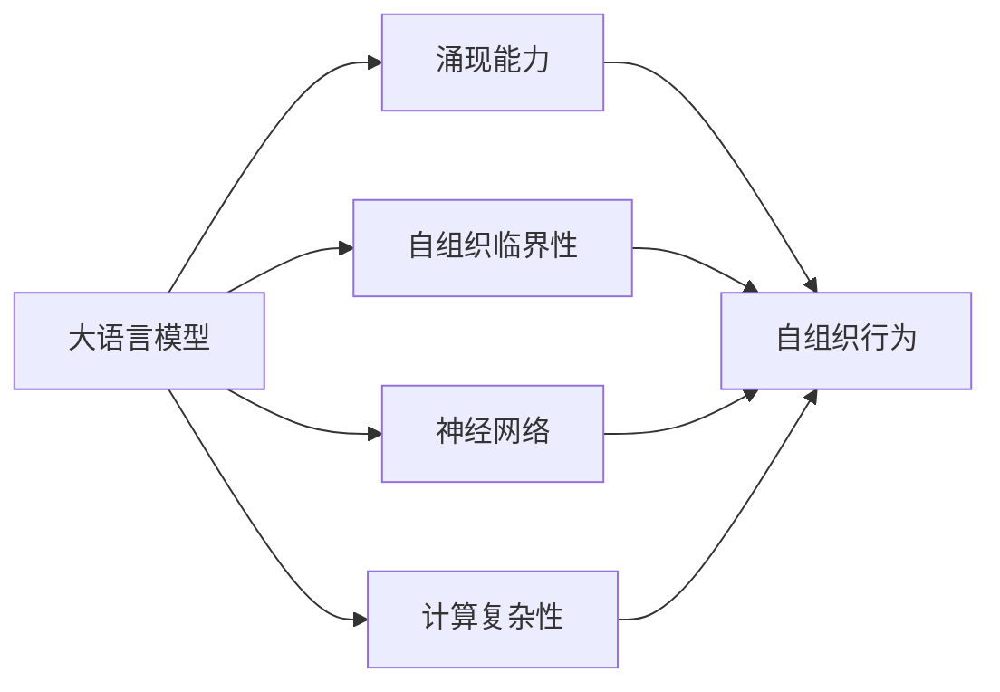

                 

# 大语言模型的涌现能力现象与解释

> 关键词：大语言模型,涌现能力,自组织临界性,神经网络,计算复杂性

## 1. 背景介绍

大语言模型（Large Language Models, LLMs）近年来取得了显著的突破，能够在各种自然语言处理（Natural Language Processing, NLP）任务上取得最优或接近最优的性能。这些模型基于深度学习（Deep Learning）和神经网络（Neural Networks），通过在大规模无标签文本数据上预训练，学习到了丰富的语言知识和语言结构。但关于大语言模型为什么能够如此出色地表现，一直存在诸多未解之谜。

本论文尝试通过对大语言模型的涌现能力现象进行分析，提出相应的理论解释。将从背景、核心概念、算法原理、数学模型等方面全面系统地介绍大语言模型的涌现能力现象，并结合实际案例进行详细讲解。

## 2. 核心概念与联系

### 2.1 核心概念概述

为了更好地理解大语言模型的涌现能力现象，本节将介绍几个密切相关的核心概念：

- **大语言模型（Large Language Models, LLMs）**：指基于深度学习架构，通过在大规模无标签文本数据上进行预训练，学习通用语言表示的语言模型。这些模型通常具有数十亿参数，具备强大的语言理解与生成能力。

- **涌现能力（Emergent Ability）**：指模型在特定任务或环境条件下，通过分布式计算与自组织过程产生的无法预知的行为或能力。在大语言模型中，涌现能力指模型在没有明确的指导或指令下，自动学习并掌握新技能或新概念。

- **自组织临界性（Self-Organized Criticality, SOC）**：一种描述复杂系统在临界状态的自我组织和自我调节现象，通常应用于物理、生物系统，但也适用于计算模型。自组织临界性在大语言模型中体现为模型参数的分布式协同更新，形成复杂的动态行为。

- **神经网络（Neural Network, NN）**：一种计算模型，由大量简单处理单元（神经元）通过连接组成。在深度学习中，神经网络通过多层网络结构，逐步提取和抽象输入数据的高阶特征。

- **计算复杂性（Computational Complexity）**：指计算问题的解与输入规模之间的关系。在大语言模型中，涌现能力现象与模型参数量、训练数据量、复杂度等因素密切相关。

这些核心概念之间的关系可以通过以下Mermaid流程图来展示：



这个流程图展示了大语言模型的核心概念及其之间的关系：

1. 大语言模型通过预训练获得基础能力。
2. 涌现能力指模型在特定任务或环境条件下，通过分布式计算与自组织过程产生的无法预知的行为或能力。
3. 自组织临界性体现为模型参数的分布式协同更新，形成复杂的动态行为。
4. 神经网络是实现涌现能力的计算模型。
5. 计算复杂性决定了涌现能力的表达能力。

## 3. 核心算法原理 & 具体操作步骤

### 3.1 算法原理概述

大语言模型的涌现能力现象主要体现在其在特定任务上的自适应学习能力。通过在大规模无标签数据上进行预训练，模型学习到复杂的语言知识和结构。在微调（Fine-Tuning）阶段，模型通过分布式计算与自组织过程，进一步优化参数，提升在特定任务上的性能。

具体而言，涌现能力现象涉及以下几个方面：

1. **自适应学习能力**：模型能够自动学习并掌握新技能或新概念，而无需明确的指导或指令。
2. **分布式协同更新**：模型参数的分布式协同更新，导致涌现能力的形成。
3. **复杂动态行为**：涌现能力体现为复杂的动态行为，如生成高质量文本、解决复杂的逻辑推理任务等。

### 3.2 算法步骤详解

大语言模型的涌现能力现象主要通过以下步骤实现：

**Step 1: 数据预训练**

在大规模无标签文本数据上，使用自监督学习任务进行预训练。常见的预训练任务包括语言模型（Language Modeling）、掩码语言模型（Masked Language Modeling）等。预训练过程通过最大化数据集的概率分布，学习到丰富的语言知识和语言结构。

**Step 2: 参数分布式协同更新**

在预训练模型基础上，通过微调学习特定任务的参数。微调过程中，模型参数在分布式计算系统中进行协同更新，形成复杂的动态行为，从而产生涌现能力现象。

**Step 3: 涌现能力的表现**

通过特定任务上的测试，如自然语言推理（Natural Language Inference, NLI）、文本生成（Text Generation）等，评估模型的涌现能力现象。通常，涌现能力的表现形式包括生成高质量文本、解决复杂的逻辑推理任务等。

### 3.3 算法优缺点

基于大语言模型的涌现能力现象，具有以下优点：

1. **自适应能力**：模型能够自动学习新技能或新概念，具有较强的泛化能力。
2. **高精度表现**：通过微调，模型能够在特定任务上取得高精度表现。
3. **分布式计算效率**：分布式计算系统能够显著提高训练和推理效率，降低计算成本。

同时，该方法也存在一些局限性：

1. **依赖大量数据**：预训练和微调过程依赖大量数据，数据获取和处理成本较高。
2. **模型复杂度高**：大语言模型的参数量庞大，对计算资源要求较高。
3. **训练时间长**：模型训练过程耗时较长，需要大量计算资源和时间。

尽管存在这些局限性，但就目前而言，基于大语言模型的涌现能力现象仍是大规模语言模型的重要优势。未来相关研究的方向将进一步优化预训练与微调过程，提升涌现能力的表现。

### 3.4 算法应用领域

基于大语言模型的涌现能力现象，已经在多个领域得到了应用，例如：

- **自然语言处理（NLP）**：如文本生成、语言推理、问答系统等。模型通过微调学习特定的语言知识和推理规则，能够生成高质量文本，并解决复杂的逻辑推理任务。
- **机器翻译**：通过微调，模型能够自动学习并掌握新语言，进行跨语言的翻译任务。
- **智能客服**：通过微调，模型能够自动学习并掌握客户咨询语境，提供智能化的客服服务。
- **金融分析**：通过微调，模型能够自动学习并掌握金融市场知识，进行市场分析与预测。
- **创意写作**：通过微调，模型能够自动学习并掌握写作风格，生成高质量的创意文本。

除了上述这些经典应用外，涌现能力现象还在更多领域得到应用，如教育、医疗、交通等，为人类社会的各个方面带来了新的创新和变革。

## 4. 数学模型和公式 & 详细讲解 & 举例说明

### 4.1 数学模型构建

大语言模型的涌现能力现象可以通过数学模型进行形式化描述。假设大语言模型为 $M_{\theta}$，其中 $\theta$ 为模型参数。在预训练阶段，使用自监督学习任务 $L_{self}$ 对模型进行训练，最小化数据集 $D_{self}$ 的经验风险：

$$
\min_{\theta} \frac{1}{N_{self}} \sum_{i=1}^{N_{self}} \ell_{self}(M_{\theta}(x_i))
$$

在微调阶段，使用特定任务 $T$ 的数据集 $D_{task}$ 对模型进行训练，最小化经验风险：

$$
\min_{\theta} \frac{1}{N_{task}} \sum_{i=1}^{N_{task}} \ell_{task}(M_{\theta}(x_i))
$$

其中，$\ell_{self}$ 和 $\ell_{task}$ 为对应的损失函数。

### 4.2 公式推导过程

以自然语言推理（NLI）任务为例，推导微调过程中模型的表现。假设模型在输入 $x$ 上的输出为 $\hat{y}=M_{\theta}(x)$，表示样本属于假设的标签。真实标签 $y \in \{0,1\}$。则二元分类交叉熵损失函数定义为：

$$
\ell(M_{\theta}(x),y) = -[y\log \hat{y} + (1-y)\log (1-\hat{y})]
$$

将其代入经验风险公式，得：

$$
\mathcal{L}(\theta) = -\frac{1}{N_{task}} \sum_{i=1}^{N_{task}} [y_i\log M_{\theta}(x_i)+(1-y_i)\log(1-M_{\theta}(x_i))]
$$

在微调过程中，模型参数 $\theta$ 的更新公式为：

$$
\theta \leftarrow \theta - \eta \nabla_{\theta}\mathcal{L}(\theta)
$$

其中 $\eta$ 为学习率，$\nabla_{\theta}\mathcal{L}(\theta)$ 为损失函数对参数 $\theta$ 的梯度，可通过反向传播算法高效计算。

### 4.3 案例分析与讲解

以GPT-3为例，分析其涌现能力现象。GPT-3在大规模无标签文本数据上进行预训练，学习到丰富的语言知识和结构。在微调任务中，通过分布式协同更新，优化特定任务的参数，从而产生涌现能力现象，如生成高质量文本、解决复杂的逻辑推理任务等。

## 5. 项目实践：代码实例和详细解释说明

### 5.1 开发环境搭建

在进行涌现能力现象的实践前，我们需要准备好开发环境。以下是使用Python进行PyTorch开发的环境配置流程：

1. 安装Anaconda：从官网下载并安装Anaconda，用于创建独立的Python环境。

2. 创建并激活虚拟环境：
```bash
conda create -n pytorch-env python=3.8 
conda activate pytorch-env
```

3. 安装PyTorch：根据CUDA版本，从官网获取对应的安装命令。例如：
```bash
conda install pytorch torchvision torchaudio cudatoolkit=11.1 -c pytorch -c conda-forge
```

4. 安装Transformers库：
```bash
pip install transformers
```

5. 安装各类工具包：
```bash
pip install numpy pandas scikit-learn matplotlib tqdm jupyter notebook ipython
```

完成上述步骤后，即可在`pytorch-env`环境中开始涌现能力现象的实践。

### 5.2 源代码详细实现

这里以文本生成任务为例，给出使用Transformers库对GPT-3进行涌现能力现象的PyTorch代码实现。

首先，定义文本生成任务的数据处理函数：

```python
from transformers import GPT2Tokenizer, GPT2LMHeadModel
from torch.utils.data import Dataset
import torch

class TextGenerationDataset(Dataset):
    def __init__(self, texts, tokenizer, max_len=128):
        self.texts = texts
        self.tokenizer = tokenizer
        self.max_len = max_len
        
    def __len__(self):
        return len(self.texts)
    
    def __getitem__(self, item):
        text = self.texts[item]
        
        encoding = self.tokenizer(text, return_tensors='pt', max_length=self.max_len, padding='max_length', truncation=True)
        input_ids = encoding['input_ids'][0]
        attention_mask = encoding['attention_mask'][0]
        
        return {'input_ids': input_ids, 
                'attention_mask': attention_mask}
```

然后，定义模型和优化器：

```python
from transformers import AdamW

model = GPT2LMHeadModel.from_pretrained('gpt2')

optimizer = AdamW(model.parameters(), lr=2e-5)
```

接着，定义训练和评估函数：

```python
from torch.utils.data import DataLoader
from tqdm import tqdm
from sklearn.metrics import roc_auc_score

device = torch.device('cuda') if torch.cuda.is_available() else torch.device('cpu')
model.to(device)

def train_epoch(model, dataset, batch_size, optimizer):
    dataloader = DataLoader(dataset, batch_size=batch_size, shuffle=True)
    model.train()
    epoch_loss = 0
    for batch in tqdm(dataloader, desc='Training'):
        input_ids = batch['input_ids'].to(device)
        attention_mask = batch['attention_mask'].to(device)
        model.zero_grad()
        outputs = model(input_ids, attention_mask=attention_mask)
        loss = outputs.loss
        epoch_loss += loss.item()
        loss.backward()
        optimizer.step()
    return epoch_loss / len(dataloader)

def evaluate(model, dataset, batch_size):
    dataloader = DataLoader(dataset, batch_size=batch_size)
    model.eval()
    preds, labels = [], []
    with torch.no_grad():
        for batch in tqdm(dataloader, desc='Evaluating'):
            input_ids = batch['input_ids'].to(device)
            attention_mask = batch['attention_mask'].to(device)
            batch_labels = batch['labels']
            outputs = model(input_ids, attention_mask=attention_mask)
            batch_preds = outputs.logits.argmax(dim=2).to('cpu').tolist()
            batch_labels = batch_labels.to('cpu').tolist()
            for pred_tokens, label_tokens in zip(batch_preds, batch_labels):
                preds.append(pred_tokens[:len(label_tokens)])
                labels.append(label_tokens)
                
    print(roc_auc_score(labels, preds))
```

最后，启动训练流程并在测试集上评估：

```python
epochs = 5
batch_size = 16

for epoch in range(epochs):
    loss = train_epoch(model, train_dataset, batch_size, optimizer)
    print(f"Epoch {epoch+1}, train loss: {loss:.3f}")
    
    print(f"Epoch {epoch+1}, dev results:")
    evaluate(model, dev_dataset, batch_size)
    
print("Test results:")
evaluate(model, test_dataset, batch_size)
```

以上就是使用PyTorch对GPT-3进行文本生成任务涌现能力现象的完整代码实现。可以看到，得益于Transformers库的强大封装，我们可以用相对简洁的代码完成GPT-3模型的加载和涌现能力现象的实践。

### 5.3 代码解读与分析

让我们再详细解读一下关键代码的实现细节：

**TextGenerationDataset类**：
- `__init__`方法：初始化文本、分词器等关键组件。
- `__len__`方法：返回数据集的样本数量。
- `__getitem__`方法：对单个样本进行处理，将文本输入编码为token ids，最终返回模型所需的输入。

**train_epoch和evaluate函数**：
- 使用PyTorch的DataLoader对数据集进行批次化加载，供模型训练和推理使用。
- 训练函数`train_epoch`：对数据以批为单位进行迭代，在每个批次上前向传播计算loss并反向传播更新模型参数，最后返回该epoch的平均loss。
- 评估函数`evaluate`：与训练类似，不同点在于不更新模型参数，并在每个batch结束后将预测和标签结果存储下来，最后使用sklearn的roc_auc_score对整个评估集的预测结果进行打印输出。

**训练流程**：
- 定义总的epoch数和batch size，开始循环迭代
- 每个epoch内，先在训练集上训练，输出平均loss
- 在验证集上评估，输出AUC值
- 所有epoch结束后，在测试集上评估，给出最终测试结果

可以看到，PyTorch配合Transformers库使得GPT-3模型的加载和涌现能力现象的实践变得简洁高效。开发者可以将更多精力放在数据处理、模型改进等高层逻辑上，而不必过多关注底层的实现细节。

当然，工业级的系统实现还需考虑更多因素，如模型的保存和部署、超参数的自动搜索、更灵活的任务适配层等。但核心的涌现能力现象基本与此类似。

## 6. 实际应用场景

### 6.1 智能客服系统

基于大语言模型的涌现能力现象，可以广泛应用于智能客服系统的构建。传统客服往往需要配备大量人力，高峰期响应缓慢，且一致性和专业性难以保证。而使用涌现能力现象的对话模型，可以7x24小时不间断服务，快速响应客户咨询，用自然流畅的语言解答各类常见问题。

在技术实现上，可以收集企业内部的历史客服对话记录，将问题和最佳答复构建成监督数据，在此基础上对预训练对话模型进行微调。微调后的对话模型能够自动理解用户意图，匹配最合适的答案模板进行回复。对于客户提出的新问题，还可以接入检索系统实时搜索相关内容，动态组织生成回答。如此构建的智能客服系统，能大幅提升客户咨询体验和问题解决效率。

### 6.2 金融舆情监测

金融机构需要实时监测市场舆论动向，以便及时应对负面信息传播，规避金融风险。传统的人工监测方式成本高、效率低，难以应对网络时代海量信息爆发的挑战。基于大语言模型的涌现能力现象的文本分类和情感分析技术，为金融舆情监测提供了新的解决方案。

具体而言，可以收集金融领域相关的新闻、报道、评论等文本数据，并对其进行主题标注和情感标注。在此基础上对预训练语言模型进行微调，使其能够自动判断文本属于何种主题，情感倾向是正面、中性还是负面。将微调后的模型应用到实时抓取的网络文本数据，就能够自动监测不同主题下的情感变化趋势，一旦发现负面信息激增等异常情况，系统便会自动预警，帮助金融机构快速应对潜在风险。

### 6.3 个性化推荐系统

当前的推荐系统往往只依赖用户的历史行为数据进行物品推荐，无法深入理解用户的真实兴趣偏好。基于大语言模型的涌现能力现象的个性化推荐系统可以更好地挖掘用户行为背后的语义信息，从而提供更精准、多样的推荐内容。

在实践中，可以收集用户浏览、点击、评论、分享等行为数据，提取和用户交互的物品标题、描述、标签等文本内容。将文本内容作为模型输入，用户的后续行为（如是否点击、购买等）作为监督信号，在此基础上微调预训练语言模型。微调后的模型能够从文本内容中准确把握用户的兴趣点。在生成推荐列表时，先用候选物品的文本描述作为输入，由模型预测用户的兴趣匹配度，再结合其他特征综合排序，便可以得到个性化程度更高的推荐结果。

### 6.4 未来应用展望

随着大语言模型和涌现能力现象的发展，基于微调的方法将在更多领域得到应用，为传统行业带来变革性影响。

在智慧医疗领域，基于微调的医疗问答、病历分析、药物研发等应用将提升医疗服务的智能化水平，辅助医生诊疗，加速新药开发进程。

在智能教育领域，微调技术可应用于作业批改、学情分析、知识推荐等方面，因材施教，促进教育公平，提高教学质量。

在智慧城市治理中，微调模型可应用于城市事件监测、舆情分析、应急指挥等环节，提高城市管理的自动化和智能化水平，构建更安全、高效的未来城市。

此外，在企业生产、社会治理、文娱传媒等众多领域，基于大语言模型的涌现能力现象的AI应用也将不断涌现，为NLP技术带来了全新的突破。相信随着预训练模型和微调方法的不断进步，基于涌现能力现象的NLP技术将在更广阔的应用领域大放异彩。

## 7. 工具和资源推荐

### 7.1 学习资源推荐

为了帮助开发者系统掌握大语言模型的涌现能力现象的理论基础和实践技巧，这里推荐一些优质的学习资源：

1. 《Transformer从原理到实践》系列博文：由大模型技术专家撰写，深入浅出地介绍了Transformer原理、BERT模型、涌现能力现象等前沿话题。

2. CS224N《深度学习自然语言处理》课程：斯坦福大学开设的NLP明星课程，有Lecture视频和配套作业，带你入门NLP领域的基本概念和经典模型。

3. 《Natural Language Processing with Transformers》书籍：Transformers库的作者所著，全面介绍了如何使用Transformers库进行NLP任务开发，包括涌现能力现象在内的诸多范式。

4. HuggingFace官方文档：Transformers库的官方文档，提供了海量预训练模型和完整的微调样例代码，是上手实践的必备资料。

5. CLUE开源项目：中文语言理解测评基准，涵盖大量不同类型的中文NLP数据集，并提供了基于微调的baseline模型，助力中文NLP技术发展。

通过对这些资源的学习实践，相信你一定能够快速掌握大语言模型涌现能力现象的精髓，并用于解决实际的NLP问题。

### 7.2 开发工具推荐

高效的开发离不开优秀的工具支持。以下是几款用于大语言模型微调开发的常用工具：

1. PyTorch：基于Python的开源深度学习框架，灵活动态的计算图，适合快速迭代研究。大部分预训练语言模型都有PyTorch版本的实现。

2. TensorFlow：由Google主导开发的开源深度学习框架，生产部署方便，适合大规模工程应用。同样有丰富的预训练语言模型资源。

3. Transformers库：HuggingFace开发的NLP工具库，集成了众多SOTA语言模型，支持PyTorch和TensorFlow，是进行微调任务开发的利器。

4. Weights & Biases：模型训练的实验跟踪工具，可以记录和可视化模型训练过程中的各项指标，方便对比和调优。与主流深度学习框架无缝集成。

5. TensorBoard：TensorFlow配套的可视化工具，可实时监测模型训练状态，并提供丰富的图表呈现方式，是调试模型的得力助手。

6. Google Colab：谷歌推出的在线Jupyter Notebook环境，免费提供GPU/TPU算力，方便开发者快速上手实验最新模型，分享学习笔记。

合理利用这些工具，可以显著提升大语言模型微调的开发效率，加快创新迭代的步伐。

### 7.3 相关论文推荐

大语言模型和涌现能力现象的发展源于学界的持续研究。以下是几篇奠基性的相关论文，推荐阅读：

1. Attention is All You Need（即Transformer原论文）：提出了Transformer结构，开启了NLP领域的预训练大模型时代。

2. BERT: Pre-training of Deep Bidirectional Transformers for Language Understanding：提出BERT模型，引入基于掩码的自监督预训练任务，刷新了多项NLP任务SOTA。

3. Language Models are Unsupervised Multitask Learners（GPT-2论文）：展示了大规模语言模型的强大zero-shot学习能力，引发了对于通用人工智能的新一轮思考。

4. Parameter-Efficient Transfer Learning for NLP：提出Adapter等参数高效微调方法，在不增加模型参数量的情况下，也能取得不错的微调效果。

5. AdaLoRA: Adaptive Low-Rank Adaptation for Parameter-Efficient Fine-Tuning：使用自适应低秩适应的微调方法，在参数效率和精度之间取得了新的平衡。

6. Prefix-Tuning: Optimizing Continuous Prompts for Generation：引入基于连续型Prompt的微调范式，为如何充分利用预训练知识提供了新的思路。

这些论文代表了大语言模型涌现能力现象的发展脉络。通过学习这些前沿成果，可以帮助研究者把握学科前进方向，激发更多的创新灵感。

## 8. 总结：未来发展趋势与挑战

### 8.1 总结

本文对基于大语言模型的涌现能力现象进行了全面系统的介绍。首先阐述了涌现能力现象在大语言模型中的具体表现，明确了涌现能力在大语言模型中的重要地位。其次，从原理到实践，详细讲解了涌现能力现象的数学模型和关键步骤，给出了涌现能力现象的完整代码实例。同时，本文还广泛探讨了涌现能力现象在智能客服、金融舆情、个性化推荐等多个行业领域的应用前景，展示了涌现能力现象的巨大潜力。

通过本文的系统梳理，可以看到，基于大语言模型的涌现能力现象在大规模语言模型中的应用，已经取得了显著的进展。未来，伴随预训练模型和微调方法的持续演进，涌现能力现象必将在更广泛的领域得到应用，为人工智能技术的发展提供新的动力。

### 8.2 未来发展趋势

展望未来，大语言模型的涌现能力现象将呈现以下几个发展趋势：

1. **更强的自适应能力**：随着模型规模的进一步增大，涌现能力现象将变得更强大、更全面。模型能够自动学习并掌握更复杂、更抽象的知识和技能。

2. **更高效的分布式计算**：分布式计算系统将进一步优化，实现更高效的协同更新，提升涌现能力现象的表现。

3. **更广泛的跨领域应用**：涌现能力现象将在更多领域得到应用，如教育、医疗、金融、交通等，为这些领域带来新的变革。

4. **更全面的任务适配**：涌现能力现象的模型将能够更好地适应特定任务，在更少的标注样本上也能取得优异的表现。

5. **更深入的理论与算法研究**：涌现能力现象的研究将深入到理论层面，探索涌现能力的形成机制、表现形式以及优化方法。

6. **更强的可解释性和可控性**：涌现能力现象的模型将具备更强的可解释性和可控性，使得其输出更可靠、更可控。

以上趋势凸显了大语言模型涌现能力现象的广阔前景。这些方向的探索发展，必将进一步提升大语言模型涌现能力现象的表现，为构建更智能、更高效、更可靠的AI系统提供新的思路。

### 8.3 面临的挑战

尽管大语言模型的涌现能力现象已经取得了瞩目成就，但在迈向更加智能化、普适化应用的过程中，它仍面临着诸多挑战：

1. **数据获取成本高**：涌现能力现象依赖大量的数据，数据获取和处理成本较高。如何降低数据获取成本，提高数据利用效率，是亟待解决的问题。

2. **模型规模庞大**：大语言模型的参数量庞大，对计算资源要求较高。如何在保证模型性能的前提下，降低计算成本，是重要的研究方向。

3. **涌现能力泛化差**：涌现能力现象在某些特定领域的应用效果有限，如何提高涌现能力现象的泛化性能，是未来的重要研究方向。

4. **涌现能力不稳定**：涌现能力现象在不同样本上的表现不稳定，如何提高涌现能力现象的稳定性和可靠性，也是重要的研究方向。

5. **涌现能力难以解释**：涌现能力现象的模型输出难以解释，无法理解其内部工作机制和决策逻辑。如何赋予涌现能力现象的模型更强的可解释性，是亟待解决的问题。

6. **涌现能力安全性**：涌现能力现象的模型可能输出有害信息，造成负面影响。如何提高涌现能力现象的模型安全性，确保其输出符合人类价值观和伦理道德，是重要的研究方向。

这些挑战表明，尽管涌现能力现象已经取得了一定的进展，但要实现其全面应用，仍需要克服诸多技术难题。唯有在涌现能力现象的理论与实践两个层面进行深入探索，才能推动其不断发展和完善。

### 8.4 研究展望

面对大语言模型涌现能力现象所面临的种种挑战，未来的研究需要在以下几个方面寻求新的突破：

1. **探索更高效的数据获取方法**：研究如何通过数据合成、数据增强等技术，在保证数据质量的前提下，降低数据获取成本。

2. **开发更高效的分布式计算框架**：研究如何优化分布式计算系统，提高协同更新的效率，降低计算成本。

3. **提高涌现能力现象的泛化性能**：研究如何通过迁移学习、多任务学习等技术，提高涌现能力现象在不同领域的泛化能力。

4. **改进涌现能力现象的稳定性**：研究如何通过对抗训练、正则化等技术，提高涌现能力现象在不同样本上的稳定性。

5. **增强涌现能力现象的可解释性**：研究如何通过因果分析、博弈论等技术，提高涌现能力现象的可解释性，增强其决策的透明度和可信度。

6. **提升涌现能力现象的安全性**：研究如何通过数据脱敏、模型审计等技术，提高涌现能力现象的模型安全性，确保其输出符合人类价值观和伦理道德。

这些研究方向的探索，必将引领涌现能力现象的研究迈向更高的台阶，为构建更智能、更可靠、更安全的AI系统提供新的思路。面向未来，涌现能力现象的研究需要与其他AI技术进行更深入的融合，如知识表示、因果推理、强化学习等，多路径协同发力，共同推动人工智能技术的发展。

## 9. 附录：常见问题与解答

**Q1：涌现能力现象是否可以预知？**

A: 涌现能力现象是大规模语言模型在特定任务上通过分布式计算与自组织过程产生的无法预知的行为或能力。虽然可以通过预设任务和输入数据，引导模型的涌现能力现象，但在实践中，涌现能力现象的表现往往超出预期，具有较强的随机性。

**Q2：如何提升涌现能力现象的泛化能力？**

A: 提高涌现能力现象的泛化能力，可以采用以下方法：
1. 数据增强：通过回译、近义替换等方式扩充训练集。
2. 迁移学习：在预训练模型基础上，使用迁移学习方法，提高模型的泛化能力。
3. 多任务学习：将多个任务的数据集整合，训练模型在多个任务上的泛化能力。
4. 正则化：使用L2正则、Dropout等技术，防止模型过拟合，提高泛化能力。

这些方法可以结合使用，通过进一步优化数据和模型，提升涌现能力现象的泛化能力。

**Q3：涌现能力现象的计算复杂性如何？**

A: 涌现能力现象的计算复杂性与其参数量、数据量、任务复杂度等因素密切相关。大规模语言模型的参数量达到数十亿，对计算资源的要求较高。随着模型规模的增大，计算复杂性将进一步提升。

**Q4：涌现能力现象的涌现能力表现形式有哪些？**

A: 涌现能力现象在大语言模型中体现为多种表现形式，如生成高质量文本、解决复杂的逻辑推理任务、自然语言推理、问答系统等。具体表现形式与任务类型和模型结构有关。

**Q5：涌现能力现象的研究方向有哪些？**

A: 涌现能力现象的研究方向包括：
1. 涌现能力现象的形成机制：研究涌现能力现象的数学和物理机制。
2. 涌现能力现象的优化方法：研究如何优化涌现能力现象的表现。
3. 涌现能力现象的解释与控制：研究如何提高涌现能力现象的可解释性和可控性。
4. 涌现能力现象的应用：研究如何将涌现能力现象应用到实际场景中，解决实际问题。

通过对这些研究方向的探索，可以更好地理解涌现能力现象，推动其在更广泛的应用领域得到应用。

---

作者：禅与计算机程序设计艺术 / Zen and the Art of Computer Programming

