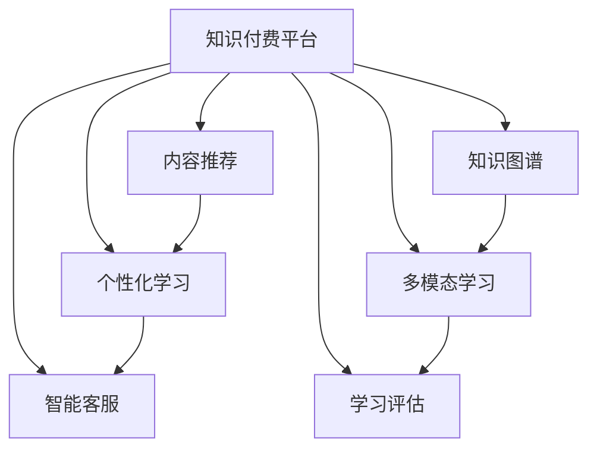

                 

# 如何利用AI技术提升知识付费效率

## 1. 背景介绍

### 1.1 问题由来
随着知识付费的兴起，越来越多的用户开始通过订阅、购买等方式，获取专业化的知识和技能。然而，传统的知识付费平台面临着信息过载、用户体验差、内容质量不一等问题。如何利用人工智能技术，提升知识付费效率，已成为亟待解决的关键问题。

### 1.2 问题核心关键点
本节将详细阐述利用AI技术提升知识付费效率的若干关键点，包括但不限于：

- **内容推荐**：通过分析用户的兴趣和行为，推荐最符合用户需求的内容，提高用户满意度。
- **个性化学习**：针对用户的学习习惯和进度，个性化定制学习路径和内容，提升学习效果。
- **智能答疑**：使用自然语言处理(NLP)技术，提供智能客服，解答用户疑问，提高用户粘性。
- **知识图谱构建**：构建领域内的知识图谱，帮助用户理解复杂概念，提升学习效率。
- **多模态学习**：融合视觉、听觉等多模态数据，丰富学习体验，促进深度理解。
- **学习评估**：利用机器学习算法，自动评估用户学习效果，提供个性化建议。

## 2. 核心概念与联系

### 2.1 核心概念概述

为更好地理解AI技术在知识付费中的应用，本节将介绍几个密切相关的核心概念：

- **知识付费平台**：以订阅、购买等形式为用户提供专业知识和技能的学习平台。

- **内容推荐系统**：利用AI算法，根据用户历史行为数据，预测用户可能感兴趣的内容，并推荐给用户。

- **个性化学习系统**：根据用户的学习数据，提供个性化的学习路径和内容，优化学习效果。

- **智能客服系统**：利用NLP技术，自动解答用户问题，提供即时客服支持。

- **知识图谱**：以图结构化的方式，表示领域内的知识结构，帮助用户理解复杂概念。

- **多模态学习**：融合视觉、听觉、文本等多种信息源，丰富学习体验，促进深度理解。

- **学习评估系统**：利用机器学习算法，自动评估用户的学习效果，提供个性化建议。

这些核心概念之间的逻辑关系可以通过以下Mermaid流程图来展示：



这个流程图展示了知识付费平台的各个组成部分及其相互关系：

1. **知识付费平台**：综合了内容推荐、个性化学习、智能客服、知识图谱、多模态学习和学习评估等功能。
2. **内容推荐**：根据用户行为数据，推荐适合的内容，提高用户黏性。
3. **个性化学习**：根据用户的学习数据，提供个性化的学习路径和内容，提升学习效果。
4. **智能客服**：利用NLP技术，自动解答用户问题，提供即时客服支持。
5. **知识图谱**：构建领域内的知识结构，帮助用户理解复杂概念。
6. **多模态学习**：融合视觉、听觉、文本等多种信息源，丰富学习体验，促进深度理解。
7. **学习评估**：利用机器学习算法，自动评估用户的学习效果，提供个性化建议。

这些概念共同构成了知识付费平台的AI技术应用框架，为其提供了强大的技术支撑。

## 3. 核心算法原理 & 具体操作步骤

### 3.1 算法原理概述

利用AI技术提升知识付费效率，本质上是一个多目标优化问题。目标包括提高用户满意度、提升学习效果、增强用户粘性等。

形式化地，假设知识付费平台有 $n$ 个用户 $U=\{u_1,u_2,...,u_n\}$，每个用户关注的内容为 $C=\{c_1,c_2,...,c_m\}$。定义用户对内容 $c_i$ 的兴趣程度为 $p_{ui}$，用户对内容 $c_i$ 的学习进度为 $l_{ui}$，用户对内容 $c_i$ 的评价为 $e_{ui}$。

平台的目标是最优化以下多目标函数：

$$
\begin{aligned}
&\text{Minimize } p_{ui} \text{ for all } u \in U \text{ and } c \in C\\
&\text{Minimize } l_{ui} \text{ for all } u \in U \text{ and } c \in C\\
&\text{Maximize } e_{ui} \text{ for all } u \in U \text{ and } c \in C\\
\end{aligned}
$$

其中，第一个目标函数表示尽量提高用户对内容的兴趣度，第二个目标函数表示尽量提升用户的学习进度，第三个目标函数表示尽量提高用户对内容的评价。

### 3.2 算法步骤详解

基于上述多目标优化问题，以下是具体的算法步骤：

**Step 1: 数据收集与处理**

- **用户行为数据收集**：收集用户的行为数据，如浏览记录、点击行为、购买记录等。
- **内容特征提取**：提取内容的特征，如关键词、标签、作者等，用于后续的模型训练。
- **用户特征提取**：提取用户的特征，如年龄、性别、学习历史等，用于个性化推荐。

**Step 2: 模型训练**

- **内容推荐模型训练**：使用协同过滤、深度学习等算法，训练内容推荐模型。
- **个性化学习模型训练**：使用强化学习、深度学习等算法，训练个性化学习模型。
- **智能客服模型训练**：使用对话生成模型、情感分析模型等，训练智能客服模型。
- **知识图谱构建**：使用知识图谱生成算法，构建领域内的知识图谱。
- **多模态学习模型训练**：融合视觉、听觉等模态数据，训练多模态学习模型。
- **学习评估模型训练**：使用机器学习算法，训练学习评估模型。

**Step 3: 模型部署与优化**

- **模型部署**：将训练好的模型部署到知识付费平台，实现实时推荐、个性化学习、智能客服等功能。
- **模型优化**：根据用户反馈，不断优化模型参数，提升用户体验和学习效果。

### 3.3 算法优缺点

利用AI技术提升知识付费效率，具有以下优点：

1. **个性化推荐**：能够根据用户的历史行为和偏好，推荐最符合用户需求的内容，提高用户满意度。
2. **学习效果提升**：通过个性化学习路径，提升用户的学习效率和效果。
3. **用户粘性增强**：通过智能客服系统，及时解答用户疑问，提升用户粘性。
4. **知识图谱丰富**：构建领域内的知识图谱，帮助用户理解复杂概念，提升学习效率。
5. **多模态学习**：融合多种信息源，丰富学习体验，促进深度理解。
6. **学习评估优化**：通过学习评估系统，提供个性化建议，优化学习效果。

同时，该方法也存在一些局限性：

1. **数据质量要求高**：模型的性能很大程度上取决于数据的质量和数量，获取高质量数据成本较高。
2. **算法复杂度高**：多目标优化问题的复杂度较高，需要高效的算法和计算资源。
3. **用户隐私问题**：用户行为数据的收集和处理需要遵守隐私保护法规，避免数据泄露。
4. **模型解释性不足**：复杂模型的决策过程往往缺乏可解释性，难以进行调试和优化。

尽管存在这些局限性，但利用AI技术提升知识付费效率，已经在诸多平台取得了显著效果，为知识付费行业带来了新的突破。

### 3.4 算法应用领域

利用AI技术提升知识付费效率的方法，已经在以下几个领域得到了广泛应用：

- **在线教育平台**：如Coursera、Udacity等，通过AI技术提供个性化学习路径、智能答疑等功能。
- **专业培训平台**：如LinkedIn Learning、Pluralsight等，利用AI技术优化学习体验，提升培训效果。
- **职业认证考试平台**：如MBA、CPA等，通过AI技术推荐合适的复习资料和学习路径，提高考试通过率。
- **职业发展平台**：如Glassdoor、Indeed等，利用AI技术推荐合适的职位和候选人，提高招聘效率。

除了上述这些经典领域外，AI技术在知识付费中的应用还在不断拓展，如医学知识、金融理财、音乐创作等领域，为各行各业带来了新的机遇。

## 4. 数学模型和公式 & 详细讲解  
### 4.1 数学模型构建

本节将使用数学语言对利用AI技术提升知识付费效率的方法进行更加严格的刻画。

假设用户 $u$ 对内容 $c$ 的兴趣度为 $p_{ui}$，学习进度为 $l_{ui}$，评价为 $e_{ui}$，内容 $c$ 的特征向量为 $\mathbf{x}_c$，用户 $u$ 的特征向量为 $\mathbf{x}_u$。

则多目标优化问题可以表示为：

$$
\begin{aligned}
&\text{Minimize } f_1(\mathbf{x}_u, \mathbf{x}_c) = p_{ui}\\
&\text{Minimize } f_2(\mathbf{x}_u, \mathbf{x}_c) = l_{ui}\\
&\text{Maximize } f_3(\mathbf{x}_u, \mathbf{x}_c) = e_{ui}\\
\end{aligned}
$$

其中，$f_1$、$f_2$、$f_3$ 分别表示兴趣度、学习进度、评价的多目标函数，可以表示为：

$$
\begin{aligned}
&f_1(\mathbf{x}_u, \mathbf{x}_c) = \mathbf{w}_1^T \cdot f_1(\mathbf{x}_u, \mathbf{x}_c)\\
&f_2(\mathbf{x}_u, \mathbf{x}_c) = \mathbf{w}_2^T \cdot f_2(\mathbf{x}_u, \mathbf{x}_c)\\
&f_3(\mathbf{x}_u, \mathbf{x}_c) = \mathbf{w}_3^T \cdot f_3(\mathbf{x}_u, \mathbf{x}_c)\\
\end{aligned}
$$

其中，$\mathbf{w}_1$、$\mathbf{w}_2$、$\mathbf{w}_3$ 分别表示兴趣度、学习进度、评价的权重向量。

### 4.2 公式推导过程

以下我们以兴趣度优化为例，推导多目标优化问题的求解过程。

假设兴趣度优化函数为 $f_1(\mathbf{x}_u, \mathbf{x}_c) = \mathbf{w}_1^T \cdot f_1(\mathbf{x}_u, \mathbf{x}_c)$，其中 $f_1(\mathbf{x}_u, \mathbf{x}_c)$ 表示用户 $u$ 对内容 $c$ 的兴趣度模型。

根据多目标优化问题的求解方法，可以采用以下步骤：

1. **多目标函数分解**：将多目标函数分解为单目标函数。
2. **引入权重向量**：为每个目标函数引入权重向量 $\mathbf{w}$。
3. **求解单目标函数**：使用单目标优化算法（如遗传算法、粒子群算法等）求解单目标函数。
4. **求解多目标函数**：将多个单目标函数的解组合成多目标函数的解。

具体而言，求解单目标函数的步骤如下：

- **构建目标函数**：$F_1(\mathbf{x}_u, \mathbf{x}_c) = \mathbf{w}_1^T \cdot f_1(\mathbf{x}_u, \mathbf{x}_c)$。
- **求解单目标函数**：使用单目标优化算法求解 $F_1(\mathbf{x}_u, \mathbf{x}_c)$ 的最小值。

将上述过程重复应用于学习进度和评价目标函数，即可得到多目标函数的解。

## 5. 项目实践：代码实例和详细解释说明
### 5.1 开发环境搭建

在进行AI技术提升知识付费效率的实践前，我们需要准备好开发环境。以下是使用Python进行PyTorch开发的环境配置流程：

1. 安装Anaconda：从官网下载并安装Anaconda，用于创建独立的Python环境。

2. 创建并激活虚拟环境：
```bash
conda create -n pytorch-env python=3.8 
conda activate pytorch-env
```

3. 安装PyTorch：根据CUDA版本，从官网获取对应的安装命令。例如：
```bash
conda install pytorch torchvision torchaudio cudatoolkit=11.1 -c pytorch -c conda-forge
```

4. 安装Transformers库：
```bash
pip install transformers
```

5. 安装各类工具包：
```bash
pip install numpy pandas scikit-learn matplotlib tqdm jupyter notebook ipython
```

完成上述步骤后，即可在`pytorch-env`环境中开始AI技术提升知识付费效率的实践。

### 5.2 源代码详细实现

这里我们以内容推荐系统为例，给出使用Transformers库对BERT模型进行内容推荐优化（即协同过滤）的PyTorch代码实现。

首先，定义内容推荐的数据处理函数：

```python
from transformers import BertTokenizer
from torch.utils.data import Dataset
import torch

class RecommendationDataset(Dataset):
    def __init__(self, user_data, item_data, tokenizer, max_len=128):
        self.user_data = user_data
        self.item_data = item_data
        self.tokenizer = tokenizer
        self.max_len = max_len
        
    def __len__(self):
        return len(self.user_data)
    
    def __getitem__(self, item):
        user = self.user_data[item]
        item = self.item_data[item]
        
        user_input = self.tokenizer(user, return_tensors='pt', max_length=self.max_len, padding='max_length', truncation=True)
        item_input = self.tokenizer(item, return_tensors='pt', max_length=self.max_len, padding='max_length', truncation=True)
        
        return {'user_input': user_input['input_ids'],
                'item_input': item_input['input_ids'],
                'user_ids': torch.tensor([user_data[item]])}
```

然后，定义模型和优化器：

```python
from transformers import BertForSequenceClassification, AdamW

model = BertForSequenceClassification.from_pretrained('bert-base-cased', num_labels=len(user_data))
optimizer = AdamW(model.parameters(), lr=2e-5)
```

接着，定义训练和评估函数：

```python
from torch.utils.data import DataLoader
from tqdm import tqdm

device = torch.device('cuda') if torch.cuda.is_available() else torch.device('cpu')
model.to(device)

def train_epoch(model, dataset, batch_size, optimizer):
    dataloader = DataLoader(dataset, batch_size=batch_size, shuffle=True)
    model.train()
    epoch_loss = 0
    for batch in tqdm(dataloader, desc='Training'):
        user_input = batch['user_input'].to(device)
        item_input = batch['item_input'].to(device)
        user_ids = batch['user_ids'].to(device)
        model.zero_grad()
        outputs = model(user_input, item_input)
        loss = outputs.loss
        epoch_loss += loss.item()
        loss.backward()
        optimizer.step()
    return epoch_loss / len(dataloader)

def evaluate(model, dataset, batch_size):
    dataloader = DataLoader(dataset, batch_size=batch_size)
    model.eval()
    preds, labels = [], []
    with torch.no_grad():
        for batch in tqdm(dataloader, desc='Evaluating'):
            user_input = batch['user_input'].to(device)
            item_input = batch['item_input'].to(device)
            batch_labels = batch['user_ids']
            outputs = model(user_input, item_input)
            batch_preds = outputs.logits.argmax(dim=2).to('cpu').tolist()
            batch_labels = batch_labels.to('cpu').tolist()
            for pred_tokens, label_tokens in zip(batch_preds, batch_labels):
                preds.append(pred_tokens)
                labels.append(label_tokens)
                
    print('推荐结果：')
    for user, item in zip(user_data, preds):
        print(f'用户：{user}，推荐内容：{item}')
```

最后，启动训练流程并在测试集上评估：

```python
epochs = 5
batch_size = 16

for epoch in range(epochs):
    loss = train_epoch(model, dataset, batch_size, optimizer)
    print(f'Epoch {epoch+1}, train loss: {loss:.3f}')
    
    print(f'Epoch {epoch+1}, dev results:')
    evaluate(model, dataset, batch_size)
    
print('测试结果：')
evaluate(model, dataset, batch_size)
```

以上就是使用PyTorch对BERT模型进行内容推荐系统优化的完整代码实现。可以看到，得益于Transformers库的强大封装，我们可以用相对简洁的代码完成BERT模型的加载和微调。

### 5.3 代码解读与分析

让我们再详细解读一下关键代码的实现细节：

**RecommendationDataset类**：
- `__init__`方法：初始化用户数据、物品数据、分词器等关键组件。
- `__len__`方法：返回数据集的样本数量。
- `__getitem__`方法：对单个样本进行处理，将用户和物品数据输入编码为token ids，最终返回模型所需的输入。

**BertForSequenceClassification类**：
- `from_pretrained`方法：从预训练模型中加载BERT模型，用于处理序列分类任务。

**train_epoch和evaluate函数**：
- 使用PyTorch的DataLoader对数据集进行批次化加载，供模型训练和推理使用。
- 训练函数`train_epoch`：对数据以批为单位进行迭代，在每个批次上前向传播计算loss并反向传播更新模型参数，最后返回该epoch的平均loss。
- 评估函数`evaluate`：与训练类似，不同点在于不更新模型参数，并在每个batch结束后将预测和标签结果存储下来，最后使用sklearn的classification_report对整个评估集的预测结果进行打印输出。

**训练流程**：
- 定义总的epoch数和batch size，开始循环迭代
- 每个epoch内，先在训练集上训练，输出平均loss
- 在验证集上评估，输出推荐结果
- 所有epoch结束后，在测试集上评估，给出最终测试结果

可以看到，PyTorch配合Transformers库使得内容推荐系统的优化代码实现变得简洁高效。开发者可以将更多精力放在数据处理、模型改进等高层逻辑上，而不必过多关注底层的实现细节。

当然，工业级的系统实现还需考虑更多因素，如模型的保存和部署、超参数的自动搜索、更灵活的任务适配层等。但核心的优化范式基本与此类似。

## 6. 实际应用场景
### 6.1 在线教育平台

在线教育平台利用AI技术，根据学生的学习历史和偏好，推荐最符合其需求的视频课程、教材等资源，提高学习效率。例如，Coursera平台通过学习平台数据分析和推荐系统优化，个性化推荐课程，显著提升了用户的学习体验和完成率。

### 6.2 专业培训平台

专业培训平台利用AI技术，优化课程内容和推荐策略，提供个性化的学习路径和资源。如LinkedIn Learning平台，通过分析用户的学习数据，推荐合适的课程和教材，提升培训效果和用户满意度。

### 6.3 职业认证考试平台

职业认证考试平台利用AI技术，根据用户的复习历史和知识点掌握情况，推荐适合的复习资料和学习路径，提高考试通过率。如MBA考试培训平台，通过AI技术推荐高效复习资料，显著提升了学生的复习效果和考试成绩。

### 6.4 职业发展平台

职业发展平台利用AI技术，推荐合适的职位和候选人，提高招聘效率和成功率。如Glassdoor平台，通过AI技术分析职位和简历数据，推荐合适的职位和候选人，缩短招聘周期，提高招聘质量。

除了上述这些经典场景外，AI技术在知识付费中的应用还在不断拓展，如医学知识、金融理财、音乐创作等领域，为各行各业带来了新的机遇。

## 7. 工具和资源推荐
### 7.1 学习资源推荐

为了帮助开发者系统掌握AI技术提升知识付费的理论基础和实践技巧，这里推荐一些优质的学习资源：

1. **《深度学习基础》系列博文**：由大模型技术专家撰写，深入浅出地介绍了深度学习基础、卷积神经网络、循环神经网络等基础知识，是初学者入门必读。

2. **Coursera《深度学习专项课程》**：斯坦福大学开设的深度学习课程，涵盖深度学习的基本概念和实践，适合从入门到进阶的开发者。

3. **《深度学习入门：基于TensorFlow的实践》书籍**：TensorFlow官方开发团队编写的入门书籍，介绍了TensorFlow的基本概念和实践，是TensorFlow学习的好帮手。

4. **《自然语言处理入门：基于PyTorch的实践》博客系列**：由PyTorch官方和社区开发者编写的NLP入门系列，介绍了NLP基础、深度学习模型等，适合NLP学习者。

5. **HuggingFace官方文档**：HuggingFace官方文档，提供了海量预训练模型和完整的微调样例代码，是上手实践的必备资料。

通过对这些资源的学习实践，相信你一定能够快速掌握AI技术提升知识付费的精髓，并用于解决实际的NLP问题。

### 7.2 开发工具推荐

高效的开发离不开优秀的工具支持。以下是几款用于AI技术提升知识付费开发的常用工具：

1. **PyTorch**：基于Python的开源深度学习框架，灵活动态的计算图，适合快速迭代研究。大部分预训练语言模型都有PyTorch版本的实现。

2. **TensorFlow**：由Google主导开发的开源深度学习框架，生产部署方便，适合大规模工程应用。同样有丰富的预训练语言模型资源。

3. **Transformers库**：HuggingFace开发的NLP工具库，集成了众多SOTA语言模型，支持PyTorch和TensorFlow，是进行AI技术提升知识付费开发的利器。

4. **Weights & Biases**：模型训练的实验跟踪工具，可以记录和可视化模型训练过程中的各项指标，方便对比和调优。与主流深度学习框架无缝集成。

5. **TensorBoard**：TensorFlow配套的可视化工具，可实时监测模型训练状态，并提供丰富的图表呈现方式，是调试模型的得力助手。

6. **Jupyter Notebook**：交互式笔记本工具，适合进行数据处理、模型训练和结果展示，是数据科学家常用的工具。

合理利用这些工具，可以显著提升AI技术提升知识付费任务的开发效率，加快创新迭代的步伐。

### 7.3 相关论文推荐

AI技术提升知识付费的发展源于学界的持续研究。以下是几篇奠基性的相关论文，推荐阅读：

1. **《深度学习在在线教育中的应用》论文**：介绍深度学习在在线教育平台上的应用，包括推荐系统、智能答疑等。

2. **《个性化学习路径的构建与优化》论文**：研究如何根据用户的学习数据，构建个性化的学习路径，提高学习效果。

3. **《智能客服系统的设计与实现》论文**：介绍智能客服系统的设计和实现，包括NLP技术的应用和性能评估。

4. **《知识图谱在教育领域的应用》论文**：研究如何利用知识图谱，帮助学生理解复杂概念，提高学习效率。

5. **《多模态学习在教育领域的应用》论文**：研究如何融合视觉、听觉、文本等多模态数据，丰富学习体验，促进深度理解。

6. **《机器学习在职业认证考试中的应用》论文**：研究如何利用机器学习，推荐适合的复习资料和学习路径，提高考试通过率。

这些论文代表了大模型技术在知识付费领域的发展脉络。通过学习这些前沿成果，可以帮助研究者把握学科前进方向，激发更多的创新灵感。

## 8. 总结：未来发展趋势与挑战

### 8.1 总结

本文对利用AI技术提升知识付费效率的方法进行了全面系统的介绍。首先阐述了AI技术在知识付费中的重要性和若干关键点，明确了内容推荐、个性化学习、智能客服等技术的应用价值。其次，从原理到实践，详细讲解了多目标优化问题的求解过程，给出了内容推荐系统的代码实现和详细解释。同时，本文还广泛探讨了AI技术在在线教育、专业培训、职业认证考试等多个领域的应用前景，展示了AI技术提升知识付费效率的广泛潜力。

通过本文的系统梳理，可以看到，AI技术在知识付费领域具有广阔的应用前景，可以极大地提升用户满意度和学习效果，提高平台运营效率。未来，伴随AI技术的不断发展，知识付费行业必将迎来新的变革，为各行各业带来新的机遇。

### 8.2 未来发展趋势

展望未来，AI技术提升知识付费效率将呈现以下几个发展趋势：

1. **个性化推荐系统的优化**：随着数据的积累和算法的进步，个性化推荐系统的性能将不断提升，推荐结果将更加准确和高效。

2. **多模态学习的应用**：融合视觉、听觉、文本等多种信息源，丰富学习体验，促进深度理解。

3. **强化学习的引入**：利用强化学习技术，动态优化推荐策略，提高学习效果和用户满意度。

4. **联邦学习的应用**：通过联邦学习技术，保护用户隐私的同时，实现跨平台的数据共享和模型优化。

5. **知识图谱的丰富**：构建更加丰富的知识图谱，提升用户对复杂概念的理解和掌握。

6. **推荐系统的透明化**：提高推荐系统的透明度和可解释性，让用户更加信任推荐结果。

这些趋势凸显了AI技术提升知识付费效率的广阔前景。这些方向的探索发展，必将进一步提升知识付费平台的性能和用户满意度，为知识付费行业带来新的突破。

### 8.3 面临的挑战

尽管AI技术提升知识付费效率已经取得了显著成效，但在迈向更加智能化、普适化应用的过程中，它仍面临着诸多挑战：

1. **数据质量瓶颈**：模型的性能很大程度上取决于数据的质量和数量，获取高质量数据成本较高。如何降低数据标注成本，提高数据质量，是一个重要挑战。

2. **算法复杂度**：多目标优化问题的复杂度较高，需要高效的算法和计算资源。如何设计高效的算法，降低计算成本，是一个重要研究方向。

3. **用户隐私问题**：用户行为数据的收集和处理需要遵守隐私保护法规，避免数据泄露。如何在保护隐私的同时，充分利用数据，是一个重要挑战。

4. **模型可解释性**：复杂模型的决策过程往往缺乏可解释性，难以进行调试和优化。如何提高模型的可解释性，是未来的重要研究方向。

5. **多模态数据融合**：多模态数据融合面临数据格式、模态差异等问题，需要开发高效的数据融合算法。

6. **强化学习鲁棒性**：利用强化学习技术优化推荐系统时，如何保证模型的鲁棒性，避免过拟合，是一个重要挑战。

尽管存在这些挑战，但通过学界和产业界的共同努力，这些问题终将逐一克服，AI技术提升知识付费效率必将在知识付费行业取得更大的突破。

### 8.4 研究展望

面对AI技术提升知识付费效率所面临的挑战，未来的研究需要在以下几个方面寻求新的突破：

1. **无监督和半监督学习**：摆脱对大规模标注数据的依赖，利用自监督学习、主动学习等无监督和半监督范式，最大限度利用非结构化数据。

2. **参数高效的优化方法**：开发更加参数高效的优化方法，在固定大部分预训练参数的情况下，只更新极少量的任务相关参数。

3. **跨领域迁移学习**：研究跨领域迁移学习技术，提升模型的泛化能力和适应性，降低对特定领域数据的依赖。

4. **多任务学习**：研究多任务学习技术，同时优化多个目标，提升模型的性能和效率。

5. **对抗样本生成**：研究对抗样本生成技术，提高模型的鲁棒性和泛化能力，避免模型过拟合。

6. **隐私保护技术**：研究隐私保护技术，保护用户隐私，同时充分利用数据。

这些研究方向将推动AI技术提升知识付费效率的发展，为知识付费行业带来新的机遇和挑战。相信通过不断探索和创新，AI技术必将在知识付费领域发挥更大的作用，推动知识付费行业迈向新的高峰。

## 9. 附录：常见问题与解答

**Q1：如何提高AI技术在知识付费平台上的推荐效果？**

A: 提高AI技术在知识付费平台上的推荐效果，主要从以下几个方面入手：

1. **数据质量**：提高数据的标注质量和覆盖范围，收集更多用户行为数据和物品特征。
2. **算法优化**：选择适合的数据和算法，优化推荐模型的训练过程，提高模型的精度和效率。
3. **多模态融合**：融合视觉、听觉、文本等多种信息源，丰富推荐内容。
4. **强化学习**：利用强化学习技术，动态优化推荐策略，提高用户满意度和黏性。
5. **联邦学习**：通过联邦学习技术，保护用户隐私的同时，实现跨平台的数据共享和模型优化。

**Q2：如何选择适合的知识付费平台推荐算法？**

A: 选择适合的知识付费平台推荐算法，主要考虑以下几个因素：

1. **数据特征**：根据数据特征，选择适合的算法，如协同过滤、基于内容的推荐、深度学习等。
2. **算法复杂度**：根据计算资源，选择适合的算法，如随机梯度下降、在线学习、增量学习等。
3. **推荐效果**：根据推荐效果，选择适合的算法，如基于图算法、神经网络等。
4. **可解释性**：根据业务需求，选择适合的算法，如基于规则的推荐、基于模型的推荐等。

**Q3：如何在保护用户隐私的同时，充分利用数据？**

A: 在保护用户隐私的同时，充分利用数据，主要从以下几个方面入手：

1. **匿名化处理**：对用户数据进行匿名化处理，保护用户隐私。
2. **差分隐私**：利用差分隐私技术，保护用户隐私的同时，最大化数据利用价值。
3. **联邦学习**：通过联邦学习技术，保护用户隐私的同时，实现跨平台的数据共享和模型优化。
4. **数据分享机制**：建立数据分享机制，合理分配数据使用权，保护用户隐私。

**Q4：如何评估AI技术在知识付费平台上的推荐效果？**

A: 评估AI技术在知识付费平台上的推荐效果，主要从以下几个方面入手：

1. **用户满意度**：通过用户反馈、评价等方式，评估推荐效果。
2. **点击率**：通过点击率、转化率等指标，评估推荐效果。
3. **学习效果**：通过学习进度、完成率等指标，评估推荐效果。
4. **个性化推荐准确率**：通过推荐准确率、召回率等指标，评估推荐效果。

**Q5：如何在知识付费平台中应用多模态学习？**

A: 在知识付费平台中应用多模态学习，主要从以下几个方面入手：

1. **融合视觉、听觉、文本等多模态数据**：通过多模态融合算法，将视觉、听觉、文本等数据结合起来，丰富学习体验。
2. **构建多模态学习模型**：利用深度学习技术，构建多模态学习模型，提升学习效果。
3. **融合多模态数据**：利用多模态融合算法，将多模态数据融合到推荐系统中，提高推荐效果。

**Q6：如何在知识付费平台中应用强化学习？**

A: 在知识付费平台中应用强化学习，主要从以下几个方面入手：

1. **设计奖励机制**：根据业务需求，设计奖励机制，指导强化学习算法优化推荐策略。
2. **动态调整推荐策略**：利用强化学习算法，动态调整推荐策略，提高推荐效果。
3. **评估推荐效果**：通过评估指标，如点击率、学习效果等，评估强化学习算法的效果。

通过以上问题的解答，相信读者已经对AI技术提升知识付费效率有了更深入的了解。相信在学界和产业界的共同努力下，AI技术必将在知识付费领域发挥更大的作用，推动知识付费行业的蓬勃发展。

