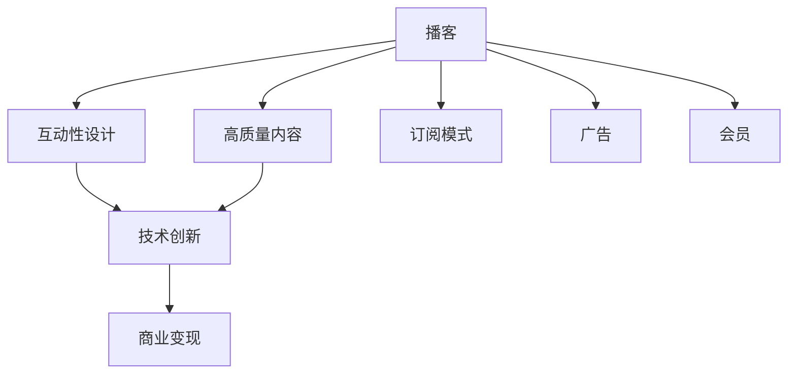

                 

# 如何利用podcast进行技术知识付费

> 关键词：
>
> - 技术知识付费
> - 高质量内容
> - 播客（Podcast）
> - 知识营销
> - 订阅模式
> - 商业变现

## 1. 背景介绍

### 1.1 问题由来
在数字化时代，信息过载成为一种常态。用户对于高质量、有深度的技术内容需求日益增加。然而，碎片化的时间、有限的注意力，使得传统的内容生产和消费模式难以满足用户的全时性、即时性和互动性需求。

技术知识付费作为一种新兴的内容消费模式，通过高质量、有深度的技术知识内容，满足用户对高效、系统、深入学习的需求，帮助用户提升技术能力和行业竞争力。在此背景下，如何利用高效、便捷、互动性强的媒介形式，如播客（Podcast），成为技术知识付费的新热点。

### 1.2 问题核心关键点
播客作为一种音频形式的内容传播渠道，以其便捷性、即时性、互动性强等特性，逐渐成为技术知识付费的重要形式。其核心关键点包括：

- 高质量内容：播客内容的高质量、深度和系统性，是其吸引用户和实现付费的核心要素。
- 互动性：播客的实时互动性，能够增强用户参与感和粘性。
- 商业变现：播客的订阅模式、广告、会员等变现方式，是其商业可持续性的保障。
- 技术创新：结合人工智能、大数据等技术，提升播客内容的个性化推荐和精准分发能力。

本文将深入探讨如何利用播客进行技术知识付费，包括高质量内容的制作、互动性设计、商业变现策略及技术创新等方面的内容。

## 2. 核心概念与联系

### 2.1 核心概念概述

为更好地理解利用播客进行技术知识付费的方法，本节将介绍几个密切相关的核心概念：

- **播客（Podcast）**：一种音频形式的数字媒体，具有可订阅、跨平台等特点，用户可随时随地收听。
- **技术知识付费**：通过提供高质量、有深度的技术知识内容，满足用户对学习、提升技能的需求，实现内容变现。
- **高质量内容**：指内容制作精良，信息密度高、逻辑清晰、有深度，能够满足用户的学习需求。
- **互动性设计**：通过技术手段提升播客的互动性，增强用户参与感和粘性。
- **商业变现**：包括订阅费、广告收入、会员费等多种变现方式，是播客可持续发展的关键。
- **技术创新**：结合人工智能、大数据等技术，提升播客内容的个性化推荐和精准分发能力。

这些核心概念之间的逻辑关系可以通过以下Mermaid流程图来展示：



这个流程图展示播客的核心概念及其之间的关系：

1. 高质量内容是播客吸引用户和实现付费的基础。
2. 互动性设计增强用户参与感和粘性。
3. 技术创新提升播客内容的个性化推荐和精准分发能力。
4. 商业变现保障播客的可持续性。

这些概念共同构成了利用播客进行技术知识付费的基础，为其发展提供了理论支撑和实践指导。

## 3. 核心算法原理 & 具体操作步骤
### 3.1 算法原理概述

播客作为技术知识付费的媒介形式，其核心算法原理基于高质量内容的制作、互动性设计、商业变现策略及技术创新。

### 3.2 算法步骤详解

利用播客进行技术知识付费的完整步骤包括：

1. **内容制作**：
   - 选择合适的播客平台，确定播客主题和内容框架。
   - 招募嘉宾、策划访谈大纲、准备素材，进行内容录制。
   - 后期剪辑、制作、配音，形成高质量内容。
2. **互动性设计**：
   - 引入实时互动技术，如直播、问答、社区讨论等。
   - 开发配套应用，如播客APP、微信小程序等，提升用户体验。
3. **商业变现**：
   - 通过付费订阅、广告、会员等多种变现方式实现收益。
   - 分析用户数据，进行精准广告投放，提升广告效果。
4. **技术创新**：
   - 引入人工智能、大数据等技术，提升内容推荐和分发能力。
   - 通过用户行为分析，优化播客内容和互动设计。

### 3.3 算法优缺点

利用播客进行技术知识付费的方法具有以下优点：
1. **便捷性**：用户可以随时随地收听，满足碎片化时间的学习需求。
2. **互动性强**：通过实时互动技术，增强用户参与感和粘性。
3. **商业变现多样**：包括付费订阅、广告、会员等多种变现方式，保障播客的可持续性。
4. **个性化推荐**：利用人工智能和大数据技术，提升播客内容的个性化推荐和精准分发能力。

同时，该方法也存在一定的局限性：
1. **内容制作成本高**：高质量内容的制作需要投入大量时间和资源。
2. **互动技术依赖**：互动性设计依赖于技术手段，可能存在技术实现的复杂性。
3. **用户筛选难度**：如何精准筛选用户，提升播客的实际收益，仍需进一步探索。
4. **商业变现受限**：部分播客变现方式可能受到平台监管、用户认知等限制。

尽管存在这些局限性，但就目前而言，利用播客进行技术知识付费已成为一种高效、便捷、互动性强的内容消费模式，具有广泛的应用前景。

### 3.4 算法应用领域

利用播客进行技术知识付费的方法，在技术教育、软件开发、数据分析等多个领域得到了广泛应用，成为技术知识传播的重要途径。

- **技术教育**：
  - 通过播客传授编程语言、算法、数据结构等基础技术知识，帮助学习者系统掌握技术技能。
  - 设计互动性高的播客，如编程挑战、技术问题解答等，提升学习效果。
- **软件开发**：
  - 分享软件开发的最佳实践、最新技术趋势，帮助开发者提升工作效率。
  - 邀请业界大咖进行访谈，分享实战经验，增强开发者对行业趋势的敏锐度。
- **数据分析**：
  - 讲解数据分析的基础知识、常用工具和技能，帮助用户提升数据处理能力。
  - 分享实际案例分析，展示数据分析在各个行业的应用，增强用户应用意识。

除了上述这些领域，播客还可以应用于更多场景中，如人工智能、网络安全、区块链等技术领域，为技术知识传播提供新的平台。

## 4. 数学模型和公式 & 详细讲解 & 举例说明

### 4.1 数学模型构建

假设播客内容的制作成本为 $C$，订阅费用为 $S$，广告收入为 $A$，会员费为 $M$，总收益为 $R$。则总收益模型可以表示为：

$$
R = S \times N + A + M \times M_{\text{sub}} - C
$$

其中 $N$ 为订阅用户数量，$M_{\text{sub}}$ 为会员数量。

### 4.2 公式推导过程

根据上述模型，我们可以通过以下步骤推导出总收益的计算公式：

1. 订阅收入：
   $$
   S \times N = S \times \text{订阅用户数量}
   $$
2. 广告收入：
   $$
   A = \text{广告收入}
   $$
3. 会员收入：
   $$
   M \times M_{\text{sub}} = M \times \text{会员数量}
   $$
4. 总成本：
   $$
   C = \text{内容制作成本}
   $$

将这些公式组合起来，我们得到总收益的计算公式：

$$
R = S \times N + A + M \times M_{\text{sub}} - C
$$

### 4.3 案例分析与讲解

以某技术教育播客为例，分析其商业变现的具体实现方式：

1. **订阅收入**：播客每月订阅费用为 $10$ 元，用户数量为 $10,000$。则每月订阅收入为：

   $$
   S \times N = 10 \times 10,000 = 100,000
   $$

2. **广告收入**：每月通过平台广告收入为 $100,000$。

3. **会员收入**：每月推出高级会员，会员费用为 $20$ 元，会员数量为 $5,000$。则每月会员收入为：

   $$
   M \times M_{\text{sub}} = 20 \times 5,000 = 100,000
   $$

4. **总成本**：每月内容制作成本为 $50,000$。

代入公式，计算总收益为：

$$
R = 100,000 + 100,000 + 100,000 - 50,000 = 250,000
$$

通过上述计算，我们可以看到，该播客通过订阅、广告、会员等多种变现方式，实现了每月 $250,000$ 元的收益。

## 5. 项目实践：代码实例和详细解释说明
### 5.1 开发环境搭建

在进行播客内容制作和商业变现的开发实践前，我们需要准备好开发环境。以下是使用Python进行Flask开发的环境配置流程：

1. 安装Python：从官网下载并安装Python，用于开发播客平台。
2. 创建虚拟环境：
```bash
python3 -m venv env
source env/bin/activate
```

3. 安装Flask：
```bash
pip install flask
```

4. 安装其他相关库：
```bash
pip install pyaudio audiogen
```

完成上述步骤后，即可在虚拟环境中开始播客开发实践。

### 5.2 源代码详细实现

下面以一个简单的播客内容制作和商业变现系统为例，展示如何使用Flask和PyAudio进行播客开发。

首先，创建一个Flask应用：

```python
from flask import Flask, render_template, request, jsonify
import pyaudio

app = Flask(__name__)

@app.route('/')
def index():
    return render_template('index.html')

@app.route('/recorder')
def recorder():
    stream = pyaudio.Stream(format=pyaudio.paInt16, channels=2, rate=16000, frames_per_buffer=1024)
    recording = []

    while True:
        data = stream.read()
        recording.append(data)

    stream.stop_stream()
    stream.close()

    wave = pyaudio.PyAudio().open(stream)
    wave.write_frames(bytes(recording))

    return jsonify({'filename': 'recording.wav'})
```

然后，创建一个HTML页面用于播放录音：

```html
<!DOCTYPE html>
<html>
<head>
    <title>播客录制</title>
</head>
<body>
    <audio controls>
        <source src="{{ url_for('recorder') }}" type="audio/wav">
        您的浏览器不支持HTML5音频元素
    </audio>
</body>
</html>
```

最后，启动Flask应用：

```bash
python app.py
```

完成上述步骤后，即可在本地运行播客录制系统，用户可以通过该系统录制音频内容。

### 5.3 代码解读与分析

让我们再详细解读一下关键代码的实现细节：

**Flask应用**：
- `app` 实例化 Flask 应用。
- `@app.route` 装饰器定义路由。
- `index` 方法渲染 HTML 页面，展示录制界面。
- `recorder` 方法使用 PyAudio 录制音频，并返回录音文件路径。

**HTML页面**：
- `<audio>` 标签定义音频播放元素。
- `controls` 属性展示播放控件，如播放/暂停、音量调节等。
- `source` 属性指定音频源，通过 URL 访问录音文件。

**录制系统**：
- `pyaudio.Stream` 实例化音频流，用于录制音频。
- `while` 循环实时读取音频数据，存入列表 `recording` 中。
- `stream.stop_stream()` 停止音频流。
- `stream.close()` 关闭音频流。
- `wave.open()` 打开录音文件，`wave.write_frames()` 将录音数据写入文件。

**运行结果展示**：
启动 Flask 应用后，在浏览器中访问 `/` 路径，即可看到录制界面。点击录制按钮，用户可以开始录制音频内容。录制完成后，系统会自动保存录音文件，并生成录音文件路径。用户可以通过音频标签播放录音内容。

## 6. 实际应用场景
### 6.1 技术教育

利用播客进行技术教育，可以打破传统教育的时间和地点限制，提供灵活、便捷的学习方式。技术教育播客通过邀请专家、分享实战经验，帮助学习者系统掌握技术知识，提升技术能力和行业竞争力。

例如，某技术教育播客平台推出了一系列软件开发系列播客，每期邀请业界大咖分享编程语言、框架、工具等技术知识，结合实战案例进行详细讲解。学习者可以在通勤、锻炼、休闲等碎片化时间收听播客，提升技术水平。

### 6.2 软件开发

播客在软件开发领域的应用同样广泛。通过播客分享软件开发的最佳实践、最新技术趋势，帮助开发者提升工作效率，解决实际问题。

某编程语言播客平台推出了多个系列播客，涵盖编程语言的语法、常用库、开发技巧等方面。通过专家访谈、代码示例、问题解答等形式，系统讲解编程语言的使用和开发，提升开发者的编程能力和问题解决能力。

### 6.3 数据分析

数据分析播客通过讲解数据分析的基础知识、常用工具和技能，帮助用户提升数据处理能力。结合实际案例分析，展示数据分析在各个行业的应用，增强用户的应用意识。

例如，某数据分析播客平台推出了多个系列播客，涵盖数据清洗、数据可视化、数据挖掘等方面。通过专家访谈、代码示例、案例分析等形式，系统讲解数据分析的方法和应用场景，提升用户的分析能力和应用水平。

### 6.4 未来应用展望

随着播客内容制作技术的不断提升和播客平台的多样化，播客在未来将有更广阔的应用前景。

- **AI生成内容**：利用人工智能技术，生成高质量的播客内容，提升内容制作的效率和质量。
- **多平台分发**：通过多个平台进行播客内容的分发，扩大受众范围，提升播放次数和用户粘性。
- **个性化推荐**：结合用户行为数据，进行个性化播客内容的推荐，提升用户体验和互动性。
- **实时互动**：引入实时互动技术，如直播、问答、社区讨论等，增强用户参与感和粘性。
- **商业变现**：通过付费订阅、广告、会员等多种变现方式，实现播客的商业可持续性。

## 7. 工具和资源推荐
### 7.1 学习资源推荐

为了帮助开发者系统掌握播客内容制作和商业变现的技术知识，这里推荐一些优质的学习资源：

1. **《播客内容制作指南》**：一本详细介绍播客内容制作流程和方法的书籍，涵盖录音设备选择、音频编辑、内容创意等方面。
2. **《播客商业变现》**：一本专注于播客商业变现的书籍，介绍播客变现的多种方式和策略，并提供实际案例分析。
3. **播客制作工具教程**：各大播客平台提供的详细教程，如Anchor、Spotify等，介绍播客内容制作流程和工具使用。
4. **播客商业变现案例分享**：各大播客平台提供的成功案例分享，了解播客变现的实际效果和策略。
5. **播客数据分析工具**：谷歌分析、Facebook Insights等工具，用于播客内容的流量分析、用户行为分析等。

通过对这些资源的学习实践，相信你一定能够快速掌握播客内容制作和商业变现的精髓，并用于解决实际的播客问题。

### 7.2 开发工具推荐

高效的播客内容制作和商业变现开发离不开优秀的工具支持。以下是几款用于播客开发和商业变现的常用工具：

1. **Flask**：基于Python的轻量级Web框架，适合快速迭代研究。
2. **PyAudio**：Python音频库，用于录制和播放音频内容。
3. **FFmpeg**：开源的多媒体框架，支持音频、视频等多种格式的处理和转换。
4. **Audacity**：免费音频编辑软件，支持多种音频格式的处理和剪辑。
5. **SoundCloud**：播客内容分发平台，支持音频内容的上传和播放，并具备社交功能。
6. **Spotify**：全球最大的音乐流媒体平台，支持播客内容的播放和订阅。

合理利用这些工具，可以显著提升播客内容制作和商业变现的开发效率，加快创新迭代的步伐。

### 7.3 相关论文推荐

播客内容制作和商业变现的发展源于学界的持续研究。以下是几篇奠基性的相关论文，推荐阅读：

1. **《播客内容制作技术研究》**：详细介绍了播客内容制作的技术细节和方法，包括录音设备选择、音频编辑、内容创意等方面。
2. **《播客商业变现策略》**：研究播客变现的多种方式和策略，并提供实际案例分析。
3. **《播客互动性设计》**：介绍播客互动性设计的技术手段和方法，如直播、问答、社区讨论等。
4. **《播客个性化推荐》**：研究播客内容推荐的技术和算法，提升播客内容的个性化推荐和精准分发能力。

这些论文代表了大规模语言模型微调技术的发展脉络。通过学习这些前沿成果，可以帮助研究者把握学科前进方向，激发更多的创新灵感。

## 8. 总结：未来发展趋势与挑战
### 8.1 总结

本文对利用播客进行技术知识付费的方法进行了全面系统的介绍。首先阐述了播客作为技术知识付费媒介的优势，明确了高质量内容、互动性设计、商业变现策略及技术创新等关键要素。其次，从原理到实践，详细讲解了播客内容制作、互动性设计、商业变现策略及技术创新等方面的内容，给出了播客内容制作和商业变现的完整代码实例。同时，本文还探讨了播客在技术教育、软件开发、数据分析等多个领域的应用前景，展示了播客内容制作和商业变现的广泛应用价值。

通过本文的系统梳理，可以看到，利用播客进行技术知识付费，能够突破时间和空间限制，提供高效、便捷、互动性强的技术知识内容，满足用户对学习、提升技能的需求，帮助用户提升技术能力和行业竞争力。播客作为技术知识付费的新兴形式，其发展前景广阔，具有广泛的应用前景。

### 8.2 未来发展趋势

展望未来，播客内容制作和商业变现将呈现以下几个发展趋势：

1. **AI生成内容**：利用人工智能技术，生成高质量的播客内容，提升内容制作的效率和质量。
2. **多平台分发**：通过多个平台进行播客内容的分发，扩大受众范围，提升播放次数和用户粘性。
3. **个性化推荐**：结合用户行为数据，进行个性化播客内容的推荐，提升用户体验和互动性。
4. **实时互动**：引入实时互动技术，如直播、问答、社区讨论等，增强用户参与感和粘性。
5. **商业变现**：通过付费订阅、广告、会员等多种变现方式，实现播客的商业可持续性。

以上趋势凸显了播客内容制作和商业变现技术的广阔前景。这些方向的探索发展，必将进一步提升播客内容的质量和互动性，吸引更多用户参与，实现商业变现。

### 8.3 面临的挑战

尽管播客内容制作和商业变现技术已经取得了瞩目成就，但在迈向更加智能化、普适化应用的过程中，仍面临诸多挑战：

1. **内容制作成本高**：高质量内容的制作需要投入大量时间和资源。
2. **互动技术依赖**：互动性设计依赖于技术手段，可能存在技术实现的复杂性。
3. **用户筛选难度**：如何精准筛选用户，提升播客的实际收益，仍需进一步探索。
4. **商业变现受限**：部分播客变现方式可能受到平台监管、用户认知等限制。

尽管存在这些局限性，但就目前而言，利用播客进行技术知识付费已成为一种高效、便捷、互动性强的内容消费模式，具有广泛的应用前景。

### 8.4 研究展望

面对播客内容制作和商业变现所面临的挑战，未来的研究需要在以下几个方面寻求新的突破：

1. **AI生成内容技术**：探索更高效、更智能的AI生成内容技术，提升播客内容的制作效率和质量。
2. **个性化推荐算法**：研究更精准、更高效的个性化推荐算法，提升播客内容的个性化推荐和精准分发能力。
3. **实时互动技术**：开发更灵活、更便捷的实时互动技术，增强用户参与感和粘性。
4. **多平台分发策略**：探索更高效、更广泛的多平台分发策略，扩大播客内容的受众范围。
5. **商业变现模式**：研究更多元、更可持续的商业变现模式，实现播客的商业可持续性。

这些研究方向的探索，必将引领播客内容制作和商业变现技术迈向更高的台阶，为技术知识付费的发展提供新的动力。

## 9. 附录：常见问题与解答

**Q1：播客内容制作成本高，如何降低成本？**

A: 利用AI生成内容技术，减少内容制作的人力成本和时间成本。采用自动化录音和剪辑工具，如Audacity、FFmpeg等，提升效率。

**Q2：如何提升播客内容的互动性？**

A: 引入直播、问答、社区讨论等实时互动技术，增强用户参与感和粘性。开发配套应用，如播客APP、微信小程序等，提升用户体验。

**Q3：播客变现受限，如何拓宽变现渠道？**

A: 除了广告、订阅费用外，还可以通过会员费、课程销售、赞助等方式进行变现。分析用户数据，进行精准广告投放，提升广告效果。

**Q4：如何保证播客内容的质量？**

A: 选择合适的播客平台，进行严格的内容审核。邀请业界专家进行内容评审，提升播客内容的权威性和可信度。

**Q5：如何保证播客内容的安全性？**

A: 对播客内容进行安全检测，避免恶意内容和有害信息。引入隐私保护技术，保护用户隐私数据。

这些问题的回答，希望能为你提供播客内容制作和商业变现方面的技术指导和解决方案，帮助你更好地利用播客进行技术知识付费，实现商业成功。

---

作者：禅与计算机程序设计艺术 / Zen and the Art of Computer Programming

