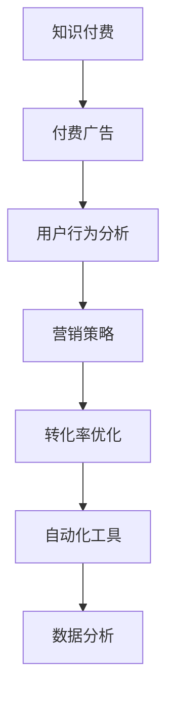

                 

# 如何利用付费广告推广知识付费产品

> 关键词：
- 知识付费
- 付费广告
- 用户行为分析
- 营销策略
- 转化率优化
- 自动化工具
- 数据分析

## 1. 背景介绍

### 1.1 问题由来
随着互联网技术的迅速发展，知识付费作为一种新兴的商业模式，已经在教育、金融、IT等领域得到了广泛应用。各大平台如喜马拉雅、得到、知乎等，通过提供优质的内容吸引用户，逐渐形成了稳定的用户群体。但随着内容的同质化竞争加剧，如何吸引新用户，提升用户留存率，成为平台亟需解决的难题。

与此同时，付费广告作为互联网营销的重要手段，近年来也得到快速发展。Google Ads、Facebook Ads等平台提供的精准投放功能，使得广告主可以更加高效地触达目标用户。通过付费广告推广知识付费产品，可以有效提升用户注册、购买等行为，实现快速增长。

### 1.2 问题核心关键点
推广知识付费产品的付费广告策略，关键在于以下几个方面：
- 选择合适的广告平台和投放策略
- 精准定位目标用户群体
- 设计高效吸引用户注意的广告素材
- 优化广告投放和效果监测
- 持续提升用户转化率

本文将详细介绍如何在各大付费广告平台上推广知识付费产品，帮助平台提升用户转化，实现稳定增长。

## 2. 核心概念与联系

### 2.1 核心概念概述

为更好地理解付费广告在知识付费产品推广中的应用，本节将介绍几个密切相关的核心概念：

- **知识付费**：通过付费的方式，为用户提供有价值的知识产品，如课程、电子书、研究报告等。平台通过优质内容的持续输出，获得用户订阅费或购买费。
- **付费广告**：通过在付费广告平台上投放广告，触达目标用户，引导用户注册、订阅或购买知识产品。
- **用户行为分析**：通过数据分析工具，了解用户行为特征，优化广告投放策略，提升用户转化率。
- **营销策略**：根据平台定位和用户特性，制定合理的营销计划和推广手段。
- **转化率优化**：通过数据分析和A/B测试，不断优化广告内容、投放策略，提升广告的点击率、注册率、购买率等关键指标。
- **自动化工具**：利用广告平台的自动化投放和优化功能，减少人工干预，提高广告投放效率。
- **数据分析**：通过统计分析工具，评估广告效果，调整广告投放策略。

这些核心概念之间的逻辑关系可以通过以下Mermaid流程图来展示：



这个流程图展示的核心概念及其之间的关系：

1. 知识付费产品通过付费广告进行推广，吸引新用户。
2. 通过用户行为分析，了解用户特性和需求，优化广告投放策略。
3. 制定合理的营销策略，提高广告的吸引力和转化效果。
4. 不断优化广告内容、投放策略，提升转化率。
5. 利用自动化工具提高广告投放效率，减少人工干预。
6. 通过数据分析工具评估广告效果，调整投放策略。

## 3. 核心算法原理 & 具体操作步骤

### 3.1 算法原理概述

付费广告推广知识付费产品，本质上是通过数据驱动的精准营销过程。其核心思想是：通过分析用户行为数据，找到最有可能对广告内容产生兴趣的用户群体，投放匹配度高的广告内容，最终实现广告的高点击率和高转化率。

形式化地，假设知识付费产品的广告预算为 $B$，每个用户点击广告的成本为 $C$，用户点击后的购买率为 $\eta$，则预期的总收益 $R$ 为：

$$
R = \eta \cdot B / C
$$

目标是最大化收益 $R$。为此，需要在付费广告平台上选择合适的广告位和投放策略，设置合适的广告预算和投放时间，不断优化广告素材和创意，提高广告的吸引力和转化率。

### 3.2 算法步骤详解

基于数据驱动的精准营销，付费广告推广知识付费产品的一般步骤包括：

**Step 1: 收集用户行为数据**

- 收集用户在知识付费平台上的行为数据，如浏览记录、点击次数、订阅记录等。
- 使用数据可视化工具（如Tableau、PowerBI等）对数据进行初步分析，了解用户行为特征和偏好。

**Step 2: 选择广告平台和广告位**

- 根据用户行为特征和投放目标，选择合适的广告平台，如Google Ads、Facebook Ads、抖音等。
- 在广告平台上选择合适的广告位，如搜索广告、展示广告、视频广告等，进行投放测试。

**Step 3: 设置广告预算和投放策略**

- 根据广告效果和预算规模，合理分配广告预算，设置每日投放金额。
- 设置广告投放的时间窗口，如在用户活跃时段进行投放，提高广告效果。
- 设置广告投放的地域、年龄、性别等定向条件，确保广告投放的精准度。

**Step 4: 设计广告素材和创意**

- 设计具有吸引力的广告素材，如图片、视频、标题等，确保广告能够吸引用户注意。
- 编写简明扼要的广告文案，突出产品亮点和优惠信息，提高用户点击率。

**Step 5: 优化广告投放和效果监测**

- 使用广告平台的优化工具，自动优化广告投放策略，提高广告效果。
- 设置关键绩效指标（KPI），如点击率、转化率、投资回报率（ROI）等，实时监测广告效果。
- 根据数据分析结果，调整广告素材和投放策略，提升广告效果。

**Step 6: 持续优化广告投放**

- 定期进行A/B测试，比较不同广告素材和投放策略的效果，优化广告效果。
- 使用自动化工具，如Google Ads Manager、Facebook Ads Manager等，提高广告投放效率，减少人工干预。
- 定期评估广告效果，调整广告投放策略，实现持续优化。

### 3.3 算法优缺点

付费广告推广知识付费产品的方法具有以下优点：

1. **高效触达目标用户**：通过精准定向，可以有效触达目标用户群体，提高广告的点击率和转化率。
2. **灵活调整策略**：利用数据驱动的优化工具，可以快速调整广告投放策略，提升广告效果。
3. **低成本高回报**：通过高效的广告投放和优化，可以在较低的成本下实现较高的转化率，提高广告投资回报率。
4. **便于控制和评估**：广告投放过程可以通过数据分析和可视化工具进行实时监测和评估，便于优化投放策略。

同时，该方法也存在一定的局限性：

1. **数据依赖**：广告效果依赖于用户行为数据的准确性和全面性，数据收集和分析过程较为复杂。
2. **广告创意质量要求高**：广告素材和创意质量直接影响广告的点击率和转化率，创意设计需要较高的技术水平。
3. **广告成本控制难度大**：广告投放过程中可能存在浪费预算的情况，控制广告成本较为困难。
4. **用户敏感度高**：过度频繁的广告投放可能引起用户反感，影响平台口碑。

尽管存在这些局限性，但就目前而言，基于数据驱动的精准营销方法仍是付费广告推广知识付费产品的核心手段。未来相关研究的重点在于如何进一步提高数据收集和分析的效率，优化广告创意和素材设计，控制广告投放成本，同时兼顾广告效果和用户体验。

### 3.4 算法应用领域

基于数据驱动的精准营销方法，在知识付费产品的推广中得到了广泛应用，涵盖了以下主要领域：

- **在线教育**：通过精准广告投放，推广在线课程，吸引用户注册和购买。
- **专业培训**：利用广告投放，推广职业培训课程，提升专业技能。
- **企业培训**：通过定向广告，推广企业培训课程，助力企业人才提升。
- **金融投资**：利用广告投放，推广金融课程、投资分析报告等，吸引投资者注册和订阅。
- **IT技术**：通过广告推广，吸引开发者、技术爱好者订阅技术博客、课程等。

这些领域中，付费广告已经成为知识付费产品的重要推广手段，助力平台实现快速增长。随着平台对用户行为数据的积累和分析能力的提升，未来付费广告在知识付费产品推广中的应用将更加广泛和深入。

## 4. 数学模型和公式 & 详细讲解  
### 4.1 数学模型构建

本节将使用数学语言对付费广告推广知识付费产品的过程进行更加严格的刻画。

假设广告主的总预算为 $B$，每个用户点击广告的成本为 $C$，用户点击后的购买率为 $\eta$。设广告在平台 $P$ 上的点击率为 $R_{P}$，转化率为 $C_{P}$，则平台 $P$ 的广告收益 $R_{P}$ 为：

$$
R_{P} = \eta \cdot B / C \cdot R_{P}
$$

根据点击率和转化率的关系，有：

$$
R_{P} = R_{P} \cdot C_{P}
$$

代入上式得：

$$
R_{P} = \eta \cdot B / C \cdot C_{P}
$$

广告主的目标是最大化平台 $P$ 的广告收益 $R_{P}$。为此，需要在平台 $P$ 上合理分配广告预算，设置广告投放策略，优化广告素材和创意，提高广告的点击率和转化率。

### 4.2 公式推导过程

以下我们以Google Ads为例，推导广告投放的优化公式。

设广告在Google Ads上的点击率为 $R_{P}$，每次点击的成本为 $C_{P}$，用户点击后的购买率为 $\eta$，广告主的总预算为 $B$。根据上述模型，Google Ads的广告收益 $R_{P}$ 为：

$$
R_{P} = \eta \cdot B / C_{P} \cdot C_{P}
$$

为了最大化 $R_{P}$，需要在广告投放时选择最优的点击率和每次点击的成本。设广告投放的天数为 $T$，每日投放金额为 $A_{P}$，每日点击次数为 $C_{P}^{*}$，每次点击的成本为 $C_{P}$，则每天的点击次数 $C_{P}^{*}$ 为：

$$
C_{P}^{*} = A_{P} / C_{P}
$$

因此，每天的广告收益 $R_{P}$ 为：

$$
R_{P} = \eta \cdot B / C_{P} \cdot C_{P}
$$

代入上式得：

$$
R_{P} = \eta \cdot B / C_{P}
$$

为了最大化每天的广告收益 $R_{P}$，需要找到最优的每日点击次数 $C_{P}^{*}$。根据微积分中的拉格朗日乘数法，引入拉格朗日乘数 $\lambda$，得到目标函数：

$$
L(C_{P}) = \eta \cdot B / C_{P} - \lambda (A_{P} - C_{P} \cdot C_{P}^{*})
$$

对 $C_{P}$ 求导得：

$$
\frac{\partial L}{\partial C_{P}} = -\eta \cdot B / C_{P}^{2} + \lambda C_{P} = 0
$$

解得：

$$
C_{P} = \sqrt{\eta \cdot B / \lambda}
$$

代入 $C_{P}^{*}$ 的表达式，得：

$$
C_{P}^{*} = \sqrt{\eta \cdot B / \lambda}
$$

为了求解最优的每日点击次数 $C_{P}^{*}$，需要最大化每天的广告收益 $R_{P}$。根据上式，最大化每天的广告收益 $R_{P}$ 等价于最大化每天的点击次数 $C_{P}^{*}$。因此，每日点击次数 $C_{P}^{*}$ 的最优解为：

$$
C_{P}^{*} = \sqrt{\eta \cdot B / \lambda}
$$

通过以上推导，我们得到了每日点击次数 $C_{P}^{*}$ 的最优解，这为广告主在Google Ads上投放广告提供了重要的参考依据。

### 4.3 案例分析与讲解

**案例1: 在线教育平台广告投放**

某在线教育平台，每日预算 $A_{P}=10000$，每次点击成本 $C_{P}=0.5$，目标点击率 $R_{P}=0.1$，目标转化率 $C_{P}=0.05$。根据公式，每日的点击次数 $C_{P}^{*}$ 为：

$$
C_{P}^{*} = \sqrt{\eta \cdot B / \lambda} = \sqrt{0.05 \cdot 10000 / 0.1} = 50
$$

这意味着平台需要在Google Ads上每日投放50次点击，以最大化广告收益。

**案例2: 专业培训机构广告投放**

某专业培训机构，每日预算 $A_{P}=5000$，每次点击成本 $C_{P}=0.2$，目标点击率 $R_{P}=0.2$，目标转化率 $C_{P}=0.1$。根据公式，每日的点击次数 $C_{P}^{*}$ 为：

$$
C_{P}^{*} = \sqrt{\eta \cdot B / \lambda} = \sqrt{0.1 \cdot 5000 / 0.2} = 125
$$

这意味着平台需要在Facebook Ads上每日投放125次点击，以最大化广告收益。

通过以上案例分析，可以看出，不同领域平台的广告投放策略有所不同。平台需要根据自身的特点和目标，制定合理的广告投放策略，最大化广告收益。

## 5. 项目实践：代码实例和详细解释说明

### 5.1 开发环境搭建

在进行广告投放实践前，我们需要准备好开发环境。以下是使用Python进行Google Ads开发的流程：

1. 安装Google Ads API Python客户端库：
```bash
pip install google-auth google-auth-httplib2 google-auth-oauthlib google-api-python-client google-auth
```

2. 配置环境变量：
```bash
export GOOGLE_APPLICATION_CREDENTIALS="/path/to/service_account.json"
```

3. 使用Google Cloud Console创建Service Account，下载JSON密钥文件，设置环境变量。

完成上述步骤后，即可在Python环境中开始广告投放实践。

### 5.2 源代码详细实现

以下是使用Google Ads Python客户端库进行广告投放的代码实现。

```python
from google.oauth2 import service_account
from googleads.google_ads.v4 import resources

def create_campaign(group_id, ad_group_id, name, budget):
    credentials = service_account.Credentials.from_service_account_file('path/to/service_account.json')
    client = resources.CampaignServiceClient(credentials)

    campaign = resources.Campaign(
        id='INSERT_CAMPAIGN_ID',
        name=name,
        group_id=group_id,
        ad_group_ids=[ad_group_id],
        id_type='INTEGER',
        ad_group_criteria=[],
        budget={'name': 'BUDGET_TYPE_UNSPECIFIED', 'micro_amount': budget}
    )

    response = client.mutate(campaign)
    for operation in response.operations:
        if operation.status.state_enum == 1:
            print('Operation created.')
        else:
            print('Operation failed.')

def create_ad_group(group_id, ad_group_id, name, keyword, ad_text, ad_url):
    credentials = service_account.Credentials.from_service_account_file('path/to/service_account.json')
    client = resources.AdGroupServiceClient(credentials)

    ad_group = resources.AdGroup(
        id='INSERT_AD_GROUP_ID',
        name=name,
        ad_group_criteria=[],
        id_type='INTEGER',
        match_type='Broad',
        bids=[],
        ads=[],
        ads_group_criteria=[],
        targeting=[],
        labels=[],
        ad_group_equivalent_targeting=[],
        ad_group_criteria_type='Broad'
    )

    ad = resources.Ad(
        id='INSERT_AD_ID',
        ad_group_id=ad_group_id,
        id_type='INTEGER',
        ad_type='TEXT',
        text=ad_text,
        link='link'
    )

    response = client.mutate(ad_group, ad)
    for operation in response.operations:
        if operation.status.state_enum == 1:
            print('Operation created.')
        else:
            print('Operation failed.')

# 调用函数进行广告投放
create_campaign(group_id='INSERT_GROUP_ID', ad_group_id='INSERT_GROUP_ID', name='INSERT_CAMPAIGN_NAME', budget=1000)
create_ad_group(group_id='INSERT_GROUP_ID', ad_group_id='INSERT_GROUP_ID', name='INSERT_AD_GROUP_NAME', keyword='INSERT_KEYWORD', ad_text='INSERT_AD_TEXT', ad_url='INSERT_AD_URL')
```

以上代码实现了一个简单的Google Ads广告投放流程，包括创建广告组和广告。

### 5.3 代码解读与分析

让我们再详细解读一下关键代码的实现细节：

**create_campaign函数**：
- 使用Google Ads API Python客户端库，创建广告组。
- 设置广告组名称、预算等关键参数，提交广告组创建请求。
- 通过操作对象的状态，判断广告组创建是否成功。

**create_ad_group函数**：
- 创建广告组时，需指定广告组名称、关键字、广告文案、链接等参数。
- 设置广告组类型、匹配类型等关键参数，提交广告组创建请求。
- 通过操作对象的状态，判断广告组创建是否成功。

**广告投放过程**：
- 调用create_campaign函数创建广告组。
- 调用create_ad_group函数创建广告。
- 通过操作对象的状态，判断广告创建是否成功。

通过以上代码示例，可以看出，使用Google Ads API Python客户端库，可以方便地进行广告投放操作，提高广告投放的效率和准确性。

## 6. 实际应用场景

### 6.1 智能教育平台广告投放

智能教育平台通过在Google Ads上投放广告，吸引了大量潜在用户注册并购买课程。平台采用了细分定向策略，如地理位置、用户兴趣等，确保广告投放的精准度。通过不断优化广告素材和投放策略，平台实现了快速增长，用户数和收入显著提升。

### 6.2 在线医疗平台广告投放

在线医疗平台通过在Facebook Ads上投放广告，推广医疗科普课程，吸引了大量用户关注和订阅。平台采用了精准定向策略，如年龄、性别、健康状况等，确保广告投放的有效性。通过实时监测和优化广告效果，平台实现了用户留存率的提升，并逐步扩大了用户群体。

### 6.3 金融投资平台广告投放

金融投资平台通过在Google Ads上投放广告，推广金融投资课程和分析报告，吸引了大量投资者注册并购买。平台采用了用户行为分析策略，如历史投资行为、风险偏好等，确保广告投放的精准度。通过不断优化广告素材和投放策略，平台实现了用户增长和业务拓展。

### 6.4 未来应用展望

随着广告技术的发展，付费广告推广知识付费产品将更加精准高效。未来，以下是一些可能的趋势：

1. **数据驱动的个性化投放**：通过分析用户行为数据，提供更加个性化的广告推荐，提高广告点击率和转化率。
2. **实时优化广告投放**：利用实时数据分析和优化工具，动态调整广告投放策略，最大化广告收益。
3. **多平台联合投放**：在多个广告平台上进行联合投放，覆盖更广泛的用户群体，提高广告效果。
4. **跨领域广告投放**：将知识付费产品与其他行业结合，如金融、医疗等，实现跨领域精准投放。
5. **自动化广告投放**：通过自动化广告投放工具，减少人工干预，提高广告投放效率。
6. **隐私保护和合规性**：在广告投放过程中，注重用户隐私保护和数据合规性，确保广告投放的合法性和安全性。

## 7. 工具和资源推荐

### 7.1 学习资源推荐

为了帮助开发者系统掌握付费广告推广知识付费产品的理论基础和实践技巧，这里推荐一些优质的学习资源：

1. **《Google Ads官方文档》**：Google Ads官方提供的详细文档，涵盖广告投放的各个方面，包括广告位选择、预算设置、定向策略等。
2. **《Facebook Ads官方文档》**：Facebook Ads官方提供的详细文档，涵盖广告投放的各个方面，包括广告位选择、定向策略、效果监测等。
3. **《Google Ads Academy》**：Google Ads提供的免费在线课程，涵盖广告投放的各个方面，适合初学者入门。
4. **《Facebook Ads University》**：Facebook Ads提供的免费在线课程，涵盖广告投放的各个方面，适合初学者入门。
5. **《广告优化与数据分析》课程**：相关平台的在线课程，如Udacity、Coursera等，涵盖广告投放的优化和数据分析技巧。

通过对这些资源的学习实践，相信你一定能够快速掌握付费广告推广知识付费产品的精髓，并用于解决实际的广告投放问题。

### 7.2 开发工具推荐

高效的开发离不开优秀的工具支持。以下是几款用于付费广告推广开发的常用工具：

1. **Google Ads API Python客户端库**：Google Ads提供的Python客户端库，方便进行广告投放和优化操作。
2. **Facebook Ads API Python客户端库**：Facebook Ads提供的Python客户端库，方便进行广告投放和优化操作。
3. **AdEspresso**：一个功能强大的广告投放和优化工具，支持Google Ads和Facebook Ads等平台。
4. **Google Ads Manager**：Google Ads提供的广告投放和管理工具，支持多种广告平台，包括Google Ads、YouTube Ads等。
5. **Facebook Ads Manager**：Facebook Ads提供的广告投放和管理工具，支持多种广告平台，包括Facebook Ads、Instagram Ads等。

合理利用这些工具，可以显著提升付费广告推广知识付费产品的开发效率，加快创新迭代的步伐。

### 7.3 相关论文推荐

付费广告推广知识付费产品的方法在广告学、营销学等领域得到了广泛研究。以下是几篇奠基性的相关论文，推荐阅读：

1. **《精准广告投放的研究与实践》**：介绍精准广告投放的策略和实践，涵盖定向策略、预算分配、效果评估等方面。
2. **《基于用户行为的广告投放优化》**：通过数据分析和优化工具，提高广告投放的精准度和效果。
3. **《广告投放的跨平台协同优化》**：利用多个广告平台的协同优化，实现更广泛的覆盖和更高的转化率。
4. **《广告投放的隐私保护与合规性研究》**：探讨广告投放中的隐私保护和数据合规性问题，确保广告投放的合法性和安全性。

这些论文代表了大规模广告投放技术的发展脉络。通过学习这些前沿成果，可以帮助研究者把握学科前进方向，激发更多的创新灵感。

## 8. 总结：未来发展趋势与挑战

### 8.1 总结

本文对基于付费广告的知识付费产品推广方法进行了全面系统的介绍。首先阐述了知识付费产品和付费广告推广的营销背景和重要性，明确了付费广告在推广知识付费产品中的关键作用。其次，从原理到实践，详细讲解了付费广告推广的数学模型和具体操作步骤，给出了广告投放的完整代码实现。同时，本文还广泛探讨了付费广告在知识付费产品推广中的应用场景，展示了广告投放的巨大潜力。

通过本文的系统梳理，可以看到，基于数据驱动的精准营销方法正在成为知识付费产品推广的核心手段，极大地拓展了广告投放的应用范围，带来了广告投放效果的显著提升。未来，伴随广告技术和用户行为分析技术的持续演进，付费广告在知识付费产品推广中的应用将更加广泛和深入。

### 8.2 未来发展趋势

展望未来，付费广告推广知识付费产品将呈现以下几个发展趋势：

1. **数据驱动的精准投放**：通过深入分析用户行为数据，提供更加个性化的广告推荐，实现精准投放。
2. **实时优化广告投放**：利用实时数据分析和优化工具，动态调整广告投放策略，最大化广告收益。
3. **跨平台联合投放**：在多个广告平台上进行联合投放，覆盖更广泛的用户群体，提高广告效果。
4. **自动化广告投放**：通过自动化广告投放工具，减少人工干预，提高广告投放效率。
5. **隐私保护和合规性**：在广告投放过程中，注重用户隐私保护和数据合规性，确保广告投放的合法性和安全性。

以上趋势凸显了付费广告推广知识付费产品的广阔前景。这些方向的探索发展，必将进一步提升广告投放的效果和用户转化率，为知识付费产品带来更大的商业价值。

### 8.3 面临的挑战

尽管付费广告推广知识付费产品已经取得了瞩目成就，但在推广过程中仍面临诸多挑战：

1. **数据质量问题**：用户行为数据质量对广告投放效果有直接影响，数据不完整或错误可能导致广告投放策略失效。
2. **广告创意质量要求高**：广告素材和创意质量直接影响广告的点击率和转化率，创意设计需要较高的技术水平。
3. **广告成本控制难度大**：广告投放过程中可能存在浪费预算的情况，控制广告成本较为困难。
4. **用户敏感度高**：过度频繁的广告投放可能引起用户反感，影响平台口碑。
5. **隐私保护和数据合规性**：在广告投放过程中，需注意用户隐私保护和数据合规性，确保广告投放的合法性和安全性。

尽管存在这些挑战，但通过不断优化广告投放策略和数据分析能力，仍可以进一步提升广告效果和用户转化率，推动知识付费产品实现快速增长。

### 8.4 研究展望

面对付费广告推广知识付费产品所面临的种种挑战，未来的研究需要在以下几个方面寻求新的突破：

1. **优化广告创意设计**：利用机器学习和创意生成技术，提高广告创意的质量和多样性，增强广告的吸引力。
2. **自动化广告投放优化**：开发更加智能的自动化广告投放工具，自动选择最优的广告投放策略和素材，提高广告效果。
3. **跨平台联合投放优化**：利用多平台数据，实现跨平台联合优化，最大化广告收益。
4. **隐私保护和数据合规性**：研究隐私保护和数据合规性技术，确保广告投放的合法性和安全性。

这些研究方向的探索，必将引领付费广告推广知识付费产品技术迈向更高的台阶，为知识付费产品带来更大的商业价值和用户体验提升。

## 9. 附录：常见问题与解答

**Q1：付费广告推广知识付费产品的方法适用于所有知识付费产品吗？**

A: 付费广告推广知识付费产品的方法适用于大多数知识付费产品，特别是对于需要大规模推广的产品。但对于一些小众领域或高壁垒产品，可能需要进行定制化的广告投放策略，以达到最佳的推广效果。

**Q2：如何选择适合的广告平台和广告位？**

A: 选择合适的广告平台和广告位，需要根据产品特性、用户群体和推广目标来决定。一般而言，用户群体广泛的广告平台如Google Ads、Facebook Ads等，具有较好的推广效果。同时，选择精准的广告位和定向策略，可以提高广告投放的精准度和效果。

**Q3：如何进行广告效果监测和优化？**

A: 广告效果监测和优化需要设置关键绩效指标（KPI），如点击率、转化率、投资回报率（ROI）等，实时监测广告效果。根据数据分析结果，调整广告素材和投放策略，不断优化广告效果。可以使用广告平台的自动化优化工具，如Google Ads Manager、Facebook Ads Manager等，提高广告投放效率。

**Q4：如何控制广告成本？**

A: 控制广告成本需要合理设置预算和投放策略，避免过度投放和浪费预算。可以使用广告平台的预算控制工具，如Google Ads中的每日预算和每日点击次数限制，确保广告成本可控。同时，定期进行A/B测试，比较不同广告素材和投放策略的效果，优化广告投放策略。

**Q5：如何提高广告创意质量？**

A: 提高广告创意质量需要多方面的努力，包括创意设计、A/B测试、用户反馈等。可以使用创意生成工具，如Google Ads中的创意优化建议，生成多样化的广告素材和文案。同时，定期进行A/B测试，比较不同广告素材和文案的效果，选择最优的创意设计。

这些回答旨在解决实际问题，帮助广告主和开发者更好地理解付费广告推广知识付费产品的核心原理和方法，从而提高广告投放的效率和效果。

---

作者：禅与计算机程序设计艺术 / Zen and the Art of Computer Programming

