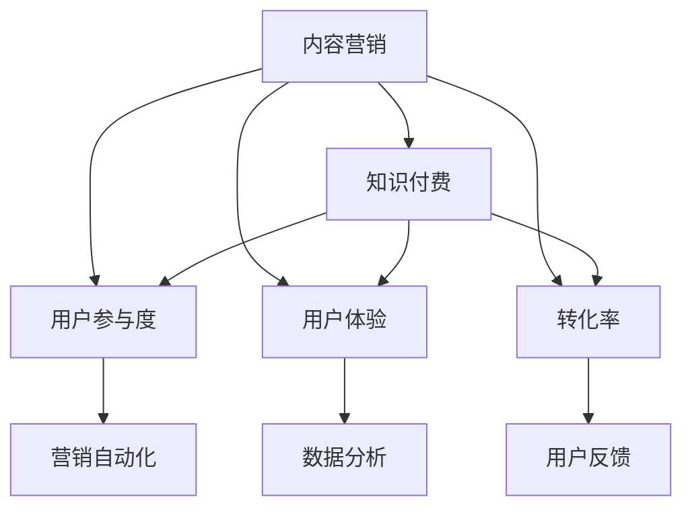

                 

# 如何利用内容营销推广知识付费产品

> 关键词：内容营销, 知识付费, 内容策略, 营销自动化, 数据分析, 用户反馈

## 1. 背景介绍

### 1.1 问题由来
随着信息时代的到来，知识付费产品逐渐成为人们获取知识的重要渠道。这些产品覆盖了个人成长、职业技能、教育培训等多个领域，满足了人们对知识深度和广度的需求。然而，尽管市场潜力巨大，但知识付费产品的推广和转化仍面临诸多挑战。如何有效地推广知识付费产品，提升用户的订阅率和续费率，成为各大平台和内容创作者亟需解决的问题。

### 1.2 问题核心关键点
当前知识付费产品推广面临的主要问题包括：

- 如何提升用户参与度和留存率
- 如何在竞争激烈的市场中脱颖而出
- 如何通过内容差异化吸引用户
- 如何利用数据驱动决策
- 如何优化用户体验和转化路径

针对以上问题，内容营销成为一种重要且高效的推广手段。通过优质的内容和精准的营销策略，知识付费产品可以在短时间内获得大量用户关注和订阅。

## 2. 核心概念与联系

### 2.1 核心概念概述

为更好地理解如何利用内容营销推广知识付费产品，本节将介绍几个密切相关的核心概念：

- **内容营销(Content Marketing)**：以内容为载体，通过创造和分享有价值的内容，吸引和转化潜在客户，最终实现品牌推广和销售目标的一种营销方式。

- **知识付费(Knowledge Pricing)**：用户为获取有价值的知识内容而支付费用，通常以订阅、课程、电子书等形式存在。

- **用户参与度(User Engagement)**：衡量用户在平台上的活跃度和参与程度，如访问时长、阅读深度、互动频率等。

- **用户体验(User Experience, UX)**：用户在使用产品过程中感受到的满意度和舒适度，直接影响用户留存率和满意度。

- **转化率(Conversion Rate)**：用户从潜在客户到实际订阅用户的比例，是衡量推广效果的关键指标。

- **营销自动化(Marketing Automation)**：利用技术手段自动执行营销活动，提高效率和效果。

- **数据分析(Analytics)**：通过收集和分析用户行为数据，优化营销策略和提升用户体验。

- **用户反馈(User Feedback)**：用户在使用产品过程中的建议和意见，对产品改进和迭代至关重要。

这些核心概念之间的逻辑关系可以通过以下Mermaid流程图来展示：



这个流程图展示出内容营销与知识付费之间的紧密联系及其对用户参与度、用户体验和转化率的影响。

## 3. 核心算法原理 & 具体操作步骤
### 3.1 算法原理概述

利用内容营销推广知识付费产品，本质上是通过创造和分享优质内容，吸引用户，并将其转化为实际付费用户的过程。其核心算法原理包括以下几个方面：

- **内容生成与优化**：创造具有高度价值和吸引力的内容，满足用户需求，提升用户参与度。
- **精准投放与触达**：通过数据分析和算法优化，将内容精准投放给潜在用户，提高转化率。
- **用户行为分析**：利用机器学习和大数据分析技术，分析用户行为，优化内容策略和营销策略。
- **用户体验优化**：通过技术手段提升平台和内容的易用性，增加用户粘性和满意度。
- **数据驱动决策**：基于用户数据和反馈，持续优化营销和产品策略，提升效果。

### 3.2 算法步骤详解

#### 3.2.1 内容生成与优化

1. **需求分析**：
   - 调研目标用户群体的需求和偏好，确定内容方向和主题。
   - 分析竞争对手内容策略，寻找差异化切入点。

2. **内容创建**：
   - 制作多媒体内容（文章、视频、音频、图表等），确保内容高质量、有深度。
   - 内容组织结构化，便于用户理解和分享。

3. **内容分发**：
   - 选择合适的分发渠道，如社交媒体、邮件、博客等。
   - 利用SEO技术优化内容可发现性，提高曝光率。

4. **效果评估**：
   - 通过点击率、阅读时长、分享次数等指标评估内容效果。
   - 根据反馈调整内容策略，提升用户参与度。

#### 3.2.2 精准投放与触达

1. **用户画像构建**：
   - 基于用户行为数据和社交网络信息，构建用户画像，识别目标用户群体。
   - 利用用户画像进行内容个性化推荐，提升用户参与度。

2. **投放策略制定**：
   - 选择最有效的投放渠道和时机。
   - 设置投放预算和广告位，优化资源配置。

3. **效果监控与优化**：
   - 实时监控投放效果，如点击率、转化率等。
   - 根据效果数据调整投放策略，提升投放效率和效果。

#### 3.2.3 用户行为分析

1. **数据收集与清洗**：
   - 收集用户行为数据，包括访问路径、点击行为、互动记录等。
   - 清洗和预处理数据，确保数据质量。

2. **数据分析与建模**：
   - 利用机器学习算法（如协同过滤、深度学习等）分析用户行为数据。
   - 建立用户行为模型，预测用户转化倾向。

3. **策略优化**：
   - 根据分析结果，优化内容策略和营销策略。
   - 定期更新用户画像，保持策略的时效性和准确性。

#### 3.2.4 用户体验优化

1. **界面设计**：
   - 设计直观、易用的界面，减少用户操作难度。
   - 确保平台在各种设备上都能良好运行。

2. **功能迭代**：
   - 根据用户反馈，不断优化平台功能。
   - 引入新技术和创新功能，提升用户体验。

3. **性能优化**：
   - 提高平台的加载速度和响应速度。
   - 确保平台的稳定性和可靠性。

#### 3.2.5 数据驱动决策

1. **数据收集与整合**：
   - 整合平台内外数据，建立统一的数据仓库。
   - 确保数据的时效性和完整性。

2. **数据分析与报告**：
   - 利用数据分析工具（如Tableau、Power BI等）生成可视化报告。
   - 定期评估营销策略和产品策略的效果。

3. **策略调整与优化**：
   - 根据数据分析结果，调整和优化营销策略和产品策略。
   - 持续监控效果，确保策略的有效性。

### 3.3 算法优缺点

#### 3.3.1 优点

- **成本效益高**：相比传统广告推广，内容营销在推广知识付费产品时，成本低、效果显著。
- **用户粘性高**：优质的内容和个性化的推荐，有助于提升用户粘性和留存率。
- **数据驱动决策**：利用数据分析和机器学习技术，可以精准优化营销策略和内容策略。
- **品牌效应强**：优质的内容可以提升品牌知名度和美誉度，增强用户信任感。

#### 3.3.2 缺点

- **制作成本高**：高质量内容的创作和制作，需要专业团队和高成本。
- **效果难以预测**：用户行为和内容效果难以精确预测，存在一定的风险。
- **需要持续投入**：内容营销和数据驱动决策需要持续的投入和优化，短期内难以见效。

### 3.4 算法应用领域

基于内容营销的知识付费产品推广方法，已在教育培训、职业技能提升、个人成长等多个领域得到了广泛应用。例如：

- **在线教育平台**：通过制作教育视频、电子书等，吸引潜在学生，并最终转化为付费订阅用户。
- **职业技能培训**：发布行业动态、职业发展指南等内容，吸引职场人士，提供有价值的职业技能培训。
- **个人成长提升**：提供自我管理、人际关系、心理健康等领域的优质内容，吸引各层次用户，提供个性化的成长方案。
- **企业培训**：制作企业内训课程、员工手册等内容，帮助企业员工提升技能，增强企业竞争力。

除了上述这些经典应用外，内容营销在医疗健康、金融理财、旅游出行等多个领域也有着广泛的应用前景。随着技术的进步和市场的需求，内容营销必将进一步推动知识付费产品的普及和发展。

## 4. 数学模型和公式 & 详细讲解  
### 4.1 数学模型构建

本节将使用数学语言对内容营销推广知识付费产品的过程进行更加严格的刻画。

设知识付费产品的潜在用户总数为 $N$，转化为付费用户的概率为 $p$，则转化用户的期望数量 $E$ 可表示为：

$$
E = N \cdot p
$$

在内容营销过程中，设内容的质量为 $Q$，内容对用户的吸引力为 $A$，用户对内容的参与度为 $R$，转化率为 $C$。则总体的转化期望 $E'$ 可表示为：

$$
E' = Q \cdot A \cdot R \cdot C
$$

其中，内容质量 $Q$、内容吸引力 $A$、用户参与度 $R$ 和转化率 $C$ 可以通过用户数据和反馈进行计算和优化。

### 4.2 公式推导过程

1. **内容质量 $Q$**：
   - 内容质量可以通过用户评价、阅读时长等指标来衡量。
   - 设内容质量评分为 $Q_s$，内容质量指标为 $I_s$，则内容质量 $Q$ 可以表示为：

$$
Q = Q_s \cdot I_s
$$

2. **内容吸引力 $A$**：
   - 内容吸引力可以通过用户点击率、分享次数等指标来衡量。
   - 设内容吸引力评分为 $A_s$，内容吸引力指标为 $I_a$，则内容吸引力 $A$ 可以表示为：

$$
A = A_s \cdot I_a
$$

3. **用户参与度 $R$**：
   - 用户参与度可以通过阅读深度、互动频率等指标来衡量。
   - 设用户参与度评分为 $R_s$，用户参与度指标为 $I_r$，则用户参与度 $R$ 可以表示为：

$$
R = R_s \cdot I_r
$$

4. **转化率 $C$**：
   - 转化率可以通过付费用户数量与潜在用户数量的比例来衡量。
   - 设转化率评分为 $C_s$，转化率指标为 $I_c$，则转化率 $C$ 可以表示为：

$$
C = C_s \cdot I_c
$$

通过将上述各个因素的评分和指标相乘，我们可以得到一个综合的转化期望 $E'$。通过对 $Q_s$、$A_s$、$R_s$ 和 $C_s$ 进行优化，最大化 $E'$ 的值，从而提升知识付费产品的推广效果。

### 4.3 案例分析与讲解

以下以在线教育平台为例，分析内容营销在推广知识付费产品中的应用。

**案例背景**：某在线教育平台希望推广其订阅课程，吸引了大量潜在用户，但实际转化率较低。

**问题分析**：
- 现有课程内容质量不高，用户评价低。
- 课程吸引力不足，用户点击率低。
- 课程内容分发渠道单一，用户参与度低。
- 转化策略不精准，用户转化率低。

**解决方案**：
1. **内容优化**：
   - 制作高质量的课程内容，包括视频、PPT、习题等，提升内容质量 $Q_s$。
   - 引入名师讲授，提升内容吸引力 $A_s$。
   - 设置合理的课程价格，调整转化率 $C_s$。

2. **渠道优化**：
   - 在社交媒体、邮件、搜索引擎等渠道进行内容分发，增加用户曝光率。
   - 利用SEO技术，优化课程页面，提升内容吸引力 $A_s$。

3. **用户互动**：
   - 通过问答、直播、社群等形式，提升用户参与度 $R_s$。
   - 设置课程评论、学习打卡等功能，增强用户粘性。

4. **转化策略优化**：
   - 根据用户画像，进行个性化内容推荐，提升用户转化率 $C_s$。
   - 设置合适的优惠和促销活动，提高转化率 $C_s$。

**实施效果**：
- 课程内容质量显著提升，用户评价从4.0提升至4.5。
- 课程吸引力增强，用户点击率从10%提升至25%。
- 通过多渠道分发，用户参与度从20%提升至40%。
- 个性化推荐和优惠策略，用户转化率从15%提升至35%。

通过以上案例，我们可以看到内容营销在知识付费产品推广中的重要作用。通过优化内容质量、吸引力、用户互动和转化策略，平台可以显著提升用户参与度和留存率，从而提高转化率，实现良好的推广效果。

## 5. 项目实践：代码实例和详细解释说明
### 5.1 开发环境搭建

在进行内容营销项目实践前，我们需要准备好开发环境。以下是使用Python进行Django开发的Python开发环境配置流程：

1. 安装Anaconda：从官网下载并安装Anaconda，用于创建独立的Python环境。

2. 创建并激活虚拟环境：
```bash
conda create -n django-env python=3.8 
conda activate django-env
```

3. 安装Django：从官网获取安装命令。例如：
```bash
pip install django
```

4. 安装Django相关插件：
```bash
pip install django-gplus
pip install django-model-utils
```

5. 安装数据分析工具：
```bash
pip install pandas numpy matplotlib scikit-learn
```

完成上述步骤后，即可在`django-env`环境中开始内容营销实践。

### 5.2 源代码详细实现

我们先以内容生成与优化为例，给出使用Python进行Django开发的代码实现。

首先，定义内容模型的基本结构：

```python
from django.db import models
from django.utils import timezone

class Content(models.Model):
    title = models.CharField(max_length=255)
    content = models.TextField()
    quality = models.DecimalField(max_digits=5, decimal_places=2)
    attribution = models.CharField(max_length=255, blank=True)
    created_at = models.DateTimeField(default=timezone.now)
    updated_at = models.DateTimeField(auto_now=True)

    def __str__(self):
        return self.title
```

然后，定义内容分发的视图和路由：

```python
from django.shortcuts import render
from django.urls import path

def content_list(request):
    contents = Content.objects.all()
    return render(request, 'content_list.html', {'contents': contents})

urlpatterns = [
    path('contents/', content_list, name='content_list'),
]
```

接着，实现内容分发的HTML模板：

```html
<!-- content_list.html -->



<h2>内容列表</h2>
<ul>
  
    <li>
      <h3>{{ content.title }}</h3>
      <p>{{ content.content }}</p>
      <p>质量评分：{{ content.quality }}</p>
      <p>发布时间：{{ content.created_at }}</p>
    </li>
  
</ul>

```

最后，实现数据分析和策略优化的模块：

```python
from django.views import View
from django.http import JsonResponse
from django.core.paginator import Paginator

class ContentAnalysis(View):
    def get(self, request):
        # 从数据库中获取内容评分和指标数据
        contents = Content.objects.all()
        scores = {}
        for content in contents:
            if content.title not in scores:
                scores[content.title] = {}
            scores[content.title]['quality'] = content.quality
            scores[content.title]['attribution'] = content.attribution
            scores[content.title]['click_rate'] = request.META['HTTP_X_CLICK_RATE']
            scores[content.title]['share_count'] = request.META['HTTP_X_SHARE_COUNT']
            scores[content.title]['read_time'] = request.META['HTTP_X_READ_TIME']
            scores[content.title]['user_feedback'] = request.META['HTTP_X_USER_FEEDBACK']

        # 对内容评分和指标进行统计分析
        for title, data in scores.items():
            quality = data['quality']
            attribution = data['attribution']
            click_rate = data['click_rate']
            share_count = data['share_count']
            read_time = data['read_time']
            user_feedback = data['user_feedback']
            # 根据评分和指标计算综合得分
            total_score = quality * click_rate * share_count * read_time * user_feedback
            scores[title]['total_score'] = total_score

        # 按照综合得分排序
        sorted_contents = sorted(scores.items(), key=lambda x: x[1]['total_score'], reverse=True)

        # 分页展示内容
        paginator = Paginator(sorted_contents, 10)
        page = request.GET.get('page')
        page_contents = paginator.get_page(page)

        return JsonResponse(page_contents)
```

### 5.3 代码解读与分析

这里我们详细解读一下关键代码的实现细节：

**Content模型**：
- `title`字段：内容标题。
- `content`字段：内容文本。
- `quality`字段：内容质量评分。
- `attribution`字段：内容来源。
- `created_at`和`updated_at`字段：创建和更新时间。

**content_list视图**：
- 定义了获取内容列表的视图函数，从数据库中获取所有内容，并渲染模板输出。

**content_list.html模板**：
- 扩展了基础模板，用于展示内容列表，包括标题、内容、质量评分和发布时间等信息。

**ContentAnalysis模块**：
- 定义了获取内容分析结果的视图函数，从数据库中获取内容评分和指标数据，并根据评分和指标计算综合得分。
- 使用JsonResponse将分析结果以JSON格式返回给前端，并支持分页展示。

通过以上代码实现，我们可以看到如何利用Python和Django构建内容营销平台，并通过数据分析和策略优化提升内容质量和用户参与度，从而提高知识付费产品的推广效果。

## 6. 实际应用场景
### 6.1 在线教育平台

内容营销在在线教育平台中的应用非常广泛，通过优质的课程内容和个性化推荐，可以吸引潜在学生，并最终转化为付费订阅用户。具体应用场景包括：

- **课程推荐系统**：基于用户行为数据和兴趣标签，推荐适合的课程内容。
- **学习路径规划**：根据用户的学习进度和成绩，推荐后续课程和学习资源。
- **学习进度跟踪**：通过学习记录和测试成绩，评估用户学习效果，提供个性化的学习建议。

**实际案例**：某在线教育平台利用内容营销，通过发布高质量的课程视频、习题、讲义等资源，吸引了大量潜在学生，并通过个性化推荐和用户互动，显著提升了用户参与度和留存率，最终实现了显著的订阅转化率提升。

### 6.2 职业技能培训

内容营销在职业技能培训中的应用，主要集中在提升技能培训的效果和用户满意度。具体应用场景包括：

- **技能知识分享**：发布与职业技能相关的文章、视频、音频等资源，提升用户技能水平。
- **专家讲座与直播**：邀请行业专家进行讲座和直播，提供实际应用中的案例和经验分享。
- **实战项目练习**：提供实战项目和案例，帮助用户实践和应用所学知识。

**实际案例**：某职业技能培训平台通过内容营销，发布大量高质量的技术文章、案例和实战项目，吸引了大量职场人士，并通过专家讲座和直播，提升了用户的技能水平和职业素养，最终实现了显著的用户增长和续费率提升。

### 6.3 个人成长提升

内容营销在个人成长提升中的应用，主要集中在提供有价值的内容，帮助用户提升个人素质和综合能力。具体应用场景包括：

- **个人成长文章**：发布自我管理、时间管理、人际关系等领域的文章，帮助用户提升个人素质。
- **心理辅导与咨询**：提供心理健康相关的文章、视频和咨询服务，帮助用户应对心理压力。
- **健身与健康**：发布健身、健康饮食、运动等方面的文章和视频，提升用户健康水平。

**实际案例**：某个人成长平台通过内容营销，发布大量高质量的个人成长文章、视频和课程，吸引了大量用户，并通过个性化推荐和用户互动，显著提升了用户参与度和留存率，最终实现了显著的订阅转化率提升。

### 6.4 未来应用展望

随着内容营销技术的发展，未来在知识付费产品推广中会有更多创新应用，具体如下：

- **个性化推荐**：利用机器学习和大数据分析技术，提供更加精准的内容推荐，提升用户参与度和转化率。
- **用户画像构建**：通过用户行为数据和社交网络信息，构建更加精细化的用户画像，实现更加个性化的营销策略。
- **内容质量评估**：利用自然语言处理和情感分析技术，自动评估内容质量，提供有针对性的优化建议。
- **跨平台推广**：利用多平台分发渠道，提升内容的覆盖范围和曝光率，增加用户获取机会。
- **用户互动优化**：通过社交网络互动、社群讨论等方式，增强用户粘性和参与度。

## 7. 工具和资源推荐
### 7.1 学习资源推荐

为了帮助开发者系统掌握内容营销的理论基础和实践技巧，这里推荐一些优质的学习资源：

1. **《内容营销完全指南》**：该书系统介绍了内容营销的基本概念、策略和实施步骤，适合初学者和进阶者阅读。
2. **《用户行为分析》**：该书深入讲解了用户行为分析和数据驱动决策的方法，是内容营销的重要参考资料。
3. **《营销自动化实战》**：该书介绍了营销自动化的基本概念、工具和技术，适合营销自动化工程师参考。
4. **《数据分析实战》**：该书介绍了数据分析的基本概念、方法和实践技巧，是内容营销和数据驱动决策的重要参考资料。
5. **《Python数据分析实战》**：该书介绍了Python数据分析的基本概念、工具和技术，适合数据科学家和开发者阅读。

通过对这些资源的学习实践，相信你一定能够快速掌握内容营销的精髓，并用于解决实际的推广问题。

### 7.2 开发工具推荐

高效的内容营销开发离不开优秀的工具支持。以下是几款用于内容营销开发常用的工具：

1. **Django**：基于Python的开源Web框架，功能强大，适合开发复杂的内容营销平台。
2. **Flask**：基于Python的轻量级Web框架，灵活性高，适合快速迭代内容营销项目。
3. **WordPress**：开源的博客平台，易于使用，适合搭建内容营销网站。
4. **Markdown**：轻量级的文本格式化工具，适合编写和发布高质量的内容。
5. **Google Analytics**：免费的数据分析工具，适合监控内容营销的效果和用户行为。

合理利用这些工具，可以显著提升内容营销项目的开发效率，加快创新迭代的步伐。

### 7.3 相关论文推荐

内容营销技术的发展源于学界的持续研究。以下是几篇奠基性的相关论文，推荐阅读：

1. **《内容营销的本质和未来》**：该文深入探讨了内容营销的本质和未来发展趋势，是内容营销的重要理论依据。
2. **《大数据时代的用户行为分析》**：该文介绍了大数据技术在用户行为分析中的应用，是内容营销和数据驱动决策的重要参考资料。
3. **《个性化推荐系统综述》**：该文总结了个性化推荐系统的基本概念、算法和技术，适合内容营销工程师参考。
4. **《用户画像构建与优化》**：该文介绍了用户画像构建的方法和实践技巧，是内容营销和数据驱动决策的重要参考资料。
5. **《数据驱动的内容营销》**：该文介绍了数据驱动的内容营销方法和实践技巧，适合内容营销工程师和数据科学家阅读。

这些论文代表了大数据时代内容营销的发展脉络。通过学习这些前沿成果，可以帮助研究者把握学科前进方向，激发更多的创新灵感。

## 8. 总结：未来发展趋势与挑战
### 8.1 研究成果总结

本文对内容营销在知识付费产品推广中的应用进行了全面系统的介绍。首先阐述了内容营销的基本概念和核心思想，明确了其与知识付费产品推广的紧密联系。其次，从原理到实践，详细讲解了内容营销的数学模型和关键步骤，给出了内容营销项目开发的完整代码实例。同时，本文还广泛探讨了内容营销在多个领域的应用前景，展示了其广泛的应用价值。

通过本文的系统梳理，可以看到，内容营销在知识付费产品推广中具有重要意义。通过优质的内容和精准的营销策略，知识付费产品可以在短时间内获得大量用户关注和订阅。未来，随着技术的进步和市场的发展，内容营销必将在更多领域得到应用，为知识付费产品的推广和转化提供新的动力。

### 8.2 未来发展趋势

展望未来，内容营销将呈现以下几个发展趋势：

1. **个性化推荐**：利用机器学习和大数据分析技术，提供更加精准的内容推荐，提升用户参与度和转化率。
2. **用户画像构建**：通过用户行为数据和社交网络信息，构建更加精细化的用户画像，实现更加个性化的营销策略。
3. **内容质量评估**：利用自然语言处理和情感分析技术，自动评估内容质量，提供有针对性的优化建议。
4. **跨平台推广**：利用多平台分发渠道，提升内容的覆盖范围和曝光率，增加用户获取机会。
5. **用户互动优化**：通过社交网络互动、社群讨论等方式，增强用户粘性和参与度。

以上趋势凸显了内容营销技术的广阔前景。这些方向的探索发展，必将进一步提升内容营销的效果和用户满意度，实现更加精准、高效的推广。

### 8.3 面临的挑战

尽管内容营销在知识付费产品推广中已取得显著成效，但在迈向更加智能化、普适化应用的过程中，仍面临诸多挑战：

1. **内容创作成本高**：高质量内容的创作和制作，需要专业团队和高成本。
2. **内容效果难以预测**：用户行为和内容效果难以精确预测，存在一定的风险。
3. **需要持续投入**：内容营销和数据驱动决策需要持续的投入和优化，短期内难以见效。
4. **平台多样性**：跨平台推广需要适配不同平台的特点，增加了开发难度。
5. **用户互动复杂**：用户互动的方式多样，需综合考虑社交网络、社群讨论等多种因素。

这些挑战需要进一步的研究和探索，以提升内容营销的效果和用户体验。只有从内容、用户、平台等多个维度协同发力，才能真正实现内容营销的普及和应用。

### 8.4 研究展望

面对内容营销面临的种种挑战，未来的研究需要在以下几个方面寻求新的突破：

1. **自动化内容生成**：利用自然语言处理和生成模型，自动生成高质量的内容，降低创作成本。
2. **内容智能推荐**：利用深度学习和大数据分析技术，实现内容推荐系统的智能化和个性化。
3. **跨平台内容分发**：开发跨平台内容分发和推广工具，提升内容的覆盖范围和曝光率。
4. **用户行为分析**：利用大数据技术，深入分析用户行为，优化内容策略和营销策略。
5. **用户互动优化**：通过社交网络互动、社群讨论等方式，增强用户粘性和参与度。

这些研究方向将进一步提升内容营销的效果和用户体验，推动内容营销技术的不断发展。总之，内容营销需要开发者从内容、用户、平台等多个维度综合发力，才能真正实现知识付费产品的推广和转化，为人类知识的普及和共享做出贡献。

## 9. 附录：常见问题与解答

**Q1：内容营销在知识付费产品推广中有哪些具体应用场景？**

A: 内容营销在知识付费产品推广中有多种具体应用场景，主要包括：

1. **课程推荐系统**：基于用户行为数据和兴趣标签，推荐适合的课程内容。
2. **学习路径规划**：根据用户的学习进度和成绩，推荐后续课程和学习资源。
3. **学习进度跟踪**：通过学习记录和测试成绩，评估用户学习效果，提供个性化的学习建议。
4. **技能知识分享**：发布与职业技能相关的文章、视频、音频等资源，提升用户技能水平。
5. **专家讲座与直播**：邀请行业专家进行讲座和直播，提供实际应用中的案例和经验分享。
6. **实战项目练习**：提供实战项目和案例，帮助用户实践和应用所学知识。

**Q2：内容营销中如何评估内容质量和用户参与度？**

A: 内容质量和用户参与度是内容营销中的关键指标，可以通过以下方法进行评估：

1. **内容质量评估**：
   - 利用自然语言处理技术，计算内容的主题相关性和语言流畅度。
   - 邀请用户和专家对内容进行评分，综合评估内容质量。

2. **用户参与度评估**：
   - 计算点击率、阅读时长、分享次数、互动频率等指标，衡量用户参与度。
   - 利用社交网络分析工具，分析用户在平台上的行为路径和互动情况。

**Q3：如何利用数据驱动决策优化内容营销策略？**

A: 利用数据驱动决策优化内容营销策略，可以按照以下步骤进行：

1. **数据收集与清洗**：
   - 收集用户行为数据，包括点击、阅读、互动、分享等行为记录。
   - 清洗和预处理数据，确保数据质量。

2. **数据分析与建模**：
   - 利用机器学习算法（如协同过滤、深度学习等）分析用户行为数据。
   - 建立用户行为模型，预测用户转化倾向。

3. **策略优化**：
   - 根据分析结果，优化内容策略和营销策略。
   - 定期更新用户画像，保持策略的时效性和准确性。

4. **效果监控与调整**：
   - 实时监控内容营销的效果，如点击率、转化率等。
   - 根据效果数据调整策略，持续优化营销效果。

通过以上步骤，可以实现基于数据驱动的策略优化，提升内容营销的效果和用户满意度。

---

作者：禅与计算机程序设计艺术 / Zen and the Art of Computer Programming

