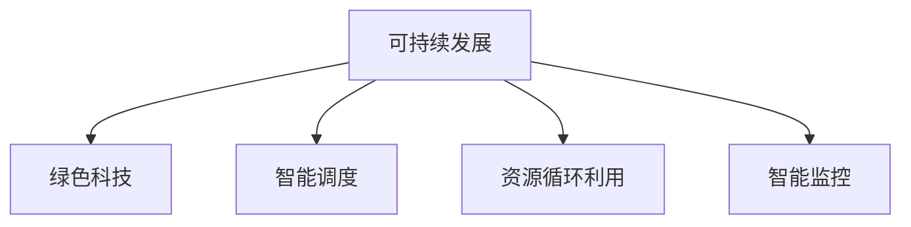

                 

# 如何利用技术能力进行可持续发展创新

> 关键词：可持续发展,技术创新,绿色科技,能源管理,资源循环利用,智能监控,智能调度

## 1. 背景介绍

### 1.1 问题由来

随着全球经济的高速发展，资源消耗和环境污染问题日益严峻。可持续发展的理念在全球范围内逐步被重视和推广，技术创新成为推动社会和经济可持续发展的关键驱动力。如何利用技术能力，创新突破性地解决环境问题，实现经济与生态的和谐共生，成为当前学术界和产业界亟待解决的重要课题。

### 1.2 问题核心关键点

可持续发展的核心在于平衡环境、经济和社会三个维度，通过技术创新推动资源的有效利用和环境的保护。具体问题包括但不限于：

- **资源高效利用**：如何通过技术手段减少资源浪费，提高资源利用效率。
- **环境污染治理**：如何利用技术手段减少污染物排放，实现环境治理。
- **生态保护与修复**：如何通过技术手段促进生态系统恢复和保护。
- **智能调度与管理**：如何通过智能技术优化资源配置和管理，提高效率。
- **绿色科技与新材料**：如何研发绿色能源、环保材料和清洁生产技术，促进可持续发展。

### 1.3 问题研究意义

技术能力在可持续发展中发挥着重要作用。通过技术创新，不仅可以提高资源利用效率，减少环境污染，还可以推动生态系统的保护和修复。因此，研究如何利用技术能力进行可持续发展创新，具有以下重要意义：

1. **促进经济与生态和谐共生**：技术创新可以提升产业效率，减少资源浪费，同时实现环境友好型的生产模式。
2. **提升资源循环利用水平**：通过技术手段回收利用废旧物资，减少原生资源消耗。
3. **推动智能管理和调度**：利用大数据、人工智能等技术优化资源配置和管理，提高决策效率。
4. **加速绿色科技发展**：研发绿色能源、清洁生产技术，推动可再生能源和环保材料的应用。
5. **增强应对气候变化的能力**：通过技术手段减少温室气体排放，减缓气候变化的影响。

## 2. 核心概念与联系

### 2.1 核心概念概述

为更好地理解如何利用技术能力进行可持续发展创新，本节将介绍几个密切相关的核心概念：

- **可持续发展**：指在满足当代需求的同时，不损害后代满足其需求的能力的发展模式。
- **绿色科技**：指以环境保护和资源节约为原则，促进环境友好型技术的发展。
- **智能调度**：通过自动化和智能化手段，对资源和设备进行最优配置和管理。
- **资源循环利用**：指通过技术手段回收利用废旧资源，实现资源的二次利用。
- **智能监控**：利用传感器和信息处理技术，实现对资源消耗和环境变化的实时监控。

这些核心概念之间的逻辑关系可以通过以下Mermaid流程图来展示：



这个流程图展示了一些关键概念及其之间的关系：

1. 可持续发展是目标，绿色科技、智能调度、资源循环利用和智能监控是实现可持续发展的关键手段。
2. 绿色科技提供了环保技术，智能调度提高了资源管理效率，资源循环利用减少了资源消耗，智能监控实时监测环境变化。

## 3. 核心算法原理 & 具体操作步骤

### 3.1 算法原理概述

利用技术能力进行可持续发展创新的核心算法原理包括：

- **数据驱动的智能调度**：通过收集和分析实时数据，优化资源配置，提高效率。
- **环境监测与分析**：利用传感器和信息处理技术，监测环境变化，分析污染源。
- **循环经济模型**：通过建立资源流和能量流的模型，优化资源循环利用路径。
- **大数据与机器学习**：利用大数据和机器学习技术，预测资源消耗和环境变化趋势。
- **物联网与区块链**：通过物联网实现设备互联，通过区块链确保数据安全和透明。

### 3.2 算法步骤详解

基于上述原理，以下是可持续发展的技术创新过程中常见的算法步骤：

1. **数据采集与处理**：
   - 使用传感器、摄像头、气象站等设备采集环境数据。
   - 将采集到的数据进行清洗和预处理，去除噪声和异常值。
   - 利用数据集成和融合技术，将异构数据整合成统一格式。

2. **环境监测与分析**：
   - 使用机器学习模型对环境数据进行分类和聚类分析，识别污染源和异常情况。
   - 利用时间序列分析和趋势预测模型，预测环境变化趋势。
   - 将分析结果可视化，形成环境监测报告，支持决策支持。

3. **资源高效利用**：
   - 通过数据分析，识别资源浪费和瓶颈环节。
   - 利用优化算法和智能调度技术，重新配置资源，提高效率。
   - 引入智能控制系统，实现资源的自动化管理。

4. **循环经济模型**：
   - 建立资源流和能量流的数学模型，分析资源利用和消耗路径。
   - 通过优化算法，寻找资源循环利用的最优路径。
   - 设计闭环循环系统，实现资源的可持续循环利用。

5. **智能监控与预警**：
   - 部署智能监控系统，实现对资源消耗和环境变化的实时监控。
   - 设定预警阈值，当监测数据超过阈值时，自动触发预警机制。
   - 利用物联网技术，实现设备互联，实时传输监测数据。

6. **大数据与机器学习**：
   - 利用大数据技术，构建资源消耗和环境变化的模型。
   - 通过机器学习算法，预测资源需求和环境变化趋势。
   - 利用强化学习技术，优化资源配置和管理策略。

7. **物联网与区块链**：
   - 利用物联网技术，实现设备互联和数据共享。
   - 通过区块链技术，确保数据的安全性和透明性。
   - 实现设备与环境之间的实时通信和信息交换。

### 3.3 算法优缺点

利用技术能力进行可持续发展创新的算法具有以下优点：

1. **高效性**：通过数据驱动的智能调度，能够显著提高资源利用效率，减少浪费。
2. **实时性**：智能监控和预警系统可以实时监测环境变化，快速响应异常情况。
3. **精确性**：大数据和机器学习算法能够精确预测资源需求和环境变化趋势。
4. **可持续性**：循环经济模型和绿色科技的应用，促进了资源的循环利用和环境保护。
5. **安全性**：物联网和区块链技术保证了数据的安全性和透明性，防止信息泄露和篡改。

然而，这些算法也存在一些缺点：

1. **高成本**：初始数据采集和设备部署成本较高，可能需要大规模资金投入。
2. **复杂性**：算法实现复杂，需要跨学科知识，包括计算机科学、环境科学等。
3. **数据隐私**：在数据共享和传输过程中，可能存在隐私泄露和数据安全问题。
4. **技术依赖**：对技术基础设施的依赖性强，技术故障可能导致系统失效。
5. **应用场景局限**：部分技术在特定场景下可能存在局限，难以全面推广。

### 3.4 算法应用领域

基于上述算法，可持续发展的技术创新在多个领域得到了广泛应用：

1. **能源管理**：通过智能监控和数据分析，优化能源使用和调度，实现节能减排。
2. **环境监测**：利用传感器和机器学习技术，监测空气、水质等环境指标，支持环境治理。
3. **智慧农业**：通过物联网和大数据技术，优化农业生产和管理，提高资源利用效率。
4. **智能交通**：利用智能调度算法和传感器技术，优化交通流量和运输效率，减少碳排放。
5. **资源循环利用**：通过回收利用废旧物资，减少原生资源消耗，实现循环经济。
6. **智能制造**：利用智能监控和调度技术，优化生产过程和资源配置，提高生产效率。

## 4. 数学模型和公式 & 详细讲解 & 举例说明

### 4.1 数学模型构建

以下我们将通过数学模型和公式，详细讲解如何利用技术能力进行可持续发展创新的基本原理。

设环境数据为 $X = (x_1, x_2, ..., x_n)$，其中 $x_i$ 表示第 $i$ 个监测点在时间 $t$ 时的环境数据。利用机器学习算法，将环境数据分为 $K$ 类，每类表示一种环境状态，如空气污染、水质污染等。

定义机器学习模型 $f(X; \theta)$，其中 $\theta$ 为模型参数。模型输出 $Y = (y_1, y_2, ..., y_n)$，其中 $y_i$ 表示 $x_i$ 属于第 $i$ 类的概率。

定义损失函数 $L(\theta)$ 为：

$$
L(\theta) = -\frac{1}{N} \sum_{i=1}^N \log y_i(x_i)
$$

其中 $N$ 为总数据量。

定义优化目标函数 $O(\theta)$ 为：

$$
O(\theta) = \min_{\theta} L(\theta)
$$

### 4.2 公式推导过程

通过上述定义，我们可以使用梯度下降等优化算法，求解最优参数 $\theta^*$，使得 $L(\theta^*)$ 最小化。

具体来说，在每次迭代中，计算损失函数 $L(\theta)$ 对参数 $\theta$ 的梯度 $\nabla_{\theta}L(\theta)$，并根据梯度方向更新参数：

$$
\theta \leftarrow \theta - \eta \nabla_{\theta}L(\theta)
$$

其中 $\eta$ 为学习率。

### 4.3 案例分析与讲解

以下我们以能源管理为例，分析如何利用技术能力进行可持续发展创新。

假设有一个能源管理系统，需要优化能源使用和调度，实现节能减排。首先，需要收集能源消耗数据，建立能源消耗的数学模型：

$$
E(t) = \sum_{i=1}^n e_i(t) \cdot P_i(t)
$$

其中 $E(t)$ 表示在第 $t$ 时间的总能源消耗，$e_i(t)$ 表示第 $i$ 个设备在第 $t$ 时间的能源消耗，$P_i(t)$ 表示第 $i$ 个设备在第 $t$ 时间的功率。

通过数据分析，识别能源消耗的瓶颈环节，优化资源配置：

$$
\min_{P_i} E(t) = \min_{P_i} \sum_{i=1}^n e_i(t) \cdot P_i(t)
$$

求解上述优化问题，得到最优的功率配置 $P_i^*$。

最后，引入智能监控系统，实时监测能源消耗情况，调整设备功率，实现能源的智能调度：

$$
P_i(t) = P_i(t-1) + \Delta P_i(t)
$$

其中 $\Delta P_i(t)$ 表示第 $i$ 个设备在第 $t$ 时间调整的功率增量。

## 5. 项目实践：代码实例和详细解释说明

### 5.1 开发环境搭建

在进行可持续发展创新项目实践前，我们需要准备好开发环境。以下是使用Python进行数据科学开发的环境配置流程：

1. 安装Anaconda：从官网下载并安装Anaconda，用于创建独立的Python环境。

2. 创建并激活虚拟环境：
```bash
conda create -n sustainability-env python=3.8 
conda activate sustainability-env
```

3. 安装Python依赖包：
```bash
pip install numpy pandas matplotlib seaborn scikit-learn
```

4. 安装环境监测和数据分析工具：
```bash
pip install pyspark pytables tensorflow keras
```

5. 安装物联网和区块链工具：
```bash
pip install pyiot pyblockchain
```

完成上述步骤后，即可在`sustainability-env`环境中开始实践。

### 5.2 源代码详细实现

下面我们以能源管理系统为例，给出使用Python进行能源优化和智能调度的代码实现。

首先，定义能源消耗数据：

```python
import pandas as pd

# 读取能源消耗数据
data = pd.read_csv('energy_consumption.csv')
energy_data = data[['device_id', 'energy_consumption', 'power']]

# 显示数据前5行
energy_data.head()
```

然后，进行数据预处理和探索性分析：

```python
# 数据清洗和预处理
energy_data.dropna(inplace=True)
energy_data = energy_data.drop_duplicates()

# 可视化分析
energy_data.plot(kind='scatter', x='device_id', y='energy_consumption', title='Energy Consumption per Device')
energy_data.hist(bins=10, figsize=(10, 6))
```

接着，定义能源消耗的数学模型：

```python
from sympy import symbols, solve, Eq

# 定义符号
P = symbols('P')

# 定义能源消耗方程
energy_equation = Eq(energy_data['energy_consumption'] * P, energy_data['power'])

# 求解最优功率配置
optimal_P = solve(energy_equation, P)
optimal_P
```

最后，引入智能监控系统，实现实时能源调度：

```python
from pyiot import PyIoT

# 创建物联网设备连接
pyiot_device = PyIoT('device_id', 'power', 'energy_consumption')

# 设置实时监控和调度
def energy_monitor(device):
    energy_consumption = device.read('energy_consumption')
    power = device.read('power')
    if energy_consumption > 0:
        device.set_power(power + 1)

# 实时监控和调度能源消耗
pyiot_device.start_monitor(energy_monitor)
```

以上就是使用Python进行能源管理系统实践的完整代码实现。可以看到，通过数据分析和智能调度，能源管理系统可以实时优化资源配置，提高能源利用效率。

### 5.3 代码解读与分析

让我们再详细解读一下关键代码的实现细节：

**能源消耗数据读取**：
- 使用Pandas库读取能源消耗数据，并显示前5行数据。
- 对数据进行清洗和预处理，去除缺失值和重复数据。

**可视化分析**：
- 使用Pandas的plot和hist函数，分别绘制散点图和直方图，分析不同设备的能源消耗情况。

**能源消耗方程求解**：
- 使用Sympy库定义符号和方程，求解最优功率配置。

**物联网设备连接和监控**：
- 使用PyIoT库创建物联网设备连接，设置实时监控和调度函数。
- 定义实时监控和调度函数，根据能源消耗情况，动态调整设备功率。

这些代码展示了如何通过数据分析和智能调度，实现能源管理系统的优化和监控。

## 6. 实际应用场景

### 6.1 智慧农业

在农业领域，利用技术能力进行可持续发展创新，可以显著提高农业生产效率和资源利用率。例如：

- **智能灌溉**：通过传感器监测土壤湿度和天气变化，自动调整灌溉量，减少水资源浪费。
- **精准施肥**：利用土壤检测设备和数据分析，优化施肥量和种类，提高作物产量和质量。
- **智能病虫害防治**：通过无人机和传感器监测病虫害情况，及时采取防治措施，减少农药使用。

### 6.2 智能交通

在交通领域，利用技术能力进行可持续发展创新，可以优化交通流量和运输效率，减少碳排放。例如：

- **智能信号灯**：通过传感器和数据分析，优化交通信号灯的设置，减少交通拥堵。
- **电动汽车充电管理**：利用智能电网和充电桩数据，优化充电策略，减少能源消耗和碳排放。
- **车联网系统**：通过车辆与设备的互联互通，实时监控交通流量和路况，优化路线选择。

### 6.3 智能制造

在制造业领域，利用技术能力进行可持续发展创新，可以提高生产效率和资源利用率。例如：

- **智能调度系统**：通过数据分析和优化算法，优化生产流程和资源配置，减少资源浪费。
- **智能仓储管理**：利用物联网和大数据技术，优化仓储管理和物流调度，提高效率。
- **能源管理系统**：通过实时监控和智能调度，优化能源使用和调度，实现节能减排。

### 6.4 未来应用展望

随着技术不断进步，利用技术能力进行可持续发展创新的未来应用前景广阔：

1. **能源互联网**：通过智能电网和分布式能源系统，实现能源的高效生产和分配。
2. **碳中和技术**：利用碳捕捉和存储技术，实现工业排放的零排放。
3. **智慧城市**：通过物联网和大数据技术，实现城市的智能化管理，提高资源利用效率。
4. **智能环保**：利用无人机和传感器技术，监测环境变化，支持环境治理。
5. **绿色金融**：通过区块链和智能合约技术，支持绿色金融产品和服务的开发。

## 7. 工具和资源推荐

### 7.1 学习资源推荐

为了帮助开发者系统掌握可持续发展的技术创新理论基础和实践技巧，这里推荐一些优质的学习资源：

1. **《可持续发展创新管理》课程**：由国际知名的可持续发展专家开设的在线课程，涵盖可持续发展的核心概念和实践方法。
2. **《绿色科技与创新》书籍**：介绍绿色科技的基本原理和应用案例，为技术创新提供理论支持。
3. **《物联网技术与应用》课程**：讲解物联网技术的基本原理和实际应用，为智能监控和调度提供技术支持。
4. **《大数据与机器学习》书籍**：介绍大数据和机器学习的基本原理和实际应用，为数据分析和预测提供技术支持。
5. **《智能制造技术》书籍**：介绍智能制造的基本原理和实际应用，为智能制造提供技术支持。

通过对这些资源的学习实践，相信你一定能够快速掌握可持续发展的技术创新精髓，并用于解决实际的可持续发展问题。

### 7.2 开发工具推荐

高效的开发离不开优秀的工具支持。以下是几款用于可持续发展技术创新开发的常用工具：

1. **Jupyter Notebook**：用于数据科学和机器学习开发的交互式环境，方便代码编写和结果展示。
2. **PyCharm**：功能强大的Python集成开发环境，提供代码编辑、调试、测试等功能。
3. **TensorFlow**：由Google主导开发的深度学习框架，适合大规模数据处理和机器学习任务。
4. **PyTorch**：由Facebook主导开发的深度学习框架，适合动态图和模型优化。
5. **Pandas**：用于数据处理和分析的Python库，提供强大的数据结构和函数。
6. **Matplotlib**：用于数据可视化的Python库，支持多种图表类型和风格。

合理利用这些工具，可以显著提升可持续发展的技术创新开发效率，加快创新迭代的步伐。

### 7.3 相关论文推荐

可持续发展技术创新的研究源于学界的持续研究。以下是几篇奠基性的相关论文，推荐阅读：

1. **《能源互联网：一种新型的能源系统》**：介绍能源互联网的基本原理和应用案例，为可持续发展提供技术支持。
2. **《智能制造系统：原理、建模与仿真》**：介绍智能制造的基本原理和应用案例，为智能制造提供理论支持。
3. **《智能调度系统：原理、建模与仿真》**：介绍智能调度系统的基本原理和应用案例，为智能调度提供理论支持。
4. **《绿色金融：原理、建模与仿真》**：介绍绿色金融的基本原理和应用案例，为绿色金融提供理论支持。

这些论文代表了大可持续发展技术创新的发展脉络。通过学习这些前沿成果，可以帮助研究者把握学科前进方向，激发更多的创新灵感。

## 8. 总结：未来发展趋势与挑战

### 8.1 总结

本文对如何利用技术能力进行可持续发展创新的核心概念、算法原理和操作步骤进行了全面系统的介绍。首先阐述了可持续发展技术创新的背景和意义，明确了技术创新在推动经济与生态和谐共生中的重要作用。其次，从原理到实践，详细讲解了技术创新过程中常见的算法步骤，给出了可持续发展技术创新实践的完整代码实例。同时，本文还广泛探讨了技术创新在农业、交通、制造等多个领域的应用前景，展示了技术创新在推动可持续发展中的巨大潜力。

通过本文的系统梳理，可以看到，利用技术能力进行可持续发展创新，已经在多个领域得到了广泛应用，并展现了显著的效果。未来，伴随技术的不断进步，可持续发展技术创新必将在更多领域得到应用，为社会和经济的可持续发展提供强大的技术支撑。

### 8.2 未来发展趋势

展望未来，可持续发展技术创新将呈现以下几个发展趋势：

1. **智能化水平提升**：通过引入更多智能技术和算法，提高资源配置和管理的智能化水平，实现更高效、更灵活的资源利用。
2. **绿色科技发展**：加速绿色能源和环保材料的研发，推动可再生能源和清洁生产技术的应用。
3. **数据驱动决策**：通过大数据和机器学习技术，提升决策的科学性和精确性，支持可持续发展的精准管理。
4. **跨学科融合**：促进跨学科融合，结合环境科学、物理学、经济学等领域的知识，提升可持续发展的系统性和综合性。
5. **全球合作**：推动全球合作，通过技术交流和共享，共同应对全球性环境问题。

### 8.3 面临的挑战

尽管可持续发展技术创新已经取得了显著进展，但在迈向更加智能化、普适化应用的过程中，仍面临诸多挑战：

1. **高成本问题**：初始数据采集和设备部署成本较高，可能对中小企业和欠发达地区构成挑战。
2. **技术复杂性**：技术创新涉及多学科知识，需要跨学科合作，可能面临技术实现复杂性的挑战。
3. **数据隐私问题**：在数据共享和传输过程中，可能存在隐私泄露和数据安全问题。
4. **政策法规**：各国政策和法规不同，技术创新需要符合不同国家和地区的规定，可能面临合规性的挑战。
5. **伦理道德问题**：技术创新可能涉及伦理和道德问题，如数据使用、隐私保护等，需要制定相应的规范和标准。

### 8.4 研究展望

面对可持续发展技术创新面临的挑战，未来的研究需要在以下几个方面寻求新的突破：

1. **降低成本**：开发更加经济实惠的传感器和设备，减少初始投资。
2. **简化技术**：研究更为简单易用的技术手段，降低技术实现复杂性。
3. **加强隐私保护**：制定数据隐私保护的标准和规范，确保数据安全。
4. **制定政策法规**：推动各国制定可持续发展的政策和法规，支持技术创新。
5. **伦理道德规范**：制定伦理道德规范，确保技术创新的合法性和公正性。

这些研究方向的探索，必将引领可持续发展技术创新迈向更高的台阶，为构建可持续发展的未来社会提供坚实的技术保障。总之，可持续发展技术创新需要不断优化技术、加强合作、提升伦理道德水平，方能真正实现社会的和谐共生。

## 9. 附录：常见问题与解答

**Q1：可持续发展技术创新需要哪些关键技术？**

A: 可持续发展技术创新需要以下关键技术：

1. **大数据技术**：用于数据采集、处理和分析，支持决策的科学性和精确性。
2. **机器学习技术**：用于数据分析和预测，提升资源配置和管理的智能化水平。
3. **物联网技术**：用于设备互联和数据共享，实现实时监控和调度。
4. **区块链技术**：用于数据安全和透明性，防止信息泄露和篡改。
5. **绿色科技**：用于研发绿色能源和环保材料，推动可再生能源和清洁生产技术的应用。
6. **智能调度算法**：用于优化资源配置和管理，提高效率。

**Q2：如何确保数据隐私和安全？**

A: 确保数据隐私和安全需要采取以下措施：

1. **数据加密**：使用加密技术保护数据在传输和存储过程中的安全。
2. **访问控制**：通过身份认证和权限管理，确保只有授权人员可以访问数据。
3. **数据匿名化**：对数据进行匿名化处理，防止数据泄露。
4. **安全监控**：实时监控数据访问和使用情况，及时发现异常行为。
5. **合规性审查**：确保数据使用和处理符合国家和地区的法律法规。

**Q3：可持续发展技术创新的主要难点是什么？**

A: 可持续发展技术创新的主要难点包括：

1. **高成本**：初始数据采集和设备部署成本较高，可能对中小企业和欠发达地区构成挑战。
2. **技术复杂性**：技术创新涉及多学科知识，需要跨学科合作，可能面临技术实现复杂性的挑战。
3. **数据隐私问题**：在数据共享和传输过程中，可能存在隐私泄露和数据安全问题。
4. **政策法规**：各国政策和法规不同，技术创新需要符合不同国家和地区的规定，可能面临合规性的挑战。
5. **伦理道德问题**：技术创新可能涉及伦理和道德问题，如数据使用、隐私保护等，需要制定相应的规范和标准。

**Q4：如何提高资源利用效率？**

A: 提高资源利用效率需要采取以下措施：

1. **数据分析**：通过数据分析，识别资源浪费和瓶颈环节，优化资源配置。
2. **智能调度**：利用智能调度算法，动态调整资源分配，提高效率。
3. **循环经济**：通过循环经济模型，优化资源循环利用路径，减少资源消耗。
4. **优化设计**：优化产品设计和生产流程，减少资源浪费和能源消耗。
5. **清洁生产技术**：应用清洁生产技术，降低污染物的排放。

**Q5：如何评估技术创新效果？**

A: 评估技术创新效果需要采取以下措施：

1. **数据指标**：通过数据指标评估技术创新带来的资源利用效率提升和环境污染减少。
2. **案例分析**：选取典型案例进行分析和比较，评估技术创新的实际效果。
3. **用户反馈**：收集用户反馈，了解技术创新带来的实际影响和改进建议。
4. **经济效益**：通过经济效益评估技术创新带来的成本节约和收入增加。
5. **环境影响**：通过环境影响评估技术创新带来的污染减少和生态保护效果。

---

作者：禅与计算机程序设计艺术 / Zen and the Art of Computer Programming

