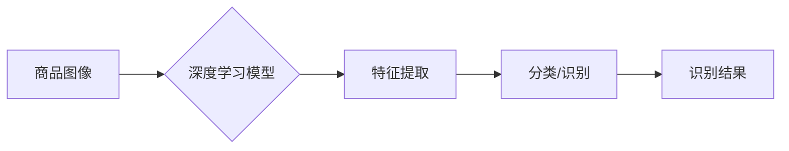

                 

## 深度学习在商品图像识别中的应用

> 关键词：深度学习、商品图像识别、卷积神经网络、目标检测、图像分类、推荐系统

## 1. 背景介绍

随着电子商务的蓬勃发展，商品图像识别技术已成为电商平台的核心技术之一。它能够自动识别商品的种类、品牌、属性等信息，为用户提供更便捷、更精准的购物体验。传统的商品图像识别方法主要依赖于人工特征提取，效率低、准确率有限。而深度学习技术的出现，为商品图像识别带来了革命性的变革。

深度学习算法能够自动从海量图像数据中学习特征，并构建复杂的图像表示模型，从而实现更准确、更智能的商品图像识别。近年来，深度学习在图像识别领域的应用取得了显著进展，在商品图像识别领域也展现出巨大的潜力。

## 2. 核心概念与联系

### 2.1 深度学习

深度学习是一种机器学习的子领域，它利用多层人工神经网络来模拟人类大脑的学习过程。深度学习模型能够自动从数据中学习特征，并进行复杂的模式识别和决策。

### 2.2 商品图像识别

商品图像识别是指利用计算机视觉技术，从商品图像中自动识别商品的种类、品牌、属性等信息。它可以应用于商品搜索、推荐、分类、定价等多个场景。

### 2.3 核心概念联系

深度学习算法为商品图像识别提供了强大的技术支撑。深度学习模型能够自动学习商品图像的特征，并构建复杂的图像表示模型，从而实现更准确、更智能的商品图像识别。

**Mermaid 流程图**



## 3. 核心算法原理 & 具体操作步骤

### 3.1 算法原理概述

商品图像识别常用的深度学习算法包括卷积神经网络（CNN）、循环神经网络（RNN）和生成对抗网络（GAN）。

* **卷积神经网络（CNN）**：CNN 是一种专门设计用于处理图像数据的深度学习算法。它利用卷积操作和池化操作来提取图像特征，并通过全连接层进行分类或识别。

* **循环神经网络（RNN）**：RNN 是一种能够处理序列数据的深度学习算法。它可以用于识别商品图像中的文本信息，例如商品名称、品牌、描述等。

* **生成对抗网络（GAN）**：GAN 是一种由生成器和鉴别器组成的对抗性网络。它可以用于生成新的商品图像，并用于商品图像的增强和修复。

### 3.2 算法步骤详解

以卷积神经网络为例，商品图像识别的具体操作步骤如下：

1. **数据预处理**: 将商品图像进行尺寸调整、归一化等预处理操作，以提高模型的训练效率和识别精度。
2. **模型构建**: 根据具体的识别任务，选择合适的 CNN 架构，并设置模型参数。
3. **模型训练**: 使用训练数据对模型进行训练，通过反向传播算法调整模型参数，使模型能够准确识别商品图像。
4. **模型评估**: 使用测试数据对模型进行评估，并根据评估结果进行模型调优。
5. **模型部署**: 将训练好的模型部署到实际应用场景中，用于商品图像的识别和分类。

### 3.3 算法优缺点

**CNN 算法的优缺点:**

* **优点**: 能够自动学习图像特征，识别精度高，适用于各种商品图像识别任务。
* **缺点**: 训练数据量大，训练时间长，对硬件资源要求高。

### 3.4 算法应用领域

CNN 算法广泛应用于商品图像识别领域，例如：

* **商品搜索**: 根据用户上传的商品图像，自动识别商品的种类和品牌，并返回相关的搜索结果。
* **商品推荐**: 根据用户的购买历史和浏览记录，推荐与用户兴趣相关的商品。
* **商品分类**: 自动将商品图像分类到不同的类别，例如服装、电子产品、家居用品等。
* **商品定价**: 根据商品的种类、品牌、属性等信息，自动预测商品的市场价格。

## 4. 数学模型和公式 & 详细讲解 & 举例说明

### 4.1 数学模型构建

商品图像识别的数学模型通常基于卷积神经网络（CNN）。CNN 模型由多个卷积层、池化层和全连接层组成。

* **卷积层**: 利用卷积核对图像进行卷积操作，提取图像特征。
* **池化层**: 对卷积层的输出进行池化操作，降低图像维度，提高模型的鲁棒性。
* **全连接层**: 将池化层的输出连接到全连接层，进行分类或识别。

### 4.2 公式推导过程

**卷积操作**:

$$
y_{i,j} = \sum_{m=0}^{M-1} \sum_{n=0}^{N-1} x_{i+m,j+n} * w_{m,n}
$$

其中：

* $y_{i,j}$ 是卷积层的输出值。
* $x_{i+m,j+n}$ 是输入图像的像素值。
* $w_{m,n}$ 是卷积核的权值。
* $M$ 和 $N$ 是卷积核的大小。

**池化操作**:

$$
y_{i,j} = \max(x_{i,j}, x_{i+1,j}, x_{i,j+1}, x_{i+1,j+1})
$$

其中：

* $y_{i,j}$ 是池化层的输出值。
* $x_{i,j}$ 是卷积层的输出值。

### 4.3 案例分析与讲解

假设我们有一个商品图像识别任务，目标是识别商品的种类。我们可以使用 CNN 模型进行训练，训练数据包括商品图像和对应的类别标签。

训练完成后，我们可以将模型部署到实际应用场景中，例如电商平台的商品搜索功能。当用户上传商品图像时，模型会自动识别商品的种类，并返回相关的搜索结果。

## 5. 项目实践：代码实例和详细解释说明

### 5.1 开发环境搭建

* **操作系统**: Ubuntu 18.04
* **编程语言**: Python 3.6
* **深度学习框架**: TensorFlow 2.0
* **硬件**: GPU (NVIDIA GeForce GTX 1080)

### 5.2 源代码详细实现

```python
import tensorflow as tf

# 定义 CNN 模型
model = tf.keras.models.Sequential([
    tf.keras.layers.Conv2D(32, (3, 3), activation='relu', input_shape=(224, 224, 3)),
    tf.keras.layers.MaxPooling2D((2, 2)),
    tf.keras.layers.Conv2D(64, (3, 3), activation='relu'),
    tf.keras.layers.MaxPooling2D((2, 2)),
    tf.keras.layers.Flatten(),
    tf.keras.layers.Dense(10, activation='softmax')
])

# 编译模型
model.compile(optimizer='adam',
              loss='sparse_categorical_crossentropy',
              metrics=['accuracy'])

# 训练模型
model.fit(x_train, y_train, epochs=10)

# 评估模型
loss, accuracy = model.evaluate(x_test, y_test)
print('Loss:', loss)
print('Accuracy:', accuracy)
```

### 5.3 代码解读与分析

* **模型定义**: 使用 TensorFlow 的 Keras API 定义了一个简单的 CNN 模型，包含两个卷积层、两个池化层、一个 Flatten 层和一个全连接层。
* **模型编译**: 使用 Adam 优化器、稀疏类别交叉熵损失函数和准确率指标对模型进行编译。
* **模型训练**: 使用训练数据对模型进行训练，训练 10 个 epochs。
* **模型评估**: 使用测试数据对模型进行评估，并打印损失和准确率。

### 5.4 运行结果展示

训练完成后，模型的准确率通常会达到较高的水平。

## 6. 实际应用场景

### 6.1 商品搜索

商品图像识别技术可以用于电商平台的商品搜索功能。用户可以通过上传商品图像，快速找到与之相似的商品。

### 6.2 商品推荐

商品图像识别技术可以用于商品推荐系统。系统可以根据用户的浏览历史和购买记录，识别用户的兴趣偏好，并推荐相关的商品。

### 6.3 商品分类

商品图像识别技术可以用于自动将商品图像分类到不同的类别，例如服装、电子产品、家居用品等。

### 6.4 未来应用展望

随着深度学习技术的不断发展，商品图像识别技术将有更广泛的应用场景，例如：

* **虚拟试衣间**: 用户可以通过上传商品图像，虚拟试穿衣服，选择合适的款式和尺寸。
* **智能货架**: 智能货架可以识别商品的种类和数量，并自动进行库存管理。
* **反假冒**: 商品图像识别技术可以用于识别假冒伪劣商品，保护消费者权益。

## 7. 工具和资源推荐

### 7.1 学习资源推荐

* **书籍**:
    * 《深度学习》 by Ian Goodfellow, Yoshua Bengio, Aaron Courville
    * 《动手学深度学习》 by Aurélien Géron
* **在线课程**:
    * TensorFlow 官方教程
    * Coursera 上的深度学习课程

### 7.2 开发工具推荐

* **深度学习框架**: TensorFlow, PyTorch, Keras
* **图像处理库**: OpenCV, Pillow

### 7.3 相关论文推荐

* **AlexNet**: Krizhevsky, A., Sutskever, I., & Hinton, G. E. (2012). Imagenet classification with deep convolutional neural networks. In Advances in neural information processing systems (pp. 1097-1105).
* **VGGNet**: Simonyan, K., & Zisserman, A. (2014). Very deep convolutional networks for large-scale image recognition. arXiv preprint arXiv:1409.1556.
* **ResNet**: He, K., Zhang, X., Ren, S., & Sun, J. (2016). Deep residual learning for image recognition. In Proceedings of the IEEE conference on computer vision and pattern recognition (pp. 770-778).

## 8. 总结：未来发展趋势与挑战

### 8.1 研究成果总结

深度学习在商品图像识别领域取得了显著进展，能够实现高准确率的商品识别，并应用于多个场景。

### 8.2 未来发展趋势

* **模型更深更复杂**: 随着硬件资源的不断提升，深度学习模型将变得更深更复杂，能够学习更丰富的图像特征。
* **迁移学习**: 利用预训练模型进行迁移学习，可以降低模型训练成本和时间。
* **多模态融合**: 将商品图像识别与其他模态信息（例如文本、音频）融合，可以提高识别精度和智能化程度。

### 8.3 面临的挑战

* **数据标注**: 深度学习模型需要大量的标注数据进行训练，数据标注成本高，效率低。
* **模型解释性**: 深度学习模型的决策过程难以解释，这限制了模型在一些安全敏感场景的应用。
* **硬件资源**: 训练大型深度学习模型需要大量的计算资源，成本高昂。

### 8.4 研究展望

未来，商品图像识别技术将继续朝着更智能、更精准、更安全的方向发展。

## 9. 附录：常见问题与解答

* **Q1**: 如何选择合适的深度学习模型？

* **A1**: 选择合适的深度学习模型需要根据具体的识别任务和数据特点进行选择。例如，对于简单的商品分类任务，可以使用简单的 CNN 模型；对于复杂的商品识别任务，可以使用更深更复杂的模型。

* **Q2**: 如何解决数据标注问题？

* **A2**: 可以采用数据增强技术，例如旋转、翻转、裁剪等操作，增加训练数据的数量和多样性。也可以利用人工标注和自动标注相结合的方式，提高标注效率。

* **Q3**: 如何提高模型的鲁棒性？

* **A3**: 可以使用数据预处理技术，例如归一化、标准化等操作，提高模型对噪声和干扰的鲁棒性。也可以使用正则化技术，例如 dropout、L1 正则化等，防止模型过拟合。


作者：禅与计算机程序设计艺术 / Zen and the Art of Computer Programming 
<end_of_turn>

