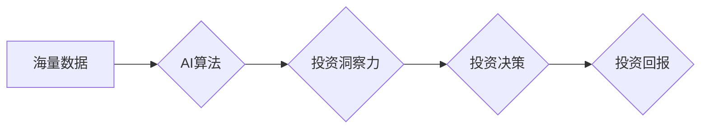

                 

## 理解洞察力的应用：在投资领域的实践探索

> 关键词：人工智能、洞察力、投资、机器学习、数据分析、风险管理、预测模型

## 1. 背景介绍

在当今数据爆炸的时代，投资领域面临着前所未有的机遇和挑战。海量的数据提供了丰富的投资线索，但如何从这些数据中挖掘出有价值的洞察力，并将其转化为有效的投资决策，成为了投资者的关键难题。人工智能（AI）技术，特别是机器学习（ML）和深度学习（DL）的快速发展，为投资领域带来了新的希望。

传统的投资决策往往依赖于经验、直觉和有限的历史数据。而AI技术能够通过分析海量数据，识别出人类难以察觉的模式和趋势，从而提供更精准、更全面的投资洞察力。

## 2. 核心概念与联系

**2.1 投资洞察力的本质**

投资洞察力是指从海量数据中识别出有价值的投资线索，并将其转化为可操作的投资决策的能力。它需要结合对市场趋势、公司财务、行业动态等多方面因素的深入理解，并能够进行逻辑推理和风险评估。

**2.2 AI技术在投资领域的应用**

AI技术在投资领域的主要应用场景包括：

* **风险管理:** 通过分析历史数据和市场波动，识别潜在的风险因素，并制定相应的风险控制策略。
* **资产配置:** 根据投资者的风险偏好和目标收益率，优化资产配置，提高投资回报率。
* **投资策略制定:** 分析市场趋势和公司基本面，制定有效的投资策略，并进行实时调整。
* **交易执行:** 利用AI算法进行高频交易，提高交易效率和盈利能力。

**2.3 AI技术与投资洞察力的关系**

AI技术为投资洞察力的提升提供了强大的工具和手段。通过AI算法的分析和处理，投资者能够更深入地了解市场和公司，识别出更精准的投资机会，并做出更明智的投资决策。

**Mermaid 流程图**



## 3. 核心算法原理 & 具体操作步骤

**3.1 算法原理概述**

在投资领域，常用的AI算法包括：

* **回归分析:** 用于预测连续型变量，例如股票价格、收益率等。
* **分类算法:** 用于分类数据，例如判断股票是否会上涨或下跌。
* **聚类算法:** 用于将数据进行分组，例如识别不同类型的投资者或投资策略。
* **神经网络:** 用于模拟人类大脑的学习过程，能够处理复杂的数据模式。

**3.2 算法步骤详解**

以回归分析为例，其具体操作步骤如下：

1. **数据收集:** 收集相关股票数据，例如历史价格、交易量、财务指标等。
2. **数据预处理:** 对数据进行清洗、转换和特征工程，例如处理缺失值、标准化数据、提取特征变量等。
3. **模型训练:** 使用回归算法训练模型，例如线性回归、逻辑回归等，并选择合适的模型参数。
4. **模型评估:** 使用测试数据评估模型的性能，例如计算均方误差、R-squared等指标。
5. **模型部署:** 将训练好的模型部署到实际应用环境中，用于预测股票价格。

**3.3 算法优缺点**

不同的AI算法具有不同的优缺点，需要根据具体应用场景选择合适的算法。

* **回归分析:** 优点：易于理解和实现，计算效率高。缺点：对数据线性关系依赖性强，难以处理复杂的数据模式。
* **分类算法:** 优点：能够处理分类问题，识别出不同的投资机会。缺点：对数据质量要求较高，容易受到过拟合的影响。
* **聚类算法:** 优点：能够发现数据中的隐含结构，识别出不同类型的投资者或投资策略。缺点：聚类结果难以解释，需要人工进行验证。
* **神经网络:** 优点：能够处理复杂的数据模式，具有较高的预测精度。缺点：训练时间长，参数众多，需要大量的训练数据。

**3.4 算法应用领域**

AI算法在投资领域的应用领域非常广泛，例如：

* **股票预测:** 利用历史数据和市场指标预测股票价格走势。
* **风险评估:** 分析公司财务状况和市场风险，评估投资风险。
* **资产配置:** 根据投资者的风险偏好和目标收益率，优化资产配置。
* **投资策略制定:** 分析市场趋势和公司基本面，制定有效的投资策略。

## 4. 数学模型和公式 & 详细讲解 & 举例说明

**4.1 数学模型构建**

在投资领域，常用的数学模型包括：

* **资本资产定价模型 (CAPM):** 用于估算股票的预期收益率，并衡量其风险。
* ** discounted cash flow (DCF) 模型:** 用于估算公司的未来现金流，并将其折现到现值，从而估算公司的价值。
* **Black-Scholes 模型:** 用于估算期权的价格。

**4.2 公式推导过程**

以CAPM为例，其核心公式如下：

$$
E(R_i) = R_f + \beta_i * (E(R_m) - R_f)
$$

其中：

* $E(R_i)$: 股票i的预期收益率
* $R_f$: 无风险利率
* $\beta_i$: 股票i的系统风险
* $E(R_m)$: 市场平均收益率

**4.3 案例分析与讲解**

假设无风险利率为3%，市场平均收益率为8%，股票A的系统风险为1.2。根据CAPM公式，股票A的预期收益率为：

$$
E(R_A) = 0.03 + 1.2 * (0.08 - 0.03) = 0.114
$$

即，股票A的预期收益率为11.4%。

## 5. 项目实践：代码实例和详细解释说明

**5.1 开发环境搭建**

* Python 3.x
* Jupyter Notebook
* pandas
* scikit-learn

**5.2 源代码详细实现**

```python
import pandas as pd
from sklearn.linear_model import LinearRegression

# 数据加载
data = pd.read_csv('stock_data.csv')

# 数据预处理
X = data[['Open', 'High', 'Low', 'Volume']]
y = data['Close']

# 模型训练
model = LinearRegression()
model.fit(X, y)

# 模型评估
# ...

# 模型预测
# ...
```

**5.3 代码解读与分析**

* 数据加载：使用pandas库读取股票数据。
* 数据预处理：提取特征变量和目标变量。
* 模型训练：使用线性回归模型训练模型。
* 模型评估：使用测试数据评估模型的性能。
* 模型预测：使用训练好的模型预测股票价格。

**5.4 运行结果展示**

* 模型评估结果，例如均方误差、R-squared等指标。
* 模型预测结果，例如预测的股票价格和实际价格的对比。

## 6. 实际应用场景

**6.1 风险管理**

AI技术可以帮助投资者识别潜在的风险因素，并制定相应的风险控制策略。例如，可以分析公司财务状况、行业动态和市场波动，识别出可能导致投资损失的风险。

**6.2 资产配置**

AI技术可以根据投资者的风险偏好和目标收益率，优化资产配置，提高投资回报率。例如，可以分析不同资产类别的风险和收益，并根据投资者的需求进行组合配置。

**6.3 投资策略制定**

AI技术可以分析市场趋势和公司基本面，制定有效的投资策略，并进行实时调整。例如，可以分析股票价格走势、技术指标和新闻事件，识别出潜在的投资机会。

**6.4 未来应用展望**

随着AI技术的不断发展，其在投资领域的应用将更加广泛和深入。例如，未来可能出现：

* 更精准的投资预测模型
* 更智能的投资机器人
* 更个性化的投资服务

## 7. 工具和资源推荐

**7.1 学习资源推荐**

* **书籍:**
    * 《人工智能投资》
    * 《机器学习实战》
    * 《Python数据科学手册》
* **在线课程:**
    * Coursera: 机器学习
    * edX: 投资分析
    * Udacity: 深度学习

**7.2 开发工具推荐**

* **Python:** 
    * pandas
    * scikit-learn
    * TensorFlow
    * PyTorch
* **Jupyter Notebook:** 用于代码编写和可视化分析
* **云计算平台:** AWS, Azure, GCP

**7.3 相关论文推荐**

* **AlphaGo论文:** DeepMind团队开发的AlphaGo程序在围棋比赛中战胜了世界冠军，标志着深度学习技术的突破。
* **BERT论文:** Google团队开发的BERT模型在自然语言处理领域取得了突破性进展，例如文本分类、问答系统等。

## 8. 总结：未来发展趋势与挑战

**8.1 研究成果总结**

AI技术在投资领域的应用取得了显著成果，例如：

* 提高了投资预测精度
* 优化了资产配置
* 降低了投资风险

**8.2 未来发展趋势**

* **更精准的预测模型:** 利用更先进的AI算法和更丰富的训练数据，构建更精准的投资预测模型。
* **更智能的投资机器人:** 开发能够自主决策的投资机器人，帮助投资者进行更智能的投资管理。
* **更个性化的投资服务:** 利用AI技术分析投资者的需求和风险偏好，提供更个性化的投资服务。

**8.3 面临的挑战**

* **数据质量问题:** AI算法对数据质量要求较高，需要确保数据的准确性和完整性。
* **算法解释性问题:** 一些AI算法的决策过程难以解释，这可能会导致投资者对模型结果缺乏信任。
* **监管挑战:** AI技术的应用需要遵守相关的法律法规，需要制定相应的监管政策。

**8.4 研究展望**

未来，AI技术在投资领域的应用将更加广泛和深入，需要进一步研究以下问题：

* 如何提高AI算法的解释性
* 如何解决数据质量问题
* 如何制定相应的监管政策


## 9. 附录：常见问题与解答

**9.1 如何选择合适的AI算法？**

选择合适的AI算法需要根据具体应用场景和数据特点进行选择。例如，对于预测连续型变量，可以使用回归算法；对于分类问题，可以使用分类算法；对于发现数据中的隐含结构，可以使用聚类算法。

**9.2 如何评估AI模型的性能？**

常用的AI模型性能评估指标包括均方误差、R-squared、准确率、召回率等。需要根据具体应用场景选择合适的评估指标。

**9.3 如何解决数据质量问题？**

数据质量问题可以通过以下方法解决：

* 数据清洗：删除重复数据、缺失值和错误数据。
* 数据转换：将数据转换为合适的格式。
* 数据特征工程：提取新的特征变量，提高数据的表达能力。


作者：禅与计算机程序设计艺术 / Zen and the Art of Computer Programming 
<end_of_turn>

