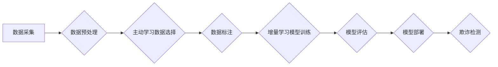

                 

## 关键词：电商反作弊、增量学习、主动学习、机器学习、数据驱动、欺诈检测

## 1. 背景介绍

随着电商平台的蓬勃发展，欺诈行为也日益猖獗，给电商平台和消费者带来了巨大的经济损失和安全隐患。传统的反作弊方法主要依赖于规则引擎和人工干预，但随着欺诈手段的不断升级，这些方法已难以有效应对。

机器学习技术凭借其强大的数据分析能力和自学习特性，为电商反作弊提供了新的解决方案。其中，增量学习和主动学习作为机器学习的两个重要分支，在电商反作弊领域展现出巨大的潜力。

增量学习是指在模型已经训练完成的情况下，利用新数据进行模型更新，从而不断提升模型的准确性和泛化能力。主动学习则是一种数据选择策略，通过智能地选择需要标注的数据，提高训练数据的质量和效率。

## 2. 核心概念与联系

### 2.1 增量学习

增量学习的核心思想是，在模型训练过程中不断地添加新的数据，并根据这些新数据对模型进行更新。这种方法可以有效地解决传统机器学习方法面临的“过拟合”问题，因为模型在训练过程中不断接触新的数据，能够更好地适应数据分布的变化。

### 2.2 主动学习

主动学习的核心思想是，在有限的标注数据情况下，通过智能地选择需要标注的数据，提高训练数据的质量和效率。主动学习算法通常会根据模型的预测不确定性、数据多样性等因素，选择最具代表性的数据进行标注。

### 2.3 增量学习与主动学习的结合

在电商反作弊领域，增量学习和主动学习可以相互结合，形成一个更加高效的解决方案。

* **主动学习可以帮助增量学习选择更具价值的新数据。** 由于欺诈行为往往是不断变化的，因此需要不断更新模型以应对新的欺诈手段。主动学习可以帮助识别出最有可能包含新欺诈模式的数据，并优先进行标注，从而提高增量学习的效率和准确性。
* **增量学习可以帮助主动学习不断优化数据选择策略。** 随着模型的不断更新，其对数据的理解也会不断加深。主动学习算法可以利用模型的预测结果，不断优化数据选择策略，选择出更具代表性的数据进行标注。

**Mermaid 流程图**



## 3. 核心算法原理 & 具体操作步骤

### 3.1 算法原理概述

增量学习和主动学习算法的原理主要基于以下几个方面：

* **数据流式处理:**  增量学习算法能够处理不断流入的新数据，并实时更新模型参数。
* **模型参数更新:**  增量学习算法通过分析新数据，对模型参数进行微调，从而不断提升模型的准确性。
* **数据选择策略:** 主动学习算法通过分析模型的预测不确定性、数据多样性等因素，选择最具代表性的数据进行标注。

### 3.2 算法步骤详解

**增量学习算法步骤:**

1. **初始化模型:** 使用初始数据集训练一个基础模型。
2. **数据流式处理:**  接收不断流入的新数据。
3. **模型更新:**  根据新数据对模型参数进行微调。
4. **模型评估:**  定期评估模型的性能，并根据评估结果进行模型调整。

**主动学习算法步骤:**

1. **初始数据标注:**  选择一部分数据进行人工标注。
2. **模型训练:**  使用标注数据训练一个初始模型。
3. **数据选择:**  根据模型的预测不确定性、数据多样性等因素，选择需要标注的数据。
4. **数据标注:**  对选出的数据进行人工标注。
5. **模型更新:**  使用新的标注数据对模型进行更新。
6. **重复步骤3-5:**  不断重复数据选择和标注过程，直到达到预设的性能目标。

### 3.3 算法优缺点

**增量学习算法:**

* **优点:**  能够处理不断变化的数据流，并实时更新模型，具有较强的适应性。
* **缺点:**  需要不断收集和处理新数据，对数据质量要求较高。

**主动学习算法:**

* **优点:**  能够有效地利用有限的标注数据，提高训练数据的质量和效率。
* **缺点:**  需要设计合适的主动学习策略，才能有效地选择需要标注的数据。

### 3.4 算法应用领域

增量学习和主动学习算法在电商反作弊领域有着广泛的应用场景，例如：

* **欺诈行为识别:**  利用增量学习算法，可以不断更新模型，识别出新的欺诈行为模式。
* **账户风险评估:**  利用主动学习算法，可以智能地选择需要进行风险评估的账户，提高风险评估的效率。
* **交易异常检测:**  利用增量学习和主动学习算法的结合，可以更加准确地识别交易异常，防止欺诈交易的发生。

## 4. 数学模型和公式 & 详细讲解 & 举例说明

### 4.1 数学模型构建

在电商反作弊领域，增量学习和主动学习算法通常基于以下数学模型：

* **分类模型:**  例如逻辑回归、支持向量机、决策树等，用于识别欺诈行为。
* **回归模型:**  例如线性回归、支持向量回归等，用于评估账户风险。
* **聚类模型:**  例如k-means聚类、DBSCAN等，用于发现欺诈行为模式。

### 4.2 公式推导过程

增量学习和主动学习算法的具体公式推导过程较为复杂，涉及到概率论、统计学、机器学习等多个领域。

**举例说明:**

**增量学习算法中的梯度下降法:**

$$
\theta = \theta - \alpha \nabla J(\theta)
$$

其中:

* $\theta$ 是模型参数
* $\alpha$ 是学习率
* $\nabla J(\theta)$ 是损失函数 $J(\theta)$ 的梯度

### 4.3 案例分析与讲解

**案例:**  假设电商平台要利用增量学习算法识别信用卡欺诈行为。

1. **初始模型训练:**  使用历史信用卡交易数据训练一个欺诈检测模型。
2. **新数据流式处理:**  不断接收新的信用卡交易数据。
3. **模型更新:**  根据新数据对模型参数进行微调，提高模型的欺诈检测准确率。

## 5. 项目实践：代码实例和详细解释说明

### 5.1 开发环境搭建

* **操作系统:**  Linux/macOS/Windows
* **编程语言:**  Python
* **机器学习库:**  Scikit-learn、TensorFlow、PyTorch等
* **数据存储:**  MySQL、MongoDB等

### 5.2 源代码详细实现

```python
# 导入必要的库
import pandas as pd
from sklearn.linear_model import LogisticRegression
from sklearn.model_selection import train_test_split

# 加载数据
data = pd.read_csv('creditcard_data.csv')

# 数据预处理
# ...

# 将数据分成训练集和测试集
X_train, X_test, y_train, y_test = train_test_split(data.drop('Class', axis=1), data['Class'], test_size=0.2)

# 初始化模型
model = LogisticRegression()

# 训练模型
model.fit(X_train, y_train)

# 预测测试集
y_pred = model.predict(X_test)

# 评估模型性能
# ...

# 使用新数据更新模型
new_data = pd.read_csv('new_creditcard_data.csv')
# ...
model.partial_fit(new_data.drop('Class', axis=1), new_data['Class'])
```

### 5.3 代码解读与分析

* **数据加载和预处理:**  首先需要加载数据并进行预处理，例如缺失值处理、特征工程等。
* **模型训练:**  使用训练数据训练一个欺诈检测模型。
* **模型评估:**  使用测试数据评估模型的性能，例如准确率、召回率等。
* **模型更新:**  使用新数据更新模型，提高模型的准确性和泛化能力。

### 5.4 运行结果展示

运行代码后，可以得到模型的训练结果、预测结果以及性能指标。

## 6. 实际应用场景

### 6.1 账户风险评估

电商平台可以利用增量学习和主动学习算法，对用户账户进行风险评估，识别高风险账户，并采取相应的措施，例如限制交易额、进行身份验证等。

### 6.2 交易异常检测

电商平台可以利用增量学习和主动学习算法，对交易行为进行异常检测，识别可疑交易，并进行人工审核或采取其他措施，防止欺诈交易的发生。

### 6.3 商品价格监测

电商平台可以利用增量学习和主动学习算法，监测商品价格的变化，识别异常价格波动，并采取措施，例如提醒用户、进行价格调整等。

### 6.4 未来应用展望

随着人工智能技术的不断发展，增量学习和主动学习算法在电商反作弊领域将有更广泛的应用场景，例如：

* **个性化反作弊:**  根据用户的行为特征，定制化反作弊策略。
* **跨平台反作弊:**  利用多平台的数据，构建更全面的反作弊模型。
* **预警式反作弊:**  利用机器学习算法预测未来的欺诈行为，并采取预警措施。

## 7. 工具和资源推荐

### 7.1 学习资源推荐

* **书籍:**  《机器学习》 (周志华)
* **在线课程:**  Coursera、edX、Udacity等平台上的机器学习课程
* **博客:**  机器之心、AI 算法等机器学习相关的博客

### 7.2 开发工具推荐

* **Python:**  Python 是机器学习开发的常用语言，拥有丰富的机器学习库。
* **Scikit-learn:**  Scikit-learn 是 Python 的一个机器学习库，提供了各种常用的机器学习算法。
* **TensorFlow:**  TensorFlow 是 Google 开发的深度学习框架。
* **PyTorch:**  PyTorch 是 Facebook 开发的深度学习框架。

### 7.3 相关论文推荐

* **Active Learning for Fraud Detection**
* **Incremental Learning for Fraud Detection**
* **Deep Learning for Fraud Detection**

## 8. 总结：未来发展趋势与挑战

### 8.1 研究成果总结

增量学习和主动学习算法在电商反作弊领域取得了显著的成果，能够有效地识别欺诈行为、评估账户风险、检测交易异常等。

### 8.2 未来发展趋势

* **模型融合:**  将不同的机器学习算法融合在一起，构建更强大的反作弊模型。
* **数据增强:**  利用数据增强技术，增加训练数据的数量和多样性，提高模型的泛化能力。
* **解释性AI:**  研究更具解释性的机器学习算法，帮助人类理解模型的决策过程。

### 8.3 面临的挑战

* **数据质量:**  欺诈行为数据往往是稀缺和不平衡的，需要不断提高数据质量。
* **模型鲁棒性:**  欺诈行为不断变化，需要开发更具鲁棒性的模型，能够适应新的欺诈手段。
* **隐私保护:**  在使用用户数据进行反作弊时，需要保证用户隐私的保护。

### 8.4 研究展望

未来，增量学习和主动学习算法在电商反作弊领域将继续发展，并与其他人工智能技术相结合，构建更加智能、高效、安全的电商生态系统。

## 9. 附录：常见问题与解答

* **Q1: 增量学习和主动学习算法有什么区别？**

* **A1:** 增量学习算法侧重于利用新数据更新模型，而主动学习算法侧重于智能地选择需要标注的数据。

* **Q2: 如何选择合适的主动学习策略？**

* **A2:**  选择合适的主动学习策略需要根据具体应用场景和数据特点进行分析。常见的主动学习策略包括：不确定性采样、多样性采样、代表性采样等。

* **Q3: 如何评估增量学习和主动学习算法的性能？**

* **A3:**  可以使用准确率、召回率、F1-score等指标评估增量学习和主动学习算法的性能。

* **Q4: 如何解决数据质量问题？**

* **A4:**  可以采用数据清洗、数据增强、数据标注等方法来提高数据质量。


作者：禅与计算机程序设计艺术 / Zen and the Art of Computer Programming 
<end_of_turn>

