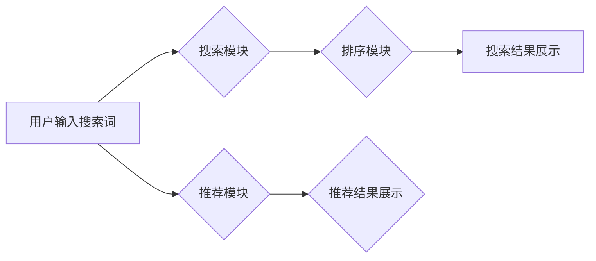

                 

## 电商平台搜索推荐系统的AI 大模型优化：提高系统性能、效率、准确率与用户体验

> 关键词：电商平台、搜索推荐系统、AI 大模型、模型优化、性能提升、效率提升、准确率提升、用户体验

## 1. 背景介绍

在当今数据爆炸的时代，电商平台搜索推荐系统已成为用户获取商品信息和完成购买决策的关键环节。传统的搜索推荐系统主要依赖于规则引擎和基于特征的机器学习算法，但随着用户行为数据的复杂性和海量化，这些方法逐渐难以满足用户日益增长的个性化需求和平台快速发展的要求。

近年来，深度学习技术蓬勃发展，特别是 Transformer 模型的出现，为电商平台搜索推荐系统的优化带来了新的机遇。AI 大模型凭借其强大的学习能力和泛化能力，能够从海量数据中挖掘更深层的用户偏好和商品关联，从而提供更精准、更个性化的搜索和推荐结果。

## 2. 核心概念与联系

### 2.1  电商平台搜索推荐系统

电商平台搜索推荐系统旨在帮助用户快速找到所需商品，并根据用户的兴趣和需求提供个性化的推荐，从而提升用户体验和促进交易转化。

系统通常由以下几个模块组成：

* **搜索模块:** 处理用户搜索词的理解和匹配，返回相关商品列表。
* **推荐模块:** 基于用户的历史行为、浏览记录、购买偏好等信息，推荐用户可能感兴趣的商品。
* **排序模块:** 对搜索结果和推荐结果进行排序，将最相关的商品展示在用户面前。
* **展示模块:** 将排序后的结果以用户友好的方式展示给用户。

### 2.2  AI 大模型

AI 大模型是指在海量数据上训练的深度学习模型，拥有强大的学习能力和泛化能力。常见的 AI 大模型包括 Transformer、BERT、GPT 等。

### 2.3  模型优化

模型优化是指通过调整模型结构、训练参数、训练策略等方式，提高模型的性能、效率和准确率。

**Mermaid 流程图**



## 3. 核心算法原理 & 具体操作步骤

### 3.1  算法原理概述

在电商平台搜索推荐系统中，常用的 AI 大模型算法包括：

* **协同过滤:** 基于用户的历史行为和商品的购买记录，预测用户对商品的兴趣。
* **内容过滤:** 基于商品的特征和描述，推荐与用户兴趣相符的商品。
* **深度学习:** 使用深度神经网络学习用户行为和商品特征之间的复杂关系，进行更精准的推荐。

### 3.2  算法步骤详解

以深度学习算法为例，其具体操作步骤如下：

1. **数据预处理:** 收集用户行为数据、商品信息数据等，进行清洗、转换、特征工程等操作，构建训练数据集。
2. **模型选择:** 根据业务需求和数据特点，选择合适的深度学习模型，例如 Transformer、BERT 等。
3. **模型训练:** 使用训练数据集训练模型，调整模型参数，使模型能够准确预测用户对商品的兴趣。
4. **模型评估:** 使用测试数据集评估模型的性能，例如准确率、召回率、NDCG 等指标。
5. **模型部署:** 将训练好的模型部署到线上环境，用于实时推荐。

### 3.3  算法优缺点

**深度学习算法**

* **优点:** 能够学习用户行为和商品特征之间的复杂关系，提供更精准的推荐。
* **缺点:** 需要海量数据进行训练，训练时间长，模型参数复杂，部署成本高。

### 3.4  算法应用领域

深度学习算法广泛应用于电商平台搜索推荐系统、个性化广告推荐、内容推荐等领域。

## 4. 数学模型和公式 & 详细讲解 & 举例说明

### 4.1  数学模型构建

深度学习模型通常使用神经网络结构，通过多层神经元进行特征提取和学习。

**举例说明:** Transformer 模型使用多头注意力机制，可以学习用户和商品之间的上下文关系。

### 4.2  公式推导过程

Transformer 模型的注意力机制公式如下：

$$
Attention(Q, K, V) = softmax(\frac{QK^T}{\sqrt{d_k}})V
$$

其中：

* $Q$：查询矩阵
* $K$：键矩阵
* $V$：值矩阵
* $d_k$：键向量的维度
* $softmax$：softmax 函数

### 4.3  案例分析与讲解

假设用户对商品 A 和商品 B 都感兴趣，商品 A 和商品 B 的特征向量分别为 $q_A$ 和 $q_B$。

使用注意力机制计算用户对商品 A 和商品 B 的注意力权重：

$$
Attention(q_A, K, V) = softmax(\frac{q_A K^T}{\sqrt{d_k}})V
$$

其中 $K$ 和 $V$ 是所有商品的键和值矩阵。

通过计算注意力权重，可以得到用户对商品 A 和商品 B 的兴趣程度，从而进行个性化推荐。

## 5. 项目实践：代码实例和详细解释说明

### 5.1  开发环境搭建

* Python 3.7+
* TensorFlow 2.0+
* PyTorch 1.0+
* CUDA 10.0+

### 5.2  源代码详细实现

```python
# 导入必要的库
import tensorflow as tf

# 定义 Transformer 模型
class Transformer(tf.keras.Model):
    def __init__(self, vocab_size, embedding_dim, num_heads, num_layers):
        super(Transformer, self).__init__()
        self.embedding = tf.keras.layers.Embedding(vocab_size, embedding_dim)
        self.transformer_layers = tf.keras.layers.StackedRNNCells([
            tf.keras.layers.MultiHeadAttention(num_heads=num_heads, key_dim=embedding_dim)
            for _ in range(num_layers)
        ])

    def call(self, inputs):
        # 将输入转换为嵌入向量
        embedded = self.embedding(inputs)
        # 使用 Transformer 层进行编码
        encoded = self.transformer_layers(embedded)
        return encoded

# 实例化 Transformer 模型
model = Transformer(vocab_size=10000, embedding_dim=128, num_heads=8, num_layers=6)

# 训练模型
model.compile(optimizer='adam', loss='mse')
model.fit(x_train, y_train, epochs=10)

# 预测结果
predictions = model.predict(x_test)
```

### 5.3  代码解读与分析

* 代码首先导入必要的库，定义 Transformer 模型类。
* 模型类包含嵌入层、Transformer 层等组件。
* 嵌入层将输入的词语转换为向量表示。
* Transformer 层使用多头注意力机制进行编码，学习用户和商品之间的上下文关系。
* 代码实例化 Transformer 模型，并使用 Adam 优化器和均方误差损失函数进行训练。
* 训练完成后，可以使用模型预测用户对商品的兴趣程度。

### 5.4  运行结果展示

训练结果可以根据模型的性能指标进行评估，例如准确率、召回率、NDCG 等。

## 6. 实际应用场景

AI 大模型在电商平台搜索推荐系统中的应用场景广泛，例如：

* **个性化商品推荐:** 根据用户的历史行为、浏览记录、购买偏好等信息，推荐用户可能感兴趣的商品。
* **搜索结果排序:** 对搜索结果进行排序，将最相关的商品展示在用户面前。
* **商品分类和标签推荐:** 根据商品的特征和描述，自动进行商品分类和标签推荐。
* **用户画像构建:** 利用 AI 大模型学习用户的兴趣偏好、消费习惯等信息，构建用户画像，为用户提供更精准的个性化服务。

### 6.4  未来应用展望

随着 AI 技术的不断发展，AI 大模型在电商平台搜索推荐系统中的应用场景将更加广泛，例如：

* **多模态推荐:** 将文本、图像、视频等多模态数据融合，提供更丰富的推荐体验。
* **实时个性化推荐:** 基于用户的实时行为，动态调整推荐结果，提供更精准的个性化服务。
* **跨平台推荐:** 将用户行为数据整合，实现跨平台的个性化推荐。

## 7. 工具和资源推荐

### 7.1  学习资源推荐

* **书籍:**
    * 深度学习
    * 自然语言处理
* **在线课程:**
    * Coursera
    * edX
    * fast.ai

### 7.2  开发工具推荐

* **TensorFlow:** 开源深度学习框架
* **PyTorch:** 开源深度学习框架
* **Hugging Face Transformers:** 提供预训练 Transformer 模型和工具

### 7.3  相关论文推荐

* Attention Is All You Need
* BERT: Pre-training of Deep Bidirectional Transformers for Language Understanding
* GPT-3: Language Models are Few-Shot Learners

## 8. 总结：未来发展趋势与挑战

### 8.1  研究成果总结

AI 大模型在电商平台搜索推荐系统中的应用取得了显著成果，能够提供更精准、更个性化的推荐，提升用户体验和平台商业价值。

### 8.2  未来发展趋势

未来，AI 大模型在电商平台搜索推荐系统中的应用将朝着以下方向发展：

* **模型规模和能力提升:** 训练更大规模、更强大的 AI 大模型，提升推荐的准确率和个性化程度。
* **多模态融合:** 将文本、图像、视频等多模态数据融合，提供更丰富的推荐体验。
* **实时个性化推荐:** 基于用户的实时行为，动态调整推荐结果，提供更精准的个性化服务。

### 8.3  面临的挑战

AI 大模型在电商平台搜索推荐系统中的应用也面临一些挑战：

* **数据隐私和安全:** AI 大模型需要海量数据进行训练，如何保护用户数据隐私和安全是一个重要问题。
* **模型解释性和可控性:** AI 大模型的决策过程往往是复杂的，如何提高模型的解释性和可控性是一个重要的研究方向。
* **模型部署和维护成本:** 训练和部署大型 AI 模型需要大量的计算资源和人力成本。

### 8.4  研究展望

未来，需要进一步研究如何解决 AI 大模型在电商平台搜索推荐系统中的应用面临的挑战，例如：

* 开发更隐私保护的 AI 模型训练方法。
* 研究更有效的模型解释和可控性技术。
* 探索更有效的模型部署和维护方案。


## 9. 附录：常见问题与解答

* **Q1: 如何选择合适的 AI 大模型？**

* **A1:** 选择合适的 AI 大模型需要根据业务需求、数据特点和计算资源等因素进行综合考虑。

* **Q2: 如何评估 AI 大模型的性能？**

* **A2:** 可以使用准确率、召回率、NDCG 等指标评估 AI 大模型的性能。

* **Q3: 如何部署 AI 大模型？**

* **A3:** 可以使用云平台、容器化技术等方式部署 AI 大模型。


作者：禅与计算机程序设计艺术 / Zen and the Art of Computer Programming 
<end_of_turn>

