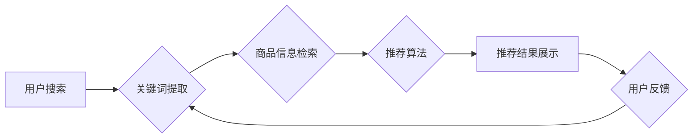

                 

## 电商平台的AI 大模型转型：搜索推荐系统是核心，数据质量控制是关键

> 关键词：电商平台、AI大模型、搜索推荐系统、数据质量控制、Transformer模型、深度学习、自然语言处理、推荐算法、个性化推荐

## 1. 背景介绍

随着人工智能技术的飞速发展，电商平台正经历一场深刻的变革。传统基于规则的搜索推荐系统已难以满足用户日益增长的个性化需求和平台快速发展的要求。AI大模型的出现为电商平台带来了新的机遇，其强大的学习能力和泛化能力能够有效提升搜索推荐系统的精准度、个性化程度和用户体验。

然而，AI大模型的应用并非一帆风顺。数据质量是AI大模型训练和应用的关键因素，数据不准确、不完整或存在偏差都会导致模型性能下降，甚至产生不可预知的错误。因此，在电商平台的AI大模型转型过程中，不仅要注重核心算法的研发和应用，更要重视数据质量的控制和管理。

## 2. 核心概念与联系

### 2.1  AI大模型

AI大模型是指在海量数据上训练的深度学习模型，其参数规模巨大，具备强大的泛化能力和学习能力。常见的AI大模型包括GPT-3、BERT、LaMDA等，它们在自然语言处理、图像识别、语音合成等领域取得了突破性的进展。

### 2.2  搜索推荐系统

搜索推荐系统是电商平台的核心功能之一，其目的是根据用户的搜索行为和历史记录，推荐与用户需求相匹配的商品或服务。传统的搜索推荐系统主要依赖于关键词匹配和规则引擎，而AI大模型的应用则能够实现更智能、更精准的推荐。

### 2.3  数据质量控制

数据质量是指数据准确性、完整性、一致性和及时性等方面的指标。数据质量直接影响AI大模型的训练效果和应用性能，因此数据质量控制是AI大模型应用的关键环节。

**Mermaid 流程图**



## 3. 核心算法原理 & 具体操作步骤

### 3.1  算法原理概述

在电商平台的搜索推荐系统中，Transformer模型是目前最先进的算法之一。Transformer模型基于注意力机制，能够捕捉用户搜索词和商品信息的语义关系，实现更精准的推荐。

### 3.2  算法步骤详解

1. **数据预处理:** 将用户搜索词和商品信息转换为数字向量，以便模型训练。
2. **编码器:** 使用Transformer模型的编码器层对用户搜索词进行编码，提取其语义特征。
3. **解码器:** 使用Transformer模型的解码器层对商品信息进行解码，生成推荐结果。
4. **注意力机制:** 在编码器和解码器层之间使用注意力机制，根据用户搜索词和商品信息的语义相关性，调整商品信息的权重，提高推荐精准度。
5. **损失函数:** 使用交叉熵损失函数，计算模型预测结果与真实结果之间的差异，并反向传播梯度，更新模型参数。

### 3.3  算法优缺点

**优点:**

* 能够捕捉用户搜索词和商品信息的语义关系，实现更精准的推荐。
* 具有强大的泛化能力，能够适应不同的电商平台和用户群体。

**缺点:**

* 训练成本高，需要海量数据和强大的计算资源。
* 模型参数规模庞大，部署和维护成本较高。

### 3.4  算法应用领域

Transformer模型在电商平台的搜索推荐系统之外，还广泛应用于其他领域，例如：

* 自然语言处理：文本分类、情感分析、机器翻译等。
* 图像识别：物体检测、图像分类、图像生成等。
* 语音合成：语音识别、语音合成、语音增强等。

## 4. 数学模型和公式 & 详细讲解 & 举例说明

### 4.1  数学模型构建

Transformer模型的核心是注意力机制，其数学模型可以表示为：

$$
Attention(Q, K, V) = softmax(\frac{QK^T}{\sqrt{d_k}})V
$$

其中：

* $Q$：查询矩阵
* $K$：键矩阵
* $V$：值矩阵
* $d_k$：键向量的维度
* $softmax$：softmax函数

### 4.2  公式推导过程

注意力机制的目的是计算查询向量与键向量的相关性，并根据相关性调整值向量的权重。

1. 计算查询向量与键向量的点积，得到一个得分矩阵。
2. 对得分矩阵进行归一化，得到一个概率分布。
3. 将概率分布与值向量相乘，得到加权后的值向量。

### 4.3  案例分析与讲解

假设用户搜索词为“篮球”，商品信息包括“篮球”、“足球”、“排球”等。

* $Q$：表示用户搜索词“篮球”的向量表示。
* $K$：表示每个商品的向量表示。
* $V$：表示每个商品的信息向量。

通过计算注意力机制，可以得到“篮球”与每个商品的关联度，例如，“篮球”与“篮球”的关联度最高，其次是“篮球”与“排球”的关联度，最后是“篮球”与“足球”的关联度。

最终，模型会根据这些关联度，推荐与“篮球”最相关的商品。

## 5. 项目实践：代码实例和详细解释说明

### 5.1  开发环境搭建

* Python 3.7+
* TensorFlow 2.0+
* PyTorch 1.0+
* CUDA 10.0+

### 5.2  源代码详细实现

```python
# 导入必要的库
import tensorflow as tf

# 定义Transformer模型
class Transformer(tf.keras.Model):
    def __init__(self, vocab_size, embedding_dim, num_heads, num_layers):
        super(Transformer, self).__init__()
        self.embedding = tf.keras.layers.Embedding(vocab_size, embedding_dim)
        self.encoder = tf.keras.layers.TransformerEncoder(
            tf.keras.layers.MultiHeadAttention(num_heads=num_heads),
            num_layers=num_layers
        )
        self.decoder = tf.keras.layers.TransformerDecoder(
            tf.keras.layers.MultiHeadAttention(num_heads=num_heads),
            num_layers=num_layers
        )

    def call(self, inputs):
        # 嵌入输入序列
        embedded_inputs = self.embedding(inputs)
        # 编码输入序列
        encoded_inputs = self.encoder(embedded_inputs)
        # 解码输出序列
        decoded_outputs = self.decoder(encoded_inputs)
        return decoded_outputs

# 实例化Transformer模型
model = Transformer(vocab_size=10000, embedding_dim=128, num_heads=8, num_layers=6)

# 训练模型
model.compile(optimizer='adam', loss='mse')
model.fit(train_data, train_labels, epochs=10)

```

### 5.3  代码解读与分析

* 代码首先导入必要的库，包括TensorFlow和PyTorch。
* 然后定义一个Transformer模型类，该类继承自tf.keras.Model。
* 模型类中定义了嵌入层、编码器和解码器。
* 嵌入层将输入序列转换为数字向量。
* 编码器和解码器使用Transformer架构，包含多头注意力机制和多层神经网络。
* call方法定义了模型的输入和输出。
* 最后，实例化模型并使用Adam优化器和均方误差损失函数进行训练。

### 5.4  运行结果展示

训练完成后，可以使用测试数据评估模型的性能。

## 6. 实际应用场景

### 6.1  个性化推荐

AI大模型可以根据用户的搜索历史、浏览记录、购买行为等数据，构建用户画像，并推荐个性化的商品或服务。

### 6.2  商品搜索

AI大模型可以理解用户的自然语言搜索词，并返回与用户需求相匹配的商品信息。

### 6.3  内容推荐

AI大模型可以根据用户的兴趣爱好，推荐相关的文章、视频、图片等内容。

### 6.4  未来应用展望

随着AI技术的不断发展，AI大模型在电商平台的应用场景将更加广泛，例如：

* 智能客服：使用AI大模型构建智能客服机器人，为用户提供24小时在线服务。
* 营销推广：使用AI大模型进行精准营销，提高广告投放效果。
* 商品定价：使用AI大模型分析市场数据，制定合理的商品定价策略。

## 7. 工具和资源推荐

### 7.1  学习资源推荐

* **书籍:**
    * 《深度学习》
    * 《自然语言处理》
    * 《Transformer模型》
* **在线课程:**
    * Coursera
    * edX
    * Udacity

### 7.2  开发工具推荐

* **TensorFlow:** 开源深度学习框架
* **PyTorch:** 开源深度学习框架
* **Hugging Face:** 提供预训练模型和开发工具

### 7.3  相关论文推荐

* 《Attention Is All You Need》
* 《BERT: Pre-training of Deep Bidirectional Transformers for Language Understanding》
* 《GPT-3: Language Models are Few-Shot Learners》

## 8. 总结：未来发展趋势与挑战

### 8.1  研究成果总结

AI大模型在电商平台的搜索推荐系统中取得了显著的成果，能够实现更精准、更个性化的推荐，提升用户体验。

### 8.2  未来发展趋势

* 模型规模和性能将继续提升，模型参数规模将更大，训练效率更高。
* 模型应用场景将更加广泛，例如智能客服、营销推广、商品定价等。
* 模型解释性和可解释性将得到加强，能够更好地理解模型的决策过程。

### 8.3  面临的挑战

* 数据质量控制仍然是AI大模型应用的关键挑战，需要不断完善数据采集、清洗、标注等环节。
* 模型训练成本高，需要强大的计算资源和技术支持。
* 模型安全性和隐私性需要得到保障，防止模型被恶意利用或泄露用户隐私。

### 8.4  研究展望

未来，AI大模型在电商平台的应用将更加深入和广泛，需要不断探索新的算法、模型和应用场景，并解决数据质量控制、模型训练成本和安全隐私等挑战。


## 9. 附录：常见问题与解答

**Q1：AI大模型的训练需要多少数据？**

A1：AI大模型的训练需要海量数据，通常需要百万甚至数十亿条数据才能达到较好的效果。

**Q2：如何保证AI大模型的准确性？**

A2：保证AI大模型的准确性需要从多个方面入手，包括数据质量控制、模型架构设计、训练参数调优等。

**Q3：AI大模型的应用有哪些伦理问题？**

A3：AI大模型的应用存在一些伦理问题，例如数据隐私、算法偏见、模型解释性等，需要引起重视并制定相应的规范和制度。


作者：禅与计算机程序设计艺术 / Zen and the Art of Computer Programming 
<end_of_turn>

