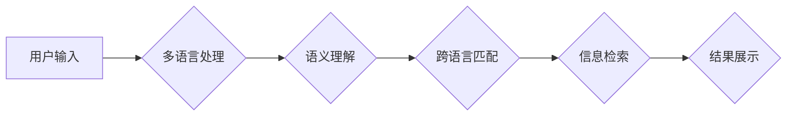

                 

## 电商搜索业务中的多语言与跨语言技术

> 关键词：电商搜索、多语言、跨语言、机器翻译、语义理解、信息检索、自然语言处理、深度学习

## 1. 背景介绍

随着全球化进程的加速，电商平台的用户群体日益多元化，来自不同国家和地区的消费者涌入，对商品信息的需求也更加多样化。传统的单语言搜索引擎难以满足这些用户的需求，因此，电商搜索业务中多语言与跨语言技术的应用成为一个不可忽视的趋势。

多语言搜索是指能够理解和处理多种语言的搜索引擎，而跨语言搜索是指能够理解不同语言之间的语义关系，实现跨语言的搜索和信息 retrieval。

电商平台的多语言搜索面临着诸多挑战：

* **语言多样性:**  电商平台的用户可能使用多种语言进行搜索，包括英语、中文、西班牙语、日语等。
* **语义差异:** 不同语言的表达方式和语义理解存在差异，需要进行跨语言语义匹配。
* **文化差异:** 不同文化背景的用户对商品的理解和需求可能存在差异，需要考虑文化因素的影响。
* **数据稀疏性:**  不同语言的商品数据可能存在稀疏性，需要进行数据增强和跨语言知识迁移。

## 2. 核心概念与联系

### 2.1 多语言搜索与跨语言搜索

多语言搜索是跨语言搜索的基础，它能够理解和处理多种语言的文本。跨语言搜索则进一步扩展了多语言搜索的功能，它能够理解不同语言之间的语义关系，实现跨语言的搜索和信息 retrieval。

### 2.2 核心技术

* **机器翻译:** 将一种语言的文本翻译成另一种语言。
* **语义理解:** 理解文本的含义和语义关系。
* **信息检索:** 从海量数据中检索出与用户查询相关的文档。
* **自然语言处理 (NLP):** 处理和理解人类语言的技术。

### 2.3 架构



## 3. 核心算法原理 & 具体操作步骤

### 3.1 算法原理概述

跨语言搜索的核心算法原理是基于语义匹配。通过机器翻译、语义理解和信息检索等技术，将用户查询与商品信息进行跨语言语义匹配，从而实现跨语言的搜索和信息 retrieval。

### 3.2 算法步骤详解

1. **用户输入处理:** 收集用户输入的查询语句，并进行预处理，例如去除停用词、词形还原等。
2. **多语言处理:** 使用机器翻译模型将用户查询语句翻译成目标语言。
3. **语义理解:** 使用语义理解模型对用户查询语句和商品信息进行语义分析，提取关键词和语义特征。
4. **跨语言匹配:** 使用跨语言匹配算法将用户查询语句和商品信息的语义特征进行匹配，计算相似度。
5. **信息检索:** 根据匹配结果，从商品数据库中检索出与用户查询相关的商品信息。
6. **结果展示:** 将检索结果按照相关性排序，展示给用户。

### 3.3 算法优缺点

**优点:**

* 能够实现跨语言的搜索和信息 retrieval。
* 能够理解不同语言之间的语义关系。
* 能够提高搜索结果的准确性和相关性。

**缺点:**

* 依赖于机器翻译和语义理解模型的准确性。
* 跨语言语义匹配的复杂度较高。
* 需要大量的训练数据和计算资源。

### 3.4 算法应用领域

* 电商搜索
* 旅游搜索
* 新闻搜索
* 社交媒体搜索
* 机器翻译

## 4. 数学模型和公式 & 详细讲解 & 举例说明

### 4.1 数学模型构建

跨语言搜索的数学模型通常基于向量空间模型，将文本表示为向量，并使用余弦相似度计算文本之间的相似度。

**向量空间模型:**

* 将每个词语映射到一个向量空间中。
* 将文本表示为词向量的加权和。

**余弦相似度:**

$$
\text{相似度} = \frac{\mathbf{v_1} \cdot \mathbf{v_2}}{\|\mathbf{v_1}\| \|\mathbf{v_2}\|}
$$

其中：

* $\mathbf{v_1}$ 和 $\mathbf{v_2}$ 是两个文本的向量表示。
* $\cdot$ 表示向量点积。
* $\|\mathbf{v_1}\|$ 和 $\|\mathbf{v_2}\|$ 是两个向量的模长。

### 4.2 公式推导过程

余弦相似度的推导过程如下：

1. 计算两个向量的点积，表示两个向量的内积。
2. 计算两个向量的模长，表示两个向量的长度。
3. 将点积除以两个向量的模长乘积，得到两个向量的夹角余弦值。
4. 余弦值表示两个向量的相似度，值域为[-1, 1]，其中1表示完全相似，-1表示完全不同。

### 4.3 案例分析与讲解

假设有两个文本：

* 文本1: "苹果是红色的水果"
* 文本2: "红苹果是一种美味的水果"

我们可以将这两个文本分别表示为向量，并计算它们的余弦相似度。

如果两个向量的余弦相似度较高，则表示这两个文本的语义相似度较高。

## 5. 项目实践：代码实例和详细解释说明

### 5.1 开发环境搭建

* Python 3.x
* TensorFlow 或 PyTorch
* NLTK 或 spaCy

### 5.2 源代码详细实现

```python
# 导入必要的库
import nltk
from nltk.corpus import stopwords
from sklearn.feature_extraction.text import TfidfVectorizer

# 下载停用词列表
nltk.download('stopwords')

# 定义预处理函数
def preprocess_text(text):
    # 将文本转换为小写
    text = text.lower()
    # 去除停用词
    stop_words = set(stopwords.words('english'))
    words = [word for word in text.split() if word not in stop_words]
    # 返回预处理后的文本
    return ' '.join(words)

# 定义向量化函数
def vectorize_text(text):
    # 使用TF-IDF向量化
    vectorizer = TfidfVectorizer()
    vector = vectorizer.fit_transform([text])
    return vector

# 定义相似度计算函数
def calculate_similarity(vector1, vector2):
    # 使用余弦相似度计算相似度
    similarity = vector1.dot(vector2.T) / (vector1.norm() * vector2.norm())
    return similarity

# 示例代码
text1 = "苹果是红色的水果"
text2 = "红苹果是一种美味的水果"

# 预处理文本
text1 = preprocess_text(text1)
text2 = preprocess_text(text2)

# 向量化文本
vector1 = vectorize_text(text1)
vector2 = vectorize_text(text2)

# 计算相似度
similarity = calculate_similarity(vector1, vector2)

# 打印相似度
print(f"相似度: {similarity}")
```

### 5.3 代码解读与分析

* 该代码首先导入必要的库，并下载停用词列表。
* 然后定义了预处理函数，用于将文本转换为小写并去除停用词。
* 定义了向量化函数，使用TF-IDF向量化将文本表示为向量。
* 定义了相似度计算函数，使用余弦相似度计算两个向量的相似度。
* 最后，示例代码演示了如何使用这些函数计算两个文本的相似度。

### 5.4 运行结果展示

运行该代码后，会输出两个文本的余弦相似度值。

## 6. 实际应用场景

### 6.1 电商搜索

* **跨语言商品搜索:** 用户可以以任何语言搜索商品，平台会自动翻译并进行跨语言匹配。
* **个性化推荐:** 根据用户的语言偏好和搜索历史，推荐相关商品。
* **跨境电商:** 帮助跨境电商平台的用户进行跨语言商品搜索和购买。

### 6.2 旅游搜索

* **跨语言旅游目的地搜索:** 用户可以以任何语言搜索旅游目的地，平台会自动翻译并提供相关信息。
* **跨语言酒店预订:** 用户可以以任何语言预订酒店，平台会自动翻译并处理预订流程。

### 6.3 其他应用场景

* **新闻搜索:** 帮助用户搜索不同语言的新闻资讯。
* **社交媒体搜索:** 帮助用户搜索不同语言的社交媒体内容。
* **机器翻译:** 作为机器翻译模型的训练数据和评估指标。

### 6.4 未来应用展望

随着人工智能技术的不断发展，多语言与跨语言技术将在电商搜索等领域发挥越来越重要的作用。未来，我们可以期待以下应用场景：

* **更精准的跨语言搜索:** 利用深度学习等先进技术，实现更精准的跨语言语义匹配。
* **更个性化的搜索体验:** 根据用户的语言偏好、文化背景和搜索历史，提供更个性化的搜索体验。
* **更丰富的跨语言服务:** 将跨语言技术应用于更多电商平台的服务，例如商品描述、客服聊天等。

## 7. 工具和资源推荐

### 7.1 学习资源推荐

* **斯坦福大学自然语言处理课程:** https://web.stanford.edu/class/cs224n/
* **深度学习课程:** https://www.deeplearning.ai/
* **NLTK 文档:** https://www.nltk.org/

### 7.2 开发工具推荐

* **TensorFlow:** https://www.tensorflow.org/
* **PyTorch:** https://pytorch.org/
* **spaCy:** https://spacy.io/

### 7.3 相关论文推荐

* **BERT: Pre-training of Deep Bidirectional Transformers for Language Understanding:** https://arxiv.org/abs/1810.04805
* **XLNet: Generalized Autoregressive Pretraining for Language Understanding:** https://arxiv.org/abs/1906.08237
* **T5: Text-to-Text Transfer Transformer:** https://arxiv.org/abs/1910.10683

## 8. 总结：未来发展趋势与挑战

### 8.1 研究成果总结

近年来，多语言与跨语言技术取得了显著进展，特别是深度学习技术的应用，使得跨语言语义理解和匹配能力得到大幅提升。

### 8.2 未来发展趋势

* **更强大的跨语言模型:** 研究更强大的跨语言模型，例如基于Transformer架构的模型，能够更好地理解不同语言之间的语义关系。
* **更个性化的跨语言服务:** 利用用户数据和行为分析，提供更个性化的跨语言服务，例如个性化推荐、跨语言客服聊天等。
* **跨语言知识图谱:** 建立跨语言知识图谱，能够更好地理解不同语言的知识和概念，从而实现更精准的跨语言信息 retrieval。

### 8.3 面临的挑战

* **数据稀疏性:** 不同语言的训练数据可能存在稀疏性，需要进行数据增强和跨语言知识迁移。
* **语义歧义:** 不同语言的表达方式存在语义歧义，需要开发更 sophisticated 的语义理解模型。
* **文化差异:** 不同文化背景的用户对商品的理解和需求可能存在差异，需要考虑文化因素的影响。

### 8.4 研究展望

未来，多语言与跨语言技术将继续朝着更精准、更个性化、更智能的方向发展，为电商平台和其他领域提供更丰富的服务。


## 9. 附录：常见问题与解答

* **Q1: 多语言搜索和跨语言搜索有什么区别？**

* **A1:** 多语言搜索是指能够理解和处理多种语言的搜索引擎，而跨语言搜索则进一步扩展了多语言搜索的功能，它能够理解不同语言之间的语义关系，实现跨语言的搜索和信息 retrieval。

* **Q2: 如何评估跨语言搜索的性能？**

* **A2:** 常见的评估指标包括准确率、召回率、F1-score等。

* **Q3: 如何解决跨语言数据稀疏性的问题？**

* **A3:** 可以使用数据增强技术，例如机器翻译、语义相似度匹配等，来生成更多的跨语言训练数据。

* **Q4: 如何考虑文化差异的影响？**

* **A4:** 可以利用文化知识库和用户行为分析，来理解不同文化背景的用户对商品的理解和需求。


作者：禅与计算机程序设计艺术 / Zen and the Art of Computer Programming 
<end_of_turn>

