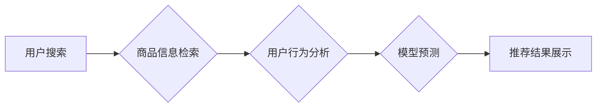

                 

## 电商搜索推荐中的AI大模型多任务联合学习技术

> 关键词：电商搜索推荐、AI大模型、多任务联合学习、深度学习、推荐系统、自然语言处理、用户行为分析

## 1. 背景介绍

在当今数据爆炸的时代，电商平台面临着海量商品和用户数据，如何精准推荐用户感兴趣的商品，提升用户体验和转化率成为关键挑战。传统的电商搜索推荐系统主要依赖于基于规则的算法和特征工程，但随着用户行为的复杂性和商品信息的丰富性不断增加，这些方法逐渐显得力不从心。

近年来，深度学习技术在自然语言处理、计算机视觉等领域取得了突破性进展，为电商搜索推荐带来了新的机遇。AI大模型，特别是Transformer模型，凭借其强大的语义理解和表示能力，在电商搜索推荐任务中展现出巨大的潜力。

多任务联合学习 (Multi-Task Learning, MTL) 作为一种先进的深度学习技术，通过联合训练多个相关任务，可以有效提升模型的泛化能力和性能。在电商搜索推荐场景中，MTL可以将搜索、推荐、点击预测等多个任务联合训练，从而更好地理解用户需求和商品特征，提供更精准的推荐结果。

## 2. 核心概念与联系

### 2.1  电商搜索推荐

电商搜索推荐是指根据用户的搜索历史、浏览记录、购买行为等信息，推荐用户可能感兴趣的商品。其目标是提高用户满意度、促进商品销售和提升平台盈利。

### 2.2  AI大模型

AI大模型是指在海量数据上训练的深度学习模型，具有强大的泛化能力和表示能力。常见的AI大模型包括BERT、GPT、T5等。

### 2.3  多任务联合学习

多任务联合学习 (MTL) 是一种深度学习技术，通过联合训练多个相关任务，可以提升模型的泛化能力和性能。MTL的优势在于：

* **共享知识:** 不同任务之间存在一定的知识共享，联合训练可以帮助模型学习更通用的特征表示。
* **数据增强:** 不同任务的数据可以相互补充，提升模型的训练数据量。
* **正则化效果:** 多任务联合学习可以起到正则化作用，防止模型过拟合。

**Mermaid 流程图**



## 3. 核心算法原理 & 具体操作步骤

### 3.1  算法原理概述

多任务联合学习的核心思想是将多个相关任务联合训练，共享模型参数，从而提升模型的整体性能。

在电商搜索推荐场景中，常见的MTL任务包括：

* **搜索结果排序:** 根据用户搜索词，对商品进行排序，展示最相关的商品。
* **推荐列表生成:** 根据用户的兴趣偏好，生成个性化的商品推荐列表。
* **点击预测:** 预测用户点击特定商品的概率。

这些任务之间存在一定的关联性，例如，搜索结果排序和推荐列表生成都依赖于对商品信息的理解，点击预测可以帮助优化搜索结果排序和推荐列表生成。

### 3.2  算法步骤详解

1. **数据预处理:** 收集用户搜索历史、浏览记录、购买行为等数据，并进行清洗、转换和特征工程。
2. **模型构建:** 选择合适的深度学习模型，例如Transformer模型，并设计多任务学习的架构。
3. **任务定义:** 将电商搜索推荐任务分解成多个子任务，例如搜索结果排序、推荐列表生成、点击预测等。
4. **损失函数设计:** 为每个子任务设计相应的损失函数，例如交叉熵损失函数、排名损失函数等。
5. **模型训练:** 使用联合训练的方式，将多个子任务的损失函数加权求和，并使用优化算法进行模型训练。
6. **模型评估:** 使用测试数据评估模型的性能，例如准确率、召回率、NDCG等指标。
7. **模型部署:** 将训练好的模型部署到线上环境，用于实时推荐。

### 3.3  算法优缺点

**优点:**

* 提升模型泛化能力和性能
* 提高数据利用率
* 简化模型训练过程

**缺点:**

* 需要设计合理的任务关联性和损失函数权重
* 训练时间可能较长
* 模型复杂度较高

### 3.4  算法应用领域

多任务联合学习技术广泛应用于电商搜索推荐、自然语言处理、计算机视觉等领域。

## 4. 数学模型和公式 & 详细讲解 & 举例说明

### 4.1  数学模型构建

假设我们有N个用户，M个商品，K个任务。每个用户对每个商品的交互行为可以用一个二元变量表示，例如点击行为，1表示点击，0表示未点击。

我们可以构建一个多任务学习模型，其输出为每个任务的预测结果，例如每个任务的预测概率。

### 4.2  公式推导过程

多任务学习模型的损失函数通常是多个子任务损失函数的加权求和。

$$
L = \sum_{i=1}^{K} \lambda_i L_i
$$

其中：

* $L$ 是多任务学习模型的总损失函数
* $K$ 是任务数量
* $\lambda_i$ 是第i个任务的权重
* $L_i$ 是第i个任务的损失函数

### 4.3  案例分析与讲解

例如，在电商搜索推荐场景中，我们可以将搜索结果排序、推荐列表生成、点击预测三个任务联合训练。

* 搜索结果排序任务的损失函数可以是排名损失函数，例如NDCG损失函数。
* 推荐列表生成任务的损失函数可以是交叉熵损失函数。
* 点击预测任务的损失函数也可以是交叉熵损失函数。

我们可以根据任务的重要性设置不同的权重，例如，搜索结果排序任务的权重可能比点击预测任务的权重更高。

## 5. 项目实践：代码实例和详细解释说明

### 5.1  开发环境搭建

* Python 3.7+
* TensorFlow 2.0+
* PyTorch 1.0+
* CUDA 10.0+

### 5.2  源代码详细实现

```python
import tensorflow as tf

# 定义多任务学习模型
class MultiTaskModel(tf.keras.Model):
    def __init__(self, num_users, num_items, embedding_dim):
        super(MultiTaskModel, self).__init__()
        self.user_embedding = tf.keras.layers.Embedding(num_users, embedding_dim)
        self.item_embedding = tf.keras.layers.Embedding(num_items, embedding_dim)
        # ... 其他模型层

    def call(self, user_ids, item_ids):
        user_embeddings = self.user_embedding(user_ids)
        item_embeddings = self.item_embedding(item_ids)
        # ... 模型计算过程
        # 输出多个任务的预测结果
        return outputs_1, outputs_2, outputs_3

# 定义损失函数
def multi_task_loss(outputs_1, outputs_2, outputs_3, labels_1, labels_2, labels_3):
    # 计算每个任务的损失
    loss_1 = tf.keras.losses.BinaryCrossentropy()(labels_1, outputs_1)
    loss_2 = tf.keras.losses.CategoricalCrossentropy()(labels_2, outputs_2)
    loss_3 = tf.keras.losses.MeanSquaredError()(labels_3, outputs_3)
    # 计算总损失
    return loss_1 + loss_2 + loss_3

# 训练模型
model = MultiTaskModel(num_users, num_items, embedding_dim)
optimizer = tf.keras.optimizers.Adam()
# ... 训练循环
```

### 5.3  代码解读与分析

* 代码定义了一个多任务学习模型，包含用户嵌入层、商品嵌入层以及其他模型层。
* 模型的`call`方法计算每个任务的预测结果。
* 定义了一个多任务损失函数，将每个任务的损失加权求和。
* 训练模型时，使用优化器更新模型参数，并使用多任务损失函数评估模型性能。

### 5.4  运行结果展示

* 通过训练和测试数据，评估模型的性能，例如搜索结果排序的NDCG、推荐列表生成的准确率、点击预测的AUC等指标。
* 可视化模型的训练过程和预测结果，例如训练损失曲线、预测结果分布等。

## 6. 实际应用场景

### 6.1  电商搜索推荐系统

* 提升搜索结果的准确性和相关性
* 生成更个性化的商品推荐列表
* 提高用户点击率和转化率

### 6.2  用户画像分析

* 构建更精准的用户画像，了解用户的兴趣偏好和消费习惯
* 为用户提供更个性化的服务和体验

### 6.3  商品推荐优化

* 优化商品的推荐策略，提高商品曝光率和销量
* 为商品进行精准的分类和标签化

### 6.4  未来应用展望

* 结合更多数据源，例如用户行为、商品属性、社会关系等，构建更全面的推荐模型。
* 利用强化学习技术，优化推荐策略，实现更智能化的推荐。
* 将多任务联合学习技术应用于其他电商场景，例如广告推荐、促销活动策划等。

## 7. 工具和资源推荐

### 7.1  学习资源推荐

* **书籍:**
    * Deep Learning by Ian Goodfellow, Yoshua Bengio, and Aaron Courville
    * Hands-On Machine Learning with Scikit-Learn, Keras & TensorFlow by Aurélien Géron
* **课程:**
    * Deep Learning Specialization by Andrew Ng (Coursera)
    * Fast.ai Practical Deep Learning for Coders

### 7.2  开发工具推荐

* **深度学习框架:** TensorFlow, PyTorch
* **数据处理工具:** Pandas, NumPy
* **云计算平台:** AWS, Azure, GCP

### 7.3  相关论文推荐

* Multi-Task Learning by Richard S. Sutton and Andrew G. Barto
* BERT: Pre-training of Deep Bidirectional Transformers for Language Understanding by Jacob Devlin et al.
* T5: Text-to-Text Transfer Transformer by Colin Raffel et al.

## 8. 总结：未来发展趋势与挑战

### 8.1  研究成果总结

多任务联合学习技术在电商搜索推荐领域取得了显著的成果，能够有效提升模型的性能和泛化能力。

### 8.2  未来发展趋势

* **模型架构创新:** 探索更有效的多任务学习模型架构，例如混合模型、联邦学习等。
* **数据增强:** 开发更有效的用户行为数据增强方法，提升模型训练效果。
* **个性化推荐:** 将多任务联合学习技术应用于更个性化的推荐场景，例如兴趣推荐、场景推荐等。

### 8.3  面临的挑战

* **任务关联性:** 如何设计合理的任务关联性和损失函数权重，是多任务学习的关键挑战。
* **数据稀疏性:** 电商数据往往存在稀疏性问题，如何有效利用稀疏数据，是需要解决的难题。
* **模型解释性:** 多任务学习模型的复杂性导致其解释性较差，如何提高模型的解释性，是未来研究方向之一。

### 8.4  研究展望

未来，多任务联合学习技术将在电商搜索推荐领域得到更广泛的应用，并不断朝着更智能化、个性化、高效的方向发展。


## 9. 附录：常见问题与解答

* **Q1: 多任务学习和迁移学习有什么区别？**

* **A1:** 多任务学习是指在同一个模型中联合训练多个相关任务，而迁移学习是指将预训练模型的知识迁移到新的任务中。

* **Q2: 多任务学习的训练时间是否比单任务学习更长？**

* **A2:** 多任务学习的训练时间通常比单任务学习更长，因为需要训练更多的参数。

* **Q3: 多任务学习的模型复杂度是否更高？**

* **A3:** 多任务学习的模型复杂度通常比单任务学习更高，因为需要包含多个任务的模型结构。


作者：禅与计算机程序设计艺术 / Zen and the Art of Computer Programming 
<end_of_turn>

