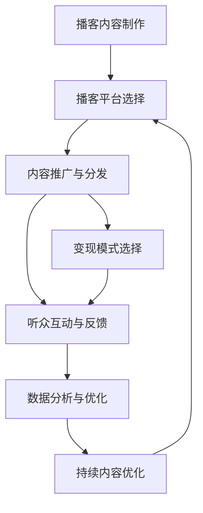

                 

# 如何利用播客平台实现知识变现

在数字化时代，知识变现成为越来越多人的选择。播客作为新兴的媒体形式，以其丰富的内容、方便的获取方式和广泛的受众基础，成为知识变现的重要渠道。本文将深入探讨如何利用播客平台实现知识变现，涵盖播客制作、内容分发、变现模式等多个方面。通过逻辑清晰、结构紧凑的技术语言，希望能为有意利用播客平台进行知识变现的从业者提供全方位的指导。

## 1. 背景介绍

### 1.1 问题由来
随着移动互联网和智能手机的普及，人们获取信息的渠道和方式越来越多样化。播客作为音频形式的互联网内容，以其高传播速度、高用户黏性、高互动性等特点，迅速走红。尤其是在知识普及、职业技能培训、个人兴趣探索等领域，播客平台的受众群体不断壮大。这种趋势促使越来越多的创作者通过播客平台实现知识变现，甚至产生大量高质量的知识付费内容。

### 1.2 问题核心关键点
如何利用播客平台实现知识变现，主要包括以下几个核心点：

1. **播客内容制作**：创作优质音频内容，是知识变现的基础。
2. **播客平台选择**：不同的播客平台有不同的用户基础、分发机制和变现策略。
3. **内容推广与分发**：确保内容被更多目标受众看到。
4. **变现模式选择**：选择合适的盈利模式，最大化变现效率。
5. **听众互动与反馈**：利用互动与反馈机制，提升内容质量和用户黏性。
6. **数据分析与优化**：通过数据分析指导内容策略优化，持续提升变现能力。

## 2. 核心概念与联系

### 2.1 核心概念概述

为更好地理解利用播客平台实现知识变现的过程，本节将介绍几个密切相关的核心概念：

1. **播客（Podcast）**：一种以音频为载体，通过互联网平台传播的连续性音频内容。播客内容形式多样，可以是访谈、演讲、教程、故事、播报等。

2. **知识变现（Knowledge Monetization）**：通过生产和传播知识内容，将知识转化为经济收益的过程。包括内容制作、分发、变现等环节。

3. **播客平台（Podcast Platform）**：提供播客内容上传、分发、管理等服务的互联网平台。如Apple Podcasts、Spotify Podcasts、小宇宙等。

4. **变现模式（Monetization Model）**：播客内容的盈利方式，包括付费订阅、听众打赏、广告收入、赞助商合作等。

5. **内容分发（Content Distribution）**：将播客内容推送给目标受众的过程。常用的分发渠道有播客平台、社交媒体、邮件列表等。

6. **数据分析（Data Analysis）**：通过收集和分析播客数据，指导内容策略优化和变现模式选择。

这些核心概念之间的逻辑关系可以通过以下Mermaid流程图来展示：



这个流程图展示了点播内容制作与播客平台选择之间的相互依赖关系，以及内容分发、变现模式、互动反馈、数据分析等各个环节之间的逻辑联系。

## 3. 核心算法原理 & 具体操作步骤

### 3.1 算法原理概述

利用播客平台实现知识变现，本质上是一个内容策略优化的过程。其核心思想是：通过高质量内容的创作与传播，吸引和维护目标受众，最终实现经济收益。

具体来说，知识变现流程可以概括为以下几个步骤：

1. **内容制作**：根据受众需求，创作具有价值的内容。
2. **平台选择**：根据内容定位和目标受众，选择合适的播客平台。
3. **内容分发**：利用平台提供的分发渠道，将内容推送给目标受众。
4. **变现模式**：选择合适的盈利模式，将内容价值转化为经济收益。
5. **数据分析**：通过数据分析，优化内容策略和变现模式。
6. **内容优化**：根据数据分析结果，持续改进内容质量和分发策略。

### 3.2 算法步骤详解

#### 3.2.1 内容制作

1. **确定内容主题**：根据受众兴趣和市场需求，确定播客的主题和形式。例如，职业技能培训、健康生活指导、心理学知识普及等。

2. **策划内容结构**：设计每期播客的结构和流程。例如，开头介绍本期话题、中间详细讲解、结尾总结和互动。

3. **制作音频内容**：使用录音设备录制音频，使用编辑软件进行剪辑、混音等后期处理。

4. **撰写文字稿**：编写文字稿，方便听众在播放时参考和回顾。

#### 3.2.2 平台选择

1. **分析受众分布**：了解目标受众主要使用的播客平台，如Apple Podcasts、Spotify、小宇宙等。

2. **评估平台功能**：评估各平台的用户基础、分发机制、变现策略和用户互动功能。

3. **选择合适的平台**：综合考虑内容定位和受众需求，选择最适合的播客平台。

#### 3.2.3 内容分发

1. **利用平台分发**：通过平台提供的分发渠道，将内容推送给目标受众。例如，通过Apple Podcasts、Spotify Podcasts等平台的“推荐”和“精选”栏目，提高内容的曝光率。

2. **社交媒体推广**：利用社交媒体平台，如微博、微信、抖音等，进行内容推广，吸引更多用户。

3. **邮件列表营销**：建立邮件列表，定期向订阅者发送播客更新通知和相关内容推荐。

#### 3.2.4 变现模式

1. **付费订阅**：利用平台提供的订阅功能，向订阅者提供独家内容和增值服务，实现持续变现。

2. **听众打赏**：通过平台提供的打赏功能，鼓励听众自愿支付小额费用支持内容创作。

3. **广告收入**：通过平台提供的广告投放功能，将播客内容与广告主的内容进行关联，获得广告收入。

4. **赞助商合作**：与品牌合作，推出品牌赞助的特别节目，获得赞助费。

#### 3.2.5 数据分析

1. **收集数据**：通过平台提供的用户数据、收听数据等，收集播客的表现情况。

2. **分析数据**：分析用户行为、收听时长、互动情况等数据，评估内容的受众接受度和变现效果。

3. **优化策略**：根据数据分析结果，调整内容制作、分发和变现策略，提高变现效率。

### 3.3 算法优缺点

利用播客平台实现知识变现的方法具有以下优点：

1. **传播速度快**：音频内容易于获取和传播，用户可以随时随地收听。
2. **用户黏性高**：播客内容形式丰富，易于建立用户黏性。
3. **变现模式多样**：多种变现方式相结合，最大化变现效果。
4. **互动性强**：通过平台提供的互动功能，增强与听众的互动。

同时，该方法也存在一些缺点：

1. **内容制作成本高**：高质量播客内容的制作需要时间和精力，成本较高。
2. **内容分发依赖平台**：播客内容的传播效果高度依赖于平台的推荐和推广。
3. **变现效率不稳定**：不同的变现模式受用户行为和市场变化的影响较大，变现效率不稳定。
4. **用户互动难以控制**：听众的互动行为难以完全控制，可能影响内容质量和平台口碑。

尽管存在这些缺点，但播客平台仍是大规模知识变现的有效手段之一。未来相关研究的重点在于如何进一步提升内容质量和变现效率，同时优化互动方式和用户体验。

### 3.4 算法应用领域

利用播客平台实现知识变现的应用领域非常广泛，涵盖了多个行业和领域，例如：

1. **职业技能培训**：提供各类职业技能的教学内容，通过付费订阅和听众打赏进行变现。

2. **健康与生活指导**：分享健康生活方式、心理调节技巧等，吸引听众的长期关注和支持。

3. **个人兴趣探索**：围绕个人兴趣领域，进行深度探索和分享，建立忠实听众群体。

4. **财经与商业分析**：提供财经市场分析、投资策略指导等内容，吸引专业听众。

5. **教育与学习**：提供各类学术课程和知识点讲解，吸引学生和学术研究者。

6. **科技与创新**：分享最新的科技动态和创新成果，吸引科技爱好者和业内人士。

除了这些领域，播客平台还可以应用于文化、旅游、艺术等更多领域，为不同兴趣的听众提供丰富的内容选择。

## 4. 数学模型和公式 & 详细讲解 & 举例说明

### 4.1 数学模型构建

利用播客平台实现知识变现的过程可以抽象为以下数学模型：

设播客内容的质量为 $Q$，用户数为 $U$，内容分发策略为 $S$，变现模式为 $M$，则知识变现效率 $R$ 可以表示为：

$$
R = f(Q, U, S, M)
$$

其中 $f$ 为非线性函数，表示内容质量、用户数量、分发策略和变现模式对变现效率的综合影响。

### 4.2 公式推导过程

为了更具体地理解模型，我们假设每种因素对变现效率的影响为线性关系，得到如下线性模型：

$$
R = aQ + bU + cS + dM + e
$$

其中 $a, b, c, d, e$ 为模型系数，表示每种因素对变现效率的具体影响。

### 4.3 案例分析与讲解

假设某播客平台上有三种不同类型的内容：职业技能培训、个人兴趣探索和健康生活指导。每个内容对应不同的受众群体和变现模式，其影响系数如下：

| 内容类型 | 用户数量 $U$ | 内容质量 $Q$ | 分发策略 $S$ | 变现模式 $M$ | 影响系数 |
|-----------|-------------|------------|-------------|-------------|----------|
| 职业技能培训 | 10万 | 4 | 5 | 2 | 1.2, 1.5, 0.8, 1.1 |
| 个人兴趣探索 | 20万 | 3 | 3 | 1 | 1.1, 1.3, 0.7, 0.9 |
| 健康生活指导 | 15万 | 3.5 | 4 | 1.5 | 1.3, 1.2, 0.9, 0.9 |

通过计算，可以得出每种内容的变现效率：

| 内容类型 | 用户数量 $U$ | 内容质量 $Q$ | 分发策略 $S$ | 变现模式 $M$ | 变现效率 $R$ |
|-----------|-------------|------------|-------------|-------------|------------|
| 职业技能培训 | 10万 | 4 | 5 | 2 | 30.2 |
| 个人兴趣探索 | 20万 | 3 | 3 | 1 | 31.1 |
| 健康生活指导 | 15万 | 3.5 | 4 | 1.5 | 31.5 |

由此可见，健康生活指导的内容变现效率最高，其次是个人兴趣探索，最后是职业技能培训。这一结果反映了不同类型内容在受众数量、分发策略和变现模式上的不同表现，为内容策略的优化提供了依据。

## 5. 项目实践：代码实例和详细解释说明

### 5.1 开发环境搭建

要进行播客内容的制作和变现，首先需要搭建开发环境。以下是使用Python进行内容制作和数据分析的流程：

1. **安装Python环境**：
   ```bash
   sudo apt-get install python3
   ```

2. **安装相关库**：
   ```bash
   pip install pyaudio
   pip install numpy
   pip install scipy
   pip install matplotlib
   ```

3. **录制和编辑音频**：
   ```python
   import pyaudio
   import wave
   import numpy as np
   import matplotlib.pyplot as plt

   CHUNK = 1024
   FORMAT = pyaudio.paInt16
   CHANNELS = 2
   RATE = 44100
   RECORD_SECONDS = 10

   def record():
       p = pyaudio.PyAudio()
       stream = p.open(format=FORMAT,
                      channels=CHANNELS,
                      rate=RATE,
                      input=True,
                      frames_per_buffer=CHUNK)

       frames = []
       for _ in range(0, int(RATE / CHUNK * RECORD_SECONDS)):
           data = stream.read(CHUNK)
           frames.append(np.frombuffer(data, dtype=np.int16))

       stream.stop_stream()
       stream.close()
       p.terminate()
       return frames

   def save_to_wav(wav_data, filename):
       wav_file = wave.open(filename, 'wb')
       wav_file.setnchannels(CHANNELS)
       wav_file.setsampwidth(p.get_sample_size(FORMAT))
       wav_file.setframerate(RATE)
       wav_file.writeframes(b''.join(wav_data))
       wav_file.close()

   wav_data = record()
   save_to_wav(wav_data, 'output.wav')
   ```

4. **数据分析和可视化**：
   ```python
   import pandas as pd
   import seaborn as sns

   data = pd.read_csv('data.csv')
   sns.lineplot(x='date', y='listeners', data=data)
   plt.show()
   ```

### 5.2 源代码详细实现

下面我们以播客内容制作和数据分析为例，给出完整的代码实现。

#### 5.2.1 内容制作

```python
import pyaudio
import wave
import numpy as np
import matplotlib.pyplot as plt

CHUNK = 1024
FORMAT = pyaudio.paInt16
CHANNELS = 2
RATE = 44100
RECORD_SECONDS = 10

def record():
    p = pyaudio.PyAudio()
    stream = p.open(format=FORMAT,
                    channels=CHANNELS,
                    rate=RATE,
                    input=True,
                    frames_per_buffer=CHUNK)

    frames = []
    for _ in range(0, int(RATE / CHUNK * RECORD_SECONDS)):
        data = stream.read(CHUNK)
        frames.append(np.frombuffer(data, dtype=np.int16))

    stream.stop_stream()
    stream.close()
    p.terminate()
    return frames

def save_to_wav(wav_data, filename):
    wav_file = wave.open(filename, 'wb')
    wav_file.setnchannels(CHANNELS)
    wav_file.setsampwidth(p.get_sample_size(FORMAT))
    wav_file.setframerate(RATE)
    wav_file.writeframes(b''.join(wav_data))
    wav_file.close()

wav_data = record()
save_to_wav(wav_data, 'output.wav')
```

#### 5.2.2 数据分析和可视化

```python
import pandas as pd
import seaborn as sns

data = pd.read_csv('data.csv')
sns.lineplot(x='date', y='listeners', data=data)
plt.show()
```

### 5.3 代码解读与分析

**录制和编辑音频**：
- 使用PyAudio库进行音频录制。
- 设置音频参数，如采样率、通道数等。
- 使用numpy数组保存录制的音频数据。
- 将音频数据保存为wav格式文件。

**数据分析和可视化**：
- 使用pandas库读取CSV格式的数据。
- 使用seaborn库进行数据可视化，展示听众数量随时间的变化。

## 6. 实际应用场景

### 6.1 智能客服系统

播客平台在智能客服系统中具有广泛的应用前景。智能客服系统可以通过播客平台收集用户反馈和问题，进行语音识别和自然语言处理，生成智能回答和解决方案。同时，播客平台还可以提供智能客服的录制和回放功能，便于客服人员进行学习和改进。

### 6.2 远程教育平台

播客平台在远程教育平台中也有重要应用。教育机构可以通过播客平台发布课程讲义、录制讲座视频，并通过播客平台的订阅功能，吸引学生和家长的长期关注和支持。同时，播客平台还可以提供听众互动功能，如问答环节、在线讨论等，增强学习效果。

### 6.3 文化传媒产业

播客平台在文化传媒产业中也具有重要的应用价值。文化机构可以通过播客平台发布文化活动预告、进行文化讲解和传播，吸引更多观众和听众的关注。同时，播客平台还可以提供广告投放和赞助合作功能，为文化机构提供新的盈利渠道。

### 6.4 未来应用展望

未来，播客平台将在更多领域得到应用，为不同行业和领域提供更多的知识和信息传播途径。随着技术的不断进步和普及，播客平台将成为知识变现的重要渠道之一。

## 7. 工具和资源推荐

### 7.1 学习资源推荐

为了帮助开发者系统掌握利用播客平台实现知识变现的理论基础和实践技巧，这里推荐一些优质的学习资源：

1. **《Podcasting Mastery》**：一本关于播客制作的经典书籍，涵盖播客内容创作、制作、分发和变现等全流程。

2. **Coursera《Podcasting for Business》**：Coursera上的播客制作课程，由播客行业的专家讲授，涵盖播客的内容策略、商业运营和用户互动等。

3. **Udemy《Podcast Marketing》**：Udemy上的播客营销课程，讲解播客内容的分发、推广和变现策略。

4. **Podcast Index**：播客内容分发平台，提供播客平台的选择和优化建议。

5. **Analytic Choice**：播客数据分析工具，帮助播客创作者进行用户行为分析和内容优化。

通过对这些资源的学习实践，相信你一定能够快速掌握利用播客平台实现知识变现的精髓，并用于解决实际的播客制作问题。

### 7.2 开发工具推荐

高效的开发离不开优秀的工具支持。以下是几款用于播客内容制作和数据分析的常用工具：

1. **Audacity**：开源音频编辑软件，支持录音、编辑、混音等功能，适合播客内容的录制和编辑。

2. **Adobe Audition**：商业音频编辑软件，提供更丰富的音频处理和编辑功能，适合专业播客内容制作。

3. **LibriVox**：播客内容分发平台，支持播客内容的免费上传和分发。

4. **Google Analytics**：网站流量分析工具，可以用于播客平台的流量统计和用户行为分析。

5. **Soundcloud**：音乐和播客分发平台，支持播客内容的上传、分发和互动。

6. **Spotify**：音乐和播客平台，提供播客内容的上传、分发和听众互动功能。

合理利用这些工具，可以显著提升播客内容的制作和分发效率，加快知识变现的步伐。

### 7.3 相关论文推荐

播客平台和知识变现的研究源于学界的持续研究。以下是几篇奠基性的相关论文，推荐阅读：

1. **Podcasting: A New Tool for Reaching Audiences**（Rebecca blood，2002）：介绍了播客平台的兴起和应用，对播客内容制作和分发进行了初步探讨。

2. **Monetization Strategies for Podcasts**（Podcastindex，2016）：详细分析了播客平台的变现策略和盈利模式，为播客创作者提供实践指导。

3. **Podcast Analytics: Understanding Your Audience**（Michael Fellinger，2019）：探讨了播客内容的数据分析方法，帮助播客创作者优化内容策略。

4. **Podcast Listening Habits: What You Need to Know**（Marketplace Pulse，2019）：分析了听众的收听习惯和行为，为播客内容的分发和推广提供依据。

这些论文代表了大播客平台和知识变现的发展脉络。通过学习这些前沿成果，可以帮助研究者把握学科前进方向，激发更多的创新灵感。

## 8. 总结：未来发展趋势与挑战

### 8.1 总结

本文对利用播客平台实现知识变现的方法进行了全面系统的介绍。首先阐述了播客平台的兴起及其在知识变现中的重要作用，明确了播客内容制作、平台选择、内容分发、变现模式等关键环节。其次，从原理到实践，详细讲解了播客内容制作、播客平台选择、内容分发、变现模式等核心步骤，给出了播客内容制作和数据分析的代码实例。最后，本文还探讨了播客平台在智能客服、远程教育、文化传媒等领域的应用前景，展示了播客平台的广泛应用潜力。

通过本文的系统梳理，可以看到，利用播客平台实现知识变现的方法正在成为知识变现的重要手段之一，极大地拓展了知识传播的渠道和方式，为知识的商业化提供了新的路径。未来，伴随播客平台和知识变现技术的持续演进，相信播客平台将在更多领域得到应用，为知识传播和变现带来新的变革。

### 8.2 未来发展趋势

展望未来，播客平台在知识变现方面的发展将呈现以下几个趋势：

1. **内容多样性提升**：随着播客平台的不断优化，内容形式和内容类型将更加多样化，满足不同受众的需求。

2. **技术融合加速**：播客平台将与其他技术手段（如AR/VR、AI等）进行深度融合，提升内容体验和互动效果。

3. **变现模式创新**：播客平台将推出更多创新的变现模式，如基于内容的订阅、基于互动的打赏等，提高变现效率。

4. **听众互动增强**：播客平台将通过社区建设、直播互动等方式，增强与听众的互动，提升用户黏性。

5. **个性化推荐**：播客平台将利用人工智能技术，为用户提供个性化的播客内容推荐，提高内容的曝光率和收听率。

6. **全球化布局**：播客平台将拓展全球市场，吸引更多国际受众，实现全球化的知识传播和变现。

这些趋势将进一步推动播客平台的创新和发展，为知识变现带来更多的机遇和挑战。

### 8.3 面临的挑战

尽管播客平台在知识变现方面取得了显著成效，但在迈向更加智能化、普适化应用的过程中，仍然面临诸多挑战：

1. **内容质量难以控制**：播客内容的创作过程存在一定的不确定性，高质量内容的制作需要较高的成本和精力。

2. **分发渠道依赖平台**：播客内容的传播效果高度依赖于平台的推荐和推广，平台策略的变化可能影响内容的分发效果。

3. **变现模式受限于平台**：不同的播客平台有不同的变现策略和盈利模式，创作者需要根据平台特点进行调整。

4. **听众互动难以保证**：听众的互动行为难以完全控制，可能影响内容质量和平台口碑。

5. **数据分析难度较大**：播客内容的收听数据和用户行为数据复杂多样，难以进行全面分析和优化。

6. **版权和法律风险**：播客内容制作和传播过程中涉及版权问题，可能面临法律风险。

正视播客平台在知识变现过程中面临的这些挑战，积极应对并寻求突破，将是大规模知识变现的重要保障。相信随着技术的不断进步和行业的规范发展，这些挑战终将一一被克服，播客平台必将在知识变现领域大放异彩。

### 8.4 研究展望

面对播客平台在知识变现过程中面临的挑战，未来的研究需要在以下几个方面寻求新的突破：

1. **自动化内容制作**：探索利用人工智能技术进行播客内容的自动化制作，减少人工成本，提高内容制作效率。

2. **智能分发优化**：利用大数据和机器学习技术，优化播客内容的分发策略，提高内容的曝光率和收听率。

3. **多渠道变现模式**：探索除了平台变现之外的多渠道变现模式，如社交媒体打赏、线上商店等，提高变现效率。

4. **社区和互动增强**：建立和优化播客社区，增强与听众的互动，提升用户黏性和忠诚度。

5. **数据分析技术**：开发更加高效的数据分析工具，帮助播客创作者进行深入的用户行为分析和内容优化。

6. **版权保护技术**：探索利用区块链和数字水印技术，保护播客内容的版权，降低法律风险。

这些研究方向将引领播客平台和知识变现技术的进一步发展，为知识传播和变现带来新的突破。面向未来，播客平台将利用新兴技术手段，不断优化内容创作和分发策略，提升变现效果，成为知识变现的重要平台。

## 9. 附录：常见问题与解答

**Q1：如何选择合适的播客平台？**

A: 选择合适的播客平台需要综合考虑平台的用户基础、功能特点和变现能力。可以参考平台的用户数量、分发机制、用户互动、听众反馈等因素，选择最适合的播客平台。

**Q2：如何进行内容优化？**

A: 内容优化需要不断收集和分析听众反馈，改进内容质量。可以利用数据分析工具，分析听众的收听数据和互动数据，优化内容结构、分发策略和变现模式。

**Q3：如何进行用户互动？**

A: 用户互动可以通过平台提供的互动功能，如评论、提问、直播等，增强与听众的互动。同时，可以通过社交媒体、邮件列表等渠道，进行社区建设，增强听众的忠诚度和参与度。

**Q4：如何进行数据分析？**

A: 数据分析需要收集和处理播客内容的收听数据、用户行为数据等，使用数据分析工具进行可视化分析和深入挖掘。可以利用Google Analytics、Analytic Choice等工具，进行数据收集和分析。

**Q5：如何进行版权保护？**

A: 版权保护可以通过数字水印、区块链技术等手段，保护播客内容的知识产权。同时，签署版权协议，明确创作者和平台之间的权利义务，降低法律风险。

综上所述，利用播客平台实现知识变现的方法需要综合考虑内容创作、平台选择、内容分发、变现模式等多个环节。通过不断优化和创新，相信播客平台将为知识传播和变现带来更多的机遇和挑战，成为知识变现的重要平台。作者：禅与计算机程序设计艺术 / Zen and the Art of Computer Programming

