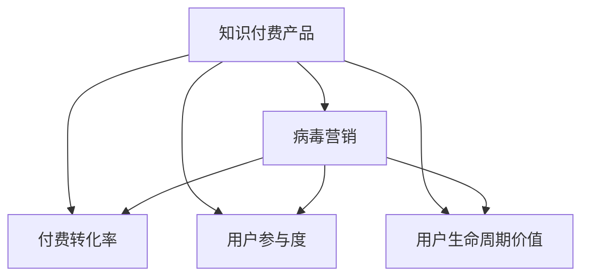

                 

# 如何利用病毒营销推广知识付费产品

## 1. 背景介绍

### 1.1 问题由来

随着知识经济时代的到来，知识付费已经成为一种重要消费方式。用户对专业知识的渴求日益增长，知识付费产品市场规模不断扩大。然而，知识付费产品的推广一直存在困难。相比于传统的付费广告，知识付费产品的转化率较低，难以大规模传播。

为了应对这一挑战，病毒营销（Viral Marketing）被引入知识付费产品的推广中。病毒营销利用口碑传播和社交网络的力量，通过引发受众的情感共鸣，实现快速扩散。这种营销模式以极低的成本，快速吸引大量用户关注，提升产品知名度和转化率。

## 2. 核心概念与联系

### 2.1 核心概念概述

为更好地理解病毒营销在知识付费产品推广中的应用，本节将介绍几个核心概念：

- 知识付费产品（Knowledge-Pay-to-Access, KPTA）：基于专业知识或技能进行收费的在线产品，如在线课程、电子书、视频讲座等。
- 病毒营销（Viral Marketing）：一种利用社交网络，通过受众情感共鸣和口碑传播，实现信息快速扩散的营销模式。
- 付费转化率（Conversion Rate）：用户购买知识付费产品的比率，是衡量推广效果的关键指标。
- 用户参与度（User Engagement）：用户对知识付费产品的互动程度，如观看视频、评论、分享等。
- 用户生命周期价值（Customer Lifetime Value, CLV）：用户在购买和使用知识付费产品过程中的总价值，包括直接购买费用和间接附加值。

这些核心概念之间的逻辑关系可以通过以下Mermaid流程图来展示：



这个流程图展示出知识付费产品、病毒营销以及与之相关的核心指标之间的关系：

1. 知识付费产品通过病毒营销进行推广，能够快速吸引用户关注，提高付费转化率。
2. 病毒营销通过用户参与度和情感共鸣，进一步提升用户生命周期价值。
3. 用户参与度和生命周期价值，是衡量知识付费产品推广效果的最终指标。

## 3. 核心算法原理 & 具体操作步骤
### 3.1 算法原理概述

病毒营销的核心在于利用社交网络，通过情感共鸣和口碑传播，实现信息的高效扩散。其原理主要包括以下几个方面：

1. **情感共鸣**：病毒营销通过触动用户的情感，引发其共鸣，从而激发其主动传播的意愿。
2. **口碑传播**：病毒营销依靠用户的社交网络，通过正面评价和推荐，实现信息传递。
3. **网络效应**：病毒营销利用网络效应，通过用户数量的积累，放大传播效果。

在知识付费产品的推广中，病毒营销的目标是通过情感共鸣和口碑传播，提高产品的付费转化率、用户参与度和生命周期价值。

### 3.2 算法步骤详解

病毒营销在知识付费产品推广中的应用，可以包括以下几个关键步骤：

**Step 1: 选择目标受众**

首先，需要确定目标受众。病毒营销强调受众的情感共鸣和主动传播，因此选择那些对产品内容有高度兴趣和需求的潜在用户作为目标受众至关重要。

**Step 2: 设计情感共鸣点**

根据目标受众的兴趣和需求，设计情感共鸣点。情感共鸣点可以是内容本身、价值感、社会地位等，需要精准定位，引发受众的强烈共鸣。

**Step 3: 内容创意与设计**

制作引人入胜的病毒内容，如搞笑短视频、感人动画等，通过创意和故事性吸引用户关注。内容需要符合受众的情感共鸣点，同时具备病毒性特征，易于在社交网络上传播。

**Step 4: 社交媒体营销**

将病毒内容发布到社交媒体平台，如微博、微信、抖音等，利用平台的传播特性，实现快速扩散。社交媒体的互动性、即时性和社交性，为病毒营销提供了良好的传播土壤。

**Step 5: 激励机制设计**

设计激励机制，鼓励用户主动传播。如通过抽奖活动、优惠券等，给予用户转发内容的奖励，激发其积极参与。

**Step 6: 数据分析与优化**

对病毒营销的效果进行实时数据分析，如点击率、转发率、付费转化率等，持续优化内容和推广策略，提升效果。

### 3.3 算法优缺点

病毒营销在知识付费产品推广中具有以下优点：

1. **低成本高效率**：病毒营销的传播主要依赖用户的情感共鸣和口碑传播，成本较低，传播效率较高。
2. **覆盖面广**：病毒营销利用社交网络，覆盖面广，可以迅速吸引大量用户关注。
3. **提升用户参与度**：通过情感共鸣和激励机制，病毒营销能够显著提升用户参与度，增加用户粘性。
4. **增强品牌认知**：病毒营销有助于品牌认知度的提升，用户通过情感共鸣建立品牌忠诚度。

然而，病毒营销也存在一些缺点：

1. **控制难度高**：病毒营销的传播具有随机性，难以完全控制其传播路径和效果。
2. **风险较大**：病毒营销依赖用户的情感共鸣和口碑传播，容易受到受众情绪和舆情的影响。
3. **质量参差不齐**：病毒营销的内容质量参差不齐，存在部分劣质内容影响品牌形象。
4. **持续性差**：病毒营销的传播效果难以持久，容易产生热炒冷场的现象。

### 3.4 算法应用领域

病毒营销在知识付费产品的推广中，已经被广泛应用于多个领域：

1. **在线教育**：通过制作教育类短视频、直播课程预告等，吸引用户关注和参与，提高课程的付费转化率。
2. **在线阅读**：通过情感共鸣点设计，吸引用户参与在线阅读活动，提升电子书和文章的订阅率。
3. **在线写作**：通过病毒式传播和激励机制，鼓励用户参与写作和投稿，提升内容质量。
4. **专业培训**：通过制作专业培训视频和案例分享，吸引业内人士关注和传播，提高培训课程的报名率。
5. **企业培训**：通过病毒式传播和情感共鸣，提高企业培训课程的参与度和满意度。

## 4. 数学模型和公式 & 详细讲解 & 举例说明（备注：数学公式请使用latex格式，latex嵌入文中独立段落使用 $$，段落内使用 $)
### 4.1 数学模型构建

病毒营销的传播效果可以通过以下数学模型进行建模：

设知识付费产品推广的初始受众数量为 $N_0$，病毒传播率为 $r$，则经过 $t$ 轮传播后，受众数量 $N_t$ 可以表示为：

$$
N_t = N_0(1+r)^t
$$

其中，$r$ 表示病毒传播率，$t$ 表示传播轮次。

### 4.2 公式推导过程

病毒传播率的计算可以通过以下公式推导：

$$
r = \frac{C}{C+K}
$$

其中，$C$ 表示病毒内容的传播成本，$K$ 表示病毒内容本身的传播效果（如创意、趣味性等）。

### 4.3 案例分析与讲解

假设一个在线教育课程推广的初始受众为 $N_0=1000$，病毒传播率为 $r=0.2$。经过5轮传播后，受众数量 $N_5$ 为：

$$
N_5 = 1000(1+0.2)^5 = 1600
$$

这表示经过5轮传播后，受众数量将从1000增长到1600。

## 5. 项目实践：代码实例和详细解释说明
### 5.1 开发环境搭建

在进行病毒营销实践前，我们需要准备好开发环境。以下是使用Python进行病毒营销的开发环境配置流程：

1. 安装Anaconda：从官网下载并安装Anaconda，用于创建独立的Python环境。

2. 创建并激活虚拟环境：
```bash
conda create -n viral-marketing python=3.8 
conda activate viral-marketing
```

3. 安装相关库：
```bash
pip install matplotlib pandas numpy scikit-learn jupyter notebook
```

4. 安装社交媒体API：
```bash
pip install python-twitter # 安装Twitter API
pip install python-youtube # 安装YouTube API
pip install python-facebook # 安装Facebook API
```

完成上述步骤后，即可在`viral-marketing-env`环境中开始病毒营销实践。

### 5.2 源代码详细实现

我们以下载和分享在线教育视频为例，展示病毒营销的代码实现。

```python
import tweepy
import pandas as pd
import matplotlib.pyplot as plt

# 认证Twitter API
auth = tweepy.OAuthHandler('CONSUMER_KEY', 'CONSUMER_SECRET')
auth.set_access_token('ACCESS_TOKEN', 'ACCESS_TOKEN_SECRET')
api = tweepy.API(auth)

# 发布推文
def tweet(text):
    api.update_status(text)

# 获取推文数据
def get_tweet_data(username):
    tweets = api.user_timeline(screen_name=username, count=100)
    tweet_data = []
    for tweet in tweets:
        tweet_data.append(tweet.text)
    return tweet_data

# 分析推文数据
def analyze_data(tweet_data):
    word_count = {}
    for tweet in tweet_data:
        words = tweet.split()
        for word in words:
            if word in word_count:
                word_count[word] += 1
            else:
                word_count[word] = 1
    return word_count

# 主函数
def main():
    username = 'edx_khanacademy'
    tweet_data = get_tweet_data(username)
    word_count = analyze_data(tweet_data)
    
    # 绘制词频分布图
    plt.bar(word_count.keys(), word_count.values())
    plt.xlabel('Words')
    plt.ylabel('Frequency')
    plt.title('Word Frequency in Tweets')
    plt.show()

if __name__ == '__main__':
    main()
```

以上代码实现了以下功能：

- 认证Twitter API，并发布推文。
- 获取指定用户的推文数据，并进行分析。
- 绘制词频分布图，展示推文中出现频率最高的词汇。

### 5.3 代码解读与分析

让我们再详细解读一下关键代码的实现细节：

**tweepy库**：
- 用于与Twitter API进行交互，实现数据的获取和发布。

**tweet和get_tweet_data函数**：
- `tweet`函数用于发布推文，`get_tweet_data`函数用于获取指定用户（如edx_khanacademy）的推文数据。

**analyze_data函数**：
- `analyze_data`函数通过拆分推文文本，统计单词出现的频率，返回一个词频字典。

**主函数**：
- 获取edx_khanacademy用户的推文数据，并绘制词频分布图，展示推文中出现频率最高的词汇。

通过这些代码，可以初步实现病毒营销的推文发布和数据分析。实际应用中，还需要进一步优化和扩展，如加入激励机制、社交网络分析等，以实现更全面的病毒营销效果。

## 6. 实际应用场景
### 6.1 在线教育

在线教育是病毒营销的主要应用场景之一。通过制作教育类短视频、直播课程预告等，吸引用户关注和参与，提高课程的付费转化率。

在技术实现上，可以制作具有趣味性和知识性的短视频，利用社交媒体的传播特性，迅速扩散。同时，通过抽奖活动、优惠券等激励机制，鼓励用户主动分享和参与，进一步提升转化率。

### 6.2 在线阅读

在线阅读同样可以利用病毒营销进行推广。通过情感共鸣点设计，吸引用户参与在线阅读活动，提升电子书和文章的订阅率。

在技术实现上，可以制作与阅读内容相关的短视频、电子书摘要等，通过社交媒体平台进行传播。同时，通过社交网络分析工具，识别用户的阅读兴趣和需求，精准推送相关内容，提升用户参与度和满意度。

### 6.3 在线写作

在线写作平台可以通过病毒营销，鼓励用户参与写作和投稿，提升内容质量。

在技术实现上，可以制作写作征文活动、投稿奖励机制等，吸引用户参与。同时，通过社交网络分析，识别潜在投稿作者，精准推送写作活动信息，提高投稿质量和活跃度。

### 6.4 专业培训

专业培训课程可以通过病毒营销，提高课程的报名率和参与度。

在技术实现上，可以制作培训课程预告视频、案例分享等，通过社交媒体平台进行传播。同时，通过激励机制，鼓励用户主动分享和推荐课程，提升课程的曝光率和报名率。

### 6.5 企业培训

企业培训课程可以通过病毒营销，提高培训课程的参与度和满意度。

在技术实现上，可以制作企业培训视频、成功案例分享等，通过企业内部的社交网络进行传播。同时，通过激励机制，鼓励员工主动分享和推荐培训课程，提升培训课程的参与度和效果。

## 7. 工具和资源推荐
### 7.1 学习资源推荐

为了帮助开发者系统掌握病毒营销的理论基础和实践技巧，这里推荐一些优质的学习资源：

1. 《社交媒体营销：理论与实践》系列博文：由社交媒体专家撰写，详细讲解了社交媒体营销的原理和策略。

2. 《病毒营销：如何制造社交网络病毒》书籍：详细介绍了病毒营销的原理、策略和案例，适合深入学习和实践。

3. 《自然语言处理：理论、算法与应用》课程：由斯坦福大学开设的NLP课程，有Lecture视频和配套作业，适合深入理解NLP技术在病毒营销中的应用。

4. Coursera《社交媒体与品牌》课程：由Coursera平台提供，讲解了社交媒体营销的最新趋势和实践技巧。

5. LinkedIn Learning《社交媒体营销策略》课程：由LinkedIn平台提供，适合初学者掌握社交媒体营销的基本技能。

通过对这些资源的学习实践，相信你一定能够快速掌握病毒营销的精髓，并用于解决实际的NLP问题。

### 7.2 开发工具推荐

高效的开发离不开优秀的工具支持。以下是几款用于病毒营销开发的常用工具：

1. Python：基于Python的开源编程语言，适合数据处理和算法开发。

2. Anaconda：Python的集成开发环境，方便快速搭建虚拟环境和安装库。

3. Tweepy：Python的Twitter API库，用于与Twitter进行数据交互。

4. YouTube API：Python的YouTube API库，用于与YouTube进行数据交互。

5. Facebook API：Python的Facebook API库，用于与Facebook进行数据交互。

6. Matplotlib：Python的绘图库，用于可视化数据分析结果。

7. Jupyter Notebook：Python的交互式开发环境，方便代码调试和共享。

合理利用这些工具，可以显著提升病毒营销任务的开发效率，加快创新迭代的步伐。

### 7.3 相关论文推荐

病毒营销在NLP领域的研究已经取得了显著成果，以下是几篇奠基性的相关论文，推荐阅读：

1. Viral Marketing: A Contagion Model for Predicting Sales: 提出病毒传播模型，用于预测商品销售量。

2. Viral Marketing with Models and Experiments: 提出病毒营销模型，用于优化营销策略和评估效果。

3. Viral Marketing: An Empirical Study of Social Media Marketing: 通过实证研究，分析社交媒体对病毒营销的影响。

4. Viral Marketing in Social Media: 探讨社交媒体平台对病毒营销传播的影响。

5. Viral Marketing with Sentiment Analysis: 通过情感分析，提高病毒营销的传播效果。

这些论文代表了病毒营销研究的前沿进展，为后续实践提供了重要参考。

## 8. 总结：未来发展趋势与挑战

### 8.1 总结

本文对病毒营销在知识付费产品推广中的应用进行了全面系统的介绍。首先阐述了病毒营销的原理和步骤，明确了其推广知识付费产品的独特价值。其次，从原理到实践，详细讲解了病毒营销的数学模型和操作步骤，给出了病毒营销任务开发的完整代码实例。同时，本文还广泛探讨了病毒营销在多个行业领域的应用前景，展示了其广泛的应用潜力。此外，本文精选了病毒营销技术的各类学习资源，力求为读者提供全方位的技术指引。

通过本文的系统梳理，可以看到，病毒营销在知识付费产品推广中具有巨大的应用前景。利用社交网络的传播特性，通过情感共鸣和口碑传播，可以极大地提升产品的知名度和转化率。未来，伴随病毒营销技术的不断发展，相信知识付费产品将迎来更加广阔的发展空间。

### 8.2 未来发展趋势

展望未来，病毒营销技术将呈现以下几个发展趋势：

1. **数据驱动**：病毒营销将更多地依赖数据驱动，通过社交网络分析和用户行为数据，精准定位目标受众，实现更高效的传播。

2. **内容多样化**：病毒营销将更加注重内容的多样性，通过多样化、多形式的内容创作，吸引更多用户的关注和参与。

3. **互动性强**：病毒营销将更加注重互动性，通过用户互动和反馈，不断优化传播策略，提高用户参与度和满意度。

4. **算法优化**：病毒营销将引入更多先进算法，如自然语言处理、机器学习等，提升病毒传播的效率和精准度。

5. **跨平台融合**：病毒营销将更加注重跨平台融合，通过多平台传播，实现更大范围的覆盖和传播。

6. **情感共鸣强化**：病毒营销将更加注重情感共鸣的强化，通过触动人心的内容，引发用户的共鸣和传播。

以上趋势凸显了病毒营销技术的广阔前景。这些方向的探索发展，必将进一步提升知识付费产品的推广效果，为NLP技术在垂直行业的应用带来新的突破。

### 8.3 面临的挑战

尽管病毒营销在知识付费产品推广中已经取得了显著成效，但在推广过程中仍然面临诸多挑战：

1. **受众多样性**：目标受众的多样性导致病毒营销策略难以统一，需要针对不同受众制定个性化方案。

2. **内容质量要求高**：病毒营销的内容质量要求高，需要精心设计和制作，避免劣质内容影响品牌形象。

3. **传播路径控制难**：病毒营销的传播路径具有随机性，难以完全控制其传播效果，容易出现热炒冷场的现象。

4. **激励机制复杂**：病毒营销的激励机制设计复杂，需要平衡利益和道德，避免误导用户。

5. **数据隐私问题**：病毒营销的数据收集和分析涉及用户隐私，需要严格遵守相关法律法规，保护用户隐私。

6. **持续性难以保持**：病毒营销的效果难以持续保持，需要不断创新和优化，以应对受众变化和市场竞争。

这些挑战需要业内各方共同努力，通过不断优化和创新，才能实现病毒营销的长期可持续发展。

### 8.4 研究展望

面对病毒营销面临的种种挑战，未来的研究需要在以下几个方面寻求新的突破：

1. **多模态融合**：将文本、视频、音频等多模态信息融合，提升病毒营销内容的丰富性和吸引力。

2. **个性化传播**：根据用户的兴趣和行为数据，实现个性化传播，提高病毒营销的效果。

3. **情感共鸣分析**：通过情感分析技术，识别用户的情感共鸣点，提升病毒营销的内容精准度。

4. **社交网络分析**：利用社交网络分析工具，深入理解社交网络结构，优化病毒传播路径。

5. **动态激励机制**：设计动态激励机制，根据用户行为实时调整奖励策略，保持用户持续参与。

6. **隐私保护技术**：引入隐私保护技术，保护用户数据隐私，增强用户信任。

这些研究方向的探索，必将引领病毒营销技术迈向更高的台阶，为构建更加高效、可持续的传播渠道提供新思路。

## 9. 附录：常见问题与解答

**Q1: 病毒营销在知识付费产品推广中有哪些优势？**

A: 病毒营销在知识付费产品推广中的优势包括：
1. **低成本高效率**：通过社交网络传播，病毒营销成本较低，传播效率较高。
2. **覆盖面广**：利用社交网络，病毒营销可以迅速吸引大量用户关注。
3. **提升用户参与度**：通过情感共鸣和激励机制，病毒营销能够显著提升用户参与度和满意度。
4. **增强品牌认知**：病毒营销有助于品牌认知度的提升，用户通过情感共鸣建立品牌忠诚度。

**Q2: 病毒营销的传播路径如何控制？**

A: 病毒营销的传播路径具有随机性，难以完全控制。但可以通过以下方法进行优化：
1. **内容质量提升**：制作高质量的内容，增加用户主动传播的意愿。
2. **社交网络分析**：利用社交网络分析工具，识别潜在传播路径。
3. **激励机制设计**：设计合理的激励机制，引导用户主动传播。
4. **多样化传播渠道**：通过多渠道传播，增强传播路径的控制力。

**Q3: 病毒营销中激励机制的设计有哪些建议？**

A: 病毒营销中激励机制的设计建议包括：
1. **多样性**：设计多样化的激励形式，如抽奖活动、优惠券、免费试用等。
2. **公平性**：确保激励机制公平透明，增强用户信任。
3. **即时性**：设计即时反馈的激励机制，增强用户参与感。
4. **长期性**：设计长期激励机制，保持用户持续参与。

**Q4: 病毒营销中如何保护用户隐私？**

A: 病毒营销中保护用户隐私的措施包括：
1. **数据匿名化**：对用户数据进行匿名化处理，保护用户隐私。
2. **合规使用**：严格遵守相关法律法规，确保用户数据的使用合规。
3. **透明度**：公开透明地告知用户数据使用情况，增强用户信任。
4. **安全保护**：采取安全保护措施，防止数据泄露和滥用。

这些建议可以帮助病毒营销更好地保护用户隐私，增强用户信任和满意度。

**Q5: 病毒营销在知识付费产品推广中需要注意哪些问题？**

A: 病毒营销在知识付费产品推广中需要注意的问题包括：
1. **受众多样性**：目标受众的多样性导致病毒营销策略难以统一，需要针对不同受众制定个性化方案。
2. **内容质量要求高**：病毒营销的内容质量要求高，需要精心设计和制作，避免劣质内容影响品牌形象。
3. **传播路径控制难**：病毒营销的传播路径具有随机性，难以完全控制其传播效果，容易出现热炒冷场的现象。
4. **激励机制复杂**：病毒营销的激励机制设计复杂，需要平衡利益和道德，避免误导用户。
5. **数据隐私问题**：病毒营销的数据收集和分析涉及用户隐私，需要严格遵守相关法律法规，保护用户隐私。
6. **持续性难以保持**：病毒营销的效果难以持续保持，需要不断创新和优化，以应对受众变化和市场竞争。

合理解决这些问题，将有助于病毒营销在知识付费产品推广中发挥更大的作用。

---

作者：禅与计算机程序设计艺术 / Zen and the Art of Computer Programming

