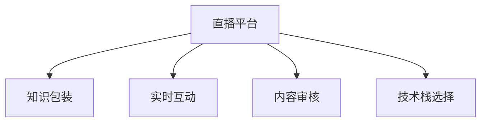

                 

# 如何利用直播平台进行知识包装

## 1. 背景介绍

### 1.1 问题由来

在信息爆炸的时代，知识传递的方式不断演进。从传统的书籍、期刊到博客、论坛，再到社交媒体、视频平台，人们获取知识的方式越来越多样化、便捷化。然而，碎片化的信息让知识难以系统化、深入化，受众难以掌握其核心价值。直播平台作为一种新兴的知识传递方式，以其实时性、互动性、沉浸式等特点，成为了知识包装和传播的重要载体。

### 1.2 问题核心关键点

直播平台进行知识包装的核心关键点包括：

- **内容优化**：如何精炼、系统化直播内容，使其更易于理解和记忆。
- **互动设计**：如何设计互动环节，增强观众的参与感和学习效果。
- **技术支持**：直播平台需要提供哪些技术支持，以保障直播质量和观众体验。
- **效果评估**：如何评估知识包装的效果，持续改进直播内容和互动设计。

## 2. 核心概念与联系

### 2.1 核心概念概述

为更好地理解直播平台知识包装的方法，本节将介绍几个密切相关的核心概念：

- **直播平台**：基于互联网技术的直播服务，通过网络视频流媒体方式实时传输内容。常用的直播平台包括YouTube、Bilibili、Twitch等。
- **知识包装**：将复杂、抽象的知识，以易于理解、便于记忆的形式呈现，如故事化、图表化、图像化等。
- **实时互动**：利用即时通讯和互动工具，在直播过程中与观众进行交流，解答疑问，提高参与感。
- **内容审核**：对直播内容进行筛选、过滤，防止有害信息的传播，确保内容的健康性。
- **技术栈选择**：根据需求选择合适的技术栈，如流媒体协议、视频编码、数据存储等。

这些核心概念之间的逻辑关系可以通过以下Mermaid流程图来展示：



这个流程图展示了他直播平台知识包装的核心概念及其之间的关系：

1. 直播平台提供基础服务。
2. 知识包装是直播内容的核心，需经过精心设计和优化。
3. 实时互动是提升观众参与感和学习效果的关键环节。
4. 内容审核是保障直播内容健康性的重要措施。
5. 技术栈选择影响直播平台的稳定性和用户体验。

## 3. 核心算法原理 & 具体操作步骤
### 3.1 算法原理概述

直播平台知识包装的本质，是通过精心设计的直播内容和互动环节，将复杂知识以易于理解、便于记忆的形式传递给观众。其核心思想是：

1. **内容优化**：将知识拆分为易于消化的小块，通过故事化、图表化、图像化等手段，降低学习难度。
2. **互动设计**：通过即时反馈、问答互动、小组讨论等方式，增强观众的参与感，提高学习效果。
3. **技术支持**：利用流媒体技术、数据可视化技术、互动技术等，保障直播质量和观众体验。

### 3.2 算法步骤详解

直播平台知识包装的一般步骤包括：

1. **内容策划与设计**：确定直播主题，设计知识包装策略，将复杂知识拆分为易于理解的小块，采用故事化、图表化、图像化等手段。
2. **互动环节设计**：设计实时互动环节，如即时反馈、问答、小组讨论等，增强观众参与感。
3. **技术环境搭建**：选择合适的流媒体协议、视频编码格式、数据存储方式等，保障直播质量。
4. **内容审核与发布**：对直播内容进行筛选、过滤，防止有害信息传播，确保内容的健康性。
5. **效果评估与优化**：通过反馈收集、用户调查等方式，评估知识包装效果，持续改进直播内容和互动设计。

### 3.3 算法优缺点

直播平台知识包装方法具有以下优点：

- **实时互动**：实时反馈和互动环节，增强观众的参与感和学习效果。
- **灵活性高**：内容设计和互动环节可以根据观众反馈进行实时调整，更符合观众需求。
- **传播广**：利用互联网平台，能够快速传播知识，覆盖更多受众。

然而，该方法也存在一定的局限性：

- **技术门槛高**：需要专业技术人员搭建和维护直播平台，对技术要求较高。
- **内容制作难度大**：将复杂知识拆分为易于理解的小块，并采用图像化、故事化等手段，需要精心设计和制作。
- **成本高**：特别是流媒体传输和数据存储成本，对小型直播平台可能构成较大负担。

### 3.4 算法应用领域

直播平台知识包装方法在教育、企业培训、健康科普、技术分享等领域具有广泛应用：

- **教育领域**：用于学校课程的直播教学，将复杂知识通过故事化、图表化等手段进行包装，提高学生的学习效果。
- **企业培训**：用于技能培训、产品介绍等，通过直播互动环节增强员工参与感，提高培训效果。
- **健康科普**：用于健康知识的普及和传播，通过实时互动和答疑环节，增强公众的健康意识。
- **技术分享**：用于新技术、新产品的展示和推广，通过流媒体直播和互动环节，吸引技术爱好者的关注和参与。

## 4. 数学模型和公式 & 详细讲解  
### 4.1 数学模型构建

直播平台知识包装的数学模型可以从以下几个方面构建：

- **知识包装模型**：将复杂知识拆分为易于理解的小块，设计故事化、图表化、图像化等策略。
- **互动设计模型**：设计即时反馈、问答互动、小组讨论等环节，增强观众参与感。
- **技术支持模型**：选择合适的流媒体协议、视频编码格式、数据存储方式等，保障直播质量。

### 4.2 公式推导过程

以下推导直播平台知识包装的核心公式。

**知识包装模型**：
设复杂知识为 $K$，拆分为 $n$ 个易于理解的小块，每个小块的传播难度为 $d_i$，知识包装难度为 $D$，则有：
$$
D = \sum_{i=1}^n d_i
$$

**互动设计模型**：
设观众参与度为 $P$，互动环节的及时性为 $T$，则有：
$$
P = f(T) = \frac{T}{T_{max}}
$$

其中，$T_{max}$ 为最大互动时间。

**技术支持模型**：
设流媒体传输带宽为 $W$，视频编码效率为 $E$，数据存储容量为 $C$，则有：
$$
W = E \times T \times C
$$

### 4.3 案例分析与讲解

以在线教育平台为例，分析直播平台知识包装的具体应用。

**案例描述**：在线教育平台通过直播形式进行某门课程的教学。课程内容包括基础理论、实践操作、案例分析等。通过将课程内容拆分为易于理解的小块，采用故事化、图表化、图像化等手段，设计即时反馈、问答互动、小组讨论等环节，提高学生的学习效果。

**具体分析**：
1. **内容优化**：将基础理论、实践操作、案例分析等复杂知识，拆分为多个小块，每个小块的传播难度为 $d_i$。通过采用故事化、图表化、图像化等手段，降低学习难度。
2. **互动设计**：设计即时反馈、问答互动、小组讨论等环节，增强学生的参与感。通过实时反馈和互动环节，提高学生的学习效果。
3. **技术支持**：选择合适的流媒体协议、视频编码格式、数据存储方式等，保障直播质量。通过流媒体技术，实时传输视频内容，通过互动技术，实现即时反馈和问答互动。

## 5. 项目实践：代码实例和详细解释说明
### 5.1 开发环境搭建

在进行直播平台知识包装的实践前，我们需要准备好开发环境。以下是使用Python进行Flask开发的环境配置流程：

1. 安装Anaconda：从官网下载并安装Anaconda，用于创建独立的Python环境。

2. 创建并激活虚拟环境：
```bash
conda create -n flask-env python=3.8 
conda activate flask-env
```

3. 安装Flask：
```bash
pip install flask
```

4. 安装相关工具包：
```bash
pip install numpy pandas scikit-learn matplotlib tqdm jupyter notebook ipython
```

完成上述步骤后，即可在`flask-env`环境中开始直播平台知识包装的实践。

### 5.2 源代码详细实现

下面我们以在线教育平台为例，给出使用Flask进行直播知识包装的Python代码实现。

```python
from flask import Flask, render_template, request, redirect
from flask_socketio import SocketIO
import json

app = Flask(__name__)
app.config['SECRET_KEY'] = 'secret!'
socketio = SocketIO(app)

# 定义直播数据
courses = {
    'course1': {'name': 'Python基础', 'content': 'Python基础内容包括变量、数据类型、基本运算、条件语句等', 'length': 60},
    'course2': {'name': 'Python进阶', 'content': 'Python进阶内容包括函数、模块、文件操作、异常处理等', 'length': 45},
    'course3': {'name': 'Python实战', 'content': 'Python实战内容包括Web开发、数据分析、机器学习等', 'length': 90},
}

@app.route('/')
def home():
    return render_template('index.html')

@app.route('/chat')
def chat():
    return render_template('chat.html')

@app.route('/room/<course_name>')
def room(course_name):
    return render_template('room.html', course=course_name)

@socketio.on('message')
def handle_message(message):
    print('收到消息：' + message)
    socketio.emit('message', message)

if __name__ == '__main__':
    socketio.run(app, debug=True, use_reloader=True)
```

### 5.3 代码解读与分析

让我们再详细解读一下关键代码的实现细节：

**Flask应用程序**：
- `Flask` 和 `SocketIO` 库用于创建实时交互的Web应用。
- `app` 实例化一个 `Flask` 应用，并通过 `SocketIO` 启用实时通讯功能。
- `app.config['SECRET_KEY']` 设置安全密钥。
- `@app.route` 装饰器定义不同的路由，返回相应的模板。

**直播数据**：
- `courses` 定义多个课程的直播内容，包括课程名称、内容摘要、时长等。

**路由定义**：
- `@app.route('/')` 定义首页路由，返回 `index.html` 模板。
- `@app.route('/chat')` 定义聊天室路由，返回 `chat.html` 模板。
- `@app.route('/room/<course_name>')` 定义课程房间路由，根据课程名称返回对应的 `room.html` 模板。

**实时通讯**：
- `@socketio.on('message')` 定义实时通讯事件处理函数，接收即时消息并发送。
- `socketio.emit('message', message)` 发送即时消息到所有参与者。

## 6. 实际应用场景

### 6.1 在线教育

在线教育平台通过直播形式进行课程教学，是直播平台知识包装的重要应用场景。

#### 6.1.1 功能实现

1. **内容优化**：将复杂课程内容拆分为多个小块，每个小块的传播难度为 $d_i$，采用故事化、图表化、图像化等手段，降低学习难度。
2. **互动设计**：设计即时反馈、问答互动、小组讨论等环节，增强学生的参与感。通过实时反馈和互动环节，提高学生的学习效果。
3. **技术支持**：选择合适的流媒体协议、视频编码格式、数据存储方式等，保障直播质量。通过流媒体技术，实时传输视频内容，通过互动技术，实现即时反馈和问答互动。

#### 6.1.2 实际案例

某在线教育平台通过直播形式进行某门课程的教学。课程内容包括基础理论、实践操作、案例分析等。通过将课程内容拆分为易于理解的小块，采用故事化、图表化、图像化等手段，设计即时反馈、问答互动、小组讨论等环节，提高学生的学习效果。

### 6.2 企业培训

企业培训通过直播形式进行技能培训、产品介绍等，也是直播平台知识包装的重要应用场景。

#### 6.2.1 功能实现

1. **内容优化**：将技能培训、产品介绍等复杂知识，拆分为多个小块，每个小块的传播难度为 $d_i$，采用故事化、图表化、图像化等手段，降低学习难度。
2. **互动设计**：设计即时反馈、问答互动、小组讨论等环节，增强员工的参与感。通过实时反馈和互动环节，提高培训效果。
3. **技术支持**：选择合适的流媒体协议、视频编码格式、数据存储方式等，保障直播质量。通过流媒体技术，实时传输视频内容，通过互动技术，实现即时反馈和问答互动。

#### 6.2.2 实际案例

某企业通过直播形式进行某项新技术的培训。培训内容包括基础理论、实践操作、案例分析等。通过将培训内容拆分为易于理解的小块，采用故事化、图表化、图像化等手段，设计即时反馈、问答互动、小组讨论等环节，提高员工的学习效果。

### 6.3 健康科普

健康科普通过直播形式进行健康知识的普及和传播，也是直播平台知识包装的重要应用场景。

#### 6.3.1 功能实现

1. **内容优化**：将复杂健康知识，拆分为多个小块，每个小块的传播难度为 $d_i$，采用故事化、图表化、图像化等手段，降低学习难度。
2. **互动设计**：设计即时反馈、问答互动、小组讨论等环节，增强公众的参与感。通过实时反馈和互动环节，提高公众的健康意识。
3. **技术支持**：选择合适的流媒体协议、视频编码格式、数据存储方式等，保障直播质量。通过流媒体技术，实时传输视频内容，通过互动技术，实现即时反馈和问答互动。

#### 6.3.2 实际案例

某健康科普机构通过直播形式进行健康知识的普及和传播。科普内容包括常见疾病预防、健康饮食、运动锻炼等。通过将健康知识拆分为易于理解的小块，采用故事化、图表化、图像化等手段，设计即时反馈、问答互动、小组讨论等环节，提高公众的健康意识。

## 7. 工具和资源推荐
### 7.1 学习资源推荐

为了帮助开发者系统掌握直播平台知识包装的理论基础和实践技巧，这里推荐一些优质的学习资源：

1. **《Web前端开发教程》系列博文**：由前端开发专家撰写，深入浅出地介绍了Flask框架的使用方法，涵盖直播应用开发所需的技术要点。
2. **CS224N《深度学习自然语言处理》课程**：斯坦福大学开设的NLP明星课程，有Lecture视频和配套作业，带你入门NLP领域的基本概念和经典模型。
3. **《自然语言处理综述》书籍**：总结了自然语言处理的理论基础和应用实践，深入浅出地介绍了直播平台知识包装的方法和案例。
4. **Coursera上的《Python数据科学基础》课程**：教授Python数据分析和处理的基本技能，涵盖直播平台数据处理所需的技术要点。
5. **GitHub上的《Flask示例项目》**：提供了多个Flask应用的示例代码，帮助你理解Flask框架的使用方法和实际应用场景。

通过对这些资源的学习实践，相信你一定能够快速掌握直播平台知识包装的精髓，并用于解决实际的NLP问题。
###  7.2 开发工具推荐

高效的开发离不开优秀的工具支持。以下是几款用于直播平台知识包装开发的常用工具：

1. **Flask**：基于Python的开源Web框架，灵活易用，适合快速迭代研究。
2. **Socket.IO**：实时通讯库，支持WebSocket协议，适合构建实时交互应用。
3. **Jupyter Notebook**：支持多种编程语言，可以方便地进行代码测试和数据分析。
4. **Python VSCode**：基于VSCode的Python开发环境，支持代码高亮、自动补全等功能。
5. **Git**：版本控制工具，方便团队协作和代码管理。

合理利用这些工具，可以显著提升直播平台知识包装的开发效率，加快创新迭代的步伐。

### 7.3 相关论文推荐

直播平台知识包装的研究源于学界的持续研究。以下是几篇奠基性的相关论文，推荐阅读：

1. **Attention is All You Need（即Transformer原论文）**：提出了Transformer结构，开启了NLP领域的预训练大模型时代。
2. **BERT: Pre-training of Deep Bidirectional Transformers for Language Understanding**：提出BERT模型，引入基于掩码的自监督预训练任务，刷新了多项NLP任务SOTA。
3. **Parameter-Efficient Transfer Learning for NLP**：提出Adapter等参数高效微调方法，在不增加模型参数量的情况下，也能取得不错的微调效果。
4. **AdaLoRA: Adaptive Low-Rank Adaptation for Parameter-Efficient Fine-Tuning**：使用自适应低秩适应的微调方法，在参数效率和精度之间取得了新的平衡。
5. **Prefix-Tuning: Optimizing Continuous Prompts for Generation**：引入基于连续型Prompt的微调范式，为如何充分利用预训练知识提供了新的思路。

这些论文代表了大语言模型微调技术的发展脉络。通过学习这些前沿成果，可以帮助研究者把握学科前进方向，激发更多的创新灵感。

## 8. 总结：未来发展趋势与挑战

### 8.1 总结

本文对直播平台知识包装的方法进行了全面系统的介绍。首先阐述了直播平台知识包装的背景和意义，明确了知识包装在提高学习效果、增强观众参与感等方面的独特价值。其次，从原理到实践，详细讲解了知识包装的数学模型和核心算法，给出了知识包装任务开发的完整代码实例。同时，本文还广泛探讨了知识包装方法在教育、企业培训、健康科普等领域的实际应用，展示了知识包装范式的广泛应用前景。此外，本文精选了知识包装技术的各类学习资源，力求为读者提供全方位的技术指引。

通过本文的系统梳理，可以看到，直播平台知识包装通过精心设计的互动环节和内容优化，显著提升了学习效果和观众参与感。未来，随着技术的发展和应用的普及，直播平台知识包装将进一步拓展其在更多领域的实际应用，为知识传播和教育培训带来全新的变革。

### 8.2 未来发展趋势

展望未来，直播平台知识包装技术将呈现以下几个发展趋势：

1. **互动性增强**：通过引入更多实时互动环节，如即时反馈、问答、小组讨论等，增强观众的参与感和学习效果。
2. **内容多样化**：采用更多形式的内容包装，如视频、音频、动画等，提高知识传播的趣味性和直观性。
3. **技术支持优化**：通过更高效的技术手段，如实时流媒体、视频编码优化等，提升直播质量和用户体验。
4. **用户反馈循环**：通过收集用户反馈，不断优化内容设计和互动环节，提升知识包装效果。
5. **多平台融合**：与其他教育平台、企业培训平台、健康科普平台等结合，形成更完整的知识生态系统。

以上趋势凸显了直播平台知识包装技术的广阔前景。这些方向的探索发展，必将进一步提升直播平台的知识传播效果，为教育培训和知识普及提供新的解决方案。

### 8.3 面临的挑战

尽管直播平台知识包装技术已经取得了一定的成效，但在迈向更加智能化、普适化应用的过程中，它仍面临着诸多挑战：

1. **技术门槛高**：需要专业技术人员搭建和维护直播平台，对技术要求较高。
2. **内容制作难度大**：将复杂知识拆分为易于理解的小块，并采用图像化、故事化等手段，需要精心设计和制作。
3. **成本高**：特别是流媒体传输和数据存储成本，对小型直播平台可能构成较大负担。
4. **互动环节设计复杂**：设计即时反馈、问答互动、小组讨论等环节，需要考虑观众的参与度和互动效果。
5. **用户参与度低**：如何吸引观众参与直播互动，提高直播效果，仍需不断优化。

正视直播平台知识包装面临的这些挑战，积极应对并寻求突破，将是大语言模型微调走向成熟的必由之路。相信随着学界和产业界的共同努力，这些挑战终将一一被克服，直播平台知识包装必将在构建人机协同的智能时代中扮演越来越重要的角色。

### 8.4 研究展望

面向未来，直播平台知识包装技术还需要与其他人工智能技术进行更深入的融合，如知识表示、因果推理、强化学习等，多路径协同发力，共同推动自然语言理解和智能交互系统的进步。

只有勇于创新、敢于突破，才能不断拓展直播平台知识包装的边界，让智能技术更好地造福人类社会。总之，直播平台知识包装需要开发者根据具体任务，不断迭代和优化内容、互动设计和算法，方能得到理想的效果。

---

作者：禅与计算机程序设计艺术 / Zen and the Art of Computer Programming

