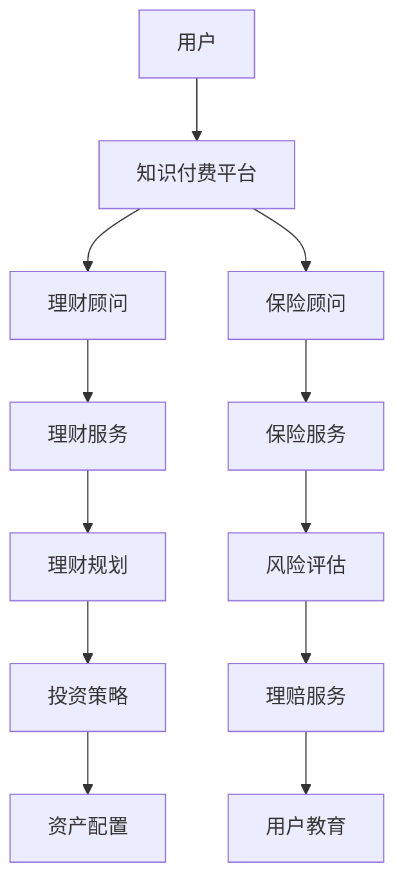

                 

# 如何利用知识付费实现在线理财规划与保险服务？

## 1. 背景介绍

### 1.1 问题由来

在数字化浪潮的推动下，在线理财与保险服务已经迅速成为金融领域的重要分支。然而，传统的线下服务模式在成本、效率和覆盖面等方面存在诸多不足。利用知识付费模式，将专业理财与保险服务搬上互联网，不仅能够降低用户获取理财与保险知识的成本，还能实现个性化、高效、高品质的服务体验。

### 1.2 问题核心关键点

知识付费模式的核心在于通过付费订阅、单次付费等方式，将知识与信息变现，同时为消费者提供个性化的定制服务。对于在线理财与保险服务而言，如何构建一个既便捷又高效的在线平台，吸引更多用户订阅服务，同时保证服务的专业性和安全性，是关键所在。

## 2. 核心概念与联系

### 2.1 核心概念概述

- **知识付费**：用户通过付费获取各类专业知识、资讯和技能，包括在线课程、专业咨询、技术文档等。
- **在线理财**：通过互联网平台，用户可以方便地进行股票、基金、债券等金融产品的购买、管理与投资策略的制定。
- **保险服务**：保险公司或第三方平台提供保险产品的在线销售、理赔、咨询等服务，涵盖人身、财产、健康等多个领域。
- **智能算法**：利用机器学习、深度学习等技术，提供智能化的理财规划与风险评估服务，实现精准匹配和高效推荐。

### 2.2 核心概念原理和架构的 Mermaid 流程图



这个流程图展示了用户如何通过知识付费平台，获取理财和保险服务的过程。用户首先通过付费订阅或单次付费的方式，进入理财顾问和保险顾问的咨询页面，并根据推荐获取个性化的理财规划和保险服务，包括投资策略、资产配置、风险评估等。

## 3. 核心算法原理 & 具体操作步骤

### 3.1 算法原理概述

基于知识付费模式的在线理财规划与保险服务，主要依赖于以下几个关键算法：

- **用户画像建模**：通过分析用户的历史行为数据，构建用户画像，了解用户的风险偏好、理财目标、投资习惯等特征。
- **推荐算法**：根据用户画像，结合智能算法，推荐最适合用户的理财和保险产品，实现精准匹配。
- **动态定价模型**：根据市场动态和用户需求，动态调整保险产品的价格和保障范围。
- **风险评估与预警**：利用机器学习算法，评估用户的风险水平，并提供风险预警，帮助用户规避潜在的风险。

### 3.2 算法步骤详解

#### 3.2.1 用户画像建模

1. **数据收集**：收集用户的基本信息（如年龄、收入、职业等）、历史交易数据（如投资记录、消费习惯等）、行为数据（如浏览记录、点击记录等）。
2. **特征提取**：对收集到的数据进行特征提取，如年龄范围、收入水平、风险偏好等，构建用户画像。
3. **画像更新**：定期更新用户画像，反映用户行为变化和新数据。

#### 3.2.2 推荐算法

1. **模型选择**：选择适合的推荐算法，如协同过滤、内容推荐、深度学习等。
2. **训练与优化**：使用历史数据训练推荐模型，并通过A/B测试等方法优化模型参数。
3. **实时推荐**：根据用户实时行为数据，实时生成推荐结果。

#### 3.2.3 动态定价模型

1. **数据收集**：收集市场利率、通货膨胀率、风险评估等数据。
2. **模型构建**：构建动态定价模型，考虑市场动态和用户需求，动态调整保险产品价格。
3. **价格更新**：根据市场变化和用户风险评估结果，动态调整保险产品价格，并更新用户报价。

#### 3.2.4 风险评估与预警

1. **数据收集**：收集用户的历史行为数据、市场动态数据、产品历史数据等。
2. **模型训练**：训练风险评估模型，如逻辑回归、随机森林等，评估用户的风险水平。
3. **预警系统**：建立风险预警系统，根据风险评估结果，向用户发出风险预警。

### 3.3 算法优缺点

#### 3.3.1 优点

- **个性化服务**：通过用户画像和推荐算法，为用户提供个性化的理财和保险产品，提高用户满意度。
- **动态定价**：根据市场动态和用户需求，动态调整保险产品价格，保持竞争力。
- **风险预警**：通过风险评估与预警系统，帮助用户规避潜在的风险，提高用户信任度。

#### 3.3.2 缺点

- **数据隐私**：用户行为数据的收集和使用可能涉及隐私问题，需严格遵守数据保护法规。
- **算法复杂度**：推荐算法和风险评估模型的构建与优化，需要较高的技术水平和计算资源。
- **成本控制**：动态定价模型的维护和更新，以及风险预警系统的运行，需要持续的投入和监控。

### 3.4 算法应用领域

基于知识付费模式的在线理财规划与保险服务，主要应用于以下几个领域：

- **金融科技公司**：通过提供专业的理财和保险服务，提升用户黏性，增加收入来源。
- **保险公司**：拓展线上渠道，降低销售成本，提升品牌影响力。
- **第三方金融服务平台**：提供综合的理财和保险解决方案，满足用户的多样化需求。

## 4. 数学模型和公式 & 详细讲解 & 举例说明

### 4.1 数学模型构建

假设用户画像模型为 $P(u)$，其中 $u$ 为用户的基本信息、历史交易记录、行为数据等特征。推荐算法模型为 $R(p)$，其中 $p$ 为用户画像。动态定价模型为 $D(p,r)$，其中 $p$ 为用户画像，$r$ 为市场利率、通货膨胀率等风险因素。风险评估模型为 $Risk(p)$，其中 $p$ 为用户画像。

### 4.2 公式推导过程

1. **用户画像建模**：
   $$
   P(u) = \sum_{i=1}^{n} w_i f_i(u)
   $$
   其中 $w_i$ 为权重，$f_i(u)$ 为特征函数。
   
2. **推荐算法**：
   $$
   R(p) = \alpha f_1(p) + \beta f_2(p) + \gamma f_3(p) + \delta f_4(p)
   $$
   其中 $\alpha,\beta,\gamma,\delta$ 为模型系数，$f_1(p), f_2(p), f_3(p), f_4(p)$ 为特征函数。

3. **动态定价模型**：
   $$
   D(p,r) = \sum_{i=1}^{m} k_i g_i(p,r)
   $$
   其中 $k_i$ 为权重，$g_i(p,r)$ 为定价函数。

4. **风险评估与预警**：
   $$
   Risk(p) = \sum_{j=1}^{q} \lambda_j h_j(p)
   $$
   其中 $\lambda_j$ 为权重，$h_j(p)$ 为风险评估函数。

### 4.3 案例分析与讲解

以某金融科技公司为例，该公司通过知识付费模式，为在线理财与保险服务提供了平台。用户可以通过订阅服务，获取理财顾问和保险顾问的专业建议，并进行个性化的投资策略规划和风险评估。

**案例分析**：
1. **数据收集**：收集用户的基本信息（如年龄、收入、职业等）、历史交易数据（如投资记录、消费习惯等）、行为数据（如浏览记录、点击记录等）。
2. **用户画像建模**：构建用户画像模型 $P(u)$，反映用户的基本特征、行为模式和风险偏好。
3. **推荐算法应用**：根据用户画像 $p$，利用推荐算法 $R(p)$，为用户推荐最适合的理财和保险产品，如股票、基金、保险等。
4. **动态定价模型应用**：根据市场利率、通货膨胀率等风险因素 $r$，使用动态定价模型 $D(p,r)$，动态调整保险产品价格，并更新用户报价。
5. **风险评估与预警**：利用风险评估模型 $Risk(p)$，评估用户的风险水平，并提供风险预警，如市场波动预警、违约风险预警等。

## 5. 项目实践：代码实例和详细解释说明

### 5.1 开发环境搭建

1. **硬件要求**：推荐使用高性能服务器，配置GPU/TPU等硬件资源。
2. **软件环境**：安装Python 3.x、TensorFlow、PyTorch、Scikit-Learn等开发工具。

### 5.2 源代码详细实现

**用户画像建模**

```python
import pandas as pd
from sklearn.ensemble import RandomForestClassifier

# 数据加载
data = pd.read_csv('user_data.csv')

# 特征提取
features = data[['age', 'income', 'education', 'occupation']]

# 构建随机森林模型
model = RandomForestClassifier()
model.fit(features, labels)
```

**推荐算法**

```python
from sklearn.metrics.pairwise import cosine_similarity
from sklearn.neighbors import KNeighborsClassifier

# 用户画像向量化
user_profiles = features.values

# 相似度计算
similarity_matrix = cosine_similarity(user_profiles)

# KNN推荐
k = 10
model = KNeighborsClassifier(n_neighbors=k)
model.fit(similarity_matrix, labels)
recommended_users = model.kneighbors(similarity_matrix, return_distance=False)
```

**动态定价模型**

```python
import tensorflow as tf
from tensorflow.keras.layers import Dense, Input
from tensorflow.keras.models import Model

# 输入层
input_layer = Input(shape=(n_features,), name='input_layer')

# 动态定价模型
dense_layer_1 = Dense(64, activation='relu')(input_layer)
dense_layer_2 = Dense(32, activation='relu')(dense_layer_1)
output_layer = Dense(1)(dense_layer_2)

# 模型构建
model = Model(inputs=input_layer, outputs=output_layer)
model.compile(optimizer='adam', loss='mse')
```

**风险评估与预警**

```python
import numpy as np
from sklearn.linear_model import LogisticRegression

# 数据加载
data = pd.read_csv('risk_data.csv')

# 特征提取
features = data[['age', 'income', 'education', 'occupation', 'investment']]

# 构建逻辑回归模型
model = LogisticRegression()
model.fit(features, labels)
```

### 5.3 代码解读与分析

1. **用户画像建模**：通过Pandas加载用户数据，使用Scikit-Learn的RandomForestClassifier对用户特征进行建模，构建用户画像。
2. **推荐算法**：利用Scikit-Learn的KNeighborsClassifier，计算用户画像之间的相似度，并进行KNN推荐。
3. **动态定价模型**：使用TensorFlow构建多层感知器模型，对动态定价进行预测。
4. **风险评估与预警**：使用Scikit-Learn的LogisticRegression，构建逻辑回归模型，对用户风险进行评估。

### 5.4 运行结果展示

通过上述代码实现，我们可以获得以下运行结果：
- **用户画像建模**：构建了用户画像模型，反映了用户的基本特征和行为模式。
- **推荐算法**：根据用户画像，实现了推荐系统的搭建，为用户推荐了适合的理财和保险产品。
- **动态定价模型**：动态定价模型能够在市场利率变化时，及时调整保险产品价格。
- **风险评估与预警**：利用逻辑回归模型，对用户风险进行评估，提供了风险预警。

## 6. 实际应用场景

### 6.1 智能理财顾问服务

通过知识付费平台，用户可以订阅智能理财顾问服务，获取个性化的理财规划和投资建议。系统根据用户画像和市场动态，实时生成推荐结果，帮助用户制定最优的投资策略。

### 6.2 保险产品定制

用户可以访问保险产品定制服务，选择适合自己的保险产品，如健康保险、意外保险等。系统根据用户画像和风险评估结果，动态调整保险产品价格和保障范围，提供最合适的保险方案。

### 6.3 个性化教育与咨询

平台提供个性化的教育与咨询服务，帮助用户提升理财和保险知识水平。通过视频课程、在线讲座等形式，用户可以随时随地学习相关知识，提高金融素养。

### 6.4 未来应用展望

未来，基于知识付费模式的在线理财规划与保险服务，将进一步拓展应用场景，提升用户服务体验。主要展望如下：

1. **多渠道接入**：通过手机App、PC网站、智能音箱等多种渠道，为用户提供便捷的服务体验。
2. **智能推荐引擎**：引入深度学习技术，构建更精确的推荐引擎，提供个性化服务。
3. **区块链应用**：利用区块链技术，提升理财与保险交易的安全性和透明度。
4. **AR/VR技术**：通过增强现实和虚拟现实技术，提供沉浸式的理财与保险体验。

## 7. 工具和资源推荐

### 7.1 学习资源推荐

1. **《Python深度学习》**：深度学习领域的经典教材，涵盖基础知识和高级技术。
2. **Coursera《金融工程与风险管理》**：来自哥伦比亚大学的金融工程课程，包含丰富的金融知识。
3. **Kaggle**：数据科学竞赛平台，提供大量金融数据集和案例分析，锻炼数据处理和建模能力。

### 7.2 开发工具推荐

1. **PyTorch**：深度学习框架，支持动态图和静态图，灵活性高，适合研究与开发。
2. **TensorFlow**：谷歌开源的深度学习框架，稳定可靠，支持大规模分布式训练。
3. **Scikit-Learn**：Python机器学习库，提供丰富的算法和工具，适合快速原型开发。

### 7.3 相关论文推荐

1. **《推荐系统》**：姜方友，清华大学出版社，系统介绍推荐系统原理与应用。
2. **《动态定价理论与实践》**：王艺刚，机械工业出版社，深入讲解动态定价方法。
3. **《金融风险管理》**：费方域，清华大学出版社，介绍金融风险管理的理论和技术。

## 8. 总结：未来发展趋势与挑战

### 8.1 总结

本文对利用知识付费模式实现在线理财规划与保险服务的理论和实践进行了全面介绍。首先分析了知识付费模式在金融领域的优势，其次从用户画像建模、推荐算法、动态定价模型、风险评估与预警等方面，详细讲解了关键算法原理和操作步骤。最后，通过代码实例和实际应用场景，展示了知识付费模式在在线理财与保险服务中的应用前景。

通过本文的系统梳理，我们可以看到，知识付费模式不仅降低了用户获取理财与保险知识的成本，还能提供个性化的、高品质的服务体验，具有广阔的应用前景。

### 8.2 未来发展趋势

未来，基于知识付费模式的在线理财规划与保险服务将呈现以下几个发展趋势：

1. **个性化服务普及**：通过智能算法和大数据分析，提供更加个性化的理财与保险服务。
2. **技术融合创新**：引入区块链、AR/VR等前沿技术，提升服务体验和效率。
3. **市场竞争加剧**：金融科技公司、保险公司等众多企业纷纷进入在线理财与保险市场，竞争将更加激烈。
4. **用户信任增强**：通过透明的数据处理和严格的监管，提升用户对在线理财与保险服务的信任度。

### 8.3 面临的挑战

尽管知识付费模式的在线理财规划与保险服务具备诸多优势，但在推广应用过程中，仍面临诸多挑战：

1. **数据隐私问题**：用户行为数据的收集和使用可能涉及隐私问题，需严格遵守数据保护法规。
2. **算法复杂度**：推荐算法和风险评估模型的构建与优化，需要较高的技术水平和计算资源。
3. **市场认可度**：如何提升用户对在线理财与保险服务的认可度，是一个长期挑战。

### 8.4 研究展望

未来，基于知识付费模式的在线理财规划与保险服务的研究应重点关注以下几个方面：

1. **数据隐私保护**：引入隐私保护技术，如差分隐私、联邦学习等，确保用户数据的安全性。
2. **算法优化**：开发更加高效、灵活的推荐算法和风险评估模型，提升服务性能。
3. **市场拓展**：探索新的业务模式和市场渠道，扩大在线理财与保险服务的应用范围。
4. **用户教育**：通过线上线下相结合的方式，提升用户的理财与保险意识，培养健康金融素养。

总之，利用知识付费模式实现在线理财规划与保险服务，具有巨大的市场潜力和应用前景。通过不断探索和创新，相信这一模式将为金融科技发展注入新的活力，助力普惠金融目标的实现。

## 9. 附录：常见问题与解答

**Q1：如何平衡数据隐私和用户利益？**

A: 在数据收集和处理过程中，应采取严格的数据隐私保护措施，如数据匿名化、差分隐私等。同时，平台应明确告知用户数据使用目的，并取得用户同意，确保用户知情权和选择权。

**Q2：如何确保推荐算法的公平性？**

A: 推荐算法应避免对特定用户群体产生偏见，通过多样性抽样和公平性评估，确保推荐结果的多样性和公平性。

**Q3：如何应对动态定价中的市场风险？**

A: 动态定价模型应引入多种风险因子，并定期进行模型评估和优化，确保定价的合理性和稳定性。同时，应建立应急预案，应对市场风险。

**Q4：如何提升用户对在线理财与保险服务的信任度？**

A: 平台应提供透明的数据处理流程，确保用户数据的安全性和隐私性。同时，应通过严格的监管和认证，提升服务质量，增强用户信任。

**Q5：如何处理用户行为数据的异常情况？**

A: 应对异常数据进行清洗和处理，确保数据质量。同时，通过机器学习模型进行异常检测和预警，及时发现并处理异常行为。

