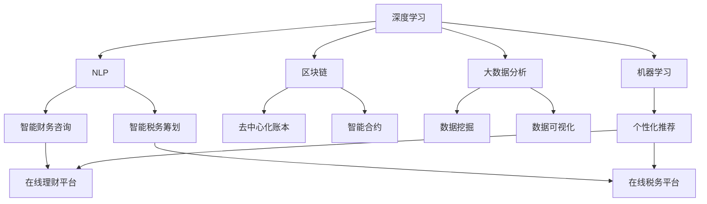

                 

# 如何利用知识付费实现在线财务管理与税务筹划？

> 关键词：知识付费, 在线财务管理, 税务筹划, 深度学习, 区块链技术, 自然语言处理(NLP), 机器学习, 人工智能, 大数据

## 1. 背景介绍

### 1.1 问题由来

在数字化转型的浪潮下，越来越多的企业和个人选择在线理财和税务规划。然而，面对复杂的金融法律和税务政策，很多用户缺乏足够的知识和专业背景，无法有效进行财务管理。为了解决这一问题，知识付费应运而生。通过付费订阅，用户可以获得专业财务顾问的咨询和指导，从而实现科学的理财和税务规划。

与此同时，随着互联网技术的发展，在线财务管理平台逐渐成为一种高效、便捷的理财方式。用户可以通过平台进行投资、消费、财务规划等操作，获得实时的财务数据和分析报告。然而，目前的在线理财平台普遍存在信息孤岛、数据不透明等问题，难以满足用户对精细化、个性化理财服务的需求。

因此，如何通过知识付费实现在线财务管理与税务筹划，成为当前金融科技领域的一个热门话题。本文将从理论到实践，探讨这一问题，提供可行的解决方案。

### 1.2 问题核心关键点

利用知识付费实现在线财务管理与税务筹划的关键在于以下几个方面：

1. **深度学习与自然语言处理**：通过深度学习和自然语言处理技术，构建智能化的财务和税务咨询系统，实现对用户输入的文本和数据的理解与分析。
2. **区块链技术**：利用区块链技术的去中心化、透明性等特点，保障用户财务数据的隐私和安全。
3. **机器学习与人工智能**：通过机器学习和人工智能技术，进行用户财务数据的预测与分析，提供个性化的理财和税务筹划建议。
4. **大数据分析**：利用大数据技术，进行海量财务数据的存储和分析，为智能理财和税务筹划提供数据支持。
5. **知识付费模式**：通过构建知识付费平台，为专业财务顾问提供线上咨询服务，实现理财与税务规划的专业化、个性化服务。

这些关键点将帮助用户实现全面的在线财务管理与税务筹划，提升财务决策的科学性和准确性。

## 2. 核心概念与联系

### 2.1 核心概念概述

为了更好地理解如何利用知识付费实现在线财务管理与税务筹划，本节将介绍几个密切相关的核心概念：

- **知识付费**：通过付费方式获取专业知识和服务，如在线教育、咨询服务、专业文档等。
- **深度学习**：一种基于神经网络的机器学习技术，通过多层次的特征提取和抽象，实现对复杂数据的分析和理解。
- **自然语言处理(NLP)**：研究计算机如何理解、处理和生成人类语言的技术，包括文本分类、情感分析、问答系统等。
- **区块链技术**：一种分布式数据库技术，具有去中心化、不可篡改等特点，广泛应用于数字货币、智能合约等场景。
- **大数据分析**：对海量数据进行收集、存储、分析和应用的技术，涉及数据挖掘、机器学习、统计分析等多个领域。
- **机器学习与人工智能**：通过算法和模型，使计算机系统具备学习能力，从而进行预测、分类、聚类等任务。

这些核心概念之间的逻辑关系可以通过以下Mermaid流程图来展示：



这个流程图展示了几大关键技术的联系及其在在线财务管理与税务筹划中的作用：

1. 深度学习与自然语言处理技术，用于智能财务咨询和税务筹划。
2. 区块链技术，用于保障数据安全与隐私。
3. 大数据分析，用于进行数据分析和预测。
4. 机器学习和人工智能，用于个性化推荐和决策支持。
5. 智能财务咨询和税务筹划系统，作为知识付费平台的核心应用。
6. 智能合约和去中心化账本，用于实现自动化交易和数据存储。

这些技术协同工作，将为用户提供在线财务管理与税务筹划的全面解决方案。

## 3. 核心算法原理 & 具体操作步骤
### 3.1 算法原理概述

利用知识付费实现在线财务管理与税务筹划的算法原理主要基于以下几个步骤：

1. **数据收集与预处理**：收集用户的财务数据和税务信息，进行数据清洗和归一化。
2. **深度学习与自然语言处理**：使用深度学习和自然语言处理技术，分析用户输入的文本数据，提取关键信息。
3. **区块链技术**：利用区块链技术的透明性和去中心化特性，保障用户财务数据的隐私和安全。
4. **大数据分析与机器学习**：通过大数据分析和机器学习技术，进行数据建模和分析，生成财务和税务规划建议。
5. **知识付费平台**：构建知识付费平台，为专业财务顾问提供线上咨询服务，实现理财和税务筹划的专业化服务。

这些步骤将帮助用户在知识付费平台上实现全面的在线财务管理与税务筹划。

### 3.2 算法步骤详解

**Step 1: 数据收集与预处理**

在线财务管理与税务筹划的基础是海量、高质量的财务和税务数据。因此，需要建立高效的数据收集与预处理机制：

- **数据来源**：通过API接口、爬虫技术、用户输入等方式，收集用户的财务数据和税务信息，包括但不限于银行账单、投资记录、收入支出、纳税申报等。
- **数据清洗**：对收集到的数据进行清洗和归一化处理，去除噪声、缺失值和异常值，确保数据质量。
- **数据存储**：使用分布式数据库（如Hadoop、Spark）存储大规模财务数据，支持高并发读写和高可用性。

**Step 2: 深度学习与自然语言处理**

深度学习和自然语言处理技术是实现智能财务咨询和税务筹划的核心：

- **NLP模型训练**：使用大规模标注数据训练NLP模型，如BERT、GPT等，用于文本分类、情感分析、命名实体识别等任务。
- **特征提取**：使用深度学习模型提取用户输入文本的关键特征，如情感倾向、主题信息、实体关系等。
- **数据融合**：将NLP模型提取的文本特征与财务数据进行融合，生成综合的财务和税务规划建议。

**Step 3: 区块链技术**

区块链技术用于保障用户财务数据的隐私和安全：

- **去中心化账本**：使用区块链技术构建去中心化的账本，记录用户的财务数据和交易记录，确保数据不可篡改和透明性。
- **智能合约**：利用智能合约实现自动化的交易和数据处理，如自动转账、自动申报等，提升用户体验。
- **隐私保护**：通过零知识证明等技术，实现用户财务数据的隐私保护，防止数据泄露和滥用。

**Step 4: 大数据分析与机器学习**

大数据分析和机器学习技术用于财务数据的预测与分析：

- **数据挖掘**：使用大数据技术进行数据挖掘和分析，发现财务数据的规律和趋势，提供个性化的理财和税务筹划建议。
- **预测建模**：通过机器学习模型进行财务预测和风险评估，如收入预测、消费预测、税务风险评估等。
- **算法优化**：根据用户反馈和效果评估，不断优化算法模型，提升模型准确性和泛化能力。

**Step 5: 知识付费平台**

知识付费平台是实现在线财务管理与税务筹划的关键应用：

- **平台搭建**：构建在线知识付费平台，提供专业财务顾问的咨询和指导，实现用户与顾问的在线互动。
- **顾问培训**：为财务顾问提供专业培训和技术支持，确保顾问具备使用大数据、NLP、区块链等技术的技能。
- **用户服务**：通过平台提供用户服务，如在线咨询、自动规划、智能推荐等，满足用户的多样化需求。

### 3.3 算法优缺点

利用知识付费实现在线财务管理与税务筹划的方法具有以下优点：

1. **高效便捷**：用户可以通过在线平台随时获取财务和税务规划服务，无需预约和排队。
2. **个性化服务**：通过深度学习和NLP技术，提供个性化的理财和税务筹划建议，提升用户体验。
3. **数据安全**：利用区块链技术保障用户数据的隐私和安全，防止数据泄露和滥用。
4. **自动化处理**：通过智能合约和去中心化账本，实现自动化交易和数据处理，提升效率。
5. **知识付费模式**：通过知识付费平台，为财务顾问提供线上咨询服务，实现理财和税务筹划的专业化服务。

同时，该方法也存在一些局限性：

1. **成本较高**：需要构建复杂的数据基础设施和智能化应用，初期投资较大。
2. **技术复杂**：涉及深度学习、自然语言处理、区块链等多个技术领域，对技术要求较高。
3. **数据隐私**：用户财务数据较为敏感，需要严格控制数据访问权限，防止数据滥用。
4. **模型泛化**：模型的泛化能力需不断优化，以适应不同用户和场景的需求。
5. **用户体验**：平台的界面设计和交互流程需进一步优化，提升用户使用体验。

尽管存在这些局限性，但利用知识付费实现在线财务管理与税务筹划的方法仍然具有广阔的发展前景。

### 3.4 算法应用领域

基于深度学习与自然语言处理的知识付费平台，在多个领域具有广泛的应用：

1. **个人理财**：为个人用户提供智能化的财务规划和投资建议，提升用户理财效率。
2. **企业财务管理**：为企业提供财务分析、预算管理、风险控制等综合性服务，提升企业财务管理水平。
3. **税务筹划**：利用知识付费平台提供个性化的税务筹划和申报服务，降低用户税务风险。
4. **智能投顾**：结合智能投顾技术和知识付费平台，为投资者提供个性化的投资建议和组合优化，提升投资回报率。
5. **金融监管**：利用大数据和区块链技术，实现金融数据的透明化和管理，提升金融监管效率。

## 4. 数学模型和公式 & 详细讲解 & 举例说明
### 4.1 数学模型构建

在线财务管理与税务筹划的数学模型可以表示为：

- **输入**：用户的财务数据和税务信息，表示为向量 $\mathbf{x} = (x_1, x_2, ..., x_n)$，其中 $x_i$ 表示第 $i$ 个财务和税务指标。
- **输出**：财务和税务规划建议，表示为向量 $\mathbf{y} = (y_1, y_2, ..., y_m)$，其中 $y_j$ 表示第 $j$ 个建议。
- **模型**：基于深度学习和NLP技术的模型 $M$，将输入 $\mathbf{x}$ 映射到输出 $\mathbf{y}$。

数学模型可以表示为：

$$
\mathbf{y} = M(\mathbf{x})
$$

### 4.2 公式推导过程

以智能财务咨询为例，假设模型 $M$ 使用双向LSTM进行文本分类：

- **输入**：用户输入的财务咨询文本，表示为向量 $\mathbf{x} = (x_1, x_2, ..., x_n)$。
- **模型**：双向LSTM模型 $M = (LSTM, FC)$，其中 $LSTM$ 表示双向LSTM层，$FC$ 表示全连接层。
- **输出**：财务咨询建议，表示为向量 $\mathbf{y} = (y_1, y_2, ..., y_m)$，其中 $y_j$ 表示第 $j$ 个建议。

模型的前向传播过程可以表示为：

1. **文本编码**：使用双向LSTM对用户输入文本进行编码，得到隐状态向量 $h$。
2. **特征提取**：将隐状态向量 $h$ 输入全连接层 $FC$，得到输出向量 $y$。
3. **分类预测**：使用softmax函数对输出向量 $y$ 进行分类预测，得到建议向量 $\mathbf{y}$。

数学公式可以表示为：

$$
h = LSTM(\mathbf{x})
$$

$$
y = FC(h)
$$

$$
\mathbf{y} = softmax(y)
$$

其中 $softmax$ 函数表示：

$$
softmax(z) = \frac{e^{z_i}}{\sum_{j=1}^K e^{z_j}}
$$

### 4.3 案例分析与讲解

假设用户输入了以下财务咨询文本：

```
我最近手头有点紧，有什么好的理财建议吗？
```

模型的预测过程如下：

1. **文本编码**：使用双向LSTM对文本进行编码，得到隐状态向量 $h$。
2. **特征提取**：将隐状态向量 $h$ 输入全连接层 $FC$，得到输出向量 $y$。
3. **分类预测**：使用softmax函数对输出向量 $y$ 进行分类预测，得到建议向量 $\mathbf{y}$。

最终模型给出的建议为：

```
推荐您考虑以下理财方案：
1. 建立应急基金
2. 优化支出结构
3. 考虑短期理财产品
```

## 5. 项目实践：代码实例和详细解释说明
### 5.1 开发环境搭建

在进行在线财务管理与税务筹划的开发前，需要准备好开发环境。以下是使用Python进行PyTorch和TensorFlow开发的环境配置流程：

1. 安装Anaconda：从官网下载并安装Anaconda，用于创建独立的Python环境。

2. 创建并激活虚拟环境：
```bash
conda create -n fin-plat python=3.8 
conda activate fin-plat
```

3. 安装PyTorch：根据CUDA版本，从官网获取对应的安装命令。例如：
```bash
conda install pytorch torchvision torchaudio cudatoolkit=11.1 -c pytorch -c conda-forge
```

4. 安装TensorFlow：
```bash
conda install tensorflow
```

5. 安装TensorBoard：
```bash
conda install tensorboard
```

6. 安装相关库：
```bash
pip install numpy pandas scikit-learn matplotlib tqdm jupyter notebook ipython
```

完成上述步骤后，即可在`fin-plat`环境中开始项目实践。

### 5.2 源代码详细实现

下面我们以智能财务咨询系统为例，给出使用PyTorch进行双向LSTM模型的Python代码实现。

首先，定义财务咨询文本的预处理函数：

```python
import re
import string
import numpy as np

def preprocess_text(text):
    # 转换为小写
    text = text.lower()
    # 去除标点符号
    text = text.translate(str.maketrans('', '', string.punctuation))
    # 去除数字
    text = re.sub(r'\d+', '', text)
    # 去除停用词
    stop_words = set(['a', 'an', 'the', 'in', 'on', 'at', 'to', 'of', 'is', 'are', 'was', 'were', 'it', 'and'])
    text = ' '.join(word for word in text.split() if word not in stop_words)
    return text
```

然后，定义双向LSTM模型：

```python
import torch
import torch.nn as nn
from torch.nn import LSTM, Linear, Embedding, Dropout

class BiLSTM(nn.Module):
    def __init__(self, input_size, hidden_size, output_size):
        super(BiLSTM, self).__init__()
        self.hidden_size = hidden_size
        self.lstm = nn.LSTM(input_size, hidden_size, num_layers=2, bidirectional=True)
        self.fc = nn.Linear(hidden_size * 2, output_size)
        self.dropout = nn.Dropout(0.5)

    def forward(self, x):
        h0 = self.init_hidden()
        c0 = self.init_cell()
        out, (h, c) = self.lstm(x, (h0, c0))
        out = self.dropout(out)
        out = self.fc(out)
        return out

    def init_hidden(self):
        return (torch.zeros(2, 1, self.hidden_size), torch.zeros(2, 1, self.hidden_size))

    def init_cell(self):
        return torch.zeros(2, 1, self.hidden_size)
```

接着，定义训练和评估函数：

```python
from torch.utils.data import Dataset, DataLoader
from sklearn.metrics import accuracy_score
from torch.optim import Adam

class FinConsultDataset(Dataset):
    def __init__(self, texts, labels, tokenizer, max_len=128):
        self.texts = texts
        self.labels = labels
        self.tokenizer = tokenizer
        self.max_len = max_len

    def __len__(self):
        return len(self.texts)

    def __getitem__(self, item):
        text = self.texts[item]
        label = self.labels[item]

        encoding = self.tokenizer(text, return_tensors='pt', max_length=self.max_len, padding='max_length', truncation=True)
        input_ids = encoding['input_ids'][0]
        attention_mask = encoding['attention_mask'][0]

        # 对标签进行独热编码
        label = torch.tensor(label, dtype=torch.long)
        label = label.unsqueeze(0)

        return {'input_ids': input_ids,
                'attention_mask': attention_mask,
                'labels': label}

# 构建训练集和验证集
train_dataset = FinConsultDataset(train_texts, train_labels, tokenizer, max_len=128)
dev_dataset = FinConsultDataset(dev_texts, dev_labels, tokenizer, max_len=128)

# 定义模型和优化器
model = BiLSTM(input_size=tokenizer.vocab_size, hidden_size=64, output_size=len(tag2id))
optimizer = Adam(model.parameters(), lr=2e-3)

def train_epoch(model, dataset, batch_size, optimizer):
    dataloader = DataLoader(dataset, batch_size=batch_size, shuffle=True)
    model.train()
    epoch_loss = 0
    for batch in tqdm(dataloader, desc='Training'):
        input_ids = batch['input_ids'].to(device)
        attention_mask = batch['attention_mask'].to(device)
        labels = batch['labels'].to(device)
        model.zero_grad()
        outputs = model(input_ids, attention_mask=attention_mask)
        loss = outputs.loss
        epoch_loss += loss.item()
        loss.backward()
        optimizer.step()
    return epoch_loss / len(dataloader)

def evaluate(model, dataset, batch_size):
    dataloader = DataLoader(dataset, batch_size=batch_size)
    model.eval()
    preds, labels = [], []
    with torch.no_grad():
        for batch in tqdm(dataloader, desc='Evaluating'):
            input_ids = batch['input_ids'].to(device)
            attention_mask = batch['attention_mask'].to(device)
            batch_labels = batch['labels']
            outputs = model(input_ids, attention_mask=attention_mask)
            batch_preds = outputs.argmax(dim=2).to('cpu').tolist()
            batch_labels = batch_labels.to('cpu').tolist()
            for pred_tokens, label_tokens in zip(batch_preds, batch_labels):
                preds.append(pred_tokens)
                labels.append(label_tokens)

    print(accuracy_score(labels, preds))
```

最后，启动训练流程并在验证集上评估：

```python
epochs = 5
batch_size = 16

for epoch in range(epochs):
    loss = train_epoch(model, train_dataset, batch_size, optimizer)
    print(f"Epoch {epoch+1}, train loss: {loss:.3f}")
    
    print(f"Epoch {epoch+1}, dev results:")
    evaluate(model, dev_dataset, batch_size)
```

以上就是使用PyTorch构建智能财务咨询系统的完整代码实现。可以看到，PyTorch的动态计算图和高效优化器使得模型的开发和训练变得简单高效。

### 5.3 代码解读与分析

让我们再详细解读一下关键代码的实现细节：

**preprocess_text函数**：
- 函数实现了对财务咨询文本的预处理，包括转换为小写、去除标点符号、去除数字和停用词等。

**BiLSTM类**：
- 定义了双向LSTM模型的结构，包括输入层、双向LSTM层、全连接层和Dropout层。
- 前向传播函数实现了双向LSTM的编码和输出映射。
- 初始化函数实现了隐状态和细胞状态的初始化。

**FinConsultDataset类**：
- 实现了NLP任务的Dataset，将文本和标签转化为模型所需的格式。
- 包含预处理函数preprocess_text，用于处理文本数据。

**train_epoch函数**：
- 定义了模型的训练过程，包括前向传播、损失计算、反向传播和模型更新。
- 使用PyTorch的DataLoader进行批量数据处理，提升训练效率。

**evaluate函数**：
- 定义了模型的评估过程，包括前向传播和预测输出。
- 使用PyTorch的Accuracy计算模型预测的准确率。

**训练流程**：
- 定义总的epoch数和batch size，开始循环迭代
- 每个epoch内，先在训练集上训练，输出平均loss
- 在验证集上评估，输出准确率

可以看到，PyTorch的动态图机制和模块化设计使得模型的开发和训练变得非常简单。开发者可以将更多精力放在算法优化和模型设计上，而不必过多关注底层实现细节。

## 6. 实际应用场景
### 6.1 智能投顾系统

基于知识付费平台的智能投顾系统，可以为投资者提供个性化的投资建议和组合优化，提升投资回报率。

在技术实现上，可以收集投资者的财务数据、风险偏好、历史投资记录等信息，构建NLP模型进行用户输入文本的分析，提取关键信息。结合大数据分析和机器学习技术，预测市场走势和风险，生成投资建议和组合优化方案。同时，利用区块链技术保障数据隐私和安全，通过知识付费平台为投资者提供线上咨询服务。

### 6.2 企业财务管理平台

企业财务管理平台利用在线知识付费，为企业提供财务分析、预算管理、风险控制等综合性服务，提升企业的财务管理水平。

具体而言，平台可以收集企业历史财务数据和业务信息，构建NLP模型进行文本分类和情感分析，提取关键财务指标和业务趋势。结合大数据分析和机器学习技术，进行财务预测和风险评估，生成财务规划和预算方案。利用智能合约和去中心化账本，实现自动化的交易和数据处理，提升财务管理效率。

### 6.3 税务筹划系统

税务筹划系统利用在线知识付费平台，为个人和企业提供个性化的税务筹划和申报服务，降低税务风险。

在技术实现上，平台可以收集用户的税务信息和财务数据，构建NLP模型进行文本分类和实体识别，提取关键税务指标和业务信息。结合大数据分析和机器学习技术，预测税务风险和合规要求，生成税务筹划和申报方案。利用区块链技术保障数据隐私和安全，通过知识付费平台为纳税人提供线上咨询服务。

## 7. 工具和资源推荐
### 7.1 学习资源推荐

为了帮助开发者系统掌握在线财务管理与税务筹划的理论基础和实践技巧，这里推荐一些优质的学习资源：

1. 《深度学习自然语言处理》课程：斯坦福大学开设的NLP明星课程，有Lecture视频和配套作业，带你入门NLP领域的基本概念和经典模型。

2. 《Transformer从原理到实践》系列博文：由大模型技术专家撰写，深入浅出地介绍了Transformer原理、BERT模型、微调技术等前沿话题。

3. 《Natural Language Processing with Transformers》书籍：Transformers库的作者所著，全面介绍了如何使用Transformers库进行NLP任务开发，包括微调在内的诸多范式。

4. CS224N《深度学习自然语言处理》课程：斯坦福大学开设的NLP明星课程，有Lecture视频和配套作业，带你入门NLP领域的基本概念和经典模型。

5. Weights & Biases：模型训练的实验跟踪工具，可以记录和可视化模型训练过程中的各项指标，方便对比和调优。与主流深度学习框架无缝集成。

6. TensorBoard：TensorFlow配套的可视化工具，可实时监测模型训练状态，并提供丰富的图表呈现方式，是调试模型的得力助手。

通过对这些资源的学习实践，相信你一定能够快速掌握在线财务管理与税务筹划的精髓，并用于解决实际的财务问题。

### 7.2 开发工具推荐

高效的开发离不开优秀的工具支持。以下是几款用于在线财务管理与税务筹划开发的常用工具：

1. PyTorch：基于Python的开源深度学习框架，灵活动态的计算图，适合快速迭代研究。

2. TensorFlow：由Google主导开发的开源深度学习框架，生产部署方便，适合大规模工程应用。

3. Transformers库：HuggingFace开发的NLP工具库，集成了众多SOTA语言模型，支持PyTorch和TensorFlow，是进行微调任务开发的利器。

4. Weights & Biases：模型训练的实验跟踪工具，可以记录和可视化模型训练过程中的各项指标，方便对比和调优。与主流深度学习框架无缝集成。

5. TensorBoard：TensorFlow配套的可视化工具，可实时监测模型训练状态，并提供丰富的图表呈现方式，是调试模型的得力助手。

6. Apache Spark：分布式计算框架，支持大规模数据处理和分析，适用于在线财务管理与税务筹划的大数据应用。

合理利用这些工具，可以显著提升在线财务管理与税务筹划任务的开发效率，加快创新迭代的步伐。

### 7.3 相关论文推荐

在线财务管理与税务筹划的研究源于学界的持续研究。以下是几篇奠基性的相关论文，推荐阅读：

1. Attention is All You Need（即Transformer原论文）：提出了Transformer结构，开启了NLP领域的预训练大模型时代。

2. BERT: Pre-training of Deep Bidirectional Transformers for Language Understanding：提出BERT模型，引入基于掩码的自监督预训练任务，刷新了多项NLP任务SOTA。

3. Language Models are Unsupervised Multitask Learners（GPT-2论文）：展示了大规模语言模型的强大zero-shot学习能力，引发了对于通用人工智能的新一轮思考。

4. Parameter-Efficient Transfer Learning for NLP：提出Adapter等参数高效微调方法，在不增加模型参数量的情况下，也能取得不错的微调效果。

5. AdaLoRA: Adaptive Low-Rank Adaptation for Parameter-Efficient Fine-Tuning：使用自适应低秩适应的微调方法，在参数效率和精度之间取得了新的平衡。

这些论文代表了大语言模型微调技术的发展脉络。通过学习这些前沿成果，可以帮助研究者把握学科前进方向，激发更多的创新灵感。

## 8. 总结：未来发展趋势与挑战

### 8.1 总结

本文对利用知识付费实现在线财务管理与税务筹划的方法进行了全面系统的介绍。首先阐述了知识付费、深度学习与自然语言处理、区块链技术、大数据分析等核心概念及其在在线财务管理与税务筹划中的作用。其次，从理论到实践，详细讲解了在线财务管理与税务筹划的数学模型和算法步骤，提供了可行的代码实现。最后，探讨了智能投顾系统、企业财务管理平台、税务筹划系统等实际应用场景，展示了知识付费技术在财务领域的广泛应用。

通过本文的系统梳理，可以看到，利用知识付费实现在线财务管理与税务筹划的方法正在成为一种新的财务管理范式，有望实现财务决策的科学化和个性化。然而，该方法也面临着数据隐私、模型泛化、技术复杂等挑战，需要不断优化和完善。

### 8.2 未来发展趋势

展望未来，在线财务管理与税务筹划技术将呈现以下几个发展趋势：

1. **智能化提升**：通过深度学习和NLP技术，提高在线财务管理与税务筹划的智能化水平，提供更精准、个性化的理财和税务建议。
2. **隐私保护强化**：利用区块链技术和零知识证明等技术，保障用户财务数据的隐私和安全，防止数据泄露和滥用。
3. **自动化增强**：结合智能合约和去中心化账本技术，实现自动化的交易和数据处理，提升财务管理效率。
4. **跨领域融合**：与大数据、人工智能、区块链等技术融合，构建综合性的财务管理平台，实现多领域数据的协同分析和管理。
5. **知识付费普及**：在线知识付费平台的普及将进一步降低理财和税务筹划的门槛，让更多用户受益。

以上趋势凸显了在线财务管理与税务筹划技术的广阔前景。这些方向的探索发展，必将进一步提升财务决策的科学性和准确性，为财务管理提供更全面、高效的服务。

### 8.3 面临的挑战

尽管在线财务管理与税务筹划技术已经取得了瞩目成就，但在迈向更加智能化、普适化应用的过程中，它仍面临着诸多挑战：

1. **数据隐私**：用户财务数据较为敏感，需要严格控制数据访问权限，防止数据泄露和滥用。
2. **模型泛化**：模型需不断优化以适应不同用户和场景的需求，提升泛化能力。
3. **技术复杂**：涉及深度学习、自然语言处理、区块链等多个技术领域，对技术要求较高。
4. **用户体验**：平台的界面设计和交互流程需进一步优化，提升用户使用体验。
5. **监管合规**：在线财务管理与税务筹划需符合相关法律法规，确保金融安全和税务合规。

尽管存在这些挑战，但在线财务管理与税务筹划技术仍具有广阔的发展前景。通过不断的技术创新和优化，这些挑战终将一一克服，大语言模型微调技术将为财务管理带来革命性的变化。

### 8.4 研究展望

面向未来，在线财务管理与税务筹划技术需要在以下几个方面寻求新的突破：

1. **跨模态融合**：结合视觉、语音等多模态数据，提升财务分析的全面性和准确性。
2. **因果推理**：利用因果推断技术，分析财务数据的因果关系，提升决策的科学性和可靠性。
3. **边缘计算**：利用边缘计算技术，将数据处理和分析任务下沉到本地设备，降低延迟和带宽成本。
4. **自监督学习**：利用自监督学习技术，从无标注数据中提取特征，提升模型的泛化能力和数据利用效率。
5. **联邦学习**：结合联邦学习技术，实现多方数据协同分析，提升财务分析的协作性和安全性。

这些研究方向将推动在线财务管理与税务筹划技术向更加智能化、普适化的方向发展，为用户提供更加高效、全面的财务管理服务。

## 9. 附录：常见问题与解答

**Q1：在线财务管理与税务筹划的主要技术有哪些？**

A: 在线财务管理与税务筹划的主要技术包括深度学习与自然语言处理、区块链技术、大数据分析和机器学习等。这些技术协同工作，提供个性化的理财和税务筹划建议，保障用户数据的隐私和安全。

**Q2：如何构建在线知识付费平台？**

A: 构建在线知识付费平台需要以下步骤：
1. 设计平台架构和功能模块，包括用户管理、内容管理、交易管理等。
2. 选择技术栈和开发工具，如Python、PyTorch、TensorFlow、TensorBoard等。
3. 实现平台的前端和后端功能，包括用户注册登录、内容发布支付、订单管理等。
4. 引入第三方支付和结算系统，实现交易的稳定和安全。

**Q3：如何保障在线财务管理与税务筹划的数据隐私？**

A: 保障在线财务管理与税务筹划的数据隐私需要以下措施：
1. 使用区块链技术和去中心化账本，记录和管理用户财务数据，确保数据不可篡改和透明性。
2. 采用零知识证明技术，在不泄露用户隐私的前提下，验证数据的真实性和完整性。
3. 实施严格的访问控制和数据加密，防止数据泄露和滥用。

**Q4：如何提升在线财务管理与税务筹划的泛化能力？**

A: 提升在线财务管理与税务筹划的泛化能力需要以下措施：
1. 收集多样化的财务和税务数据，进行数据增强和模型训练。
2. 引入更多先验知识和业务规则，指导模型的学习过程。
3. 进行多模态数据的融合和分析，提升模型的全面性和准确性。
4. 利用自监督学习和因果推理技术，提升模型的泛化能力和决策科学性。

**Q5：如何构建智能投顾系统？**

A: 构建智能投顾系统需要以下步骤：
1. 收集投资者的财务数据、风险偏好、历史投资记录等信息。
2. 构建NLP模型进行用户输入文本的分析，提取关键信息。
3. 结合大数据分析和机器学习技术，预测市场走势和风险，生成投资建议和组合优化方案。
4. 利用智能合约和去中心化账本，实现自动化的交易和数据处理。
5. 通过知识付费平台为投资者提供线上咨询服务。

通过以上常见问题的解答，相信你对在线财务管理与税务筹划的方法有了更清晰的认识。利用知识付费技术，结合深度学习和自然语言处理等前沿技术，在线财务管理与税务筹划将迎来更广阔的发展前景。

