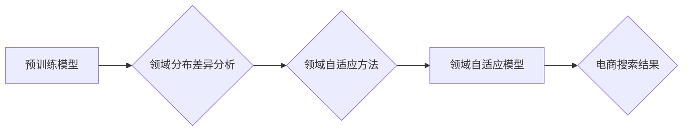

                 

## 电商搜索的领域自适应技术

> 关键词：电商搜索、领域自适应、推荐系统、机器学习、自然语言处理、个性化搜索、用户行为分析

## 1. 背景介绍

电商平台作为现代商业的重要组成部分，其搜索引擎扮演着至关重要的角色。用户通过搜索引擎查找所需商品，搜索结果的质量直接影响着用户的购物体验和平台的商业成功。然而，传统的电商搜索引擎往往面临着以下挑战：

* **数据稀疏性:**  电商平台商品种类繁多，每个商品的搜索词语和用户行为数据都可能非常稀疏，导致模型训练不足。
* **用户多样性:**  用户的搜索意图、偏好和购物习惯各不相同，传统的搜索引擎难以满足个性化需求。
* **领域变化:**  电商平台商品种类和用户需求不断变化，搜索引擎需要能够快速适应新的领域和趋势。

为了解决这些挑战，领域自适应技术应运而生。领域自适应技术旨在通过学习不同领域的数据分布和特征，将预训练模型迁移到新的领域，从而提高搜索结果的准确性和相关性。

## 2. 核心概念与联系

领域自适应技术的核心在于将预训练模型的知识迁移到新的领域，并根据新的领域数据进行微调。

**2.1 核心概念**

* **预训练模型:**  在大量通用数据上训练的深度学习模型，例如BERT、RoBERTa等，已经具备了丰富的语言理解能力。
* **源域:**  预训练模型训练使用的原始数据来源，例如维基百科、书籍等。
* **目标域:**  需要进行领域自适应的特定领域，例如电商平台商品搜索。
* **领域分布差异:**  源域和目标域数据分布的差异，例如词汇、语法、语义等方面的差异。

**2.2 架构图**



## 3. 核心算法原理 & 具体操作步骤

### 3.1 算法原理概述

领域自适应算法的核心目标是减小源域和目标域之间的分布差异，从而提高预训练模型在目标域上的性能。常用的领域自适应方法包括：

* **数据变换:**  通过对源域数据进行变换，例如词嵌入转换、数据增强等，使其更接近目标域的数据分布。
* **模型调整:**  通过对预训练模型进行微调，例如调整模型参数、添加领域特有的层等，使其能够更好地适应目标域的数据。
* **混合学习:**  将源域和目标域的数据进行混合训练，让模型学习到两者的共同特征和差异。

### 3.2 算法步骤详解

以数据变换方法为例，具体操作步骤如下：

1. **数据预处理:**  对源域和目标域的数据进行清洗、分词、词嵌入等预处理操作。
2. **特征提取:**  使用预训练模型提取源域和目标域数据的特征表示。
3. **分布对齐:**  使用距离度量或映射函数对源域和目标域的特征分布进行对齐，例如使用最大均值差异（MMD）或对抗训练等方法。
4. **模型微调:**  将对齐后的特征数据用于微调预训练模型，使其能够更好地适应目标域的数据分布。

### 3.3 算法优缺点

**优点:**

* 可以有效减小源域和目标域之间的分布差异。
* 可以利用预训练模型的知识，提高模型的性能。
* 可以降低模型训练的成本和时间。

**缺点:**

* 需要大量的源域和目标域数据。
* 需要选择合适的领域自适应方法和参数。
* 仍然存在一定的性能差距与通用模型。

### 3.4 算法应用领域

领域自适应技术广泛应用于以下领域：

* **电商搜索:**  将预训练模型迁移到电商平台，提高商品搜索的准确性和相关性。
* **医疗诊断:**  将预训练模型迁移到医疗领域，辅助医生进行疾病诊断。
* **金融风险评估:**  将预训练模型迁移到金融领域，评估客户的信用风险。
* **自然语言理解:**  将预训练模型迁移到特定领域，例如法律、法律、科技等，提高自然语言理解的准确性。

## 4. 数学模型和公式 & 详细讲解 & 举例说明

### 4.1 数学模型构建

领域自适应问题可以被建模为一个概率分布的迁移问题。假设源域的数据分布为 $P_S$，目标域的数据分布为 $P_T$，预训练模型在源域上的性能为 $f_S(x)$，目标域上的性能为 $f_T(x)$。

领域自适应的目标是找到一个映射函数 $g$，使得 $f_T(g(x))$ 尽可能接近 $f_S(x)$。

### 4.2 公式推导过程

常用的领域自适应方法，例如最大均值差异（MMD）方法，可以利用以下公式进行推导：

$$
MMD(P_S, P_T) = \sup_{f \in F} |E_{x \sim P_S} f(x) - E_{x \sim P_T} f(x)|
$$

其中，$F$ 是一个函数空间，$E_{x \sim P}$ 表示在分布 $P$ 上取样后的期望。

MMD 方法的目标是找到一个函数 $f$，使得源域和目标域的特征分布在该函数空间上的距离最大化。

### 4.3 案例分析与讲解

假设我们有一个预训练的文本分类模型，在新闻领域表现良好，但需要将其迁移到电商评论领域。

我们可以使用 MMD 方法进行领域自适应。首先，我们使用预训练模型提取新闻和电商评论的特征表示。然后，我们使用 MMD 方法计算新闻和电商评论的特征分布之间的距离。最后，我们使用该距离作为损失函数，对预训练模型进行微调，使其能够更好地适应电商评论的数据分布。

## 5. 项目实践：代码实例和详细解释说明

### 5.1 开发环境搭建

* Python 3.7+
* TensorFlow 2.0+
* PyTorch 1.0+
* NLTK
* Scikit-learn

### 5.2 源代码详细实现

```python
# 导入必要的库
import tensorflow as tf
from tensorflow.keras.layers import Embedding, LSTM, Dense
from tensorflow.keras.models import Sequential

# 定义模型
model = Sequential()
model.add(Embedding(input_dim=vocab_size, output_dim=embedding_dim))
model.add(LSTM(units=128))
model.add(Dense(units=num_classes, activation='softmax'))

# 编译模型
model.compile(optimizer='adam', loss='sparse_categorical_crossentropy', metrics=['accuracy'])

# 训练模型
model.fit(x_train, y_train, epochs=10, batch_size=32)

# 评估模型
loss, accuracy = model.evaluate(x_test, y_test)
print('Loss:', loss)
print('Accuracy:', accuracy)
```

### 5.3 代码解读与分析

* **Embedding 层:** 将词语转换为稠密的向量表示。
* **LSTM 层:** 学习文本序列中的长短时依赖关系。
* **Dense 层:** 输出分类结果。
* **编译模型:** 选择优化器、损失函数和评价指标。
* **训练模型:** 使用训练数据训练模型。
* **评估模型:** 使用测试数据评估模型的性能。

### 5.4 运行结果展示

训练完成后，我们可以使用测试数据评估模型的性能，例如计算准确率、召回率等指标。

## 6. 实际应用场景

### 6.1 电商搜索场景

* **商品推荐:**  根据用户的搜索历史、浏览记录和购买行为，推荐相关的商品。
* **个性化搜索:**  根据用户的兴趣偏好和搜索习惯，提供个性化的搜索结果。
* **搜索结果排序:**  根据商品的 relevance、popularity、price 等因素，对搜索结果进行排序。

### 6.2 其他应用场景

* **问答系统:**  根据用户的提问，从知识库中找到相关的答案。
* **文本摘要:**  自动生成文本的摘要。
* **机器翻译:**  将文本从一种语言翻译成另一种语言。

### 6.4 未来应用展望

随着人工智能技术的不断发展，领域自适应技术将在更多领域得到应用，例如：

* **医疗诊断:**  将预训练模型迁移到医疗领域，辅助医生进行疾病诊断。
* **金融风险评估:**  将预训练模型迁移到金融领域，评估客户的信用风险。
* **法律文本分析:**  将预训练模型迁移到法律领域，分析法律文本并提供法律建议。

## 7. 工具和资源推荐

### 7.1 学习资源推荐

* **书籍:**
    * 《深度学习》 by Ian Goodfellow, Yoshua Bengio, and Aaron Courville
    * 《自然语言处理》 by Dan Jurafsky and James H. Martin
* **在线课程:**
    * Coursera: Deep Learning Specialization
    * Udacity: Natural Language Processing Nanodegree

### 7.2 开发工具推荐

* **TensorFlow:**  开源机器学习框架。
* **PyTorch:**  开源机器学习框架。
* **Hugging Face Transformers:**  预训练模型库。

### 7.3 相关论文推荐

* **Domain Adaptation for Natural Language Processing** by Andrew D. Maas
* **A Survey on Domain Adaptation** by Zhi-Hua Zhou
* **Transfer Learning** by Yoshua Bengio, Jean-François Dauphin, and Aaron Courville

## 8. 总结：未来发展趋势与挑战

### 8.1 研究成果总结

领域自适应技术在电商搜索等领域取得了显著的成果，有效提高了模型的性能和泛化能力。

### 8.2 未来发展趋势

* **更有效的领域自适应方法:**  研究更有效的领域自适应方法，例如迁移学习、对抗训练等。
* **更强大的预训练模型:**  开发更强大的预训练模型，例如多模态预训练模型、跨语言预训练模型等。
* **更个性化的搜索体验:**  利用领域自适应技术，提供更个性化的搜索体验，例如根据用户的兴趣偏好和搜索习惯进行个性化推荐。

### 8.3 面临的挑战

* **数据稀疏性:**  许多领域的数据都比较稀疏，这使得领域自适应变得更加困难。
* **领域分布差异:**  不同领域的分布差异可能很大，这使得需要开发更鲁棒的领域自适应方法。
* **模型解释性:**  许多领域自适应方法都是黑盒模型，难以解释模型的决策过程。

### 8.4 研究展望

未来，领域自适应技术将继续朝着更有效、更强大、更解释性的方向发展，为电商搜索和其他领域带来更多创新和突破。

## 9. 附录：常见问题与解答

**Q1: 领域自适应技术与迁移学习有什么区别？**

**A1:** 领域自适应技术是一种迁移学习的范式，它旨在将预训练模型迁移到新的领域。

**Q2: 领域自适应技术有哪些应用场景？**

**A2:** 领域自适应技术广泛应用于电商搜索、医疗诊断、金融风险评估、自然语言理解等领域。

**Q3: 如何选择合适的领域自适应方法？**

**A3:** 选择合适的领域自适应方法需要根据具体应用场景和数据特点进行选择。

**作者：禅与计算机程序设计艺术 / Zen and the Art of Computer Programming**<end_of_turn>

