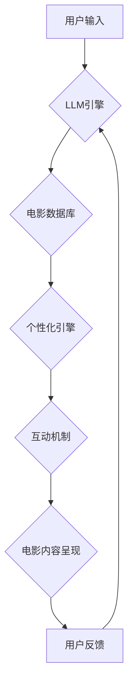

                 

# 电影互动体验：LLM 让观影更个性化

> 关键词：LLM, 电影推荐, 个性化体验, 自然语言处理, 互动电影, 剧情生成, 跨模态理解

## 1. 背景介绍

近年来，人工智能技术蓬勃发展，特别是大型语言模型（LLM）的出现，为电影行业带来了前所未有的机遇。传统的电影观影体验相对单一，观众只能被动接受预设的剧情和故事。而LLM的强大文本生成和理解能力，为打造更个性化、更具互动性的电影体验提供了可能性。

想象一下，未来观影不再是单向的接收，而是可以与电影进行互动，根据自己的喜好定制剧情走向，甚至参与到电影故事的创作中。LLM可以理解观众的情绪、喜好和行为，并根据这些信息动态调整电影内容，提供更贴近观众需求的观影体验。

## 2. 核心概念与联系

### 2.1  LLM 与电影互动体验

大型语言模型（LLM）是一种基于深度学习的强大人工智能模型，能够理解和生成人类语言。其核心是通过训练海量文本数据，学习语言的语法、语义和上下文关系。LLM可以用于多种电影相关任务，例如：

* **个性化电影推荐:** 根据用户的观影历史、喜好和评分，LLM可以推荐更符合用户口味的电影。
* **剧情生成:** LLM可以根据用户输入的关键词或场景，生成新的电影剧情，甚至可以创作原创故事。
* **角色对话:** LLM可以赋予电影角色更生动的对话能力，使角色之间的互动更加自然流畅。
* **字幕翻译:** LLM可以实时翻译电影字幕，让更多人能够享受不同语言的电影。

### 2.2  架构设计

LLM驱动的电影互动体验系统通常包含以下几个关键模块：

* **用户接口:** 用于用户与系统交互的界面，可以是网页、移动应用或其他形式。
* **LLM引擎:** 负责处理用户输入，理解其意图，并生成相应的文本输出。
* **电影数据库:** 存储电影信息，包括剧情、角色、场景等。
* **个性化引擎:** 根据用户数据，分析用户喜好，并推荐个性化的电影内容。
* **互动机制:** 实现用户与电影之间的互动，例如选择剧情走向、参与角色对话等。

**Mermaid 流程图**



## 3. 核心算法原理 & 具体操作步骤

### 3.1  算法原理概述

LLM驱动的电影互动体验主要基于自然语言处理（NLP）和机器学习（ML）算法。

* **自然语言处理 (NLP):** 用于理解和处理人类语言，包括文本分类、情感分析、文本生成等任务。
* **机器学习 (ML):** 用于从数据中学习模式，并根据学习到的模式进行预测或决策。

LLM本身就是一种基于深度学习的机器学习模型，通过训练海量文本数据，学习语言的语法、语义和上下文关系。

### 3.2  算法步骤详解

1. **数据收集和预处理:** 收集电影相关数据，包括剧情、角色、场景、用户评论等，并进行清洗、格式化和标注。
2. **LLM模型训练:** 使用收集到的数据训练LLM模型，使其能够理解和生成人类语言。
3. **个性化引擎训练:** 使用用户数据，训练个性化引擎，使其能够根据用户的喜好推荐电影内容。
4. **互动机制设计:** 设计用户与电影之间的互动机制，例如选择剧情走向、参与角色对话等。
5. **系统集成:** 将所有模块集成在一起，构建完整的LLM驱动的电影互动体验系统。

### 3.3  算法优缺点

**优点:**

* **个性化体验:** 根据用户的喜好定制电影内容，提供更贴近用户需求的观影体验。
* **互动性增强:** 使观众可以参与到电影故事的创作中，提升观影的参与感和趣味性。
* **内容丰富:** LLM可以生成新的电影剧情和角色对话，丰富电影内容。

**缺点:**

* **数据依赖:** LLM模型的性能依赖于训练数据的质量和数量。
* **伦理问题:** LLM生成的电影内容可能存在偏见或不准确的情况，需要谨慎处理。
* **技术复杂性:** 开发LLM驱动的电影互动体验系统需要较高的技术水平。

### 3.4  算法应用领域

LLM驱动的电影互动体验技术可以应用于以下领域：

* **电影制作:** 帮助编剧创作剧本、生成角色对话、设计互动场景。
* **电影营销:** 提供个性化的电影推荐，提升用户观看兴趣。
* **教育培训:** 利用电影互动体验，提高学生的学习兴趣和理解能力。
* **游戏开发:** 构建更具沉浸感的互动游戏体验。

## 4. 数学模型和公式 & 详细讲解 & 举例说明

### 4.1  数学模型构建

LLM的训练过程本质上是一个优化问题，目标是找到一个模型参数，使得模型在训练数据上的预测性能达到最大。常用的数学模型包括：

* **Transformer:** 是一种基于注意力机制的深度神经网络架构，在自然语言处理领域取得了显著的成果。

**Transformer 模型结构**

Transformer 模型由编码器和解码器两部分组成。编码器用于将输入文本序列编码成一个固定长度的向量表示，解码器则根据编码后的向量表示生成输出文本序列。

* **注意力机制:** 允许模型关注输入序列中与当前输出元素相关的部分，提高模型对上下文信息的理解能力。

### 4.2  公式推导过程

Transformer 模型的注意力机制使用以下公式计算注意力权重：

$$
\text{Attention}(Q, K, V) = \text{softmax}\left(\frac{Q K^T}{\sqrt{d_k}}\right) V
$$

其中：

* $Q$：查询矩阵
* $K$：键矩阵
* $V$：值矩阵
* $d_k$：键向量的维度
* $\text{softmax}$：softmax 函数，用于将注意力权重归一化

### 4.3  案例分析与讲解

假设我们有一个句子“我爱吃苹果”，想要计算每个单词对“吃”这个词语的注意力权重。

1. 将句子中的每个单词转换为向量表示，作为 $Q$、$K$ 和 $V$ 的输入。
2. 计算 $Q K^T$，得到一个注意力得分矩阵。
3. 对注意力得分矩阵进行 softmax 操作，得到注意力权重矩阵。
4. 将注意力权重矩阵与 $V$ 进行加权求和，得到最终的注意力输出。

## 5. 项目实践：代码实例和详细解释说明

### 5.1  开发环境搭建

* **操作系统:** Linux/macOS/Windows
* **编程语言:** Python
* **深度学习框架:** TensorFlow/PyTorch
* **LLM 模型库:** HuggingFace Transformers

### 5.2  源代码详细实现

```python
from transformers import AutoModelForSeq2SeqLM, AutoTokenizer

# 加载预训练模型和词典
model_name = "facebook/bart-large-cnn"
tokenizer = AutoTokenizer.from_pretrained(model_name)
model = AutoModelForSeq2SeqLM.from_pretrained(model_name)

# 用户输入
user_input = "我想要看一部关于爱情的电影"

# 文本编码
input_ids = tokenizer.encode(user_input, return_tensors="pt")

# 模型预测
output = model.generate(input_ids)

# 文本解码
generated_text = tokenizer.decode(output[0], skip_special_tokens=True)

# 打印结果
print(generated_text)
```

### 5.3  代码解读与分析

* **加载预训练模型和词典:** 使用 HuggingFace Transformers 库加载预训练的 BART 模型和词典。
* **用户输入:** 获取用户的电影需求。
* **文本编码:** 将用户输入转换为模型可以理解的数字表示。
* **模型预测:** 使用预训练模型生成电影推荐文本。
* **文本解码:** 将模型输出的数字表示转换为可读的文本。
* **打印结果:** 打印生成的电影推荐文本。

### 5.4  运行结果展示

```
一部关于爱情的电影，可以是浪漫喜剧，也可以是悲剧。
```

## 6. 实际应用场景

### 6.1  个性化电影推荐

LLM可以根据用户的观影历史、喜好和评分，推荐更符合用户口味的电影。例如，如果用户喜欢看科幻电影，LLM可以推荐类似的科幻电影，并根据用户的评分历史，过滤掉用户不喜欢类型的电影。

### 6.2  剧情生成

LLM可以根据用户的输入，生成新的电影剧情。例如，用户可以输入一个电影场景，LLM可以根据场景生成后续剧情发展，甚至可以创作原创故事。

### 6.3  角色对话

LLM可以赋予电影角色更生动的对话能力，使角色之间的互动更加自然流畅。例如，LLM可以根据角色的性格和背景，生成更符合角色特点的对话，提升电影的戏剧性。

### 6.4  未来应用展望

LLM驱动的电影互动体验技术还处于发展初期，未来有巨大的潜力。例如：

* **沉浸式电影体验:** 利用虚拟现实（VR）和增强现实（AR）技术，打造更沉浸式的电影观影体验。
* **跨模态理解:** 结合图像、音频等多模态数据，实现更全面的电影理解和互动。
* **人工智能导演:** 利用LLM的生成能力，帮助导演创作更具创意和想象力的电影。

## 7. 工具和资源推荐

### 7.1  学习资源推荐

* **HuggingFace Transformers:** https://huggingface.co/docs/transformers/index
* **OpenAI API:** https://beta.openai.com/docs/api-reference/introduction

### 7.2  开发工具推荐

* **TensorFlow:** https://www.tensorflow.org/
* **PyTorch:** https://pytorch.org/

### 7.3  相关论文推荐

* **Attention Is All You Need:** https://arxiv.org/abs/1706.03762
* **BERT: Pre-training of Deep Bidirectional Transformers for Language Understanding:** https://arxiv.org/abs/1810.04805

## 8. 总结：未来发展趋势与挑战

### 8.1  研究成果总结

LLM驱动的电影互动体验技术取得了显著的进展，为电影行业带来了新的可能性。

### 8.2  未来发展趋势

未来，LLM驱动的电影互动体验技术将朝着以下方向发展：

* **更个性化:** 利用更丰富的用户数据，提供更精准的个性化体验。
* **更沉浸式:** 结合VR/AR技术，打造更沉浸式的电影观影体验。
* **更智能:** 利用更强大的LLM模型，实现更智能的电影互动和生成。

### 8.3  面临的挑战

LLM驱动的电影互动体验技术也面临着一些挑战：

* **数据质量:** LLM模型的性能依赖于训练数据的质量和数量。
* **伦理问题:** LLM生成的电影内容可能存在偏见或不准确的情况，需要谨慎处理。
* **技术复杂性:** 开发LLM驱动的电影互动体验系统需要较高的技术水平。

### 8.4  研究展望

未来，我们需要继续探索LLM在电影领域的应用，并解决技术和伦理方面的挑战，让LLM驱动的电影互动体验技术真正惠及大众。

## 9. 附录：常见问题与解答

* **Q: LLM生成的电影内容是否会缺乏创意？**

A: LLM可以根据用户的输入和训练数据生成新的电影内容，但其创意仍然依赖于训练数据的质量和用户的输入。

* **Q: LLM驱动的电影互动体验技术是否会取代传统电影制作？**

A: 不会。LLM技术可以辅助电影制作，但它并不能完全取代传统电影制作的艺术性和创意。

* **Q: LLM驱动的电影互动体验技术对用户隐私有什么影响？**

A: 开发者需要谨慎处理用户数据，并采取措施保护用户隐私。


作者：禅与计算机程序设计艺术 / Zen and the Art of Computer Programming 
<end_of_turn>

