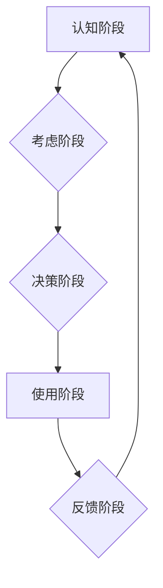

                 

## 知识付费产品的用户旅程优化

> 关键词：知识付费、用户旅程、优化、转化率、用户体验、数据分析、个性化推荐

### 1. 背景介绍

知识付费行业近年来发展迅速，从线上课程、直播带货到付费咨询，各种形式的知识付费产品层出不穷。然而，用户对知识付费产品的需求和体验也日益多元化，如何提升用户旅程的整体体验，提高转化率和用户留存率，成为知识付费平台亟需解决的关键问题。

传统知识付费平台往往将用户旅程简化为简单的购买流程，忽视了用户在整个学习和消费过程中的需求和感受。而用户旅程优化则强调从用户视角出发，对整个用户体验进行全方位分析和改进，以提升用户满意度和忠诚度。

### 2. 核心概念与联系

用户旅程优化 (User Journey Optimization) 是指通过对用户在与产品或服务交互过程中的行为、情感和认知进行深入分析，并根据分析结果，对产品、服务和相关流程进行优化，以提升用户体验、增加用户满意度和最终转化率。

**用户旅程** 可以理解为用户从最初接触产品到最终完成目标任务的整个过程，包括：

* **认知阶段:** 用户意识到自身需求，并开始寻找解决方案。
* **考虑阶段:** 用户评估不同的产品或服务，比较其优缺点。
* **决策阶段:** 用户最终选择购买或使用某个产品或服务。
* **使用阶段:** 用户开始使用产品或服务，并体验其功能和价值。
* **反馈阶段:** 用户对产品或服务进行评价和反馈，并影响其他用户的决策。

**用户旅程优化** 的核心目标是通过对每个阶段的分析和改进，提升用户体验，最终实现商业目标。

**Mermaid 流程图:**



### 3. 核心算法原理 & 具体操作步骤

#### 3.1 算法原理概述

用户旅程优化的核心算法原理主要基于数据分析和机器学习。通过收集用户行为数据，例如浏览记录、购买记录、评价反馈等，并运用机器学习算法进行分析，可以识别用户行为模式、预测用户需求，并根据分析结果进行个性化推荐和流程优化。

#### 3.2 算法步骤详解

1. **数据收集:** 收集用户在整个知识付费平台上的行为数据，包括用户注册信息、学习记录、购买记录、评价反馈等。
2. **数据清洗和预处理:** 对收集到的数据进行清洗和预处理，例如去除重复数据、处理缺失值、转换数据类型等。
3. **特征提取:** 从用户行为数据中提取特征，例如用户学习时长、学习进度、购买频率、评价内容等。
4. **模型训练:** 利用机器学习算法，例如决策树、支持向量机、神经网络等，对用户行为数据进行训练，建立用户画像和行为预测模型。
5. **用户画像构建:** 根据用户行为数据和特征，构建用户画像，例如用户兴趣爱好、学习习惯、消费能力等。
6. **个性化推荐:** 基于用户画像和行为预测模型，为用户提供个性化的课程推荐、学习计划和优惠活动。
7. **流程优化:** 分析用户在不同阶段的体验，例如注册流程、课程选择、支付流程等，并根据分析结果进行优化，提升用户体验。

#### 3.3 算法优缺点

**优点:**

* **数据驱动:** 基于数据分析和机器学习，能够更准确地识别用户需求和行为模式。
* **个性化:** 可以根据用户画像和行为预测模型，提供个性化的产品和服务推荐。
* **持续优化:** 通过不断收集和分析用户数据，可以持续优化用户旅程，提升用户体验。

**缺点:**

* **数据依赖:** 需要大量用户行为数据才能训练有效的模型。
* **模型复杂:** 机器学习模型的训练和维护需要一定的技术门槛。
* **隐私保护:** 需要妥善处理用户数据，确保用户隐私安全。

#### 3.4 算法应用领域

用户旅程优化算法广泛应用于各个领域，例如：

* **电商:** 个性化商品推荐、优化购物流程、提升转化率。
* **金融:** 个性化理财产品推荐、优化用户体验、降低流失率。
* **教育:** 个性化课程推荐、优化学习路径、提升学习效果。
* **医疗:** 个性化医疗服务推荐、优化患者体验、提高医疗效率。

### 4. 数学模型和公式 & 详细讲解 & 举例说明

#### 4.1 数学模型构建

用户旅程优化的数学模型可以基于用户行为数据和机器学习算法构建。例如，可以使用贝叶斯网络模型来预测用户的学习行为，或者使用协同过滤算法来推荐相关的课程。

#### 4.2 公式推导过程

具体的公式推导过程取决于所使用的机器学习算法。例如，协同过滤算法的核心公式是基于用户-物品交互矩阵的相似度计算，可以利用余弦相似度或皮尔逊相关系数来衡量用户之间的相似度。

#### 4.3 案例分析与讲解

假设我们想要预测用户的课程购买行为，可以使用逻辑回归模型。逻辑回归模型将用户特征作为输入，输出用户购买课程的概率。

**公式:**

$$P(购买) = \frac{1}{1 + e^{-(w_0 + w_1x_1 + w_2x_2 + ... + w_nx_n)}}$$

其中：

* $P(购买)$ 是用户购买课程的概率。
* $w_0, w_1, w_2, ..., w_n$ 是模型参数。
* $x_1, x_2, ..., x_n$ 是用户的特征，例如用户年龄、学习时长、评价分数等。

通过训练数据，我们可以学习到模型参数，并使用该模型预测新用户的购买行为。

### 5. 项目实践：代码实例和详细解释说明

#### 5.1 开发环境搭建

* Python 3.x
* Jupyter Notebook
* scikit-learn

#### 5.2 源代码详细实现

```python
from sklearn.linear_model import LogisticRegression
from sklearn.model_selection import train_test_split
from sklearn.metrics import accuracy_score

# 加载数据
data = pd.read_csv('user_data.csv')

# 划分训练集和测试集
X = data.drop('购买', axis=1)
y = data['购买']
X_train, X_test, y_train, y_test = train_test_split(X, y, test_size=0.2, random_state=42)

# 创建逻辑回归模型
model = LogisticRegression()

# 训练模型
model.fit(X_train, y_train)

# 预测测试集结果
y_pred = model.predict(X_test)

# 计算准确率
accuracy = accuracy_score(y_test, y_pred)
print(f'准确率: {accuracy}')
```

#### 5.3 代码解读与分析

* 首先，我们加载用户数据，并将其分为特征和目标变量。
* 然后，我们使用 train_test_split 函数将数据划分为训练集和测试集。
* 接下来，我们创建逻辑回归模型，并使用训练集进行模型训练。
* 最后，我们使用测试集预测结果，并计算模型的准确率。

#### 5.4 运行结果展示

运行上述代码后，我们可以得到模型的准确率，例如 0.85，表示模型在预测用户购买行为方面准确率为 85%。

### 6. 实际应用场景

#### 6.1 个性化课程推荐

根据用户的学习历史、兴趣爱好和学习进度，推荐个性化的课程，提升用户学习兴趣和效率。

#### 6.2 学习路径优化

根据用户的学习目标和能力水平，构建个性化的学习路径，引导用户循序渐进地学习，提升学习效果。

#### 6.3 互动式学习体验

通过互动式课程、直播答疑等方式，提升用户参与度和学习体验，增强用户粘性。

#### 6.4 针对不同阶段的用户体验优化

针对用户在不同阶段（认知、考虑、决策、使用、反馈）的体验特点，进行针对性的优化，例如：

* **认知阶段:** 提供更清晰的课程介绍和学习目标，吸引用户关注。
* **考虑阶段:** 提供用户评价和案例分析，帮助用户了解课程内容和价值。
* **决策阶段:** 提供优惠活动和试听课程，降低用户购买门槛。
* **使用阶段:** 提供学习进度跟踪、知识点回顾等功能，帮助用户巩固学习成果。
* **反馈阶段:** 提供用户评价和反馈机制，收集用户意见，不断优化课程内容和学习体验。

#### 6.5 未来应用展望

随着人工智能技术的不断发展，用户旅程优化将更加智能化和个性化。未来，我们可以期待以下应用场景：

* **基于深度学习的个性化推荐:** 利用深度学习算法，更精准地识别用户需求和兴趣，提供更个性化的课程推荐。
* **虚拟助手辅助学习:** 利用虚拟助手，为用户提供个性化的学习指导、答疑解惑和学习计划制定等服务。
* **沉浸式学习体验:** 利用虚拟现实和增强现实技术，打造更加沉浸式的学习体验，提升用户学习兴趣和效率。

### 7. 工具和资源推荐

#### 7.1 学习资源推荐

* **书籍:**

    * 《用户体验设计》
    * 《用户旅程地图》
    * 《数据驱动决策》

* **在线课程:**

    * Coursera: 用户体验设计
    * Udemy: 用户旅程优化
    * edX: 数据分析

#### 7.2 开发工具推荐

* **数据分析工具:**

    * Python (Pandas, NumPy, Scikit-learn)
    * R
    * Tableau

* **机器学习平台:**

    * TensorFlow
    * PyTorch
    * scikit-learn

#### 7.3 相关论文推荐

* **用户旅程优化:**

    * User Journey Mapping: A Practical Guide
    * Optimizing the User Journey: A Framework for Success

* **机器学习:**

    * Introduction to Machine Learning
    * Deep Learning

### 8. 总结：未来发展趋势与挑战

#### 8.1 研究成果总结

用户旅程优化在知识付费行业取得了显著成果，例如提升用户转化率、提高用户留存率、增强用户体验等。

#### 8.2 未来发展趋势

未来，用户旅程优化将更加智能化、个性化和数据驱动。

* **人工智能技术的应用:** 利用人工智能技术，例如深度学习和自然语言处理，更精准地识别用户需求和行为模式，提供更个性化的产品和服务推荐。
* **跨平台用户旅程:** 构建跨平台的用户旅程，例如将线上课程与线下活动相结合，提供更加丰富的学习体验。
* **用户反馈的实时应用:** 利用实时数据分析和反馈机制，及时调整产品和服务，提升用户体验。

#### 8.3 面临的挑战

* **数据隐私保护:** 用户数据安全和隐私保护是用户旅程优化面临的重要挑战。
* **模型复杂度:** 构建和维护复杂的机器学习模型需要一定的技术门槛。
* **用户体验的衡量:** 如何准确衡量用户体验，并将其与商业目标相结合，也是一个需要不断探索的问题。

#### 8.4 研究展望

未来，我们需要继续探索用户旅程优化的新方法和技术，例如：

* **基于行为分析的个性化推荐:** 利用用户行为数据，更精准地预测用户的学习需求和兴趣，提供更加个性化的课程推荐。
* **虚拟现实和增强现实技术的应用:** 利用虚拟现实和增强现实技术，打造更加沉浸式的学习体验，提升用户学习兴趣和效率。
* **用户反馈的实时应用:** 利用实时数据分析和反馈机制，及时调整产品和服务，提升用户体验。


### 9. 附录：常见问题与解答

#### 9.1 如何收集用户数据？

可以通过以下方式收集用户数据：

* **用户注册信息:** 收集用户姓名、邮箱地址、联系电话等基本信息。
* **学习记录:** 记录用户学习课程的时间、进度、完成情况等。
* **购买记录:** 记录用户购买课程的类型、价格、时间等。
* **评价反馈:** 收集用户对课程的评价和反馈意见。

#### 9.2 如何保护用户数据隐私？

在收集和使用用户数据时，需要严格遵守相关法律法规，并采取以下措施保护用户数据隐私：

* **数据加密:** 对用户数据进行加密存储和传输，防止数据泄露。
* **匿名化处理:** 对用户数据进行匿名化处理，避免识别用户的个人信息。
* **数据访问控制:** 对用户数据进行严格的访问控制，确保只有授权人员才能访问数据。
* **用户隐私政策:** 明确告知用户如何收集、使用和保护用户数据，并获得用户的同意。

#### 9.3 如何评估用户旅程优化的效果？

可以通过以下指标评估用户旅程优化的效果：

* **转化率:** 用户完成目标任务的比例，例如购买课程的比例。
* **留存率:** 用户持续使用产品的比例，例如一周内再次登录的比例。
* **用户满意度:** 用户对产品和服务的满意程度，可以通过问卷调查等方式收集。
* **用户反馈:** 用户对产品和服务的评价和建议，可以通过评论、邮件等方式收集。


作者：禅与计算机程序设计艺术 / Zen and the Art of Computer Programming 
<end_of_turn>

