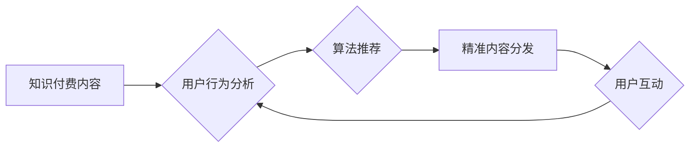

                 

## 知识付费创业中的内容分发策略

> 关键词：知识付费、内容分发、用户行为、算法推荐、数据分析、内容运营、平台生态

## 1. 背景介绍

知识付费行业近年来蓬勃发展，越来越多的专家学者和创作者通过线上平台分享知识和技能，并从中获得收益。然而，在知识付费市场竞争日益激烈的环境下，内容分发策略显得尤为重要。 

传统的营销模式难以有效触达目标用户，而内容分发策略则可以帮助知识付费创业者精准定位用户群体，将内容推送至最合适的受众，从而提高内容曝光率、转化率和用户粘性。

## 2. 核心概念与联系

### 2.1 内容分发

内容分发是指将知识付费内容通过各种渠道和平台，精准推送至目标用户的过程。它涉及到内容的策划、制作、包装、推广以及用户行为分析等多个环节。

### 2.2 用户行为分析

用户行为分析是指通过收集和分析用户在平台上的行为数据，例如浏览记录、点击行为、购买记录等，以了解用户兴趣、偏好和需求，从而为内容分发提供数据支持。

### 2.3 算法推荐

算法推荐是指利用机器学习和数据挖掘技术，根据用户的历史行为和特征，预测用户可能感兴趣的内容，并将其推荐给用户。

**核心概念与联系流程图:**



## 3. 核心算法原理 & 具体操作步骤

### 3.1 算法原理概述

内容分发算法的核心在于精准匹配用户需求和内容主题。常用的算法包括：

* **协同过滤算法:** 根据用户对相似内容的喜好进行推荐。
* **内容基准算法:** 根据内容的主题、标签、关键词等特征进行推荐。
* **混合推荐算法:** 结合协同过滤和内容基准算法，提高推荐精准度。

### 3.2 算法步骤详解

1. **数据收集:** 收集用户行为数据，例如浏览记录、点击行为、购买记录、评分等。
2. **数据预处理:** 对收集到的数据进行清洗、转换和特征提取，例如去除重复数据、转换数据类型、提取关键词等。
3. **模型训练:** 利用机器学习算法，对预处理后的数据进行训练，建立推荐模型。
4. **推荐生成:** 根据用户的历史行为和特征，利用训练好的模型生成推荐内容列表。
5. **结果评估:** 对推荐结果进行评估，例如点击率、转化率等指标，并根据评估结果不断优化模型参数。

### 3.3 算法优缺点

**优点:**

* 精准推荐: 能够根据用户的兴趣和需求，推荐更符合其偏好的内容。
* 个性化体验: 为每个用户提供个性化的内容推荐，提升用户体验。
* 数据驱动: 基于数据分析和算法模型，推荐结果更加客观和科学。

**缺点:**

* 数据依赖: 算法推荐需要大量用户行为数据作为训练样本，数据质量直接影响推荐效果。
* 冷启动问题: 对新用户和新内容的推荐效果较差，需要时间积累数据进行训练。
* 算法黑盒: 某些算法模型过于复杂，难以解释推荐结果背后的逻辑，缺乏透明度。

### 3.4 算法应用领域

* **电商推荐:** 推荐商品、优惠券、促销活动等。
* **视频平台推荐:** 推荐视频、直播、用户关注等。
* **音乐平台推荐:** 推荐歌曲、专辑、音乐人等。
* **社交平台推荐:** 推荐好友、群组、话题等。
* **新闻资讯推荐:** 推荐新闻、文章、博客等。

## 4. 数学模型和公式 & 详细讲解 & 举例说明

### 4.1 数学模型构建

协同过滤算法的核心是计算用户对物品的相似度。常用的相似度度量方法包括余弦相似度和皮尔逊相关系数。

**余弦相似度:**

$$
\text{相似度} = \frac{\mathbf{u} \cdot \mathbf{v}}{\|\mathbf{u}\| \|\mathbf{v}\|}
$$

其中，$\mathbf{u}$ 和 $\mathbf{v}$ 分别表示两个用户的评分向量，$\cdot$ 表示点积，$\|\mathbf{u}\|$ 和 $\|\mathbf{v}\|$ 分别表示两个向量的模长。

**皮尔逊相关系数:**

$$
\text{相似度} = \frac{\sum_{i=1}^{n}(u_i - \bar{u})(v_i - \bar{v})}{\sqrt{\sum_{i=1}^{n}(u_i - \bar{u})^2} \sqrt{\sum_{i=1}^{n}(v_i - \bar{v})^2}}
$$

其中，$u_i$ 和 $v_i$ 分别表示两个用户对第 $i$ 个物品的评分，$\bar{u}$ 和 $\bar{v}$ 分别表示两个用户的平均评分。

### 4.2 公式推导过程

余弦相似度的推导过程基于向量空间模型。用户和物品可以看作是向量空间中的点，用户对物品的评分可以看作是向量之间的夹角。余弦相似度则等于两个向量的夹角的余弦值，表示两个向量的相似程度。

皮尔逊相关系数的推导过程基于统计学中的相关系数概念。相关系数衡量两个变量之间的线性相关性。

### 4.3 案例分析与讲解

假设有两个用户 A 和 B，他们对三部电影的评分如下：

| 电影 | 用户 A | 用户 B |
|---|---|---|
| 电影 1 | 5 | 4 |
| 电影 2 | 3 | 2 |
| 电影 3 | 4 | 5 |

我们可以使用余弦相似度和皮尔逊相关系数计算用户 A 和 B 的相似度。

**余弦相似度:**

$$
\text{相似度} = \frac{(5 \times 4) + (3 \times 2) + (4 \times 5)}{\sqrt{5^2 + 3^2 + 4^2} \sqrt{4^2 + 2^2 + 5^2}} = \frac{46}{\sqrt{50} \sqrt{45}} \approx 0.89
$$

**皮尔逊相关系数:**

$$
\text{相似度} = \frac{(5-3.67)(4-3.67) + (3-3.67)(2-3.67) + (4-3.67)(5-3.67)}{\sqrt{(5-3.67)^2 + (3-3.67)^2 + (4-3.67)^2} \sqrt{(4-3.67)^2 + (2-3.67)^2 + (5-3.67)^2}} \approx 0.89
$$

从计算结果可以看出，用户 A 和 B 的相似度较高，说明他们对电影的喜好有一定的相似性。

## 5. 项目实践：代码实例和详细解释说明

### 5.1 开发环境搭建

* Python 3.x
* scikit-learn 库
* pandas 库
* numpy 库

### 5.2 源代码详细实现

```python
import pandas as pd
from sklearn.metrics.pairwise import cosine_similarity

# 加载用户评分数据
data = pd.read_csv('user_ratings.csv')

# 构建用户评分矩阵
user_ratings = data.pivot_table(index='user_id', columns='movie_id', values='rating')

# 计算余弦相似度
similarity_matrix = cosine_similarity(user_ratings)

# 获取用户 A 和用户 B 的相似度
user_A_id = 1
user_B_id = 2
similarity = similarity_matrix[user_A_id - 1][user_B_id - 1]

print(f'用户 {user_A_id} 和用户 {user_B_id} 的相似度为: {similarity}')
```

### 5.3 代码解读与分析

* 首先，我们加载用户评分数据，并将其转换为用户评分矩阵。
* 然后，我们使用 scikit-learn 库中的 cosine_similarity 函数计算用户之间的余弦相似度。
* 最后，我们获取用户 A 和用户 B 的相似度，并将其打印出来。

### 5.4 运行结果展示

运行上述代码后，会输出用户 A 和用户 B 的相似度值。

## 6. 实际应用场景

### 6.1 内容推荐

知识付费平台可以利用用户行为数据和算法推荐，为用户推荐相关的课程、文章、视频等内容，提高用户粘性和转化率。

### 6.2 个性化学习路径

根据用户的学习进度、兴趣和目标，平台可以构建个性化的学习路径，推荐合适的学习资源，提升用户学习效率。

### 6.3 社区运营

平台可以利用算法推荐，将用户与兴趣相投的学习者连接起来，促进用户之间的互动和交流，构建活跃的学习社区。

### 6.4 内容营销

知识付费创业者可以利用算法推荐，将内容推广至目标用户群体，提高内容曝光率和影响力。

### 6.4 未来应用展望

随着人工智能技术的不断发展，内容分发策略将更加智能化、个性化和精准化。未来，知识付费平台将更加注重用户体验，提供更加个性化的学习和交流服务。

## 7. 工具和资源推荐

### 7.1 学习资源推荐

* **机器学习算法**: Andrew Ng 的机器学习课程 (https://www.coursera.org/learn/machine-learning)
* **推荐系统**:  推荐系统实践 (https://www.bilibili.com/video/BV175411K72Q)

### 7.2 开发工具推荐

* **Python**: https://www.python.org/
* **scikit-learn**: https://scikit-learn.org/stable/
* **pandas**: https://pandas.pydata.org/
* **numpy**: https://numpy.org/

### 7.3 相关论文推荐

* **Collaborative Filtering for Implicit Feedback Datasets**: https://dl.acm.org/doi/10.1145/2901868.2905893
* **Matrix Factorization Techniques for Recommender Systems**: https://dl.acm.org/doi/10.1145/1201806.1201829

## 8. 总结：未来发展趋势与挑战

### 8.1 研究成果总结

知识付费创业中的内容分发策略已经取得了显著的成果，算法推荐技术能够有效提高内容曝光率和转化率。

### 8.2 未来发展趋势

* **更精准的推荐**: 利用更先进的机器学习算法和数据分析技术，实现更精准的个性化推荐。
* **多模态内容推荐**: 将文本、图片、视频等多模态内容融合在一起，提供更丰富的推荐体验。
* **跨平台内容分发**: 实现内容在不同平台的跨平台分发，扩大内容的影响力。

### 8.3 面临的挑战

* **数据隐私**: 如何保护用户数据隐私，同时实现精准推荐，是一个重要的挑战。
* **算法公平性**: 算法推荐需要避免歧视和偏见，确保公平公正。
* **内容质量**: 算法推荐可能会导致内容同质化，需要加强对内容质量的监管。

### 8.4 研究展望

未来，知识付费创业中的内容分发策略将更加智能化、个性化和精准化，为用户提供更加丰富的学习和交流体验。


## 9. 附录：常见问题与解答

**Q1: 如何评估内容分发策略的效果？**

**A1:** 可以通过以下指标评估内容分发策略的效果：

* **点击率**: 用户点击推荐内容的比例。
* **转化率**: 用户点击推荐内容后，最终完成购买或注册的比例。
* **用户留存率**: 用户持续使用平台的比例。
* **用户满意度**: 用户对平台内容和服务的满意度。

**Q2: 如何解决冷启动问题？**

**A2:** 

* **利用用户画像**: 根据用户的基本信息和行为特征，进行粗略的推荐。
* **引入人工推荐**: 平台专家根据用户需求，进行人工推荐。
* **利用协同过滤算法**: 即使用户评分数据较少，也可以利用其他用户的相似度进行推荐。

**Q3: 如何保证算法推荐的公平性？**

**A3:** 

* **避免数据偏差**: 确保训练数据代表性，避免数据偏差导致的推荐歧视。
* **定期评估算法**: 定期评估算法的公平性，并进行调整优化。
* **提供反馈机制**: 给用户提供反馈机制，及时解决算法推荐中的问题。


作者：禅与计算机程序设计艺术 / Zen and the Art of Computer Programming 
<end_of_turn>

