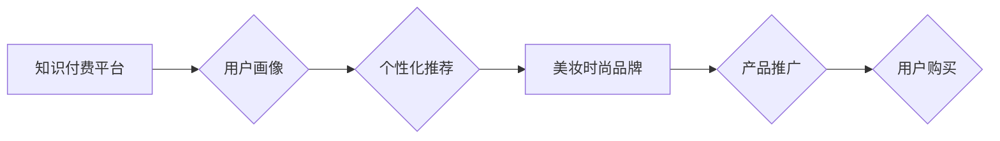

                 

## 关键词：知识付费、跨界营销、美妆时尚、人工智能、数据分析、用户画像、个性化推荐

## 1. 背景介绍

近年来，知识付费行业蓬勃发展，成为新兴的商业模式。与此同时，美妆时尚行业也面临着激烈的市场竞争，寻求新的增长点。两者之间存在着巨大的协同潜力，知识付费可以为美妆时尚行业提供新的营销思路和增长动力。

**1.1 知识付费的兴起**

随着互联网的普及和移动设备的广泛使用，人们对知识的需求日益增长。知识付费平台为用户提供便捷的学习方式，满足了人们对个性化、碎片化知识的需求。

**1.2 美妆时尚行业的挑战**

美妆时尚行业竞争激烈，用户需求多元化，品牌需要不断创新，寻找新的营销模式。传统营销方式难以精准触达目标用户，提升用户粘性。

**1.3 跨界营销的机遇**

跨界营销是指不同行业品牌之间进行合作，共同推广产品或服务。通过跨界合作，可以打破行业壁垒，拓展新的市场，提升品牌知名度和用户粘性。

## 2. 核心概念与联系

知识付费与美妆时尚跨界营销的核心概念在于利用知识付费平台的精准用户画像和个性化推荐能力，为美妆时尚品牌提供精准的营销解决方案。

**2.1 知识付费平台的优势**

* **精准用户画像:** 知识付费平台拥有海量用户数据，可以对用户进行精准画像，了解用户的兴趣爱好、消费习惯等信息。
* **个性化推荐:** 基于用户画像，知识付费平台可以提供个性化的知识推荐，提高用户学习兴趣和参与度。
* **付费用户群体:** 知识付费平台的用户群体付费意愿较高，更容易转化为消费用户。

**2.2 美妆时尚品牌的优势**

* **产品优势:** 美妆时尚品牌拥有丰富的产品线和专业知识，可以为用户提供优质的产品和服务。
* **品牌影响力:** 美妆时尚品牌拥有强大的品牌影响力，可以吸引更多用户关注。
* **营销渠道:** 美妆时尚品牌拥有丰富的营销渠道，可以将知识付费内容推广到更广泛的用户群体。

**2.3 跨界营销架构**



## 3. 核心算法原理 & 具体操作步骤

**3.1 算法原理概述**

知识付费与美妆时尚跨界营销的核心算法原理是基于用户画像和个性化推荐的算法。通过对用户数据进行分析，构建用户画像，并根据用户画像进行个性化推荐，提高用户参与度和转化率。

**3.2 算法步骤详解**

1. **数据收集:** 收集用户行为数据，包括用户浏览记录、购买记录、评论记录等。
2. **数据清洗:** 对收集到的数据进行清洗，去除无效数据和重复数据。
3. **特征提取:** 从用户行为数据中提取特征，例如用户年龄、性别、兴趣爱好、消费习惯等。
4. **用户画像构建:** 基于提取的特征，构建用户画像，将用户分为不同的用户群体。
5. **个性化推荐:** 根据用户画像，为用户推荐相关的知识付费内容和美妆时尚产品。
6. **效果评估:** 对推荐效果进行评估，不断优化算法模型。

**3.3 算法优缺点**

**优点:**

* 精准推荐: 基于用户画像，可以精准推荐用户感兴趣的内容和产品。
* 个性化体验: 为用户提供个性化的学习和购物体验。
* 提升转化率: 通过精准推荐，提高用户购买转化率。

**缺点:**

* 数据依赖: 算法效果依赖于数据质量和数据量。
* 算法复杂: 算法模型复杂，需要专业的技术人员进行开发和维护。
* 隐私安全: 用户数据安全需要得到保障。

**3.4 算法应用领域**

* **电商平台:** 为用户推荐商品，提升转化率。
* **内容平台:** 为用户推荐文章、视频等内容，提高用户粘性。
* **社交媒体:** 为用户推荐好友、话题等内容，提升用户互动。

## 4. 数学模型和公式 & 详细讲解 & 举例说明

**4.1 数学模型构建**

用户画像构建可以采用聚类算法，例如K-means算法。K-means算法将用户数据划分为K个簇，每个簇代表一个用户群体。

**4.2 公式推导过程**

K-means算法的目标是找到K个质心，使得每个用户到其所属质心的距离最小。

**距离公式:**

$$d(x, c) = \sqrt{\sum_{i=1}^{n}(x_i - c_i)^2}$$

其中:

* $x$ 是用户数据
* $c$ 是质心数据
* $n$ 是特征维度

**迭代公式:**

* 更新质心:

$$c_k = \frac{1}{n_k} \sum_{x \in C_k} x$$

其中:

* $c_k$ 是第k个质心
* $n_k$ 是第k个簇的用户数量
* $C_k$ 是第k个簇的用户集合

**4.3 案例分析与讲解**

假设我们有100个用户数据，我们想将用户划分为3个簇。我们可以使用K-means算法，通过迭代更新质心，最终得到3个用户簇。

## 5. 项目实践：代码实例和详细解释说明

**5.1 开发环境搭建**

* Python 3.x
* scikit-learn 库

**5.2 源代码详细实现**

```python
from sklearn.cluster import KMeans

# 用户数据
data = [[1, 2], [1.5, 1.8], [5, 8], [8, 8], [1, 0.6], [9, 11]]

# 创建KMeans模型，将用户数据划分为3个簇
kmeans = KMeans(n_clusters=3, random_state=0)
kmeans.fit(data)

# 获取每个用户的簇标签
labels = kmeans.labels_

# 打印每个用户的簇标签
print(labels)
```

**5.3 代码解读与分析**

* 我们首先导入KMeans算法库。
* 然后定义用户数据，这是一个二维数组，每个元素代表一个用户的特征。
* 创建KMeans模型，指定簇数量为3，并设置随机种子。
* 使用fit()方法训练模型，将用户数据划分为3个簇。
* 使用labels_属性获取每个用户的簇标签。

**5.4 运行结果展示**

运行代码后，会输出每个用户的簇标签，例如：[0, 1, 2, 0, 1, 2]。

## 6. 实际应用场景

**6.1 美妆时尚品牌案例**

美妆品牌可以利用知识付费平台的用户画像，为用户提供个性化的产品推荐和美妆教程。例如，一个美妆品牌可以根据用户的年龄、性别、肤质等信息，推荐适合用户的化妆产品和教程。

**6.2 知识付费平台案例**

知识付费平台可以与美妆时尚品牌合作，推出美妆相关的知识付费课程。例如，一个美妆博主可以将自己的化妆技巧和经验录制成视频课程，通过知识付费平台进行销售。

**6.3 未来应用展望**

随着人工智能技术的不断发展，知识付费与美妆时尚跨界营销将更加深入。未来，我们可以看到更多基于人工智能的个性化推荐、智能化客服、虚拟试妆等应用场景。

## 7. 工具和资源推荐

**7.1 学习资源推荐**

* **书籍:**
    * 《Python机器学习实战》
    * 《数据挖掘与数据分析》
* **在线课程:**
    * Coursera: 数据科学与机器学习
    * edX: 人工智能与深度学习

**7.2 开发工具推荐**

* **Python:** 
    * scikit-learn: 机器学习库
    * TensorFlow: 深度学习库
* **数据可视化工具:**
    * Tableau
    * Power BI

**7.3 相关论文推荐**

* **K-means聚类算法:**
    * MacQueen, J. (1967). Some methods for classification and analysis of multivariate observations. Proceedings of the fifth Berkeley symposium on mathematical statistics and probability, 1, 280-297.
* **个性化推荐算法:**
    * Resnick, P., Iacovou, N., Suchak, M., Bergstrom, P., & Riedl, J. (1994). GroupLens: An open architecture for collaborative filtering of netnews. Proceedings of the ACM conference on Computer supported cooperative work, 173-182.

## 8. 总结：未来发展趋势与挑战

**8.1 研究成果总结**

知识付费与美妆时尚跨界营销结合，可以为用户提供更精准、更个性化的服务，提升用户体验和品牌价值。

**8.2 未来发展趋势**

* **人工智能技术的应用:** 人工智能技术将进一步提升知识付费与美妆时尚跨界营销的精准度和效率。
* **跨平台融合:** 知识付费与美妆时尚跨界营销将更加融合，跨越平台边界，提供更全面的服务。
* **用户体验的提升:** 用户体验将成为核心竞争力，知识付费与美妆时尚跨界营销将更加注重用户需求和体验。

**8.3 面临的挑战**

* **数据安全和隐私保护:** 用户数据安全和隐私保护是需要重点关注的问题。
* **算法模型的复杂性:** 算法模型的复杂性需要专业技术人员进行开发和维护。
* **跨界合作的难点:** 跨界合作需要各方共同努力，克服沟通和协调的难点。

**8.4 研究展望**

未来，我们将继续研究知识付费与美妆时尚跨界营销的应用场景，探索更先进的算法模型和技术方案，为用户提供更优质的服务。

## 9. 附录：常见问题与解答

**9.1 如何构建用户画像？**

用户画像可以通过分析用户行为数据，例如浏览记录、购买记录、评论记录等，提取用户的特征，并将其划分为不同的用户群体。

**9.2 如何进行个性化推荐？**

个性化推荐可以通过分析用户的兴趣爱好、消费习惯等信息，推荐用户感兴趣的内容和产品。

**9.3 如何保障用户数据安全？**

用户数据安全需要采用加密技术、匿名化技术等措施，确保用户数据的安全性和隐私性。


作者：禅与计算机程序设计艺术 / Zen and the Art of Computer Programming 
<end_of_turn>

