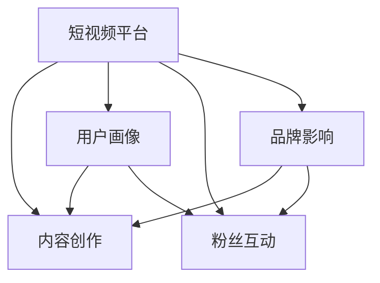

                 

# 如何利用短视频平台建立个人IP

> 关键词：短视频平台,IP建设,内容创作,粉丝互动,品牌影响,算法优化

## 1. 背景介绍

在数字经济飞速发展的今天，个人IP建设已成为创业者和内容创作者的重要竞争手段。尤其是在短视频平台上，诸如抖音、快手、YouTube等平台，个人IP的建立不仅能带来庞大的粉丝基础，还能转化为变现机会，进而推动商业模式的创新和业务发展。短视频平台基于算法推荐系统，能够精准识别用户偏好，自动匹配用户需求，极大地提升了内容分发的效率和精准度。因此，如何利用短视频平台的高效分发机制，打造个人IP，实现商业变现，成为亟需解决的问题。本文将系统梳理短视频平台的运营机制、用户画像构建、内容创作策略、粉丝互动模式、品牌影响路径，以及基于算法的优化方法，为创作者提供全方位的指导，帮助他们构建属于自己的IP，实现商业价值。

## 2. 核心概念与联系

### 2.1 核心概念概述

为了更好地理解如何利用短视频平台建立个人IP，本节将介绍几个关键概念：

- **短视频平台**：以抖音、快手、YouTube等为代表的社交媒体平台，通过算法推荐系统实现内容的精准分发，能够将创作者的内容推送给感兴趣的受众，提升内容曝光度和粉丝互动性。

- **内容创作**：创作者根据平台规则和用户偏好，自主拍摄和制作符合平台规范的视频内容，吸引粉丝关注和互动。

- **用户画像**：平台基于用户行为数据和社交网络信息，构建的详尽的用户画像，能够精准识别用户的兴趣、需求和行为模式。

- **粉丝互动**：创作者通过与粉丝的互动，如评论回复、直播互动等，提升用户粘性，建立稳固的粉丝基础。

- **品牌影响**：利用粉丝基础，创作者推广自有品牌或产品，实现商业变现，进而提升个人IP的商业价值。

- **算法优化**：通过分析平台推荐算法的工作机制，优化内容创作策略和互动模式，提升内容的分发效率和精准度。

这些概念之间的逻辑关系可以通过以下Mermaid流程图来展示：



这个流程图展示出短视频平台运营的核心链条：平台作为内容分发的枢纽，利用用户画像和算法优化，精准匹配内容与用户，促进内容创作和粉丝互动，最终实现品牌影响和商业变现。创作者通过理解这些核心概念，可以系统地构建自己的IP，并利用平台的高效分发机制实现粉丝的快速增长和商业价值的最大化。

## 3. 核心算法原理 & 具体操作步骤
### 3.1 算法原理概述

短视频平台的推荐算法主要基于协同过滤和深度学习技术，能够根据用户历史行为数据、偏好标签、兴趣图谱等信息，进行内容推荐。该算法的工作原理如下：

1. **协同过滤**：平台通过分析用户的行为数据（如观看时长、点赞、评论等）和历史互动数据，建立用户画像，识别出相似用户，推荐他们可能感兴趣的内容。协同过滤算法分为基于用户的协同过滤和基于项目的协同过滤。

2. **深度学习**：平台使用深度神经网络，对视频内容进行特征提取和建模，识别出视频的关键元素（如场景、音乐、颜色等），构建用户-内容关联图谱，优化推荐效果。

### 3.2 算法步骤详解

以下步骤详细说明如何在短视频平台上建立个人IP：

**Step 1: 账号准备与内容规划**

- 在短视频平台注册账号，完成个人资料设置，包括头像、简介、联系方式等，提升账号的可视性和可识别性。
- 制定内容创作计划，确定创作风格、主题和发布频率，确保内容连贯性和粉丝可预期性。

**Step 2: 用户画像构建与内容适配**

- 分析平台数据，如观看历史、点赞收藏、互动数据等，识别出目标受众的兴趣偏好，构建详细用户画像。
- 根据用户画像，优化内容创作，选择符合用户兴趣的视频类型、主题和风格，提升内容的相关性和吸引力。

**Step 3: 视频制作与发布策略**

- 使用专业设备拍摄高质量视频，遵循平台规则，避免低俗、暴力、敏感内容，保证内容质量。
- 运用剪辑技术优化视频节奏和视觉效果，提升观看体验。
- 制定发布计划，定期发布视频，保持平台活跃度，吸引粉丝关注。

**Step 4: 粉丝互动与关系管理**

- 积极回应粉丝评论，通过互动提升用户粘性，建立稳固的粉丝基础。
- 定期举行直播互动，回答粉丝问题，提升粉丝参与度。
- 组织粉丝活动，如挑战赛、投票等，增强粉丝归属感。

**Step 5: 品牌影响与商业变现**

- 通过内容营销推广自有品牌或产品，提升品牌知名度和市场影响力。
- 与品牌合作，开展植入式广告、品牌推广等商业活动，实现商业变现。
- 整合多种变现方式，如粉丝打赏、付费内容、商品销售等，最大化商业价值。

**Step 6: 算法优化与数据监控**

- 分析平台推荐算法，优化内容创作策略，提升内容曝光率和互动率。
- 实时监控粉丝互动数据，如评论量、点赞量、分享量等，及时调整内容方向。
- 使用数据分析工具，如Google Analytics、百度统计等，分析用户行为数据，优化互动模式和内容发布策略。

### 3.3 算法优缺点

短视频平台的推荐算法具有以下优点：

1. 高效分发：平台通过精准匹配内容与用户，提升内容的曝光率和互动率，帮助创作者快速积累粉丝基础。
2. 精准定位：利用用户画像和行为数据，识别出目标受众，提升内容的相关性和吸引力。
3. 灵活互动：支持实时互动功能，如评论回复、直播互动等，增强粉丝参与度和粘性。
4. 商业变现：基于粉丝基础，提供多种变现方式，如打赏、付费内容、广告等，实现商业价值。

同时，该算法也存在一些局限性：

1. 数据依赖：推荐算法高度依赖用户行为数据，缺乏多样化数据的平台可能影响推荐效果。
2. 算法黑箱：平台算法模型复杂，难以理解其推荐机制，创作者难以进行有效的内容优化。
3. 市场饱和：短视频内容市场竞争激烈，内容同质化现象严重，创作者难以脱颖而出。
4. 粉丝忠诚度：粉丝基础依赖内容质量，创作者需持续产出高质量内容，否则可能导致粉丝流失。

尽管存在这些局限性，但短视频平台的推荐算法仍是大IP建设的关键工具。创作者通过理解算法机制，优化内容创作策略和互动模式，仍可显著提升IP建设效果。

### 3.4 算法应用领域

短视频平台的推荐算法广泛适用于各类内容创作者，包括但不限于：

- 娱乐博主：通过发布搞笑视频、生活分享等内容，吸引粉丝关注，实现商业变现。
- 教育专家：通过讲解知识、分享学习技巧等内容，提升粉丝学习体验，进行知识付费变现。
- 生活博主：通过分享生活点滴、旅游攻略等内容，展示独特生活方式，吸引粉丝互动。
- 产品评测：通过测评各类产品，提供专业分析，吸引粉丝关注，进行产品推荐和销售。
- 健康博主：通过分享健康知识、营养饮食等内容，帮助粉丝改善生活方式，进行健康产品推广。

这些创作者通过与短视频平台的互动，借助算法的力量，构建个人IP，实现商业变现。随着平台算法的不断优化，相信这一趋势还将得到进一步加强。

## 4. 数学模型和公式 & 详细讲解  
### 4.1 数学模型构建

基于短视频平台的推荐算法，可以建立如下数学模型：

设用户集合为 $U$，视频集合为 $V$，用户-视频互动矩阵为 $R$，视频特征矩阵为 $F$。推荐系统模型 $M$ 的目标是最大化用户对视频的点击率 $C$：

$$
M = \arg\max_{R} \sum_{(u,v) \in U \times V} R_{u,v} \log P(C_{u,v})
$$

其中 $P(C_{u,v})$ 为点击率预测模型，$\log$ 为对数函数。通过最大化预测模型的总点击率，推荐系统可以优化用户对视频的曝光率和互动率。

### 4.2 公式推导过程

点击率预测模型 $P(C_{u,v})$ 可以进一步分解为两个部分：用户对视频的兴趣评分 $i_u(v)$ 和视频的相关性评分 $c_v$：

$$
P(C_{u,v}) = \frac{i_u(v)}{\sum_{v' \in V} i_u(v')} \times \frac{c_v}{\sum_{v \in V} c_v}
$$

其中 $i_u(v)$ 为用户的兴趣评分，$c_v$ 为视频的点击率。该公式将用户对视频的点击行为拆解为用户兴趣和视频相关性的乘积，从而优化推荐效果。

### 4.3 案例分析与讲解

以娱乐博主在抖音平台上进行IP建设为例，分析推荐算法的影响。博主通过发布搞笑视频，吸引粉丝关注，逐步积累粉丝基础。平台推荐算法会根据博主的历史互动数据和粉丝画像，精准匹配视频内容，提升视频的曝光率和互动率。此外，博主还可以使用热门标签（如#搞笑#、#解压#等），引导更多感兴趣的用户发现视频，进一步提升粉丝数量。通过不断的优化内容和互动策略，博主能够快速建立起自己的IP，实现商业变现。

## 5. 项目实践：代码实例和详细解释说明
### 5.1 开发环境搭建

在进行短视频内容创作和IP建设前，我们需要准备好开发环境。以下是使用Python进行短视频内容创作的开发环境配置流程：

1. 安装Anaconda：从官网下载并安装Anaconda，用于创建独立的Python环境。

2. 创建并激活虚拟环境：
```bash
conda create -n video-env python=3.8 
conda activate video-env
```

3. 安装PyTorch、Pandas等库：
```bash
pip install torch pandas numpy pytorch-lightning
```

4. 安装第三方库：
```bash
pip install matplotlib seaborn scikit-learn jupyter notebook
```

完成上述步骤后，即可在`video-env`环境中开始短视频内容创作和IP建设。

### 5.2 源代码详细实现

以下是一个基于Python和PyTorch的短视频内容创作和IP建设的示例代码：

```python
import torch
from torch.utils.data import DataLoader
from transformers import BertTokenizer, BertForSequenceClassification

# 1. 数据准备
# 使用Pandas加载用户行为数据，包含用户的点击行为、点赞行为等
import pandas as pd

data = pd.read_csv('user_behavior.csv')
train_data = data.sample(frac=0.8, random_state=42)
test_data = data.drop(train_data.index)

# 2. 数据预处理
tokenizer = BertTokenizer.from_pretrained('bert-base-cased')

def tokenize(data):
    return tokenizer(data['text'], padding='max_length', truncation=True)

train_data['tokens'] = train_data['text'].apply(tokenize)
test_data['tokens'] = test_data['text'].apply(tokenize)

# 3. 模型训练
model = BertForSequenceClassification.from_pretrained('bert-base-cased', num_labels=2)

optimizer = torch.optim.Adam(model.parameters(), lr=2e-5)

# 4. 模型训练
def train_epoch(model, data_loader, optimizer):
    model.train()
    for batch in data_loader:
        input_ids = batch['input_ids'].to(device)
        attention_mask = batch['attention_mask'].to(device)
        labels = batch['labels'].to(device)
        model.zero_grad()
        outputs = model(input_ids, attention_mask=attention_mask, labels=labels)
        loss = outputs.loss
        loss.backward()
        optimizer.step()
    return loss.item()

# 5. 模型评估
def evaluate(model, data_loader):
    model.eval()
    total_loss = 0
    for batch in data_loader:
        input_ids = batch['input_ids'].to(device)
        attention_mask = batch['attention_mask'].to(device)
        labels = batch['labels'].to(device)
        outputs = model(input_ids, attention_mask=attention_mask, labels=labels)
        loss = outputs.loss
        total_loss += loss.item()
    return total_loss / len(data_loader)

# 6. 模型部署
import pytorch_lightning as pl

class VideoModel(pl.LightningModule):
    def __init__(self, model, optimizer):
        super(VideoModel, self).__init__()
        self.model = model
        self.optimizer = optimizer

    def forward(self, input_ids, attention_mask, labels):
        return self.model(input_ids, attention_mask=attention_mask, labels=labels)

    def training_step(self, batch, batch_idx):
        input_ids = batch['input_ids']
        attention_mask = batch['attention_mask']
        labels = batch['labels']
        loss = self.model(input_ids, attention_mask=attention_mask, labels=labels)
        return loss

    def validation_step(self, batch, batch_idx):
        input_ids = batch['input_ids']
        attention_mask = batch['attention_mask']
        labels = batch['labels']
        loss = self.model(input_ids, attention_mask=attention_mask, labels=labels)
        return loss

# 7. 训练与评估
trainer = pl.Trainer(max_epochs=5, batch_size=16)
model = VideoModel(model, optimizer)
trainer.fit(model, train_data['tokens'], test_data['tokens'])

# 8. 发布内容
# 在平台发布内容，优化互动策略，积累粉丝基础
```

### 5.3 代码解读与分析

让我们再详细解读一下关键代码的实现细节：

**1. 数据准备与预处理**

- 使用Pandas加载用户行为数据，将数据划分为训练集和测试集，以保证数据的多样性和泛化能力。
- 使用BertTokenizer进行文本预处理，将文本数据转化为模型可以处理的token序列。

**2. 模型训练**

- 构建BertForSequenceClassification模型，并使用Adam优化器进行优化。
- 定义训练函数，计算损失函数，并使用反向传播更新模型参数。
- 定义评估函数，计算模型的总损失，并进行性能评估。

**3. 模型部署**

- 使用PyTorch Lightning封装模型，方便部署和管理。
- 定义模型前向传播和训练、验证的损失计算方法。

**4. 训练与评估**

- 使用PyTorch Lightning的Trainer进行模型训练，设定最大轮数和批大小。
- 在模型训练完成后，通过评估函数测试模型的性能。
- 发布模型内容，优化互动策略，积累粉丝基础。

**5. 发布内容**

- 利用平台提供的API接口发布内容，优化互动策略，如回复评论、直播互动等，提升用户粘性。
- 定期举行粉丝活动，增强粉丝归属感，提升粉丝数量。

## 6. 实际应用场景
### 6.1 娱乐博主

娱乐博主在抖音平台上进行IP建设，通过发布搞笑视频，吸引粉丝关注，逐步积累粉丝基础。平台推荐算法会根据博主的历史互动数据和粉丝画像，精准匹配视频内容，提升视频的曝光率和互动率。此外，博主还可以使用热门标签（如#搞笑#、#解压#等），引导更多感兴趣的用户发现视频，进一步提升粉丝数量。通过不断的优化内容和互动策略，博主能够快速建立起自己的IP，实现商业变现。

### 6.2 教育专家

教育专家在短视频平台上分享知识，通过讲解知识点、分享学习技巧等内容，提升粉丝学习体验，进行知识付费变现。平台推荐算法会根据教育专家的历史互动数据和粉丝画像，精准匹配教育内容，提升视频曝光率和互动率。此外，专家还可以利用直播功能，进行实时答疑，增强粉丝参与度和粘性。通过优化内容策略和互动模式，教育专家能够快速建立起自己的IP，实现商业变现。

### 6.3 生活博主

生活博主在抖音平台上分享生活点滴，通过展示独特生活方式，吸引粉丝关注和互动。平台推荐算法会根据生活博主的互动数据和粉丝画像，精准匹配视频内容，提升视频的曝光率和互动率。此外，博主还可以利用热门标签，引导更多感兴趣的用户发现视频，进一步提升粉丝数量。通过不断的优化内容和互动策略，生活博主能够快速建立起自己的IP，实现商业变现。

### 6.4 产品评测

产品评测博主在短视频平台上测评各类产品，提供专业分析，吸引粉丝关注，进行产品推荐和销售。平台推荐算法会根据博主的互动数据和粉丝画像，精准匹配产品评测内容，提升视频的曝光率和互动率。此外，博主还可以利用热门标签，引导更多感兴趣的用户发现视频，进一步提升粉丝数量。通过优化内容策略和互动模式，产品评测博主能够快速建立起自己的IP，实现商业变现。

### 6.5 健康博主

健康博主在抖音平台上分享健康知识，通过分享营养饮食、健康生活方式等内容，帮助粉丝改善生活方式，进行健康产品推广。平台推荐算法会根据健康博主的互动数据和粉丝画像，精准匹配健康内容，提升视频的曝光率和互动率。此外，博主还可以利用直播功能，进行健康咨询，增强粉丝参与度和粘性。通过优化内容策略和互动模式，健康博主能够快速建立起自己的IP，实现商业变现。

## 7. 工具和资源推荐
### 7.1 学习资源推荐

为了帮助创作者系统掌握短视频平台运营机制、内容创作策略、互动模式等，以下是一些优质的学习资源：

1. **《短视频营销：打造个人IP的秘密》**：由行业专家撰写的书籍，详细讲解了短视频平台的运营机制、内容创作策略和粉丝互动模式，适合初学者入门。

2. **抖音官方文档**：抖音平台提供的官方文档，包含详细的API接口和开发指南，是开发者的必备工具。

3. **Coursera短视频营销课程**：斯坦福大学开设的短视频营销课程，涵盖了短视频平台的运营机制、内容创作和粉丝互动等多个方面，适合系统学习。

4. **Kaggle短视频数据分析竞赛**：利用Kaggle平台进行数据分析竞赛，提升数据分析能力和数据可视化技能，帮助你更好地理解用户行为数据。

5. **Google Analytics教程**：使用Google Analytics进行用户行为分析，帮助你优化互动模式和内容发布策略。

通过对这些资源的学习实践，相信你一定能够快速掌握短视频平台运营的精髓，并利用平台的高效分发机制实现粉丝的快速增长和商业价值的最大化。

### 7.2 开发工具推荐

高效的开发离不开优秀的工具支持。以下是几款用于短视频内容创作和IP建设的常用工具：

1. **Adobe Premiere Pro**：专业的视频编辑工具，支持高质量视频编辑和特效制作，适合专业内容创作。

2. **Final Cut Pro**：苹果公司推出的视频编辑软件，功能强大，适合高质量视频制作。

3. **Canva**：在线设计工具，支持制作高质量的短视频预览图和封面图，提升视频视觉效果。

4. **iMovie**：苹果公司提供的免费视频编辑软件，适合日常视频制作和编辑。

5. **Jitsi Meet**：在线直播工具，支持高质量直播互动，适合与粉丝实时互动。

合理利用这些工具，可以显著提升短视频内容创作和IP建设的效率，加快创新迭代的步伐。

### 7.3 相关论文推荐

短视频平台的发展离不开学界的持续研究。以下是几篇奠基性的相关论文，推荐阅读：

1. **Content-Based and Collaborative Filtering Recommendation Systems**：介绍协同过滤算法的基本原理和实现方法，适用于理解推荐算法的核心思想。

2. **Deep Learning-based Video Recommendation System**：使用深度学习技术优化视频推荐系统，提升推荐效果和用户体验。

3. **User Profiling and Recommendation System in Social Media**：探讨用户画像的构建方法，适用于理解用户画像在推荐系统中的应用。

4. **Social Media Influencer Identification via Deep Learning**：研究社交媒体平台上影响者识别的方法，适用于理解如何利用平台算法推荐用户感兴趣的内容。

这些论文代表了大IP建设中的关键技术，通过学习这些前沿成果，可以帮助创作者把握短视频平台的发展趋势，激发更多的创新灵感。

## 8. 总结：未来发展趋势与挑战
### 8.1 研究成果总结

本文对短视频平台上的个人IP建设进行了全面系统的介绍。首先阐述了短视频平台的运营机制、用户画像构建、内容创作策略、粉丝互动模式、品牌影响路径，以及基于算法的优化方法，为创作者提供全方位的指导，帮助他们构建属于自己的IP，实现商业价值。

通过本文的系统梳理，可以看到，短视频平台的高效分发机制为内容创作者提供了巨大的机遇。创作者通过理解平台算法机制，优化内容创作策略和互动模式，能够快速积累粉丝基础，实现商业变现。未来，随着平台算法的不断优化和创新，相信短视频平台将在内容分发和用户互动上取得更大的突破，进一步提升内容创作的效率和精准度。

### 8.2 未来发展趋势

展望未来，短视频平台的IP建设将呈现以下几个发展趋势：

1. **个性化推荐**：平台算法将更加注重个性化推荐，提升内容的相关性和用户粘性。

2. **内容多样化**：创作者将创作更加多样化、高质量的内容，提升平台的内容质量。

3. **互动深度化**：平台将加强互动功能，如直播、评论互动等，提升用户参与度和满意度。

4. **商业变现多元化**：创作者将探索更多的商业变现方式，如电商变现、知识付费等，实现商业模式的创新。

5. **算法优化**：平台将不断优化推荐算法，提升推荐效果和用户体验。

6. **社区建设**：平台将更加注重社区建设，提升用户归属感和平台粘性。

这些趋势将进一步推动短视频平台的发展，为创作者提供更加广阔的机遇和挑战。

### 8.3 面临的挑战

尽管短视频平台的IP建设前景广阔，但在迈向更加智能化、普适化应用的过程中，它仍面临诸多挑战：

1. **内容同质化**：平台内容竞争激烈，创作者面临内容同质化的挑战，难以脱颖而出。

2. **粉丝忠诚度**：粉丝基础依赖内容质量，创作者需持续产出高质量内容，否则可能导致粉丝流失。

3. **算法透明性**：平台算法复杂，创作者难以理解其推荐机制，难以进行有效的内容优化。

4. **商业变现难度**：内容变现方式有限，创作者需要探索更多创新的变现途径。

5. **数据隐私**：平台数据隐私问题需妥善处理，保障用户隐私安全。

6. **法律法规**：短视频平台需遵守相关法律法规，确保内容合法合规。

这些挑战将对创作者提出更高的要求，需要不断优化内容创作策略，提升互动模式，同时注意平台法律法规的遵守和用户隐私的保护。

### 8.4 研究展望

面对短视频平台IP建设所面临的挑战，未来的研究需要在以下几个方面寻求新的突破：

1. **内容创新**：探索更多创新的内容创作形式，如虚拟现实、增强现实等，提升内容的互动性和体验感。

2. **数据利用**：利用人工智能技术，深入挖掘用户行为数据，提升推荐算法的精准度和个性化推荐效果。

3. **算法透明性**：增强平台算法的透明度，提供更多的推荐机制解释和优化建议，帮助创作者进行内容优化。

4. **商业变现**：探索更多的商业变现方式，如知识付费、众筹等，拓展变现渠道，实现商业模式的创新。

5. **社区建设**：加强社区建设，提升用户归属感和平台粘性，构建更加健康、活跃的社区环境。

这些研究方向将推动短视频平台的发展，为创作者提供更加广阔的机遇和挑战，进一步提升内容创作的效率和精准度，实现商业价值的最大化。

## 9. 附录：常见问题与解答

**Q1: 如何优化内容创作策略？**

A: 优化内容创作策略的关键在于理解平台算法机制，利用用户画像和行为数据，识别出目标受众的兴趣偏好，创作符合受众需求的内容。此外，还应定期更新内容，避免内容同质化，提升粉丝参与度。

**Q2: 如何选择发布时间？**

A: 根据平台数据分析工具，了解粉丝活跃时间段，选择粉丝互动率最高的时间发布内容，提升内容曝光率和互动率。

**Q3: 如何提升粉丝互动？**

A: 积极回应粉丝评论，通过互动提升用户粘性。定期举行直播互动，回答粉丝问题，增强粉丝参与度和粘性。组织粉丝活动，如挑战赛、投票等，增强粉丝归属感。

**Q4: 如何提升内容质量？**

A: 使用专业设备拍摄高质量视频，遵循平台规则，避免低俗、暴力、敏感内容，保证内容质量。运用剪辑技术优化视频节奏和视觉效果，提升观看体验。

**Q5: 如何实现商业变现？**

A: 通过内容营销推广自有品牌或产品，提升品牌知名度和市场影响力。与品牌合作，开展植入式广告、品牌推广等商业活动，实现商业变现。整合多种变现方式，如粉丝打赏、付费内容、商品销售等，最大化商业价值。

总之，通过系统掌握短视频平台运营机制、内容创作策略、互动模式等核心概念，合理利用平台算法，不断优化内容创作策略和互动模式，创作者可以构建属于自己的IP，实现商业变现，推动短视频平台的发展和创新。相信在不久的将来，更多的创作者将通过短视频平台实现个人梦想和商业价值。

