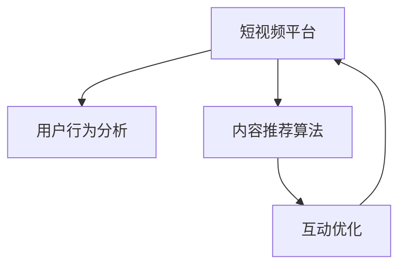

                 

# 如何利用短视频平台获得更多流量：程序员版

> 关键词：短视频平台,流量增长,算法优化,数据分析,内容创意

## 1. 背景介绍

### 1.1 问题由来
在互联网时代，视频内容以其直观、丰富的表现形式，逐渐成为用户获取信息的主要方式。短视频平台凭借其独特的用户互动机制和内容分发模式，迅速崛起，成为社交媒体和内容消费的重要阵地。然而，短视频平台的流量获取竞争激烈，如何高效、精准地将优质内容推送给目标用户，成为运营团队面临的重要挑战。

本文旨在通过分析短视频平台的流量获取机制，结合程序化的思路，提出基于算法的流量增长策略，帮助开发者提升内容曝光率和用户互动率，实现短视频平台上的流量增长。

### 1.2 问题核心关键点
短视频平台流量获取的关键在于内容的曝光率和用户互动率。曝光率指的是内容被用户观看的频率，直接影响内容的传播范围；而用户互动率则反映用户对内容的反馈和参与程度，决定内容的质量和影响力。因此，提升短视频平台的流量需要从内容的优质度和曝光路径两个方面入手。

本文将从用户行为分析、内容推荐算法、互动优化等方面，全面探讨如何利用算法和数据驱动，最大化流量获取效果。

### 1.3 问题研究意义
在短视频平台流量争夺战中，数据驱动的算法优化不仅能够提升内容的曝光率和用户互动率，还能显著降低运营成本，提高内容创作的效率和质量。掌握这些策略，有助于开发者构建高效、可持续的内容生态，提升平台的影响力和盈利能力。

## 2. 核心概念与联系

### 2.1 核心概念概述

为了更好地理解如何利用算法提升短视频平台的流量，本节将介绍几个关键概念：

- **短视频平台**：指以短视频为主要内容形式的社交媒体平台，如抖音、快手、B站等。
- **流量增长**：指提升短视频内容的曝光率和用户互动率，增加用户访问量和停留时间。
- **用户行为分析**：通过数据收集和分析，理解用户对内容的偏好和行为模式。
- **内容推荐算法**：基于用户行为数据，通过机器学习模型推荐相关内容，提升曝光率。
- **互动优化**：通过算法和策略，增加用户对内容的点赞、评论和分享等互动行为，提升用户参与度。

这些概念之间的关系可以通过以下Mermaid流程图来展示：



这个流程图展示了一个循环迭代的过程：

1. 短视频平台收集用户行为数据，进行分析。
2. 通过内容推荐算法，将合适的内容推荐给用户，提升曝光率。
3. 互动优化策略提升用户对内容的互动率，进一步扩大内容的传播范围。
4. 平台根据新的用户行为数据，再次优化内容推荐和互动策略。

## 3. 核心算法原理 & 具体操作步骤

### 3.1 算法原理概述

短视频平台流量增长的核心在于对用户行为数据的分析与利用。其基本思路是通过机器学习算法，根据用户的历史行为和偏好，推荐相关内容，同时优化内容的呈现方式，增加用户互动，从而提升流量。

具体的流量增长算法可以大致分为以下几个步骤：

1. **用户行为分析**：收集和分析用户的数据，包括观看时长、点赞数量、评论内容等，以理解用户的兴趣和行为模式。
2. **内容推荐算法**：基于用户行为数据，使用协同过滤、深度学习等算法，推荐相关内容。
3. **互动优化**：设计策略，增加用户对内容的互动行为，如点赞、评论、分享等。
4. **效果评估**：通过数据分析，评估流量增长的效果，调整和优化策略。

### 3.2 算法步骤详解

#### 3.2.1 用户行为分析

用户行为分析是流量增长的基础。其目的是通过收集和分析用户的行为数据，了解用户的兴趣和偏好，从而指导内容的推荐和优化。

具体步骤包括：

- **数据收集**：通过API接口、服务器日志等方式，收集用户的行为数据，如观看时长、点赞数量、评论内容等。
- **数据预处理**：清洗数据，处理缺失值、异常值，将数据转换为模型所需的格式。
- **特征工程**：设计特征，提取有意义的特征值，如观看时长、点赞数、评论情感等。
- **模型训练**：选择适合的机器学习模型，训练模型以预测用户行为。常用的模型包括逻辑回归、决策树、随机森林等。

#### 3.2.2 内容推荐算法

内容推荐算法是流量增长的核心。其目的是根据用户的行为数据，推荐用户可能感兴趣的内容，从而提升内容的曝光率和用户互动率。

具体步骤包括：

- **数据准备**：收集用户行为数据和内容数据，构建用户-内容矩阵。
- **模型训练**：使用协同过滤、深度学习等算法，训练推荐模型。常用的算法包括矩阵分解、SVM、神经网络等。
- **推荐策略**：根据推荐模型的输出，设计推荐策略，如热门推荐、个性化推荐、协同过滤等。
- **效果评估**：通过A/B测试等方法，评估推荐效果，调整推荐策略。

#### 3.2.3 互动优化

互动优化是流量增长的关键。其目的是通过设计策略，增加用户对内容的互动行为，从而提升用户参与度，增加内容的传播范围。

具体步骤包括：

- **互动数据分析**：收集用户对内容的互动数据，如点赞数量、评论内容等。
- **互动模型训练**：训练模型预测用户是否会对内容进行互动。常用的模型包括线性回归、分类模型等。
- **互动策略设计**：根据互动模型的输出，设计策略，如内容标签、引导评论、个性化推送等。
- **效果评估**：通过数据分析，评估互动策略的效果，调整和优化策略。

### 3.3 算法优缺点

基于算法的流量增长方法具有以下优点：

1. **高效精准**：通过数据分析和机器学习算法，能够高效、精准地推荐内容，提升用户互动率。
2. **可扩展性强**：算法可以自动化地处理大量数据，适用于不同规模的短视频平台。
3. **适应性强**：算法能够根据用户行为和内容特征，动态调整推荐策略，适应不断变化的用户需求。

同时，该方法也存在一些局限性：

1. **数据依赖**：算法的效果高度依赖于数据的质量和量，数据不充足或数据偏差会影响算法的准确性。
2. **复杂度高**：算法模型和策略设计复杂，需要具备一定的数据科学和算法开发能力。
3. **不可解释性**：部分算法模型的决策过程难以解释，用户难以理解其背后的原因。
4. **冷启动问题**：新用户或新内容难以获得推荐，导致流量增长初期效果不明显。

尽管存在这些局限性，但就目前而言，基于算法的流量增长方法仍然是短视频平台流量获取的主要手段。未来相关研究的重点在于如何进一步降低对数据的依赖，提高算法的可解释性和用户友好性，同时解决冷启动问题。

### 3.4 算法应用领域

基于算法的流量增长方法广泛应用于各种短视频平台，具体应用领域包括：

- **内容推荐**：根据用户行为数据，推荐相关视频，提升内容曝光率和用户互动率。
- **广告投放**：通过用户行为分析，优化广告投放策略，提升广告效果。
- **用户行为预测**：预测用户行为，优化用户交互设计，提升用户体验。
- **内容生成**：根据用户偏好，生成个性化视频内容，提升用户参与度。

## 4. 数学模型和公式 & 详细讲解

### 4.1 数学模型构建

本节将使用数学语言对短视频平台的流量增长算法进行更加严格的刻画。

设短视频平台的用户集为 $U=\{u_1,u_2,\cdots,u_N\}$，视频集为 $V=\{v_1,v_2,\cdots,v_M\}$，用户对视频的互动行为为 $I=\{I_{u_i,v_j}\}_{i=1}^N,\{j=1\}^M$，其中 $I_{u_i,v_j}$ 表示用户 $u_i$ 对视频 $v_j$ 的互动行为，取值为0或1。

定义用户对视频的兴趣程度为 $r_{u_i}=\sum_{j=1}^M I_{u_i,v_j}\cdot f_{v_j}$，其中 $f_{v_j}$ 为视频 $v_j$ 的特征向量。

基于用户兴趣度的推荐模型为：

$$
\hat{I}_{u_i,v_j} = \sigma(\sum_{k=1}^K \alpha_k \cdot r_{u_i,k} \cdot r_{v_j,k})
$$

其中 $\sigma$ 为激活函数，$\alpha_k$ 为学习系数，$r_{u_i,k}$ 和 $r_{v_j,k}$ 分别为用户和视频的 $k$ 维特征向量。

### 4.2 公式推导过程

以协同过滤算法为例，推导基于用户兴趣度的推荐公式。

假设用户 $u_i$ 对视频 $v_j$ 的互动行为为 $I_{u_i,v_j}=1$，则用户 $u_i$ 对视频 $v_j$ 的兴趣程度为：

$$
r_{u_i} = \sum_{k=1}^K f_{u_i,k} \cdot f_{v_j,k}
$$

其中 $f_{u_i,k}$ 和 $f_{v_j,k}$ 分别为用户 $u_i$ 和视频 $v_j$ 的 $k$ 维特征向量。

推荐算法的目标是最大化用户 $u_i$ 对视频 $v_j$ 的兴趣度 $r_{u_i,v_j}$，即：

$$
\max_{I_{u_i,v_j}} \sum_{i=1}^N \sum_{j=1}^M I_{u_i,v_j} \cdot r_{u_i,v_j}
$$

利用拉格朗日乘子法，引入拉格朗日函数：

$$
\mathcal{L} = \sum_{i=1}^N \sum_{j=1}^M I_{u_i,v_j} \cdot r_{u_i,v_j} - \sum_{i=1}^N \sum_{j=1}^M \lambda_i \cdot (1 - I_{u_i,v_j}) - \sum_{i=1}^N \sum_{j=1}^M \lambda'_j \cdot I_{u_i,v_j}
$$

其中 $\lambda_i$ 和 $\lambda'_j$ 为拉格朗日乘子。

对 $I_{u_i,v_j}$ 求导，得到：

$$
\frac{\partial \mathcal{L}}{\partial I_{u_i,v_j}} = r_{u_i,v_j} - \lambda_i - \lambda'_j = 0
$$

因此，得到推荐模型：

$$
\hat{I}_{u_i,v_j} = \sigma(\sum_{k=1}^K \alpha_k \cdot r_{u_i,k} \cdot r_{v_j,k})
$$

其中 $\sigma$ 为激活函数，$\alpha_k$ 为学习系数，$r_{u_i,k}$ 和 $r_{v_j,k}$ 分别为用户和视频的 $k$ 维特征向量。

### 4.3 案例分析与讲解

假设在一个短视频平台上，有1000个用户和1000个视频。每个用户可以点赞或不喜欢某个视频。平台收集了用户的点赞数据，构建了用户-视频的兴趣度矩阵。

使用协同过滤算法，计算每个用户对每个视频的推荐兴趣度，并设计推荐策略，如热门推荐、个性化推荐等。

具体步骤如下：

- **数据准备**：构建用户-视频的兴趣度矩阵，包含用户的点赞数据。
- **特征提取**：提取用户和视频的特征，如视频时长、点赞数等。
- **协同过滤**：利用协同过滤算法，计算每个用户对每个视频的推荐兴趣度。
- **推荐策略**：设计热门推荐策略，推荐热门视频；同时，利用用户画像，设计个性化推荐策略，推荐与用户兴趣相似的视频。
- **效果评估**：通过A/B测试等方法，评估推荐效果，调整推荐策略。

## 5. 项目实践：代码实例和详细解释说明

### 5.1 开发环境搭建

在进行流量增长实践前，我们需要准备好开发环境。以下是使用Python进行Flask开发的环境配置流程：

1. 安装Anaconda：从官网下载并安装Anaconda，用于创建独立的Python环境。

2. 创建并激活虚拟环境：
```bash
conda create -n video-analytics python=3.8 
conda activate video-analytics
```

3. 安装Flask：
```bash
pip install flask
```

4. 安装相关库：
```bash
pip install numpy pandas sklearn matplotlib
```

5. 安装Flask开发工具：
```bash
pip install flask-restful flask-cors
```

6. 初始化Flask应用：
```bash
python app.py
```

完成上述步骤后，即可在`video-analytics`环境中开始流量增长实践。

### 5.2 源代码详细实现

下面以推荐系统为例，给出使用Flask开发基于协同过滤算法的内容推荐系统的PyTorch代码实现。

首先，定义推荐系统中的相关类：

```python
from flask import Flask, jsonify
from sklearn.neighbors import NearestNeighbors
import pandas as pd

app = Flask(__name__)

class RecommendationSystem:
    def __init__(self, data_path):
        self.data = pd.read_csv(data_path)
        self.nn = NearestNeighbors(n_neighbors=10)
        self.nn.fit(self.data[['user_id', 'video_id', 'interest']].values)
    
    def recommend(self, user_id, video_ids):
        distances, indices = self.nn.kneighbors(self.data[['user_id', 'video_id', 'interest']].values)
        recommendations = self.data.iloc[indices[:, 1]].values
        return recommendations.tolist()
```

然后，定义推荐接口：

```python
@app.route('/recommend', methods=['GET'])
def recommend():
    user_id = request.args.get('user_id')
    video_ids = request.args.get('video_ids')
    recommendations = recommendation_system.recommend(user_id, video_ids)
    return jsonify(recommendations), 200
```

最后，启动Flask应用：

```python
if __name__ == '__main__':
    app.run(debug=True)
```

通过Flask的API接口，即可获取基于协同过滤算法的视频推荐结果。

### 5.3 代码解读与分析

让我们再详细解读一下关键代码的实现细节：

**RecommendationSystem类**：
- `__init__`方法：初始化数据集和近邻算法，构建用户-视频的兴趣度矩阵。
- `recommend`方法：根据用户ID和视频ID列表，计算推荐列表，并返回推荐视频ID列表。

**Flask API接口**：
- `/recommend`路径：定义GET请求的推荐接口。
- `request.args`：获取用户ID和视频ID列表。
- `recommendations`变量：调用`recommend`方法获取推荐结果。
- `jsonify`函数：将推荐结果转换为JSON格式，返回给客户端。

通过上述代码，可以看到，Flask结合Python和数据科学工具，可以高效地实现基于协同过滤算法的内容推荐系统。开发者可以进一步扩展和优化算法模型和推荐策略，构建更高效、智能的内容推荐系统。

当然，工业级的系统实现还需考虑更多因素，如推荐系统的评估、模型的更新、推荐策略的调整等。但核心的流量增长算法基本与此类似。

## 6. 实际应用场景

### 6.1 智能推荐系统

智能推荐系统是流量增长的核心应用场景。通过算法推荐系统，可以提升视频的曝光率和用户互动率，增加平台的用户停留时间和访问量。

在技术实现上，可以收集用户的历史行为数据，如观看时长、点赞数量、评论内容等，构建用户-视频的兴趣度矩阵。在此基础上，使用协同过滤、深度学习等算法，推荐相关视频。同时，可以设计互动优化策略，如内容标签、引导评论等，增加用户对视频的互动行为。

### 6.2 用户行为分析

用户行为分析是流量增长的基础。通过分析用户的行为数据，了解用户的兴趣和偏好，可以指导内容的推荐和优化。

在技术实现上，可以使用机器学习模型，如逻辑回归、决策树、随机森林等，预测用户是否会对视频进行互动。通过分析互动行为的数据，设计策略，如内容标签、引导评论等，增加用户对视频的互动行为。

### 6.3 个性化推荐

个性化推荐是流量增长的关键。通过算法推荐系统，可以根据用户的行为数据，推荐相关视频，提升内容的曝光率和用户互动率。

在技术实现上，可以收集用户的历史行为数据，如观看时长、点赞数量、评论内容等，构建用户-视频的兴趣度矩阵。在此基础上，使用协同过滤、深度学习等算法，推荐相关视频。同时，可以设计互动优化策略，如内容标签、引导评论等，增加用户对视频的互动行为。

### 6.4 未来应用展望

随着算法的不断进步和数据量的不断积累，基于算法的流量增长方法将迎来更多创新和突破。

1. **实时推荐系统**：通过流数据处理技术，实时分析用户行为数据，动态调整推荐策略，提升推荐效果。
2. **多模态推荐**：结合视频、音频、文本等多模态数据，构建更加全面的用户画像，提升推荐准确性。
3. **跨平台推荐**：通过算法优化，实现不同平台之间的推荐数据共享和协同推荐，提升跨平台的用户体验。
4. **自适应推荐**：根据用户反馈和行为数据，动态调整推荐模型和策略，提升推荐效果。

## 7. 工具和资源推荐

### 7.1 学习资源推荐

为了帮助开发者系统掌握流量增长算法的基础知识，这里推荐一些优质的学习资源：

1. **《推荐系统实践》**：斯坦福大学开设的推荐系统课程，详细讲解推荐算法的原理和应用。
2. **《深度学习与推荐系统》**：清华大学出版社出版的书籍，介绍深度学习在推荐系统中的应用。
3. **Kaggle推荐系统竞赛**：通过参加Kaggle上的推荐系统竞赛，实践和提升自己的算法能力。
4. **Google AI实验室推荐系统**：谷歌推出的推荐系统工具，提供丰富的推荐算法和模型，用于研究和实践。

通过对这些资源的学习实践，相信你一定能够快速掌握流量增长算法的精髓，并用于解决实际的流量增长问题。

### 7.2 开发工具推荐

高效的开发离不开优秀的工具支持。以下是几款用于流量增长开发的常用工具：

1. **Flask**：轻量级的Web开发框架，易于上手，适合快速开发API接口。
2. **TensorFlow**：开源深度学习框架，支持多种推荐算法和模型，适用于大规模工程应用。
3. **PyTorch**：开源深度学习框架，支持高效的模型构建和训练，适用于快速迭代和研究。
4. **Jupyter Notebook**：交互式的开发环境，方便进行数据分析和模型调试。
5. **Kaggle**：数据科学竞赛平台，提供丰富的数据集和竞赛机会，用于实践和测试算法效果。

合理利用这些工具，可以显著提升流量增长任务的开发效率，加快创新迭代的步伐。

### 7.3 相关论文推荐

流量增长算法的研究源于学界的持续研究。以下是几篇奠基性的相关论文，推荐阅读：

1. **《基于协同过滤的推荐系统》**：介绍了协同过滤算法的原理和实现。
2. **《深度学习在推荐系统中的应用》**：详细讲解了深度学习在推荐系统中的应用。
3. **《用户行为分析与推荐系统》**：讨论了用户行为分析在推荐系统中的作用。
4. **《多模态推荐系统》**：介绍多模态数据融合在推荐系统中的应用。

这些论文代表了大语言模型微调技术的发展脉络。通过学习这些前沿成果，可以帮助研究者把握学科前进方向，激发更多的创新灵感。

## 8. 总结：未来发展趋势与挑战

### 8.1 总结

本文对基于算法优化短视频平台流量增长的策略进行了全面系统的介绍。首先阐述了流量增长的背景和核心关键点，明确了算法在提升用户互动率、增强曝光率方面的独特价值。其次，从用户行为分析、内容推荐算法、互动优化等方面，详细讲解了流量增长算法的数学原理和关键步骤，给出了流量增长任务开发的完整代码实例。同时，本文还广泛探讨了流量增长算法在智能推荐、用户行为分析、个性化推荐等多个场景中的应用前景，展示了算法驱动的流量增长潜力。

通过本文的系统梳理，可以看到，基于算法的流量增长方法正在成为短视频平台流量获取的主要手段。这些方向的探索发展，必将进一步提升短视频平台的流量获取效果，为短视频生态带来深远影响。

### 8.2 未来发展趋势

展望未来，基于算法的流量增长技术将呈现以下几个发展趋势：

1. **实时化推荐**：通过流数据处理技术，实现实时分析和推荐，提升推荐效果和用户体验。
2. **多模态推荐**：结合视频、音频、文本等多模态数据，构建更加全面的用户画像，提升推荐准确性。
3. **跨平台协同推荐**：实现不同平台之间的推荐数据共享和协同推荐，提升跨平台的用户体验。
4. **自适应推荐**：根据用户反馈和行为数据，动态调整推荐模型和策略，提升推荐效果。

以上趋势凸显了基于算法的流量增长技术的广阔前景。这些方向的探索发展，必将进一步提升短视频平台的流量获取效果，为短视频生态带来深远影响。

### 8.3 面临的挑战

尽管基于算法的流量增长技术已经取得了瞩目成就，但在迈向更加智能化、普适化应用的过程中，它仍面临着诸多挑战：

1. **数据质量问题**：算法的效果高度依赖于数据的质量和量，数据不充足或数据偏差会影响算法的准确性。
2. **复杂度问题**：算法模型和策略设计复杂，需要具备一定的数据科学和算法开发能力。
3. **可解释性问题**：部分算法模型的决策过程难以解释，用户难以理解其背后的原因。
4. **冷启动问题**：新用户或新内容难以获得推荐，导致流量增长初期效果不明显。

尽管存在这些挑战，但就目前而言，基于算法的流量增长方法仍然是短视频平台流量获取的主要手段。未来相关研究的重点在于如何进一步降低对数据的依赖，提高算法的可解释性和用户友好性，同时解决冷启动问题。

### 8.4 研究展望

面对流量增长算法面临的种种挑战，未来的研究需要在以下几个方面寻求新的突破：

1. **实时流数据处理**：通过流数据处理技术，实时分析用户行为数据，动态调整推荐策略，提升推荐效果。
2. **多模态数据融合**：结合视频、音频、文本等多模态数据，构建更加全面的用户画像，提升推荐准确性。
3. **自适应推荐系统**：根据用户反馈和行为数据，动态调整推荐模型和策略，提升推荐效果。
4. **多平台协同推荐**：实现不同平台之间的推荐数据共享和协同推荐，提升跨平台的用户体验。

这些研究方向将进一步提升流量增长算法的准确性和可扩展性，为短视频平台流量获取提供更加智能、高效、可控的解决方案。总之，流量增长算法需要在数据、模型、工程、业务等多个维度协同发力，才能真正实现流量增长的目标。

---

作者：禅与计算机程序设计艺术 / Zen and the Art of Computer Programming

