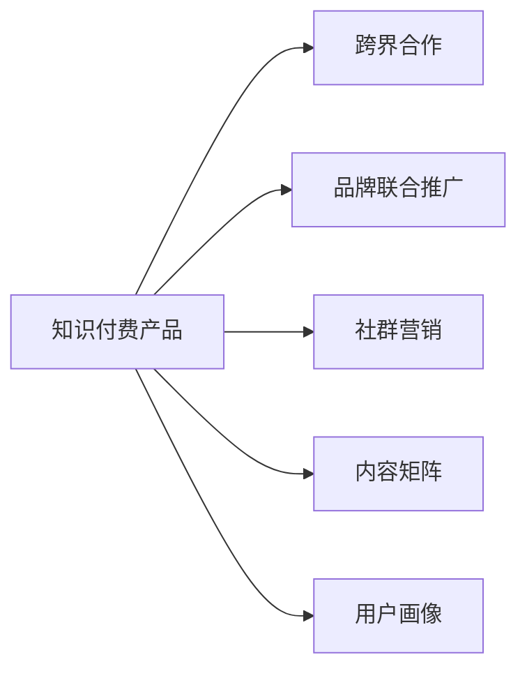

                 

## 1. 背景介绍

在知识付费日益兴盛的当下，如何有效推广知识付费产品成为了一个重要议题。传统的广告和单向推广手段已经难以满足市场需求，特别是对于专业性强、受众狭窄的知识付费内容，找到合适的方式以提高产品曝光度和用户转化率变得尤为重要。在数字时代，利用跨界合作可以拓宽产品推广渠道，借助不同领域的优势资源，以创新方式吸引用户，达成良好的市场推广效果。本文将深入分析跨界合作推广知识付费产品的理论基础，探讨具体的实践方法，同时结合实际案例，提出有效的推广策略。

## 2. 核心概念与联系

### 2.1 核心概念概述

为更好地理解跨界合作推广知识付费产品的方法，本节将介绍几个密切相关的核心概念：

- **知识付费产品**：泛指以专业知识和信息服务为核心内容，通过网络平台进行收费传播的知识服务，包括在线课程、电子书、专业咨询等。
- **跨界合作**：指不同领域、不同行业的企业或组织，通过资源共享、协同创新等合作方式，共同推进某一项目或产品的发展。
- **品牌联合推广**：指两家或多家品牌企业联合推出促销活动，借助各自的品牌影响力，提升推广效果。
- **社群营销**：通过构建和维护社群，吸引和维系用户的兴趣，促成用户转化和重复购买。
- **内容矩阵**：将不同的内容形式进行组合搭配，形成一个综合性的内容生态系统。
- **用户画像**：通过数据分析和用户研究，创建详细的用户画像，精准定位目标用户群体。

这些核心概念之间的逻辑关系可以通过以下Mermaid流程图来展示：



这个流程图展示了这个问题的核心概念以及它们之间的关系：

1. 知识付费产品通过跨界合作可以拓宽推广渠道。
2. 跨界合作与品牌联合推广、社群营销、内容矩阵和用户画像等多个推广策略密切相关。
3. 通过这些策略的组合应用，可以更好地推广知识付费产品，吸引和维系用户。

## 3. 核心算法原理 & 具体操作步骤

### 3.1 算法原理概述

跨界合作推广知识付费产品的算法原理基于**协同效应**与**品牌效应**。协同效应指的是不同领域企业之间通过合作，能够实现1+1>2的效果；品牌效应则指通过借助合作伙伴的品牌影响力，提升自身产品的市场认知度和用户信任度。

算法步骤如下：

1. **分析用户画像**：通过数据分析和市场调研，精准定位目标用户群体。
2. **选择合适的合作对象**：根据用户画像，寻找与知识付费产品具有相同或相关领域的企业或组织。
3. **制定合作计划**：设计具体的合作方案，包括联合推广活动、内容合作、品牌联合营销等。
4. **实施与监控**：执行合作计划，监控推广效果，及时调整策略。

### 3.2 算法步骤详解

#### 3.2.1 用户画像分析

用户画像的构建是跨界合作推广的基础。根据用户画像，可以确定目标用户的基本特征、兴趣、需求等信息，为选择合作对象和设计推广策略提供依据。构建用户画像的方法包括：

- **问卷调查**：通过设计问卷，收集用户基本信息和偏好。
- **数据分析**：利用历史数据和用户行为分析，找出用户的共性特征。
- **竞品分析**：研究竞品的用户群体，了解用户对竞品的反应和需求。

#### 3.2.2 选择合适的合作对象

选择合适的合作对象是跨界合作成功的关键。根据用户画像，可以识别出与知识付费产品具有高度相关性的领域。例如：

- **教育培训类**：如编程、语言培训等，能够吸引技术或语言学习用户。
- **文化娱乐类**：如音乐、艺术、电影等，能够吸引文艺爱好者。
- **健身运动类**：如瑜伽、健身等，能够吸引健康生活爱好者。
- **技术资讯类**：如技术博客、技术论坛等，能够吸引技术爱好者。

#### 3.2.3 制定合作计划

合作计划的制定需要考虑多个因素，包括合作方式、推广内容、时间安排等。具体的合作计划包括：

- **联合推广活动**：共同举办线上线下活动，吸引用户参与。
- **内容合作**：通过相互提供优质内容，实现内容互补。
- **品牌联合营销**：借助合作伙伴的品牌效应，提升产品曝光度。

#### 3.2.4 实施与监控

在实施合作计划的过程中，需要不断监控推广效果，并根据实际情况进行调整。具体的实施与监控步骤包括：

- **效果评估**：通过数据分析，评估各推广活动的实际效果。
- **策略调整**：根据评估结果，调整推广策略，优化合作方案。
- **持续优化**：持续改进推广手段，提升用户转化率和满意度。

### 3.3 算法优缺点

跨界合作推广知识付费产品具有以下优点：

1. **拓宽推广渠道**：不同领域的企业可以优势互补，形成多渠道推广，提高曝光度。
2. **提升用户信任度**：借助合作伙伴的品牌效应，提升自身产品的市场认知度和用户信任度。
3. **优化用户体验**：通过内容互补，提供更丰富、更有价值的内容，提高用户满意度。

同时，这种推广方式也存在一些局限性：

1. **选择难度大**：选择适合的合作伙伴需要充分的市场调研和分析。
2. **沟通协调难**：不同企业的目标和需求可能存在差异，需要良好的沟通协调。
3. **风险较大**：跨界合作涉及多个主体，可能存在一定的合作风险。

尽管存在这些局限性，但跨界合作推广仍是知识付费产品推广的重要手段之一，尤其适用于那些专业性强、受众狭窄的产品。

### 3.4 算法应用领域

跨界合作推广知识付费产品已经在多个领域得到了广泛应用，包括但不限于以下领域：

- **教育培训类**：如编程课程与编程社区的合作，语言培训与语言应用平台的合作等。
- **文化娱乐类**：如音乐课程与音乐社交平台的合作，艺术课程与艺术社区的合作等。
- **健身运动类**：如瑜伽课程与健身社区的合作，运动课程与运动设备的合作等。
- **技术资讯类**：如技术课程与技术论坛的合作，技术博客与技术媒体的合作等。

## 4. 数学模型和公式 & 详细讲解 & 举例说明

### 4.1 数学模型构建

为了更精确地分析跨界合作推广的效果，可以使用如下数学模型进行建模：

设知识付费产品的推广目标为 $R$，跨界合作的推广效果为 $E$，用户转化率为 $C$，则推广效果可以用公式表示为：

$$ R = C \times E $$

其中，$C$ 表示用户转化的概率，$E$ 表示跨界合作带来的额外推广效果。

### 4.2 公式推导过程

通过上述模型，我们可以进行以下推导：

1. **用户转化率分析**：通过历史数据和问卷调查，计算用户转化率 $C$。
2. **推广效果评估**：根据联合活动、内容合作、品牌联合营销等具体措施，评估跨界合作的推广效果 $E$。
3. **推广目标计算**：根据用户转化率和推广效果，计算最终推广目标 $R$。

### 4.3 案例分析与讲解

以在线编程课程和编程社区的合作为例，分析跨界合作的推广效果：

- **用户画像**：目标用户为编程爱好者，关注编程技巧和项目实践。
- **合作对象**：选择与编程课程内容相关的编程社区，如GitHub、Stack Overflow等。
- **合作计划**：
  1. **联合推广活动**：在编程社区中推广在线编程课程，组织线上线下编程挑战赛。
  2. **内容合作**：在社区中发布高质量的编程文章和项目案例，互相推荐优质内容。
  3. **品牌联合营销**：共同举办编程技术研讨会，提升品牌的知名度和影响力。

**实际推广效果**：

1. **联合推广活动**：在社区中推广在线编程课程，吸引了大量编程爱好者参与挑战赛，提升了课程的曝光度和用户转化率。
2. **内容合作**：社区中高质量的编程文章和项目案例吸引了更多用户访问和阅读，提高了用户对课程的认可度和满意度。
3. **品牌联合营销**：联合举办技术研讨会，吸引了大量业内专家和用户参与，提升了品牌的知名度和影响力。

最终计算结果表明，跨界合作显著提高了在线编程课程的用户转化率和推广效果。

## 5. 项目实践：代码实例和详细解释说明

### 5.1 开发环境搭建

在进行跨界合作推广的实践之前，我们需要准备好开发环境。以下是使用Python进行数据处理和分析的开发环境配置流程：

1. **安装Python**：从官网下载并安装Python，建议选择3.8及以上版本。
2. **安装数据处理库**：如Pandas、NumPy等，用于数据处理和分析。
3. **安装可视化工具**：如Matplotlib、Seaborn等，用于数据可视化。
4. **安装统计分析库**：如SciPy、statsmodels等，用于统计分析和模型评估。

### 5.2 源代码详细实现

以下是一个简单的Python代码实例，用于分析用户画像和评估合作效果：

```python
import pandas as pd
import numpy as np
import matplotlib.pyplot as plt
from statsmodels.tsa.arima_model import ARIMA

# 用户画像数据
user_profiles = pd.read_csv('user_profiles.csv')

# 用户行为数据
user_behaviors = pd.read_csv('user_behaviors.csv')

# 分析用户画像和行为数据
merged_data = pd.merge(user_profiles, user_behaviors, on='user_id')

# 计算用户转化率
conversion_rate = merged_data[merged_data['converted'] == 1].shape[0] / merged_data.shape[0]

# 使用ARIMA模型评估推广效果
effects = ARIMA(user_behaviors['clicks'], order=(1,1,1))
effect_model = effects.fit()
effects_data = effect_model.fittedvalues

# 计算推广效果
effective_clicks = np.sum(effects_data)

# 计算推广目标
promotion_target = conversion_rate * effective_clicks

print(f'用户转化率：{conversion_rate:.3f}')
print(f'推广效果：{effective_clicks:.3f}')
print(f'推广目标：{promotion_target:.3f}')
```

### 5.3 代码解读与分析

让我们再详细解读一下关键代码的实现细节：

**用户画像数据**：
- `user_profiles.csv` 文件包含用户的基本信息，如年龄、性别、教育背景等。
- `user_behaviors.csv` 文件包含用户的行为数据，如浏览、购买、点击等。

**数据处理**：
- 使用 `pd.merge` 函数将用户画像数据和行为数据合并。
- 计算用户转化率，即用户从访问到购买的比例。

**推广效果评估**：
- 使用ARIMA模型对用户行为数据进行时间序列分析，评估推广活动带来的额外点击数。
- 计算推广效果，即额外点击数总和。

**推广目标计算**：
- 根据用户转化率和推广效果，计算最终的推广目标。

可以看到，Python结合数据处理和分析工具，可以方便地实现跨界合作推广效果的评估和计算。

### 5.4 运行结果展示

在上述代码中，我们假设用户转化率为0.05，推广活动带来的额外点击数为1000，则推广目标为：

$$ R = C \times E = 0.05 \times 1000 = 50 $$

即预计通过跨界合作推广，可以获得50个有效订单。

## 6. 实际应用场景

### 6.1 智能健身平台与健康应用合作

智能健身平台可以通过与健康应用合作，实现跨界推广。例如，与智能手表健康应用合作，共同推出健身课程和健康数据监测服务。智能手表用户可以通过平台购买健身课程，并获取健康数据监测报告。健康应用用户可以通过平台获取健身建议和课程推荐。

**具体合作方式**：

1. **联合推广活动**：在智能手表应用中推广健身课程，组织线上健身挑战赛。
2. **内容合作**：在健康应用中发布健身课程和健康监测报告，互相推荐优质内容。
3. **品牌联合营销**：共同举办健身运动活动，提升品牌的知名度和影响力。

**预期效果**：

1. **联合推广活动**：通过智能手表应用推广健身课程，吸引了大量智能手表用户参与挑战赛，提升了课程的曝光度和用户转化率。
2. **内容合作**：健康应用中发布的健身课程和监测报告吸引了更多用户访问和阅读，提高了用户对课程的认可度和满意度。
3. **品牌联合营销**：共同举办健身运动活动，吸引了大量用户参与，提升了品牌的知名度和影响力。

最终，通过跨界合作，智能健身平台实现了显著的推广效果。

### 6.2 在线教育平台与在线考试平台合作

在线教育平台可以通过与在线考试平台合作，实现跨界推广。例如，与在线考试平台合作，共同推出职业技能培训和在线考试服务。在线考试平台用户可以通过平台报名参加职业培训课程，并参加在线考试，获取职业认证。在线教育平台用户可以通过平台参加考试，获取职业技能培训证书。

**具体合作方式**：

1. **联合推广活动**：在在线考试平台中推广职业技能培训课程，组织线上考试活动。
2. **内容合作**：在在线考试平台中发布职业技能培训课程和考试题库，互相推荐优质内容。
3. **品牌联合营销**：共同举办职业技能考试活动，提升品牌的知名度和影响力。

**预期效果**：

1. **联合推广活动**：通过在线考试平台推广职业技能培训课程，吸引了大量考试用户报名参加，提升了课程的曝光度和用户转化率。
2. **内容合作**：考试平台中发布的职业技能培训课程和题库吸引了更多用户访问和阅读，提高了用户对课程的认可度和满意度。
3. **品牌联合营销**：共同举办职业技能考试活动，吸引了大量用户报名，提升了品牌的知名度和影响力。

最终，通过跨界合作，在线教育平台实现了显著的推广效果。

### 6.3 在线音乐平台与在线图书馆合作

在线音乐平台可以通过与在线图书馆合作，实现跨界推广。例如，与在线图书馆合作，共同推出音乐课程和文学阅读服务。在线图书馆用户可以通过平台购买音乐课程，并获取经典文学作品阅读。在线音乐平台用户可以通过平台阅读文学作品，获取音乐课程推荐。

**具体合作方式**：

1. **联合推广活动**：在在线图书馆中推广音乐课程，组织线上音乐会。
2. **内容合作**：在在线图书馆中发布经典文学作品和音乐推荐，互相推荐优质内容。
3. **品牌联合营销**：共同举办音乐文学活动，提升品牌的知名度和影响力。

**预期效果**：

1. **联合推广活动**：通过在线图书馆推广音乐课程，吸引了大量图书馆用户参与音乐会，提升了课程的曝光度和用户转化率。
2. **内容合作**：图书馆中发布的经典文学作品和音乐推荐吸引了更多用户访问和阅读，提高了用户对课程的认可度和满意度。
3. **品牌联合营销**：共同举办音乐文学活动，吸引了大量用户参与，提升了品牌的知名度和影响力。

最终，通过跨界合作，在线音乐平台实现了显著的推广效果。

## 7. 工具和资源推荐

### 7.1 学习资源推荐

为了帮助开发者系统掌握跨界合作推广的理论基础和实践技巧，这里推荐一些优质的学习资源：

1. **《数字营销基础》**：介绍数字营销的基本概念、策略和工具，包括SEO、SEM、内容营销等。
2. **《品牌联合营销》**：详细讲解品牌联合营销的案例和策略，帮助理解不同品牌如何协同推广。
3. **《跨界合作策略》**：探讨不同领域的跨界合作方式和策略，提供实际案例和分析。
4. **《社交媒体营销》**：讲解社交媒体营销的基本原理和工具，包括Facebook、Instagram、Twitter等。
5. **《社群营销实战》**：介绍社群营销的构建和维护方法，分享社群运营的实战经验。

通过这些资源的学习实践，相信你一定能够快速掌握跨界合作推广的理论基础和实践技巧，并将其应用于知识付费产品的推广中。

### 7.2 开发工具推荐

高效的开发离不开优秀的工具支持。以下是几款用于跨界合作推广开发的常用工具：

1. **数据分析工具**：如Jupyter Notebook、PyCharm等，用于数据处理和模型评估。
2. **可视化工具**：如Tableau、Power BI等，用于数据可视化，帮助理解推广效果。
3. **项目管理工具**：如Trello、Jira等，用于任务管理和项目跟踪。
4. **协作平台**：如Slack、Microsoft Teams等，用于团队沟通和协作。
5. **测试平台**：如Selenium、Appium等，用于自动化测试和模拟。

合理利用这些工具，可以显著提升跨界合作推广的开发效率，加快创新迭代的步伐。

### 7.3 相关论文推荐

跨界合作推广理论源于学界的持续研究。以下是几篇奠基性的相关论文，推荐阅读：

1. **《跨界合作的协同效应》**：研究不同领域企业合作的协同效应，探讨合作带来的整体收益。
2. **《品牌联合营销的理论与实践》**：详细讲解品牌联合营销的原理和策略，提供实际案例和分析。
3. **《社群营销的创新与实践》**：介绍社群营销的创新手段和实践经验，分享成功案例和教训。
4. **《内容矩阵的构建与优化》**：研究内容矩阵的构建方法和优化策略，提升内容的协同效应。
5. **《用户画像的构建与分析》**：探讨用户画像的构建方法和应用场景，帮助精准定位目标用户。

这些论文代表了大数据营销和跨界合作推广理论的发展脉络。通过学习这些前沿成果，可以帮助研究者把握学科前进方向，激发更多的创新灵感。

## 8. 总结：未来发展趋势与挑战

### 8.1 总结

本文对跨界合作推广知识付费产品的方法进行了全面系统的介绍。首先阐述了跨界合作推广的理论基础，明确了跨界合作在拓展产品推广渠道、提升用户信任度等方面的独特价值。其次，从原理到实践，详细讲解了跨界合作的数学模型和具体步骤，给出了合作推广的完整代码实例。同时，本文还结合实际案例，提出了一套有效的推广策略。

通过本文的系统梳理，可以看到，跨界合作推广在知识付费产品推广中具有巨大的潜力。不同领域的合作，能够带来多渠道、多角度的推广效果，帮助知识付费产品打破市场壁垒，吸引更多用户。未来，随着合作模式的多样化和技术手段的不断进步，跨界合作推广必将成为知识付费产品推广的重要手段，推动知识付费领域的持续发展。

### 8.2 未来发展趋势

展望未来，跨界合作推广知识付费产品将呈现以下几个发展趋势：

1. **多样化合作模式**：除了传统的联合推广活动、内容合作、品牌联合营销外，未来还会涌现更多创新的合作模式，如联合产品开发、共同运营等。
2. **技术手段进步**：借助大数据、人工智能等技术手段，实现更精准的用户画像分析和推广效果评估，提升合作效果。
3. **全球化推广**：通过跨国合作，实现全球化推广，扩大知识付费产品的国际影响力。
4. **智能化推广**：利用智能推荐算法，根据用户行为和偏好，动态调整推广策略，提升用户转化率。
5. **平台化推广**：通过构建合作平台，实现多方资源整合和共享，提升合作效率和效果。

以上趋势凸显了跨界合作推广的知识付费产品推广的广阔前景。这些方向的探索发展，必将进一步提升知识付费产品的推广效果，吸引更多用户，推动知识付费领域的持续发展。

### 8.3 面临的挑战

尽管跨界合作推广知识付费产品具有巨大的潜力，但在实际操作过程中，仍面临着诸多挑战：

1. **选择难度大**：选择适合的合作伙伴需要充分的市场调研和分析，不同企业之间的文化和目标可能存在差异。
2. **沟通协调难**：不同企业的目标和需求可能存在差异，需要良好的沟通协调，确保合作顺利进行。
3. **合作风险大**：跨界合作涉及多个主体，可能存在一定的合作风险，如知识产权纠纷、合作终止等。
4. **推广效果难以量化**：合作效果难以量化评估，难以准确判断推广效果和用户转化率。
5. **用户画像分析难**：用户画像的构建需要大量的数据和分析，对于中小企业来说，可能存在数据获取和分析的困难。

尽管存在这些挑战，但通过持续的探索和创新，可以克服这些难题，实现跨界合作推广知识付费产品的成功。

### 8.4 研究展望

未来，在跨界合作推广知识付费产品的研究中，需要关注以下几个方面：

1. **大数据与AI结合**：结合大数据和人工智能技术，实现更精准的用户画像分析和推广效果评估，提升合作效果。
2. **多领域合作**：探索更多领域的跨界合作，实现多渠道、多角度的推广效果。
3. **智能化推广**：利用智能推荐算法，根据用户行为和偏好，动态调整推广策略，提升用户转化率。
4. **平台化推广**：构建合作平台，实现多方资源整合和共享，提升合作效率和效果。

这些研究方向将推动跨界合作推广知识付费产品走向更加成熟和完善，帮助更多的知识付费产品成功推广，吸引更多的用户。

## 9. 附录：常见问题与解答

**Q1：如何选择适合的知识付费产品合作伙伴？**

A: 选择适合的知识付费产品合作伙伴需要充分的市场调研和分析，主要考虑以下几个方面：
1. 目标用户群体：选择与知识付费产品目标用户群体高度相关的合作伙伴。
2. 资源和能力：评估合作伙伴的资源和能力，如品牌影响力、用户基础、技术实力等。
3. 合作意愿：了解合作伙伴的合作意愿和诚意，确保双方有良好的沟通和信任。
4. 合作方式：选择适合的知识付费产品合作方式，如联合推广、内容合作、品牌联合营销等。

**Q2：如何进行跨界合作的推广效果评估？**

A: 跨界合作的推广效果评估需要综合考虑多个因素，主要包括以下步骤：
1. 用户转化率分析：通过历史数据和问卷调查，计算用户转化率。
2. 推广效果评估：结合联合推广活动、内容合作、品牌联合营销等具体措施，评估跨界合作的推广效果。
3. 推广目标计算：根据用户转化率和推广效果，计算最终的推广目标。

**Q3：如何进行跨界合作的沟通和协调？**

A: 跨界合作的沟通和协调需要建立良好的沟通机制，主要包括以下步骤：
1. 制定沟通计划：明确双方的沟通目标和内容，确定沟通频率和方式。
2. 建立沟通渠道：建立多种沟通渠道，如电话、邮件、会议等，确保信息畅通。
3. 定期汇报：定期向对方汇报合作进展和效果，及时解决问题和调整策略。
4. 制定合作协议：制定详细的合作协议，明确各方的责任和义务，确保合作顺利进行。

**Q4：如何进行跨界合作的品牌联合营销？**

A: 跨界合作的品牌联合营销需要精心设计，主要包括以下步骤：
1. 确定品牌定位：明确双方的品牌定位和核心价值，确保品牌形象一致。
2. 设计联合推广活动：设计有创意的联合推广活动，吸引用户参与。
3. 共同宣传推广：通过多种渠道，如社交媒体、广告等，共同宣传推广。
4. 评估推广效果：通过数据分析，评估联合推广活动的效果，优化推广策略。

**Q5：如何进行跨界合作的持续优化？**

A: 跨界合作的持续优化需要不断改进和调整，主要包括以下步骤：
1. 定期评估：定期评估合作效果，找出问题和改进点。
2. 调整策略：根据评估结果，调整推广策略和合作方案，优化合作效果。
3. 持续改进：持续改进合作方式和技术手段，提升合作效率和效果。
4. 用户反馈：积极收集用户反馈，优化产品和服务，提升用户满意度。

---

作者：禅与计算机程序设计艺术 / Zen and the Art of Computer Programming

