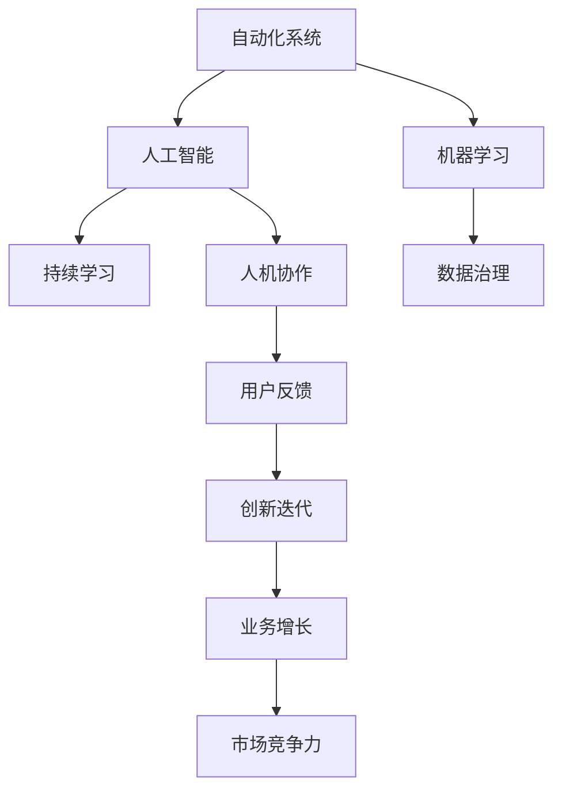

                 

# 如何在自动化创业中保持创新

在当今快速发展的科技环境中，自动化技术已经成为推动创业成功的关键因素。但是，仅仅依靠自动化本身并不能保证持续的创新。本文将探讨如何在大规模自动化创业中保持创新，通过构建一个健康的创新生态系统，不断推动技术突破和业务增长。

## 1. 背景介绍

### 1.1 问题由来

自动化技术，尤其是人工智能（AI）和机器学习（ML）的应用，已经在多个领域展示了其变革性的潜力。从制造业的机器人自动化到金融业的算法交易，自动化正在重新定义许多行业的运作方式。然而，随着自动化技术的普及，创业公司也开始面临挑战：如何在自动化过程中保持创新，以维持竞争优势？

### 1.2 问题核心关键点

自动化创业中的创新保持问题主要集中在以下几个方面：
- **持续学习**：自动化系统需要不断学习新数据和环境变化，以保持其有效性。
- **数据治理**：高质量的数据是自动化创新的基石，如何管理和治理数据成为关键。
- **人机协作**：自动化系统需要与人类协作，而不是取代人类，这要求在设计和实现过程中考虑人的因素。
- **灵活性与可扩展性**：自动化系统需要具备高度的灵活性和可扩展性，以适应不断变化的市场需求。
- **伦理与隐私**：自动化系统的使用可能带来伦理和隐私问题，需要妥善处理。

### 1.3 问题研究意义

在自动化创业中保持创新对于企业持续发展和市场竞争力至关重要。创新可以带来新的商业机会、提高生产效率、降低成本，并最终提升企业价值。通过深入研究自动化创业中的创新保持，可以帮助企业找到平衡点，既能充分利用自动化技术，又能避免过度依赖和创新停滞。

## 2. 核心概念与联系

### 2.1 核心概念概述

自动化创业中的创新保持涉及多个核心概念：

- **自动化**：通过软件或硬件系统自动执行任务，减少人力成本，提高效率。
- **人工智能**：模拟人类智能过程的技术，包括机器学习、自然语言处理、计算机视觉等。
- **机器学习**：使机器能够从数据中学习和改进，提升决策能力和效率。
- **持续学习**：自动化系统需要不断学习新数据和环境变化，以保持其有效性。
- **数据治理**：管理和保护数据的质量、安全性和隐私。
- **人机协作**：自动化系统需要与人类协作，以优化决策过程和提升用户体验。

这些概念之间的联系紧密，形成一个支持自动化创业创新的生态系统。理解这些概念及其相互作用，对于构建有效的创新机制至关重要。

### 2.2 核心概念原理和架构的 Mermaid 流程图



这个流程图展示了自动化创业中的创新保持生态系统，其中自动化系统、人工智能和机器学习是核心技术支持，持续学习、数据治理和人机协作则是在这些技术基础上构建的创新机制，用户反馈和业务增长是最终目标，市场竞争力则是持续创新的驱动力。

## 3. 核心算法原理 & 具体操作步骤

### 3.1 算法原理概述

自动化创业中的创新保持主要依赖于以下几个核心算法：

- **监督学习**：通过标注数据训练模型，使其能够预测新数据。
- **无监督学习**：从未标注数据中学习模式，提升模型的泛化能力。
- **强化学习**：通过奖励和惩罚机制，优化模型行为，以最大化目标函数。
- **迁移学习**：将一个领域学到的知识迁移到另一个领域，加速新领域的知识获取。
- **自然语言处理（NLP）**：使机器能够理解和生成人类语言，支持人机交互。

这些算法共同构成了自动化创业中的创新保持机制。通过不断优化和组合这些算法，企业可以构建更加智能和灵活的自动化系统。

### 3.2 算法步骤详解

1. **需求分析**：明确自动化系统需要解决的问题和目标，确定需要使用的技术和算法。
2. **数据准备**：收集和整理数据，包括标注数据和未标注数据，确保数据质量。
3. **模型训练**：选择合适的算法和模型，使用数据训练模型。
4. **模型评估**：评估模型的性能，包括准确性、召回率、F1分数等指标。
5. **模型优化**：调整模型参数，进行超参数调优，提升模型性能。
6. **部署与监控**：将模型部署到生产环境，持续监控其性能和效果。
7. **迭代改进**：根据用户反馈和新数据，不断迭代和改进模型。

### 3.3 算法优缺点

**优点**：
- **效率提升**：自动化系统能够快速处理大量数据，提高生产效率。
- **成本降低**：减少人力成本，降低运营成本。
- **决策优化**：通过机器学习算法，优化决策过程，提升决策质量。
- **灵活适应**：算法和模型可以灵活调整，适应不同场景和需求。

**缺点**：
- **数据依赖**：依赖高质量的数据，数据治理难度大。
- **模型复杂性**：复杂的模型可能需要大量的计算资源和时间进行训练。
- **过度依赖**：过度依赖自动化可能降低团队的创新能力。
- **伦理问题**：自动化系统可能涉及隐私和伦理问题，需要谨慎处理。

### 3.4 算法应用领域

自动化创业中的创新保持方法广泛应用于多个领域：

- **制造业**：自动化生产线、机器人臂、智能仓储系统等。
- **金融业**：算法交易、风险管理、客户服务自动化等。
- **医疗健康**：智能诊断、药物研发、患者监护系统等。
- **零售业**：智能推荐系统、库存管理、客户服务自动化等。
- **物流与供应链**：智能调度、库存管理、客户服务自动化等。

这些领域中，自动化系统通过不断学习和优化，帮助企业提升效率、降低成本、优化决策，从而保持竞争优势。

## 4. 数学模型和公式 & 详细讲解 & 举例说明

### 4.1 数学模型构建

假设我们有一个自动化系统，用于分类文本数据。使用监督学习算法，模型的目标是最小化交叉熵损失函数：

$$
\mathcal{L} = -\frac{1}{N} \sum_{i=1}^{N} \sum_{j=1}^{C} y_{i,j} \log(p_{i,j})
$$

其中 $N$ 是样本数，$C$ 是类别数，$y_{i,j}$ 是样本 $i$ 属于类别 $j$ 的真实标签，$p_{i,j}$ 是模型预测属于类别 $j$ 的概率。

### 4.2 公式推导过程

通过反向传播算法，可以得到模型的梯度：

$$
\frac{\partial \mathcal{L}}{\partial \theta} = -\frac{1}{N} \sum_{i=1}^{N} \sum_{j=1}^{C} \left( y_{i,j} - p_{i,j} \right) \frac{\partial p_{i,j}}{\partial \theta}
$$

其中 $\theta$ 是模型的参数。

### 4.3 案例分析与讲解

以图像分类为例，使用卷积神经网络（CNN）进行图像分类。假设有一个数据集 $\{(x_i, y_i)\}_{i=1}^N$，其中 $x_i$ 是图像数据，$y_i$ 是标签。使用交叉熵损失函数，模型的目标是最小化损失函数：

$$
\mathcal{L} = -\frac{1}{N} \sum_{i=1}^{N} \sum_{k=1}^{K} y_{i,k} \log(p_{i,k})
$$

其中 $K$ 是类别数，$y_{i,k}$ 是样本 $i$ 属于类别 $k$ 的真实标签，$p_{i,k}$ 是模型预测属于类别 $k$ 的概率。

通过反向传播算法，可以得到模型的梯度：

$$
\frac{\partial \mathcal{L}}{\partial \theta} = -\frac{1}{N} \sum_{i=1}^{N} \sum_{k=1}^{K} \left( y_{i,k} - p_{i,k} \right) \frac{\partial p_{i,k}}{\partial \theta}
$$

其中 $\theta$ 是模型的参数。

## 5. 项目实践：代码实例和详细解释说明

### 5.1 开发环境搭建

在进行项目实践前，我们需要准备好开发环境。以下是使用Python进行TensorFlow开发的环境配置流程：

1. 安装Anaconda：从官网下载并安装Anaconda，用于创建独立的Python环境。

2. 创建并激活虚拟环境：
```bash
conda create -n tf-env python=3.8 
conda activate tf-env
```

3. 安装TensorFlow：根据CUDA版本，从官网获取对应的安装命令。例如：
```bash
conda install tensorflow==2.6 -c conda-forge
```

4. 安装各类工具包：
```bash
pip install numpy pandas scikit-learn matplotlib tqdm jupyter notebook ipython
```

完成上述步骤后，即可在`tf-env`环境中开始项目实践。

### 5.2 源代码详细实现

这里以一个简单的图像分类项目为例，使用TensorFlow实现自动化的图像分类。

首先，定义数据加载函数：

```python
import tensorflow as tf
import numpy as np

def load_data(path, batch_size):
    data = tf.keras.preprocessing.image.load_img(path, target_size=(224, 224))
    data = tf.keras.preprocessing.image.img_to_array(data)
    data = tf.expand_dims(data, axis=0)
    return data

def data_generator(data_dir, batch_size):
    class_names = ['cat', 'dog']
    for filename in os.listdir(data_dir):
        if filename.endswith('.jpg') or filename.endswith('.png'):
            image_path = os.path.join(data_dir, filename)
            yield load_data(image_path, batch_size)

```

然后，定义模型：

```python
from tensorflow.keras import layers, models

model = models.Sequential([
    layers.Conv2D(32, (3, 3), activation='relu', input_shape=(224, 224, 3)),
    layers.MaxPooling2D((2, 2)),
    layers.Conv2D(64, (3, 3), activation='relu'),
    layers.MaxPooling2D((2, 2)),
    layers.Conv2D(128, (3, 3), activation='relu'),
    layers.MaxPooling2D((2, 2)),
    layers.Flatten(),
    layers.Dense(128, activation='relu'),
    layers.Dense(2, activation='softmax')
])
```

接着，定义训练和评估函数：

```python
from tensorflow.keras.preprocessing.image import ImageDataGenerator

def train_model(model, data_dir, epochs, batch_size):
    train_datagen = ImageDataGenerator(rescale=1./255)
    train_generator = data_generator(data_dir, batch_size)
    validation_datagen = ImageDataGenerator(rescale=1./255)
    validation_generator = data_generator(data_dir, batch_size)

    model.compile(optimizer='adam', loss='sparse_categorical_crossentropy', metrics=['accuracy'])
    model.fit(train_generator, epochs=epochs, validation_data=validation_generator)
    model.save('model.h5')

def evaluate_model(model, data_dir, batch_size):
    test_datagen = ImageDataGenerator(rescale=1./255)
    test_generator = data_generator(data_dir, batch_size)

    test_loss, test_acc = model.evaluate(test_generator)
    print(f'Test accuracy: {test_acc}')
```

最后，启动训练流程并在测试集上评估：

```python
epochs = 10
batch_size = 32

train_model(model, train_data_dir, epochs, batch_size)
evaluate_model(model, test_data_dir, batch_size)
```

以上就是使用TensorFlow进行自动化图像分类的完整代码实现。可以看到，TensorFlow提供了高度封装和易用的API，使得模型构建和训练变得相对简单。

### 5.3 代码解读与分析

让我们再详细解读一下关键代码的实现细节：

**load_data函数**：
- `load_data`函数加载指定路径的图像，并将其转换为模型所需的输入格式。

**data_generator函数**：
- `data_generator`函数生成批次的图像数据，可用于模型训练和评估。

**train_model函数**：
- `train_model`函数使用`ImageDataGenerator`对数据进行增强，然后通过`fit`方法训练模型，并保存训练后的模型。

**evaluate_model函数**：
- `evaluate_model`函数使用`ImageDataGenerator`对数据进行归一化，然后通过`evaluate`方法评估模型性能。

**train_model和evaluate_model函数**：
- `train_model`和`evaluate_model`函数使用`ImageDataGenerator`对数据进行归一化，然后进行训练和评估。

这些函数体现了TensorFlow在数据处理和模型训练方面的强大功能。开发者可以使用这些函数，快速实现自动化的图像分类项目。

当然，工业级的系统实现还需考虑更多因素，如模型的保存和部署、超参数的自动搜索、更灵活的任务适配层等。但核心的自动化流程基本与此类似。

## 6. 实际应用场景

### 6.1 智能制造

智能制造是自动化创业中的一个典型应用场景。传统的制造流程需要大量人工参与，生产效率低，质量不稳定。通过自动化系统，如智能生产线、机器人臂、智能仓储系统等，可以大幅提高生产效率和产品质量。

在技术实现上，可以收集和分析生产过程中的数据，训练模型以优化生产流程。例如，通过传感器数据和图像识别技术，可以实时监测生产线上的设备状态，预测设备故障，提前进行维护，避免生产中断。

### 6.2 智能客服

智能客服是自动化创业中的另一个重要应用场景。传统的客服系统需要大量人力，高峰期响应缓慢，服务质量难以保证。通过自动化系统，如智能问答系统、自动回复机器人等，可以7x24小时不间断服务，快速响应客户咨询，提升客户满意度。

在技术实现上，可以收集和整理历史客服数据，训练模型以理解和回应客户问题。例如，通过自然语言处理技术，可以分析客户意图，匹配最合适的回答模板，实现个性化回复。

### 6.3 金融风险管理

金融风险管理是自动化创业中的一个重要应用场景。传统的金融风险管理依赖人工分析和经验，耗时长，风险识别难度大。通过自动化系统，如智能预警系统、算法交易系统等，可以实时监测市场动态，提前识别风险，降低金融损失。

在技术实现上，可以收集和分析金融市场数据，训练模型以预测市场趋势和风险。例如，通过时间序列分析技术，可以预测股票价格波动，及时进行交易调整。

### 6.4 未来应用展望

随着自动化技术的发展，未来自动化创业将面临更多新的应用场景。以下是一些可能的未来应用：

- **智能农业**：通过自动化系统，如智能灌溉、智能施肥、无人机监控等，提升农业生产效率和产量。
- **智能交通**：通过自动化系统，如智能交通信号灯、智能车辆控制等，优化交通流量，减少拥堵。
- **智能健康**：通过自动化系统，如智能诊断系统、智能监护系统等，提升医疗服务质量，降低医疗成本。
- **智能物流**：通过自动化系统，如智能调度系统、智能仓储系统等，提升物流效率，降低运营成本。

## 7. 工具和资源推荐

### 7.1 学习资源推荐

为了帮助开发者系统掌握自动化创业中的创新保持，这里推荐一些优质的学习资源：

1. TensorFlow官方文档：TensorFlow的官方文档，提供完整的API参考和示例代码，是学习TensorFlow的必备资料。

2. Keras官方文档：Keras的官方文档，提供简洁易用的API，适合快速原型开发。

3. PyTorch官方文档：PyTorch的官方文档，提供强大的动态计算图功能，适合研究和实验。

4. Coursera《深度学习》课程：由Andrew Ng教授主讲的深度学习课程，涵盖深度学习的基本概念和实践。

5. Udacity《深度学习基础》课程：由Google专家主讲的深度学习课程，深入讲解深度学习的基本原理和算法。

6. Arxiv预印本论文库：最新的深度学习研究论文，了解前沿技术和趋势。

通过对这些资源的学习实践，相信你一定能够快速掌握自动化创业中的创新保持技术，并用于解决实际的自动化问题。

### 7.2 开发工具推荐

高效的开发离不开优秀的工具支持。以下是几款用于自动化创业开发的常用工具：

1. TensorFlow：由Google主导开发的开源深度学习框架，生产部署方便，适合大规模工程应用。

2. PyTorch：由Facebook主导开发的开源深度学习框架，灵活易用，适合研究和实验。

3. Keras：高层次的深度学习框架，提供简单易用的API，适合快速原型开发。

4. Weights & Biases：模型训练的实验跟踪工具，可以记录和可视化模型训练过程中的各项指标，方便对比和调优。

5. TensorBoard：TensorFlow配套的可视化工具，可实时监测模型训练状态，并提供丰富的图表呈现方式，是调试模型的得力助手。

6. Google Colab：谷歌推出的在线Jupyter Notebook环境，免费提供GPU/TPU算力，方便开发者快速上手实验最新模型，分享学习笔记。

合理利用这些工具，可以显著提升自动化创业任务的开发效率，加快创新迭代的步伐。

### 7.3 相关论文推荐

自动化创业中的创新保持技术源于学界的持续研究。以下是几篇奠基性的相关论文，推荐阅读：

1. Rethinking the Inception Architecture for Computer Vision（Inception卷积神经网络）：提出了Inception卷积神经网络结构，提高了图像分类的准确性。

2. AlexNet: One Million Training Examples for Large Scale Image Recognition（AlexNet模型）：提出了AlexNet模型，用于大规模图像分类，是深度学习领域的里程碑。

3. GoogleNet: Going Deeper with Convolutions（GoogleNet模型）：提出了GoogleNet模型，进一步提升了图像分类的准确性。

4. VGGNet: Very Deep Convolutional Networks for Large-Scale Image Recognition（VGGNet模型）：提出了VGGNet模型，通过多层卷积提升了图像分类的准确性。

5. ResNet: Deep Residual Learning for Image Recognition（ResNet模型）：提出了ResNet模型，解决了深层网络退化问题，提升了图像分类的准确性。

这些论文代表了大规模自动化创业中的创新保持技术的发展脉络。通过学习这些前沿成果，可以帮助研究者把握学科前进方向，激发更多的创新灵感。

## 8. 总结：未来发展趋势与挑战

### 8.1 总结

本文对自动化创业中的创新保持方法进行了全面系统的介绍。首先阐述了自动化创业中的创新保持问题，明确了创新保持的重要性及其核心关键点。其次，从原理到实践，详细讲解了自动化创业中的核心算法和操作步骤，给出了自动化图像分类的完整代码实例。同时，本文还广泛探讨了自动化创业在多个行业领域的应用前景，展示了自动化系统的巨大潜力。此外，本文精选了自动化创业的学习资源和工具推荐，力求为读者提供全方位的技术指引。

通过本文的系统梳理，可以看到，自动化创业中的创新保持技术正在成为推动NLP技术发展的重要范式，极大地拓展了自动化系统的应用边界，催生了更多的落地场景。未来，伴随自动化技术的发展和深入应用，自动化创业必将在更多领域取得突破，进一步推动科技的进步和社会的变革。

### 8.2 未来发展趋势

展望未来，自动化创业中的创新保持技术将呈现以下几个发展趋势：

1. **技术融合**：自动化技术将与其他AI技术（如机器学习、自然语言处理、计算机视觉等）进一步融合，提升系统的智能化水平。

2. **智能化决策**：自动化系统将具备更加智能化的决策能力，能够处理更加复杂和多样化的任务。

3. **自适应学习**：自动化系统将具备自适应学习能力，能够根据环境变化不断优化和升级。

4. **人机协同**：自动化系统将更加注重人机协同，提升用户体验和系统的鲁棒性。

5. **边缘计算**：自动化系统将更多地应用于边缘计算场景，提升系统的响应速度和稳定性。

6. **云平台支持**：自动化系统将更好地与云平台结合，提供更加灵活和高效的部署方式。

以上趋势凸显了自动化创业中的创新保持技术的广阔前景。这些方向的探索发展，必将进一步提升自动化系统的性能和应用范围，为传统行业带来变革性影响。

### 8.3 面临的挑战

尽管自动化创业中的创新保持技术已经取得了显著进展，但在迈向更加智能化、普适化应用的过程中，仍面临诸多挑战：

1. **数据依赖**：自动化系统依赖高质量的数据，数据治理难度大，如何保证数据质量和隐私安全是关键。

2. **模型复杂性**：复杂的自动化系统需要大量的计算资源和时间进行训练和优化，如何降低模型复杂性是重要课题。

3. **伦理问题**：自动化系统可能涉及隐私和伦理问题，如何妥善处理这些问题，保障系统的可信任度。

4. **过拟合问题**：自动化系统可能过拟合训练数据，如何避免过拟合，提升系统的泛化能力。

5. **可靠性**：自动化系统可能存在误判和错误，如何提高系统的可靠性和鲁棒性，是重要挑战。

6. **安全问题**：自动化系统可能面临网络攻击和恶意利用，如何保障系统的安全性，避免安全威胁。

以上挑战需要在未来的研究和实践中不断攻克，才能真正实现自动化系统的广泛应用和可持续发展。

### 8.4 研究展望

面对自动化创业中的创新保持技术所面临的挑战，未来的研究需要在以下几个方面寻求新的突破：

1. **数据治理技术**：研究更加高效的数据治理方法，保障数据质量和安全。

2. **模型压缩与加速**：开发更加高效和轻量级的模型压缩和加速方法，降低计算成本和时间。

3. **自适应学习算法**：研究自适应学习算法，提升系统的自适应能力和学习能力。

4. **人机协同设计**：研究人机协同设计方法，提升系统的可信任度和用户体验。

5. **安全与隐私保护**：研究自动化系统中的安全与隐私保护技术，保障系统的可信任度和隐私安全。

6. **可靠性与鲁棒性**：研究自动化系统的可靠性与鲁棒性提升方法，确保系统的稳定性和可靠性。

这些研究方向将推动自动化创业中的创新保持技术迈向更高的台阶，为构建智能、可信任、可靠的系统奠定基础。面向未来，自动化创业中的创新保持技术还需要与其他人工智能技术进行更深入的融合，多路径协同发力，共同推动科技的进步和社会的变革。

## 9. 附录：常见问题与解答

**Q1: 自动化系统如何处理多模态数据？**

A: 自动化系统可以处理多模态数据，如文本、图像、音频等。通过数据融合和联合建模，可以构建更加全面和智能的自动化系统。例如，通过图像分类和文本分类的结合，可以提升图像字幕自动生成的准确性。

**Q2: 自动化系统如何进行实时监控？**

A: 自动化系统可以进行实时监控，通过传感器数据和图像识别技术，可以实时监测生产线上的设备状态，预测设备故障，提前进行维护，避免生产中断。例如，通过智能传感器和图像识别技术，可以实现对生产设备的实时监控和预测维护。

**Q3: 自动化系统如何提升决策质量？**

A: 自动化系统可以通过机器学习算法，优化决策过程，提升决策质量。例如，通过时间序列分析技术，可以预测股票价格波动，及时进行交易调整。通过强化学习算法，可以优化生产流程和物流调度，提升效率和质量。

**Q4: 自动化系统如何提高生产效率？**

A: 自动化系统可以通过自动化设备和系统，提升生产效率。例如，通过智能生产线和机器人臂，可以实现生产过程的自动化，减少人工干预，提高生产效率。通过智能仓储系统和物流调度系统，可以实现物料的自动化和优化，提升生产效率和物流效率。

**Q5: 自动化系统如何处理复杂任务？**

A: 自动化系统可以通过组合多个自动化模块，处理复杂任务。例如，通过图像分类和自然语言处理技术的结合，可以实现智能问答和自动回复。通过图像识别和视频分析技术的结合，可以实现智能监控和安全预警。

通过这些问题与解答，相信读者对自动化创业中的创新保持技术有了更加深入的理解，能够更好地应对实际项目中的挑战，提升系统的创新能力和应用效果。

