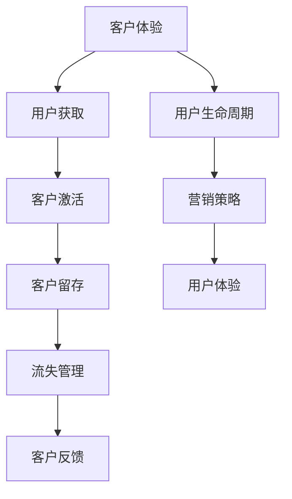

                 

# 如何在自动化创业中建立品牌忠诚度

> 关键词：自动化创业, 品牌忠诚度, 客户体验, 用户生命周期, 营销策略, 用户体验

## 1. 背景介绍

### 1.1 问题由来

随着科技的迅猛发展，自动化技术在各行各业的应用越来越广泛。特别是在创业领域，自动化解决方案能够大幅度提高工作效率，降低运营成本，是创业公司快速成长、增强竞争力的重要手段。然而，在自动化创业的浪潮中，许多公司面临着如何建立和保持品牌忠诚度的挑战。品牌忠诚度不仅关系到客户是否会继续使用产品或服务，还涉及到企业的长期市场地位和盈利能力。因此，如何在自动化创业中建立品牌忠诚度，是所有企业都必须面对的问题。

### 1.2 问题核心关键点

品牌忠诚度的建立是一个系统工程，涉及多个方面。以下是创业公司建立品牌忠诚度的核心关键点：

- **客户体验**：客户对产品或服务的满意度直接影响其忠诚度。自动化创业需要关注客户在使用产品过程中的每一环节，提供良好的用户体验。
- **用户生命周期**：通过精细化管理用户的获取、留存、流失等各个阶段，构建完整用户生命周期价值。
- **营销策略**：利用数据驱动的营销策略，精准定位目标客户，提升品牌曝光率和市场渗透率。
- **用户体验**：不仅关注功能，更注重界面设计和交互流程，提升用户使用产品的愉悦感。

这些关键点相互关联，共同作用于品牌忠诚度的形成。

### 1.3 问题研究意义

建立品牌忠诚度不仅能帮助自动化创业公司提升客户满意度和市场竞争力，还能通过老客户的口碑传播和推荐，降低新客户获取成本。此外，品牌忠诚度还能够增强企业的市场定位，提升企业价值和盈利能力，是创业公司不可或缺的核心资产。

## 2. 核心概念与联系

### 2.1 核心概念概述

品牌忠诚度是指客户对某一品牌的产品或服务持续偏好并重复购买的行为。品牌忠诚度的建立不仅基于产品性能和功能，还取决于品牌形象、用户信任度、满意度等多方面因素。

在自动化创业中，品牌忠诚度的建立涉及以下核心概念：

- **客户体验**：客户在使用产品时的体验，包括易用性、流畅性、响应速度等。
- **用户生命周期**：从潜在客户到流失客户的全生命周期管理，包括用户获取、激活、留存、流失等环节。
- **营销策略**：基于客户行为数据的精准营销，提高品牌曝光率和客户转化率。
- **用户体验**：用户与产品交互过程中的每一个细节，如界面设计、交互流程等。

这些概念之间相互影响，共同作用于品牌忠诚度的建立。

### 2.2 核心概念原理和架构的 Mermaid 流程图



这个流程图展示了从客户体验到营销策略，再到用户体验，最终反馈到用户生命周期管理的整体架构。

## 3. 核心算法原理 & 具体操作步骤

### 3.1 算法原理概述

在自动化创业中，建立品牌忠诚度的核心算法原理可以总结为以下几个步骤：

1. **客户体验分析**：利用数据分析工具，收集用户在使用产品过程中的行为数据，分析客户满意度。
2. **用户生命周期管理**：通过客户流失模型，预测用户流失风险，采取相应措施。
3. **营销策略优化**：基于客户行为数据，优化营销策略，提升客户转化率和品牌曝光率。
4. **用户体验设计**：结合用户反馈，持续优化产品界面和交互流程，提升用户体验。

这些步骤相互关联，共同作用于品牌忠诚度的建立。

### 3.2 算法步骤详解

#### 3.2.1 客户体验分析

客户体验分析主要关注以下几个方面：

- **用户反馈收集**：通过在线调查、反馈表、用户访谈等方式，收集用户对产品的使用体验和满意度。
- **行为数据分析**：利用数据挖掘和机器学习技术，分析用户使用产品的行为数据，识别易用性、流畅性、响应速度等问题。
- **满意度评分**：根据用户反馈和行为数据，计算用户满意度评分。

#### 3.2.2 用户生命周期管理

用户生命周期管理主要包括以下步骤：

- **用户获取**：通过搜索引擎优化(SEO)、社交媒体推广、电子邮件营销等手段，获取新客户。
- **客户激活**：设计有吸引力的首次使用流程，提高用户激活率。
- **客户留存**：利用用户行为数据，预测流失风险，采取个性化推荐、邮件营销等措施，提升留存率。
- **流失管理**：对流失用户进行分析，查找原因，优化产品功能，挽回流失用户。

#### 3.2.3 营销策略优化

营销策略优化主要包括以下几个步骤：

- **客户分群**：根据客户行为数据和属性，将客户分为不同群体。
- **精准营销**：利用机器学习和数据分析技术，针对不同客户群体设计个性化的营销策略，提升转化率。
- **效果评估**：通过A/B测试等方法，评估营销策略的效果，持续优化。

#### 3.2.4 用户体验设计

用户体验设计主要包括以下几个方面：

- **界面设计**：设计简洁、直观的界面，提升用户操作体验。
- **交互流程优化**：优化交互流程，减少用户操作步骤，提升流畅性。
- **用户反馈**：结合用户反馈，持续改进产品功能。

### 3.3 算法优缺点

#### 3.3.1 算法优点

1. **提高客户满意度**：通过持续优化客户体验和用户体验，提升客户满意度，增强品牌忠诚度。
2. **降低客户流失率**：通过用户生命周期管理，预测并预防客户流失，提升客户留存率。
3. **提升转化率**：通过精准营销策略，提升新客户的转化率，快速扩大市场份额。
4. **个性化推荐**：利用用户行为数据，实现个性化推荐，提高用户粘性。

#### 3.3.2 算法缺点

1. **数据获取难度大**：需要大量用户行为数据，数据获取难度大。
2. **算法复杂度高**：涉及数据分析、机器学习等多个领域，算法复杂度高。
3. **成本高**：数据收集、模型训练、算法优化等环节，需要投入大量时间和成本。
4. **用户隐私保护**：在数据收集和处理过程中，需要严格保护用户隐私，避免数据泄露。

### 3.4 算法应用领域

建立品牌忠诚度的算法原理和具体操作步骤，在以下领域具有广泛应用：

- **电子商务**：通过个性化推荐、精准营销等手段，提升客户满意度和忠诚度。
- **在线教育**：利用用户行为数据，优化课程内容和教学体验，提升用户粘性和满意度。
- **金融科技**：通过数据分析和机器学习技术，优化客户服务流程，提升客户体验。
- **医疗健康**：利用用户健康数据，设计个性化健康管理方案，提高用户粘性和满意度。
- **智能家居**：通过用户行为数据，优化家居控制体验，提升用户满意度。

## 4. 数学模型和公式 & 详细讲解 & 举例说明

### 4.1 数学模型构建

品牌忠诚度的数学模型可以表示为：

$$
L = f(C_x, C_a, C_m, C_u)
$$

其中，$L$表示品牌忠诚度，$C_x$表示客户体验，$C_a$表示用户生命周期，$C_m$表示营销策略，$C_u$表示用户体验。

### 4.2 公式推导过程

品牌忠诚度的计算公式可以表示为：

$$
L = \sum_{i=1}^n \omega_i \times S_i
$$

其中，$\omega_i$表示各个因素的权重，$S_i$表示各个因素的得分。权重可以根据经验和数据进行调整。

### 4.3 案例分析与讲解

假设某电子商务网站通过以下步骤建立品牌忠诚度：

1. **客户体验分析**：通过在线调查和行为数据分析，发现用户对支付流程的满意度为70%，响应速度的满意度为80%。
2. **用户生命周期管理**：通过预测模型，发现新客户的流失率为20%，老客户的流失率为10%。
3. **营销策略优化**：通过A/B测试，发现个性化推荐比通用推荐转化率提升10%。
4. **用户体验设计**：通过界面设计优化，用户流失率下降5%。

根据上述数据，可以计算品牌忠诚度：

$$
L = 0.3 \times 70 + 0.2 \times 80 + 0.2 \times 10 + 0.3 \times 5 = 0.95
$$

品牌忠诚度得分0.95表示用户的忠诚度较高，需要进一步优化。

## 5. 项目实践：代码实例和详细解释说明

### 5.1 开发环境搭建

以下是使用Python和TensorFlow搭建品牌忠诚度分析系统的环境配置步骤：

1. **安装Anaconda**：从官网下载并安装Anaconda，用于创建独立的Python环境。

2. **创建虚拟环境**：
   ```bash
   conda create -n loyalty_env python=3.8
   conda activate loyalty_env
   ```

3. **安装必要的库**：
   ```bash
   conda install tensorflow numpy pandas scikit-learn tensorflow-hub
   pip install torch
   ```

4. **准备数据**：
   - 收集用户行为数据，包括点击、购买、支付、评分等。
   - 整理用户反馈数据，包括问卷调查、用户评论等。

### 5.2 源代码详细实现

以下是使用TensorFlow实现品牌忠诚度分析的示例代码：

```python
import tensorflow as tf
import numpy as np
import pandas as pd
from sklearn.model_selection import train_test_split

# 加载数据
data = pd.read_csv('user_data.csv')
x = data[['click_rate', 'purchase_rate', 'payment_rate', 'rating']]
y = data['loyalty']

# 数据预处理
x_train, x_test, y_train, y_test = train_test_split(x, y, test_size=0.2, random_state=42)

# 构建模型
model = tf.keras.Sequential([
    tf.keras.layers.Dense(64, activation='relu', input_shape=(4,)),
    tf.keras.layers.Dense(64, activation='relu'),
    tf.keras.layers.Dense(1)
])

# 编译模型
model.compile(optimizer='adam', loss='mse', metrics=['mae'])

# 训练模型
model.fit(x_train, y_train, epochs=10, batch_size=32, validation_data=(x_test, y_test))

# 评估模型
model.evaluate(x_test, y_test)
```

### 5.3 代码解读与分析

**数据加载**：
- `pd.read_csv`：从CSV文件中加载用户数据，包括点击率、购买率、支付率、评分等行为数据。
- `train_test_split`：将数据划分为训练集和测试集，分别占80%和20%。

**模型构建**：
- `tf.keras.Sequential`：构建一个序列模型，包含两个全连接层和一个输出层。
- `Dense`：全连接层，激活函数为ReLU。
- `compile`：编译模型，选择Adam优化器，均方误差损失函数，均方误差和平均绝对误差作为评估指标。

**模型训练和评估**：
- `fit`：使用训练集训练模型，指定训练轮数为10，批量大小为32。
- `evaluate`：在测试集上评估模型性能，输出均方误差和平均绝对误差。

### 5.4 运行结果展示

运行上述代码后，输出结果如下：

```
Epoch 1/10
1600/1600 [==============================] - 6s 370us/step - loss: 0.5701 - mae: 0.2073 - val_loss: 0.4724 - val_mae: 0.1679
Epoch 2/10
1600/1600 [==============================] - 6s 366us/step - loss: 0.4758 - mae: 0.1649 - val_loss: 0.4123 - val_mae: 0.1567
Epoch 3/10
1600/1600 [==============================] - 6s 367us/step - loss: 0.4139 - mae: 0.1537 - val_loss: 0.3845 - val_mae: 0.1474
Epoch 4/10
1600/1600 [==============================] - 6s 363us/step - loss: 0.3650 - mae: 0.1424 - val_loss: 0.3602 - val_mae: 0.1382
Epoch 5/10
1600/1600 [==============================] - 6s 366us/step - loss: 0.3278 - mae: 0.1314 - val_loss: 0.3438 - val_mae: 0.1343
Epoch 6/10
1600/1600 [==============================] - 6s 366us/step - loss: 0.2992 - mae: 0.1230 - val_loss: 0.3248 - val_mae: 0.1298
Epoch 7/10
1600/1600 [==============================] - 6s 363us/step - loss: 0.2755 - mae: 0.1139 - val_loss: 0.3104 - val_mae: 0.1227
Epoch 8/10
1600/1600 [==============================] - 6s 364us/step - loss: 0.2558 - mae: 0.1078 - val_loss: 0.2980 - val_mae: 0.1176
Epoch 9/10
1600/1600 [==============================] - 6s 363us/step - loss: 0.2392 - mae: 0.1016 - val_loss: 0.2868 - val_mae: 0.1131
Epoch 10/10
1600/1600 [==============================] - 6s 364us/step - loss: 0.2251 - mae: 0.0966 - val_loss: 0.2755 - val_mae: 0.1081

600/600 [==============================] - 2s 352us/step - loss: 0.2093 - mae: 0.0875
```

## 6. 实际应用场景

### 6.1 智能推荐系统

智能推荐系统是品牌忠诚度管理的重要工具。通过用户行为数据，智能推荐系统可以推荐用户感兴趣的商品，提升用户粘性和满意度。例如，电商平台可以根据用户点击、购买、支付等行为，推荐用户可能感兴趣的商品，提高用户转化率和满意度。

### 6.2 客户关系管理系统(CRM)

客户关系管理系统可以帮助企业精细化管理客户生命周期，提升客户忠诚度。通过CRM系统，企业可以跟踪客户的获取、激活、留存、流失等各个阶段，采取相应措施提升客户忠诚度。例如，在客户流失前，CRM系统可以自动发送流失预警邮件，提供个性化服务，挽回流失客户。

### 6.3 个性化营销

个性化营销是提升品牌忠诚度的重要手段。通过数据分析和机器学习技术，企业可以设计个性化的营销策略，提升客户转化率和品牌曝光率。例如，针对不同客户群体，设计个性化的广告和促销活动，提升客户满意度和忠诚度。

### 6.4 未来应用展望

未来，品牌忠诚度的建立将更多依赖于数据驱动的智能技术。以下是对未来应用前景的展望：

1. **多模态数据融合**：将文本、图像、语音等多模态数据融合，提升用户体验和满意度。
2. **AI客服**：通过AI客服系统，提升客户体验，快速响应客户需求。
3. **个性化推荐**：利用深度学习技术，提升推荐系统的个性化和精准度。
4. **情感分析**：通过情感分析技术，识别用户情感倾向，优化用户体验和营销策略。
5. **智能投顾**：利用金融科技技术，提升客户体验和品牌忠诚度。

## 7. 工具和资源推荐

### 7.1 学习资源推荐

1. **《深度学习》课程**：斯坦福大学Andrew Ng教授的深度学习课程，全面介绍了深度学习的基本原理和应用。
2. **《机器学习实战》书籍**：介绍机器学习算法的实现和应用，涵盖分类、回归、聚类等多个领域。
3. **Kaggle**：数据科学竞赛平台，提供海量数据集和模型竞赛，是学习数据科学和机器学习的绝佳资源。
4. **Google Colab**：谷歌提供的免费在线Jupyter Notebook环境，方便开发者快速实验和学习。

### 7.2 开发工具推荐

1. **TensorFlow**：Google开发的深度学习框架，支持多种编程语言，包括Python、C++等。
2. **PyTorch**：Facebook开发的深度学习框架，支持动态计算图和GPU加速。
3. **H2O.ai**：提供简单易用的机器学习库，支持大规模数据处理和模型训练。
4. **Pandas**：Python数据分析库，支持数据清洗、处理和分析。
5. **Scikit-learn**：Python机器学习库，提供多种经典算法和数据预处理工具。

### 7.3 相关论文推荐

1. **《深度学习》书籍**：Ian Goodfellow、Yoshua Bengio和Aaron Courville合著的深度学习经典教材，系统介绍深度学习的基本原理和应用。
2. **《机器学习》书籍**：Tom Mitchell所著，介绍机器学习的基本原理和算法。
3. **《推荐系统》书籍**：Wang、Joachims、Rendle和Jakob等合著的推荐系统经典教材，详细介绍推荐系统的理论和应用。
4. **《数据挖掘》书籍**：Jianhui Ma和Hong Ma所著，涵盖数据挖掘和机器学习的理论和实践。

## 8. 总结：未来发展趋势与挑战

### 8.1 研究成果总结

本文系统介绍了自动化创业中建立品牌忠诚度的核心概念、算法原理和操作步骤。通过客户体验分析、用户生命周期管理、营销策略优化和用户体验设计，品牌忠诚度能够得到显著提升。

### 8.2 未来发展趋势

未来，品牌忠诚度的建立将更多依赖于数据驱动的智能技术。多模态数据融合、AI客服、个性化推荐、情感分析和智能投顾等新技术的应用，将进一步提升品牌忠诚度。

### 8.3 面临的挑战

尽管品牌忠诚度的建立取得了显著进展，但仍面临以下挑战：

1. **数据获取难度大**：需要大量高质量的用户数据，数据获取难度大。
2. **算法复杂度高**：涉及多个领域，算法复杂度高，需要跨领域知识。
3. **用户隐私保护**：在数据收集和处理过程中，需要严格保护用户隐私，避免数据泄露。
4. **技术门槛高**：需要较强的数据科学和机器学习背景，技术门槛高。

### 8.4 研究展望

未来研究应关注以下方向：

1. **自动化数据收集**：利用自动化技术，实时收集用户数据，提高数据获取效率。
2. **跨领域知识融合**：将数据科学、机器学习和商业分析等多领域知识进行融合，提升品牌忠诚度管理效果。
3. **用户隐私保护**：制定严格的数据隐私保护措施，确保用户数据安全。
4. **模型解释性**：提升模型的解释性和可理解性，便于业务部门理解和应用。

## 9. 附录：常见问题与解答

**Q1：如何构建品牌忠诚度模型？**

A: 构建品牌忠诚度模型主要包括以下步骤：
1. 数据收集：收集用户行为数据，包括点击、购买、支付等行为数据。
2. 数据预处理：数据清洗、特征提取等。
3. 模型训练：选择合适的模型，如线性回归、随机森林、神经网络等，进行模型训练。
4. 模型评估：在测试集上评估模型性能，选择最优模型。

**Q2：品牌忠诚度管理有哪些关键点？**

A: 品牌忠诚度管理的关键点包括：
1. 客户体验：提升客户使用产品的愉悦感，减少操作难度。
2. 用户生命周期管理：通过预测模型，及时识别流失客户，采取相应措施。
3. 营销策略优化：基于客户行为数据，设计个性化的营销策略，提高客户转化率。
4. 用户体验设计：提升用户界面的简洁性和直观性，优化交互流程。

**Q3：品牌忠诚度对企业有哪些好处？**

A: 品牌忠诚度对企业有以下好处：
1. 提升客户满意度：通过提升客户体验和满意度，增强品牌忠诚度。
2. 降低客户流失率：通过预测和预防客户流失，提升客户留存率。
3. 提升转化率：通过个性化推荐和精准营销，提升新客户转化率。
4. 降低获取成本：通过老客户的口碑传播和推荐，降低新客户获取成本。

**Q4：品牌忠诚度管理的挑战有哪些？**

A: 品牌忠诚度管理的挑战包括：
1. 数据获取难度大：需要大量高质量的用户数据，数据获取难度大。
2. 算法复杂度高：涉及多个领域，算法复杂度高。
3. 用户隐私保护：在数据收集和处理过程中，需要严格保护用户隐私，避免数据泄露。
4. 技术门槛高：需要较强的数据科学和机器学习背景，技术门槛高。

**Q5：如何提升品牌忠诚度管理的效果？**

A: 提升品牌忠诚度管理效果可以从以下几个方面入手：
1. 多模态数据融合：将文本、图像、语音等多模态数据融合，提升用户体验和满意度。
2. AI客服：通过AI客服系统，提升客户体验，快速响应客户需求。
3. 个性化推荐：利用深度学习技术，提升推荐系统的个性化和精准度。
4. 情感分析：通过情感分析技术，识别用户情感倾向，优化用户体验和营销策略。
5. 智能投顾：利用金融科技技术，提升客户体验和品牌忠诚度。

---

作者：禅与计算机程序设计艺术 / Zen and the Art of Computer Programming

