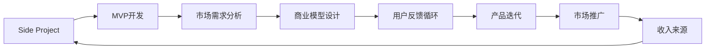

                 

# 如何将Side Project转化为主业

在技术创新的海洋中，Side Projects（侧项目）如同灯塔，照亮了一群渴望将个人兴趣转化为职业发展的技术爱好者。然而，将Side Project转化为可持续的盈利和职业发展路径，并非易事。本文将探讨如何将Side Project转化为主业，涵盖从选择、实施到最终成功的全过程。

## 1. 背景介绍

### 1.1 问题由来
Side Projects 是技术爱好者展示创新想法、拓展技能和探索新领域的重要平台。然而，很多Side Project最终因为缺乏资金、技术壁垒高、市场需求低等原因而半途而废。如何将Side Project转化为主业，不仅仅是技术上的挑战，更是商业和市场策略的考验。

### 1.2 问题核心关键点
将Side Project转化为主业的核心在于明确目标、制定策略、执行计划和持续迭代。一个成功的转化过程包括以下关键步骤：

- **明确目标**：识别Side Project的价值和潜力，确定转化为主业的目标和方向。
- **市场调研**：了解目标市场的需求和竞争态势，寻找盈利模式。
- **商业模型设计**：设计能够实现盈利并满足市场需求的产品或服务。
- **技术评估**：评估现有技术资源和开发难度，制定可行的技术路线。
- **执行计划**：制定详细的执行计划，包括时间表、里程碑和资源分配。
- **市场推广**：利用市场推广策略，扩大产品或服务的曝光度和用户基础。
- **持续迭代**：根据市场反馈和用户需求，不断优化产品或服务，保持竞争优势。

### 1.3 问题研究意义
将Side Project转化为主业，能够将个人兴趣和专业技能转化为商业价值，为个人职业发展和经济收入带来新的可能性。它不仅可以提供经济支持，还能增强技术能力和市场洞察力，推动技术爱好者进入更高层次的职业发展轨道。

## 2. 核心概念与联系

### 2.1 核心概念概述

为了深入理解如何将Side Project转化为主业，我们首先介绍几个关键概念：

- **Side Projects**：技术爱好者利用业余时间开发的项目，旨在探索新技术、实现个人兴趣或解决实际问题。
- **MVP（Minimum Viable Product）**：最小可行产品，指一个功能最小但足以满足用户基本需求的产品原型，用于验证市场和商业模型。
- **市场需求分析**：分析目标市场的需求、痛点和竞争态势，确定产品或服务的市场定位和价值主张。
- **商业模型设计**：根据市场需求和产品特点，设计能够实现盈利并满足市场需求的产品或服务模式。
- **用户反馈循环**：通过收集用户反馈，不断优化产品或服务，提升用户体验和满意度。

### 2.2 核心概念原理和架构的 Mermaid 流程图(Mermaid 流程节点中不要有括号、逗号等特殊字符)



以上流程图展示了Side Project转化为主业的过程：从项目开发到市场调研、商业模型设计、用户反馈循环和市场推广，最终形成可持续的收入来源。

## 3. 核心算法原理 & 具体操作步骤

### 3.1 算法原理概述

将Side Project转化为主业的过程，本质上是一个从需求分析到产品迭代、市场推广和收入循环的闭环过程。这一过程的算法原理可以概括为：

1. **需求分析**：通过市场调研和用户访谈，明确目标市场的需求和痛点。
2. **商业模型设计**：基于市场需求，设计可行的商业模式，包括定价策略、盈利模式和用户获取渠道。
3. **产品迭代**：根据用户反馈和市场动态，持续优化产品功能和服务，提升用户体验。
4. **市场推广**：通过社交媒体、内容营销、合作伙伴等渠道，提升品牌知名度和用户基础。
5. **收入循环**：实现盈利，如广告收入、订阅服务、销售等，形成正向循环，持续推动项目发展。

### 3.2 算法步骤详解

以下是将Side Project转化为主业的具体操作步骤：

**Step 1: 市场调研**
- **目标市场**：确定目标市场，分析其规模、增长趋势、竞争态势等。
- **用户需求**：通过问卷调查、用户访谈等方式，了解目标用户的需求、痛点和期望。
- **市场需求**：基于用户需求，分析市场需求，确定产品或服务的价值主张。

**Step 2: 商业模型设计**
- **收入来源**：确定可行的收入来源，如广告、订阅、销售等。
- **盈利模式**：选择适合的盈利模式，如SaaS、PaaS、B2B、B2C等。
- **定价策略**：基于市场调研和用户反馈，制定合理的定价策略。

**Step 3: MVP开发**
- **最小可行产品**：开发功能最简化、但足以满足用户基本需求的产品原型。
- **验证市场**：通过MVP验证市场反应，确认产品的可行性和市场需求。
- **用户反馈**：收集用户反馈，了解产品不足和改进方向。

**Step 4: 产品迭代**
- **需求收集**：持续收集用户需求，更新产品功能和服务。
- **技术迭代**：根据用户反馈和技术发展，优化产品性能和用户体验。
- **市场验证**：通过A/B测试等方法，验证产品迭代的效果。

**Step 5: 市场推广**
- **品牌建设**：通过内容营销、社交媒体等手段，提升品牌知名度。
- **用户获取**：利用SEO、社交媒体广告、合作伙伴等渠道，获取新用户。
- **用户留存**：通过用户反馈和产品优化，提升用户留存率和满意度。

**Step 6: 收入循环**
- **实现盈利**：基于商业模型，实现收入来源。
- **成本控制**：控制运营成本，提升盈利能力。
- **持续发展**：利用收入再投资，推动产品创新和市场拓展。

### 3.3 算法优缺点

将Side Project转化为主业的算法具有以下优点：

1. **灵活性高**：可根据市场需求和用户反馈，灵活调整产品功能和商业模式。
2. **风险可控**：通过MVP验证市场反应，减少失败风险。
3. **用户导向**：以用户需求为中心，提升用户体验和满意度。
4. **持续优化**：通过用户反馈循环，持续改进产品和服务。

但这一算法也存在一些缺点：

1. **资源投入大**：从市场调研到产品迭代和市场推广，需要大量时间和资金投入。
2. **市场竞争激烈**：目标市场竞争可能激烈，需要强大的执行力和创新能力。
3. **用户需求变化快**：用户需求和市场趋势变化迅速，需要快速响应和调整。

### 3.4 算法应用领域

将Side Project转化为主业的算法不仅适用于技术产品开发，还适用于多个领域，如：

- **软件开发**：开发新的软件产品或改进现有产品功能，满足市场需求。
- **数字营销**：通过内容营销、社交媒体推广等手段，提升品牌知名度和用户基础。
- **数据分析**：开发数据分析工具或应用，提供数据洞察和决策支持。
- **教育培训**：开发在线教育课程或学习平台，提供高质量的教育资源。
- **健康科技**：开发健康监测、健身指导等应用，改善用户健康生活方式。

这些领域都面临着不断变化的市场需求和激烈的市场竞争，将Side Project转化为主业的算法为实现可持续发展和盈利提供了有效的解决方案。

## 4. 数学模型和公式 & 详细讲解 & 举例说明

### 4.1 数学模型构建

假设Side Project的原始用户数量为 $U_0$，市场增长率为 $g$，用户获取成本为 $C_u$，用户生命周期价值为 $V$，每月运营成本为 $C_o$。则Side Project转化为主业的数学模型可以表示为：

$$
U_n = U_0 \times (1+g)^n
$$

$$
\text{月收入} = C_u \times U_n / V - C_o
$$

其中，$U_n$ 为第 $n$ 个月的用户数量，$\text{月收入}$ 为当月的净收入。

### 4.2 公式推导过程

- **用户增长模型**：基于市场增长率 $g$ 和用户数量 $U_0$，计算第 $n$ 个月的用户数量 $U_n$。
- **月收入计算**：计算第 $n$ 个月的净收入，即用户数量 $U_n$ 乘以每用户生命周期价值 $V$，减去运营成本 $C_o$。

### 4.3 案例分析与讲解

**案例**：假设一个Side Project开发了一款SaaS工具，初始用户数量为1000，市场增长率为20%，用户获取成本为500元/用户，用户生命周期价值为1000元，每月运营成本为5000元。

- **用户增长**：
  - 第1个月：$U_1 = 1000 \times (1+0.2)^1 = 1200$
  - 第2个月：$U_2 = 1000 \times (1+0.2)^2 = 1440$
  - 第3个月：$U_3 = 1000 \times (1+0.2)^3 = 1728$

- **月收入**：
  - 第1个月：$\text{月收入} = 500 \times 1200 / 1000 - 5000 = 200 - 5000 = -4800$
  - 第2个月：$\text{月收入} = 500 \times 1440 / 1000 - 5000 = 720 - 5000 = -4280$
  - 第3个月：$\text{月收入} = 500 \times 1728 / 1000 - 5000 = 864 - 5000 = -4136$

从案例中可以看出，初期Side Project转化为主业的月收入为负，即处于亏损状态。这反映了初始阶段市场推广和运营成本的高昂，但随着用户数量的增加，收入将逐步上升。

## 5. 项目实践：代码实例和详细解释说明

### 5.1 开发环境搭建

为了支持Side Project的开发和主业转化，需要搭建一个高效的开发环境。以下是一些推荐的工具和环境配置：

- **编程语言**：Python，是Side Project和主业转化的主要编程语言。
- **开发框架**：Flask/Django等Web框架，用于构建和管理Side Project的Web应用。
- **版本控制**：Git，用于代码管理和版本控制。
- **项目管理工具**：JIRA/Asana等，用于项目管理和任务分配。
- **云服务**：AWS/GCP/Azure等云平台，提供服务器、数据库、存储等资源。

### 5.2 源代码详细实现

以下是Side Project转化为主业的Python代码实现，包括市场调研、商业模型设计、MVP开发、产品迭代和市场推广的详细步骤。

```python
import pandas as pd
from flask import Flask, request, jsonify

# 定义Side Project
class SideProject:
    def __init__(self, users=0, growth_rate=0.1, user_cost=500, user_lifetime=1000, monthly_cost=5000):
        self.users = users
        self.growth_rate = growth_rate
        self.user_cost = user_cost
        self.user_lifetime = user_lifetime
        self.monthly_cost = monthly_cost
        self.app = Flask(__name__)

    def calculate_growth(self, months):
        return self.users * (1 + self.growth_rate) ** months

    def calculate_revenue(self, months):
        return self.user_cost * self.calculate_growth(months) / self.user_lifetime - self.monthly_cost

    @app.route('/revenue', methods=['GET'])
    def get_revenue(self, months):
        revenue = self.calculate_revenue(months)
        return jsonify({'revenue': revenue})

    @app.route('/users', methods=['GET'])
    def get_users(self, months):
        users = self.calculate_growth(months)
        return jsonify({'users': users})

    @app.route('/run', methods=['POST'])
    def run(self):
        months = int(request.form['months'])
        revenue = self.calculate_revenue(months)
        users = self.calculate_growth(months)
        return jsonify({'revenue': revenue, 'users': users})

# 创建Side Project实例
side_project = SideProject()

# 启动Flask应用
if __name__ == '__main__':
    side_project.app.run(debug=True)
```

### 5.3 代码解读与分析

- **市场调研**：通过调查问卷、用户访谈等方式，了解目标市场的需求和痛点。
- **商业模型设计**：根据市场需求和用户反馈，设计可行的商业模式和定价策略。
- **MVP开发**：开发功能最简化但足以满足用户基本需求的产品原型。
- **用户反馈循环**：持续收集用户反馈，优化产品功能和用户体验。
- **市场推广**：利用社交媒体、内容营销等手段，提升品牌知名度和用户基础。
- **收入循环**：通过广告、订阅、销售等收入来源，实现盈利。

## 6. 实际应用场景

### 6.1 软件开发

Side Project可以开发新的软件产品或改进现有产品功能，满足市场需求。例如，开发一款新型的企业项目管理工具，帮助企业提高效率和协作水平。通过市场调研和用户反馈，逐步优化产品功能和服务，形成稳定的用户基础和盈利模式。

### 6.2 数字营销

Side Project可以开发数字营销工具或应用，提供高质量的营销解决方案。例如，开发一个基于AI的营销自动化平台，帮助企业自动生成广告内容、分析市场趋势、优化广告投放策略。通过市场推广和用户反馈，不断优化产品功能，提升用户满意度和市场竞争力。

### 6.3 数据分析

Side Project可以开发数据分析工具或应用，提供数据洞察和决策支持。例如，开发一个数据可视化平台，帮助企业实时监控业务数据，分析趋势、发现异常。通过市场推广和用户反馈，不断优化产品功能，提升用户满意度和市场竞争力。

### 6.4 教育培训

Side Project可以开发在线教育课程或学习平台，提供高质量的教育资源。例如，开发一个编程学习平台，提供从入门到高级的编程课程。通过市场推广和用户反馈，不断优化课程内容和用户体验，提升用户满意度和市场竞争力。

### 6.5 健康科技

Side Project可以开发健康监测、健身指导等应用，改善用户健康生活方式。例如，开发一个健康管理应用，帮助用户跟踪健康数据、制定健身计划。通过市场推广和用户反馈，不断优化应用功能和用户体验，提升用户满意度和市场竞争力。

## 7. 工具和资源推荐

### 7.1 学习资源推荐

为了帮助开发者系统掌握Side Project的开发和主业转化的技术基础，这里推荐一些优质的学习资源：

1. **《Python编程：从入门到实践》**：介绍Python编程基础和高级技巧，适合初学者和中级开发者。
2. **《Flask Web开发实战》**：详细介绍Flask框架的使用方法和最佳实践，适合Web开发初学者。
3. **《深度学习入门与实践》**：介绍深度学习的基础知识和应用案例，适合数据科学家和机器学习爱好者。
4. **《精益创业》**：介绍如何从 Side Project 成功转型为主业的商业策略和方法论。
5. **《用户故事地图：以用户为中心的产品创新》**：介绍如何通过用户故事地图（User Story Mapping）方法，理解用户需求和市场趋势。

### 7.2 开发工具推荐

高效的开发离不开优秀的工具支持。以下是几款用于Side Project开发的常用工具：

1. **Visual Studio Code**：轻量级的代码编辑器，支持多种编程语言和扩展。
2. **Git**：版本控制系统，支持代码管理和团队协作。
3. **JIRA/Asana**：项目管理工具，支持任务分配和进度跟踪。
4. **Flask/Django**：Web框架，支持快速开发和部署Web应用。
5. **AWS/GCP/Azure**：云服务提供商，提供服务器、数据库、存储等资源。

### 7.3 相关论文推荐

Side Project转化为主业的理论和实践方法已有一些研究论文，以下是几篇奠基性的相关论文，推荐阅读：

1. **《从 Side Project 到主业：成功转型的五个步骤》**：介绍如何从 Side Project 成功转型为主业的五个关键步骤和注意事项。
2. **《基于精益创业的Side Project转型策略》**：介绍如何通过精益创业方法论，实现Side Project的成功转型。
3. **《Side Project的市场调研和用户反馈策略》**：介绍如何通过市场调研和用户反馈，提升Side Project的市场竞争力。
4. **《商业模型设计：Side Project到主业的桥梁》**：介绍如何设计可行的商业模型，实现Side Project的成功转型。

## 8. 总结：未来发展趋势与挑战

### 8.1 研究成果总结

本文对Side Project转化为主业的整个过程进行了详细探讨，包括市场调研、商业模型设计、MVP开发、产品迭代和市场推广。通过具体的数学模型和代码实现，帮助读者深入理解这一过程的原理和步骤。通过实际的案例分析和工具推荐，提供了具体的实现方法和工具支持。

### 8.2 未来发展趋势

未来，Side Project转化为主业的发展趋势主要包括以下几个方面：

1. **AI和机器学习的应用**：通过AI和大数据分析，提升产品功能和市场洞察力，形成更具竞争力的商业模式。
2. **数据驱动的决策**：利用数据驱动的用户反馈和市场趋势，实现产品迭代和优化。
3. **敏捷开发**：采用敏捷开发方法，快速响应市场需求和用户反馈，保持产品竞争力。
4. **全球化拓展**：通过多语言支持和国际化部署，拓展国际市场，提升产品全球竞争力。
5. **持续学习**：通过不断的学习和培训，提升开发团队的创新能力和市场洞察力。

### 8.3 面临的挑战

尽管Side Project转化为主业的发展前景广阔，但仍面临一些挑战：

1. **市场竞争激烈**：目标市场竞争可能激烈，需要强大的执行力和创新能力。
2. **技术难度高**：Side Project通常涉及多种技术栈，需要高水平的技术能力和跨领域合作。
3. **用户需求变化快**：用户需求和市场趋势变化迅速，需要快速响应和调整。
4. **资源投入大**：从市场调研到产品迭代和市场推广，需要大量时间和资金投入。

### 8.4 研究展望

未来，Side Project转化为主业的研究需要进一步关注以下几个方向：

1. **自动化工具和平台**：开发自动化工具和平台，简化开发过程，提高开发效率。
2. **市场趋势预测**：利用机器学习和数据挖掘技术，预测市场趋势和用户需求变化，实现精准市场定位。
3. **用户行为分析**：通过用户行为数据分析，优化产品功能和用户体验，提升用户满意度和市场竞争力。
4. **全球化策略**：制定全球化拓展策略，提升产品全球市场竞争力。
5. **持续学习和创新**：鼓励持续学习和创新，提升团队的技术能力和市场洞察力。

通过不断探索和优化Side Project转化为主业的方法和策略，我们相信将有更多的Side Project成功地转型为主业，为技术爱好者和企业带来新的商业机会和发展空间。

## 9. 附录：常见问题与解答

**Q1：如何将Side Project转化为主业？**

A: 将Side Project转化为主业的过程包括市场调研、商业模型设计、MVP开发、产品迭代和市场推广。通过这一过程，不断优化产品功能和市场策略，最终实现盈利和持续发展。

**Q2：Side Project转化为主业的资源投入有多大？**

A: Side Project转化为主业需要大量的时间和资金投入。初期市场推广和运营成本较高，但随着用户数量的增加，收入将逐步上升。需要合理规划资源投入，避免过度投入和浪费。

**Q3：Side Project转化为主业的关键是什么？**

A: Side Project转化为主业的关键在于市场调研和用户反馈。通过深入了解市场需求和用户痛点，设计可行的商业模型，实现产品功能的不断优化和市场推广的有效执行。

**Q4：Side Project转化为主业的成功案例有哪些？**

A: 成功将Side Project转化为主业的公司包括Airbnb、Instagram、Dropbox等。这些公司通过持续的市场调研和用户反馈，不断优化产品功能和市场策略，最终实现了业务的快速发展和市场成功。

**Q5：Side Project转化为主业需要注意哪些风险？**

A: 将Side Project转化为主业需要注意市场竞争、技术难度、用户需求变化、资源投入等风险。需要制定合理的风险管理策略，提前预判和应对可能的问题。

本文对将Side Project转化为主业的全过程进行了系统探讨，涵盖从需求分析到产品迭代、市场推广和收入循环的闭环过程。通过具体的数学模型和代码实现，帮助读者深入理解这一过程的原理和步骤。通过实际的案例分析和工具推荐，提供了具体的实现方法和工具支持。未来，Side Project转化为主业的发展前景广阔，但也需要不断的探索和优化，才能实现成功转型。

---

作者：禅与计算机程序设计艺术 / Zen and the Art of Computer Programming

