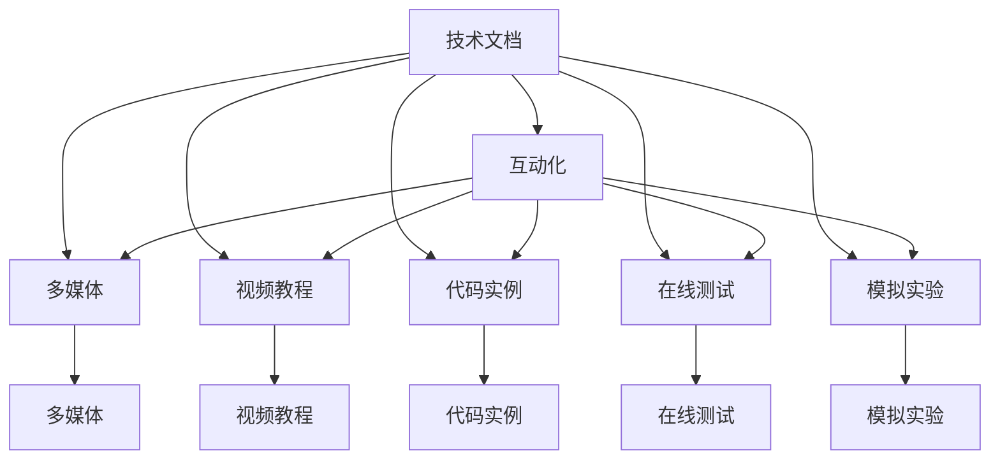

                 

## 1. 背景介绍

在数字化时代，技术文档作为知识传递的重要媒介，其数量与质量都在迅速增长。但传统的文档形式已经难以满足现代用户的学习需求，如何将其转化为更具互动性、沉浸感和个性化体验的学习平台，成为了一个重要课题。互动式学习平台不仅能提升学习效率，还能增强用户对知识的理解和记忆，具有广阔的应用前景。本文将探讨如何通过技术手段，将技术文档转化为互动式学习平台，并在此过程中，提升用户的学习体验和效果。

### 1.1 问题由来

现代技术文档形式单一，主要以静态文本和图片为主，用户只能被动接受信息。相比之下，互动式学习平台通过多媒体、游戏化、互动化的方式，提供更加直观、深入的学习体验。例如，代码实例、交互式编程、在线问答、模拟实验等，都能在提升学习效果的同时，激发用户的学习兴趣。此外，互动式学习平台还支持个性化推荐和社区互动，根据用户的学习行为和反馈，动态调整学习内容和进度，提供更加精准的学习支持。

### 1.2 问题核心关键点

将技术文档转化为互动式学习平台，需要解决以下关键问题：
1. 如何高效地将技术文档中的知识，转化为互动性的学习内容？
2. 如何利用技术手段，增强用户的学习体验和效果？
3. 如何构建一个可持续发展的互动式学习平台？

## 2. 核心概念与联系

### 2.1 核心概念概述

为更好地理解如何将技术文档转化为互动式学习平台，本节将介绍几个密切相关的核心概念：

- 技术文档：以静态文本、图片、代码等多种形式，记录技术原理、操作步骤、故障排除等内容，为技术交流和知识传承提供基础。
- 互动式学习平台：利用多媒体、游戏化、互动化的方式，提升用户的学习体验和效果。常见的互动形式包括视频教程、在线测试、模拟实验等。
- 互动学习理论：研究如何通过互动的方式，增强学习效果和记忆力的理论。例如，主动学习、社会学习、认知负荷等理论。
- 学习管理系统(LMS)：支持在线课程、互动学习、评估反馈等功能，是构建互动式学习平台的重要工具。
- 游戏化学习(Gamification)：将游戏元素引入学习过程，通过奖励、竞赛、反馈等方式提升学习动机和效率。
- 自适应学习系统(Adaptive Learning System)：根据用户的学习行为和表现，动态调整学习内容和学习策略，提供个性化学习支持。

这些核心概念之间的逻辑关系可以通过以下Mermaid流程图来展示：



这个流程图展示了技术文档到互动式学习平台的转化过程，以及各环节的关键互动形式。

## 3. 核心算法原理 & 具体操作步骤

### 3.1 算法原理概述

将技术文档转化为互动式学习平台，本质上是一个知识组织和呈现的复杂问题。其核心思想是通过互动化的方式，将静态的技术文档转化为动态的学习内容，提升用户的学习体验和效果。

具体而言，可以将技术文档中的关键知识点，转化为视频教程、代码实例、在线测试、模拟实验等多种互动形式。通过多媒体、游戏化、自适应学习等技术，提升用户的学习动机和效果。

### 3.2 算法步骤详解

以下是将技术文档转化为互动式学习平台的一般步骤：

**Step 1: 文档内容分析**

- 收集技术文档，包括代码库、用户手册、技术白皮书等。
- 对文档内容进行文本分析和结构化处理，提取关键知识点、操作步骤、代码片段等。
- 通过NLP技术，对文档中的知识点进行分类和标注，以便于后续的互动化设计。

**Step 2: 知识可视化**

- 将文档中的知识点转化为图形、动画、视频等多种形式，增强用户对知识的理解。
- 利用可视化技术，将复杂的代码实现过程拆分为多个步骤，通过流程图、时序图等形式进行展示。
- 引入虚拟现实(VR)和增强现实(AR)技术，通过3D模型和虚拟场景，提升用户的学习体验。

**Step 3: 互动化设计**

- 设计互动学习活动，例如编程挑战、在线问答、模拟实验等，鼓励用户积极参与。
- 利用游戏化技术，通过积分、徽章、排行榜等机制，激发用户的学习动机和成就感。
- 应用自适应学习算法，根据用户的学习行为和反馈，动态调整学习内容和进度，提供个性化支持。

**Step 4: 平台部署与维护**

- 选择合适的技术栈，构建互动式学习平台，支持用户登录、课程管理、互动交流等功能。
- 部署平台至云端或本地服务器，确保平台的稳定性和可扩展性。
- 定期维护和更新平台内容，持续提升用户的学习体验。

### 3.3 算法优缺点

将技术文档转化为互动式学习平台具有以下优点：
1. 提升学习效果：通过多媒体、游戏化、互动化的方式，提升用户的学习体验和效果。
2. 支持个性化学习：根据用户的学习行为和反馈，动态调整学习内容和进度，提供个性化支持。
3. 促进知识传播：互动式平台易于分享和传播，帮助更多人获取和掌握知识。
4. 增强用户参与：通过互动活动和游戏化设计，提高用户的学习兴趣和参与度。

同时，该方法也存在一定的局限性：
1. 开发成本高：互动式平台的设计、开发和维护需要较高的人力和技术投入。
2. 内容复杂度高：将技术文档转化为互动形式，需要设计复杂的内容结构和互动流程。
3. 技术门槛高：需要掌握NLP、可视化、游戏化、自适应学习等多项技术。
4. 用户接受度低：部分用户可能对互动形式不适应，难以接受复杂的学习内容。

尽管存在这些局限性，但就目前而言，将技术文档转化为互动式学习平台，仍然是大势所趋，具有良好的发展前景。未来相关研究的重点在于如何进一步降低开发成本，简化互动设计流程，提升用户体验，并结合更多技术手段，如虚拟现实、增强现实等，以实现更高效、更具沉浸感的学习体验。

### 3.4 算法应用领域

将技术文档转化为互动式学习平台，已经在诸多领域得到了应用，例如：

- 软件开发：通过代码实例、编程挑战、模拟实验等方式，提升软件开发者的编程技能和理解能力。
- 数据分析：利用可视化工具和互动实验，帮助用户掌握数据处理、机器学习等技能。
- 教育培训：将课程内容转化为互动式学习材料，提升学生的学习效果和参与度。
- 工业培训：通过模拟实验、虚拟演示等方式，为工业操作人员提供实时、互动的学习体验。
- 远程协作：利用互动式学习平台，支持远程学习和协作，促进知识共享和团队合作。

除了上述这些典型应用外，互动式学习平台还被创新性地应用到更多场景中，如医疗知识传播、应急响应培训等，为教育和培训带来了新的发展机遇。

## 4. 数学模型和公式 & 详细讲解 & 举例说明

### 4.1 数学模型构建

本节将使用数学语言对将技术文档转化为互动式学习平台的过程进行更加严格的刻画。

设技术文档包含 $N$ 个知识点，其中第 $i$ 个知识点的复杂度为 $c_i$，用户对第 $i$ 个知识点的掌握程度为 $p_i$。互动式学习平台的目标是最大化用户的学习效果 $E$，即：

$$
E = \max_{p_1,...,p_N} \sum_{i=1}^N \text{Value}(p_i) \times c_i
$$

其中 $\text{Value}(p_i)$ 为第 $i$ 个知识点掌握程度对学习效果的贡献函数。

在数学上，可以通过优化算法求解该问题的最优解。在实际应用中，可以通过互动化设计、游戏化激励等手段，逐步提升用户对知识点的掌握程度 $p_i$，最终实现学习效果的最大化。

### 4.2 公式推导过程

以下我们以一个简单的编程示例，推导互动式学习平台的学习效果优化过程。

假设用户需要掌握一个函数 $f(x) = x^2$ 的实现，平台通过互动式编程活动进行教学。用户首先需要理解函数定义，然后通过互动式的代码实例和在线测试，逐步掌握函数实现。

设用户对函数定义的掌握程度为 $p_1$，对函数实现的掌握程度为 $p_2$。互动式学习平台的目标是最大化用户对函数实现的掌握程度 $p_2$，即：

$$
E = \max_{p_1,p_2} p_2 \times c_2
$$

其中 $c_2$ 为函数实现的复杂度。

为了最大化 $p_2$，需要设计互动活动，逐步提升 $p_1$ 和 $p_2$。设互动活动包括三个步骤：
1. 函数定义讲解：通过视频教程、幻灯片等方式，解释函数定义。
2. 代码实例展示：通过代码实例，演示函数实现过程。
3. 在线测试：通过互动测试，检测用户对函数实现的掌握程度。

设活动1、活动2、活动3对 $p_1$、$p_2$ 的提升效果分别为 $a_1$、$a_2$、$a_3$，则互动活动的学习效果模型为：

$$
E = (p_1 + a_1 \times p_1 + a_2 \times p_1) \times a_2 \times p_2
$$

为了最大化 $E$，需要通过优化算法求解 $a_1$、$a_2$、$a_3$，并设计合适的互动流程。在实际应用中，可以通过实验和反馈，逐步优化活动设计，提升用户的学习效果。

### 4.3 案例分析与讲解

下面我们以一个具体的案例，演示如何将技术文档转化为互动式学习平台。

假设我们要将一份关于Python异常处理机制的文档，转化为互动式学习平台。

**Step 1: 文档内容分析**

首先，对文档内容进行文本分析和结构化处理，提取关键知识点、操作步骤、代码片段等。例如，文档中可能包含以下知识点：
- 异常处理基本概念
- try-except语句语法
- 常见的异常类型
- 自定义异常处理

**Step 2: 知识可视化**

然后，将文档中的知识点转化为图形、动画、视频等多种形式，增强用户对知识的理解。例如，通过动画演示try-except语句的执行流程，通过视频讲解自定义异常处理的实现方法。

**Step 3: 互动化设计**

接下来，设计互动学习活动，例如编程挑战、在线问答、模拟实验等。例如，设计一个互动编程挑战，让用户输入一个简单的代码片段，检测其异常处理能力。通过不断优化代码和挑战难度，逐步提升用户对异常处理机制的理解和掌握。

**Step 4: 平台部署与维护**

最后，选择合适的技术栈，构建互动式学习平台，支持用户登录、课程管理、互动交流等功能。部署平台至云端或本地服务器，确保平台的稳定性和可扩展性。定期维护和更新平台内容，持续提升用户的学习体验。

通过上述步骤，我们可以将技术文档转化为互动式学习平台，提升用户的学习效果和参与度。

## 5. 项目实践：代码实例和详细解释说明

### 5.1 开发环境搭建

在进行互动式学习平台开发前，我们需要准备好开发环境。以下是使用Python进行Flask框架开发的环境配置流程：

1. 安装Python：从官网下载并安装Python，作为项目开发的环境。
2. 安装Flask：通过pip安装Flask框架。
3. 创建虚拟环境：
```bash
python -m venv myenv
source myenv/bin/activate
```
4. 安装Flask所需依赖：
```bash
pip install Flask Jinja2 WTForms
```

完成上述步骤后，即可在虚拟环境中开始开发。

### 5.2 源代码详细实现

下面我们以一个简单的编程挑战平台为例，给出使用Flask框架构建互动式学习平台的PyTorch代码实现。

首先，定义Flask应用和路由：

```python
from flask import Flask, render_template, request
from flask_sqlalchemy import SQLAlchemy
from wtforms import Form, StringField, SubmitField, TextAreaField

app = Flask(__name__)
app.config['SQLALCHEMY_DATABASE_URI'] = 'sqlite:///test.db'
db = SQLAlchemy(app)

class InputForm(Form):
    code = TextAreaField('输入代码：')
    submit = SubmitField('提交')

class Challenge(db.Model):
    id = db.Column(db.Integer, primary_key=True)
    name = db.Column(db.String(100), nullable=False)
    description = db.Column(db.Text, nullable=False)
    test_cases = db.relationship('TestCase', backref='challenge', lazy=True)

class TestCase(db.Model):
    id = db.Column(db.Integer, primary_key=True)
    challenge_id = db.Column(db.Integer, db.ForeignKey('challenge.id'), nullable=False)
    test_case = db.Column(db.Text, nullable=False)
    expected_result = db.Column(db.Text, nullable=False)
    user_submission = db.Column(db.Text, nullable=True)

@app.route('/')
def index():
    return render_template('index.html')
```

然后，定义挑战、测试用例和用户提交的模型：

```python
class Challenge(db.Model):
    id = db.Column(db.Integer, primary_key=True)
    name = db.Column(db.String(100), nullable=False)
    description = db.Column(db.Text, nullable=False)
    test_cases = db.relationship('TestCase', backref='challenge', lazy=True)

class TestCase(db.Model):
    id = db.Column(db.Integer, primary_key=True)
    challenge_id = db.Column(db.Integer, db.ForeignKey('challenge.id'), nullable=False)
    test_case = db.Column(db.Text, nullable=False)
    expected_result = db.Column(db.Text, nullable=False)
    user_submission = db.Column(db.Text, nullable=True)
```

接着，定义挑战、测试用例和用户提交的表单和视图：

```python
class InputForm(Form):
    code = TextAreaField('输入代码：')
    submit = SubmitField('提交')

@app.route('/challenge/<int:challenge_id>', methods=['GET', 'POST'])
def challenge(challenge_id):
    challenge = Challenge.query.get(challenge_id)
    form = InputForm()
    if request.method == 'POST' and form.validate():
        submission = form.code.data
        test_cases = challenge.test_cases
        results = [run_test_case(test_case, submission) for test_case in test_cases]
        result_html = '<div class="result">'
        for result in results:
            result_html += f'<p>{test_case.description}: {result[0]} (Expected: {result[1]})</p>'
        result_html += '</div>'
        return render_template('challenge_result.html', result=result_html)
    return render_template('challenge.html', challenge=challenge, form=form)

def run_test_case(test_case, submission):
    # 将代码提交到测试用例中运行
    # 返回测试结果和预期结果的对比
    pass
```

最后，定义测试用例的运行和结果展示：

```python
@app.route('/challenge_result')
def challenge_result():
    return render_template('challenge_result.html')
```

以上就是使用Flask框架构建互动式编程挑战平台的完整代码实现。可以看到，通过Flask的表单处理、路由配置和数据库管理，可以方便地实现互动式学习平台的关键功能。

### 5.3 代码解读与分析

让我们再详细解读一下关键代码的实现细节：

**Flask应用和路由定义**：
- `app = Flask(__name__)`：创建Flask应用对象。
- `app.config['SQLALCHEMY_DATABASE_URI']`：配置数据库连接信息。
- `db = SQLAlchemy(app)`：创建SQLAlchemy对象，用于数据库操作。
- `@app.route('/')`：定义应用的主路由，返回主页。
- `@app.route('/challenge/<int:challenge_id>')`：定义挑战详情页的路由，根据challenge_id返回挑战信息。

**挑战、测试用例和用户提交的模型定义**：
- `class Challenge(db.Model)`：定义挑战模型，包含ID、名称、描述、测试用例等属性。
- `class TestCase(db.Model)`：定义测试用例模型，包含ID、挑战ID、测试用例内容、预期结果、用户提交结果等属性。

**挑战、测试用例和用户提交的表单和视图定义**：
- `class InputForm(Form)`：定义用户输入代码的表单，包含代码文本域和提交按钮。
- `@app.route('/challenge/<int:challenge_id>')`：定义挑战详情页的路由，根据challenge_id返回挑战信息，并显示用户输入表单。
- `if request.method == 'POST' and form.validate()`：如果用户提交表单，则获取提交的代码，并运行测试用例。
- `run_test_case(test_case, submission)`：模拟运行测试用例，返回测试结果和预期结果的对比。

**测试用例的运行和结果展示**：
- `@app.route('/challenge_result')`：定义测试结果页的路由，展示测试用例的运行结果。

通过上述步骤，我们可以看到，将技术文档转化为互动式学习平台的基本流程，包括文档内容分析、知识可视化、互动化设计、平台部署与维护等环节。在实际开发中，还需要进一步细化这些步骤，根据具体需求进行设计和优化。

## 6. 实际应用场景

### 6.1 软件开发

在软件开发领域，互动式学习平台可以帮助开发者掌握新的编程语言和技术栈。例如，提供代码实例、编程挑战、代码审查等功能，提升开发者的编程能力和代码质量。

**应用案例**：
- GitHub的CodeChallenges和Tutorials：通过互动式编程挑战和代码示例，帮助开发者学习新语言和框架。
- Codecademy的Interactive Learning：通过交互式代码实例和在线测试，提升用户编程技能。

### 6.2 教育培训

在教育培训领域，互动式学习平台可以提供丰富的学习材料和互动活动，提升学生的学习效果和参与度。

**应用案例**：
- Khan Academy的Interactive Exercises：通过互动式练习题和视频讲解，帮助学生掌握数学、科学等学科知识。
- Coursera的Interactive Learning：通过在线课程和互动活动，提升学生对复杂概念的理解和应用能力。

### 6.3 工业培训

在工业培训领域，互动式学习平台可以提供仿真环境和实时反馈，提升操作人员的培训效果和安全意识。

**应用案例**：
- Boeing的Virtual Reality Training：通过虚拟现实技术，模拟飞机维修过程，提升操作人员的实操技能。
- Siemens的Interactive Simulation：通过互动仿真软件，提升操作人员的设备操作和故障排除能力。

### 6.4 未来应用展望

随着互动式学习平台的发展，未来将有更多应用场景被发掘，例如：

- 医疗培训：通过虚拟人体解剖和手术模拟，提升医学学生的实操技能和诊断能力。
- 金融培训：通过虚拟交易平台和风险评估工具，提升金融从业人员的投资分析能力和风险管理能力。
- 军事训练：通过虚拟战场环境和战术演练，提升士兵的战斗技能和战术应用能力。

此外，随着技术的发展，互动式学习平台还将引入更多前沿技术，例如：
- 虚拟现实(VR)和增强现实(AR)：通过3D场景和虚拟对象，提升用户的学习体验和沉浸感。
- 自然语言处理(NLP)：通过智能问答和对话系统，提供更加智能的学习支持。
- 自适应学习算法：根据用户的学习行为和反馈，动态调整学习内容和进度，提供个性化支持。

总之，将技术文档转化为互动式学习平台，具有广阔的应用前景和发展潜力，将在更多领域发挥其重要作用。

## 7. 工具和资源推荐

### 7.1 学习资源推荐

为了帮助开发者系统掌握互动式学习平台的技术实现，这里推荐一些优质的学习资源：

1. 《Flask Web Development》：一本详细的Flask开发指南，适合初学者和进阶开发者。
2. 《Interactive Learning and Teaching with Software》：一本探讨互动式学习平台的经典著作，包含大量案例和实践指导。
3. 《Python Programming》：一本广泛使用的Python入门教程，适合编程初学者。
4. 《Natural Language Processing with Python》：一本实用的NLP开发指南，适合对NLP感兴趣的开发者。
5. 《Gamification by Design》：一本关于游戏化学习的经典著作，适合游戏设计师和教育技术开发者。

通过对这些资源的学习实践，相信你一定能够快速掌握互动式学习平台的技术实现，并用于解决实际的NLP问题。

### 7.2 开发工具推荐

高效的开发离不开优秀的工具支持。以下是几款用于互动式学习平台开发的常用工具：

1. Python：作为脚本语言，Python简洁易用，适合开发互动式学习平台。
2. Flask：轻量级的Web框架，适合构建简单的互动式学习平台。
3. SQLAlchemy：对象关系映射(ORM)工具，支持多种数据库操作，适合数据库管理。
4. React：流行的前端框架，适合开发互动式Web应用和界面。
5. Three.js：基于WebGL的3D图形库，适合开发虚拟现实和增强现实应用。

合理利用这些工具，可以显著提升互动式学习平台的开发效率，加快创新迭代的步伐。

### 7.3 相关论文推荐

互动式学习平台的发展源于学界的持续研究。以下是几篇奠基性的相关论文，推荐阅读：

1. "Interactive Learning: New Tools for Changing Human Behavior"（Levine et al., 2009）：探讨了交互式学习对人类行为的影响，奠定了互动学习理论的基础。
2. "Gamification by Design: Bringing Games into the Workplace"（Barry et al., 2012）：介绍了游戏化技术在企业培训中的应用，展示了游戏化学习的实际效果。
3. "Virtual Reality in Education: A Systematic Review"（Zheng et al., 2018）：对虚拟现实在教育领域的应用进行了系统性综述，展示了虚拟现实的巨大潜力。
4. "Adaptive Learning with Self-paced Models: A Review of Methods and Practices"（Masters et al., 2018）：对自适应学习系统进行了全面回顾，展示了自适应学习在教育中的应用。
5. "Deep Learning in Interactive Learning"（Wang et al., 2021）：探讨了深度学习在互动式学习中的应用，展示了深度学习的强大能力。

这些论文代表了大语言模型微调技术的发展脉络。通过学习这些前沿成果，可以帮助研究者把握学科前进方向，激发更多的创新灵感。

## 8. 总结：未来发展趋势与挑战

### 8.1 总结

本文对将技术文档转化为互动式学习平台的方法进行了全面系统的介绍。首先阐述了互动式学习平台的发展背景和重要意义，明确了互动式学习平台在提升学习效果、支持个性化学习方面的独特价值。其次，从原理到实践，详细讲解了互动式学习平台的数学模型和关键步骤，给出了互动式学习平台开发的完整代码实例。同时，本文还广泛探讨了互动式学习平台在软件开发、教育培训、工业培训等多个领域的应用前景，展示了互动式学习平台的广阔应用场景。此外，本文精选了互动式学习平台的学习资源、开发工具和相关论文，力求为开发者提供全方位的技术指引。

通过本文的系统梳理，可以看到，将技术文档转化为互动式学习平台具有广阔的应用前景和发展潜力，将在更多领域发挥其重要作用。

### 8.2 未来发展趋势

展望未来，互动式学习平台将呈现以下几个发展趋势：

1. 技术集成不断提升：未来互动式学习平台将集成更多前沿技术，如虚拟现实、增强现实、自然语言处理等，提升学习体验和效果。
2. 个性化学习逐渐普及：随着自适应学习算法和推荐系统的发展，互动式学习平台将更加注重个性化学习，提供更加精准的学习支持。
3. 学习体验逐步优化：未来互动式学习平台将通过游戏化、社交化、沉浸式等手段，提升用户的学习动机和体验。
4. 数据驱动的优化：通过大数据和机器学习技术，优化互动式学习平台的教学策略和内容设计，提升学习效果。
5. 跨平台跨设备学习：未来互动式学习平台将支持多种设备和学习平台，提供更加便捷的学习体验。
6. 开放协作平台发展：未来互动式学习平台将开放源代码和数据，支持社区协作和开源共享，促进知识传播和创新。

这些趋势将推动互动式学习平台向更高效、更个性化、更沉浸化的方向发展，为教育培训、工业培训、医疗培训等各个领域提供更加智能化、便捷化的学习支持。

### 8.3 面临的挑战

尽管互动式学习平台的发展前景广阔，但在实际应用中，仍面临一些挑战：

1. 开发成本高：互动式学习平台的开发和维护需要较高的人力和技术投入，难以快速实现。
2. 内容制作复杂：将技术文档转化为互动形式，需要设计复杂的内容结构和互动流程，工作量大。
3. 技术门槛高：互动式学习平台需要掌握多种技术，如NLP、游戏化、自适应学习等，技术门槛高。
4. 用户接受度低：部分用户可能对互动形式不适应，难以接受复杂的学习内容，影响学习效果。
5. 安全性问题：互动式学习平台可能面临数据泄露、恶意攻击等安全问题，需要加强安全防护。

尽管存在这些挑战，但随着技术的不断进步和应用的不断深入，互动式学习平台的前景依然值得期待。未来相关研究的重点在于如何进一步降低开发成本、简化互动设计流程、提升用户体验，并结合更多前沿技术，如虚拟现实、增强现实等，以实现更高效、更具沉浸感的学习体验。

### 8.4 研究展望

面对互动式学习平台所面临的种种挑战，未来的研究需要在以下几个方面寻求新的突破：

1. 探索低成本高效率的开发方法：开发更多的工具和框架，降低互动式学习平台的开发成本和技术门槛。
2. 简化互动内容设计：引入自动化设计工具和模板，简化互动内容的创建流程。
3. 提升用户接受度：通过更多用户调研和测试，优化互动形式和内容，提升用户接受度。
4. 加强安全性保障：引入更多安全技术和机制，保护用户数据和平台安全。
5. 拓展应用领域：将互动式学习平台应用于更多领域，探索更多创新的应用场景。

这些研究方向的探索，必将引领互动式学习平台技术迈向更高的台阶，为构建更加智能化、便捷化的学习平台铺平道路。面向未来，互动式学习平台需要与其他人工智能技术进行更深入的融合，如知识表示、因果推理、强化学习等，多路径协同发力，共同推动学习技术和知识传播的进步。只有勇于创新、敢于突破，才能不断拓展互动式学习平台的边界，让智能化学习更加普及和便捷。

## 9. 附录：常见问题与解答

**Q1：如何将静态的技术文档转化为互动式学习平台？**

A: 将技术文档转化为互动式学习平台，需要以下步骤：
1. 对文档内容进行文本分析和结构化处理，提取关键知识点、操作步骤、代码片段等。
2. 将文档中的知识点转化为图形、动画、视频等多种形式，增强用户对知识的理解。
3. 设计互动学习活动，例如编程挑战、在线测试、模拟实验等，鼓励用户积极参与。
4. 利用技术手段，增强用户的学习体验和效果。

**Q2：如何选择互动化设计的内容和形式？**

A: 选择互动化设计的内容和形式需要考虑以下几个因素：
1. 学习目标：根据学习目标选择合适的知识点，例如编程实现、概念理解、操作步骤等。
2. 用户群体：根据用户群体的特点，选择合适的互动形式，例如编程挑战、在线测试、虚拟现实等。
3. 学习效果：评估不同互动形式的有效性，选择最能提升学习效果的互动形式。

**Q3：如何设计互动学习活动的评估机制？**

A: 设计互动学习活动的评估机制需要考虑以下几个因素：
1. 评估标准：根据学习目标和互动形式，设定评估标准，例如编程挑战的代码正确性、在线测试的答题准确性等。
2. 评估工具：选择合适的评估工具，例如代码编辑器、在线测试平台等。
3. 反馈机制：根据评估结果，及时反馈用户的学习表现，并提供改进建议。

**Q4：如何提升用户对互动式学习平台的接受度？**

A: 提升用户对互动式学习平台的接受度需要考虑以下几个因素：
1. 用户调研：通过用户调研了解用户对互动形式和内容的接受度，不断优化设计和功能。
2. 用户培训：通过用户培训，提高用户对互动形式和内容的理解和接受度。
3. 用户反馈：根据用户反馈，及时优化互动内容和学习体验。

通过上述问题的回答，我们可以更好地理解如何将技术文档转化为互动式学习平台，并在此过程中，提升用户的学习体验和效果。

---

作者：禅与计算机程序设计艺术 / Zen and the Art of Computer Programming

