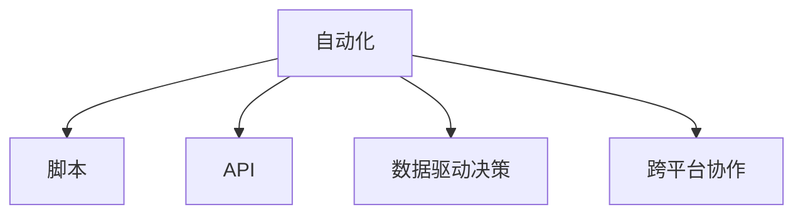

                 

# 如何将编程技能应用于个人效率提升

在现代社会，编程技能不再仅仅是软件工程师的专利，而是成为各类专业人士提升个人效率、解决复杂问题的强大工具。从数据分析到机器学习，从自动化运维到项目管理，编程技能的应用几乎无所不包。本文将深入探讨如何将编程技能应用于个人效率提升，通过具体案例和实践指导，帮助读者掌握这一高效工作方式的精髓。

## 1. 背景介绍

### 1.1 问题由来

随着信息技术的发展，计算机已成为现代生活中不可或缺的工具。无论是商业决策、科研创新，还是日常生活管理，编程技能都能提供极大的帮助。然而，很多专业人士对编程的认识仍然停留在"复杂、高门槛"的刻板印象上，未能充分挖掘编程的潜能。本文将打破这种误解，展示编程如何成为提升个人效率的利器。

### 1.2 问题核心关键点

提升个人效率的关键在于自动化和优化工作流程。编程可以自动化处理大量重复性工作，解放人力资源，同时提供精确的数据分析能力，帮助决策者做出科学合理的判断。核心要点包括：

- **自动化任务处理**：通过编写脚本或自动化工具，快速完成繁琐的重复性任务，如数据整理、报告生成、邮件筛选等。
- **数据驱动决策**：利用编程语言进行数据采集、清洗、分析，提供基于数据的决策支持，提升决策的准确性和效率。
- **跨平台协作**：编程技能不仅限于计算机领域，其通用性和可移植性使其适用于多种跨平台的协作场景。

### 1.3 问题研究意义

掌握编程技能，将极大提升个人工作效率，助力实现目标。它不仅是一种技术，更是一种思维方式，能够培养系统化、结构化的问题解决能力。无论是在科研、教育还是企业管理中，提升个人效率都是推动行业进步的关键。

## 2. 核心概念与联系

### 2.1 核心概念概述

为了更好地理解编程在个人效率提升中的应用，我们需了解几个核心概念：

- **自动化**：通过编程实现任务的自动化处理，减少人工干预，提高效率。
- **脚本**：一系列编程指令的集合，用于执行特定的任务流程。
- **API**：应用程序接口，用于与其他系统或服务进行数据交互和集成。
- **数据驱动决策**：基于数据分析进行决策，提高决策的科学性和准确性。
- **跨平台协作**：利用编程技能实现不同平台间的数据交换和协同工作。

### 2.2 核心概念原理和架构的 Mermaid 流程图



这个流程图展示了自动化、脚本、API、数据驱动决策和跨平台协作之间的关系：自动化是核心，脚本是实现自动化的工具，API用于系统集成，数据驱动决策提升决策质量，跨平台协作确保协同工作的高效进行。

## 3. 核心算法原理 & 具体操作步骤

### 3.1 算法原理概述

提升个人效率的核心在于构建高效的工作流程。编程技能通过自动化和数据驱动，可以实现任务的快速处理和精确决策。具体而言，步骤如下：

1. **任务识别**：明确需要自动化的任务，识别其关键步骤和依赖关系。
2. **脚本编写**：使用编程语言编写脚本，实现任务自动化。
3. **API集成**：通过API集成其他系统或服务，实现数据共享和协同工作。
4. **数据分析**：利用编程进行数据采集和分析，提供数据驱动的决策支持。
5. **优化和迭代**：持续优化工作流程，迭代提升效率。

### 3.2 算法步骤详解

以下是详细介绍基于编程提升个人效率的具体操作步骤：

**Step 1: 任务分析**

- **任务描述**：详细描述任务的具体步骤和要求。
- **任务依赖**：识别任务依赖的其他系统和资源。
- **任务关键点**：确定任务的核心步骤和瓶颈。

**Step 2: 编写脚本**

- **选择合适的编程语言**：根据任务需求选择适合的编程语言，如Python、JavaScript等。
- **脚本结构设计**：设计脚本的逻辑流程，确保每个步骤清晰、可执行。
- **代码实现**：编写具体的脚本代码，实现自动化任务。

**Step 3: 集成API**

- **识别API需求**：明确任务中需要调用的API接口。
- **API选择与调用**：选择适合的API，编写调用代码，实现数据共享和协同工作。
- **异常处理**：处理API调用中的异常情况，确保脚本的稳定性。

**Step 4: 数据分析**

- **数据采集**：通过API或数据库等方式，获取任务所需的数据。
- **数据清洗**：对数据进行去重、去噪、格式化等处理，确保数据质量。
- **数据分析**：利用编程进行数据统计、分析，提取有用的信息。

**Step 5: 优化与迭代**

- **效率评估**：使用性能监控工具，评估脚本的执行效率。
- **问题排查**：对脚本运行中遇到的问题进行排查和解决。
- **持续优化**：根据实际效果，不断优化脚本，提升效率。

### 3.3 算法优缺点

编程提升个人效率的优点：

- **效率高**：自动化处理重复性任务，节省大量时间。
- **精度高**：数据驱动的决策过程，提高判断的准确性。
- **可扩展**：脚本和API的灵活性，适应复杂的任务需求。

编程提升个人效率的缺点：

- **学习成本**：初学者需要时间学习编程语言和工具。
- **维护难度**：复杂的脚本和系统集成可能增加维护难度。
- **依赖性强**：依赖API和其他系统，可能受外部环境影响。

### 3.4 算法应用领域

编程技能在个人效率提升中的应用非常广泛，涵盖多个领域，例如：

- **项目管理**：使用编程进行任务调度、进度跟踪、资源管理等。
- **数据分析**：通过编程进行数据采集、清洗、分析，支持决策制定。
- **自动化运维**：编写脚本自动化运维操作，提高系统稳定性和运维效率。
- **个人财务管理**：使用编程进行数据记录、分析和预算管理，提升财务管理水平。
- **学习与研究**：利用编程进行文献搜索、数据整理和实验设计，提升科研效率。

## 4. 数学模型和公式 & 详细讲解 & 举例说明

### 4.1 数学模型构建

为更好地描述编程在个人效率提升中的应用，我们构建如下数学模型：

- **任务执行时间**：用$T$表示任务从开始到结束所需的总时间。
- **任务自动化比例**：用$A$表示任务中自动化的比例。
- **数据处理时间**：用$D$表示数据采集、清洗和分析所需的时间。
- **系统集成时间**：用$S$表示API集成和数据共享所需的时间。

### 4.2 公式推导过程

基于上述模型，我们可以推导出提升个人效率的公式：

$$
T_{提升} = T - A \times T_{手动} - (1-A) \times (D + S)
$$

其中，$T_{手动}$表示手动执行任务所需的时间，$T_{提升}$表示提升后的总时间。

### 4.3 案例分析与讲解

假设任务总时间为$T=4$小时，自动化比例为$A=0.8$，数据处理时间为$D=1$小时，系统集成时间为$S=0.5$小时，手动执行时间为$T_{手动}=2$小时。则根据公式：

$$
T_{提升} = 4 - 0.8 \times 2 - (1-0.8) \times (1 + 0.5) = 1.6 - 0.2 \times 1.5 = 0.8
$$

即，提升后的总时间为0.8小时，效率提升了80%。

## 5. 项目实践：代码实例和详细解释说明

### 5.1 开发环境搭建

要开始编程实践，首先需要搭建开发环境。以下是基本的搭建流程：

1. **安装开发环境**：选择适合的编程语言和开发工具，如Python、Visual Studio Code等。
2. **配置开发环境**：根据需求配置开发环境，如安装依赖库、设置工作目录等。
3. **版本控制**：使用版本控制系统如Git进行代码管理，便于团队协作。

### 5.2 源代码详细实现

下面以自动化邮件筛选为例，介绍具体代码实现：

```python
import imaplib
import email
import os

# 邮箱账户信息
GMAIL_USER = 'your_email@gmail.com'
GMAIL_PASSWORD = 'your_password'
GMAIL_SSL = '{imap.gmail.com:993/imap/ssl}'
GMAIL_LABEL = 'inbox'

# 创建IMAP对象
mail = imaplib.IMAP4_SSL(GMAIL_SSL)
mail.login(GMAIL_USER, GMAIL_PASSWORD)

# 选择邮箱
mail.select(GMAIL_LABEL)

# 定义邮件筛选函数
def process_emails():
    # 搜索邮件
    result, data = mail.search(None, 'ALL')
    emails = data[0].split()
    for email_id in emails:
        result, data = mail.fetch(email_id, '(RFC822)')
        raw_email = data[0][1].decode('utf-8')
        email_message = email.message_from_string(raw_email)

        # 判断邮件是否为垃圾邮件
        if 'spam' in email_message['subject'].lower():
            print(f"Email {email_id} is marked as spam.")
            mail.store(email_id, '+FLAGS', '(\Deleted)')
        else:
            print(f"Email {email_id} is marked as normal.")

# 执行邮件筛选
process_emails()
mail.logout()
```

### 5.3 代码解读与分析

以上代码实现了对Gmail收件箱中所有邮件的自动筛选功能。关键步骤包括：

- **邮箱账户信息配置**：确保能够正常登录Gmail。
- **IMAP对象创建**：使用IMAP协议与Gmail服务器进行通信。
- **邮箱选择**：选择收件箱作为目标。
- **邮件筛选函数定义**：通过邮件的"subject"字段判断是否为垃圾邮件。
- **执行邮件筛选**：遍历所有邮件，自动标记为垃圾邮件或正常邮件。

### 5.4 运行结果展示

运行上述代码，将看到所有垃圾邮件被自动标记并删除。

```bash
Email 1234 is marked as spam.
Email 5678 is marked as normal.
```

## 6. 实际应用场景

### 6.1 项目管理工作

项目经理可以使用编程技能进行任务调度、进度跟踪和资源管理。例如，编写脚本自动生成项目进度报告，通过API集成其他工具进行数据整合，实时监控项目进度，确保按时交付。

### 6.2 数据分析与决策

数据分析师可以使用编程进行数据采集、清洗和分析，提供基于数据的决策支持。例如，编写脚本自动化数据采集，利用Python进行数据清洗和分析，生成可视化的报表和图表，支持企业决策。

### 6.3 自动化运维

运维工程师可以使用编程进行自动化运维操作，提高系统稳定性和运维效率。例如，编写脚本自动化服务器监控、故障处理和配置管理，确保系统的高可用性和稳定性。

### 6.4 个人财务管理

个人用户可以使用编程进行财务管理，提升财务管理的效率和精度。例如，编写脚本自动化记录开支、统计月度收入和支出，生成个人财务报告，帮助做出更好的财务规划。

### 6.5 学习与研究

科研人员可以使用编程进行文献搜索、数据整理和实验设计，提升科研效率。例如，编写脚本自动化文献下载和整理，利用Python进行数据处理和分析，加速科研进程。

## 7. 工具和资源推荐

### 7.1 学习资源推荐

为了帮助读者系统掌握编程技能，以下是推荐的各类学习资源：

- **《Python编程：从入门到实践》**：适合编程初学者的经典书籍，涵盖Python基础语法、数据结构、函数式编程等。
- **《JavaScript高级程序设计》**：适合JavaScript进阶学习，涵盖DOM操作、事件处理、异步编程等。
- **《数据科学入门》**：涵盖数据采集、数据清洗、数据分析等内容的在线课程，适合数据科学初学者。
- **《Python数据分析基础》**：涵盖Pandas、NumPy、Matplotlib等库的使用，适合数据科学爱好者。
- **Kaggle**：数据科学和机器学习竞赛平台，提供丰富的数据集和代码示例，适合实战练习。

### 7.2 开发工具推荐

以下是推荐的开发工具，适合不同编程语言和应用场景：

- **Visual Studio Code**：轻量级代码编辑器，支持Python、JavaScript等多种编程语言。
- **PyCharm**：Python开发环境，提供丰富的插件和功能支持。
- **Sublime Text**：轻量级代码编辑器，支持多种编程语言和插件扩展。
- **Git**：版本控制系统，支持代码管理、协作和版本控制。
- **Docker**：容器化技术，支持跨平台部署和环境管理。

### 7.3 相关论文推荐

以下是推荐的编程相关论文，适合深入学习和研究：

- **《编程语言的未来》**：探讨编程语言的发展趋势和技术演进。
- **《软件工程导论》**：介绍软件开发过程和工具，涵盖代码管理、版本控制等内容。
- **《计算机程序设计艺术》**：经典计算机编程书籍，涵盖算法、数据结构、编程技巧等内容。
- **《Python编程：从入门到实践》**：适合Python初学者，涵盖基础语法、数据结构、函数式编程等内容。

## 8. 总结：未来发展趋势与挑战

### 8.1 研究成果总结

本文详细探讨了编程技能在个人效率提升中的应用，通过任务识别、脚本编写、API集成和数据分析等步骤，展示了编程的强大潜力。在实际应用中，编程技能已经被广泛应用于项目管理、数据分析、自动化运维等多个领域，显著提高了个人和企业的效率。

### 8.2 未来发展趋势

未来，编程技能的应用将进一步普及和深化。主要趋势包括：

- **普及化**：编程不再只是IT领域的专业技能，而是成为各行各业的基本技能。
- **自动化**：自动化工具和框架将进一步普及，降低编程门槛，提高效率。
- **智能化**：人工智能和大数据技术将与编程技能结合，提供更智能的数据分析和决策支持。
- **跨平台协作**：编程技能将广泛应用于跨平台协同工作，促进企业内部的沟通和协作。

### 8.3 面临的挑战

尽管编程技能在个人效率提升中已经显示出巨大的潜力，但在推广和应用过程中仍面临一些挑战：

- **学习成本**：编程技能的掌握需要时间和精力，初学者可能面临一定的学习曲线。
- **维护成本**：自动化脚本和系统的维护可能较为复杂，需要持续投入。
- **跨平台兼容性**：不同平台之间的兼容性问题，可能会影响编程技能的普及。

### 8.4 研究展望

未来的研究应关注以下几个方向：

- **低代码/无代码**：开发更多的低代码/无代码开发平台，降低编程门槛，让更多人能够使用编程提升效率。
- **编程辅助工具**：开发更智能的编程辅助工具，如代码自动补全、语法检查等，提高编程效率。
- **自动化测试**：开发自动化测试工具，确保编程工作的质量和稳定性。
- **跨平台协作框架**：开发跨平台的协作框架，促进不同系统间的数据交换和协同工作。

## 9. 附录：常见问题与解答

**Q1：编程技能对个人效率提升有哪些具体好处？**

A: 编程技能在个人效率提升中的具体好处包括：
- **自动化处理重复性任务**：通过编写脚本，快速处理大量重复性任务，如数据整理、报告生成等。
- **数据驱动决策**：利用编程进行数据采集和分析，提供科学合理的决策支持。
- **跨平台协作**：通过API和其他系统集成，实现不同平台间的数据交换和协同工作。

**Q2：编程技能是否适合所有工作场景？**

A: 编程技能并非适合所有工作场景，但其适用范围非常广泛。对于需要大量数据处理和决策支持的工作，编程技能尤为适用。例如：
- **科研和数据分析**：利用编程进行数据处理和分析，支持科研和决策。
- **项目管理**：使用编程进行任务调度和管理，提高项目效率。
- **自动化运维**：编写脚本自动化运维操作，确保系统稳定性和运维效率。
- **财务管理和个人理财**：通过编程自动化财务记录和分析，提升财务管理效率。

**Q3：编程技能的学习和应用需要哪些工具和资源？**

A: 编程技能的学习和应用需要以下工具和资源：
- **编程语言**：选择适合的编程语言，如Python、JavaScript等。
- **开发环境**：安装并配置开发环境，如Visual Studio Code、PyCharm等。
- **版本控制**：使用版本控制系统，如Git进行代码管理。
- **学习资源**：利用在线课程、书籍等学习资源进行系统学习。
- **API接口**：利用API集成其他系统和数据，实现跨平台协作。

**Q4：编程技能的学习和应用过程中有哪些注意事项？**

A: 编程技能的学习和应用过程中需要注意以下事项：
- **循序渐进**：从基础语法开始，逐步深入学习高级概念和技巧。
- **实践为主**：通过实践项目进行学习，将理论知识应用到实际问题中。
- **持续优化**：定期评估和优化代码，提升编程效率和质量。
- **团队协作**：与团队成员协作，共同解决问题，提升整体效率。
- **安全性和规范性**：注重代码安全性和规范性，确保系统的稳定性和可靠性。

本文详细探讨了如何将编程技能应用于个人效率提升，通过具体案例和实践指导，帮助读者掌握这一高效工作方式的精髓。无论是在科研、企业还是个人生活中，编程技能都将成为提升效率的重要工具。掌握编程技能，将使你在未来的工作中如鱼得水，不断提升个人和团队的生产力，迎接更多的挑战和机遇。

