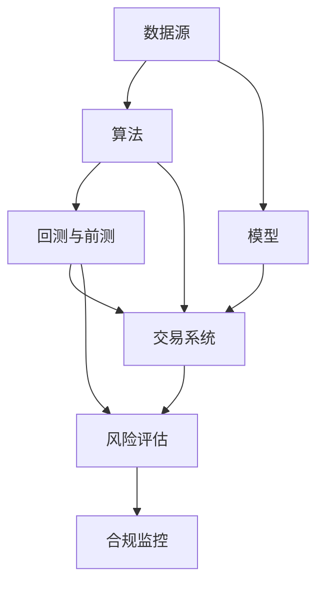

                 

# 如何将编程技能应用于量化交易

> 关键词：量化交易,算法交易,技术分析,机器学习,模型优化,实时数据处理

## 1. 背景介绍

量化交易(Qualitative Trading)是指使用计算机算法和数学模型，自动执行买卖操作以实现投资组合的价值最大化。相比传统的人工操作，量化交易具有数据驱动、策略透明、快速执行等优势，在金融市场中逐渐受到投资者的青睐。量化交易的成功与否，在很大程度上取决于所使用的算法和模型的质量，而编程技能在其中起到了关键作用。

### 1.1 问题由来

在量化交易中，算法和模型的开发、测试、优化、部署等环节都需要编程技能的支持。从数据采集和预处理，到模型的训练和评估，再到交易策略的执行和监控，编程技能贯穿了量化交易的每一个步骤。此外，金融市场瞬息万变，实时数据处理和快速响应也要求编程人员能够高效地编写和维护代码，以应对市场变化和模型失效。

### 1.2 问题核心关键点

量化交易的核心在于如何构建有效的算法和模型，并利用编程技能进行优化和执行。以下是量化交易的几个关键点：

- **数据采集与预处理**：获取和处理高质量的数据，保证数据的一致性、准确性和时效性。
- **模型构建与训练**：根据金融市场特征和历史数据，选择合适的算法和模型，进行训练和验证。
- **策略优化与回测**：通过编程实现交易策略的自动化和多样化，并进行模拟交易的验证。
- **实时交易与监控**：利用编程技能实现高频交易和算法执行，并实时监控交易结果和市场变化。
- **风险控制与合规**：构建风险评估和合规监控机制，防止模型失效和合规风险。

## 2. 核心概念与联系

### 2.1 核心概念概述

为了更好地理解量化交易中编程技能的应用，本节将介绍几个关键概念：

- **数据源**：量化交易需要获取各类金融市场数据，包括股票、期货、外汇、债券等。
- **算法**：基于技术分析和统计学原理，构建自动执行交易操作的算法模型。
- **模型**：使用机器学习、深度学习等技术，训练预测股票、期货等资产价格的模型。
- **回测与前测**：通过编程实现模型的历史数据验证和未来数据预测。
- **交易系统**：利用编程构建高效的自动化交易平台，实现算法执行和风险控制。
- **风险评估**：利用编程技能构建量化风险评估模型，识别和监测潜在的投资风险。
- **合规监控**：编程实现对交易行为的合规性监控，确保符合监管要求。

这些概念之间的逻辑关系可以通过以下Mermaid流程图来展示：



这个流程图展示了几类关键概念及其之间的联系：

1. 数据源为算法的训练和模型的构建提供了基础。
2. 算法模型在历史数据上进行回测和前测，以验证其效果和适用性。
3. 交易系统实现算法模型的自动化执行，并融入风险评估和合规监控机制。
4. 风险评估模型监控交易行为，防止模型失效和风险累积。
5. 合规监控确保交易符合法规要求，保障系统的合法性。

## 3. 核心算法原理 & 具体操作步骤
### 3.1 算法原理概述

量化交易的核心在于通过编程实现自动化和策略化的交易操作。具体来说，量化交易可以分为以下几个步骤：

1. **数据采集与预处理**：使用编程技能获取各类金融市场数据，并进行清洗和标准化处理，以保证数据的质量和一致性。
2. **模型构建与训练**：根据市场特征和历史数据，选择合适的算法和模型，进行训练和验证，构建有效的预测模型。
3. **策略优化与回测**：通过编程实现交易策略的优化和历史回测，验证策略的可行性和风险控制能力。
4. **实时交易与监控**：利用编程技能实现高频交易和算法执行，并实时监控交易结果和市场变化，及时调整策略。
5. **风险评估与合规**：构建风险评估和合规监控机制，利用编程技能实时评估交易风险，防止违规操作。

### 3.2 算法步骤详解

#### 3.2.1 数据采集与预处理

**步骤1: 数据源选择**
- 选择可靠、高效的数据源，如股票交易所API、金融数据提供商等。
- 获取历史价格、交易量、财务指标等市场数据。

**步骤2: 数据清洗**
- 去除缺失值、异常值和重复数据，确保数据的完整性和准确性。
- 标准化数据格式，使其一致性更强，便于后续处理。

**步骤3: 特征工程**
- 提取和构造有意义的特征，如移动平均线、相对强弱指数(RSI)等。
- 构建模型所需的输入特征集。

#### 3.2.2 模型构建与训练

**步骤1: 选择算法**
- 根据市场特征和任务需求，选择合适的算法，如线性回归、时间序列预测、深度学习模型等。

**步骤2: 构建模型**
- 利用编程技能实现模型的构建和训练，例如使用Python、R等语言。
- 使用库如TensorFlow、PyTorch等进行模型实现和训练。

**步骤3: 验证与优化**
- 使用历史数据对模型进行验证，调整模型参数以优化性能。
- 使用交叉验证等技术进行模型评估。

#### 3.2.3 策略优化与回测

**步骤1: 策略设计**
- 设计交易策略，如基于技术分析的趋势跟踪、基于统计学原理的均值回归等。
- 编写代码实现策略逻辑，例如使用Python编写算法。

**步骤2: 回测验证**
- 使用历史数据对策略进行回测，评估其历史表现和风险控制能力。
- 利用回测工具进行模拟交易，验证策略的可行性和稳定性。

#### 3.2.4 实时交易与监控

**步骤1: 算法执行**
- 利用编程技能实现高频交易和实时执行，例如使用Python编写交易算法。
- 使用库如Zipline、QuantConnect等进行算法执行。

**步骤2: 实时监控**
- 实时监控交易结果和市场变化，例如使用Python编写实时监控程序。
- 使用Kafka、RabbitMQ等消息队列实现数据同步和系统监控。

#### 3.2.5 风险评估与合规

**步骤1: 风险评估**
- 构建风险评估模型，例如使用Python编写风险计算算法。
- 实时计算交易风险，例如使用计算库如NumPy、Pandas等。

**步骤2: 合规监控**
- 利用编程技能实现合规监控，例如编写合规规则和风险监控算法。
- 使用库如ComplyRisk等进行合规监控。

### 3.3 算法优缺点

量化交易的算法和模型在市场预测和策略执行中具有以下优点：

1. **高效性**：自动化的算法执行和实时监控，可以显著提高交易效率。
2. **透明度**：算法和模型的透明性有助于投资者理解和信任策略的逻辑。
3. **一致性**：算法执行的一致性有助于避免人为操作的失误和偏见。
4. **可扩展性**：算法可以灵活调整和优化，适应不同的市场环境和任务需求。

同时，量化交易也存在一些缺点：

1. **数据依赖**：算法的性能高度依赖于数据的质量和可靠性，数据缺失或噪声可能导致策略失效。
2. **模型复杂性**：复杂的算法和模型可能需要较高的计算资源和专业知识，开发和维护成本较高。
3. **过拟合风险**：算法模型可能在历史数据上表现良好，但在新数据上出现过拟合，导致策略失效。
4. **市场风险**：金融市场的瞬息万变，预测模型可能无法及时适应市场变化，导致策略亏损。

## 4. 数学模型和公式 & 详细讲解  
### 4.1 数学模型构建

量化交易中的数学模型通常基于时间序列数据，以下介绍几个常用的数学模型及其构建方法。

#### 4.1.1 线性回归模型

线性回归模型是量化交易中最常用的模型之一，用于预测资产价格。假设有一组时间序列数据 $(x_t, y_t)$，其中 $x_t$ 表示历史价格，$y_t$ 表示预测价格，则线性回归模型的构建公式为：

$$
y_t = \beta_0 + \sum_{i=1}^n \beta_i x_{it} + \epsilon_t
$$

其中，$\beta_0, \beta_i$ 为模型的回归系数，$\epsilon_t$ 为误差项。线性回归模型通过最小化误差平方和 $\sum_{t=1}^N (y_t - \hat{y}_t)^2$ 来确定系数 $\beta_0, \beta_i$，使用库如SciPy、TensorFlow等实现。

#### 4.1.2 时间序列模型

时间序列模型用于预测股票价格的波动性和趋势，例如ARIMA模型和LSTM模型。假设有一组时间序列数据 $(x_t, y_t)$，其中 $x_t$ 表示历史价格，$y_t$ 表示预测价格，则ARIMA模型的构建公式为：

$$
y_t = \beta_0 + \sum_{i=1}^n \beta_i x_{it} + \epsilon_t
$$

其中，$\beta_0, \beta_i$ 为模型的回归系数，$\epsilon_t$ 为误差项。ARIMA模型通过自回归、差分和移动平均等技术，捕捉价格序列的周期性和趋势性，使用库如statsmodels、Keras等实现。

#### 4.1.3 深度学习模型

深度学习模型，如卷积神经网络(CNN)、循环神经网络(RNN)和长短期记忆网络(LSTM)，用于处理复杂的时序特征和模式识别。假设有一组时间序列数据 $(x_t, y_t)$，其中 $x_t$ 表示历史价格，$y_t$ 表示预测价格，则LSTM模型的构建公式为：

$$
h_t = \sigma(W_{xh}x_t + b_h + W_{hh}h_{t-1})
$$

$$
y_t = \sigma(W_{hy}h_t + b_y)
$$

其中，$h_t$ 表示隐藏状态，$W_{xh}, b_h, W_{hy}, b_y$ 为模型参数，$\sigma$ 为激活函数。LSTM模型通过多层递归神经网络，捕捉价格序列的长期依赖关系，使用库如Keras、PyTorch等实现。

### 4.2 公式推导过程

以下是线性回归模型和时间序列模型的详细公式推导过程。

#### 4.2.1 线性回归模型的推导

假设有一组时间序列数据 $(x_t, y_t)$，其中 $x_t$ 表示历史价格，$y_t$ 表示预测价格。线性回归模型的构建公式为：

$$
y_t = \beta_0 + \sum_{i=1}^n \beta_i x_{it} + \epsilon_t
$$

其中，$\beta_0, \beta_i$ 为模型的回归系数，$\epsilon_t$ 为误差项。最小化误差平方和 $\sum_{t=1}^N (y_t - \hat{y}_t)^2$，求解 $\beta_0, \beta_i$：

$$
\hat{\beta}_0 = \frac{\sum_{t=1}^N y_t \cdot x_{0t} - \frac{1}{N}\sum_{t=1}^N y_t \cdot \sum_{t=1}^N x_{0t}}{\sum_{t=1}^N x_{0t}^2 - \frac{1}{N}\left(\sum_{t=1}^N x_{0t}\right)^2}
$$

$$
\hat{\beta}_i = \frac{\sum_{t=1}^N y_t \cdot x_{it} - \frac{1}{N}\sum_{t=1}^N y_t \cdot \sum_{t=1}^N x_{it}}{\sum_{t=1}^N x_{it}^2 - \frac{1}{N}\left(\sum_{t=1}^N x_{it}\right)^2}
$$

#### 4.2.2 时间序列模型的推导

ARIMA模型是一种常用的时间序列模型，其构建公式为：

$$
y_t = \beta_0 + \sum_{i=1}^n \beta_i x_{it} + \epsilon_t
$$

其中，$\beta_0, \beta_i$ 为模型的回归系数，$\epsilon_t$ 为误差项。ARIMA模型通过自回归、差分和移动平均等技术，捕捉价格序列的周期性和趋势性。其具体推导过程包括自回归项、差分项和移动平均项的构建和求解，使用库如statsmodels、Keras等实现。

### 4.3 案例分析与讲解

#### 4.3.1 案例背景

假设我们要构建一个基于时间序列模型的股票价格预测系统。首先，我们从金融数据提供商获取历史价格数据，并进行清洗和标准化处理。然后，我们选择ARIMA模型，根据历史数据进行模型构建和训练。最后，我们使用回测工具对模型进行验证，并利用实时数据进行交易策略的执行和监控。

#### 4.3.2 数据清洗与标准化

数据清洗和标准化是模型构建的重要步骤。我们使用Python进行数据处理，具体步骤如下：

```python
import pandas as pd
import numpy as np

# 读取历史价格数据
data = pd.read_csv('price_data.csv')

# 去除缺失值和异常值
data = data.dropna()

# 标准化数据
data['price'] = (data['price'] - data['price'].mean()) / data['price'].std()
```

#### 4.3.3 模型构建与训练

我们选择ARIMA模型，利用Python和statsmodels库进行模型构建和训练。具体步骤如下：

```python
import statsmodels.api as sm

# 构建ARIMA模型
model = sm.tsa.ARIMA(data['price'], order=(1,1,1))

# 训练模型
model_fit = model.fit()
```

#### 4.3.4 回测验证与策略执行

我们使用回测工具对模型进行验证，并利用实时数据进行交易策略的执行和监控。具体步骤如下：

```python
from backtesting import Backtesting
import quantConnect as QC

# 定义回测策略
def strategy(data):
    # 使用ARIMA模型进行价格预测
    prediction = model_fit.forecast(steps=1)[0]

    # 设置买入和卖出信号
    if prediction > data['price']:
        return QC.Signal('Buy', QC.ConditionViolationType.NoConditionViolation, QC.IntervalType.Intraperiod)
    else:
        return QC.Signal('Sell', QC.ConditionViolationType.NoConditionViolation, QC.IntervalType.Intraperiod)

# 回测验证
backtesting = Backtesting(data, strategy, '.price')

# 实时交易和监控
real_time_strategy = QC.Backtest(data)
real_time_strategy.Bind("strategy", strategy)
real_time_strategy.Run()
```

## 5. 项目实践：代码实例和详细解释说明
### 5.1 开发环境搭建

在量化交易的开发过程中，我们首先需要搭建开发环境。以下是使用Python进行量化交易开发的常见环境配置流程：

1. 安装Python：从官网下载并安装最新版本的Python，确保其版本与库兼容。
2. 安装必要的库：安装常用的量化交易库，如NumPy、Pandas、SciPy、statsmodels、TensorFlow、PyTorch、Keras等。
3. 安装交易平台：安装如QuantConnect、Zipline等量化交易平台，以便进行模型测试和回测。

完成上述步骤后，即可在Python环境中开始量化交易开发。

### 5.2 源代码详细实现

以下是一个简单的量化交易模型代码实现，包括数据采集、模型训练、策略回测和实时执行。

```python
import pandas as pd
import numpy as np
import statsmodels.api as sm
import backtesting as bt
import quantconnect as QC

# 读取历史价格数据
data = pd.read_csv('price_data.csv')

# 去除缺失值和异常值
data = data.dropna()

# 标准化数据
data['price'] = (data['price'] - data['price'].mean()) / data['price'].std()

# 构建ARIMA模型
model = sm.tsa.ARIMA(data['price'], order=(1,1,1))

# 训练模型
model_fit = model.fit()

# 定义回测策略
def strategy(data):
    # 使用ARIMA模型进行价格预测
    prediction = model_fit.forecast(steps=1)[0]

    # 设置买入和卖出信号
    if prediction > data['price']:
        return QC.Signal('Buy', QC.ConditionViolationType.NoConditionViolation, QC.IntervalType.Intraperiod)
    else:
        return QC.Signal('Sell', QC.ConditionViolationType.NoConditionViolation, QC.IntervalType.Intraperiod)

# 回测验证
backtesting = bt.Backtesting(data, strategy, '.price')

# 实时交易和监控
real_time_strategy = QC.Backtest(data)
real_time_strategy.Bind("strategy", strategy)
real_time_strategy.Run()
```

### 5.3 代码解读与分析

让我们再详细解读一下关键代码的实现细节：

**数据采集与预处理**：
- 使用pandas库读取历史价格数据，并去除了缺失值和异常值。
- 使用Numpy库进行数据标准化处理。

**模型构建与训练**：
- 选择ARIMA模型，利用statsmodels库进行模型构建和训练。

**策略优化与回测**：
- 定义回测策略，利用Backtesting库进行历史数据回测验证。
- 使用QuantConnect库实现实时交易和监控。

**实时交易与监控**：
- 利用QuantConnect库实现高频交易和实时监控。

## 6. 实际应用场景

### 6.1 高频交易

高频交易是指在极短时间内进行多次买卖操作，以获取微小价差收益的交易方式。量化交易算法可以在高频交易中发挥重要作用，实现快速的策略执行和风险控制。例如，在股票市场中，可以使用基于技术分析的趋势跟踪算法，快速捕捉市场波动，实现高频交易。

### 6.2 套利交易

套利交易是指在多个市场或多个时间点间寻找价格差异，利用差异进行套利的操作。量化交易算法可以在套利交易中实现多市场的实时监控和策略执行，最大程度地利用价格差异进行套利。例如，在股票和期货市场间，可以使用套利模型进行实时监控和执行，获取稳定收益。

### 6.3 量化投资

量化投资是指利用量化模型进行资产组合管理和投资决策的操作。量化交易算法可以在量化投资中实现资产配置、风险评估和投资决策等功能，帮助投资者制定最优的资产配置策略。例如，在股票市场中，可以使用量化模型进行资产配置，构建分散化的投资组合，最大程度地降低风险。

### 6.4 未来应用展望

随着量化交易技术的不断进步，未来将有更多应用场景可以利用编程技能进行自动化和策略化的交易操作。

- **加密货币交易**：利用量化交易算法，在加密货币市场进行高频交易和套利操作。
- **金融衍生品交易**：利用量化交易算法，进行期权、期货等衍生品市场的实时监控和策略执行。
- **量化研究**：利用编程技能进行量化交易的理论与实证研究，推动市场前沿理论的发展。

## 7. 工具和资源推荐
### 7.1 学习资源推荐

为了帮助开发者系统掌握量化交易的开发和应用，这里推荐一些优质的学习资源：

1. 《Python量化交易实战》：该书详细介绍了量化交易的开发流程、算法和工具，适合初学者和进阶者。
2. 《量化交易策略》：该书介绍了多种量化交易策略的构建和实证分析，帮助读者理解交易策略的设计和优化。
3. 《金融大数据分析与量化投资》：该书介绍了金融数据处理、量化投资和策略执行的详细流程，适合从事金融领域量化交易的研究者。
4. Coursera上的《Quantitative Methods for Financial Engineering and Risk Management》课程：由Wharton商学院提供，系统介绍了量化金融的基础知识和应用方法。
5. Kaggle上的量化交易竞赛：参加量化交易竞赛，实战演练各种量化交易策略，提高编程技能和模型开发能力。

通过对这些资源的学习实践，相信你一定能够快速掌握量化交易的精髓，并用于解决实际的金融问题。

### 7.2 开发工具推荐

高效的开发离不开优秀的工具支持。以下是几款用于量化交易开发的常用工具：

1. Python：作为量化交易开发的主流语言，Python具有强大的数据处理和编程能力，易于学习和使用。
2. Jupyter Notebook：Python的交互式编程环境，方便开发者进行代码编写和数据处理。
3. NumPy和Pandas：Python的数据处理库，用于数据清洗和标准化处理。
4. statsmodels：Python的时间序列分析库，用于构建和训练时间序列模型。
5. TensorFlow和PyTorch：Python的深度学习库，用于构建和训练深度学习模型。
6. Backtesting：Python的量化交易回测工具，用于历史数据验证和策略优化。
7. QuantConnect：Python的量化交易平台，用于实时交易和策略监控。

合理利用这些工具，可以显著提升量化交易开发的效率，加快创新迭代的步伐。

### 7.3 相关论文推荐

量化交易技术的发展源于学界的持续研究。以下是几篇奠基性的相关论文，推荐阅读：

1. "The Practice of Quantitative Financial Analysis" by Ernie Chan：介绍了量化交易的策略设计和回测验证的基本方法。
2. "Algorithmic Trading: Winning Strategies and Their Rationale" by Ernie Chan：探讨了多种量化交易策略的设计和实证分析。
3. "High-Frequency Trading: A Practical Guide to Algorithmic Strategies and Trading Systems" by Irene Aldridge：详细介绍了高频交易的策略构建和实证研究。
4. "Artificial Intelligence in Finance: A Practical Guide for Data Science" by Maarten Baert：介绍了人工智能技术在金融领域的最新应用。

这些论文代表了量化交易技术的发展脉络。通过学习这些前沿成果，可以帮助研究者把握学科前进方向，激发更多的创新灵感。

## 8. 总结：未来发展趋势与挑战

### 8.1 总结

本文对量化交易中编程技能的应用进行了全面系统的介绍。首先阐述了量化交易的背景和意义，明确了编程技能在算法开发、数据处理、策略执行等方面的重要性。其次，从原理到实践，详细讲解了量化交易的数学模型和关键步骤，给出了量化交易的完整代码实现。同时，本文还探讨了量化交易在实际应用中的多种场景，展示了编程技能在量化交易中的广泛应用。

通过本文的系统梳理，可以看到，编程技能在量化交易中发挥了关键作用，推动了量化交易技术的不断进步。未来的量化交易将更加智能化、自动化和高效化，编程技能将成为量化交易不可或缺的核心竞争力。

### 8.2 未来发展趋势

展望未来，量化交易将呈现以下几个发展趋势：

1. **算法和模型的智能化**：未来量化交易将越来越多地引入机器学习和深度学习算法，提高模型的预测能力和泛化能力。
2. **高频交易的普及**：高频交易将在量化交易中得到更广泛的应用，算法执行速度和响应效率将进一步提升。
3. **多市场和多资产交易**：量化交易将扩展到更多的市场和资产，实现跨市场和多资产的实时监控和策略执行。
4. **大数据和人工智能的融合**：量化交易将更多地利用大数据和人工智能技术，提升数据处理和模型优化能力。
5. **量化交易的合规和监管**：量化交易将加强合规监控，防止非法交易和违规操作，保障系统的合法性和可靠性。

这些趋势凸显了量化交易技术的发展方向，编程技能在其中将发挥越来越重要的作用。

### 8.3 面临的挑战

尽管量化交易技术已经取得了瞩目成就，但在实际应用过程中，仍面临诸多挑战：

1. **市场数据的获取与处理**：高质量的市场数据是量化交易的基础，但数据的获取和处理需要大量的资源和时间。
2. **算法的复杂性和可解释性**：复杂的量化算法和模型需要专业知识进行开发和维护，且难以解释其内部工作机制。
3. **模型的稳定性和泛化能力**：量化模型在历史数据上的表现可能无法在新数据上保持稳定，容易过拟合。
4. **风险控制和合规性**：量化交易需要构建有效的风险评估和合规监控机制，防止模型失效和违规操作。
5. **模型的实时性和执行效率**：高频交易和实时策略执行需要高效的算法和硬件支持，以应对市场变化和数据流量。

这些挑战需要研究者和开发者共同努力，通过技术创新和实践积累，逐步克服和突破。

### 8.4 研究展望

面对量化交易面临的种种挑战，未来的研究需要在以下几个方面寻求新的突破：

1. **多市场和多资产交易模型**：构建跨市场和多资产的量化交易模型，实现多市场的实时监控和策略执行。
2. **算法优化与模型压缩**：开发高效的量化算法和压缩模型，提升高频交易和实时执行的效率和稳定性。
3. **大数据和人工智能融合**：利用大数据和人工智能技术，提高量化交易的数据处理和模型优化能力。
4. **量化交易的合规和监管**：构建有效的量化交易合规和监管机制，防止非法交易和违规操作，保障系统的合法性和可靠性。
5. **模型的可解释性和透明性**：开发可解释的量化交易模型，增强算法的透明性和可解释性，提高投资者对模型的信任度。

这些研究方向的探索，必将引领量化交易技术迈向更高的台阶，为金融市场的稳定和发展注入新的动力。面向未来，量化交易技术还需要与其他人工智能技术进行更深入的融合，如知识表示、因果推理、强化学习等，协同发力，共同推动量化交易技术的进步。

## 9. 附录：常见问题与解答

**Q1：量化交易的算法和模型如何构建和训练？**

A: 量化交易的算法和模型通常基于时间序列数据，通过编程技能进行构建和训练。例如，可以使用Python和statsmodels库构建ARIMA模型，利用TensorFlow或PyTorch构建深度学习模型。模型训练时，使用历史数据进行验证，调整模型参数以优化性能。

**Q2：量化交易的策略回测和验证如何进行？**

A: 量化交易的策略回测和验证通常使用Python的回测工具，如Backtesting库。具体步骤如下：
1. 定义回测策略，编写Python代码。
2. 使用历史数据进行回测验证，记录策略的收益和风险。
3. 根据回测结果，调整策略参数以优化性能。

**Q3：高频交易的算法和模型如何选择和构建？**

A: 高频交易的算法和模型通常基于技术分析和统计学原理，使用Python和统计学库进行构建和训练。例如，可以使用ARIMA模型、LSTM模型等进行价格预测，使用优化算法进行参数调整。

**Q4：量化交易的实时交易和监控如何实现？**

A: 量化交易的实时交易和监控通常使用Python的交易平台，如QuantConnect。具体步骤如下：
1. 定义交易策略，编写Python代码。
2. 使用实时数据进行交易策略的执行和监控。
3. 利用消息队列实现数据同步和系统监控。

**Q5：量化交易的合规监控和风险评估如何进行？**

A: 量化交易的合规监控和风险评估通常使用Python的风险评估库，如ComplyRisk。具体步骤如下：
1. 定义合规规则和风险评估模型，编写Python代码。
2. 实时计算交易行为的风险指标，例如使用NumPy库。
3. 根据风险评估结果，进行合规监控和风险预警。

---

作者：禅与计算机程序设计艺术 / Zen and the Art of Computer Programming

