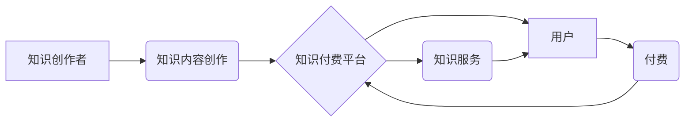

                 

## 知识经济时代下的知识付费创新商业模式衍生

> 关键词：知识付费、商业模式创新、在线教育、内容平台、知识产权、数据驱动、人工智能

### 1. 背景介绍

进入21世纪，全球经济结构发生深刻变化，以知识、信息和技术为主要驱动的知识经济时代正式到来。知识成为新的生产要素，知识的获取、传播和应用成为经济发展和社会进步的关键。在这个背景下，知识付费模式应运而生，并迅速发展成为一种重要的商业模式。

知识付费是指以知识、技能、经验等为核心内容，通过付费的方式获取知识和服务。它打破了传统教育模式的限制，为个人提供了更加灵活、便捷、个性化的学习方式。同时，知识付费也为知识创作者提供了新的收入来源，促进了知识的生产和传播。

### 2. 核心概念与联系

**2.1 知识经济与知识付费**

知识经济的核心是知识的创造、传播和应用。知识付费模式正是基于知识经济发展趋势，为知识的价值实现提供了新的途径。

**2.2 商业模式创新与知识付费**

知识付费模式的创新主要体现在以下几个方面：

* **内容形式多样化:**  从传统的文字、音频、视频到直播、互动课程、在线社区等，知识付费内容形式不断丰富，满足不同用户的学习需求。
* **付费模式灵活多样:**  从一次性付费到订阅制、会员制、分期付款等，知识付费模式不断探索新的付费方式，降低用户门槛，提高用户粘性。
* **平台生态建设:**  知识付费平台不断完善其生态系统，整合资源、搭建社区、提供服务，打造用户粘性强、内容丰富、交易便捷的平台。

**2.3  知识付费模式的架构**



### 3. 核心算法原理 & 具体操作步骤

**3.1 算法原理概述**

知识付费模式的成功离不开数据驱动和算法推荐。平台通过收集用户行为数据、学习偏好、知识需求等信息，利用推荐算法为用户推荐个性化内容，提高用户体验和付费意愿。

**3.2 算法步骤详解**

1. **数据采集:** 平台收集用户注册信息、浏览记录、购买历史、评论反馈等数据。
2. **数据预处理:** 对收集到的数据进行清洗、转换、整合等处理，使其符合算法模型的输入要求。
3. **特征提取:** 从用户数据中提取特征，例如用户年龄、性别、职业、兴趣爱好、学习习惯等。
4. **模型训练:** 利用机器学习算法，例如协同过滤、内容基准、深度学习等，训练推荐模型。
5. **推荐结果输出:** 模型根据用户特征和知识内容特征，预测用户对不同内容的兴趣程度，并输出推荐结果。

**3.3 算法优缺点**

* **优点:** 能够精准推荐用户感兴趣的内容，提高用户体验和付费意愿。
* **缺点:** 算法模型需要大量数据进行训练，且算法本身存在一定的局限性，可能无法完全满足用户的个性化需求。

**3.4 算法应用领域**

* 在线教育平台
* 内容平台
* 社交媒体
* 电子商务平台

### 4. 数学模型和公式 & 详细讲解 & 举例说明

**4.1 数学模型构建**

知识推荐算法通常采用基于用户的协同过滤模型，该模型基于用户的历史行为数据，预测用户对特定内容的兴趣。

**4.2 公式推导过程**

协同过滤模型的核心是计算用户之间和内容之间的相似度。

* **用户-用户相似度:**

$$
Sim(u_i, u_j) = \frac{\sum_{k=1}^{N} r_{i,k} * r_{j,k}}{\sqrt{\sum_{k=1}^{N} r_{i,k}^2} * \sqrt{\sum_{k=1}^{N} r_{j,k}^2}}
$$

其中：

* $u_i$ 和 $u_j$ 表示两个用户
* $r_{i,k}$ 和 $r_{j,k}$ 表示用户 $u_i$ 和 $u_j$ 对内容 $k$ 的评分

* **内容-内容相似度:**

$$
Sim(c_i, c_j) = \frac{\sum_{u=1}^{M} r_{u,i} * r_{u,j}}{\sqrt{\sum_{u=1}^{M} r_{u,i}^2} * \sqrt{\sum_{u=1}^{M} r_{u,j}^2}}
$$

其中：

* $c_i$ 和 $c_j$ 表示两个内容
* $r_{u,i}$ 和 $r_{u,j}$ 表示用户 $u$ 对内容 $i$ 和 $j$ 的评分

**4.3 案例分析与讲解**

假设用户 A 和用户 B 都对编程相关的课程感兴趣，并且都给过一些编程课程评分。通过计算用户 A 和用户 B 的用户-用户相似度，我们可以发现他们对编程课程的口味很相似。因此，如果用户 A 对某门编程课程评分很高，那么平台可以推荐这门课程给用户 B。

### 5. 项目实践：代码实例和详细解释说明

**5.1 开发环境搭建**

* Python 3.x
* TensorFlow 或 PyTorch
* Jupyter Notebook

**5.2 源代码详细实现**

```python
# 导入必要的库
import numpy as np
from sklearn.metrics.pairwise import cosine_similarity

# 用户评分数据
ratings = np.array([
    [5, 4, 3, 2, 1],
    [4, 5, 2, 1, 3],
    [3, 2, 5, 4, 1],
    [2, 1, 4, 5, 3],
    [1, 3, 1, 3, 5]
])

# 计算用户-用户相似度矩阵
user_similarity = cosine_similarity(ratings)

# 获取用户 A 的索引
user_a_index = 0

# 获取用户 A 的评分
user_a_ratings = ratings[user_a_index]

# 计算用户 A 与其他用户之间的相似度
similarity_scores = user_similarity[user_a_index]

# 获取相似度最高的三个用户
top_3_users = np.argsort(similarity_scores)[-3:][::-1]

# 获取相似用户对其他内容的评分
similar_user_ratings = ratings[top_3_users]

# 计算推荐内容的平均评分
recommended_ratings = np.mean(similar_user_ratings, axis=0)

# 打印推荐内容的平均评分
print(recommended_ratings)
```

**5.3 代码解读与分析**

这段代码演示了如何使用协同过滤算法进行知识推荐。首先，定义了用户评分数据，然后计算了用户之间的相似度矩阵。接着，根据用户 A 的评分和与其他用户的相似度，计算出推荐内容的平均评分。

**5.4 运行结果展示**

运行代码后，会输出推荐内容的平均评分，这些评分可以作为推荐内容的参考依据。

### 6. 实际应用场景

**6.1 在线教育平台**

在线教育平台可以利用知识付费模式，提供各种类型的在线课程，例如编程、设计、语言学习等。通过数据驱动和算法推荐，平台可以为用户推荐个性化的课程，提高用户学习效率和满意度。

**6.2 内容平台**

内容平台可以提供各种类型的付费内容，例如文章、视频、音频、电子书等。通过知识付费模式，平台可以为创作者提供新的收入来源，并为用户提供更优质的内容。

**6.3 社交媒体**

社交媒体平台可以利用知识付费模式，提供付费会员服务，例如提供独家内容、优先咨询、互动社区等。通过知识付费，平台可以提高用户粘性，并为创作者提供新的商业机会。

**6.4 未来应用展望**

随着人工智能、大数据等技术的不断发展，知识付费模式将更加智能化、个性化、多元化。未来，知识付费将渗透到各个领域，成为一种更加普遍的商业模式。

### 7. 工具和资源推荐

**7.1 学习资源推荐**

* **书籍:** 《推荐系统实践》
* **在线课程:** Coursera、edX、Udacity

**7.2 开发工具推荐**

* **Python:** TensorFlow、PyTorch
* **数据分析工具:** Pandas、Scikit-learn

**7.3 相关论文推荐**

* **协同过滤算法:** "Collaborative Filtering: A User-Based Approach"
* **内容基准算法:** "Content-Based Recommendation Systems"

### 8. 总结：未来发展趋势与挑战

**8.1 研究成果总结**

知识付费模式在知识经济时代发展迅速，为知识创作者和用户提供了新的机遇。数据驱动和算法推荐是知识付费模式的核心技术，未来将更加智能化、个性化。

**8.2 未来发展趋势**

* **人工智能驱动:** 人工智能将进一步提高知识推荐的精准度和个性化程度。
* **内容多元化:** 知识付费内容将更加丰富多样，涵盖更广泛的领域和主题。
* **平台生态建设:** 知识付费平台将更加完善其生态系统，提供更优质的服务和体验。

**8.3 面临的挑战**

* **数据隐私保护:** 知识付费平台需要妥善处理用户数据，保障用户隐私安全。
* **内容质量控制:** 平台需要加强对知识内容的审核和监管，确保内容质量和真实性。
* **商业模式创新:** 平台需要不断探索新的商业模式，提高用户粘性和盈利能力。

**8.4 研究展望**

未来，知识付费模式将继续发展壮大，并对社会产生更加深远的影响。研究者需要关注以下几个方面：

* **更精准的知识推荐算法:** 开发更智能、更个性化的知识推荐算法，提高用户体验。
* **知识付费的公平性:** 探索知识付费的公平性问题，确保知识资源的合理分配。
* **知识付费的社会影响:** 研究知识付费对社会发展、教育体系、文化产业等方面的影响。

### 9. 附录：常见问题与解答

**9.1 如何选择合适的知识付费平台？**

选择知识付费平台时，可以考虑以下因素：

* 平台的口碑和信誉
* 平台提供的课程内容和质量
* 平台的收费标准和支付方式
* 平台的用户体验和服务

**9.2 如何保护知识付费平台上的个人信息？**

在使用知识付费平台时，需要注意以下几点：

* 选择正规的平台，避免使用盗版或非法平台。
* 设置强密码，并定期更换密码。
* 不要随意泄露个人信息，例如姓名、地址、银行卡号等。
* 关注平台的隐私政策，了解平台如何处理用户数据。


作者：禅与计算机程序设计艺术 / Zen and the Art of Computer Programming 
<end_of_turn>

