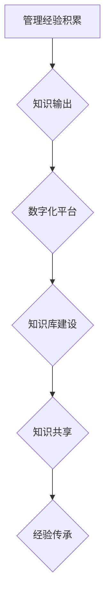

                 

## 知识输出促进管理经验传承

> 关键词：知识管理、经验传承、知识输出、数字化转型、人工智能、数据分析、最佳实践

## 1. 背景介绍

在当今瞬息万变的商业环境中，管理经验的传承显得尤为重要。企业积累的宝贵经验，往往蕴藏着解决问题、提高效率、创造价值的关键。然而，随着员工流动、组织结构调整等因素的影响，管理经验的流失和断层问题日益突出。如何有效地输出和传承管理经验，成为企业持续发展的重要课题。

传统的管理经验传承方式主要依赖于经验丰富的员工的口头传授、案例分享等形式，存在着信息传递不及时、难以量化、知识沉淀不足等问题。随着数字化转型的深入，企业开始探索利用数字化技术手段，构建更加高效、可持续的管理经验传承体系。

## 2. 核心概念与联系

**2.1 知识管理与经验传承**

知识管理 (KM) 是指企业在组织、收集、存储、共享、应用和更新知识方面所采取的一系列策略和实践。经验传承则是知识管理的一个重要分支，旨在将组织积累的经验知识，以可持续的方式传递给下一代员工，确保经验的延续和创新。

**2.2 知识输出与数字化转型**

知识输出是指将知识以可理解、可应用的形式呈现出来，并将其传递给目标受众的过程。数字化转型为知识输出提供了新的机遇和可能性。通过数字化技术手段，企业可以将管理经验以多种形式进行记录、存储和传播，例如：

* 文档化：将管理经验以文档、报告、案例等形式记录下来，方便员工查阅和学习。
* 视频化：将管理经验以视频的形式呈现，更加直观生动，易于理解和记忆。
* 在线平台：构建知识共享平台，方便员工在线交流、学习和分享管理经验。

**2.3 人工智能与知识输出**

人工智能 (AI) 技术的快速发展，为知识输出提供了强大的工具支持。例如：

* 自然语言处理 (NLP)：可以帮助自动提取和整理管理经验中的关键信息，生成知识库和知识图谱。
* 机器学习 (ML)：可以根据历史数据，识别和推荐最佳实践，帮助员工解决问题和提高效率。
* 知识图谱：可以将管理经验中的不同概念和关系进行建模，构建知识网络，方便用户进行知识导航和探索。

**2.4 流程图**



## 3. 核心算法原理 & 具体操作步骤

**3.1 算法原理概述**

知识输出的核心算法原理主要包括：

* **文本挖掘算法**: 用于从海量文本数据中提取关键信息，识别主题、关键词、关系等。
* **知识图谱构建算法**: 用于将知识表示为图结构，构建知识网络，方便知识导航和推理。
* **推荐算法**: 用于根据用户需求和历史数据，推荐相关知识和最佳实践。

**3.2 算法步骤详解**

1. **数据收集**: 收集企业内部的管理经验数据，包括文档、报告、案例、会议记录等。
2. **数据预处理**: 对收集到的数据进行清洗、格式化、标注等预处理工作，以便后续算法的应用。
3. **文本挖掘**: 使用文本挖掘算法，从预处理后的数据中提取关键信息，例如主题、关键词、人物关系等。
4. **知识图谱构建**: 将提取的关键信息构建成知识图谱，表示知识之间的关系和结构。
5. **知识推荐**: 使用推荐算法，根据用户需求和历史数据，推荐相关知识和最佳实践。
6. **知识输出**: 将知识以多种形式输出，例如文档、视频、在线平台等。

**3.3 算法优缺点**

**优点**:

* **自动化**: 可以自动化提取和整理管理经验，提高效率。
* **可量化**: 可以将管理经验量化，方便评估和分析。
* **可持续**: 可以将管理经验以数字化形式保存和传承，避免知识流失。

**缺点**:

* **数据质量**: 算法的准确性依赖于数据质量，数据不完整或不准确会导致算法结果偏差。
* **知识复杂性**: 一些管理经验是复杂的，难以用算法准确地表达和传递。
* **伦理问题**: 知识输出需要考虑伦理问题，例如知识产权、数据隐私等。

**3.4 算法应用领域**

* **企业管理**: 传承企业文化、最佳实践、管理经验等。
* **人力资源**: 知识共享、员工培训、人才培养等。
* **研发创新**: 传承技术经验、知识积累、创新成果等。
* **教育培训**: 传承教学经验、课程内容、学习资源等。

## 4. 数学模型和公式 & 详细讲解 & 举例说明

**4.1 数学模型构建**

知识输出可以看作是一个信息传递的过程，可以用数学模型来描述。

假设：

* $K$ 代表知识库，包含了企业积累的管理经验。
* $U$ 代表用户，需要获取管理经验。
* $R$ 代表推荐系统，负责根据用户需求推荐相关知识。

则知识输出过程可以表示为：

$R(U, K) \rightarrow K'$

其中，$K'$ 代表推荐给用户的知识片段。

**4.2 公式推导过程**

推荐系统 $R$ 的核心是根据用户需求和知识库 $K$ 的内容，计算出每个知识片段 $k \in K$ 的相关度 $s(U, k)$。

相关度 $s(U, k)$ 可以使用余弦相似度来计算：

$$s(U, k) = \frac{U \cdot k}{||U|| ||k||}$$

其中：

* $U$ 代表用户的特征向量，例如用户兴趣、技能、工作经验等。
* $k$ 代表知识片段 $k$ 的特征向量，例如知识主题、关键词、作者等。
* $U \cdot k$ 代表用户特征向量和知识片段特征向量的点积。
* $||U||$ 和 $||k||$ 代表用户特征向量和知识片段特征向量的模长。

**4.3 案例分析与讲解**

假设一个企业想输出其在项目管理方面的经验。

* 用户 $U$ 是一个新加入的项目经理，需要学习项目管理经验。
* 知识库 $K$ 包含了企业在项目管理方面的文档、案例、流程等。

推荐系统 $R$ 可以根据用户的需求，例如项目类型、经验水平等，计算出每个知识片段 $k$ 的相关度 $s(U, k)$。

然后，推荐系统 $R$ 可以将相关度最高的知识片段 $k'$ 推荐给用户 $U$，帮助用户快速学习项目管理经验。

## 5. 项目实践：代码实例和详细解释说明

**5.1 开发环境搭建**

* 操作系统：Windows/Linux/macOS
* Python 版本：3.6+
* 依赖库：

```
pip install numpy pandas scikit-learn
```

**5.2 源代码详细实现**

```python
import pandas as pd
from sklearn.feature_extraction.text import TfidfVectorizer
from sklearn.metrics.pairwise import cosine_similarity

# 加载知识库数据
data = pd.read_csv('knowledge_base.csv')

# 使用 TF-IDF 向量化知识库数据
vectorizer = TfidfVectorizer()
tfidf_matrix = vectorizer.fit_transform(data['content'])

# 计算知识片段之间的余弦相似度
similarity_matrix = cosine_similarity(tfidf_matrix)

# 获取用户需求
user_query = input("请输入您的需求：")

# 将用户需求向量化
user_vector = vectorizer.transform([user_query])

# 计算用户需求与知识片段之间的相似度
similarity_scores = cosine_similarity(user_vector, tfidf_matrix)

# 获取相似度最高的知识片段
top_k_indices = similarity_scores.argsort()[0][-3:][::-1]  # 获取前3个相似度最高的知识片段

# 输出推荐结果
print("推荐的知识片段：")
for index in top_k_indices:
    print(data['title'][index])
```

**5.3 代码解读与分析**

1. **数据加载**: 从 CSV 文件中加载知识库数据。
2. **向量化**: 使用 TF-IDF 向量化技术将知识库数据转换为数字向量，方便计算相似度。
3. **相似度计算**: 使用余弦相似度计算知识片段之间的相似度。
4. **用户需求获取**: 获取用户的需求输入。
5. **用户需求向量化**: 将用户的需求也转换为数字向量。
6. **相似度匹配**: 计算用户需求与知识片段之间的相似度，并获取相似度最高的知识片段。
7. **推荐结果输出**: 输出推荐给用户的知识片段标题。

**5.4 运行结果展示**

```
请输入您的需求：项目管理经验
推荐的知识片段：
项目管理最佳实践指南
项目风险管理案例分析
高效项目执行流程
```

## 6. 实际应用场景

**6.1 企业管理**

* **知识库建设**: 将企业积累的管理经验、最佳实践、流程规范等内容，以数字化形式存储在知识库中。
* **员工培训**: 利用知识库中的内容，为员工提供在线培训和学习资源，帮助他们快速掌握管理知识和技能。
* **决策支持**: 利用知识库中的数据分析结果，为管理决策提供参考和支持。

**6.2 人力资源**

* **人才培养**: 将经验丰富的员工的知识和技能，通过知识输出的方式，传递给年轻员工，促进人才培养。
* **招聘筛选**: 利用知识库中的数据，分析候选人的技能和经验，提高招聘效率。
* **绩效管理**: 利用知识库中的最佳实践，帮助员工提升工作绩效。

**6.3 研发创新**

* **技术经验传承**: 将研发团队的知识和经验，以数字化形式保存和传承，避免技术断层。
* **创新项目支持**: 利用知识库中的技术案例和最佳实践，为创新项目提供参考和支持。
* **知识共享**: 建立知识共享平台，方便研发人员交流学习，促进技术创新。

**6.4 未来应用展望**

随着人工智能技术的不断发展，知识输出将更加智能化、个性化和自动化。

* **智能推荐**: 利用人工智能算法，更加精准地推荐用户需要的知识和资源。
* **个性化学习**: 根据用户的学习风格和需求，定制个性化的学习路径和内容。
* **虚拟助手**: 利用虚拟助手，帮助用户查找、理解和应用知识。

## 7. 工具和资源推荐

**7.1 学习资源推荐**

* **书籍**:

    * 《知识管理》 -  Davenport, T. H.
    * 《知识经济》 -  Peter Drucker
    * 《人工智能简史》 -  Nick Bostrom

* **在线课程**:

    * Coursera: Knowledge Management Specialization
    * edX: Artificial Intelligence

**7.2 开发工具推荐**

* **Python**: 强大的编程语言，广泛应用于数据分析、机器学习等领域。
* **Scikit-learn**: Python 机器学习库，提供各种算法和工具。
* **TensorFlow**: Google 开发的深度学习框架。

**7.3 相关论文推荐**

* **Knowledge Management Systems: A Review** -  Alavi, M., Leidner, D. E.
* **The Impact of Artificial Intelligence on Knowledge Management** -  Wang, Y., Wang, Z.
* **A Survey of Knowledge Graph Embedding Techniques** -  Bordes, A., Usunier, N., Garcia-Duran, A., Weston, J., Yakhnenko, O.

## 8. 总结：未来发展趋势与挑战

**8.1 研究成果总结**

知识输出技术已经取得了显著的成果，为企业管理经验的传承和知识共享提供了新的途径。

**8.2 未来发展趋势**

* **人工智能驱动**: 人工智能技术将进一步推动知识输出的智能化、个性化和自动化。
* **跨领域融合**: 知识输出将与其他领域，例如大数据、云计算、区块链等融合，形成更加强大的应用场景。
* **知识图谱构建**: 知识图谱将成为知识输出的核心技术，帮助用户更深入地理解和应用知识。

**8.3 面临的挑战**

* **数据质量**: 知识输出的准确性和有效性依赖于数据质量，如何保证数据准确性和完整性是一个重要的挑战。
* **知识复杂性**: 一些管理经验是复杂的，难以用算法准确地表达和传递。
* **伦理问题**: 知识输出需要考虑伦理问题，例如知识产权、数据隐私等。

**8.4 研究展望**

未来，知识输出技术将继续发展，为企业管理经验的传承和知识共享提供更加强大的支持。

## 9. 附录：常见问题与解答

**9.1 如何构建知识库？**

知识库的构建需要多方面的努力，包括：

* **数据收集**: 收集企业内部的管理经验数据，例如文档、案例、流程等。
* **数据清洗**: 对收集到的数据进行清洗，去除重复、错误或不完整的数据。
* **数据标注**: 对数据进行标注，例如主题、关键词、关系等，以便后续算法的应用。
* **知识组织**: 将数据组织成知识结构，例如知识图谱、分类体系等。

**9.2 如何评估知识输出的效果？**

知识输出的效果可以从以下几个方面进行评估：

* **用户满意度**: 通过用户调查、反馈等方式，了解用户对知识输出的满意度。
* **知识利用率**: 通过跟踪用户对知识输出的访问量、使用频率等数据，评估知识的利用率。
* **管理效率提升**: 通过对比知识输出前后企业的管理效率，评估知识输出的效果。


作者：禅与计算机程序设计艺术 / Zen and the Art of Computer Programming<end_of_turn>

