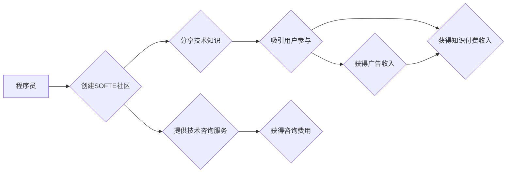

                 

## 程序员如何利用Stack Overflow for Teams变现

> 关键词：Stack Overflow for Teams, 变现, 程序员, 知识付费, 社区运营, 技术咨询

### 1. 背景介绍

Stack Overflow for Teams (SOFTE) 是 Stack Overflow 的企业级版本，为团队提供一个私有的、安全的知识库和协作平台。它允许团队成员提问、回答问题、分享代码片段和文档，从而提高团队效率和知识共享。

近年来，随着软件开发行业的发展和技术迭代的加速，程序员们面临着越来越多的学习和解决问题挑战。同时，程序员的技能和经验也越来越受到重视，成为企业竞相争夺的宝贵资源。在这种背景下，Stack Overflow for Teams 作为一种高效的知识共享和协作平台，为程序员们提供了新的变现机会。

### 2. 核心概念与联系

**2.1  Stack Overflow for Teams (SOFTE)**

SOFTE 是一个基于云的知识库和协作平台，为团队提供了一个私有的、安全的空间来存储、共享和讨论技术知识。它拥有以下核心功能：

* **提问和回答:**  团队成员可以提出技术问题，并由其他成员提供答案。
* **代码片段和文档共享:**  成员可以分享代码片段、文档和其他资源，方便团队成员学习和参考。
* **标签和分类:**  SOFTE 支持标签和分类功能，方便成员查找和管理相关信息。
* **搜索和过滤:**  SOFTE 提供强大的搜索和过滤功能，帮助成员快速找到所需信息。
* **私有化和安全:**  SOFTE 提供私有化和安全的功能，确保团队知识的保密性。

**2.2  知识付费**

知识付费是指通过提供有价值的知识和技能，向用户收取费用的一种商业模式。在互联网时代，知识付费模式得到了快速发展，成为一种重要的收入来源。

**2.3  社区运营**

社区运营是指围绕一个特定的主题或目标，建立和维护一个活跃的在线社区。社区运营需要具备良好的沟通能力、组织能力和运营能力，能够吸引用户参与，并促进社区的健康发展。

**2.4  技术咨询**

技术咨询是指根据用户的需求，提供专业的技术建议和解决方案。技术咨询需要具备丰富的技术经验和解决问题的能力，能够帮助用户解决技术难题。

**2.5  SOFTE 变现模式**

SOFTE 为程序员提供了多种变现模式，包括：

* **知识付费:**  程序员可以利用 SOFTE 平台，分享自己的技术知识和经验，向其他程序员收取费用。
* **社区运营:**  程序员可以创建自己的技术社区，并通过 SOFTE 平台进行运营，吸引用户参与，并获得广告收入或会员费。
* **技术咨询:**  程序员可以利用 SOFTE 平台，提供技术咨询服务，帮助其他程序员解决技术难题，并获得咨询费用。

**2.6  SOFTE 变现流程图**

### 3. 核心算法原理 & 具体操作步骤

**3.1  算法原理概述**

SOFTE 的变现模式主要基于以下核心算法原理：

* **内容推荐算法:**  SOFTE 利用用户行为数据，推荐相关内容给用户，提高用户参与度和知识获取效率。
* **社区活跃度算法:**  SOFTE 利用用户参与度、提问数量、回答数量等指标，评估社区活跃度，并提供相应的运营建议。
* **知识付费算法:**  SOFTE 提供多种知识付费模式，例如付费提问、付费回答、付费课程等，并根据用户需求和市场情况进行动态调整。

**3.2  算法步骤详解**

**3.2.1  内容推荐算法**

1. 收集用户行为数据，包括用户浏览历史、提问记录、回答记录、点赞记录等。
2. 利用机器学习算法，分析用户行为数据，构建用户兴趣模型。
3. 根据用户兴趣模型，推荐相关内容给用户，例如推荐用户感兴趣的标签、问题、回答等。

**3.2.2  社区活跃度算法**

1. 收集社区活跃度指标，包括用户数量、提问数量、回答数量、点赞数量、评论数量等。
2. 利用统计分析方法，计算社区活跃度得分。
3. 根据社区活跃度得分，提供相应的运营建议，例如鼓励用户提问、回答问题、分享资源等。

**3.2.3  知识付费算法**

1. 分析用户需求和市场情况，确定合适的知识付费模式。
2. 设置知识付费价格，并根据用户反馈和市场情况进行调整。
3. 提供多种支付方式，方便用户付费。

**3.3  算法优缺点**

**优点:**

* **个性化推荐:**  内容推荐算法可以根据用户的兴趣爱好，推荐个性化的内容，提高用户体验。
* **社区活跃度提升:**  社区活跃度算法可以帮助运营者了解社区活跃度，并采取相应的措施提升社区活跃度。
* **知识付费模式多样化:**  SOFTE 提供多种知识付费模式，可以满足不同用户的需求。

**缺点:**

* **算法准确性:**  算法的准确性取决于数据质量和算法模型的复杂度。
* **用户隐私保护:**  算法需要收集用户行为数据，需要妥善处理用户隐私信息。
* **知识付费模式竞争:**  知识付费市场竞争激烈，需要不断创新和优化知识付费模式。

**3.4  算法应用领域**

SOFTE 的核心算法原理和具体操作步骤可以应用于以下领域：

* **在线教育:**  推荐个性化学习内容，提升学习效率。
* **技术社区:**  提升社区活跃度，促进知识共享。
* **企业内部知识管理:**  帮助企业员工快速查找和共享知识。
* **个性化推荐系统:**  推荐个性化商品、服务和内容。

### 4. 数学模型和公式 & 详细讲解 & 举例说明

**4.1  数学模型构建**

SOFTE 的内容推荐算法可以基于协同过滤模型构建。协同过滤模型通过分析用户对相同内容的评分或行为，预测用户对其他内容的兴趣。

**4.2  公式推导过程**

协同过滤模型的评分预测公式可以表示为：

$$
\hat{r}_{u,i} = \bar{r}_u + \frac{\sum_{v \in N(u)} (r_{v,i} - \bar{r}_v) \cdot sim(u,v)}{\sum_{v \in N(u)} sim(u,v)}
$$

其中：

* $\hat{r}_{u,i}$ 是对用户 $u$ 对物品 $i$ 的评分预测值。
* $\bar{r}_u$ 是用户 $u$ 的平均评分。
* $r_{v,i}$ 是用户 $v$ 对物品 $i$ 的真实评分。
* $\bar{r}_v$ 是用户 $v$ 的平均评分。
* $sim(u,v)$ 是用户 $u$ 和用户 $v$ 之间的相似度。
* $N(u)$ 是用户 $u$ 的邻居集合。

**4.3  案例分析与讲解**

假设有一个电影推荐系统，用户 $u$ 和用户 $v$ 都看过电影 $A$ 和电影 $B$，用户 $u$ 对电影 $A$ 的评分为 5 分，用户 $v$ 对电影 $A$ 的评分为 4 分，用户 $u$ 对电影 $B$ 的评分为 3 分，用户 $v$ 对电影 $B$ 的评分为 2 分。

如果我们认为用户 $u$ 和用户 $v$ 相似，那么我们可以利用协同过滤模型预测用户 $u$ 对电影 $C$ 的评分。

### 5. 项目实践：代码实例和详细解释说明

**5.1  开发环境搭建**

SOFTE 的开发环境搭建需要以下软件：

* Python 3.x
* Django 框架
* PostgreSQL 数据库

**5.2  源代码详细实现**

SOFTE 的源代码实现较为复杂，需要参考官方文档和开源项目进行开发。

**5.3  代码解读与分析**

SOFTE 的代码主要包含以下模块：

* 用户模块：负责用户注册、登录、权限管理等功能。
* 内容模块：负责问题、回答、代码片段、文档等内容的存储、管理和检索。
* 社区模块：负责社区的运营和管理，包括用户活跃度统计、话题推荐、社区公告等功能。
* 知识付费模块：负责知识付费的设置、管理和支付。

**5.4  运行结果展示**

SOFTE 的运行结果展示包括以下内容：

* 用户界面：用户可以登录SOFTE平台，浏览问题、回答问题、分享代码片段、创建社区等。
* 数据统计：运营者可以查看社区活跃度、用户数量、知识付费收入等数据。
* 系统日志：系统会记录所有操作日志，方便管理员进行故障排查和安全监控。

### 6. 实际应用场景

**6.1  技术社区运营**

程序员可以利用 SOFTE 平台创建自己的技术社区，分享技术知识、经验和资源，并吸引其他程序员参与。

**6.2  知识付费平台**

程序员可以利用 SOFTE 平台，提供付费课程、付费咨询、付费文档等知识付费服务，并获得收入。

**6.3  企业内部知识管理**

企业可以利用 SOFTE 平台，建立企业内部知识库，方便员工查找和共享知识，提高工作效率。

**6.4  未来应用展望**

SOFTE 的未来应用场景还包括：

* **人工智能技术社区:**  人工智能领域的程序员可以利用 SOFTE 平台，分享人工智能技术知识和经验。
* **区块链技术社区:**  区块链领域的程序员可以利用 SOFTE 平台，分享区块链技术知识和经验。
* **元宇宙技术社区:**  元宇宙领域的程序员可以利用 SOFTE 平台，分享元宇宙技术知识和经验。

### 7. 工具和资源推荐

**7.1  学习资源推荐**

* **Stack Overflow for Teams 官方文档:** https://stackoverflow.com/teams/docs
* **Django 框架官方文档:** https://docs.djangoproject.com/en/4.2/
* **PostgreSQL 数据库官方文档:** https://www.postgresql.org/docs/

**7.2  开发工具推荐**

* **Visual Studio Code:** https://code.visualstudio.com/
* **PyCharm:** https://www.jetbrains.com/pycharm/
* **PostgreSQL Admin:** https://www.postgresql.org/docs/current/app-pgadmin.html

**7.3  相关论文推荐**

* **Collaborative Filtering for Recommender Systems:** https://dl.acm.org/doi/10.1145/300740.300749
* **Matrix Factorization Techniques for Recommender Systems:** https://dl.acm.org/doi/10.1145/1718701.1718719

### 8. 总结：未来发展趋势与挑战

**8.1  研究成果总结**

SOFTE 为程序员提供了新的变现机会，并推动了技术社区的建设和知识共享的发展。

**8.2  未来发展趋势**

SOFTE 的未来发展趋势包括：

* **人工智能技术应用:**  利用人工智能技术，提升内容推荐、社区运营和知识付费的效率。
* **元宇宙技术融合:**  将 SOFTE 与元宇宙技术融合，打造沉浸式的技术社区和学习体验。
* **跨平台协作:**  支持跨平台协作，方便程序员在不同平台上共享知识和资源。

**8.3  面临的挑战**

SOFTE 面临的挑战包括：

* **知识付费模式创新:**  需要不断创新和优化知识付费模式，满足用户多样化的需求。
* **社区运营维护:**  需要持续投入资源，维护社区活跃度和用户粘性。
* **数据安全和隐私保护:**  需要加强数据安全和隐私保护措施，保障用户数据安全。

**8.4  研究展望**

未来研究方向包括：

* **个性化学习路径推荐:**  利用人工智能技术，为程序员推荐个性化的学习路径。
* **虚拟现实技术应用:**  将虚拟现实技术应用于 SOFTE 平台，打造沉浸式的技术学习体验。
* **区块链技术应用:**  利用区块链技术，构建更加安全、透明的知识付费平台。

### 9. 附录：常见问题与解答

**9.1  如何创建SOFTE社区？**

创建 SOFTE 社区需要注册 Stack Overflow for Teams 账号，并按照官方文档进行操作。

**9.2  如何设置知识付费模式？**

SOFTE 提供多种知识付费模式，例如付费提问、付费回答、付费课程等，可以根据自己的需求进行设置。

**9.3  如何推广SOFTE社区？**

可以利用社交媒体、技术论坛、邮件营销等方式推广 SOFTE 社区。

作者：禅与计算机程序设计艺术 / Zen and the Art of Computer Programming 
<end_of_turn>

