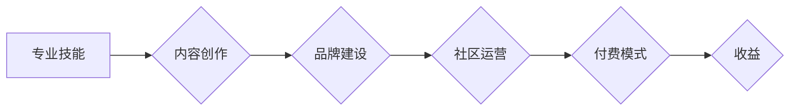

                 

## 程序员如何打造个人知识付费IP

> 关键词：知识付费、个人IP、程序员、技术内容、在线课程、社区运营、品牌建设

### 1. 背景介绍

在互联网时代，知识成为了最宝贵的资源。程序员作为技术人才，拥有丰富的专业知识和经验，具备打造个人知识付费IP的先天优势。知识付费市场蓬勃发展，为程序员提供了新的职业发展路径和收入来源。

然而，打造个人知识付费IP并非易事，需要程序员具备一定的商业意识、内容创作能力和品牌运营能力。本文将从多个方面探讨程序员如何打造个人知识付费IP，帮助程序员更好地把握机遇，实现个人价值。

### 2. 核心概念与联系

**2.1 知识付费IP的概念**

知识付费IP是指通过提供有价值的知识和服务，建立个人品牌，并通过付费模式获取收益的商业模式。

**2.2 程序员知识付费IP的构成**

程序员知识付费IP的构成要素包括：

* **专业技能和知识:** 程序员的核心竞争力在于其专业的技术技能和知识储备。
* **内容创作能力:** 能够将专业知识转化为易于理解和吸收的内容，例如文章、视频、课程等。
* **品牌建设:** 建立个人品牌形象，提升个人影响力，吸引目标用户。
* **社区运营:** 建立线上线下社区，与用户互动交流，形成粘性。
* **付费模式:** 选择合适的付费模式，例如在线课程、会员体系、咨询服务等。

**2.3 程序员知识付费IP的架构**

### 3. 核心算法原理 & 具体操作步骤

**3.1 算法原理概述**

打造个人知识付费IP的核心算法可以概括为“价值创造-传播-变现”的闭环模式。

* **价值创造:** 程序员需要不断学习和积累专业知识，并将其转化为有价值的内容，满足用户的学习需求。
* **传播:** 通过线上线下渠道，将知识内容传播给目标用户，提升个人影响力。
* **变现:** 通过付费模式，将知识内容变现，实现个人收益。

**3.2 算法步骤详解**

1. **确定目标用户:** 首先要明确目标用户的需求和痛点，才能创作出符合用户需求的内容。
2. **选择知识领域:** 根据自身专业技能和兴趣，选择一个具体的知识领域进行深耕。
3. **创作优质内容:** 创作高质量、有价值的内容，例如文章、视频、课程等，并进行有效的包装和推广。
4. **建立个人品牌:** 通过博客、社交媒体等平台，建立个人品牌形象，提升个人影响力。
5. **运营社区:** 建立线上线下社区，与用户互动交流，形成粘性。
6. **选择付费模式:** 根据自身情况和目标用户需求，选择合适的付费模式，例如在线课程、会员体系、咨询服务等。
7. **持续优化:** 不断收集用户反馈，优化内容和服务，提升用户体验。

**3.3 算法优缺点**

* **优点:** 
    * 能够充分发挥程序员的专业技能和知识优势。
    * 具有较高的收入潜力。
    * 可以建立个人品牌，提升个人影响力。
* **缺点:** 
    * 需要投入大量时间和精力进行内容创作和运营。
    * 需要具备一定的商业意识和市场营销能力。
    * 竞争激烈，需要不断创新和提升。

**3.4 算法应用领域**

* **技术培训:** 提供编程语言、软件开发、数据科学等领域的培训课程。
* **技术咨询:** 为企业和个人提供技术咨询服务。
* **技术写作:** 撰写技术文章、书籍、博客等，分享技术经验和知识。
* **开源项目维护:** 维护开源项目，并提供技术支持。

### 4. 数学模型和公式 & 详细讲解 & 举例说明

**4.1 数学模型构建**

知识付费IP的成功可以看作是一个复杂的系统，我们可以用以下数学模型来描述其发展趋势：

$$
IP_{value} = f(Content_{quality}, Brand_{strength}, Community_{engagement}, Monetization_{strategy})
$$

其中：

* $IP_{value}$ 代表知识付费IP的价值，包括用户规模、收入、影响力等指标。
* $Content_{quality}$ 代表知识内容的质量，包括原创性、实用性、趣味性等因素。
* $Brand_{strength}$ 代表个人品牌的知名度和信誉度。
* $Community_{engagement}$ 代表社区活跃度和用户粘性。
* $Monetization_{strategy}$ 代表付费模式的合理性和有效性。

**4.2 公式推导过程**

该模型的推导过程基于以下假设：

* 优质的内容是知识付费IP的核心驱动力。
* 个人品牌是知识付费IP的信誉保证。
* 社区运营是知识付费IP的粘性保障。
* 合理的付费模式是知识付费IP的变现基础。

**4.3 案例分析与讲解**

以程序员李某为例，他是一位优秀的Java开发工程师，拥有丰富的项目经验和技术沉淀。他选择在技术培训领域打造知识付费IP，并通过以下方式提升IP价值：

* **创作优质内容:** 李某录制了高质量的Java开发课程，并将其发布到在线学习平台。
* **建立个人品牌:** 李某在博客和社交媒体平台分享技术经验和观点，并积极参与技术社区活动，提升个人知名度。
* **运营社区:** 李某建立了Java开发技术交流群，定期组织线上线下活动，与用户互动交流，形成粘性。
* **选择付费模式:** 李某采用在线课程付费模式，并提供不同价格的课程套餐，满足不同用户的需求。

通过以上努力，李某的知识付费IP获得了成功，积累了大量的用户和收入。

### 5. 项目实践：代码实例和详细解释说明

**5.1 开发环境搭建**

打造知识付费IP需要搭建相应的开发环境，包括：

* **内容创作工具:**  例如Markdown编辑器、视频录制软件、在线课程平台等。
* **网站或博客平台:**  例如WordPress、GitHub Pages、个人域名等。
* **社交媒体平台:**  例如微博、微信公众号、知乎等。
* **社区运营平台:**  例如Discord、Slack、QQ群等。

**5.2 源代码详细实现**

由于知识付费IP的具体实现方式多种多样，这里不再给出具体的源代码实现。

**5.3 代码解读与分析**

程序员需要根据自身需求和平台特性，选择合适的开发工具和技术栈，并进行代码编写和调试。

**5.4 运行结果展示**

知识付费IP的运行结果包括：

* **用户数量:**  代表知识付费IP的受众规模。
* **课程销量:**  代表知识付费IP的变现能力。
* **用户反馈:**  代表知识付费IP的质量和用户满意度。
* **品牌影响力:**  代表知识付费IP的知名度和信誉度。

### 6. 实际应用场景

**6.1 程序员技术培训**

程序员可以利用自身的技术经验，创作编程语言、软件开发、数据科学等领域的培训课程，并通过在线学习平台进行销售。

**6.2 技术博客和文章写作**

程序员可以将技术经验和见解分享到博客或技术网站，并通过广告、赞助等方式获取收益。

**6.3 开源项目维护和咨询服务**

程序员可以维护开源项目，并提供技术咨询服务，帮助企业和个人解决技术难题。

**6.4 技术社区运营**

程序员可以建立技术社区，聚集同好，分享技术经验，并通过会员体系、赞助等方式获取收益。

**6.5 未来应用展望**

随着人工智能、大数据等技术的不断发展，知识付费IP的应用场景将更加广泛，例如：

* **个性化学习:**  根据用户的学习需求和进度，提供个性化的学习方案和内容。
* **虚拟现实技术:**  利用虚拟现实技术，打造沉浸式的学习体验。
* **区块链技术:**  利用区块链技术，保障知识产权和交易安全。

### 7. 工具和资源推荐

**7.1 学习资源推荐**

* **在线学习平台:**  Coursera、Udemy、Udacity、慕课网等。
* **技术博客:**  Hacker News、Medium、Stack Overflow等。
* **技术书籍:**  《代码的艺术》、《设计模式》、《深入理解Java虚拟机》等。

**7.2 开发工具推荐**

* **内容创作工具:**  Typora、OBS Studio、Camtasia等。
* **网站或博客平台:**  WordPress、GitHub Pages、Netlify等。
* **社交媒体平台:**  微博、微信公众号、知乎等。
* **社区运营平台:**  Discord、Slack、QQ群等。

**7.3 相关论文推荐**

* **知识付费市场研究:**  “知识付费市场发展趋势及未来展望”
* **个人品牌建设:**  “个人品牌建设的理论与实践”
* **社区运营:**  “社区运营的策略与方法”

### 8. 总结：未来发展趋势与挑战

**8.1 研究成果总结**

打造个人知识付费IP需要程序员具备专业的技术技能、内容创作能力、品牌建设能力和社区运营能力。通过价值创造-传播-变现的闭环模式，程序员可以将知识转化为收益，实现个人价值。

**8.2 未来发展趋势**

未来，知识付费IP将更加个性化、智能化和多元化。

* **个性化学习:**  根据用户的学习需求和进度，提供个性化的学习方案和内容。
* **智能化运营:**  利用人工智能技术，自动生成内容、推荐课程、管理社区等。
* **多元化模式:**  除了在线课程、会员体系等传统模式，还将出现更多新的付费模式，例如知识共享平台、虚拟现实体验等。

**8.3 面临的挑战**

* **内容竞争激烈:**  知识付费市场竞争激烈，需要程序员不断创新和提升内容质量。
* **用户信任度:**  用户对知识付费IP的信任度需要不断提升，需要程序员建立良好的品牌形象和口碑。
* **技术变革:**  需要程序员不断学习新技术，适应市场变化。

**8.4 研究展望**

未来研究方向包括：

* **知识付费IP的商业模式创新:**  探索新的付费模式，提高知识付费IP的变现能力。
* **人工智能技术在知识付费IP中的应用:**  利用人工智能技术，提升知识付费IP的智能化运营水平。
* **知识付费IP的社会影响:**  研究知识付费IP对社会发展和人才培养的影响。

### 9. 附录：常见问题与解答

**9.1 如何确定知识付费IP的主题？**

* 结合自身专业技能和兴趣，选择一个有市场需求的领域。
* 分析目标用户的痛点和需求，提供有价值的解决方案。
* 关注行业趋势和热点，把握市场机会。

**9.2 如何创作优质的知识付费内容？**

* 坚持原创，提供独到的见解和经验。
* 注重实用性，解决用户的实际问题。
* 采用多种形式，例如文章、视频、音频等，丰富内容形式。

**9.3 如何运营知识付费IP的社区？**

* 建立活跃的社区氛围，鼓励用户互动交流。
* 提供优质的社区服务，解决用户的疑问和需求。
* 定期组织线上线下活动，增强用户粘性。

**9.4 如何推广知识付费IP？**

* 利用社交媒体平台，推广知识付费内容。
* 与行业KOL合作，扩大影响力。
* 参加行业活动，展示知识付费IP。

作者：禅与计算机程序设计艺术 / Zen and the Art of Computer Programming 
<end_of_turn>

