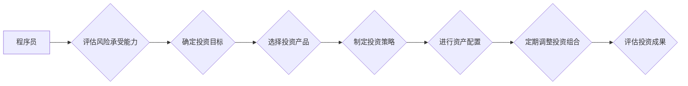

                 

## 程序员的跨境资产配置策略

> 关键词：跨境资产配置、程序员理财、加密货币、海外投资、税务规划、风险管理、分散投资

## 1. 背景介绍

在全球化加速发展的时代，程序员作为科技领域的领军人物，拥有着越来越高的收入水平和投资能力。然而，传统的国内资产配置策略往往难以满足程序员对财富增值和风险管理的双重需求。随着互联网技术的飞速发展，跨境投资逐渐成为程序员理财的新选择。

跨境资产配置是指程序员将部分资产配置到海外市场，以分散风险、获取更高收益和享受更优的税收政策。近年来，随着加密货币、海外基金、海外房产等跨境投资产品的兴起，程序员跨境资产配置的热度不断攀升。

## 2. 核心概念与联系

### 2.1 跨境资产配置的优势

* **风险分散:** 将资产配置到不同国家和地区的市场，可以有效分散投资风险，降低单一市场波动对资产的影响。
* **收益提升:** 海外市场往往拥有更高的投资回报率，可以帮助程序员实现财富增值。
* **税收优化:** 一些海外国家和地区拥有更优惠的税收政策，可以帮助程序员降低税负。
* **资产保值:** 在通货膨胀时期，海外资产可以起到保值的作用。

### 2.2 跨境资产配置的风险

* **汇率风险:** 不同国家和地区的货币汇率波动会影响投资收益。
* **政治风险:** 海外市场的政治环境不稳定可能会对投资造成冲击。
* **法律风险:** 不同国家和地区的法律法规不同，程序员需要了解相关法律风险。
* **信息不对称:** 海外市场信息获取难度较大，程序员需要做好信息收集和分析工作。

**Mermaid 流程图**



## 3. 核心算法原理 & 具体操作步骤

### 3.1 算法原理概述

跨境资产配置的核心算法原理是基于风险-收益理论，通过分析程序员的风险承受能力、投资目标和市场环境，制定合理的资产配置方案。

### 3.2 算法步骤详解

1. **风险评估:** 评估程序员的风险承受能力，包括年龄、收入、投资经验、投资期限等因素。
2. **目标设定:** 确定程序员的投资目标，例如财富增值、保值、养老等。
3. **市场分析:** 分析海外市场的投资环境，包括经济增长、利率、通货膨胀等因素。
4. **产品选择:** 根据程序员的风险承受能力和投资目标，选择合适的跨境投资产品，例如加密货币、海外基金、海外房产等。
5. **策略制定:** 制定合理的资产配置策略，例如资产类别比例、投资期限、风险控制等。
6. **配置执行:** 将资产配置到海外市场，并进行定期调整。
7. **成果评估:** 定期评估投资成果，并根据市场变化和个人需求进行调整。

### 3.3 算法优缺点

**优点:**

* **科学合理:** 基于风险-收益理论，可以制定更科学合理的资产配置方案。
* **个性化定制:** 可以根据程序员的个人情况进行定制化配置。
* **风险控制:** 可以有效控制投资风险，降低投资损失。

**缺点:**

* **数据依赖:** 需要大量市场数据和个人信息进行分析。
* **算法复杂:** 算法模型较为复杂，需要专业知识进行解读和操作。
* **市场变化:** 市场环境变化迅速，算法需要不断更新和调整。

### 3.4 算法应用领域

* **个人理财:** 程序员可以利用该算法进行个人跨境资产配置，实现财富增值和风险管理。
* **机构投资:** 投资机构可以利用该算法进行跨境资产配置，优化投资组合和提高投资收益。
* **金融科技:** 该算法可以应用于金融科技领域，例如智能投资平台、财富管理软件等。

## 4. 数学模型和公式 & 详细讲解 & 举例说明

### 4.1 数学模型构建

跨境资产配置的数学模型可以采用多元线性回归模型，用于预测不同资产类别在不同市场环境下的收益率。

**模型公式:**

$$
R_i = \beta_0 + \beta_1 * X_1 + \beta_2 * X_2 + ... + \beta_n * X_n + \epsilon
$$

其中:

* $R_i$ 表示第 i 种资产的收益率。
* $\beta_0$ 表示截距项。
* $\beta_1, \beta_2, ..., \beta_n$ 表示不同自变量的回归系数。
* $X_1, X_2, ..., X_n$ 表示不同市场环境的指标，例如利率、通货膨胀、经济增长等。
* $\epsilon$ 表示随机误差项。

### 4.2 公式推导过程

多元线性回归模型的推导过程较为复杂，涉及矩阵运算和统计学原理。

### 4.3 案例分析与讲解

假设我们想要预测不同资产类别在不同经济增长率下的收益率。我们可以收集历史数据，构建多元线性回归模型，并根据模型结果预测未来不同经济增长率下的收益率。

**举例说明:**

假设我们收集了以下数据：

| 经济增长率 | 股票收益率 | 债券收益率 |
|---|---|---|
| 2% | 5% | 3% |
| 4% | 8% | 4% |
| 6% | 12% | 5% |

我们可以使用这些数据构建多元线性回归模型，预测不同经济增长率下的股票和债券收益率。

## 5. 项目实践：代码实例和详细解释说明

### 5.1 开发环境搭建

* **操作系统:** Windows, macOS, Linux
* **编程语言:** Python
* **库依赖:** pandas, numpy, scikit-learn

### 5.2 源代码详细实现

```python
import pandas as pd
from sklearn.linear_model import LinearRegression

# 加载数据
data = pd.read_csv('asset_data.csv')

# 准备数据
X = data[['经济增长率']]
y = data[['股票收益率', '债券收益率']]

# 创建线性回归模型
model = LinearRegression()

# 训练模型
model.fit(X, y)

# 预测收益率
new_data = pd.DataFrame({'经济增长率': [5]})
predicted_returns = model.predict(new_data)

# 打印预测结果
print(predicted_returns)
```

### 5.3 代码解读与分析

* **数据加载:** 使用 pandas 库加载数据文件。
* **数据准备:** 将经济增长率作为自变量，股票和债券收益率作为因变量。
* **模型创建:** 使用 scikit-learn 库创建线性回归模型。
* **模型训练:** 使用训练数据训练线性回归模型。
* **预测收益率:** 使用训练好的模型预测不同经济增长率下的股票和债券收益率。
* **结果打印:** 打印预测结果。

### 5.4 运行结果展示

运行代码后，将输出预测的股票和债券收益率。

## 6. 实际应用场景

### 6.1 程序员跨境资产配置

程序员可以利用跨境资产配置策略，将部分资产配置到海外市场，分散风险、获取更高收益和享受更优的税收政策。

### 6.2 海外投资平台

一些海外投资平台提供跨境资产配置服务，帮助程序员进行海外投资。

### 6.3 金融顾问

一些金融顾问专门为程序员提供跨境资产配置咨询服务。

### 6.4 未来应用展望

随着科技发展和全球化进程加速，跨境资产配置将成为越来越重要的投资策略。未来，跨境资产配置将更加智能化、个性化和便捷化。

## 7. 工具和资源推荐

### 7.1 学习资源推荐

* **书籍:** 《投资者的行为》
* **网站:** Investopedia, Seeking Alpha
* **课程:** Coursera, edX

### 7.2 开发工具推荐

* **编程语言:** Python
* **库依赖:** pandas, numpy, scikit-learn
* **数据平台:** Google BigQuery, Amazon Redshift

### 7.3 相关论文推荐

* **《跨境资产配置的风险管理》**
* **《程序员理财指南》**

## 8. 总结：未来发展趋势与挑战

### 8.1 研究成果总结

跨境资产配置是程序员理财的重要策略，可以帮助程序员分散风险、获取更高收益和享受更优的税收政策。

### 8.2 未来发展趋势

* **智能化:** 利用人工智能技术，实现更智能的跨境资产配置策略。
* **个性化:** 根据程序员的个人情况，定制化跨境资产配置方案。
* **便捷化:** 通过移动端应用和在线平台，提供更便捷的跨境资产配置服务。

### 8.3 面临的挑战

* **数据获取:** 获取高质量的海外市场数据仍然是一个挑战。
* **法律法规:** 不同国家和地区的法律法规不同，需要程序员了解相关法律风险。
* **技术复杂:** 跨境资产配置涉及多种技术，需要程序员具备一定的技术能力。

### 8.4 研究展望

未来，我们将继续研究跨境资产配置的智能化、个性化和便捷化，为程序员提供更优质的跨境资产配置服务。

## 9. 附录：常见问题与解答

**问题:** 如何选择合适的跨境投资产品？

**解答:** 选择跨境投资产品需要根据程序员的风险承受能力、投资目标和投资期限等因素进行综合考虑。

**问题:** 如何进行跨境资产配置的风险管理？

**解答:** 跨境资产配置的风险管理主要包括汇率风险、政治风险、法律风险和信息不对称风险等。程序员需要了解这些风险，并采取相应的措施进行风险控制。

**问题:** 如何进行跨境资产配置的税务规划？

**解答:** 不同国家和地区的税收政策不同，程序员需要了解相关税收政策，并制定合理的税务规划。


作者：禅与计算机程序设计艺术 / Zen and the Art of Computer Programming 
<end_of_turn>

