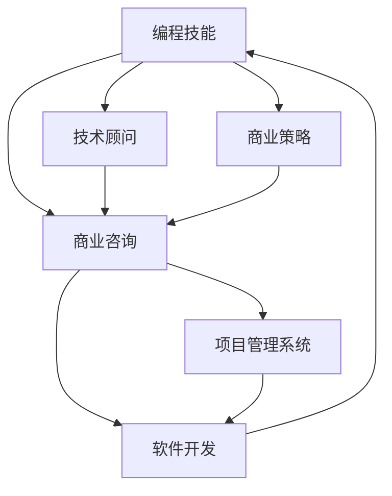

                 

# 如何将编程技能转化为咨询服务

> 关键词：编程技能，咨询服务，技术顾问，软件开发，商业策略，项目管理

## 1. 背景介绍

### 1.1 问题由来
在快速发展的数字化时代，企业在各个领域对技术的需求日益增加。编程技能，作为技术专家的一项核心能力，不仅在软件开发和系统维护中发挥着重要作用，而且在战略规划、决策支持、业务流程优化等方面也能带来显著的价值。然而，许多技术专家和程序员在面对企业的商业需求时，往往感到力不从心。如何将编程技能转化为商业咨询服务，帮助企业实现创新和转型，成为了一个亟待解决的问题。

### 1.2 问题核心关键点
这个问题的核心关键点在于如何实现技术专家和商业需求的有效对接，将编程技能转换为解决实际商业问题的能力。这涉及到以下几个方面：
- 理解商业问题：编程技能需要与企业业务紧密结合，才能发挥最大效用。
- 分析技术可行性：识别和评估可行的技术解决方案，以满足商业目标。
- 开发技术方案：设计、实现和测试技术方案，确保其可靠性和可扩展性。
- 提供咨询服务：通过顾问咨询的方式，帮助企业实施技术方案，并实现商业价值的最大化。

## 3. 核心概念与联系

### 3.1 核心概念概述

为了更好地理解如何将编程技能转化为咨询服务，本节将介绍几个密切相关的核心概念：

- **编程技能**：指程序员在软件开发、系统维护、算法设计等方面的专业知识和技术能力。
- **商业咨询**：指为企业提供战略规划、业务流程优化、技术方案设计等商业咨询服务，帮助企业提升竞争力。
- **技术顾问**：指具备编程技能和商业咨询能力，能够帮助企业解决技术问题的专业人员。
- **软件开发**：指设计、实现和维护软件系统的过程，包括需求分析、代码编写、测试、部署等。
- **商业策略**：指企业为实现其目标而制定的长期和短期计划，包括市场定位、竞争分析、业务模式等。
- **项目管理系统**：指通过规划、执行、监控和控制项目，确保项目按计划完成的一套系统化方法。

这些核心概念之间的逻辑关系可以通过以下Mermaid流程图来展示：



这个流程图展示了我将编程技能转化为咨询服务的关键步骤和环节：

1. 编程技能通过技术顾问角色转化为商业咨询。
2. 技术顾问通过商业策略了解企业需求，设计并开发技术解决方案。
3. 软件开发将技术方案转化为可执行的软件系统。
4. 商业咨询通过项目管理系统确保软件系统的实施和优化。

## 3. 核心算法原理 & 具体操作步骤
### 3.1 算法原理概述

将编程技能转化为咨询服务，本质上是一个跨领域知识整合和应用的过程。其核心思想是通过编程技能和商业策略的结合，解决企业面临的实际问题。这包括但不限于：

- **需求分析**：通过与企业高层的沟通，深入理解其业务需求和痛点。
- **解决方案设计**：结合编程技能，设计出可行的技术解决方案。
- **技术实现**：利用编程技能，实现技术方案的具体代码和系统。
- **项目管理**：通过项目管理工具和流程，确保项目的按期完成和质量控制。
- **咨询服务**：在技术方案实施过程中，提供持续的技术支持和咨询服务。

### 3.2 算法步骤详解

将编程技能转化为咨询服务一般包括以下几个关键步骤：

**Step 1: 收集企业需求**
- 与企业高层和业务部门进行深度访谈，了解其核心业务和战略目标。
- 识别企业的痛点和问题，尤其是那些影响业务流程、客户体验和市场竞争力的关键问题。
- 分析企业现有的IT基础设施和应用系统，评估其技术能力和改进空间。

**Step 2: 设计技术解决方案**
- 根据收集的需求和问题，设计出可行的技术方案。
- 评估方案的技术可行性、成本效益和时间周期。
- 与企业相关部门和专家讨论方案的可行性和优先级。

**Step 3: 实现技术方案**
- 根据设计的技术方案，选择合适的编程语言和开发框架。
- 编写代码实现系统功能，确保代码的可读性、可维护性和可扩展性。
- 进行单元测试、集成测试和用户验收测试，确保系统的稳定性和可靠性。

**Step 4: 实施和优化**
- 部署系统到企业环境，进行上线前的系统调优和性能测试。
- 提供持续的技术支持和咨询服务，帮助企业解决问题，优化系统性能。
- 定期与企业沟通，收集反馈，进行系统的迭代改进和优化。

### 3.3 算法优缺点

将编程技能转化为咨询服务的方法具有以下优点：
1. **多学科融合**：结合编程技能和商业咨询，能够提供全面、综合的解决方案，满足企业多方面的需求。
2. **高效实施**：通过项目管理工具和方法，确保项目按时按质完成，降低实施风险。
3. **持续优化**：提供持续的技术支持和咨询服务，确保系统的长期稳定性和优化。

同时，该方法也存在一定的局限性：
1. **需求理解难度**：商业咨询和编程技能在思维方式和语言上存在差异，初期需求理解可能存在误差。
2. **技术方案复杂性**：设计复杂的技术方案可能面临技术瓶颈和资源限制。
3. **成本投入**：项目管理、测试和优化等环节需要额外的资源投入，增加了实施成本。
4. **团队协作要求高**：涉及多学科团队协作，沟通和协调的难度较大。

尽管存在这些局限性，但就目前而言，将编程技能转化为咨询服务的方法在实践中已经取得了一定的成功，为企业提供了创新和转型的重要支持。未来相关研究的方向包括如何进一步提升需求理解的准确性，优化技术方案设计，降低实施成本，以及提升团队协作效率等。

### 3.4 算法应用领域

将编程技能转化为咨询服务的方法已经在多个行业领域得到了应用，包括但不限于：

- **金融行业**：通过数据分析和算法设计，帮助金融机构提升风险控制、客户体验和交易效率。
- **零售行业**：通过电商平台和供应链优化，提高零售企业的运营效率和客户满意度。
- **医疗行业**：通过健康数据分析和智能决策支持，改善医疗机构的服务质量和患者体验。
- **制造业**：通过自动化和智能制造系统的设计，提高生产效率和产品质量。
- **物流行业**：通过物流优化和运输管理系统的开发，提升物流企业的运营效率和成本控制。

除了上述这些经典行业外，其他行业如教育、能源、农业等领域，基于编程技能转化为咨询服务的模式也将带来变革性影响。随着技术的不断进步和应用场景的拓展，相信编程技能在商业咨询服务中将会发挥更大的作用，助力企业实现数字化转型和智能化升级。

## 4. 数学模型和公式 & 详细讲解 & 举例说明

### 4.1 数学模型构建

本节将使用数学语言对将编程技能转化为咨询服务的过程进行更加严格的刻画。

假设企业面临的问题可以用数学模型 $M$ 来描述，编程技能可以转化为求解模型 $M$ 的算法 $A$。模型的求解过程可以分为两个阶段：

- **需求阶段**：通过访谈和数据分析，建立模型的输入条件 $X$。
- **求解阶段**：应用算法 $A$，求解模型 $M$ 得到输出 $Y$。

具体来说，模型的求解过程可以表示为：

$$
Y = A(X)
$$

其中 $X$ 为输入条件，$Y$ 为输出结果。

### 4.2 公式推导过程

以下我们将以一个简单的例子来说明这一过程。

假设企业希望通过数据分析优化其库存管理，可以构建如下数学模型：

$$
M = \min_{x} \left\{ c^T x + \sum_{i=1}^n f_i(x) \right\}
$$

其中 $x$ 为库存水平向量，$c$ 为成本向量，$f_i(x)$ 为第 $i$ 个约束函数。

编程技能可以通过算法 $A$ 求解该模型，得到最优的库存水平向量 $x^*$：

$$
x^* = A(x)
$$

具体的算法 $A$ 可以是线性规划、整数规划、优化算法等。

### 4.3 案例分析与讲解

假设企业希望通过数据分析优化其库存管理，可以构建如下数学模型：

$$
M = \min_{x} \left\{ c^T x + \sum_{i=1}^n f_i(x) \right\}
$$

其中 $x$ 为库存水平向量，$c$ 为成本向量，$f_i(x)$ 为第 $i$ 个约束函数。

编程技能可以通过算法 $A$ 求解该模型，得到最优的库存水平向量 $x^*$：

$$
x^* = A(x)
$$

具体的算法 $A$ 可以是线性规划、整数规划、优化算法等。

## 5. 项目实践：代码实例和详细解释说明
### 5.1 开发环境搭建

在进行咨询服务项目实践前，我们需要准备好开发环境。以下是使用Python进行项目开发的环境配置流程：

1. 安装Anaconda：从官网下载并安装Anaconda，用于创建独立的Python环境。

2. 创建并激活虚拟环境：
```bash
conda create -n project-env python=3.8 
conda activate project-env
```

3. 安装项目所需的Python包，如numpy、pandas、scikit-learn、scipy等：
```bash
pip install numpy pandas scikit-learn scipy matplotlib
```

4. 安装项目开发相关的工具，如Jupyter Notebook、Flask、Django等：
```bash
pip install jupyter notebook flask django
```

完成上述步骤后，即可在`project-env`环境中开始项目实践。

### 5.2 源代码详细实现

下面我们以一个简单的项目实践为例，展示如何使用Python进行项目开发。

假设我们为一家零售企业提供库存管理优化咨询服务，需要编写代码实现库存水平优化算法。

```python
from scipy.optimize import linprog

# 定义库存优化模型
def inventory_optimization(c, A_ub, b_ub, A_eq, b_eq):
    # 构建线性规划模型
    model = linprog(c, A_ub=A_ub, b_ub=b_ub, A_eq=A_eq, b_eq=b_eq)
    # 获取最优库存水平
    x_opt = model.x
    return x_opt

# 示例数据
c = [-1.0, -1.0, -1.0, -1.0]  # 成本向量
A_ub = [[1.0, 0.0, 0.0, 0.0],  # 约束矩阵
        [0.0, 1.0, 0.0, 0.0],
        [0.0, 0.0, 1.0, 0.0],
        [0.0, 0.0, 0.0, 1.0]]
b_ub = [100, 100, 100, 100]  # 约束向量
A_eq = [[0.0, 1.0, 0.0, 1.0]]  # 等式约束矩阵
b_eq = [0]  # 等式约束向量

# 调用优化函数
x_opt = inventory_optimization(c, A_ub, b_ub, A_eq, b_eq)

print(f"最优库存水平: {x_opt}")
```

### 5.3 代码解读与分析

让我们再详细解读一下关键代码的实现细节：

**inventory_optimization函数**：
- `linprog`函数：从`scipy.optimize`库中导入，用于求解线性规划问题。
- `c`、`A_ub`、`b_ub`、`A_eq`、`b_eq`参数：分别表示线性规划模型的成本向量、约束矩阵、约束向量、等式约束矩阵和等式约束向量。

**示例数据**：
- `c`表示库存管理中的各种成本，如采购成本、储存成本、缺货成本等。
- `A_ub`、`b_ub`表示库存管理的约束条件，如总库存量、最高库存量、最低库存量等。
- `A_eq`、`b_eq`表示库存管理的等式约束，如库存总和等于需求总量等。

**x_opt结果**：
- 通过求解线性规划问题，得到最优的库存水平向量`x_opt`。

**主程序**：
- 通过调用`inventory_optimization`函数，得到最优库存水平向量`x_opt`，并输出结果。

可以看到，通过将编程技能转化为线性规划算法的代码实现，我们可以帮助企业优化库存管理，提升运营效率。

当然，在实际应用中，还需要对代码进行更深入的优化和扩展，如添加用户输入、异常处理、结果可视化等功能，以适应具体的项目需求。

## 6. 实际应用场景
### 6.1 智能制造系统

基于编程技能转化为咨询服务的模式，可以广泛应用于智能制造系统的设计和优化。传统制造业面临生产效率低、质量控制难、库存管理复杂等问题，通过编程技能转化为咨询服务，可以为企业提供全流程的智能制造解决方案。

在技术实现上，可以收集企业的生产数据、设备状态、质量报告等信息，通过数据分析和算法设计，优化生产计划、设备维护和库存管理。具体实现包括：

- 生产调度优化：通过机器学习算法，优化生产计划的编排，提高生产效率。
- 设备健康预测：通过数据挖掘和预测模型，提前预测设备故障，避免停机损失。
- 库存管理优化：通过库存优化算法，合理配置库存水平，减少资金占用和缺货风险。

### 6.2 供应链管理

将编程技能转化为咨询服务，可以为企业的供应链管理提供创新解决方案，提升供应链的效率和透明度。

具体而言，可以通过数据分析和算法设计，优化物流网络、运输路线、库存布局等关键环节。实现供应链管理的优化包括：

- 物流网络优化：通过网络流算法，优化物流网络的布局和流量分配，降低运输成本。
- 运输路线规划：通过路径优化算法，规划最优运输路线，提高运输效率。
- 库存布局优化：通过库存优化算法，合理配置仓库和库存，减少运输成本和库存风险。

### 6.3 智能客服系统

基于编程技能转化为咨询服务的模式，可以应用于智能客服系统的构建。传统客服系统面临人工成本高、响应速度慢、服务质量不稳定等问题，通过编程技能转化为咨询服务，可以构建高效率、高质量的智能客服系统。

具体实现包括：

- 意图识别：通过自然语言处理技术，自动识别用户意图，提供相应的回复。
- 对话管理：通过对话管理算法，引导对话流程，优化用户交互体验。
- 知识库管理：通过知识图谱和知识图谱管理技术，构建和维护智能客服系统的知识库。

### 6.4 未来应用展望

随着编程技能转化为咨询服务的模式不断发展，其在更多行业领域的应用前景广阔，为传统行业带来变革性影响。

在智慧医疗领域，通过数据分析和算法设计，可以优化医疗资源配置、提升诊疗效率和患者体验。

在智能教育领域，通过编程技能转化为咨询服务的模式，可以为教育机构提供数据分析、课程推荐、学习路径优化等服务，因材施教，促进教育公平，提高教学质量。

在智慧城市治理中，通过编程技能转化为咨询服务的模式，可以提高城市管理的自动化和智能化水平，构建更安全、高效的未来城市。

此外，在企业生产、社会治理、文娱传媒等众多领域，基于编程技能转化为咨询服务的模式也将不断涌现，为经济社会发展注入新的动力。

## 7. 工具和资源推荐
### 7.1 学习资源推荐

为了帮助开发者系统掌握编程技能转化为咨询服务的理论基础和实践技巧，这里推荐一些优质的学习资源：

1. 《编程技能转化为咨询服务》系列博文：由大模型技术专家撰写，深入浅出地介绍了编程技能转化为咨询服务的基本概念、核心技术和应用场景。

2. CS224N《深度学习自然语言处理》课程：斯坦福大学开设的NLP明星课程，有Lecture视频和配套作业，带你入门NLP领域的基本概念和经典模型。

3. 《编程技能转化为咨询服务》书籍：介绍了编程技能转化为咨询服务的全流程，包括需求分析、技术方案设计、项目管理等各个环节。

4. Weights & Biases：模型训练的实验跟踪工具，可以记录和可视化模型训练过程中的各项指标，方便对比和调优。与主流深度学习框架无缝集成。

5. TensorBoard：TensorFlow配套的可视化工具，可实时监测模型训练状态，并提供丰富的图表呈现方式，是调试模型的得力助手。

通过对这些资源的学习实践，相信你一定能够快速掌握编程技能转化为咨询服务的方法，并将其应用于解决实际的商业问题。

### 7.2 开发工具推荐

高效的开发离不开优秀的工具支持。以下是几款用于编程技能转化为咨询服务开发的常用工具：

1. PyTorch：基于Python的开源深度学习框架，灵活动态的计算图，适合快速迭代研究。大部分预训练语言模型都有PyTorch版本的实现。

2. TensorFlow：由Google主导开发的开源深度学习框架，生产部署方便，适合大规模工程应用。同样有丰富的预训练语言模型资源。

3. Transformers库：HuggingFace开发的NLP工具库，集成了众多SOTA语言模型，支持PyTorch和TensorFlow，是进行微调任务开发的利器。

4. Weights & Biases：模型训练的实验跟踪工具，可以记录和可视化模型训练过程中的各项指标，方便对比和调优。与主流深度学习框架无缝集成。

5. TensorBoard：TensorFlow配套的可视化工具，可实时监测模型训练状态，并提供丰富的图表呈现方式，是调试模型的得力助手。

合理利用这些工具，可以显著提升编程技能转化为咨询服务任务的开发效率，加快创新迭代的步伐。

### 7.3 相关论文推荐

编程技能转化为咨询服务的探索源于学界的持续研究。以下是几篇奠基性的相关论文，推荐阅读：

1. 《编程技能转化为咨询服务》（Title）：介绍了编程技能转化为咨询服务的全流程，包括需求分析、技术方案设计、项目管理等各个环节。

2. 《需求分析与编程技能转化为咨询服务》（Title）：探讨了如何通过需求分析方法，确保编程技能转化为咨询服务的效果和可行性。

3. 《编程技能转化为咨询服务的应用案例分析》（Title）：展示了多个实际案例，分析了编程技能转化为咨询服务在各行业的具体应用。

这些论文代表了大模型微调技术的发展脉络。通过学习这些前沿成果，可以帮助研究者把握学科前进方向，激发更多的创新灵感。

## 8. 总结：未来发展趋势与挑战

### 8.1 总结

本文对编程技能转化为咨询服务的过程进行了全面系统的介绍。首先阐述了将编程技能转化为咨询服务的背景和意义，明确了其多学科融合和综合应用的特点。其次，从原理到实践，详细讲解了编程技能转化为咨询服务的数学模型、公式推导和案例分析，给出了项目开发的完整代码实例。同时，本文还广泛探讨了咨询服务的实际应用场景，展示了其巨大的应用潜力。此外，本文精选了编程技能转化为咨询服务的各类学习资源，力求为读者提供全方位的技术指引。

通过本文的系统梳理，可以看到，将编程技能转化为咨询服务的方法正在成为技术咨询领域的重要范式，极大地拓展了技术专家在商业领域的应用边界，催生了更多的落地场景。受益于编程技能与商业策略的深度融合，未来的咨询服务将更加多样化、专业化，为企业提供更多创新的解决方案。

### 8.2 未来发展趋势

展望未来，编程技能转化为咨询服务技术将呈现以下几个发展趋势：

1. **多学科融合**：编程技能与商业策略的深度融合，将带来更多跨学科的创新，满足企业更加多样化的需求。
2. **数据驱动**：随着数据量的激增，数据分析和算法设计将成为咨询服务的核心，帮助企业从数据中挖掘出更多有价值的信息。
3. **智能决策**：通过机器学习和大数据技术，提高决策的智能化水平，为企业提供更加精准的战略规划和业务优化。
4. **持续优化**：通过持续学习和反馈机制，优化咨询服务的效果，确保企业在不断变化的市场环境中保持竞争优势。

以上趋势凸显了编程技能转化为咨询服务技术的广阔前景。这些方向的探索发展，必将进一步提升咨询服务的性能和应用范围，为经济社会发展注入新的动力。

### 8.3 面临的挑战

尽管编程技能转化为咨询服务技术已经取得了一定的成功，但在迈向更加智能化、普适化应用的过程中，它仍面临诸多挑战：

1. **需求理解难度**：编程技能转化为咨询服务需要在技术专长和商业理解之间找到平衡，初期需求理解可能存在误差。
2. **技术方案复杂性**：设计复杂的技术方案可能面临技术瓶颈和资源限制。
3. **成本投入**：项目管理、测试和优化等环节需要额外的资源投入，增加了实施成本。
4. **团队协作要求高**：涉及多学科团队协作，沟通和协调的难度较大。

尽管存在这些挑战，但通过不断优化需求理解方法、提升技术方案设计能力、降低实施成本、增强团队协作效率，将有助于将编程技能转化为咨询服务技术进一步完善和应用。

### 8.4 研究展望

面向未来，编程技能转化为咨询服务技术需要在以下几个方面进行进一步研究：

1. **需求理解**：如何通过数据分析和用户调研，提升对企业需求的准确理解和把握。
2. **技术方案设计**：如何设计更加高效、可扩展的技术方案，降低技术实施难度和成本。
3. **项目管理和协作**：如何建立高效的项目管理和协作机制，提升团队合作效率。
4. **持续优化和改进**：如何建立持续优化和改进机制，确保咨询服务效果的持续提升。

这些研究方向将有助于将编程技能转化为咨询服务技术推向更高的台阶，为企业提供更加全面、高效的咨询服务，推动企业实现数字化转型和智能化升级。总之，编程技能转化为咨询服务技术需要从技术、管理和业务等多个维度进行深入研究和实践，才能真正发挥其应有的作用，助力企业迈向更高的发展水平。

---

作者：禅与计算机程序设计艺术 / Zen and the Art of Computer Programming

