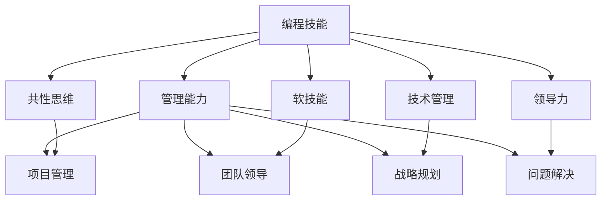

                 

# 如何将编程技能转化为管理能力

## 1. 背景介绍

### 1.1 问题由来

在信息技术迅速发展的今天，编程技能已成为许多行业的重要基础。无论是软件开发、系统架构，还是数据分析、人工智能，编程能力都是核心竞争力。然而，随着职业生涯的发展，编程技能的局限性逐渐显现。对于许多工程师来说，仅仅依靠编程技能已经不足以支撑他们在管理职位上的新角色。因此，如何将编程技能转化为管理能力，成为摆在许多技术精英面前的重要课题。

### 1.2 问题核心关键点

将编程技能转化为管理能力，需要从多个层面进行思考和实践。核心关键点包括：

- **编程与管理的共同点**：理解编程和管理之间的关联，找到共通的方法论。
- **技能迁移**：将编程中积累的知识、工具、思维方式迁移到管理工作中。
- **软技能提升**：培养沟通、协调、决策等软技能，适应管理岗位的需求。
- **领导力发展**：提升领导力，包括团队建设、战略规划和变革管理等能力。

### 1.3 问题研究意义

研究如何从编程技能转型到管理能力，对个人职业生涯发展具有重要意义：

- **职业生涯转型**：帮助技术专家识别管理角色中的机会，实现职业多元化。
- **提升组织效率**：通过将编程思维应用于管理，提升团队协作和项目执行力。
- **促进创新**：借助编程逻辑和工具，推动组织创新和变革。

## 2. 核心概念与联系

### 2.1 核心概念概述

为了更好地理解如何将编程技能转化为管理能力，本节将介绍几个密切相关的核心概念：

- **编程技能**：包括编程语言、算法、数据结构、软件开发流程等基本技能。
- **管理能力**：包括项目管理、团队领导、战略规划、问题解决等综合能力。
- **共性思维**：编程和管理中的问题解决方法、系统思维、持续改进等共同理念。
- **软技能**：沟通、倾听、协商、冲突管理等关键人际交往能力。
- **技术管理**：将技术背景应用于管理工作的实践，如DevOps、敏捷开发等。
- **领导力**：领导和管理团队的决策、激励、文化建设等能力。

这些核心概念之间的逻辑关系可以通过以下Mermaid流程图来展示：



这个流程图展示了几大核心概念之间的关系：

1. 编程技能是基础，提供解决问题的方法和工具。
2. 共性思维是贯穿编程和管理的关键思维。
3. 软技能是管理中的重要人际交往能力。
4. 技术管理是将编程技术应用于管理的具体实践。
5. 领导力是管理中的核心能力，贯穿于各个环节。
6. 项目管理、团队领导、战略规划、问题解决是管理能力的核心部分。

## 3. 核心算法原理 & 具体操作步骤

### 3.1 算法原理概述

将编程技能转化为管理能力，本质上是一个从具体技术到抽象管理的转型过程。其核心思想是：将编程中积累的逻辑思维、问题解决、系统设计等技能和经验，迁移到管理工作中，形成系统化的管理方法和策略。

形式化地，假设编程技能为 $S$，管理能力为 $M$，则转化过程可以表示为：

$$
M = f(S)
$$

其中 $f$ 为转换函数，表示将编程技能 $S$ 转化为管理能力 $M$。该函数涉及多个维度，如知识迁移、技能提升、软技能培养等。

### 3.2 算法步骤详解

基于编程和管理技能之间的逻辑关系，我们将转化过程分为四个主要步骤：

1. **技能映射与迁移**：将编程中的基本概念、工具和技术映射到管理领域，形成新的思维模式和决策方法。
2. **软技能提升**：针对管理中的关键人际交往能力，通过培训和实践提升沟通、协调、决策等软技能。
3. **技术管理实践**：将编程中的系统设计、持续改进、问题解决等技术管理思想应用于项目管理、敏捷开发等实践中。
4. **领导力发展**：通过培养团队建设、战略规划、变革管理等领导力技能，提升在管理岗位上的领导力。

### 3.3 算法优缺点

将编程技能转化为管理能力的方法具有以下优点：

1. **系统性**：通过明确的技能映射和实践路径，确保转化过程的系统性和可操作性。
2. **一致性**：将编程中积累的逻辑思维和系统设计应用于管理，保持管理方法的一致性和稳定性。
3. **高效性**：利用编程中的技术管理实践，提升项目管理效率和团队执行力。

同时，该方法也存在一定的局限性：

1. **难度高**：编程技能和管理的思维方式存在差异，需要一定的跨领域理解和学习。
2. **资源投入大**：培训、实践和转型需要大量时间和资源。
3. **效果因人而异**：个体差异大，不同人的转型效果可能不同。
4. **适应性不足**：部分编程技能未必直接适用于管理实践，需要灵活调整。

### 3.4 算法应用领域

将编程技能转化为管理能力的方法，已经在多个领域得到了应用，包括但不限于：

- **软件开发管理**：将敏捷开发、DevOps、持续集成等技术管理思想应用于项目管理。
- **数据分析管理**：利用编程技能中的数据处理和分析能力，提升数据驱动的决策支持。
- **人工智能管理**：将人工智能技术应用于组织管理，如智能招聘、客户服务等。
- **企业战略规划**：通过编程思维中的系统设计和模型优化，提升企业战略的科学性和可执行性。
- **团队建设和创新管理**：利用编程中的团队协作和问题解决能力，推动企业创新和变革。

## 4. 数学模型和公式 & 详细讲解 & 举例说明

### 4.1 数学模型构建

本节将使用数学语言对编程技能转化为管理能力的过程进行更加严格的刻画。

假设编程技能为 $S$，管理能力为 $M$，则转化函数 $f$ 可以表示为：

$$
f: S \times S \times S \rightarrow M \times M \times M \times M
$$

其中，$S$ 表示编程技能的不同方面，$M$ 表示管理能力的不同方面。

### 4.2 公式推导过程

为了简化问题，我们假设编程技能和管理的某些关键方面可以进行一对一的映射。例如，编程中的算法设计和系统设计可以映射到管理中的战略规划和流程优化。

具体而言，我们可以将编程技能 $S$ 中的关键元素 $S_k$ 映射到管理能力 $M$ 中的关键元素 $M_k$，如下所示：

$$
f_k: S_k \rightarrow M_k
$$

例如，编程中的循环结构可以映射到管理中的流程优化和资源分配，具体公式如下：

$$
f_{\text{循环}}: \text{循环结构} \rightarrow \text{流程优化}
$$

### 4.3 案例分析与讲解

为了更好地理解如何将编程技能转化为管理能力，下面举一个具体的案例：

假设某公司的软件工程师小李，负责一个跨部门的项目。在项目初期，他面临多部门协调、资源分配和进度管理的问题。通过编程技能转化为管理能力的方法，小李可以采取以下步骤：

1. **技能映射与迁移**：小李将编程中用于处理复杂任务的分层设计和模块化思维，应用于项目管理中，将项目分解为多个子任务，并分配给不同部门。
2. **软技能提升**：小李通过培训和学习，提升了沟通技巧和冲突管理能力，与各部门领导进行有效沟通，解决了团队间的协作问题。
3. **技术管理实践**：小李利用编程中的持续集成和自动化测试技术，引入了敏捷开发流程，提升了项目效率和质量。
4. **领导力发展**：小李在项目管理中表现出色，被提拔为项目经理，进一步学习了团队建设和战略规划等领导力技能，推动了项目的顺利完成。

## 5. 项目实践：代码实例和详细解释说明

### 5.1 开发环境搭建

在进行编程技能转化为管理能力的实践前，我们需要准备好开发环境。以下是使用Python进行PyTorch开发的环境配置流程：

1. 安装Anaconda：从官网下载并安装Anaconda，用于创建独立的Python环境。

2. 创建并激活虚拟环境：
```bash
conda create -n pytorch-env python=3.8 
conda activate pytorch-env
```

3. 安装PyTorch：根据CUDA版本，从官网获取对应的安装命令。例如：
```bash
conda install pytorch torchvision torchaudio cudatoolkit=11.1 -c pytorch -c conda-forge
```

4. 安装Transformers库：
```bash
pip install transformers
```

5. 安装各类工具包：
```bash
pip install numpy pandas scikit-learn matplotlib tqdm jupyter notebook ipython
```

完成上述步骤后，即可在`pytorch-env`环境中开始实践。

### 5.2 源代码详细实现

下面我们以软件开发管理为例，给出使用Transformers库对BERT模型进行微调的PyTorch代码实现。

首先，定义软件开发管理任务的数据处理函数：

```python
from transformers import BertTokenizer
from torch.utils.data import Dataset
import torch

class SoftwareDevDataset(Dataset):
    def __init__(self, texts, tags, tokenizer, max_len=128):
        self.texts = texts
        self.tags = tags
        self.tokenizer = tokenizer
        self.max_len = max_len
        
    def __len__(self):
        return len(self.texts)
    
    def __getitem__(self, item):
        text = self.texts[item]
        tags = self.tags[item]
        
        encoding = self.tokenizer(text, return_tensors='pt', max_length=self.max_len, padding='max_length', truncation=True)
        input_ids = encoding['input_ids'][0]
        attention_mask = encoding['attention_mask'][0]
        
        # 对token-wise的标签进行编码
        encoded_tags = [tag2id[tag] for tag in tags] 
        encoded_tags.extend([tag2id['O']] * (self.max_len - len(encoded_tags)))
        labels = torch.tensor(encoded_tags, dtype=torch.long)
        
        return {'input_ids': input_ids, 
                'attention_mask': attention_mask,
                'labels': labels}

# 标签与id的映射
tag2id = {'O': 0, 'B': 1, 'I': 2}
id2tag = {v: k for k, v in tag2id.items()}

# 创建dataset
tokenizer = BertTokenizer.from_pretrained('bert-base-cased')

train_dataset = SoftwareDevDataset(train_texts, train_tags, tokenizer)
dev_dataset = SoftwareDevDataset(dev_texts, dev_tags, tokenizer)
test_dataset = SoftwareDevDataset(test_texts, test_tags, tokenizer)
```

然后，定义模型和优化器：

```python
from transformers import BertForTokenClassification, AdamW

model = BertForTokenClassification.from_pretrained('bert-base-cased', num_labels=len(tag2id))

optimizer = AdamW(model.parameters(), lr=2e-5)
```

接着，定义训练和评估函数：

```python
from torch.utils.data import DataLoader
from tqdm import tqdm
from sklearn.metrics import classification_report

device = torch.device('cuda') if torch.cuda.is_available() else torch.device('cpu')
model.to(device)

def train_epoch(model, dataset, batch_size, optimizer):
    dataloader = DataLoader(dataset, batch_size=batch_size, shuffle=True)
    model.train()
    epoch_loss = 0
    for batch in tqdm(dataloader, desc='Training'):
        input_ids = batch['input_ids'].to(device)
        attention_mask = batch['attention_mask'].to(device)
        labels = batch['labels'].to(device)
        model.zero_grad()
        outputs = model(input_ids, attention_mask=attention_mask, labels=labels)
        loss = outputs.loss
        epoch_loss += loss.item()
        loss.backward()
        optimizer.step()
    return epoch_loss / len(dataloader)

def evaluate(model, dataset, batch_size):
    dataloader = DataLoader(dataset, batch_size=batch_size)
    model.eval()
    preds, labels = [], []
    with torch.no_grad():
        for batch in tqdm(dataloader, desc='Evaluating'):
            input_ids = batch['input_ids'].to(device)
            attention_mask = batch['attention_mask'].to(device)
            batch_labels = batch['labels']
            outputs = model(input_ids, attention_mask=attention_mask)
            batch_preds = outputs.logits.argmax(dim=2).to('cpu').tolist()
            batch_labels = batch_labels.to('cpu').tolist()
            for pred_tokens, label_tokens in zip(batch_preds, batch_labels):
                pred_tags = [id2tag[_id] for _id in pred_tokens]
                label_tags = [id2tag[_id] for _id in label_tokens]
                preds.append(pred_tags[:len(label_tokens)])
                labels.append(label_tags)
                
    print(classification_report(labels, preds))
```

最后，启动训练流程并在测试集上评估：

```python
epochs = 5
batch_size = 16

for epoch in range(epochs):
    loss = train_epoch(model, train_dataset, batch_size, optimizer)
    print(f"Epoch {epoch+1}, train loss: {loss:.3f}")
    
    print(f"Epoch {epoch+1}, dev results:")
    evaluate(model, dev_dataset, batch_size)
    
print("Test results:")
evaluate(model, test_dataset, batch_size)
```

以上就是使用PyTorch对BERT进行软件开发管理任务微调的完整代码实现。可以看到，得益于Transformers库的强大封装，我们可以用相对简洁的代码完成BERT模型的加载和微调。

### 5.3 代码解读与分析

让我们再详细解读一下关键代码的实现细节：

**SoftwareDevDataset类**：
- `__init__`方法：初始化文本、标签、分词器等关键组件。
- `__len__`方法：返回数据集的样本数量。
- `__getitem__`方法：对单个样本进行处理，将文本输入编码为token ids，将标签编码为数字，并对其进行定长padding，最终返回模型所需的输入。

**tag2id和id2tag字典**：
- 定义了标签与数字id之间的映射关系，用于将token-wise的预测结果解码回真实的标签。

**训练和评估函数**：
- 使用PyTorch的DataLoader对数据集进行批次化加载，供模型训练和推理使用。
- 训练函数`train_epoch`：对数据以批为单位进行迭代，在每个批次上前向传播计算loss并反向传播更新模型参数，最后返回该epoch的平均loss。
- 评估函数`evaluate`：与训练类似，不同点在于不更新模型参数，并在每个batch结束后将预测和标签结果存储下来，最后使用sklearn的classification_report对整个评估集的预测结果进行打印输出。

**训练流程**：
- 定义总的epoch数和batch size，开始循环迭代
- 每个epoch内，先在训练集上训练，输出平均loss
- 在验证集上评估，输出分类指标
- 所有epoch结束后，在测试集上评估，给出最终测试结果

可以看到，PyTorch配合Transformers库使得BERT微调的代码实现变得简洁高效。开发者可以将更多精力放在数据处理、模型改进等高层逻辑上，而不必过多关注底层的实现细节。

当然，工业级的系统实现还需考虑更多因素，如模型的保存和部署、超参数的自动搜索、更灵活的任务适配层等。但核心的微调范式基本与此类似。

## 6. 实际应用场景
### 6.1 软件开发管理

基于大语言模型微调的对话技术，可以广泛应用于软件开发管理的构建。传统开发管理往往依赖人工调配，效率低下，且无法提供实时反馈。而使用微调后的对话模型，可以7x24小时不间断服务，实时回答开发人员的疑问，提供技术支持和项目指导，从而大大提升开发效率和质量。

在技术实现上，可以收集公司内部的技术支持聊天记录，将问题与解决方案构建成监督数据，在此基础上对预训练对话模型进行微调。微调后的对话模型能够自动理解开发人员的问题，匹配最合适的解决方案，甚至动态搜索相关文档和技术文章，生成详尽的解决方案建议。如此构建的开发管理平台，能大幅提升技术支持的响应速度和质量，降低问题解决的时间成本。

### 6.2 数据管理

数据管理是企业信息化建设的重要组成部分，但传统的表格和文件管理方式往往难以适应数据量和复杂度的增加。基于大语言模型微调的技术，可以构建智能化、自动化的数据管理平台。

具体而言，可以收集企业的数据使用记录、操作日志、审计信息等，利用自然语言处理技术进行文本分析和标签化，形成结构化的元数据。通过微调后的模型，对新产生的数据自动进行语义分析和标签标注，建立更加准确、全面的数据管理体系。同时，利用模型对数据进行定期监控和分析，发现异常数据，及时报警和处理，从而保障数据的安全性和完整性。

### 6.3 项目风险管理

在项目开发过程中，风险管理是确保项目顺利进行的重要环节。传统风险管理往往依赖于人工识别和评估，耗时耗力，且容易忽略潜在风险。基于大语言模型微调的文本分析技术，可以构建智能化的项目风险管理系统。

具体而言，可以收集项目经理的会议记录、进度报告、风险评估等信息，利用自然语言处理技术进行情感分析和主题分类，自动识别项目中的风险因素和风险级别。通过微调后的模型，对风险因素进行动态监测和评估，及时预警和响应，从而降低项目失败的风险。

### 6.4 未来应用展望

随着大语言模型和微调方法的不断发展，基于微调范式将在更多领域得到应用，为传统行业带来变革性影响。

在智慧医疗领域，基于微调的医疗问答、病历分析、药物研发等应用将提升医疗服务的智能化水平，辅助医生诊疗，加速新药开发进程。

在智能教育领域，微调技术可应用于作业批改、学情分析、知识推荐等方面，因材施教，促进教育公平，提高教学质量。

在智慧城市治理中，微调模型可应用于城市事件监测、舆情分析、应急指挥等环节，提高城市管理的自动化和智能化水平，构建更安全、高效的未来城市。

此外，在企业生产、社会治理、文娱传媒等众多领域，基于大模型微调的人工智能应用也将不断涌现，为经济社会发展注入新的动力。相信随着预训练语言模型和微调方法的持续演进，微调方法将成为人工智能落地应用的重要范式，推动人工智能技术在垂直行业的规模化落地。

## 7. 工具和资源推荐
### 7.1 学习资源推荐

为了帮助开发者系统掌握大语言模型微调的理论基础和实践技巧，这里推荐一些优质的学习资源：

1. 《Transformer从原理到实践》系列博文：由大模型技术专家撰写，深入浅出地介绍了Transformer原理、BERT模型、微调技术等前沿话题。

2. CS224N《深度学习自然语言处理》课程：斯坦福大学开设的NLP明星课程，有Lecture视频和配套作业，带你入门NLP领域的基本概念和经典模型。

3. 《Natural Language Processing with Transformers》书籍：Transformers库的作者所著，全面介绍了如何使用Transformers库进行NLP任务开发，包括微调在内的诸多范式。

4. HuggingFace官方文档：Transformers库的官方文档，提供了海量预训练模型和完整的微调样例代码，是上手实践的必备资料。

5. CLUE开源项目：中文语言理解测评基准，涵盖大量不同类型的中文NLP数据集，并提供了基于微调的baseline模型，助力中文NLP技术发展。

通过对这些资源的学习实践，相信你一定能够快速掌握大语言模型微调的精髓，并用于解决实际的NLP问题。
###  7.2 开发工具推荐

高效的开发离不开优秀的工具支持。以下是几款用于大语言模型微调开发的常用工具：

1. PyTorch：基于Python的开源深度学习框架，灵活动态的计算图，适合快速迭代研究。大部分预训练语言模型都有PyTorch版本的实现。

2. TensorFlow：由Google主导开发的开源深度学习框架，生产部署方便，适合大规模工程应用。同样有丰富的预训练语言模型资源。

3. Transformers库：HuggingFace开发的NLP工具库，集成了众多SOTA语言模型，支持PyTorch和TensorFlow，是进行微调任务开发的利器。

4. Weights & Biases：模型训练的实验跟踪工具，可以记录和可视化模型训练过程中的各项指标，方便对比和调优。与主流深度学习框架无缝集成。

5. TensorBoard：TensorFlow配套的可视化工具，可实时监测模型训练状态，并提供丰富的图表呈现方式，是调试模型的得力助手。

6. Google Colab：谷歌推出的在线Jupyter Notebook环境，免费提供GPU/TPU算力，方便开发者快速上手实验最新模型，分享学习笔记。

合理利用这些工具，可以显著提升大语言模型微调任务的开发效率，加快创新迭代的步伐。

### 7.3 相关论文推荐

大语言模型和微调技术的发展源于学界的持续研究。以下是几篇奠基性的相关论文，推荐阅读：

1. Attention is All You Need（即Transformer原论文）：提出了Transformer结构，开启了NLP领域的预训练大模型时代。

2. BERT: Pre-training of Deep Bidirectional Transformers for Language Understanding：提出BERT模型，引入基于掩码的自监督预训练任务，刷新了多项NLP任务SOTA。

3. Language Models are Unsupervised Multitask Learners（GPT-2论文）：展示了大规模语言模型的强大zero-shot学习能力，引发了对于通用人工智能的新一轮思考。

4. Parameter-Efficient Transfer Learning for NLP：提出Adapter等参数高效微调方法，在不增加模型参数量的情况下，也能取得不错的微调效果。

5. Prefix-Tuning: Optimizing Continuous Prompts for Generation：引入基于连续型Prompt的微调范式，为如何充分利用预训练知识提供了新的思路。

6. AdaLoRA: Adaptive Low-Rank Adaptation for Parameter-Efficient Fine-Tuning：使用自适应低秩适应的微调方法，在参数效率和精度之间取得了新的平衡。

这些论文代表了大语言模型微调技术的发展脉络。通过学习这些前沿成果，可以帮助研究者把握学科前进方向，激发更多的创新灵感。

## 8. 总结：未来发展趋势与挑战

### 8.1 总结

本文对将编程技能转化为管理能力的方法进行了全面系统的介绍。首先阐述了编程技能和管理的关联性，明确了两者之间的相似点和差异点。其次，从原理到实践，详细讲解了编程技能向管理技能转化的数学模型和操作步骤，给出了具体的微调样例代码。同时，本文还探讨了编程技能转化为管理能力在多个领域的应用场景，展示了其广泛的应用前景。

通过本文的系统梳理，可以看到，将编程技能转化为管理能力的方法，对于技术专家向管理角色的转型具有重要意义。这一方法不仅能够提升个人在管理岗位上的表现，还能推动企业信息化建设和技术管理的智能化水平，为NLP技术在实际应用中的普及和落地提供新的思路。

### 8.2 未来发展趋势

展望未来，将编程技能转化为管理能力的方法将呈现以下几个发展趋势：

1. **系统化发展**：随着技术和管理知识体系的深入融合，将形成更为系统化、结构化的管理方法论。
2. **跨领域应用**：将编程技能和思想应用于更多行业领域，如金融、医疗、制造等，形成跨学科的创新管理模式。
3. **技术辅助管理**：借助人工智能和大数据分析技术，提升管理决策的科学性和效率。
4. **数据驱动管理**：利用编程中的数据处理和分析能力，推动数据驱动的管理实践，提升组织数据化水平。
5. **持续学习**：技术和管理知识的不断更新，使得持续学习成为管理技能转型的重要环节。

这些趋势展示了将编程技能转化为管理能力方法的广阔前景，预示着未来技术和管理融合将带来更为深远的变革。

### 8.3 面临的挑战

尽管将编程技能转化为管理能力的方法已经取得了一定的成效，但在迈向更加智能化、普适化应用的过程中，它仍面临诸多挑战：

1. **文化差异**：技术和管理领域存在显著的文化差异，需要找到合适的切入点和过渡方法。
2. **资源投入**：转化过程需要大量的学习和培训资源，短期内可能难以完全投入。
3. **效果评估**：管理效果的量化评估和长期跟踪是转型的重要环节，但目前还缺乏成熟的方法和工具。
4. **个体差异**：不同人的背景和能力不同，转型的效果和速度存在差异。

### 8.4 研究展望

面对将编程技能转化为管理能力所面临的挑战，未来的研究需要在以下几个方面寻求新的突破：

1. **文化融合**：研究和实践跨领域知识的融合，建立技术和管理之间的桥梁。
2. **资源优化**：探索更高效的学习和培训方法，降低转型成本，提升转化效果。
3. **效果评估**：开发科学的量化评估工具，评估和管理转型效果，提供持续改进的依据。
4. **个体支持**：提供个性化的转型路径和工具，帮助不同背景的人员顺利转型。

这些研究方向将引领将编程技能转化为管理能力的方法走向成熟，为技术和管理领域的融合提供新的动力和方向。

## 9. 附录：常见问题与解答

**Q1：编程技能和管理技能之间的关联性如何体现？**

A: 编程技能和管理技能之间存在着许多共通之处，如问题解决、系统设计、持续改进等。例如，编程中的模块化设计和敏捷开发思想，可以应用于管理中的任务分解和项目计划。编程中的版本控制和问题跟踪系统，可以转化为管理中的文档管理和问题跟踪工具。

**Q2：如何判断编程技能是否适用于管理实践？**

A: 判断编程技能是否适用于管理实践，可以从以下几个方面考虑：
1. 技能是否具有通用性，如系统设计、问题解决等。
2. 技能是否具有可转移性，即是否能从编程环境迁移到管理环境。
3. 技能是否具有可扩展性，即能否应用于不同规模和复杂度的管理任务。

**Q3：如何培养管理技能中的软技能？**

A: 管理技能中的软技能，如沟通、协调、决策等，可以通过以下方式培养：
1. 参加培训和课程，提升软技能的基础理论。
2. 实践和实习，通过实际工作场景进行锻炼和积累。
3. 寻求导师和教练的帮助，通过反馈和指导不断改进。
4. 学习先进的管理理论和实践，吸取成功的经验。

**Q4：如何将编程思维应用于管理实践？**

A: 将编程思维应用于管理实践，可以从以下几个方面入手：
1. 将编程中的算法和模型应用于管理决策，如预测模型、优化算法等。
2. 将编程中的系统设计和模块化思维应用于管理流程，如任务分解、模块化管理等。
3. 利用编程中的数据处理和分析能力，提升管理数据的洞察力和决策支持。

**Q5：转型过程中如何平衡技术和管理技能？**

A: 转型过程中，要注重平衡技术和管理技能，避免过度依赖某一方面。可以通过以下方式实现：
1. 制定明确的转型计划，设定短期和长期目标。
2. 保持持续学习，不断更新技术和管理知识。
3. 寻求团队支持，形成合作和互助的氛围。
4. 定期评估和反馈，及时调整转型策略。

这些问题的回答展示了将编程技能转化为管理能力的核心方法和策略，为技术专家向管理角色的转型提供了参考和指导。

---

作者：禅与计算机程序设计艺术 / Zen and the Art of Computer Programming

