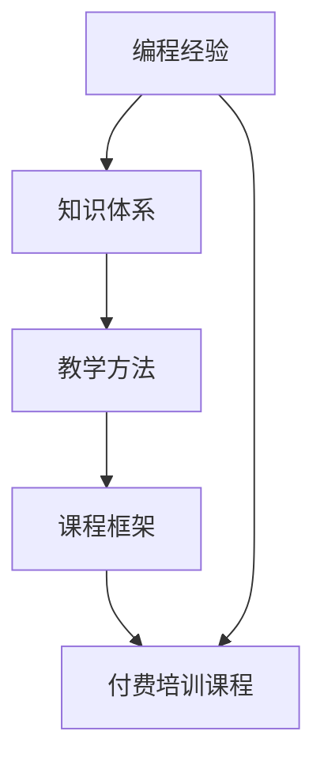

                 

## 1. 背景介绍

作为一名经验丰富的编程专家，你可能已经拥有在多个领域（如软件开发、人工智能、机器学习等）的编程经验和实战案例。这些经验不仅使你在技术上有深厚的功底，也为你构建知识体系、总结经验教训、编写高质量的编程书籍提供了丰富的素材。但是，如何将这些宝贵的经验进一步转化为价值更大、受众更广的培训课程呢？

### 1.1 问题的由来

编程经验是一笔宝贵的财富，但如何有效地传播这些知识，帮助更多初学者成长为高水平程序员，是很多编程专家面临的挑战。通过在线培训、公开课、书籍等形式，可以将编程经验转化为付费培训课程，既提升个人知名度，又为他人提供价值。然而，这个过程涉及多方面的考量，需要系统地梳理知识体系、选择恰当的教学方法、搭建合理的课程框架。

### 1.2 问题核心关键点

将编程经验转化为付费培训课程，需关注以下核心关键点：

- 目标受众：明确目标受众的编程水平和学习需求。
- 课程内容：设计合理的课程内容，确保理论与实践相结合。
- 教学方法：采用多样化的教学方法，提升学习效果。
- 课程结构：规划课程结构，确保知识体系的连贯性和逻辑性。
- 技术栈选择：选择合适的技术栈，既能覆盖基础又能触及前沿。

### 1.3 问题研究意义

将编程经验转化为付费培训课程，具有以下研究意义：

- 知识传播：帮助更多人学习编程，提升社会整体技术水平。
- 技术推广：推广先进的编程技术和思想，促进技术创新。
- 职业发展：提升自身知名度和影响力，为职业发展积累资源。
- 经济收益：通过付费课程获得收入，实现自我价值。
- 教育启发：启发他人对编程的兴趣，影响更多人进入这个领域。

## 2. 核心概念与联系

### 2.1 核心概念概述

为了更好地理解如何将编程经验转化为付费培训课程，本节将介绍几个核心概念：

- **编程经验**：通过多年编程实践积累的知识、技能和技巧。
- **付费培训课程**：通过收取费用向学员传授编程知识和技能的教育形式。
- **知识体系**：系统的编程知识结构，包括基础概念、算法、数据结构、设计模式等。
- **教学方法**：互动式教学、案例分析、项目驱动、在线讨论等。
- **课程框架**：课程的模块、单元和子单元设计，确保知识传授的系统性。

### 2.2 核心概念原理和架构的 Mermaid 流程图



该流程图展示了编程经验转化为付费培训课程的关键步骤：首先从编程经验中提取知识体系，然后采用多样化的教学方法，最后搭建课程框架，最终生成付费培训课程。

## 3. 核心算法原理 & 具体操作步骤

### 3.1 算法原理概述

将编程经验转化为付费培训课程，本质上是一个知识传递和创新的过程。核心在于将复杂的编程经验提炼为易于理解和掌握的知识模块，通过合理的教学方法和课程框架，使学员能够系统地学习和实践。

### 3.2 算法步骤详解

将编程经验转化为付费培训课程的步骤如下：

**Step 1: 梳理知识体系**
- 将编程经验按照不同的主题（如算法、数据结构、设计模式、实战项目等）进行分类和整理。
- 确保每个主题都包含基础概念、进阶技巧和实际案例。

**Step 2: 设计教学方法**
- 采用互动式教学、案例分析、项目驱动等多样化的方法。
- 使用线上平台（如Zoom、Udemy、Coursera等）进行课程录制和直播。
- 鼓励学员在线上和线下讨论，提高学习互动性。

**Step 3: 搭建课程框架**
- 划分课程的主要模块和子模块，每个模块包含多个单元。
- 设计每单元的学习目标、前置知识、实践项目、作业和测试。
- 使用流程图、思维导图、PPT等工具辅助展示课程结构。

**Step 4: 编写课程大纲**
- 明确每个模块和单元的知识点、教学内容和时间安排。
- 根据学员的不同层次，设计基础、进阶和专家级课程。
- 编写详细的课程讲义和习题集，确保内容的全面性和深度。

**Step 5: 实施教学和反馈**
- 进行课程录制或直播，讲解每个单元的内容，并进行互动和讨论。
- 布置作业和实践项目，鼓励学员在线上提交作业并进行交流。
- 定期收集学员反馈，根据反馈调整教学内容和方式。

**Step 6: 评估和改进**
- 设计课程评估机制，包括单元测试、项目评审、课程评价等。
- 根据学员的反馈和评估结果，不断改进课程内容和教学方法。
- 定期更新课程内容，加入新的知识和实践案例。

### 3.3 算法优缺点

将编程经验转化为付费培训课程的方法具有以下优点：

- 系统性：确保知识体系的完整性和连贯性。
- 实用性：通过实战案例和项目驱动，提升学员的实际编程能力。
- 互动性：多样化教学方法提升学习效果和积极性。
- 可扩展性：根据学员反馈和需求，灵活调整课程内容。

同时，这种方法也存在以下局限性：

- 时间和精力投入大：需要大量时间准备课程和教学材料。
- 技术栈选择难度：需要平衡基础和前沿，选择合适的技术栈。
- 在线学习效果难以完全替代传统课堂：需要考虑技术障碍和学习动机问题。
- 学员基础多样，教学难度较大：需针对不同层次的学员调整课程难度和教学方法。

### 3.4 算法应用领域

将编程经验转化为付费培训课程的方法，可以应用于以下领域：

- **软件开发**：面向初学者、中级和高级开发者，涵盖前后端开发、Web开发、移动开发等。
- **人工智能与机器学习**：介绍机器学习算法、深度学习框架、数据处理等。
- **数据科学与大数据**：涵盖数据挖掘、数据分析、数据可视化等。
- **系统设计与架构**：介绍系统设计原则、架构模式、微服务设计等。
- **云计算与DevOps**：涵盖云计算基础、容器技术、持续集成和持续部署等。

## 4. 数学模型和公式 & 详细讲解 & 举例说明

### 4.1 数学模型构建

为了更好地理解将编程经验转化为付费培训课程的方法，我们将构建一个数学模型。假设编程经验可以表示为$E$，课程内容可以表示为$C$，教学方法可以表示为$T$，课程框架可以表示为$F$。

目标是最小化课程内容的传递误差，即：

$$
\min_{E \rightarrow C} \epsilon
$$

其中$\epsilon$表示课程内容与编程经验之间的误差。

### 4.2 公式推导过程

为了最小化传递误差，我们可以采用以下方法：

- **知识映射**：将编程经验$E$映射到课程内容$C$，确保知识点的完整性和准确性。
- **方法选择**：选择适当的教学方法$T$，提高学习效率和互动性。
- **框架设计**：设计合理的课程框架$F$，确保课程内容的逻辑性和连贯性。

### 4.3 案例分析与讲解

以面向初学者的“Python基础编程”课程为例，分析如何将编程经验转化为课程内容：

- **知识体系**：基础语法、变量、数据类型、控制结构、函数、文件操作等。
- **教学方法**：案例驱动、代码讲解、互动问答、小组讨论。
- **课程框架**：模块化设计，每个模块包括基础概念、代码练习、项目实践、测试评估。
- **实践项目**：使用Python进行小型项目实践，如数据分析、Web开发、游戏开发等。

通过以上步骤，可以将编程经验系统地转化为易于理解的课程内容，提升学员的学习效果。

## 5. 项目实践：代码实例和详细解释说明

### 5.1 开发环境搭建

开发环境搭建是成功实现编程经验转化为付费培训课程的关键步骤。以下是使用Python进行PyTorch开发的环境配置流程：

1. 安装Anaconda：从官网下载并安装Anaconda，用于创建独立的Python环境。

2. 创建并激活虚拟环境：
```bash
conda create -n pytorch-env python=3.8 
conda activate pytorch-env
```

3. 安装PyTorch：根据CUDA版本，从官网获取对应的安装命令。例如：
```bash
conda install pytorch torchvision torchaudio cudatoolkit=11.1 -c pytorch -c conda-forge
```

4. 安装Transformers库：
```bash
pip install transformers
```

5. 安装各类工具包：
```bash
pip install numpy pandas scikit-learn matplotlib tqdm jupyter notebook ipython
```

完成上述步骤后，即可在`pytorch-env`环境中开始编程实践。

### 5.2 源代码详细实现

这里我们以“Python基础编程”课程为例，给出使用Transformers库对课程进行开发和实践的PyTorch代码实现。

首先，定义课程内容：

```python
from transformers import BertTokenizer
from torch.utils.data import Dataset
import torch

class PythonCourseDataset(Dataset):
    def __init__(self, text, tokenizer, max_len=128):
        self.texts = text
        self.tokenizer = tokenizer
        self.max_len = max_len
        
    def __len__(self):
        return len(self.texts)
    
    def __getitem__(self, item):
        text = self.texts[item]
        encoding = self.tokenizer(text, return_tensors='pt', max_length=self.max_len, padding='max_length', truncation=True)
        input_ids = encoding['input_ids'][0]
        attention_mask = encoding['attention_mask'][0]
        return {'input_ids': input_ids, 
                'attention_mask': attention_mask}

# 定义课程内容
texts = [
    "Python基础编程课程介绍",
    "变量、数据类型和运算符",
    "控制结构：if、while、for",
    "函数和模块",
    "异常处理",
    "文件操作",
    "常用库和工具"
]
tokenizer = BertTokenizer.from_pretrained('bert-base-cased')

train_dataset = PythonCourseDataset(texts, tokenizer)
dev_dataset = PythonCourseDataset(texts, tokenizer)
test_dataset = PythonCourseDataset(texts, tokenizer)
```

然后，定义模型和优化器：

```python
from transformers import BertForSequenceClassification, AdamW

model = BertForSequenceClassification.from_pretrained('bert-base-cased', num_labels=len(texts))

optimizer = AdamW(model.parameters(), lr=2e-5)
```

接着，定义训练和评估函数：

```python
from torch.utils.data import DataLoader
from tqdm import tqdm
from sklearn.metrics import classification_report

device = torch.device('cuda') if torch.cuda.is_available() else torch.device('cpu')
model.to(device)

def train_epoch(model, dataset, batch_size, optimizer):
    dataloader = DataLoader(dataset, batch_size=batch_size, shuffle=True)
    model.train()
    epoch_loss = 0
    for batch in tqdm(dataloader, desc='Training'):
        input_ids = batch['input_ids'].to(device)
        attention_mask = batch['attention_mask'].to(device)
        model.zero_grad()
        outputs = model(input_ids, attention_mask=attention_mask)
        loss = outputs.loss
        epoch_loss += loss.item()
        loss.backward()
        optimizer.step()
    return epoch_loss / len(dataloader)

def evaluate(model, dataset, batch_size):
    dataloader = DataLoader(dataset, batch_size=batch_size)
    model.eval()
    preds, labels = [], []
    with torch.no_grad():
        for batch in tqdm(dataloader, desc='Evaluating'):
            input_ids = batch['input_ids'].to(device)
            attention_mask = batch['attention_mask'].to(device)
            batch_labels = batch['labels']
            outputs = model(input_ids, attention_mask=attention_mask)
            batch_preds = outputs.logits.argmax(dim=2).to('cpu').tolist()
            batch_labels = batch_labels.to('cpu').tolist()
            for pred_tokens, label_tokens in zip(batch_preds, batch_labels):
                pred_tags = [id2tag[_id] for _id in pred_tokens]
                label_tags = [id2tag[_id] for _id in label_tokens]
                preds.append(pred_tags[:len(label_tokens)])
                labels.append(label_tags)

    print(classification_report(labels, preds))
```

最后，启动训练流程并在测试集上评估：

```python
epochs = 5
batch_size = 16

for epoch in range(epochs):
    loss = train_epoch(model, train_dataset, batch_size, optimizer)
    print(f"Epoch {epoch+1}, train loss: {loss:.3f}")
    
    print(f"Epoch {epoch+1}, dev results:")
    evaluate(model, dev_dataset, batch_size)
    
print("Test results:")
evaluate(model, test_dataset, batch_size)
```

以上就是使用PyTorch对“Python基础编程”课程进行开发和实践的完整代码实现。可以看到，利用Transformers库，我们可以快速地将编程经验转化为课程内容，并进行系统化的训练和评估。

### 5.3 代码解读与分析

让我们再详细解读一下关键代码的实现细节：

**PythonCourseDataset类**：
- `__init__`方法：初始化课程内容、分词器等关键组件。
- `__len__`方法：返回数据集的样本数量。
- `__getitem__`方法：对单个样本进行处理，将文本输入编码为token ids，用于模型训练。

**train_epoch函数**：
- 使用PyTorch的DataLoader对数据集进行批次化加载，供模型训练使用。
- 每个批次中，将输入数据送入模型，计算损失函数，反向传播更新模型参数。

**evaluate函数**：
- 与训练类似，不同点在于不更新模型参数，并在每个batch结束后将预测和标签结果存储下来。

**训练流程**：
- 定义总的epoch数和batch size，开始循环迭代。
- 每个epoch内，先在训练集上训练，输出平均loss。
- 在验证集上评估，输出分类指标。
- 所有epoch结束后，在测试集上评估，给出最终测试结果。

可以看到，利用PyTorch和Transformers库，我们可以系统地实现编程经验的课程化，并进行高效的训练和评估。

## 6. 实际应用场景

### 6.1 智能教育

将编程经验转化为付费培训课程，可以在智能教育领域带来变革性的影响。传统教育方式往往以书本和课堂为中心，难以满足个性化和互动性的需求。通过在线课程和互动式教学，可以更加灵活地满足不同层次学员的学习需求。

例如，可以设计Python编程基础课程，面向零基础的学员，通过案例驱动和项目实践，系统地学习Python基础语法、函数、模块等。课程中还可以引入在线讨论和实时反馈，提高学习效果和互动性。

### 6.2 企业培训

在企业培训中，利用编程经验转化为付费培训课程，可以提升员工的技术能力和业务水平，推动企业技术升级。企业可以定制化课程，根据实际需求和工作场景，培训特定领域的编程技能，如Web开发、数据科学、云架构等。

例如，企业可以设计“Web前端开发课程”，面向开发人员，通过实战项目和在线讨论，学习HTML、CSS、JavaScript等前端技术，提升前端开发能力。课程中还可以加入代码审查、性能优化等实际案例，提高培训的实用性和针对性。

### 6.3 编程社区

通过将编程经验转化为付费培训课程，可以加速编程社区的知识传播和交流。社区可以组织多种形式的课程和讲座，帮助初学者和进阶者学习编程知识和技能。

例如，编程社区可以设计“Python高级编程课程”，面向有一定基础的学员，通过项目实践和代码评审，学习高级编程技巧，如设计模式、并发编程、框架使用等。课程中还可以加入在线问答和编程挑战，提高学习的互动性和挑战性。

## 7. 工具和资源推荐

### 7.1 学习资源推荐

为了帮助开发者系统掌握将编程经验转化为付费培训课程的方法，这里推荐一些优质的学习资源：

1. 《Python编程基础教程》系列书籍：通过丰富的案例和实战项目，系统地介绍Python编程基础，适合初学者和进阶者。

2. 《深度学习》系列课程：斯坦福大学开设的深度学习课程，涵盖深度学习的基础理论和最新进展，适合对深度学习感兴趣的学员。

3. 《机器学习实战》书籍：通过实战案例，介绍机器学习算法和模型的应用，适合对机器学习感兴趣的学员。

4. 《数据科学实战》系列书籍：通过实际案例，介绍数据挖掘、数据分析、数据可视化等数据科学技能，适合对数据科学感兴趣的学员。

5. Udacity、Coursera等在线学习平台：提供多种课程和项目，涵盖编程、深度学习、数据科学等领域，适合在线学习的学员。

通过对这些资源的学习实践，相信你一定能够系统地掌握将编程经验转化为付费培训课程的方法，并将其应用于实际的培训工作中。

### 7.2 开发工具推荐

高效的开发离不开优秀的工具支持。以下是几款用于将编程经验转化为付费培训课程的开发工具：

1. PyTorch：基于Python的开源深度学习框架，灵活动态的计算图，适合快速迭代研究。大部分编程课程都有PyTorch版本的实现。

2. TensorFlow：由Google主导开发的开源深度学习框架，生产部署方便，适合大规模工程应用。同样有丰富的编程课程资源。

3. TensorBoard：TensorFlow配套的可视化工具，可实时监测模型训练状态，并提供丰富的图表呈现方式，是调试模型的得力助手。

4. Weights & Biases：模型训练的实验跟踪工具，可以记录和可视化模型训练过程中的各项指标，方便对比和调优。与主流深度学习框架无缝集成。

5. Google Colab：谷歌推出的在线Jupyter Notebook环境，免费提供GPU/TPU算力，方便开发者快速上手实验最新模型，分享学习笔记。

合理利用这些工具，可以显著提升编程经验转化为培训课程的开发效率，加快创新迭代的步伐。

### 7.3 相关论文推荐

将编程经验转化为付费培训课程的研究源于学界的持续研究。以下是几篇奠基性的相关论文，推荐阅读：

1. "The Importance of being Earnest"（朱军教授的博客）：介绍编程经验和知识传播的重要性和方法，启发如何系统地梳理编程经验。

2. "What is Programming?"（Donald Knuth教授的文章）：深入探讨编程的本质和教育方法，引导如何设计高效、实用的编程课程。

3. "How to Teach Yourself Programming and Other Skills"（Paul Graham的文章）：介绍自学编程的方法和技巧，强调实践和反馈的重要性。

4. "Design Patterns"（《设计模式》书籍）：介绍常见设计模式的原理和应用，提升编程能力和设计能力。

5. "Code Complete"（《代码大全》书籍）：通过丰富的案例和经验总结，介绍编程实践和技巧，提升编程质量和效率。

这些论文代表了大语言模型微调技术的发展脉络。通过学习这些前沿成果，可以帮助研究者把握学科前进方向，激发更多的创新灵感。

## 8. 总结：未来发展趋势与挑战

### 8.1 总结

本文对将编程经验转化为付费培训课程的方法进行了全面系统的介绍。首先阐述了编程经验转化为培训课程的研究背景和意义，明确了培训课程的目标受众、课程内容、教学方法和课程框架等关键要素。其次，从原理到实践，详细讲解了课程开发的步骤和关键方法，给出了详细的代码实现。同时，本文还广泛探讨了培训课程在智能教育、企业培训、编程社区等多个领域的应用前景，展示了培训课程的巨大潜力。此外，本文精选了培训课程开发的各类学习资源，力求为读者提供全方位的技术指引。

通过本文的系统梳理，可以看到，将编程经验转化为付费培训课程是一种有效的知识传播和创新方式，具有广阔的应用前景。未来，伴随技术的发展和市场的需求，编程课程的内容、形式和教学方法也将不断演变和优化，成为推动编程教育和职业发展的关键力量。

### 8.2 未来发展趋势

展望未来，将编程经验转化为付费培训课程将呈现以下几个发展趋势：

1. **个性化学习**：利用人工智能和大数据分析技术，根据学员的学习进度和兴趣，自动调整课程内容和教学方法，提供个性化的学习路径。

2. **项目驱动**：通过实际项目和案例，提升学员的实战能力和应用能力，使课程更加贴近实际工作场景。

3. **跨学科融合**：结合不同学科的知识和技术，设计跨学科的编程课程，提升学员的综合素质和创新能力。

4. **线上线下融合**：结合线上和线下教学资源，提供灵活多样的学习方式，满足不同学员的需求。

5. **持续更新**：根据技术发展和新知识的产生，不断更新和扩展课程内容，保持课程的先进性和实用性。

6. **社交互动**：通过在线讨论、代码评审、小组项目等方式，增强学员之间的互动和交流，提升学习效果。

这些趋势凸显了将编程经验转化为培训课程的未来方向，将为编程教育带来新的变革和机遇。

### 8.3 面临的挑战

尽管将编程经验转化为付费培训课程已经取得了显著成果，但在推广和应用过程中，仍面临诸多挑战：

1. **内容质量**：如何设计高效、系统的课程内容，确保课程的连贯性和实用性，是一个重要的挑战。

2. **技术门槛**：技术栈的选择和课程开发需要较高的技术门槛，需要投入大量时间和精力。

3. **学员多样性**：不同层次和背景的学员，其学习需求和学习方式各异，如何满足多样化的需求，是一个重要的挑战。

4. **在线学习效果**：在线课程的互动性和学习效果可能无法完全替代传统课堂，需要结合多种教学方法，提高学习效果。

5. **课程评估**：如何科学地评估学员的学习效果和课程质量，是一个重要的挑战。

6. **持续更新**：课程内容和技术都在不断变化，如何保持课程的更新和时效性，是一个重要的挑战。

### 8.4 研究展望

面对将编程经验转化为培训课程所面临的挑战，未来的研究需要在以下几个方面寻求新的突破：

1. **在线学习技术**：利用人工智能和大数据分析技术，提高在线学习的效果和互动性，实现个性化学习。

2. **混合教学模式**：结合线上和线下教学资源，提供灵活多样的学习方式，满足不同学员的需求。

3. **跨学科融合**：结合不同学科的知识和技术，设计跨学科的编程课程，提升学员的综合素质和创新能力。

4. **课程内容更新**：根据技术发展和新知识的产生，不断更新和扩展课程内容，保持课程的先进性和实用性。

5. **课程评估方法**：开发科学合理的课程评估方法，客观公正地评估学员的学习效果和课程质量。

这些研究方向将推动将编程经验转化为培训课程的进一步发展，为编程教育和职业发展提供新的动力。

## 9. 附录：常见问题与解答

**Q1: 如何将编程经验转化为付费培训课程？**

A: 将编程经验转化为付费培训课程，需要梳理知识体系、设计教学方法、搭建课程框架，并进行系统化的课程开发。具体步骤如下：
1. 梳理知识体系，将编程经验按照主题分类整理。
2. 设计教学方法，采用互动式教学、案例分析、项目驱动等多样化的方法。
3. 搭建课程框架，划分课程的主要模块和子模块，设计学习目标、实践项目、作业和测试。
4. 编写课程大纲，明确每个模块和单元的知识点和教学内容。
5. 实施教学和反馈，录制或直播课程，布置作业和项目，进行学员互动和反馈。
6. 评估和改进，设计课程评估机制，根据反馈调整教学内容和方式。

**Q2: 如何选择合适的技术栈？**

A: 选择合适的技术栈需要平衡基础和前沿，根据课程内容和技术需求进行选择。常见的技术栈包括Python、Java、C++等。

- Python适合初学者和进阶者，拥有丰富的开源库和工具。
- Java适合大型企业级项目，具备良好的跨平台性和安全性。
- C++适合高性能和低延迟的系统，具备高效的内存管理和运行速度。

**Q3: 如何提高在线课程的学习效果？**

A: 提高在线课程的学习效果，需要结合多种教学方法，确保学员的参与度和互动性。具体措施包括：
1. 互动式教学，通过在线问答、代码评审等方式增强互动。
2. 实时反馈，及时回答学员问题，进行在线讨论和交流。
3. 实践项目，通过实际项目和案例，提升学员的实战能力和应用能力。
4. 多样化的学习材料，提供视频、PPT、代码等多种形式的学习资源。
5. 科学合理的课程评估，客观公正地评估学员的学习效果。

**Q4: 如何应对学员多样性的需求？**

A: 应对学员多样性的需求，需要设计多样化的课程内容和教学方法，满足不同层次和背景的学员需求。具体措施包括：
1. 分层教学，根据学员的不同层次设计不同难度的课程内容。
2. 多样化教学方法，采用案例分析、项目驱动、在线讨论等多种教学方法。
3. 个性化学习路径，根据学员的学习进度和兴趣，自动调整课程内容和教学方法。
4. 灵活多样的学习方式，提供线上线下相结合的学习方式，满足不同学员的需求。

这些措施将帮助学员更好地适应课程内容和教学方法，提升学习效果和满意度。

**Q5: 如何保持课程的时效性和实用性？**

A: 保持课程的时效性和实用性，需要不断更新和扩展课程内容，保持课程的先进性和实用性。具体措施包括：
1. 定期更新课程内容，加入新的知识和实践案例。
2. 结合技术发展和新知识，更新课程内容和教学方法。
3. 跟踪最新技术和趋势，保持课程内容的先进性和实用性。
4. 引入行业专家和实践经验，提升课程的实用性和针对性。

这些措施将帮助课程内容保持与时俱进，满足学员的学习需求，提升课程的实用性和市场竞争力。

---

作者：禅与计算机程序设计艺术 / Zen and the Art of Computer Programming

