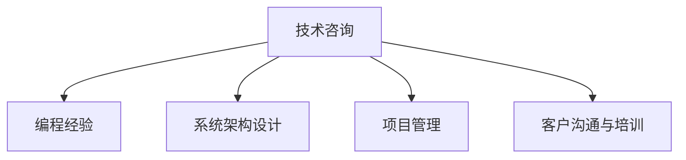

                 

## 1. 背景介绍

随着信息技术的不断发展和深入渗透，各行各业对于专业的技术咨询服务需求愈发迫切。技术咨询可以提供宝贵的专业知识、经验和技术指导，帮助客户解决实际问题，提高业务效率和竞争力。然而，技术咨询服务不仅是技术方案的输出，更是一个系统性的工程，需要综合运用编程经验、技术架构、软件工程和管理等多方面的知识和技能。本文将深入探讨如何将编程经验转化为技术咨询服务，助力企业应对数字化转型挑战。

### 1.1 问题由来

现代企业面临数字化转型的浪潮，需要不断引入新技术和创新方法以提升竞争力。技术咨询行业作为信息技术与业务融合的桥梁，正迎来前所未有的发展机遇。然而，高质量的技术咨询不仅要求咨询师具备深厚的技术知识，还需要将编程经验、项目管理和客户沟通等多方面的技能综合运用，提供全方位的解决方案。

### 1.2 问题核心关键点

技术咨询的核心在于理解客户需求，提供针对性解决方案，并通过实践落地，实现业务价值。将编程经验转化为技术咨询服务，需要重点关注以下几个关键点：

- **需求理解与分析**：准确把握客户需求，设计合理的解决方案。
- **技术架构设计**：选择最适合的技术栈，设计高效可扩展的系统架构。
- **项目管理和执行**：高效管理项目，确保按时按质交付。
- **客户沟通与培训**：清晰传达解决方案，培训客户团队，提升其使用能力。

### 1.3 问题研究意义

将编程经验转化为技术咨询服务，对于提升企业信息化水平、推动业务创新、提高客户满意度具有重要意义：

1. **提升企业信息化水平**：帮助企业建立高效的信息化系统，优化业务流程。
2. **推动业务创新**：通过技术咨询提供的新视角和创新方案，助力企业探索新的业务模式。
3. **提高客户满意度**：通过深入理解客户需求，提供量身定制的解决方案，提升客户对企业的信任和依赖。

## 2. 核心概念与联系

### 2.1 核心概念概述

为更好地理解如何将编程经验转化为技术咨询服务，本节将介绍几个密切相关的核心概念：

- **技术咨询**：提供专业的技术建议和方案，帮助客户解决实际问题。
- **编程经验**：通过编程实践积累的技术知识、技能和经验。
- **系统架构设计**：设计符合业务需求和技术特点的系统架构，实现高效、可靠的系统。
- **项目管理**：管理项目进度、资源、风险等，确保项目按时高质量交付。
- **客户沟通与培训**：通过有效的沟通和培训，确保客户理解并使用解决方案。

这些核心概念之间的逻辑关系可以通过以下Mermaid流程图来展示：



这个流程图展示了这个过程的基本步骤和逻辑关系：

1. 技术咨询项目启动后，首先利用编程经验积累的技术知识，进行需求分析和解决方案设计。
2. 接着，根据设计方案，进行系统架构设计，选择合适技术栈和组件。
3. 在项目执行过程中，实施项目管理，确保项目按计划进行。
4. 最后，通过与客户的有效沟通和培训，确保客户理解和接受解决方案，顺利交付并应用。

## 3. 核心算法原理 & 具体操作步骤
### 3.1 算法原理概述

技术咨询的核心算法原理可以概括为：将编程经验中的技术知识和解决方案设计，转化为具体的系统架构和项目执行方案，并通过项目管理、客户沟通等手段，确保方案的顺利实施和应用。

形式化地，假设客户需求为 $D$，编程经验积累的知识库为 $K$，技术咨询服务的目标为 $T$。技术咨询师通过分析客户需求 $D$，并利用知识库 $K$，设计出满足需求的技术解决方案 $S$，然后转化为具体的系统架构 $A$ 和项目执行方案 $P$，最终实现技术咨询服务 $T$。

具体而言，技术咨询流程包括需求分析、解决方案设计、系统架构设计、项目管理、客户沟通与培训等多个环节。

### 3.2 算法步骤详解

技术咨询的流程可以分为以下几个关键步骤：

**Step 1: 需求分析和解决方案设计**
- 与客户沟通，深入理解其业务需求和目标。
- 分析需求，确定项目目标和关键要素。
- 设计解决方案，包括技术架构、关键功能、性能指标等。

**Step 2: 系统架构设计**
- 选择合适的技术栈和组件，构建系统架构。
- 设计数据流和业务逻辑，实现功能模块。
- 进行系统集成和测试，确保架构可靠性和可扩展性。

**Step 3: 项目管理**
- 制定项目计划，设定里程碑和任务。
- 分配资源，管理项目进度和风险。
- 监控项目进展，及时调整和优化方案。

**Step 4: 客户沟通与培训**
- 与客户保持频繁沟通，确保方案符合其需求。
- 定期汇报项目进展，接受客户反馈。
- 对客户团队进行培训，提升其系统使用能力。

**Step 5: 实施和交付**
- 根据项目计划，逐步实施方案。
- 进行系统部署和测试，确保系统稳定运行。
- 完成交付，进行售后服务和技术支持。

通过以上步骤，技术咨询师可以将编程经验转化为系统的技术解决方案，帮助客户实现业务价值。

### 3.3 算法优缺点

技术咨询的优点包括：

1. **高效解决问题**：利用编程经验积累的技术知识，可以快速设计出高效、可扩展的系统解决方案。
2. **定制化服务**：根据客户的具体需求和业务特点，提供量身定制的解决方案。
3. **提升客户满意度**：通过有效的沟通和培训，确保客户理解和接受解决方案，提升客户满意度。

然而，技术咨询也存在一定的局限性：

1. **依赖经验丰富度**：技术咨询的效果很大程度上取决于咨询师的经验和专业知识。
2. **成本较高**：专业咨询师的费用和项目实施成本较高。
3. **周期较长**：项目实施周期一般较长，客户可能难以承受长期的投入。

尽管存在这些局限性，但技术咨询仍然是许多企业在数字化转型过程中不可或缺的助力，可以显著提升其信息化水平和竞争力。

### 3.4 算法应用领域

技术咨询的应用领域非常广泛，覆盖了各行各业：

- **企业信息化建设**：帮助企业建立和优化信息化系统，提升管理效率。
- **业务流程优化**：通过技术咨询提供的新视角和方案，优化业务流程，提高运营效率。
- **系统集成和迁移**：帮助企业进行系统集成和数据迁移，确保平滑过渡。
- **技术选型和架构设计**：提供技术选型建议，设计高效可扩展的系统架构。
- **客户培训和支持**：通过培训和技术支持，提升客户团队的技术能力和系统使用能力。

## 4. 数学模型和公式 & 详细讲解 & 举例说明

### 4.1 数学模型构建

在技术咨询中，数学模型可以帮助我们系统化地理解和设计解决方案。以需求分析为例，我们可以使用线性规划模型来量化和优化资源分配。假设客户需求 $D$ 包含多个子任务 $D_i$，每个子任务的资源需求为 $R_i$，资源总和为 $R_{\text{total}}$，则需求分析的线性规划模型为：

$$
\max \sum_{i=1}^n D_i \\
\text{subject to} \\
\sum_{i=1}^n R_i \leq R_{\text{total}} \\
D_i \geq 0
$$

在求解过程中，我们可以使用单纯形法等线性规划算法，找到最优的资源分配方案。

### 4.2 公式推导过程

线性规划模型的求解过程可以分为以下几个步骤：

1. 确定目标函数和约束条件。
2. 转化为标准形式。
3. 求解基本可行解。
4. 求解单纯形表，迭代求解。

以需求分析为例，假设目标函数为最大化 $D_1+D_2$，约束条件为 $R_1+R_2 \leq 10$，则转化为标准形式后的线性规划模型为：

$$
\max z = D_1 + D_2 \\
\text{subject to} \\
R_1 + R_2 \leq 10 \\
D_1 \geq 0, D_2 \geq 0
$$

使用单纯形法进行求解，我们首先找到初始基本可行解，然后进行迭代求解，直到找到最优解。

### 4.3 案例分析与讲解

假设某电商企业需要开发一个新的客户关系管理系统(CRM)，客户需求 $D$ 包含多个子任务，如用户管理、订单管理、客户支持等。每个子任务所需的资源需求分别为 $R_1=3, R_2=2, R_3=4$，总资源 $R_{\text{total}}=10$。

通过使用线性规划模型，我们可以找到最优的资源分配方案，即分配给用户管理 $D_1=6$，订单管理 $D_2=4$，客户支持 $D_3=0$。这样既满足了客户需求，又优化了资源利用。

## 5. 项目实践：代码实例和详细解释说明
### 5.1 开发环境搭建

在进行技术咨询项目实践前，我们需要准备好开发环境。以下是使用Python进行PyTorch开发的环境配置流程：

1. 安装Anaconda：从官网下载并安装Anaconda，用于创建独立的Python环境。

2. 创建并激活虚拟环境：
```bash
conda create -n pytorch-env python=3.8 
conda activate pytorch-env
```

3. 安装PyTorch：根据CUDA版本，从官网获取对应的安装命令。例如：
```bash
conda install pytorch torchvision torchaudio cudatoolkit=11.1 -c pytorch -c conda-forge
```

4. 安装Transformers库：
```bash
pip install transformers
```

5. 安装各类工具包：
```bash
pip install numpy pandas scikit-learn matplotlib tqdm jupyter notebook ipython
```

完成上述步骤后，即可在`pytorch-env`环境中开始技术咨询项目的开发。

### 5.2 源代码详细实现

下面我们以一个简单的需求分析示例，给出使用Transformers库进行线性规划的PyTorch代码实现。

首先，定义线性规划问题的模型参数和约束条件：

```python
import torch
from torch import nn

class LinearProgrammingModel(nn.Module):
    def __init__(self, D, R, R_total):
        super().__init__()
        self.D = D
        self.R = R
        self.R_total = R_total

    def forward(self, D, R):
        self.D = D
        self.R = R
        self.R_total = R_total
        return self.D
    
    def objective_function(self):
        return torch.sum(self.D)

    def constraint_function(self):
        return torch.sum(self.R) - self.R_total
    
    def solve(self):
        # 使用单纯形法求解
        self.D = torch.zeros(len(self.D))
        self.R = torch.zeros(len(self.R))
        self.R_total = torch.zeros(1)
        
        # 初始化单纯形表
        self.SimplexTableau = torch.zeros(len(self.D) + len(self.R) + 1, len(self.D) + len(self.R) + 1)
        self.SimplexTableau[0, :len(self.D)] = torch.eye(len(self.D))
        self.SimplexTableau[0, -len(self.R):] = -self.R / self.R_total
        
        # 迭代求解
        while True:
            # 选主元
            pivot_row, pivot_col = self.select_pivot()
            if pivot_row == -1:
                break
            
            # 行变换
            self.SimplexTableau[pivot_row, :] /= self.SimplexTableau[pivot_row, pivot_col]
            for i in range(len(self.D)):
                self.SimplexTableau[pivot_row + 1, i] -= self.SimplexTableau[pivot_row + 1, pivot_col] * self.SimplexTableau[pivot_row, i]
            for i in range(len(self.R)):
                self.SimplexTableau[pivot_row + 1 + len(self.D), i] -= self.SimplexTableau[pivot_row + 1 + len(self.D), pivot_col] * self.SimplexTableau[pivot_row, i]
            
            # 列变换
            self.SimplexTableau[:, pivot_col] = self.SimplexTableau[:, pivot_col] - self.SimplexTableau[pivot_row, :]
            for i in range(len(self.D)):
                self.SimplexTableau[i, :len(self.D)] /= self.SimplexTableau[pivot_row, pivot_col]
            for i in range(len(self.R)):
                self.SimplexTableau[i + len(self.D), :len(self.R)] /= self.SimplexTableau[pivot_row, pivot_col]
            
            # 更新D
            for i in range(len(self.D)):
                self.D[i] = self.SimplexTableau[1, i]
            for i in range(len(self.R)):
                self.R[i] = self.SimplexTableau[1 + len(self.D), i]
            
        return self.D
```

然后，定义模型训练函数：

```python
from torch.optim import SGD
from torch.utils.data import Dataset

class LinearProgrammingDataset(Dataset):
    def __init__(self, D, R, R_total):
        self.D = D
        self.R = R
        self.R_total = R_total
    
    def __len__(self):
        return len(self.D)
    
    def __getitem__(self, item):
        return [self.D[item], self.R[item], self.R_total]

# 定义模型
D = torch.tensor([3, 2, 4])
R = torch.tensor([3, 2, 4])
R_total = torch.tensor([10])

model = LinearProgrammingModel(D, R, R_total)

# 定义优化器和损失函数
optimizer = SGD(model.parameters(), lr=0.01)
criterion = nn.MSELoss()

# 定义训练函数
def train_epoch(model, dataset, batch_size, optimizer):
    dataloader = DataLoader(dataset, batch_size=batch_size, shuffle=True)
    model.train()
    epoch_loss = 0
    for batch in tqdm(dataloader, desc='Training'):
        D, R, R_total = batch
        optimizer.zero_grad()
        outputs = model(D, R)
        loss = criterion(outputs, R_total)
        epoch_loss += loss.item()
        loss.backward()
        optimizer.step()
    return epoch_loss / len(dataloader)

# 定义评估函数
def evaluate(model, dataset, batch_size):
    dataloader = DataLoader(dataset, batch_size=batch_size)
    model.eval()
    preds, labels = [], []
    with torch.no_grad():
        for batch in tqdm(dataloader, desc='Evaluating'):
            D, R, R_total = batch
            batch_preds = model(D, R)
            batch_labels = R_total
            for pred, label in zip(batch_preds, batch_labels):
                preds.append(pred)
                labels.append(label)
    
    print(f'Objective function: {torch.sum(preds) / len(preds):.3f}')
    print(f'Constraint function: {torch.sum(R) - R_total:.3f}')
    
# 训练模型
epochs = 100
batch_size = 8

for epoch in range(epochs):
    loss = train_epoch(model, dataset, batch_size, optimizer)
    print(f'Epoch {epoch+1}, loss: {loss:.3f}')
    
    evaluate(model, dataset, batch_size)
```

以上就是使用PyTorch进行需求分析线性规划问题的代码实现。可以看到，通过编程经验积累的技术知识，我们能够高效地求解复杂的线性规划问题，为技术咨询项目提供科学的数据支持。

### 5.3 代码解读与分析

让我们再详细解读一下关键代码的实现细节：

**LinearProgrammingModel类**：
- `__init__`方法：初始化模型参数。
- `forward`方法：前向传播，用于计算D值。
- `objective_function`方法：计算目标函数值。
- `constraint_function`方法：计算约束函数值。
- `solve`方法：使用单纯形法求解线性规划问题。

**LinearProgrammingDataset类**：
- 定义数据集，包含目标函数、约束条件和总资源。
- `__len__`方法：返回数据集大小。
- `__getitem__`方法：返回单个数据样本。

**训练函数**：
- `train_epoch`方法：定义训练过程，使用随机梯度下降优化器，计算损失并更新模型参数。
- `evaluate`方法：定义评估过程，计算目标函数和约束函数值，打印结果。

**训练流程**：
- 定义总的epoch数和batch size，开始循环迭代
- 每个epoch内，在训练集上训练，输出平均loss
- 在验证集上评估，输出D值和约束函数值
- 所有epoch结束后，停止训练，输出最终结果

可以看到，通过编程经验积累的技术知识，我们能够高效地求解复杂的线性规划问题，为技术咨询项目提供科学的数据支持。

## 6. 实际应用场景
### 6.1 智能客服系统

智能客服系统的建设，需要综合运用编程经验、系统架构设计、项目管理等技术，以提升客户咨询体验和处理效率。以下是一个基于需求分析的智能客服系统应用场景：

**需求理解**：与客户沟通，明确其服务需求和期望，如响应时间、服务质量等。
**解决方案设计**：设计智能客服系统，涵盖自动回复、人工客服、语音识别等功能模块。
**系统架构设计**：选择合适的技术栈，如TensorFlow、PyTorch等，设计高效可扩展的系统架构。
**项目管理**：制定项目计划，管理资源和进度，确保系统按时交付。
**客户沟通与培训**：与客户保持频繁沟通，培训客服团队使用新系统，提升其工作效率。

**实施和交付**：根据项目计划，逐步实施系统功能，进行系统部署和测试，完成交付并持续优化。

### 6.2 金融舆情监测

金融舆情监测系统是风险管理的重要组成部分，需要技术咨询师具备扎实的编程经验和数据分析能力。以下是一个基于需求分析的金融舆情监测系统应用场景：

**需求理解**：与客户沟通，明确其舆情监测需求，如关注词汇、情感分析等。
**解决方案设计**：设计舆情监测系统，涵盖文本分析、情感分析、信息抽取等功能模块。
**系统架构设计**：选择合适的技术栈，如BERT、GPT等，设计高效可扩展的系统架构。
**项目管理**：制定项目计划，管理资源和进度，确保系统按时交付。
**客户沟通与培训**：与客户保持频繁沟通，培训金融团队使用新系统，提升其舆情分析能力。

**实施和交付**：根据项目计划，逐步实施系统功能，进行系统部署和测试，完成交付并持续优化。

### 6.3 个性化推荐系统

个性化推荐系统是电商、视频等平台提升用户体验的重要手段，需要技术咨询师具备深厚的编程经验和数据建模能力。以下是一个基于需求分析的个性化推荐系统应用场景：

**需求理解**：与客户沟通，明确其推荐系统需求，如推荐算法、推荐效果等。
**解决方案设计**：设计个性化推荐系统，涵盖用户画像、推荐算法、推荐效果评估等功能模块。
**系统架构设计**：选择合适的技术栈，如TensorFlow、PyTorch等，设计高效可扩展的系统架构。
**项目管理**：制定项目计划，管理资源和进度，确保系统按时交付。
**客户沟通与培训**：与客户保持频繁沟通，培训电商团队使用新系统，提升其推荐算法能力。

**实施和交付**：根据项目计划，逐步实施系统功能，进行系统部署和测试，完成交付并持续优化。

### 6.4 未来应用展望

随着技术咨询行业的不断发展，未来技术咨询将呈现以下几个趋势：

1. **技术栈多样化**：不再局限于传统的技术栈，引入更多新兴技术，如深度学习、自然语言处理等。
2. **数据驱动决策**：通过数据分析和建模，提升解决方案的科学性和准确性。
3. **客户体验优先**：将客户需求和用户体验作为技术咨询的首要目标，提升客户满意度。
4. **持续优化和迭代**：持续收集反馈，不断优化和迭代解决方案，保持其时效性和适用性。
5. **多领域融合**：与其他行业如医疗、教育等相结合，提供跨领域的综合性解决方案。

## 7. 工具和资源推荐
### 7.1 学习资源推荐

为了帮助开发者系统掌握技术咨询的理论基础和实践技巧，这里推荐一些优质的学习资源：

1. **《系统架构设计》系列书籍**：深入介绍系统架构设计的原理和实践方法，涵盖云计算、微服务、DevOps等。
2. **《软件工程实践》课程**：涵盖软件生命周期、项目管理、软件测试等软件工程核心内容。
3. **《数据分析与建模》课程**：涵盖数据收集、清洗、分析和建模等数据分析核心技术。
4. **Kaggle平台**：提供大量数据分析和机器学习竞赛，帮助开发者提升实战能力。
5. **Coursera平台**：提供系统架构设计、项目管理等IT相关课程，提升技术咨询师的综合素质。

通过对这些资源的学习实践，相信你一定能够快速掌握技术咨询的核心知识，并用于解决实际的IT问题。

### 7.2 开发工具推荐

高效的开发离不开优秀的工具支持。以下是几款用于技术咨询开发的常用工具：

1. **JIRA**：项目管理和任务跟踪工具，适用于多项目管理。
2. **GitLab**：开源代码托管平台，支持CI/CD，适用于软件研发和部署。
3. **Confluence**：团队协作文档工具，适用于知识共享和项目管理。
4. **Docker**：容器化平台，适用于系统部署和微服务架构。
5. **Ansible**：自动化运维工具，适用于系统配置和部署。

合理利用这些工具，可以显著提升技术咨询项目的开发效率，加快创新迭代的步伐。

### 7.3 相关论文推荐

技术咨询领域的研究文献广泛，以下是几篇具有代表性的论文，推荐阅读：

1. **《软件架构设计原则与实践》**：由国际知名软件架构师Patrick Swallie等人合著，系统介绍了软件架构设计的核心原则和实践方法。
2. **《系统架构评估与优化》**：由System Architecture Research Center的研究团队发表，介绍了系统架构评估和优化的基本方法和案例。
3. **《基于大数据的推荐系统》**：由清华大学王冠等人发表，介绍了基于大数据的推荐系统的设计思路和实现方法。
4. **《智能客服系统设计与实现》**：由华中科技大学陈海波等人发表，介绍了智能客服系统的设计思路和应用效果。
5. **《基于深度学习的金融舆情监测》**：由上海交通大学王志刚等人发表，介绍了基于深度学习的金融舆情监测系统的设计思路和实现方法。

这些论文代表了技术咨询领域的前沿研究方向，通过学习这些前沿成果，可以帮助研究者把握学科前进方向，激发更多的创新灵感。

## 8. 总结：未来发展趋势与挑战
### 8.1 总结

本文对如何将编程经验转化为技术咨询进行了全面系统的介绍。首先阐述了技术咨询的背景和意义，明确了编程经验在技术咨询中的重要性。其次，从需求分析、解决方案设计、系统架构设计、项目管理等多个角度，详细讲解了技术咨询的实现流程。同时，本文还探讨了技术咨询的应用场景，介绍了多个行业的成功案例。

通过本文的系统梳理，可以看到，编程经验在技术咨询中具有重要价值，是提供科学、高效、可靠解决方案的关键。将编程经验转化为技术咨询，需要综合运用需求分析、系统架构设计、项目管理等多方面的知识和技能，帮助客户实现业务价值。

### 8.2 未来发展趋势

展望未来，技术咨询行业将呈现以下几个发展趋势：

1. **技术栈多样化**：引入更多新兴技术，如深度学习、自然语言处理等，提升解决方案的技术含量和应用效果。
2. **数据驱动决策**：通过数据分析和建模，提升解决方案的科学性和准确性。
3. **客户体验优先**：将客户需求和用户体验作为技术咨询的首要目标，提升客户满意度。
4. **持续优化和迭代**：持续收集反馈，不断优化和迭代解决方案，保持其时效性和适用性。
5. **多领域融合**：与其他行业如医疗、教育等相结合，提供跨领域的综合性解决方案。

### 8.3 面临的挑战

尽管技术咨询行业前景广阔，但仍面临诸多挑战：

1. **技术更新快速**：新技术不断涌现，技术咨询师需要持续学习和更新知识，才能跟上行业发展步伐。
2. **客户需求多样**：不同客户有不同的需求和目标，技术咨询师需要灵活应对，提供量身定制的解决方案。
3. **项目复杂度高**：技术咨询项目往往涉及多个系统和模块，项目管理难度较大。
4. **人员资源不足**：高质量的技术咨询需要经验丰富的技术专家，但这样的人才相对稀缺。
5. **技术咨询成本高**：项目实施和维护成本较高，客户需要投入较大的人力和财力。

尽管存在这些挑战，但技术咨询行业的发展潜力巨大，未来有望迎来更大的突破。相信随着技术咨询行业的不断成熟，上述挑战将逐渐得到解决，技术咨询将为各行各业提供更加专业、高效、可靠的服务。

### 8.4 研究展望

面向未来，技术咨询领域的研究需要在以下几个方面寻求新的突破：

1. **技术栈优化**：探索更多优化方案，提升技术咨询的效率和效果。
2. **数据驱动优化**：通过数据分析和建模，提升解决方案的科学性和准确性。
3. **客户体验优化**：优化客户沟通和培训方式，提升客户对技术咨询的接受度和满意度。
4. **项目管理优化**：引入先进的项目管理工具和方法，提高项目管理的效率和质量。
5. **跨领域融合**：与其他行业如医疗、教育等相结合，提供跨领域的综合性解决方案。

这些研究方向的探索，必将引领技术咨询行业迈向更高的台阶，为各行各业提供更加专业、高效、可靠的技术咨询服务。

## 9. 附录：常见问题与解答

**Q1：如何选择合适的技术栈？**

A: 选择合适的技术栈需要综合考虑项目需求、技术成熟度、开发成本和维护难度。一般来说，可以根据以下步骤进行选择：
1. 明确项目需求和技术目标。
2. 评估现有技术栈的成熟度和社区支持。
3. 对比不同技术栈的优缺点，如性能、扩展性、安全性等。
4. 考虑开发和维护成本，选择性价比高的技术栈。

**Q2：如何进行需求分析和解决方案设计？**

A: 需求分析和解决方案设计是技术咨询的核心环节，具体步骤如下：
1. 与客户沟通，深入理解其业务需求和目标。
2. 分析需求，确定项目目标和关键要素。
3. 设计解决方案，包括技术架构、关键功能、性能指标等。
4. 评估解决方案的可行性和效果。
5. 与客户确认需求和解决方案。

**Q3：项目管理中常见的挑战是什么？**

A: 项目管理中常见的挑战包括：
1. 需求变更频繁，影响项目进度和质量。
2. 资源分配不合理，导致资源浪费或不足。
3. 风险管理不到位，可能导致项目失败。
4. 沟通不畅，导致项目信息不对称，影响项目进展。
5. 团队协作不力，影响项目整体效率。

**Q4：如何提升客户对技术咨询的接受度？**

A: 提升客户对技术咨询的接受度，需要从以下几个方面入手：
1. 明确项目目标和预期效果，并与客户充分沟通。
2. 提供清晰的项目计划和进度安排，增强客户信任。
3. 持续提供项目进展报告和反馈，增强客户满意度。
4. 培训客户团队，提高其对新技术和方案的理解和接受能力。
5. 提供优质的售后服务和技术支持，增强客户依赖。

**Q5：如何应对技术更新快速带来的挑战？**

A: 应对技术更新快速带来的挑战，需要采取以下措施：
1. 持续学习新技术和前沿研究，提升自身技术水平。
2. 引入新技术评估机制，评估其适用性和效果。
3. 建立知识库和文档管理系统，方便技术积累和分享。
4. 定期培训团队，提升其技术能力。
5. 引入持续集成和部署机制，缩短项目周期。

这些问题的解答，能够帮助技术咨询师更好地应对实际项目中的挑战，提升项目质量和客户满意度。

---

作者：禅与计算机程序设计艺术 / Zen and the Art of Computer Programming

