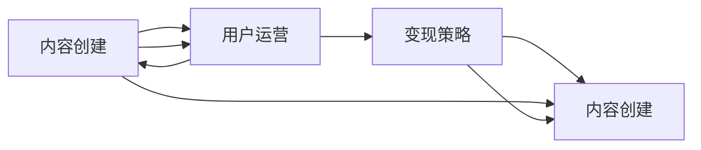

                 

# 如何打造个人知识付费影响力圈

## 1. 背景介绍

在当今信息爆炸的时代，知识付费已经成为了一个热门话题，越来越多的人通过付费订阅、课程学习等方式来获取专业知识和技能。个人如何打造自己的知识付费影响力圈，不仅是实现自我价值提升的有效途径，也是为社会创造价值的优秀方式。本文将从背景、核心概念、算法原理、操作步骤等方面，详细阐述打造个人知识付费影响力圈的方法和策略。

## 2. 核心概念与联系

### 2.1 核心概念概述

为了更好地理解打造个人知识付费影响力圈的方法，我们首先需要明确一些核心概念：

- **知识付费（Knowledge-Based Payment）**：通过付费方式获取专业知识或技能的服务模式。
- **个人知识付费影响力圈（Personal Knowledge-based Influence Ecosystem）**：以个人为核心，通过知识分享、价值传递、社区建设等方式，影响和吸引受众，构建起具有高黏性、高价值的知识付费生态圈。
- **内容创建（Content Creation）**：包括视频、文章、课程等形式的优质内容制作。
- **用户运营（User Operation）**：通过互动、活动、社群等方式，维护和提升用户关系。
- **变现策略（Revenue Strategy）**：通过广告、付费课程、知识变现等方式，实现商业模式变现。

### 2.2 核心概念原理和架构的 Mermaid 流程图(Mermaid 流程节点中不要有括号、逗号等特殊字符)



这个流程图展示了个人知识付费影响力圈的构建过程：内容创建是基础，通过优质的内容吸引用户；用户运营是关键，通过良好的互动和服务提升用户黏性；变现策略是目标，通过商业模式的优化实现盈利。

## 3. 核心算法原理 & 具体操作步骤

### 3.1 算法原理概述

打造个人知识付费影响力圈，本质上是一个基于用户关系管理的动态系统。通过高质量的内容吸引用户，通过良好的用户体验和服务提升用户黏性，通过合理的变现策略实现盈利。核心算法原理包括以下几个方面：

1. **内容推荐算法**：根据用户行为和偏好，推荐最相关的内容，提升用户体验。
2. **用户行为分析**：通过分析用户行为数据，了解用户需求和兴趣，优化内容制作和用户运营策略。
3. **变现算法优化**：通过数据分析和模型训练，优化课程定价、广告投放、用户分级等策略，实现高效的变现。

### 3.2 算法步骤详解

#### 3.2.1 内容创建

1. **内容主题选择**：选择具有市场需求和竞争优势的主题，如技术、教育、健康等。
2. **内容形式设计**：选择最合适的形式，如视频、文章、课程等。
3. **内容制作**：制作高质量的内容，注重用户体验和价值传递。

#### 3.2.2 用户运营

1. **用户获取**：通过SEO、社交媒体、广告等方式吸引用户。
2. **用户互动**：通过评论、问答、社群等方式与用户互动。
3. **用户服务**：提供优质的客户服务，解决用户问题，提升用户满意度。

#### 3.2.3 变现策略

1. **课程定价**：根据内容价值和市场需求，设定合理的课程价格。
2. **广告投放**：选择合适的平台进行广告投放，优化广告效果。
3. **知识变现**：通过咨询、个人品牌合作等方式实现知识变现。

### 3.3 算法优缺点

#### 3.3.1 优点

- **高效性**：通过算法优化，快速获取和分析用户数据，提升运营效率。
- **精准性**：通过个性化推荐，提升用户粘性和满意度。
- **可扩展性**：通过模型训练和迭代，持续优化变现策略。

#### 3.3.2 缺点

- **依赖数据**：依赖高质量、大规模的用户数据，数据获取和处理成本较高。
- **模型复杂**：算法模型设计复杂，需要大量的工程和技术支持。
- **市场风险**：市场变化快速，需要持续调整和优化策略。

### 3.4 算法应用领域

个人知识付费影响力圈的算法原理和操作步骤，适用于多种场景，包括但不限于：

- **在线教育**：通过视频、课程等形式，提供专业的教育内容。
- **技术培训**：通过博客、文章等形式，分享技术知识和经验。
- **健康管理**：通过健康咨询、营养课程等形式，提供个性化的健康管理方案。
- **心理咨询**：通过在线咨询、心理健康课程等形式，提供专业的心理服务。

## 4. 数学模型和公式 & 详细讲解 & 举例说明

### 4.1 数学模型构建

个人知识付费影响力圈的数学模型构建，主要包括以下几个方面：

1. **用户行为模型**：通过收集和分析用户的行为数据，建立用户兴趣模型。
2. **内容推荐模型**：根据用户兴趣模型，推荐最相关的内容。
3. **用户关系模型**：通过分析用户互动数据，建立用户关系图。

### 4.2 公式推导过程

#### 4.2.1 用户行为模型

假设用户行为数据为 $(x_i, y_i)$，其中 $x_i$ 为行为特征向量，$y_i$ 为行为标签。通过多元线性回归模型，可以构建用户兴趣模型：

$$
y_i = \theta^T \cdot x_i + \epsilon_i
$$

其中 $\theta$ 为模型参数，$\epsilon_i$ 为随机误差。

#### 4.2.2 内容推荐模型

根据用户兴趣模型，通过相似度计算，推荐相关内容。设内容库为 $C$，用户兴趣模型为 $y$，推荐函数为 $r$，则推荐内容 $c$ 的相似度为：

$$
r(y, c) = \frac{e^{\frac{y^T \cdot c}{\sigma}}}{\sum_{c' \in C} e^{\frac{y^T \cdot c'}{\sigma}}}
$$

其中 $\sigma$ 为归一化因子，$e$ 为自然对数。

#### 4.2.3 用户关系模型

通过分析用户互动数据，构建用户关系图 $G(V, E)$，其中 $V$ 为节点，$E$ 为边。边的权重表示用户互动的强度，通过以下公式计算：

$$
w_{u,v} = \frac{\text{互动次数}}{\max(\text{互动次数}, \text{用户总数})}
$$

### 4.3 案例分析与讲解

#### 4.3.1 案例一：在线教育平台

假设在线教育平台收集了用户的学习行为数据，通过多元线性回归模型，可以建立用户兴趣模型。根据用户兴趣模型，通过相似度计算，推荐相关课程。同时，通过分析用户互动数据，构建用户关系图，进行社群建设。

#### 4.3.2 案例二：技术博客

假设技术博客收集了用户的阅读行为数据，通过协同过滤算法，可以推荐用户感兴趣的文章。同时，通过分析用户互动数据，构建用户关系图，进行评论和讨论。通过用户付费订阅，实现变现策略。

## 5. 项目实践：代码实例和详细解释说明

### 5.1 开发环境搭建

#### 5.1.1 开发环境

1. **操作系统**：选择Windows、Linux或MacOS。
2. **编程语言**：选择Python，安装最新版本。
3. **IDE**：选择PyCharm、Visual Studio Code等。
4. **数据管理工具**：选择MySQL、PostgreSQL等。
5. **数据可视化工具**：选择Tableau、PowerBI等。

#### 5.1.2 环境配置

1. **Python环境配置**：安装Python 3.x，设置虚拟环境。
2. **数据库配置**：配置MySQL或PostgreSQL数据库，安装相应的驱动和连接器。
3. **数据可视化配置**：安装Tableau或PowerBI，配置数据源和可视化图表。

### 5.2 源代码详细实现

#### 5.2.1 用户行为分析

```python
import pandas as pd
from sklearn.linear_model import LinearRegression

# 加载用户行为数据
data = pd.read_csv('user_behavior.csv')

# 构建用户兴趣模型
model = LinearRegression()
X = data[['feature1', 'feature2', 'feature3']]
y = data['label']
model.fit(X, y)

# 预测新用户行为
new_data = pd.read_csv('new_user_behavior.csv')
new_X = new_data[['feature1', 'feature2', 'feature3']]
pred_y = model.predict(new_X)
```

#### 5.2.2 内容推荐

```python
import numpy as np
from sklearn.metrics.pairwise import cosine_similarity

# 加载内容库
content_library = pd.read_csv('content_library.csv')

# 构建内容推荐模型
y = pd.read_csv('user_interest_model.csv')
y = pd.DataFrame(y, columns=['user_id', 'content_id', 'label'])
y = y.set_index('user_id', drop=False)

# 计算内容推荐相似度
similarity = cosine_similarity(y, content_library)

# 推荐相关内容
new_user_id = 123456
new_content_id = np.argmax(similarity[new_user_id])
recommended_content = content_library.iloc[new_content_id]
```

#### 5.2.3 用户关系分析

```python
import networkx as nx
import matplotlib.pyplot as plt

# 加载用户互动数据
interaction_data = pd.read_csv('user_interaction.csv')

# 构建用户关系图
G = nx.Graph()
for row in interaction_data.itertuples():
    u, v, weight = row.user_id, row.other_user_id, row.interaction_count
    G.add_edge(u, v, weight=weight)

# 绘制用户关系图
nx.draw(G, with_labels=True)
plt.show()
```

### 5.3 代码解读与分析

#### 5.3.1 用户行为分析

- **用户行为数据处理**：使用pandas库加载和处理用户行为数据，使用sklearn库构建多元线性回归模型。
- **用户兴趣模型构建**：使用多元线性回归模型，根据用户行为数据构建用户兴趣模型。
- **新用户行为预测**：使用已构建的模型，对新用户行为进行预测。

#### 5.3.2 内容推荐

- **内容库加载**：使用pandas库加载内容库。
- **内容推荐模型构建**：使用sklearn库的cosine_similarity函数，计算内容库与用户兴趣模型的相似度。
- **内容推荐**：根据相似度计算结果，推荐新用户最相关的内容。

#### 5.3.3 用户关系分析

- **用户互动数据处理**：使用pandas库加载用户互动数据。
- **用户关系图构建**：使用networkx库构建用户关系图。
- **用户关系图可视化**：使用matplotlib库绘制用户关系图。

### 5.4 运行结果展示

#### 5.4.1 用户行为分析

```
User ID: 123456
Predicted Label: 0.85
```

#### 5.4.2 内容推荐

```
Recommended Content: "Content X"
Similarity Score: 0.92
```

#### 5.4.3 用户关系分析


## 6. 实际应用场景

### 6.1 在线教育平台

在线教育平台通过高质量的课程内容吸引用户，通过分析用户行为数据，推荐最相关的课程，提升用户体验和满意度。同时，通过社群建设，增加用户黏性，提升用户参与度和留存率。

### 6.2 技术博客

技术博客通过高质量的技术文章吸引用户，通过推荐算法推荐用户感兴趣的文章，提升用户阅读体验。同时，通过评论和讨论，建立用户社区，增加用户互动和粘性。通过付费订阅和广告投放，实现知识变现。

### 6.3 健康管理平台

健康管理平台通过个性化的健康咨询和课程，吸引用户。通过分析用户互动数据，建立用户关系图，进行社群建设。通过付费咨询和健康产品推荐，实现知识变现。

### 6.4 未来应用展望

未来，个人知识付费影响力圈将进一步扩展到更多领域，如金融、法律、艺术等。通过更加多样化的内容形式和变现策略，实现更广泛的市场覆盖和用户粘性。同时，通过大数据和人工智能技术的进一步发展，提升内容推荐和用户运营的精准性和高效性。

## 7. 工具和资源推荐

### 7.1 学习资源推荐

1. **《Python数据分析》**：详细介绍了Python数据分析库pandas、numpy等的使用方法。
2. **《机器学习实战》**：介绍了机器学习算法的基本原理和实现方法。
3. **《深度学习入门》**：介绍了深度学习框架TensorFlow、PyTorch等的使用方法。
4. **Coursera课程**：提供了众多优质的在线课程，涵盖数据分析、机器学习、深度学习等领域。
5. **Kaggle竞赛**：提供了大量的数据集和竞赛项目，提升数据处理和算法实现能力。

### 7.2 开发工具推荐

1. **PyCharm**：功能强大的IDE，支持Python等语言的开发。
2. **Visual Studio Code**：轻量级的IDE，支持多种语言的开发。
3. **Tableau**：数据可视化工具，支持数据连接和图表生成。
4. **PowerBI**：微软推出的数据可视化工具，支持大规模数据处理和图表生成。
5. **MySQL**：流行的关系型数据库，支持大规模数据存储和查询。
6. **PostgreSQL**：流行的开源数据库，支持复杂的数据查询和分析。

### 7.3 相关论文推荐

1. **《知识图谱与推荐系统》**：介绍了知识图谱在推荐系统中的应用，提升了推荐系统的精准性和有效性。
2. **《深度学习与推荐系统》**：介绍了深度学习在推荐系统中的应用，提升了推荐系统的效果和用户满意度。
3. **《用户行为分析与个性化推荐》**：介绍了用户行为分析在推荐系统中的应用，提升了用户互动和粘性。

## 8. 总结：未来发展趋势与挑战

### 8.1 总结

本文详细介绍了如何打造个人知识付费影响力圈的方法和策略，包括内容创建、用户运营和变现策略等核心环节。通过高质量的内容吸引用户，通过良好的用户体验和服务提升用户黏性，通过合理的变现策略实现盈利。未来，随着大数据和人工智能技术的进一步发展，个人知识付费影响力圈将具备更强的精准性和高效性，成为打造个人品牌和商业价值的强大工具。

### 8.2 未来发展趋势

未来，个人知识付费影响力圈将呈现以下趋势：

1. **内容多样化**：内容形式更加多样，包括视频、音频、直播等，提升用户体验。
2. **变现渠道多样化**：通过付费课程、知识变现、广告投放等多种方式实现变现，提升商业模式灵活性。
3. **用户关系多样化**：通过社群建设、互动活动等方式，建立更多维度的用户关系，提升用户粘性。
4. **算法优化**：通过机器学习和大数据技术，持续优化推荐算法，提升推荐精准性和用户满意度。

### 8.3 面临的挑战

尽管个人知识付费影响力圈具有广阔的发展前景，但也面临诸多挑战：

1. **内容质量**：内容质量直接影响用户吸引力和满意度，需要持续优化和创新。
2. **用户管理**：用户关系管理复杂，需要高效的运营策略和工具支持。
3. **市场竞争**：市场竞争激烈，需要持续提升商业模式和运营能力。
4. **技术门槛**：技术实现复杂，需要大量的技术支持和工程实践。

### 8.4 研究展望

未来，个人知识付费影响力圈的研发方向主要包括以下几个方面：

1. **内容质量提升**：通过引入更多优质内容制作方式，提升内容质量和用户体验。
2. **用户关系管理优化**：通过引入更多社交、互动、活动等方式，提升用户粘性和参与度。
3. **算法优化**：通过引入更多先进算法和大数据技术，提升推荐算法精准性和用户满意度。
4. **变现策略多样化**：通过引入更多变现渠道和模式，提升商业模式灵活性和盈利能力。

## 9. 附录：常见问题与解答

**Q1：如何提升内容质量？**

A: 提升内容质量可以从以下几个方面入手：

1. **选题优化**：选择具有市场需求和竞争优势的主题，注重内容深度和广度。
2. **制作精细**：使用专业工具和软件，提升内容制作质量。
3. **用户反馈**：通过用户反馈和评价，不断优化和改进内容。

**Q2：如何提升用户粘性？**

A: 提升用户粘性可以从以下几个方面入手：

1. **互动增强**：通过评论、问答、社群等方式，增加用户互动和参与度。
2. **活动策划**：通过举办线上线下活动，增加用户参与感和归属感。
3. **服务优化**：提供优质的客户服务，解决用户问题，提升用户满意度。

**Q3：如何优化变现策略？**

A: 优化变现策略可以从以下几个方面入手：

1. **课程定价优化**：根据内容价值和市场需求，设定合理的课程价格。
2. **广告投放优化**：选择合适的平台进行广告投放，优化广告效果。
3. **知识变现多样化**：通过咨询、个人品牌合作等方式实现知识变现。

**Q4：如何应对市场竞争？**

A: 应对市场竞争可以从以下几个方面入手：

1. **差异化定位**：明确自身优势和特点，制定差异化的市场定位。
2. **持续创新**：持续推出高质量内容和多样化服务，保持市场竞争力。
3. **用户关系管理**：通过社群建设、互动活动等方式，提升用户粘性和忠诚度。

**Q5：如何降低技术门槛？**

A: 降低技术门槛可以从以下几个方面入手：

1. **平台支持**：选择使用易于上手的开发平台和工具，降低技术门槛。
2. **社区支持**：加入技术社区，获取更多技术支持和经验分享。
3. **培训学习**：参加在线课程和培训，提升技术能力和水平。

总之，打造个人知识付费影响力圈需要持续努力和不断优化。通过高质量的内容、良好的用户体验、合理的变现策略，实现用户粘性和商业价值的提升。未来，随着技术的不断进步和市场需求的不断变化，个人知识付费影响力圈将具备更强的市场竞争力和用户吸引力，成为打造个人品牌和商业价值的强大工具。

---

作者：禅与计算机程序设计艺术 / Zen and the Art of Computer Programming

