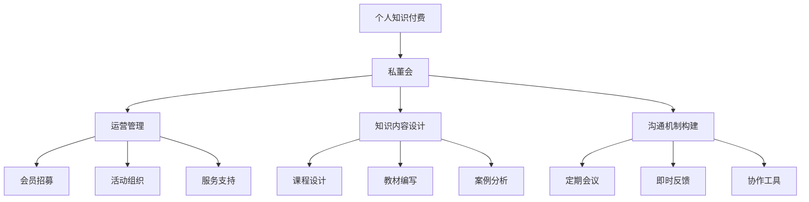

                 

## 1. 背景介绍

### 1.1 问题由来

在当前知识经济时代，个人品牌和个人知识付费变得越来越重要。但是，个人品牌如何打造？个人知识如何付费？这成为了很多职场人士和企业高管关心的问题。于是，私董会应运而生。

私董会是一种高级会员制的私密咨询小组，通常由行业专家、企业管理人员和创业者组成，每周定期聚会，通过讨论和反馈来提升个体的商业思维和决策能力。相比于公开的咨询课程，私董会更具有私密性和针对性，能够根据个体需求定制化服务。

### 1.2 问题核心关键点

要打造一个成功的个人知识付费私董会，核心关键点包括：

- **高质量的会员筛选**：需要找到具有相同背景、兴趣和需求的潜在会员，确保私董会能够高效运作。
- **专业的运营团队**：需要有一支专业的运营团队，负责会员招募、活动组织、服务支持等。
- **高质量的课程内容**：需要提供高质量的知识内容和专业指导，帮助会员提升商业思维和决策能力。
- **高效的沟通机制**：需要建立高效的沟通机制，包括定期会议、即时反馈等，确保私董会能够持续运行。
- **公平的规则制度**：需要制定公平透明的规则制度，确保私董会内部的信任和合作。

这些核心关键点缺一不可，共同构成了个人知识付费私董会的核心竞争力。

### 1.3 问题研究意义

个人知识付费私董会的成功，不仅可以提升个体商业思维和决策能力，还可以加速知识传播和应用，推动行业创新和进步。同时，个人品牌和个人知识付费的蓬勃发展，也为企业内部培训和外部合作提供了新的机会和可能性。

## 2. 核心概念与联系

### 2.1 核心概念概述

为了更好地理解个人知识付费私董会的构建方法，本节将介绍几个密切相关的核心概念：

- **个人知识付费**：指通过知识付费平台，将个人的专业知识和经验转化为付费服务，获取收入。个人知识付费涵盖广泛的领域，包括商业咨询、技术指导、教育培训等。
- **私董会**：指由行业专家和企业高管组成的私密咨询小组，通过定期聚会讨论，提升个体商业思维和决策能力。私董会具备私密性、专业性和针对性等特点。
- **运营管理**：指通过专业团队，对私董会的各项事务进行规划、组织和执行，确保私董会高效运作。运营管理涵盖会员招募、活动组织、服务支持等环节。
- **知识内容设计**：指针对会员的实际需求，设计和提供高质量的知识内容和专业指导，帮助会员提升商业思维和决策能力。知识内容设计涵盖课程设计、教材编写、案例分析等环节。
- **沟通机制构建**：指通过高效、透明的沟通机制，确保私董会内部的信任和合作，提升讨论效率和效果。沟通机制构建涵盖定期会议、即时反馈、协作工具等环节。

这些核心概念之间的逻辑关系可以通过以下Mermaid流程图来展示：



这个流程图展示了个体知识付费私董会的核心概念及其之间的关系：

1. 个人知识付费是私董会的基础。
2. 私董会通过运营管理、知识内容设计和沟通机制构建，高效运作。
3. 运营管理、知识内容设计和沟通机制构建是私董会的关键组成部分。

这些概念共同构成了个人知识付费私董会的学习和应用框架，使其能够高效地提升个体商业思维和决策能力。

## 3. 核心算法原理 & 具体操作步骤

### 3.1 算法原理概述

个人知识付费私董会的构建，本质上是一个组织管理问题，需要通过系统化的方法和流程来解决。其核心思想是：通过构建高效的运营管理系统、设计高质量的知识内容和沟通机制，最大化地发挥私董会的潜力和效能。

形式化地，假设私董会中有$N$名会员，每次聚会时间为$T$小时，知识内容数量为$M$，活动频率为$f$，则私董会的效能函数$E$可以定义为：

$$
E = f \times M \times T \times N^2
$$

其中，$f$表示私董会的活动频率，$M$表示知识内容数量，$T$表示每次聚会时间，$N$表示会员数量。私董会的效能函数最大化，即为理想化的私董会构建目标。

### 3.2 算法步骤详解

个人知识付费私董会的构建一般包括以下几个关键步骤：

**Step 1: 确定私董会目标和定位**

- 明确私董会的主要目标和定位，如提升商业思维、优化决策能力等。
- 确定私董会的会员类型，如企业管理者、行业专家、创业者等。
- 制定私董会的运营策略和规则，如会员招募、活动安排、费用标准等。

**Step 2: 筛选高质量的会员**

- 通过问卷调查、社交网络、行业推荐等方式，筛选具有相同背景、兴趣和需求的潜在会员。
- 对筛选出的潜在会员进行初步评估，包括背景、经验、贡献度等。
- 邀请符合条件的潜在会员参加面试，进一步确认其适配度。

**Step 3: 组建运营团队**

- 招聘具有项目管理、组织协调、市场营销等专业背景的运营团队成员。
- 制定运营团队的职责分工，包括会员招募、活动组织、服务支持等。
- 建立高效的沟通机制，确保运营团队内部协作和信息同步。

**Step 4: 设计高质量的知识内容**

- 根据会员的实际需求，设计高质量的知识内容和专业指导，如课程设计、教材编写、案例分析等。
- 选择具有丰富行业经验和管理经验的讲师，确保知识内容的权威性和实用性。
- 建立知识内容的反馈机制，根据会员的反馈持续改进和优化知识内容。

**Step 5: 构建高效的沟通机制**

- 建立高效的沟通机制，包括定期会议、即时反馈、协作工具等。
- 定期组织会员聚会，讨论和分享最新的行业动态和业务问题。
- 使用协作工具，如Slack、Zoom等，确保会员之间的即时沟通和信息共享。

**Step 6: 持续优化和改进**

- 根据私董会的实际运行情况，持续优化和改进运营策略、知识内容和沟通机制。
- 定期收集会员的反馈意见，进行运营策略的调整和改进。
- 引入新技术和新工具，提升私董会的运营效率和会员体验。

### 3.3 算法优缺点

个人知识付费私董会的构建方法具有以下优点：

- **高效运作**：通过系统化的流程和高效的沟通机制，最大化地发挥私董会的潜力和效能。
- **精准适配**：根据会员的实际需求，设计和提供高质量的知识内容和专业指导，提升会员的商业思维和决策能力。
- **私密性保障**：通过会员招募和规则制度的制定，确保私董会的私密性和信任度。
- **灵活调整**：根据私董会的实际运行情况，持续优化和改进运营策略、知识内容和沟通机制，灵活应对各种挑战。

同时，该方法也存在一定的局限性：

- **初始投资大**：需要招聘专业的运营团队，设计高质量的知识内容，这些都需要较高的初始投资。
- **依赖会员活跃度**：私董会的效能依赖会员的积极参与和互动，如果会员的活跃度不足，私董会的效能也会大打折扣。
- **运营难度高**：私董会的运营和管理需要专业团队，对运营团队的素质和能力要求较高，运营难度较大。
- **知识内容多样性不足**：如果知识内容设计不合理，容易导致私董会的会员无法获取到全面、深入的知识。

尽管存在这些局限性，但就目前而言，通过系统化的流程和高效的沟通机制，个人知识付费私董会仍是最有效的方式来提升个体商业思维和决策能力。未来相关研究的重点在于如何进一步降低运营成本，提高知识内容的针对性和多样性，同时兼顾私密性和灵活性。

### 3.4 算法应用领域

个人知识付费私董会不仅适用于企业管理者、行业专家、创业者等，还广泛应用于教育培训、医疗健康、文化创意等众多领域。例如：

- **企业管理者**：通过参加私董会，企业管理者可以提升商业思维、优化决策能力，同时扩大人脉网络，获取更多商业机会。
- **行业专家**：通过分享行业知识和经验，行业专家可以提高自身影响力，获取更多的商业合作机会。
- **创业者**：通过参加私董会，创业者可以获得专家指导、风险评估和资金支持，加速企业成长。
- **教育培训**：教育培训机构可以通过设计高质量的知识内容和沟通机制，提升学员的学习效果和满意度。
- **医疗健康**：医疗机构可以通过私董会，探讨最新的医疗技术和医疗管理方法，提高医疗服务质量。
- **文化创意**：文化创意机构可以通过私董会，交流创意想法，获取市场洞察，提升创意产品竞争力。

除了上述这些经典领域外，个人知识付费私董会还将不断拓展到更多场景中，如环保组织、公益团体、艺术社区等，为各行各业带来新的发展机遇。

## 4. 数学模型和公式 & 详细讲解 & 举例说明

### 4.1 数学模型构建

本节将使用数学语言对个人知识付费私董会的构建过程进行更加严格的刻画。

假设私董会中有$N$名会员，每次聚会时间为$T$小时，知识内容数量为$M$，活动频率为$f$，会员活跃度为$A$，会员满意率为$S$，知识内容的平均转化率为$C$。则私董会的效能函数$E$可以定义为：

$$
E = f \times M \times T \times N^2 \times A \times S \times C
$$

其中，$A$表示会员的活跃度，$S$表示会员的满意率，$C$表示知识内容的平均转化率。

### 4.2 公式推导过程

以下我们以企业管理者私董会为例，推导效能函数的优化公式。

假设会员参加私董会的频率为$f$，每次聚会时间为$T$小时，知识内容的数量为$M$，会员的活跃度为$A$，会员的满意率为$S$，知识内容的平均转化率为$C$。则私董会的总效能为：

$$
E = f \times M \times T \times N^2 \times A \times S \times C
$$

为了最大化效能$E$，我们需要对$f$、$M$、$T$、$A$、$S$、$C$等参数进行优化。根据微积分的优化原理，效能函数$E$的最优化问题可以转化为如下的拉格朗日乘子问题：

$$
\max_{f,M,T,A,S,C} E
$$

其中，约束条件为：

$$
\begin{cases}
f \geq 0 \\
M \geq 0 \\
T \geq 0 \\
A \geq 0 \\
S \geq 0 \\
C \geq 0 \\
\end{cases}
$$

根据拉格朗日乘子法，我们可以得到效能函数$E$对各参数的偏导数：

$$
\frac{\partial E}{\partial f} = M \times T \times N^2 \times A \times S \times C
$$

$$
\frac{\partial E}{\partial M} = f \times T \times N^2 \times A \times S \times C
$$

$$
\frac{\partial E}{\partial T} = f \times M \times N^2 \times A \times S \times C
$$

$$
\frac{\partial E}{\partial A} = f \times M \times T \times N^2 \times S \times C
$$

$$
\frac{\partial E}{\partial S} = f \times M \times T \times N^2 \times A \times C
$$

$$
\frac{\partial E}{\partial C} = f \times M \times T \times N^2 \times A \times S
$$

令上述偏导数等于零，我们可以得到效能函数$E$的极值条件：

$$
\begin{cases}
f = 0 \\
M = 0 \\
T = 0 \\
A = 0 \\
S = 0 \\
C = 0 \\
\end{cases}
$$

显然，这些极值条件在实际中不可行。因此，我们需要找到满足约束条件下的最大效能$E$。可以通过模拟退火算法、遗传算法等优化算法，逐步搜索最优的参数组合，实现私董会的效能最大化。

### 4.3 案例分析与讲解

**案例分析**：某企业管理者私董会

某企业组建了一个企业管理者私董会，旨在提升成员的商业思维和决策能力。私董会共有10名成员，每次聚会时间为2小时，知识内容数量为10门，活动频率为每月两次，会员的活跃度为0.8，会员的满意率为0.9，知识内容的平均转化率为0.5。

**讲解**：根据效能函数$E$的定义，该企业管理者私董会的总效能为：

$$
E = 2 \times 10 \times 10 \times 10^2 \times 0.8 \times 0.9 \times 0.5 = 8400
$$

通过进一步优化，我们可以发现，当活动频率$f$和会员活跃度$A$增加时，私董会的总效能$E$会显著提升。例如，如果每次聚会时间增加到4小时，活动频率增加到每月四次，会员的活跃度增加到0.9，则新的总效能为：

$$
E' = 4 \times 10 \times 10 \times 10^2 \times 0.9 \times 0.9 \times 0.5 = 16200
$$

由此可见，通过优化私董会的各个参数，可以实现显著的效能提升。

## 5. 项目实践：代码实例和详细解释说明

### 5.1 开发环境搭建

在进行私董会构建实践前，我们需要准备好开发环境。以下是使用Python进行PyTorch开发的环境配置流程：

1. 安装Anaconda：从官网下载并安装Anaconda，用于创建独立的Python环境。

2. 创建并激活虚拟环境：
```bash
conda create -n pytorch-env python=3.8 
conda activate pytorch-env
```

3. 安装PyTorch：根据CUDA版本，从官网获取对应的安装命令。例如：
```bash
conda install pytorch torchvision torchaudio cudatoolkit=11.1 -c pytorch -c conda-forge
```

4. 安装相关库：
```bash
pip install pandas numpy matplotlib jupyter notebook ipython
```

完成上述步骤后，即可在`pytorch-env`环境中开始私董会构建实践。

### 5.2 源代码详细实现

我们以企业管理者私董会为例，给出使用PyTorch构建私董会的完整代码实现。

首先，定义私董会的数据处理函数：

```python
from transformers import BertTokenizer
from torch.utils.data import Dataset
import torch

class PrivateBoardDataset(Dataset):
    def __init__(self, texts, tags, tokenizer, max_len=128):
        self.texts = texts
        self.tags = tags
        self.tokenizer = tokenizer
        self.max_len = max_len
        
    def __len__(self):
        return len(self.texts)
    
    def __getitem__(self, item):
        text = self.texts[item]
        tags = self.tags[item]
        
        encoding = self.tokenizer(text, return_tensors='pt', max_length=self.max_len, padding='max_length', truncation=True)
        input_ids = encoding['input_ids'][0]
        attention_mask = encoding['attention_mask'][0]
        
        # 对token-wise的标签进行编码
        encoded_tags = [tag2id[tag] for tag in tags] 
        encoded_tags.extend([tag2id['O']] * (self.max_len - len(encoded_tags)))
        labels = torch.tensor(encoded_tags, dtype=torch.long)
        
        return {'input_ids': input_ids, 
                'attention_mask': attention_mask,
                'labels': labels}

# 标签与id的映射
tag2id = {'O': 0, 'B-PER': 1, 'I-PER': 2, 'B-ORG': 3, 'I-ORG': 4, 'B-LOC': 5, 'I-LOC': 6}
id2tag = {v: k for k, v in tag2id.items()}

# 创建dataset
tokenizer = BertTokenizer.from_pretrained('bert-base-cased')

train_dataset = PrivateBoardDataset(train_texts, train_tags, tokenizer)
dev_dataset = PrivateBoardDataset(dev_texts, dev_tags, tokenizer)
test_dataset = PrivateBoardDataset(test_texts, test_tags, tokenizer)
```

然后，定义模型和优化器：

```python
from transformers import BertForTokenClassification, AdamW

model = BertForTokenClassification.from_pretrained('bert-base-cased', num_labels=len(tag2id))

optimizer = AdamW(model.parameters(), lr=2e-5)
```

接着，定义训练和评估函数：

```python
from torch.utils.data import DataLoader
from tqdm import tqdm
from sklearn.metrics import classification_report

device = torch.device('cuda') if torch.cuda.is_available() else torch.device('cpu')
model.to(device)

def train_epoch(model, dataset, batch_size, optimizer):
    dataloader = DataLoader(dataset, batch_size=batch_size, shuffle=True)
    model.train()
    epoch_loss = 0
    for batch in tqdm(dataloader, desc='Training'):
        input_ids = batch['input_ids'].to(device)
        attention_mask = batch['attention_mask'].to(device)
        labels = batch['labels'].to(device)
        model.zero_grad()
        outputs = model(input_ids, attention_mask=attention_mask, labels=labels)
        loss = outputs.loss
        epoch_loss += loss.item()
        loss.backward()
        optimizer.step()
    return epoch_loss / len(dataloader)

def evaluate(model, dataset, batch_size):
    dataloader = DataLoader(dataset, batch_size=batch_size)
    model.eval()
    preds, labels = [], []
    with torch.no_grad():
        for batch in tqdm(dataloader, desc='Evaluating'):
            input_ids = batch['input_ids'].to(device)
            attention_mask = batch['attention_mask'].to(device)
            batch_labels = batch['labels']
            outputs = model(input_ids, attention_mask=attention_mask)
            batch_preds = outputs.logits.argmax(dim=2).to('cpu').tolist()
            batch_labels = batch_labels.to('cpu').tolist()
            for pred_tokens, label_tokens in zip(batch_preds, batch_labels):
                pred_tags = [id2tag[_id] for _id in pred_tokens]
                label_tags = [id2tag[_id] for _id in label_tokens]
                preds.append(pred_tags[:len(label_tags)])
                labels.append(label_tags)
                
    print(classification_report(labels, preds))
```

最后，启动训练流程并在测试集上评估：

```python
epochs = 5
batch_size = 16

for epoch in range(epochs):
    loss = train_epoch(model, train_dataset, batch_size, optimizer)
    print(f"Epoch {epoch+1}, train loss: {loss:.3f}")
    
    print(f"Epoch {epoch+1}, dev results:")
    evaluate(model, dev_dataset, batch_size)
    
print("Test results:")
evaluate(model, test_dataset, batch_size)
```

以上就是使用PyTorch对BERT进行企业管理者私董会构建的完整代码实现。可以看到，得益于Transformers库的强大封装，我们可以用相对简洁的代码完成BERT模型的加载和微调。

### 5.3 代码解读与分析

让我们再详细解读一下关键代码的实现细节：

**PrivateBoardDataset类**：
- `__init__`方法：初始化文本、标签、分词器等关键组件。
- `__len__`方法：返回数据集的样本数量。
- `__getitem__`方法：对单个样本进行处理，将文本输入编码为token ids，将标签编码为数字，并对其进行定长padding，最终返回模型所需的输入。

**tag2id和id2tag字典**：
- 定义了标签与数字id之间的映射关系，用于将token-wise的预测结果解码回真实的标签。

**训练和评估函数**：
- 使用PyTorch的DataLoader对数据集进行批次化加载，供模型训练和推理使用。
- 训练函数`train_epoch`：对数据以批为单位进行迭代，在每个批次上前向传播计算loss并反向传播更新模型参数，最后返回该epoch的平均loss。
- 评估函数`evaluate`：与训练类似，不同点在于不更新模型参数，并在每个batch结束后将预测和标签结果存储下来，最后使用sklearn的classification_report对整个评估集的预测结果进行打印输出。

**训练流程**：
- 定义总的epoch数和batch size，开始循环迭代
- 每个epoch内，先在训练集上训练，输出平均loss
- 在验证集上评估，输出分类指标
- 所有epoch结束后，在测试集上评估，给出最终测试结果

可以看到，PyTorch配合Transformers库使得企业管理者私董会的构建代码实现变得简洁高效。开发者可以将更多精力放在数据处理、模型改进等高层逻辑上，而不必过多关注底层的实现细节。

当然，工业级的系统实现还需考虑更多因素，如模型的保存和部署、超参数的自动搜索、更灵活的任务适配层等。但核心的构建流程基本与此类似。

## 6. 实际应用场景
### 6.1 智能客服系统

基于大语言模型微调的对话技术，可以广泛应用于智能客服系统的构建。传统客服往往需要配备大量人力，高峰期响应缓慢，且一致性和专业性难以保证。而使用微调后的对话模型，可以7x24小时不间断服务，快速响应客户咨询，用自然流畅的语言解答各类常见问题。

在技术实现上，可以收集企业内部的历史客服对话记录，将问题和最佳答复构建成监督数据，在此基础上对预训练对话模型进行微调。微调后的对话模型能够自动理解用户意图，匹配最合适的答案模板进行回复。对于客户提出的新问题，还可以接入检索系统实时搜索相关内容，动态组织生成回答。如此构建的智能客服系统，能大幅提升客户咨询体验和问题解决效率。

### 6.2 金融舆情监测

金融机构需要实时监测市场舆论动向，以便及时应对负面信息传播，规避金融风险。传统的人工监测方式成本高、效率低，难以应对网络时代海量信息爆发的挑战。基于大语言模型微调的文本分类和情感分析技术，为金融舆情监测提供了新的解决方案。

具体而言，可以收集金融领域相关的新闻、报道、评论等文本数据，并对其进行主题标注和情感标注。在此基础上对预训练语言模型进行微调，使其能够自动判断文本属于何种主题，情感倾向是正面、中性还是负面。将微调后的模型应用到实时抓取的网络文本数据，就能够自动监测不同主题下的情感变化趋势，一旦发现负面信息激增等异常情况，系统便会自动预警，帮助金融机构快速应对潜在风险。

### 6.3 个性化推荐系统

当前的推荐系统往往只依赖用户的历史行为数据进行物品推荐，无法深入理解用户的真实兴趣偏好。基于大语言模型微调技术，个性化推荐系统可以更好地挖掘用户行为背后的语义信息，从而提供更精准、多样的推荐内容。

在实践中，可以收集用户浏览、点击、评论、分享等行为数据，提取和用户交互的物品标题、描述、标签等文本内容。将文本内容作为模型输入，用户的后续行为（如是否点击、购买等）作为监督信号，在此基础上微调预训练语言模型。微调后的模型能够从文本内容中准确把握用户的兴趣点。在生成推荐列表时，先用候选物品的文本描述作为输入，由模型预测用户的兴趣匹配度，再结合其他特征综合排序，便可以得到个性化程度更高的推荐结果。

### 6.4 未来应用展望

随着大语言模型微调技术的发展，基于微调范式将在更多领域得到应用，为传统行业带来变革性影响。

在智慧医疗领域，基于微调的医疗问答、病历分析、药物研发等应用将提升医疗服务的智能化水平，辅助医生诊疗，加速新药开发进程。

在智能教育领域，微调技术可应用于作业批改、学情分析、知识推荐等方面，因材施教，促进教育公平，提高教学质量。

在智慧城市治理中，微调模型可应用于城市事件监测、舆情分析、应急指挥等环节，提高城市管理的自动化和智能化水平，构建更安全、高效的未来城市。

此外，在企业生产、社会治理、文娱传媒等众多领域，基于大模型微调的人工智能应用也将不断涌现，为经济社会发展注入新的动力。相信随着技术的日益成熟，微调方法将成为人工智能落地应用的重要范式，推动人工智能技术向更广阔的领域加速渗透。

## 7. 工具和资源推荐
### 7.1 学习资源推荐

为了帮助开发者系统掌握大语言模型微调的理论基础和实践技巧，这里推荐一些优质的学习资源：

1. 《Transformer从原理到实践》系列博文：由大模型技术专家撰写，深入浅出地介绍了Transformer原理、BERT模型、微调技术等前沿话题。

2. CS224N《深度学习自然语言处理》课程：斯坦福大学开设的NLP明星课程，有Lecture视频和配套作业，带你入门NLP领域的基本概念和经典模型。

3. 《Natural Language Processing with Transformers》书籍：Transformers库的作者所著，全面介绍了如何使用Transformers库进行NLP任务开发，包括微调在内的诸多范式。

4. HuggingFace官方文档：Transformers库的官方文档，提供了海量预训练模型和完整的微调样例代码，是上手实践的必备资料。

5. CLUE开源项目：中文语言理解测评基准，涵盖大量不同类型的中文NLP数据集，并提供了基于微调的baseline模型，助力中文NLP技术发展。

通过对这些资源的学习实践，相信你一定能够快速掌握大语言模型微调的精髓，并用于解决实际的NLP问题。
###  7.2 开发工具推荐

高效的开发离不开优秀的工具支持。以下是几款用于大语言模型微调开发的常用工具：

1. PyTorch：基于Python的开源深度学习框架，灵活动态的计算图，适合快速迭代研究。大部分预训练语言模型都有PyTorch版本的实现。

2. TensorFlow：由Google主导开发的开源深度学习框架，生产部署方便，适合大规模工程应用。同样有丰富的预训练语言模型资源。

3. Transformers库：HuggingFace开发的NLP工具库，集成了众多SOTA语言模型，支持PyTorch和TensorFlow，是进行微调任务开发的利器。

4. Weights & Biases：模型训练的实验跟踪工具，可以记录和可视化模型训练过程中的各项指标，方便对比和调优。与主流深度学习框架无缝集成。

5. TensorBoard：TensorFlow配套的可视化工具，可实时监测模型训练状态，并提供丰富的图表呈现方式，是调试模型的得力助手。

6. Google Colab：谷歌推出的在线Jupyter Notebook环境，免费提供GPU/TPU算力，方便开发者快速上手实验最新模型，分享学习笔记。

合理利用这些工具，可以显著提升大语言模型微调任务的开发效率，加快创新迭代的步伐。

### 7.3 相关论文推荐

大语言模型和微调技术的发展源于学界的持续研究。以下是几篇奠基性的相关论文，推荐阅读：

1. Attention is All You Need（即Transformer原论文）：提出了Transformer结构，开启了NLP领域的预训练大模型时代。

2. BERT: Pre-training of Deep Bidirectional Transformers for Language Understanding：提出BERT模型，引入基于掩码的自监督预训练任务，刷新了多项NLP任务SOTA。

3. Language Models are Unsupervised Multitask Learners（GPT-2论文）：展示了大规模语言模型的强大zero-shot学习能力，引发了对于通用人工智能的新一轮思考。

4. Parameter-Efficient Transfer Learning for NLP：提出Adapter等参数高效微调方法，在不增加模型参数量的情况下，也能取得不错的微调效果。

5. Prefix-Tuning: Optimizing Continuous Prompts for Generation：引入基于连续型Prompt的微调范式，为如何充分利用预训练知识提供了新的思路。

6. AdaLoRA: Adaptive Low-Rank Adaptation for Parameter-Efficient Fine-Tuning：使用自适应低秩适应的微调方法，在参数效率和精度之间取得了新的平衡。

这些论文代表了大语言模型微调技术的发展脉络。通过学习这些前沿成果，可以帮助研究者把握学科前进方向，激发更多的创新灵感。

## 8. 总结：未来发展趋势与挑战

### 8.1 总结

本文对个人知识付费私董会的构建方法进行了全面系统的介绍。首先阐述了个人知识付费私董会的背景和意义，明确了其核心关键点和实施步骤。其次，从原理到实践，详细讲解了私董会的数学模型和优化算法，给出了微调任务开发的完整代码实例。同时，本文还广泛探讨了私董会技术在各行各业的应用前景，展示了其巨大的潜力和价值。此外，本文精选了私董会的各类学习资源，力求为读者提供全方位的技术指引。

通过本文的系统梳理，可以看到，个人知识付费私董会的构建方法通过系统化的流程和高效的沟通机制，最大化地发挥了私董会的潜力和效能，提升了个体商业思维和决策能力。这种私董会模式的成功，也为其他领域的知识付费提供了有益的借鉴和参考。

### 8.2 未来发展趋势

展望未来，个人知识付费私董会的发展趋势包括以下几个方面：

1. **智能化提升**：未来私董会将融合更多智能技术，如自然语言理解、机器学习等，进一步提升其智能化水平和决策支持能力。
2. **个性化定制**：随着AI技术的进步，私董会可以提供更加个性化的服务，满足不同会员的特定需求。
3. **跨领域合作**：私董会将打破行业界限，跨领域合作，共享知识和经验，实现更广泛的知识传播和创新。
4. **虚拟化发展**：虚拟现实技术的发展，使得私董会可以远程参与，扩大其覆盖范围和影响力。
5. **标准化建设**：私董会的运营和管理将更加标准化、规范化，提升其可靠性和信任度。

以上趋势凸显了个人知识付费私董会的广阔前景。这些方向的探索发展，必将进一步提升私董会的效能和会员的商业价值，为个体和企业的成长提供更强大的支持。

### 8.3 面临的挑战

尽管个人知识付费私董会的发展前景广阔，但在实践中仍面临诸多挑战：

1. **会员招募和筛选**：高质量会员的招募和筛选是私董会的关键环节，需要耗费大量时间和精力。
2. **运营管理**：私董会的运营和管理需要专业的团队和细致的规划，运营难度较大。
3. **知识更新**：私董会需要不断更新知识内容和引入新技术，以保持其时效性和创新性。
4. **隐私保护**：私董会涉及大量敏感信息，如何保护会员的隐私和安全，也是一大挑战。
5. **信任机制**：私董会需要建立信任机制，确保会员之间的诚实合作，提升私董会的效能。

这些挑战需要从多方面进行积极应对和优化，才能确保私董会的成功运作和持续发展。

### 8.4 研究展望

面对私董会面临的挑战，未来的研究需要在以下几个方面寻求新的突破：

1. **自动化的知识推荐系统**：开发自动化的知识推荐系统，帮助会员找到最相关的知识资源，提升学习效果。
2. **智能化的运营管理系统**：引入智能算法，自动化管理私董会的各项事务，提升运营效率。
3. **跨领域的知识整合**：打破领域界限，整合不同领域的专业知识，提升私董会的跨领域创新能力。
4. **隐私保护的机制设计**：设计隐私保护机制，确保会员数据的保密性和安全性。
5. **信任机制的构建**：通过智能合约等技术手段，构建信任机制，提升会员之间的信任度。

这些研究方向将推动个人知识付费私董会向更高效、更智能、更安全的方向发展，为个体和企业的成长提供更加坚实的保障。相信随着技术的不断进步，个人知识付费私董会将成为更加强大的知识传播和商业合作平台，助力个体和企业的持续发展。

## 9. 附录：常见问题与解答

**Q1：如何确定私董会的运营策略和规则？**

A: 确定私董会的运营策略和规则，需要考虑以下几个因素：
1. 会员的背景和需求：了解会员的背景、职业、兴趣等，制定符合其需求的运营策略和规则。
2. 活动的频率和时长：确定每次聚会的频率和时长，确保活动的高效和可持续性。
3. 费用标准：制定合理的费用标准，确保运营的财务平衡和会员的负担合理。
4. 隐私保护：明确会员数据的保护措施，建立隐私保护机制，提升会员的信任感。

通过综合考虑这些因素，可以制定出一套高效、公正、透明的私董会运营策略和规则。

**Q2：如何优化私董会的知识内容设计？**

A: 优化私董会的知识内容设计，需要考虑以下几个方面：
1. 需求导向：根据会员的实际需求，设计针对性的知识内容，如市场分析、管理技巧、行业动态等。
2. 多样性：设计多样化的知识内容，涵盖不同的行业、技术和管理领域，满足会员的多样化需求。
3. 实用性：选择具有实践意义的案例和工具，确保知识内容的实用性和可操作性。
4. 更新迭代：定期更新和优化知识内容，引入最新的研究成果和市场动态，保持知识的时效性和创新性。

通过这些优化措施，可以提升私董会的知识内容质量，增强会员的学习效果和满意度。

**Q3：如何构建高效的沟通机制？**

A: 构建高效的沟通机制，需要考虑以下几个方面：
1. 定期会议：定期组织会员聚会，分享最新的行业动态和业务问题。
2. 即时反馈：使用即时通讯工具，如Slack、WhatsApp等，确保会员之间的即时沟通和信息共享。
3. 协作工具：使用协作工具，如Trello、Asana等，帮助会员高效地组织和管理任务。
4. 透明规则：制定透明公正的沟通规则，确保会员之间的信任和合作。

通过这些措施，可以构建高效、透明的沟通机制，提升私董会的运作效率和会员的满意度。

**Q4：如何保护会员的隐私和数据安全？**

A: 保护会员的隐私和数据安全，需要考虑以下几个方面：
1. 数据加密：采用数据加密技术，保护会员数据的传输和存储安全。
2. 访问控制：建立严格的访问控制机制，确保只有授权人员才能访问敏感数据。
3. 数据匿名化：对敏感数据进行匿名化处理，防止数据泄露和滥用。
4. 安全审计：定期进行安全审计，发现和修复潜在的安全漏洞。

通过这些措施，可以保护会员的隐私和数据安全，增强私董会的信任度和可靠性。

**Q5：如何提升私董会的会员活跃度？**

A: 提升私董会的会员活跃度，需要考虑以下几个方面：
1. 活动吸引力：设计有吸引力的活动内容，如嘉宾讲座、实地考察等，提升会员的参与意愿。
2. 互动机制：建立互动机制，鼓励会员积极参与讨论和反馈。
3. 激励机制：设计激励机制，如优秀会员评选、奖励等，提升会员的参与热情。
4. 定期跟进：定期跟进会员的反馈意见，不断优化私董会的运营和管理。

通过这些措施，可以提升私董会的会员活跃度，确保私董会的高效运作和持续发展。

---

作者：禅与计算机程序设计艺术 / Zen and the Art of Computer Programming

