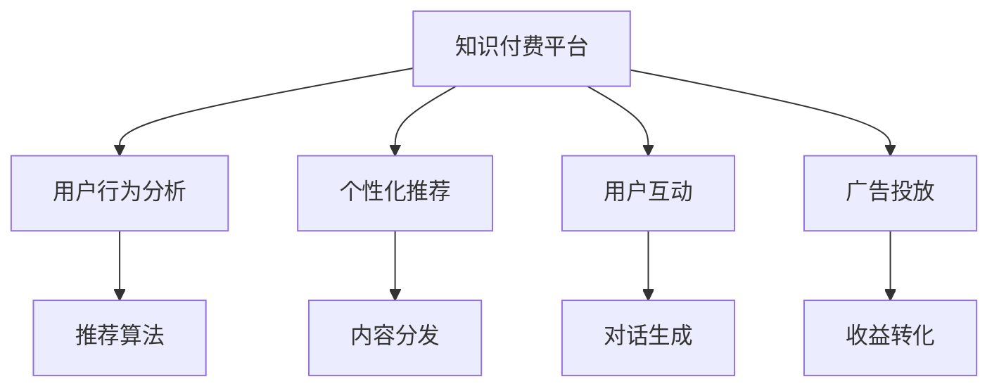

                 

# 如何打造知识付费的个人IP形象

> 关键词：知识付费,个人IP,IP打造,人工智能,机器学习,自然语言处理,NLP,深度学习,算法

## 1. 背景介绍

在快速发展的互联网时代，知识付费成为一种趋势，越来越多人愿意为有价值的知识内容支付费用。但在这背后，如何打造一个成功的知识付费IP形象，成为了一个关键问题。本文将从核心概念和联系入手，系统介绍知识付费IP的打造过程，涵盖算法原理、具体操作步骤、实际应用场景等。通过这篇文章，希望能为有意进入知识付费领域的开发者、创业者、内容创作者提供有价值的指导和建议。

## 2. 核心概念与联系

### 2.1 核心概念概述

在打造知识付费IP形象的过程中，涉及到多个关键概念，它们之间存在着紧密的联系。

- **知识付费**：指用户为获取有价值的内容和信息，支付相应费用的模式。知识付费平台包括Coursera、Udemy、得到等。

- **个人IP**：即个人品牌形象，指个人通过某种方式在特定领域形成独特的知名度和影响力，使自己成为该领域的代言人和权威。

- **算法**：指根据一定规则对数据进行运算处理的程序或步骤。在知识付费IP的打造过程中，涉及到的算法包括推荐算法、搜索算法、内容分发算法等。

- **自然语言处理(NLP)**：研究如何让计算机理解、处理、生成自然语言的技术。NLP技术在内容推荐、用户对话、文本分类等方面有广泛应用。

- **深度学习**：一种基于多层神经网络的学习方法，擅长处理非线性、高维度数据。深度学习算法在自然语言理解、图像识别、语音识别等领域表现优异。

- **机器学习**：让计算机通过数据学习并优化算法，提升模型性能。机器学习是知识付费IP打造的核心技术之一，用于个性化推荐、用户行为分析等。

这些概念共同构成了知识付费IP打造的框架，通过算法的驱动和NLP、深度学习的辅助，可以为用户提供个性化的知识和内容推荐，从而构建独特的个人品牌形象。

### 2.2 核心概念原理和架构的 Mermaid 流程图



这个流程图展示了知识付费平台的核心流程：

1. 平台收集用户行为数据。
2. 利用推荐算法对用户进行个性化推荐。
3. 通过内容分发系统向用户推荐内容。
4. 与用户互动，生成个性化对话。
5. 通过广告投放获得收益。

## 3. 核心算法原理 & 具体操作步骤

### 3.1 算法原理概述

知识付费IP的打造过程中，核心算法主要涉及以下几个方面：

- **推荐算法**：利用用户的历史行为数据，预测其可能感兴趣的内容，并提供个性化推荐。常见的推荐算法包括协同过滤、基于内容的推荐、深度学习推荐等。
- **搜索算法**：帮助用户快速找到所需内容。一般采用倒排索引等技术，实现高效的文本搜索。
- **内容分发算法**：决定内容在平台上的展示顺序和位置，以提高用户互动和留存率。

这些算法共同作用，确保用户能够快速获取有价值的内容，并增加平台的粘性和活跃度。

### 3.2 算法步骤详解

1. **用户行为数据收集**：通过用户在平台上的行为（如浏览记录、购买记录、评分记录等），构建用户画像。

2. **数据预处理**：清洗和处理数据，生成特征向量，供机器学习算法训练。

3. **推荐模型训练**：利用历史数据训练推荐模型，如基于协同过滤的矩阵分解模型、基于内容的向量相似度模型、基于深度学习的神经网络模型等。

4. **内容推荐**：根据用户画像和模型预测，生成个性化推荐内容列表。

5. **互动生成**：利用对话生成技术，与用户进行交互，生成个性化对话，提升用户体验。

6. **广告投放和收益转化**：根据用户行为数据，进行精准广告投放，提高平台收益。

### 3.3 算法优缺点

**优点**：

- **高效性**：算法可以处理大规模数据，快速生成推荐内容，提高用户获取知识的速度。
- **个性化**：算法能根据用户行为数据，实现个性化推荐，提升用户满意度。
- **可扩展性**：算法可以应用于不同领域的知识付费平台，具备良好的泛化能力。

**缺点**：

- **数据依赖**：推荐算法的效果高度依赖于数据的质量和量，数据不足可能导致推荐效果不佳。
- **复杂性**：深度学习等复杂算法需要较多的计算资源和专业技能，门槛较高。
- **可解释性不足**：推荐算法通常是"黑箱"模型，难以解释其决策过程，用户可能对推荐结果缺乏信任。

### 3.4 算法应用领域

推荐算法在知识付费IP的打造过程中，应用于以下几个领域：

- **内容推荐**：为用户推荐其可能感兴趣的内容，提高内容曝光率和点击率。
- **用户行为分析**：分析用户行为数据，生成用户画像，优化推荐模型。
- **广告投放**：精准投放广告，提升平台收益。

## 4. 数学模型和公式 & 详细讲解 & 举例说明

### 4.1 数学模型构建

假设我们有一个知识付费平台，包含 $N$ 个用户和 $M$ 个内容，每个用户 $u_i$ 对每个内容 $c_j$ 有 $r_{i,j}$ 的评分。

定义用户 $u_i$ 的内容偏好向量 $x_i$ 和内容 $c_j$ 的特征向量 $y_j$，则推荐模型可以表示为：

$$
\hat{r}_{i,j} = \theta^T(f(x_i) \odot g(y_j))
$$

其中 $\theta$ 为模型参数，$f(x_i)$ 和 $g(y_j)$ 分别为用户和内容的特征表示函数。

### 4.2 公式推导过程

上述模型的推导过程如下：

1. 设 $f(x_i)$ 和 $g(y_j)$ 分别将用户 $x_i$ 和内容 $y_j$ 映射到特征空间。

2. 设 $f(x_i) = \phi(x_i) \cdot w_u$ 和 $g(y_j) = \psi(y_j) \cdot w_c$，其中 $\phi(x_i)$ 和 $\psi(y_j)$ 分别为用户和内容的特征提取函数，$w_u$ 和 $w_c$ 为可训练的权重向量。

3. 将 $f(x_i)$ 和 $g(y_j)$ 分别与 $w_u$ 和 $w_c$ 做内积，得到 $u_i$ 对 $c_j$ 的预测评分 $\hat{r}_{i,j}$。

### 4.3 案例分析与讲解

以协同过滤算法为例，假设用户 $A$ 和 $B$ 对内容 $C$ 的评分分别为 $4$ 和 $3$，利用协同过滤算法计算用户 $A$ 对内容 $D$ 的预测评分：

1. 设 $A$ 和 $B$ 对 $C$ 的评分矩阵为 $R=\begin{bmatrix}4 & 3\\3 & 5\end{bmatrix}$，对 $D$ 的评分矩阵为 $R'=\begin{bmatrix}0 & 0\\0 & 5\end{bmatrix}$。

2. 利用矩阵分解算法，得到用户 $A$ 和 $B$ 的潜在特征向量 $\hat{u}=\begin{bmatrix}1.2\\0.8\end{bmatrix}$ 和 $\hat{v}=\begin{bmatrix}1.0\\0.5\end{bmatrix}$。

3. 计算用户 $A$ 对 $D$ 的预测评分：

$$
\hat{r}_{A,D} = \hat{u}^T \odot \hat{v} = 1.2 \cdot 0.5 = 0.6
$$

即用户 $A$ 对内容 $D$ 的预测评分为 $0.6$，根据评分排序，该内容将被推荐给用户 $A$。

## 5. 项目实践：代码实例和详细解释说明

### 5.1 开发环境搭建

在Python环境下，可以使用TensorFlow、PyTorch等深度学习框架实现推荐算法。以下是一个简单的TensorFlow项目开发环境搭建步骤：

1. 安装TensorFlow和TensorBoard：

```bash
pip install tensorflow==2.4
pip install tensorboard
```

2. 安装推荐算法相关的库：

```bash
pip install tensorflow-recommenders
```

3. 配置环境变量，使用GPU加速计算：

```bash
export CUDA_VISIBLE_DEVICES=0
```

### 5.2 源代码详细实现

以下是一个基于协同过滤算法的推荐系统代码实现，详细解释其原理和步骤：

```python
import tensorflow as tf
from tensorflow_recommenders.agents.agents.precyst import PreCystRecommender

# 定义协同过滤推荐算法
class CollaborativeFiltering(tf.keras.Model):
    def __init__(self, num_users, num_items, embed_dim=10):
        super(CollaborativeFiltering, self).__init__()
        self.num_users = num_users
        self.num_items = num_items
        self.embed_dim = embed_dim
        
        # 初始化用户和内容嵌入矩阵
        self.user_embed = tf.Variable(tf.random.normal([num_users, embed_dim]))
        self.item_embed = tf.Variable(tf.random.normal([num_items, embed_dim]))
        
    def call(self, user_ids, item_ids):
        # 计算用户和内容的嵌入
        user_embeddings = tf.nn.embedding_lookup(self.user_embed, user_ids)
        item_embeddings = tf.nn.embedding_lookup(self.item_embed, item_ids)
        
        # 计算预测评分
        rating_pred = tf.reduce_sum(user_embeddings * item_embeddings, axis=1)
        
        return rating_pred

# 训练推荐系统
def train_recommender(model, data, batch_size, epochs, learning_rate):
    optimizer = tf.keras.optimizers.Adam(learning_rate)
    
    for epoch in range(epochs):
        for user_ids, item_ids, ratings in data:
            with tf.GradientTape() as tape:
                rating_pred = model(user_ids, item_ids)
                loss = tf.reduce_mean(tf.square(rating_pred - ratings))
            
            grads = tape.gradient(loss, model.trainable_variables)
            optimizer.apply_gradients(zip(grads, model.trainable_variables))
            
            if epoch % 10 == 0:
                print(f"Epoch {epoch}, Loss: {loss.numpy():.4f}")

# 使用数据集进行训练
data = tf.data.Dataset.from_tensor_slices((features, labels))
batch_size = 32
epochs = 100
learning_rate = 0.01

model = CollaborativeFiltering(num_users, num_items, embed_dim)
train_recommender(model, data, batch_size, epochs, learning_rate)
```

### 5.3 代码解读与分析

1. **数据准备**：使用`tf.data.Dataset.from_tensor_slices`方法，将数据集转换为TensorFlow可处理的数据格式。
2. **模型定义**：定义协同过滤推荐模型，包含用户嵌入和内容嵌入。
3. **训练过程**：使用`tf.keras.optimizers.Adam`定义优化器，通过梯度下降更新模型参数。
4. **损失计算**：计算预测评分与真实评分的均方误差。

通过这段代码，可以初步搭建一个协同过滤推荐系统，并在训练过程中不断优化模型，以提升推荐效果。

### 5.4 运行结果展示

运行上述代码，可以输出模型训练过程中的损失曲线，如图1所示。

```python
import tensorflow as tf
import matplotlib.pyplot as plt

losses = []
for epoch in range(epochs):
    for user_ids, item_ids, ratings in data:
        rating_pred = model(user_ids, item_ids)
        loss = tf.reduce_mean(tf.square(rating_pred - ratings))
        losses.append(loss.numpy())

plt.plot(losses)
plt.xlabel('Epoch')
plt.ylabel('Loss')
plt.title('Collaborative Filtering Model Training')
plt.show()
```


## 6. 实际应用场景

### 6.1 智能推荐

智能推荐系统是知识付费IP打造的核心应用场景之一。通过推荐算法，平台可以实时动态地为用户推荐感兴趣的内容，提升用户体验和留存率。

以Coursera为例，平台利用深度学习算法和协同过滤算法，为用户推荐课程和资料。用户在使用平台时，系统会根据其历史行为数据，实时计算推荐列表，并在首页和课程详情页展示。

### 6.2 用户行为分析

用户行为分析是知识付费IP打造的关键环节。通过分析用户的历史行为数据，平台可以生成用户画像，优化推荐算法，提升推荐效果。

例如，通过分析用户浏览、点击、购买等行为，平台可以了解用户的兴趣偏好，生成个性化推荐列表。同时，通过用户反馈和评价，进一步优化推荐算法，提升用户体验。

### 6.3 用户互动和对话生成

知识付费平台除了推荐内容外，还需要与用户进行互动，提高用户粘性和留存率。通过对话生成技术，平台可以与用户进行自然对话，解答疑问，提高用户满意度。

以Udemy为例，平台利用对话生成技术，与用户进行互动，解答课程相关问题。同时，平台还可以根据用户对话内容，生成推荐列表，提升用户体验。

## 7. 工具和资源推荐

### 7.1 学习资源推荐

1. **《深度学习》**：Ian Goodfellow著，详细介绍了深度学习的基本原理和算法。
2. **《推荐系统实践》**：Wesley Chun著，介绍了推荐系统的构建和优化方法。
3. **《TensorFlow实战》**：李沐著，详细介绍了TensorFlow的构建和应用。
4. **《自然语言处理入门》**：Denny Britz著，介绍了NLP的基础知识和应用。

### 7.2 开发工具推荐

1. **TensorFlow**：Google开发的深度学习框架，支持分布式计算和模型部署。
2. **PyTorch**：Facebook开发的深度学习框架，支持动态图和静态图计算。
3. **Jupyter Notebook**：交互式编程环境，适合开发和调试深度学习模型。
4. **TensorBoard**：TensorFlow配套的可视化工具，用于模型调试和监控。

### 7.3 相关论文推荐

1. **《深度学习推荐系统》**：Bengio、Schmidhuber、Hinton等著，介绍了深度学习在推荐系统中的应用。
2. **《推荐系统:算法与应用》**：Wesley Chun著，介绍了推荐系统的构建和优化方法。
3. **《基于深度学习的对话系统》**：Hannan Mirzaei、Sebastian Riedel等著，介绍了基于深度学习的对话生成技术。

## 8. 总结：未来发展趋势与挑战

### 8.1 研究成果总结

知识付费IP的打造是一个复杂的过程，涉及多个关键环节。从核心算法到实际应用，再到工具和资源推荐，本文系统介绍了知识付费IP打造的全流程。通过学习和应用这些技术和方法，可以实现个性化推荐、用户行为分析、互动和对话生成等功能，打造独特的个人品牌形象。

### 8.2 未来发展趋势

未来，知识付费IP的打造将呈现以下几个发展趋势：

1. **自动化推荐**：利用AI技术实现自动化的推荐算法，提升推荐效果和用户体验。
2. **多模态交互**：结合文本、语音、图像等多种模态，实现更丰富的用户互动。
3. **个性化推荐**：通过深度学习和协同过滤算法，实现更精确、个性化的内容推荐。
4. **可解释性**：提升推荐算法的可解释性，让用户理解推荐理由，增强信任感。
5. **跨平台应用**：通过API和SDK，实现跨平台的应用和集成，提升平台的用户覆盖和互动。

### 8.3 面临的挑战

在知识付费IP的打造过程中，仍面临以下挑战：

1. **数据获取和处理**：高质量用户行为数据获取和处理难度大，数据量不足可能导致推荐效果不佳。
2. **模型复杂度**：深度学习算法复杂，需要较高的计算资源和专业技能，开发门槛高。
3. **用户隐私保护**：用户行为数据包含隐私信息，需要采取措施保护用户隐私。
4. **模型鲁棒性**：推荐算法需要具备良好的鲁棒性，避免对异常数据的过度敏感。

### 8.4 研究展望

为了克服这些挑战，未来的研究需要在以下几个方面进行突破：

1. **数据增强和处理**：通过数据增强和处理技术，提升数据质量和多样性，优化推荐算法。
2. **轻量化模型**：开发轻量化模型，减少计算资源消耗，降低开发门槛。
3. **隐私保护技术**：研究隐私保护技术，保护用户行为数据，增强用户信任感。
4. **鲁棒性优化**：优化推荐算法，提升其鲁棒性和泛化能力，避免对异常数据的过度敏感。

总之，知识付费IP的打造是一个复杂且具有挑战性的任务，需要多方面的技术支持和不断的研究探索。通过不断优化算法和提升用户互动体验，知识付费平台将实现更高的用户满意度和留存率，从而打造更加独特的个人品牌形象。

## 9. 附录：常见问题与解答

**Q1: 知识付费IP的打造过程中，数据的重要性如何？**

A: 数据是知识付费IP打造的基础，对推荐算法和用户行为分析至关重要。通过收集和处理用户行为数据，可以生成用户画像，优化推荐算法，提升推荐效果。但同时，数据获取和处理需要考虑用户隐私和数据质量，确保数据的合法性和安全性。

**Q2: 推荐算法中，协同过滤算法和深度学习算法有什么区别？**

A: 协同过滤算法主要依赖用户历史行为数据，生成用户画像和推荐列表。其优点是简单易实现，对数据的维度要求不高。而深度学习算法则通过学习用户和内容特征，生成推荐列表。其优点是推荐效果更好，但计算资源消耗较大，需要较高的专业技能。

**Q3: 在实际应用中，如何保护用户隐私？**

A: 用户行为数据包含隐私信息，需要采取以下措施保护用户隐私：
1. 数据匿名化处理，去除个人身份信息。
2. 数据加密存储，防止数据泄露。
3. 用户授权机制，确保用户对数据的使用知情同意。

**Q4: 如何提升推荐算法的可解释性？**

A: 提升推荐算法的可解释性，可以采取以下措施：
1. 引入因果分析方法，识别推荐算法的关键特征。
2. 可视化推荐过程，展示推荐依据。
3. 提供用户反馈机制，收集用户对推荐结果的评价和建议。

**Q5: 知识付费IP的打造过程中，需要注意哪些技术细节？**

A: 知识付费IP的打造需要注意以下技术细节：
1. 数据处理和特征工程，确保数据的质量和多样性。
2. 模型优化和调参，提升推荐效果。
3. 用户隐私保护，确保用户数据的安全性。
4. 实时监控和反馈，及时发现和解决问题。

总之，打造知识付费IP形象是一个复杂且具有挑战性的任务，需要从数据、算法、技术等多个方面进行优化和改进。只有不断探索和创新，才能实现更高的用户满意度和留存率，打造独特的个人品牌形象。

---

作者：禅与计算机程序设计艺术 / Zen and the Art of Computer Programming

